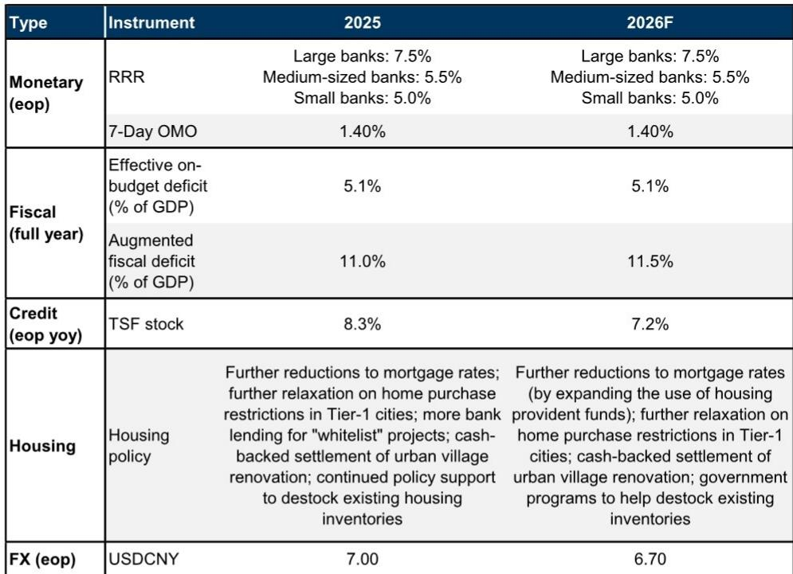

# GS：区域环境与行业变化观察

7月30日召开的政治局会议，为下半年宏观政策定下基调。GS中国宏观团队在会后第一时间发布的解读中判断，决策层对宏观环境转型方向保持信心，但对近期内需逆风的措辞比4月会议更为谨慎。报告的核心观察是：政策重心落在“加快落实已规划措施”上，而非短期内推出新一轮刺激。

这份报告值得关注的信号在于，会议通稿中“加大宏观政策调控力度”“加强逆周期调节”等表述，与GS此前对下半年政策路径的预期一致。报告据此维持对财政、货币、地产、消费四个领域的基准判断，并提示了政策执行中可能存在的摩擦。

## 1. 财政政策聚焦债券发行与资金使用进度

GS认为，下半年财政政策的关键词是“发力提效”。会议明确提出“加快财政支出和债券发行使用进度”，并强调推进“两重”项目、消费品以旧换新和设备更新。这与财政部长蓝佛安7月23日在《人民日报》署名文章中的口径一致。

报告测算，截至2025年底，中央和地方层面累计沉淀的未使用政府债券额度约1.8万亿元，其中中央政府债券0.6万亿元、地方政府债券1.2万亿元。在财政部批准的前提下，这部分存量额度可较快调用。GS预计，中央和地方政府将在未来数月加快债券发行和资金拨付，同时推进今年新增的8000亿元新型政策性资金工具落地——这一规模高于去年的5000亿元。

> **KC评论：** 1.8万亿元存量额度的存在，意味着财政发力的空间不完全依赖新增预算。但报告也提示，地方层面的政治换届、反腐不确定性和问责不确定性，仍可能影响资金落地的实际速度。

## 2. 货币宽松预期维持，降准降息窗口未开

货币政策方面，会议重申“实施更加积极的财政政策和适度宽松的货币政策”，并要求宏观政策“发力提效”。GS注意到，与4月会议相比，本次通稿删去了“保持流动性合理充裕”和“保持人民币汇率在合理均衡水平上的基本稳定”的表述，转而要求“综合运用多种货币政策工具，适时调整”。

基于这一措辞变化，GS维持此前判断：2026年余下时间不会下调政策利率或存款准备金率。但报告同时留有余地——如果增长进一步节奏变化，高规格的货币宽松动作可能变得更加可能。央行更可能通过隔夜逆回购、买断式逆回购、国债买卖等流动性管理工具，维持资金面大体宽松。

## 3. 地产政策延续渐进放松，消费刺激力度有限

住房政策方面，GS预计更多大城市将跟进上海、深圳，放松本地购房限制，但放松幅度可能温和、节奏渐进。潜在工具包括扩大住房公积金使用范围以降低综合房贷利率、推进城中村改造的现金化安置、以及加快地方政府主导的存量商品房去库存。

消费是这份报告中态度最谨慎的领域。尽管会议通稿强调“扩大国内需求”“挖掘服务消费潜力”，GS并不预期下半年会出现超出“两会”已规划范围的新增消费刺激。报告认为，消费品以旧换新、社保边际增强、消费相关贷款临时贴息等措施会继续推进，但劳动力市场偏弱、收入预期仍在调整、房地产财富效应不利，意味着这些措施对增长的合计拉动仍然有限。

> **KC评论：** GS对消费的判断值得注意：政策沟通频率在增加，但工具组合没有本质变化。报告隐含的意思是，消费修复更多依赖就业和收入预期的自发改善，而非政策刺激的力度。

## 4. 观察下半年政策节奏的三个时间节点

报告附录列出下半年中国市场需要关注的宏观催化剂：10月二十届五中全会、11月初中期选举后的外部环境变化、以及12月中央宏观环境工作会议。GS认为，五中全会的主题聚焦党建，宏观环境政策信号仍将主要来自12月的政治局会议和中央宏观环境工作会议。

对于产业决策者而言，这份报告提供的观察框架是：政策基调已从“是否放松”转向“放松多快落地”。债券发行进度、新型政策性资金工具的投放节奏、以及大城市地产政策的跟进范围，是检验下半年政策执行力的三个可跟踪指标。报告同时提示，项目回报率下降可能成为“十五五”开局之年项目储备的约束，但第一年尚不构成主要瓶颈。

For informational purposes only. Portions may be generated,translated,summarized,or edited with AI assistance based on source materials and may contain omissions or errors. Please verify independently. This is not investment,legal,tax,accounting,or other professional advice.

For informational purposes only. Portions may be generated,translated,summarized,or edited with AI assistance based on source materials and may contain omissions or errors. Please verify independently. This is not investment,legal,tax,accounting,or other professional advice.

