EM IN FOCUS

# 新兴市场产出缺口——增长空间可观，但格局分化

■ 测算产出缺口——即实际产出与潜在产出之间的差异——并非易事，但若不对经济整体闲置产能的程度形成一定判断，便难以评估增长前景、宏观政策走向以及资产价格表现。

Basak Edizgil  
+44(20)7774-9878 |  
basak.edizgil@gs.com  
GS International

Kevin Daly  
+44(20)7774-5908 | kevin.daly@gs.com  
GS International

我们更新了22个新兴市场经济体的生产函数产出缺口估算。这些估算旨在便于跨国比较，并应视为各国经济研究员所提供数据的补充。作为交叉验证，我们将其与国际组织（如OECD）及统计滤波方法的结果进行了对比。

我们的分析显示，多数新兴市场经济体仍在接近或低于潜在产出的水平运行，各区域和经济体之间存在明显分化。自上次更新以来，中欧、中东及非洲地区（CEEMEA）和中国的产出缺口进一步走负——即闲置产能有所增加——而拉美整体接近潜在产出，除中国外的亚洲新兴市场则已转入正区间。

☐ 亚洲新兴市场：我们不认为台湾、韩国、香港和马来西亚由半导体带动的快速增长是普遍过热的证据。我们估算的韩国产出缺口仍为负值，其他经济体仅小幅为正。包括我们自身估算在内的多数中国产出缺口测算，目前均指向经济中存在较为可观的闲置产能。

☐ 拉美整体接近潜在产出水平，阿根廷、墨西哥和智利存在闲置产能，而巴西产出高于潜在水平，形成对冲。

☐ 在CEEMEA地区，中欧地区和南非的总需求仍明显低于供给能力。土耳其和俄罗斯的增长自上次更新以来持续放缓，但两国经济仍在高于产能的水平运行，对通胀形成一定推动。

## 新兴市场产出缺口——增长空间可观，但格局分化

测算产出缺口——即实际产出与潜在产出之间的差异——并非易事，但若不对经济整体闲置产能的程度形成一定判断，便难以评估增长前景、宏观政策走向以及资产价格表现。

在本期EM in Focus中，我们更新了22个新兴市场经济体的生产函数产出缺口估算。我们此前已在此处详细阐述方法论。简言之，我们的方法考察潜在产出的基本驱动因素——资本、劳动力和技术——以计算劳动力和资本使用缺口，并将这些估算合并得出整体产出缺口。

鉴于产出缺口估算本身存在固有不确定性，我们的估算不应被视为对任何特定经济体闲置产能的最终判断（尤其是我们的统一方法可能无法完全捕捉各国的独特特征）。因此，我们将结果与其他多种估算并列呈现，包括OECD等国际组织及统计滤波方法得出的结果。

## 自上次更新以来，CEEMEA和拉美负缺口小幅扩大，除中国外的亚洲新兴市场转入正区间

图表1展示了我们对CEEMEA、亚洲新兴市场和拉美的区域产出缺口估算；样本中22个新兴市场经济体的详细估算见附录。结果显示各区域和经济体之间存在明显分化，多数在低于潜在产出的水平运行，但也有部分略高于潜在水平。自上次更新以来，CEEMEA和中国的产出缺口进一步走负，拉美整体接近潜在产出，除中国外的亚洲新兴市场则转入正区间。

CEEMEA：大多数CEEMEA经济体——尤其是中欧地区和南非——自疫情后反弹以来增长低于潜在水平，闲置产能有所打开。但情况并不均衡。土耳其和俄罗斯在此前过热后增长放缓，但两国经济仍略高于产能运行。

亚洲新兴市场：在相对强劲增长的支撑下，除中国外的亚洲新兴市场产出缺口在过去一年总体向更积极的方向发展。但据我们评估，这种强势在很大程度上是供给驱动的，产出缺口仅温和为正。对于受益于半导体热潮的经济体尤其如此：由于强势集中在少数企业，并未导致劳动力市场条件的广泛收紧。¹ 我们估算的台湾、香港和马来西亚产出缺口仅小幅为正，韩国为负。相反，菲律宾增长明显放缓，此前的过热有所消退，而泰国和中国继续在低于产能的水平运行。

拉美：拉美整体接近潜在产出，阿根廷存在明显闲置产能——墨西哥和智利程度较轻——被巴西高于潜在水平的产出所抵消。哥伦比亚自2024年以来增长回升，我们的估算目前指向温和的过热。

图表1：我们的区域产出缺口估算——除中国外的亚洲新兴市场和拉美接近潜在水平，CEEMEA和中国低于潜在水平

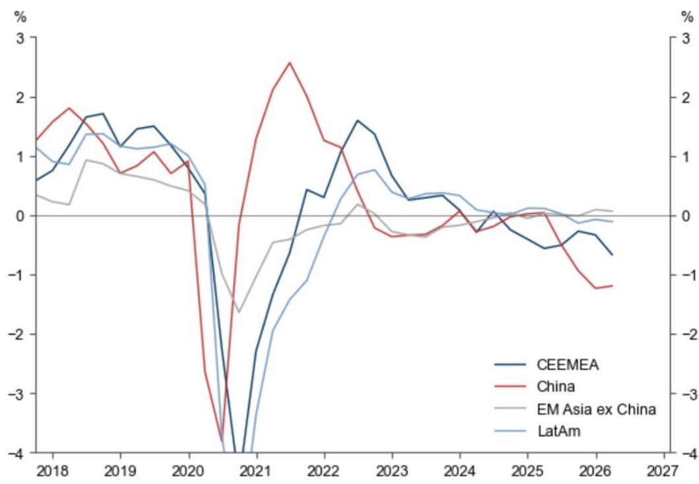  
来源：GS Global Investment Research

图表2比较了最新（2026年第二季度）读数。我们的结果显示南非、除波兰外的中欧地区、韩国、中国、智利和阿根廷存在较为可观的闲置产能。自上次更新以来，台湾的产出缺口由小幅负值转为小幅正值，除波兰外的中欧地区、韩国和阿根廷基本保持不变，中国和智利有所扩大。由于闲置产能较大，这些经济体在未来数年最有可能实现高于趋势的增长而不产生通胀压力。反之，目前没有新兴市场经济体呈现显著的正产出缺口，尽管巴西的活动仍高于潜在水平。

我们的估算与替代方法的中间值总体一致，台湾和南非是主要例外。在台湾，基于统计滤波的传统产出缺口估算方法所隐含的正缺口远大于我们的估算，因为这些方法将实际GDP的快速增长——由少数半导体企业驱动且对整体经济的溢出有限——视为普遍过热的证据。

  
来源：GS Global Investment Research

## 对工资增长和通胀的启示

我们评估产出缺口估算对通胀和工资增长的含义。在过热的经济体中，较强的劳动力需求通常对工资形成上行压力，而闲置产能通过削弱劳动者的议价能力，往往产生相反的作用。尽管此类工资压力在历史上曾传导至通胀，但近几十年来这种关系变得不那么稳定，因为供应链更加全球化，外部因素在新兴市场通胀动态中开始发挥更大作用。在我们样本中的新兴经济体中，估算结果显示经济闲置与工资缺口——定义为工资增长偏离与目标一致水平的程度——之间存在较强相关性，产出高于潜在水平伴随较大的工资超调，反之亦然（图表3，左图）。然而，与跨国证据显示菲利普斯曲线趋平一致，我们发现产出缺口与通胀缺口之间的关系较弱，但仍为正相关（图表3，右图）。

在匈牙利和捷克，存在较大闲置产能，相对强劲的工资增长在很大程度上反映了实际工资向疫情前趋势的追赶，考虑到这些经济的开放程度以及外部因素在其通胀中的主导作用，这对通胀的担忧较小。另一方面，哥伦比亚和巴西的正产出缺口和紧张劳动力市场使去通胀进程复杂化，导致哥伦比亚重新进入加息周期，巴西的宽松步伐更为谨慎。土耳其和俄罗斯的工资增长也仍然较高，尽管这两个国家的产出缺口近期有所收窄。

图表3：正产出缺口的经济体工资增长通常较高  
核心通胀（工资）缺口定义为核心通胀（工资增长）偏离目标（与目标一致水平）的程度，基于2026年第一季度数据。产出缺口估算滞后一个季度（2025年第五季度）  
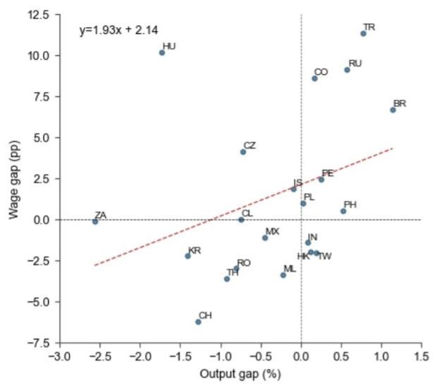  
Basak Edizgil and Kevin Daly  
来源：GS Global Investment Research

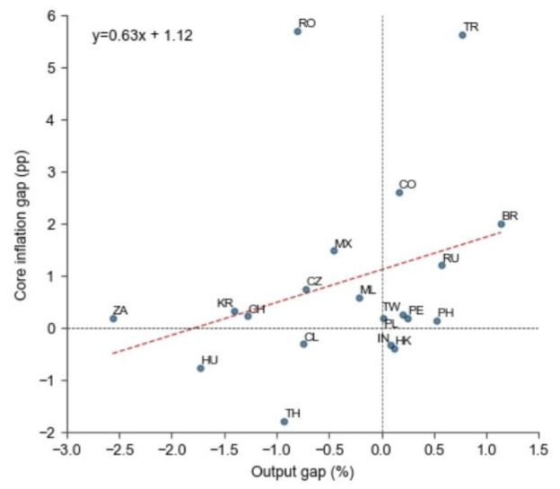

## 附录：各国估算

## 波兰

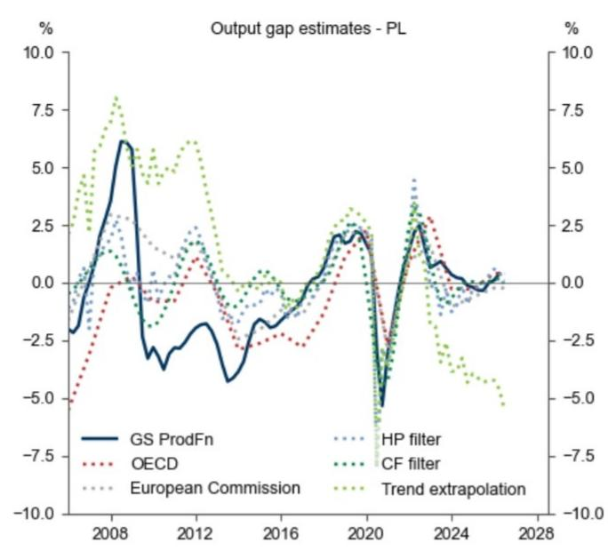  
来源：GS Global Investment Research, OECD, European Commission

匈牙利  
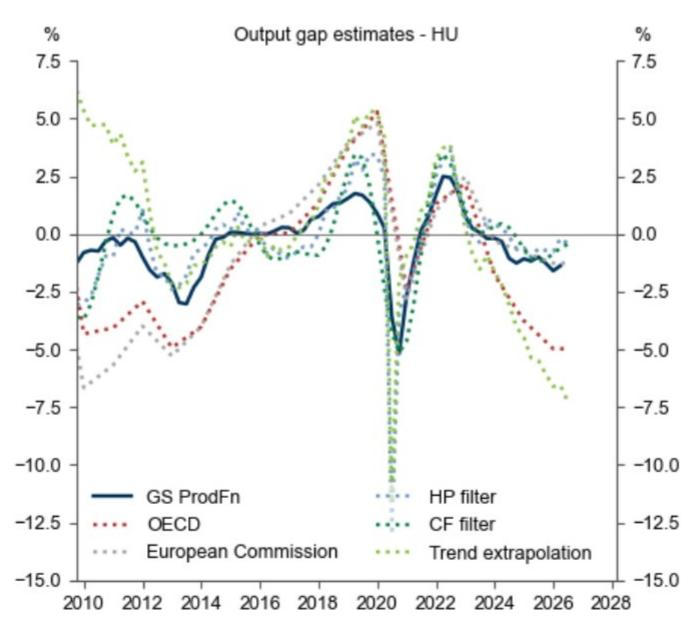  
来源：GS Global Investment Research, OECD, European Commission

捷克  
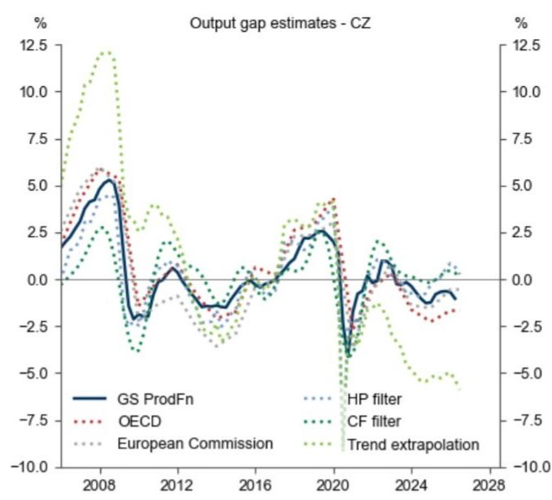  
来源：GS Global Investment Research, OECD, European Commission

## 罗马尼亚

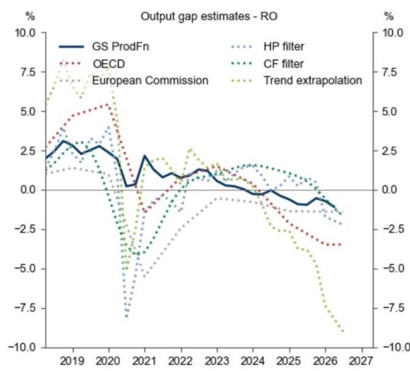  
来源：GS Global Investment Research, OECD, European Commission

土耳其  
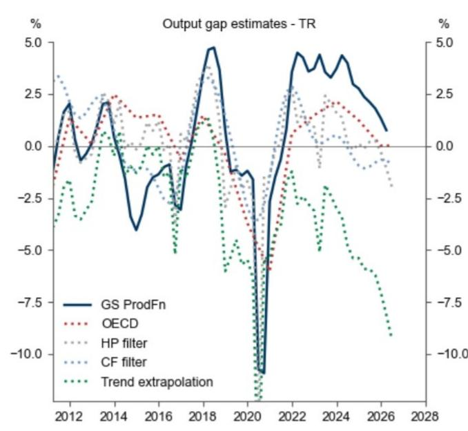  
来源：GS Global Investment Research, OECD

## 南非

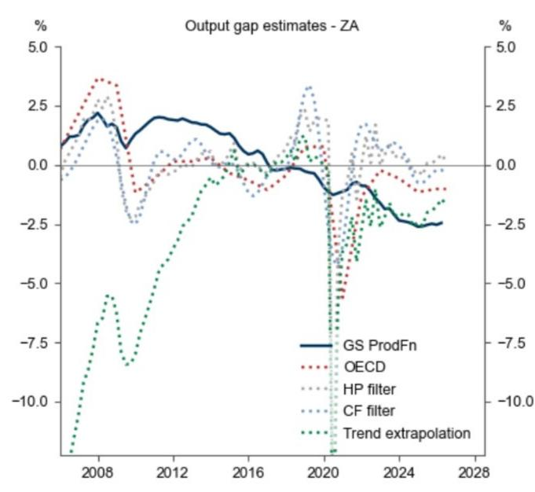  
来源：GS Global Investment Research

以色列  
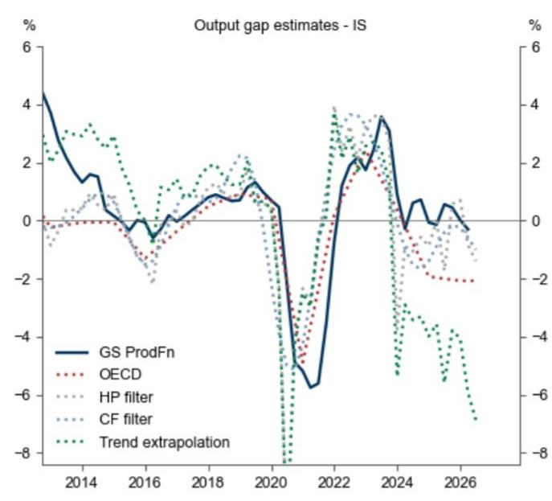  
来源：GS Global Investment Research, OECD

俄罗斯  
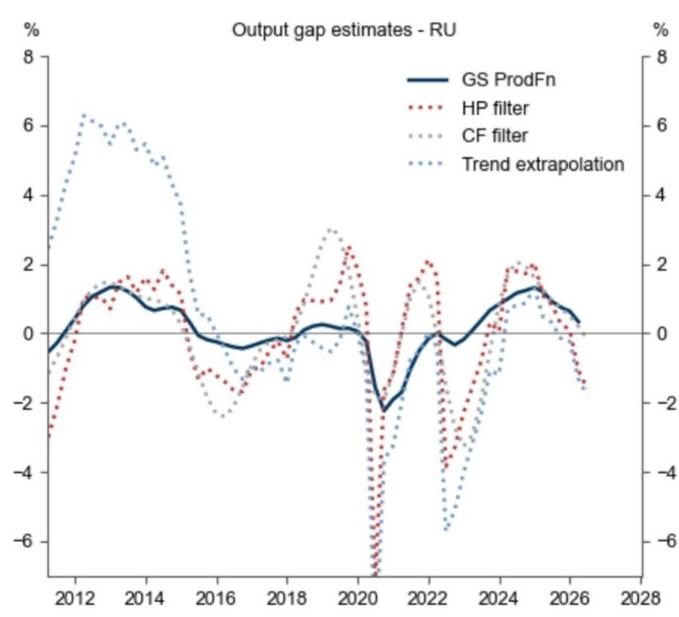  
来源：GS Global Investment Research

中国  
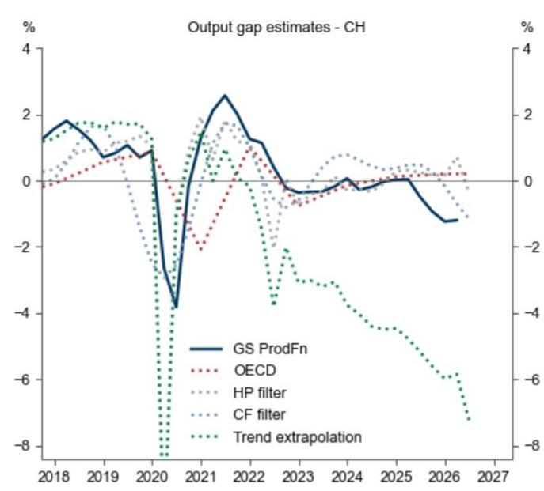  
来源：GS Global Investment Research

## 韩国

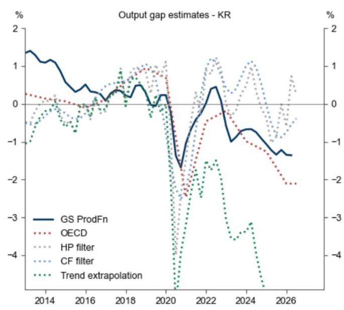  
来源：GS Global Investment Research, OECD

## 台湾

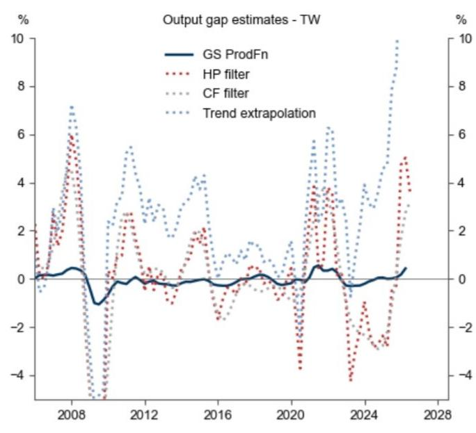  
来源：GS Global Investment Research

## 泰国

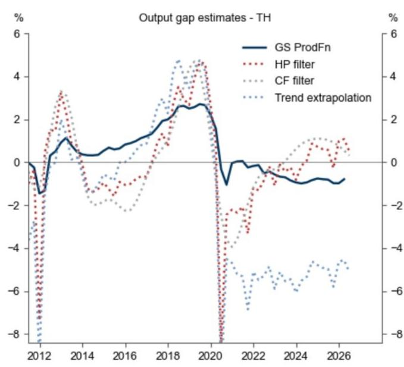  
来源：GS Global Investment Research

马来西亚  
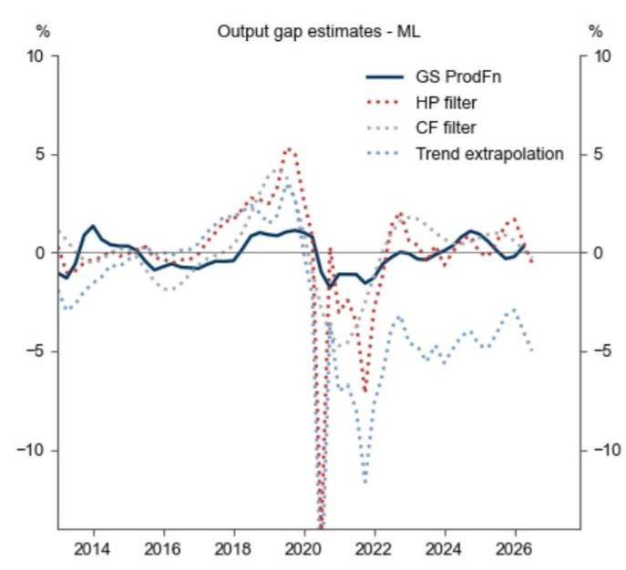  
来源：GS Global Investment Research

## 印度

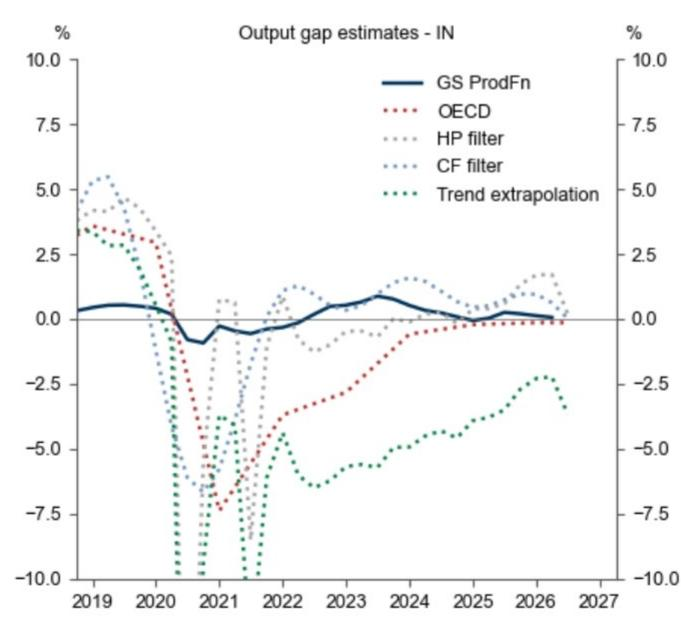  
来源：GS Global Investment Research

菲律宾  
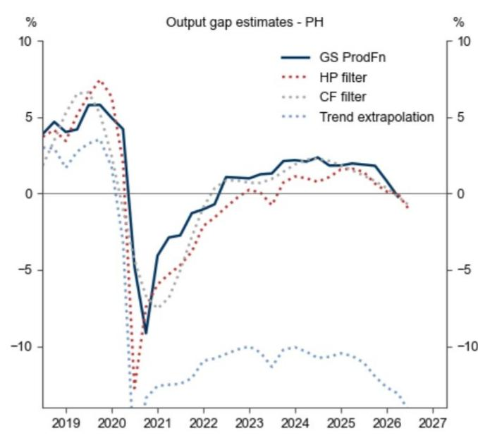  
来源：GS Global Investment Research

## 香港

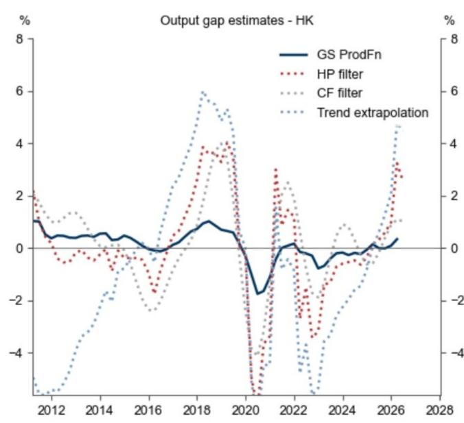  
来源：GS Global Investment Research

## 墨西哥

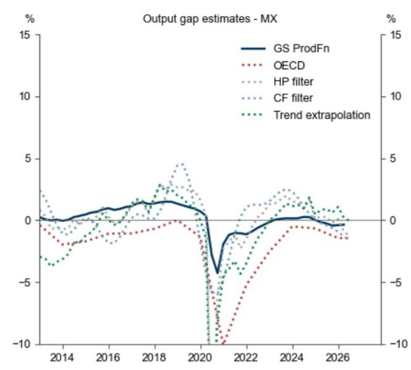  
来源：GS Global Investment Research, OECD

## 哥伦比亚

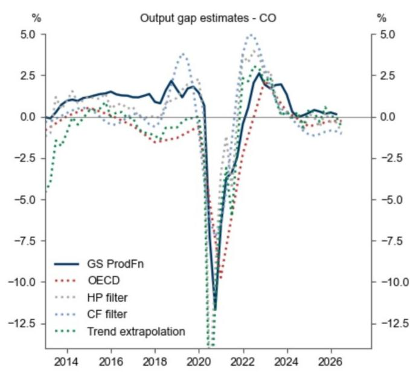  
来源：GS Global Investment Research, OECD

秘鲁  
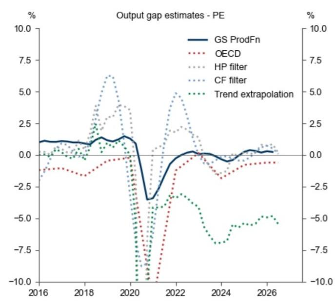  
来源：GS Global Investment Research

## 智利

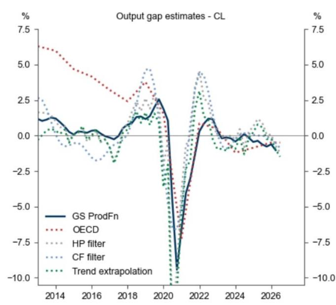  
来源：GS Global Investment Research, OECD

巴西  
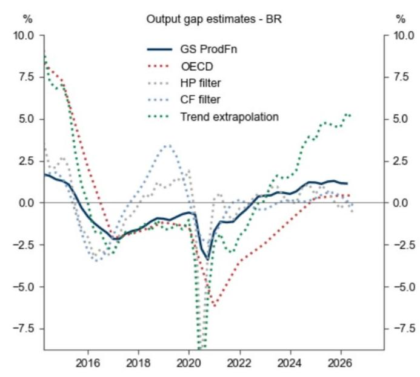  
来源：GS Global Investment Research

## 阿根廷

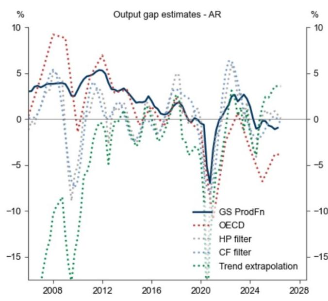  
来源：GS Global Investment Research

## 披露附录

## Reg AC

我们，Basak Edizgil和Kevin Daly，特此证明本报告中表达的所有观点均准确反映我们的个人观点，且未受公司业务或客户关系考量影响。

除非另有说明，本报告封面所列人员均为GS Global Investment Research的分析师。

贡献作者：Basak Edizgil GS International, Kevin Daly GS International。

除非另有说明，本报告贡献作者披露中所列人员均为GS Global Investment Research的分析师。

## 披露

## 监管披露

## 美国法律法规要求的披露

参见上述针对本报告所述公司的特定监管披露，包括以下任何一项：待定交易中的主承销商或联席主承销商；1%或以上的持股；特定服务的报酬；客户关系类型；此前期间的公开发行管理/共同管理；董事职位；就股票证券而言，做市和/或专家角色。GS交易或可能以本金身份交易本报告所述发行人的债务证券（或相关衍生品）。

以下为额外要求的披露：所有权和重大利益冲突：GS政策禁止其分析师、向分析师汇报的专业人员及其家庭成员持有分析师覆盖范围内任何公司的证券。分析师薪酬：分析师的薪酬部分基于GS的盈利能力，其中包括投资银行业务收入。分析师作为高管或董事：GS政策一般禁止其分析师、向分析师汇报的人员或其家庭成员在分析师覆盖范围内的任何公司担任高管、董事或顾问。非美国分析师：非美国分析师可能不是GS & Co. LLC的关联人员，因此可能不受FINRA规则2241或FINRA规则2242关于与标的公司沟通、公开露面及交易分析师所覆盖证券的限制。

## 美国以外司法管辖区法律法规要求的额外披露

以下为适用司法辖区要求的披露，但已根据美国法律法规在上述范围内作出的披露除外。澳大利亚：GS Australia Pty Ltd及其关联公司不是澳大利亚的授权存款机构（该术语定义见《1959年银行法》（联邦）），不提供银行服务，也不在澳大利亚从事银行业务。本研究及其任何访问权限仅面向《澳大利亚公司法》所定义的"批发客户"，除非GS另有约定。在撰写研究报告时，GS Australia的Global Investment Research成员可能参加其研究报告所涉公司和其他实体主办或组织的实地考察和其他会议。在某些情况下，此类实地考察或会议的费用可能部分或全部由相关发行人承担，前提是GS Australia认为在实地考察或会议的具体情况下这样做适当且合理。如果本文件内容包含任何金融产品建议，则该建议仅为一般性建议，由GS在未考虑客户的目标、财务状况或需求的情况下编制。客户在依据任何此类建议行事前，应考虑该建议是否适合其自身的目标、财务状况和需求。GS Australia和New Zealand的若干利益披露副本及GS的Australian Sell-Side Research Independence Policy Statement可在以下网址获取：https://www.goldmansachs.com/disclosures/australia-new-zealand/index.html。巴西：与CVM Resolution n. 20相关的披露信息可在https://www.gs.com/worldwide/brazil/area/gir/index.html获取。如适用，根据CVM Resolution n. 20第20条定义，本研究报告内容的主要负责巴西注册分析师为报告开头列出的第一作者，除非文末另有说明。加拿大：本信息仅供您参考，在任何情况下均不应被解释为GS & Co. LLC在加拿大为购买证券而向加拿大客户发出的广告、要约或招揽。GS & Co. LLC未在加拿大任何司法管辖区根据适用的加拿大证券法注册为交易商，通常不被允许交易加拿大证券，并可能被禁止在加拿大的某些司法管辖区销售某些证券和产品。如果您希望在加拿大交易任何加拿大证券或其他产品，请联系GS Canada Inc.（The GS Group Inc.的关联公司）或其他注册的加拿大交易商。香港：可应要求从GS (Asia) L.L.C.获取本研究中所述被覆盖公司证券的进一步信息。印度：可从GS (India) Securities Private Limited获取本研究中所述标的公司或公司的进一步信息，研究分析师 - SEBI注册号INH000001493，地址：10th Floor, Ascent-Worli, Sudam Kalu Ahire Marg, Worli, Mumbai-400 025, India，公司识别号U74140MH2006FTC160634，电话+91 22 6616 9000，传真+91 22 6616 9001。GS可能实益拥有本研究报告中所述标的公司或公司1%或以上的证券（该术语定义见印度《1956年证券合约（监管）法》第2(h)条）。SEBI颁发的注册和NISM的认证不以任何方式保证中介机构的业绩，也不为读者提供任何回报保证。GS (India) Securities Private Limited的合规官和读者投诉联系信息、年度合规审计报告副本及其他相关信息和披露可在以下链接找到：

https://www.goldmansachs.com/worldwide/india/research-analyst。日本：见下文。韩国：本研究及其任何访问权限仅面向《金融服务和资本市场法》所定义的"专业读者"，除非GS另有约定。可从GS (Asia) L.L.C.首尔分行获取本研究中所述标的公司或公司的进一步信息。新西兰：GS New Zealand Limited及其关联公司不是新西兰的"注册银行"或"存款接受者"（定义见《1989年新西兰储备银行法》）。本研究及其任何访问权限面向《2008年金融顾问法》所定义的"批发客户"，除非GS另有约定。GS Australia和New Zealand的若干利益披露副本可在以下网址获取：https://www.goldmansachs.com/disclosures/australia-new-zealand/index.html。俄罗斯：在俄罗斯联邦分发的研究报告不是俄罗斯法律所定义的广告，而是信息和分析，不以产品推广为主要目的，也不提供俄罗斯评估活动法律意义上的评估。研究报告不构成俄罗斯法律法规所定义的个性化研究交流，不针对特定客户，且未分析客户的财务状况、投资概况或风险概况。GS对客户或任何其他人基于本研究报告可能做出的任何投资决策不承担任何责任。新加坡：GS (Singapore) Pte.（公司编号：198602165W），受新加坡金融管理局监管，对本研究承担法律责任，如有与本研究报告相关或由此产生的任何事宜，应与其联系。台湾：本材料仅供参考，未经许可不得转载。读者应谨慎考虑自身投资风险。投资结果由个人读者自行负责。英国：在英国被归类为零售客户的个人（该术语定义见金融行为监管局规则）应结合此前GS关于本报告所述被覆盖公司的研究报告阅读本研究，并应参阅GS International已发送给他们的风险警告。这些风险警告的副本及本报告中使用的某些金融术语词汇表可向GS International索取。

欧盟和英国：与欧洲委员会授权条例(EU) (2016/958)第6(2)条相关的披露信息（该条例补充欧洲议会和理事会条例(EU) No 596/2014，包括该授权条例在英国退出欧盟和欧洲经济区后转化为英国国内法律和法规的情况），涉及研究交流或其他建议或暗示投资策略的信息的客观呈现技术安排以及特定利益或利益冲突迹象的披露，可在https://www.gs.com/disclosures/europeanpolicy.html获取，该页面阐述了与投资研究相关的利益冲突管理欧洲政策。

日本：GS Japan Co., Ltd.是在关东财务局注册的金融工具交易商，注册号Kinsho 69，是日本证券业协会、日本金融期货协会、日本第二类金融工具交易商协会和日本投资管理协会的会员。股票买卖需收取与客户预先确定的佣金外加消费税。参见公司特定披露中日本证券交易所、日本证券业协会或日本证券金融公司要求的任何适用披露。

## 全球产品；分发实体

GS Global Investment Research在全球范围内为GS客户制作和分发研究产品。GS全球各办事处的分析师对行业和公司以及宏观经济、货币、大宗商品和投资组合策略进行研究。本研究由以下机构分发：澳大利亚由GS Australia Pty Ltd (ABN 21 006 797 897)；巴西由GS do Brasil Corretora de Títulos e Valores Mobiliários S.A.；GS巴西公共沟通渠道：0800 727 5764和/或contatogoldmanbrasil@gs.com。工作日（节假日除外），上午9点至下午6点。Canal de Comunicação com o Público GS Brasil: 0800 727 5764 e/ou contatogoldmanbrasil@gs.com. Horário de funcionamento: segunda-feira à sexta-feira (exceto feriados), das 9h às 18h；加拿大由GS & Co. LLC；香港由GS (Asia) L.L.C.；印度由GS (India) Securities Private Ltd.；日本由GS Japan Co., Ltd.；韩国由GS (Asia) L.L.C.首尔分行；新西兰由GS New Zealand Limited；俄罗斯由OOO GS；新加坡由GS (Singapore) Pte.（公司编号：198602165W）；美国由GS & Co. LLC。GS International已批准本研究在英国的分发。

GS International（"GSI"）由审慎监管局（"PRA"）授权，并受金融行为监管局（"FCA"）和PRA监管，已批准本研究在英国的分发。

欧洲经济区：GS Bank Europe SE（"GSBE"）是一家在德国注册的信贷机构，在单一监管机制下受欧洲中央银行直接审慎监管，并在其他方面受德国联邦金融监管局（Bundesanstalt für Finanzdienstleistungsaufsicht, BaFin）和德意志联邦银行监管，并在欧洲经济区内分发研究。

## 一般披露

本研究仅供我们的客户使用。除与GS相关的披露外，本研究基于我们认为可靠的当前公开信息，但我们不保证其准确或完整，也不应依赖于此。本文所载信息、观点、估计和预测截至本文日期，如有变更恕不另行通知。我们力求适时更新研究，但各种法规可能阻止我们这样做。除某些定期发布的行业报告外，大多数报告根据分析师的判断不定期发布。

GS开展全球全方位服务、综合性的投资银行、投资管理和经纪业务。我们与Global Investment Research所覆盖的相当大比例的公司存在投资银行和其他业务关系。GS & Co. LLC是美国经纪交易商，是SIPC成员（https://www.sipc.org）。

我们的销售人员、交易员和其他专业人员可能向我们的客户和自营交易台提供口头或书面的市场评论或交易策略，反映与本研究中表达的观点相反的观点。我们的资产管理、自营交易台和投资业务可能做出与本研究中表达的建议或观点不一致的投资决策。

我们及我们的关联公司、高管、董事和员工可能不时持有本研究所涉证券或衍生品的多头或空头头寸、以本金身份进行交易、买入或卖出，除非法规或GS政策另有禁止。

在GS安排的会议上第三方演讲者所表达的观点，包括来自GS其他部门的个人，不一定反映Global Investment Research的观点，也不代表GS的官方观点。

本文引用的任何第三方，包括任何销售人员、交易员和其他专业人员或其家庭成员，可能持有与本研究署名分析师所表达观点不一致的上述产品的头寸。

本研究聚焦于跨市场、行业和板块的投资主题。它不试图区分我们描述的任何行业或板块内个别公司的前景或表现，也不提供对个别公司的分析。

本研究中与股票或信用证券或行业或板块内证券相关的任何交易建议，反映了所讨论投资主题的内容，并非对任何此类证券的独立建议。

本研究不构成在任何司法管辖区出售或招揽购买任何证券的要约，也不构成个人建议，未考虑个别客户的具体投资目标、财务状况或需求。客户应考虑本研究中的任何建议或推荐是否适合其特定情况，并在适当时寻求专业建议，包括税务建议。本研究所涉投资的价格和价值及其产生的收入可能波动。过往表现并非未来表现的指引，未来回报不保证，且可能损失原始资本。汇率波动可能对某些投资的价值或价格或收入产生不利影响。

某些交易，包括涉及期货、期权和其他衍生品的交易，具有重大风险，不适合所有读者。读者应查阅当前期权和期货披露文件，可从GS销售代表或https://www.theocc.com/about/publications/character-risks.jsp和https://www.goldmansachs.com/disclosures/cftc\_fcm\_disclosures获取。期权策略中涉及多次买入和卖出期权的交易成本可能很高，如价差策略。支持文件可应要求提供。

Global Investment Research提供的不同服务级别：GS Global Investment Research向您提供的服务级别和类型可能与向GS内部和其他外部客户提供的有所不同，取决于多种因素，包括您对沟通频率和方式的个人偏好、您的风险概况和投资重点及视角（如全市场、特定板块、长期、短期）、您与GS整体客户关系的规模和范围，以及法律和监管限制。

例如，某些客户可能要求在特定证券研究报告发布时收到通知，某些客户可能要求将分析师基本面分析所依据的特定数据通过数据源或其他方式以电子形式从我们的内部客户网站提供给他们。分析师基本面研究观点的任何变更（如评级、目标价或股票证券盈利预测的重大变化）不会在任何客户之前传达，而是包含在通过电子方式向内部客户网站或通过其他必要方式广泛发布的研究报告中，面向所有有权接收此类报告的客户。

所有研究报告通过电子方式同时向所有客户发布至我们的内部客户网站。并非所有研究内容都会重新分发给我们的客户或提供给第三方聚合商，GS也不对第三方聚合商重新分发我们的研究负责。如需获取与一个或多个证券、市场或资产类别相关的研究、模型或其他数据（包括相关服务），请联系您的GS代表或访问https://research.gs.com。

披露信息也可在https://www.gs.com/research/hedge.html获取，或联系Research Compliance, 200 West Street, New York, NY 10282。

## © 2026 GS.

您仅可为本人的使用目的存储、展示、分析、修改、重新格式化并打印通过本服务获得的信息。未经GS明确书面同意，您不得转售或逆向工程此信息以计算或开发任何指数用于披露和/或营销，或创建任何其他衍生作品或商业产品、数据或服务。未经GS明确书面同意，您不得以任何格式向任何第三方发布、传输或以其他方式复制此信息（整体或部分）。前述限制包括但不限于使用、提取、下载或检索此信息（整体或部分）来训练或微调机器学习或人工智能系统，或作为任何此类系统的提示或输入来提供或复制此信息（整体或部分）。
