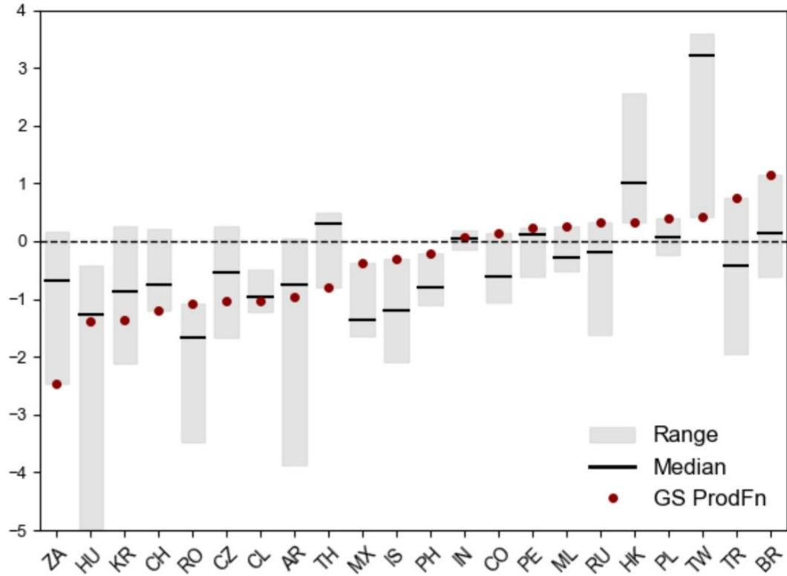

# 新兴市场产出缺口分布已发生变化——指向分化而非趋同

未来两年新兴市场增长前景中，最关键的因素并非 headline GDP 数字，而是闲置产能的分布情况。某全球投资银行研究部门更新了22个新兴市场经济体的生产函数产出缺口估算，发现总体图景——多数新兴市场运行在潜在水平附近或以下——掩盖了自上次更新以来已进一步扩大的区域分化。CEEMEA（中欧、东欧、中东及非洲）和中国产出缺口转负程度加深，意味着闲置产能增加。拉丁美洲整体接近潜在水平。而除中国外的亚洲新兴市场，在本轮周期中首次进入正区间。

这一发现之所以重要，是因为产出缺口是连接增长与政策的桥梁。一个存在显著闲置产能的经济体，可以在高于趋势水平的情况下增长而不引发通胀，这为宽松的货币条件提供了空间，并有利于对利率敏感的资产。一个运行在潜在水平之上的经济体则面临相反的约束：增长必须放缓，或政策必须收紧，否则通胀将持续。该报告的估算基于资本、劳动力和技术投入，衡量实际产出与潜在产出之间的差异，并非对任何单一经济体的最终定论——作者也承认，统一的方法论无法捕捉每个国家的独特特征——但它提供了一个一致的跨国比较框架，使观察者能够在相同条件下比较各经济体。

最重要的发现不在于产出缺口的水平，而在于其构成。在亚洲，台湾、韩国、香港和马来西亚由半导体引领的增长加速，在统计意义上推动部分经济体进入正产出缺口区间。但报告认为，这并非广泛的过热。增长动能集中在有限数量的企业，并未转化为整体劳动力市场的紧张。这种区分——统计意义上的过热与实质性的过热——是正确解读本轮周期的分析关键。它表明，传统的滤波法估算——将快速GDP增长视为需求过热的证据——系统性地高估了那些供给侧集中扩张经济体的通胀压力。

## 半导体繁荣是供给侧故事，统计滤波误读为过热

报告的生产函数估算与统计滤波之间的分歧在台湾最为明显。仅依赖GDP增长的传统方法，对台湾的正产出缺口估算要大得多，因为它们将实际GDP的急剧加速——由少数半导体公司驱动——视为广泛过热的证据。而纳入劳动力和资本利用率的生产函数方法则讲述了一个不同的故事：产出缺口仅为轻微正值，而在韩国，产出缺口仍为负值。

原因是结构性的。当增长由集中的供给侧扩张驱动——新产能、新出口、少数大型企业扩张——它不一定会收紧整个经济体的劳动力市场。工资不会全面加速上涨。国内需求不会过热。统计滤波看到高增长便推断存在需求过热；生产函数看到高增长则追问：这种增长是否在消耗正变得稀缺的资源？在台湾、香港和马来西亚，答案是否定的。这并非语义上的区别，而是对货币政策有直接影响：一个产出缺口轻微为正且没有工资压力的经济体，不需要收紧政策来冷却并不存在的需求。

对于观察者而言，这一发现反驳了一种反射性的假设——亚洲的强劲增长意味着过热，因此需要更紧的政策。报告的估算表明，半导体驱动的经济体仍有增长空间，而不会产生通胀压力。这使得它们的增长比表面产出缺口数字所暗示的更具持续性。风险不在于这些经济体过热，而在于半导体周期转向、供给侧提振逆转，导致产出缺口迅速转为负值。

## 中国与CEEMEA是新兴市场世界的闲置产能中心，政策响应将显著分化

报告发现，对中国的多数产出缺口估算——包括其自身的估算——目前都指向显著的闲置产能。这是一个显著的变化。中国，这个多年来作为全球需求引擎的经济体，已进入具有显著闲置产能的经济体阵营。其影响有两方面。在国内层面，这意味着中国可以在高于趋势水平的情况下增长而不引发通胀，这为政策制定者提供了刺激空间。但闲置产能的持续存在也表明，该经济体的潜在增长率可能高于其实际增长率——这一差距反映的是国内需求偏弱，而非供给约束。

在CEEMEA地区，情况同样偏向闲置产能。中欧地区和南非的总体需求继续远低于供给能力。南非的产出缺口在样本中属于最大之列。除波兰外的中欧国家也显示出显著的闲置产能。报告特别指出，南非、除波兰外的中欧国家、韩国、中国、智利和阿根廷，是增长空间最大、且不会引发通胀的经济体。

但CEEMEA的情况并非单一。土耳其和俄罗斯是例外：两个经济体一直在产能之上运行，尽管增长自上次更新以来有所放缓，但它们继续维持正产出缺口，这加剧了通胀压力。这是CEEMEA内部的关键区别。该地区并非统一的闲置状态，而是分裂为需求不足的经济体（中欧国家、南非）和仍在过热运行的经济体（土耳其、俄罗斯）。政策含义截然不同。闲置经济体有空间实施宽松政策；过热经济体需要收紧。

报告发现，尽管土耳其和俄罗斯的产出缺口近期有所收窄，但工资增长仍然较高，这一点尤为重要。这表明这些经济体的通胀预期已经根深蒂固。缩小产出缺口是去通胀的必要条件，但并非充分条件。工资-价格动态有其自身的惯性，打破它需要时间——以及持续的政策公信力。

## 通胀传导机制有所弱化，但过热经济体的工资缺口仍然重要

报告对产出缺口、工资增长与通胀之间关系的分析呈现出一幅细致的图景。在样本中的新兴市场中，经济闲置与工资缺口——定义为工资增长偏离与目标一致水平的程度——之间存在强相关性。运行在潜在水平之上的经济体往往有较大的工资超调；存在闲置的经济体往往有工资低配。但产出缺口与通胀缺口之间的相关性较弱，尽管仍为正值。

这与新兴市场菲利普斯曲线趋平的整体证据一致。近几十年来，随着供应链全球化和外部因素——全球食品和能源价格、汇率、进口成本——在新兴市场通胀动态中发挥更大作用，闲置与通胀之间的关系变得不那么稳定。报告作者明确指出了这一点：历史上工资压力会传导至通胀，但这种关系已经弱化。

其含义是，产出缺口更适合作为工资压力的指引，而非通胀压力的指引。对于观察者而言，这意味着产出缺口作为劳动力市场动态和二阶通胀效应的信号最为有用，而非短期通胀预测指标。产出缺口对通胀影响最大的经济体，是那些同时存在劳动力市场紧张和工资增长较高的经济体——巴西和哥伦比亚在正缺口一侧，土耳其和俄罗斯在过热一侧。

在匈牙利和捷克，报告发现显著的闲置产能与相对较强的工资增长并存。解释是实际工资正在向疫情前趋势水平追赶。这不是通胀性的，因为这些经济体是开放的，外部因素主导其通胀动态。工资追赶是一次性调整，而非需求过热的迹象。这对孤立解读工资数据是一个有用的警示：在存在闲置的经济体中，工资增长可能因结构性原因而较高，这与过热关系不大。

## 巴西和哥伦比亚表明，即使通胀回落，正产出缺口仍约束政策

报告中最具政策相关性的发现涉及巴西和哥伦比亚。巴西运行在潜在水平之上，报告发现其正产出缺口和紧张的劳动力市场使去通胀复杂化，导致货币宽松更加谨慎。哥伦比亚的增长自2024年以来回升，估算现在指向温和的过热程度。报告将此直接与政策联系起来：哥伦比亚重新启动了加息周期，巴西则放缓了宽松步伐。

这是产出缺口操作价值最清晰的例证。在两个经济体中，通胀都在回落，但产出缺口表明需求仍领先于供给。政策响应——收紧或更加谨慎——反映了这样一种判断：即使初始冲击消退，高于潜在水平的增长仍会使通胀保持高位。报告的估算验证了这一判断：产出缺口当时正在发出压力信号，而整体通胀数据尚未完全捕捉到。

对于观察者而言，教训是产出缺口是政策的领先指标，而非滞后指标。等到通胀数据确认压力时，政策响应已经在进行中。正产出缺口的经济体，是央行不愿放松政策的地方，无论近期通胀路径如何。负产出缺口的经济体，是可以在不产生即时通胀后果的情况下放松政策的地方。

## 解读新兴市场产出缺口的决策框架

报告的估算可以转化为一个实用的框架，用于评估任何新兴市场经济体。第一步是判断产出缺口为正还是为负。正缺口意味着需求领先于供给；负缺口则相反。第二步是评估缺口的构成。由集中供给侧增长驱动的正缺口——如半导体经济体——比由广泛国内需求驱动的正缺口通胀性更低。由需求疲弱驱动的负缺口，比由供给约束驱动的负缺口更可能自我修正。

第三步是查看工资数据。报告发现工资缺口与产出缺口强相关。如果一个经济体产出缺口为正且工资增长加速，政策响应很可能是收紧。如果一个经济体产出缺口为负且工资增长稳定或减速，政策响应很可能是宽松。第四步是考虑外部环境。在开放经济体中，全球因素可能主导国内闲置对通胀的影响。如果进口价格上升，负产出缺口并不能保证低通胀。

将此框架应用于报告的发现：增长空间最大且不会引发通胀的经济体是南非、除波兰外的中欧国家、韩国、中国、智利和阿根廷。这些经济体可以在高于趋势水平增长而不触发政策收紧。政策可能保持紧缩的经济体是巴西和哥伦比亚，正产出缺口约束了宽松空间。政策必须保持警惕的经济体是土耳其和俄罗斯，产出缺口为正，且即使增长放缓，工资增长仍然较高。

半导体经济体——台湾、韩国、香港、马来西亚——处于中间类别。它们的产出缺口仅为轻微正值或负值，报告认为增长加速是供给驱动的。这意味着它们可以继续增长而不过热，但也意味着它们的增长容易受到半导体周期下行的冲击。这些经济体的正产出缺口是一个行业的功能，可能迅速逆转。

## 产出缺口是比较工具，而非精确仪器——这正是其优势所在

报告对其估算的局限性持坦诚态度。产出缺口测量本质上具有不确定性。生产函数方法可能无法捕捉个别经济体的独特特征。估算结果与国际组织（如OECD）和统计滤波的估算并列呈现，报告指出其结果与替代措施的中位数大体一致，主要例外是台湾和南非。

台湾的例外具有启发性。它表明，方法论的选择恰恰在答案最关键的案例中最为重要。将台湾半导体驱动的增长视为过热的统计滤波，会暗示比生产函数方法更紧的货币政策立场——后者认识到增长是集中的而非广泛的。报告在此案例中愿意与统计滤波分道扬镳，表明生产函数方法捕捉到了某种真实的东西：依赖稀缺的整个经济体资源的增长，与反映单一行业供给侧扩张的增长之间的区别。

南非的例外则方向相反。报告估算南非存在显著的闲置产能，比替代措施所暗示的更多。这意味着南非在不引发通胀的情况下有更多增长空间，也意味着该经济体增长缓慢是需求问题，而非供给约束——这一诊断对政策有直接影响。

对于观察者而言，教训是任何单一的产出缺口估算都不应被表面化地接受。报告的贡献不在于精确性，而在于一致性。通过在22个经济体应用相同的方法论，它实现了如果每个国家的估算来自不同来源、基于不同假设则不可能进行的比较。产出缺口是比较工具，而非精确仪器。在比较中使用时，它揭示了新兴市场闲置产能的分化。作为相对指标使用时，它容易引发过度自信。

分化本身即是故事。新兴市场并非同步运行。一些有增长空间；另一些受到约束。一些可以放松政策；另一些必须收紧。产出缺口地图已经发生变化，它指向一个增长分化和政策分化的世界——一个国别选择比新兴市场资产类别整体更重要的世界。

*仅供参考。部分内容可能基于原始材料由AI辅助生成、翻译、总结或编辑，可能包含遗漏或错误。请独立核实。本文不构成投资、法律、税务、会计或其他专业建议。*
