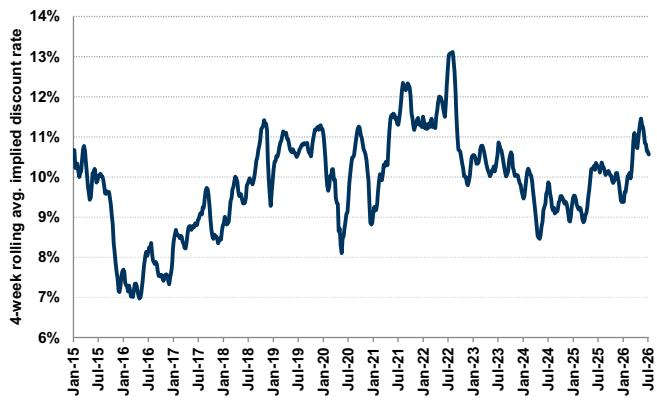
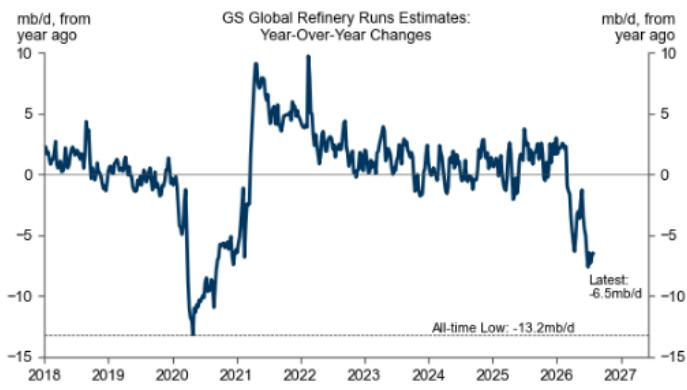
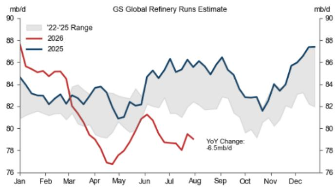
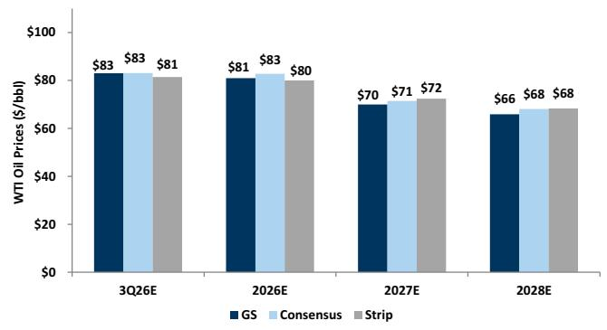
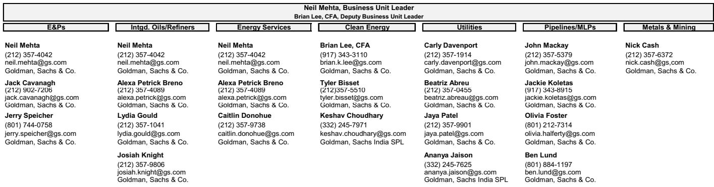

# 能源、公用事业与矿业观察：业绩期初探——读者关注哪些早期信号？

本业绩期内，我们观察到部分公司在业绩发布后报价出现一定波动，市场正在评估这些变化对后续表现的影响。本期观察中，我们邀请资深分析师团队讨论截至目前二季度业绩中表现较为突出的公司。团队将分享：业绩中哪些内容超出此前预期、这些结果对同行业其他公司是否具有参考意义，以及后续对这些公司的展望。

清洁技术：ENPH

能源服务：PWR

勘探与生产：EQT

综合油气与炼化：VLO

金属与矿业：NUE

中游：KMI

公用事业：FE

## 清洁技术

Neil Mehta
+1(212)357-4042 | neil.mehta@gs.com
GS & Co. LLC

## 能源服务

Brian Lee, CFA
+1(917)343-3110 | brian.k.lee@gs.com
GS & Co. LLC

在清洁技术领域，ENPH是首家发布业绩的太阳能公司，结果与预期基本一致。更重要的是，公司对四季度（4Q26）的展望好于此前预期，尤其是计入约6100万美元的safe harbor活动后。展望未来，管理层表示欧洲市场需求强劲，尤其是电池储能领域，同时美国市场的预付租赁模式持续取得进展。公司还提到其固态变压器（SST）产品在数据中心领域取得积极进展，包括RFI和RFP谈判，潜在管道规模达多吉瓦级。此外，管理层提及近期对进口电力逆变器的限制措施，可能有助于公司在工商业（C&I）市场获得更多机会。我们认为这些结果对住宅市场具有积极参考意义，尤其是考虑到欧洲市场的反馈，以及逆变器限制后工商业领域的前景。SST机会的乐观预期仍是潜在的上行催化剂，读者正在评估2027年的增长轨迹与2026年safe harbor提振之间的关系。

John Mackay
+1(212)357-5379 |
john.mackay@gs.com
GS & Co. LLC

Carly Davenport
+1(212)357-1914 |
carly.davenport@gs.com
GS & Co. LLC

Nick Cash
+1(212)357-6372 | nick.cash@gs.com
GS & Co. LLC

Alexa Petrick Breno
+1(917)343-9472 |
alexa.breno@gs.com
GS & Co. LLC

Olivia Foster
+1(801)212-7314 | olivia.foster@gs.com
GS & Co. LLC

本业绩期内，Quanta Services（PWR）表现突出，公司报告的调整后EBITDA超出市场预期约21%，并将全年有机指引中值上调约13%。同时，PWR宣布完成四项收购，为公司带来更多技术工人和制造能力。随着PWR持续推进长期利润率增长并在数据中心和负荷中心市场布局，这些新增能力增强了我们对公司长期收入和利润率增长的信心。我们目前预计2027至2030年每股盈利复合年增长率约为19%，考虑到垂直整合项目、765千伏输电线路和数据中心建设的贡献逐步增加。随着PWR不断提升制造能力并将这些服务扩展到更多地区，我们对其长期增长保持积极看法，公司作为输配电领域最大参与者的地位，将在未来几年电网持续电气化和扩建过程中得到巩固。鉴于PWR业绩的强劲表现，我们也在关注同行业其他公司的业绩情况，该领域仍受益于电力需求主题下的高增长趋势。

## 勘探与生产（E&Ps）

在我们已发布业绩的勘探与生产覆盖公司中，EQT的结果较为突出，主要得益于二季度产量超出市场预期5%，同时在较低维护性资本支出指引下上调了全年产量指引。对于EQT的业绩，最令我们意外的是持续进行的压缩测试对井况结果的显著影响——公司指出这些压缩项目使EQT的基础递减率表现提升了3%。对勘探与生产子板块具有参考意义的两个关键点是：1）近期天然气产量和供应前景依然稳健，2）阿巴拉契亚地区长期需求上行潜力可观。首先，我们看到EQT上调产量展望，同时多家同行也释放出一定增长信号，这对近期天然气价格形成一定压力——2026年天然气远期曲线自2025年底以来已有明显回落，部分原因在于市场对二叠纪伴生气供应的强劲预期。我们还注意到EQT对阿巴拉契亚地区约200亿立方英尺/日潜在需求增长的展望，这些需求来自电力、数据中心和出口扩容，对天然气勘探与生产子板块的长期前景具有积极参考意义。这一上行潜力中很大一部分仍需通过最终投资决定（FID）和其他确定性协议来验证，因此我们期待更多增量公告，同时注意到EQT迄今有效的商业和营销策略。

## 综合油气与炼化

在综合油气与炼化覆盖范围内，Valero Energy（VLO）是目前表现最为突出的公司之一。VLO报告的二季度每股盈利为12.54美元，高于GS和市场一致预期的10.25/10.13美元，主要得益于墨西哥湾沿岸炼化和可再生柴油业务好于预期。因此，公司本季度的股东回报超出了我们的预期——在更强的现金流生成支持下，管理层通过回购和分红返还了约26亿美元。在业绩电话会上，VLO讨论了成品油裂解价差前景，考虑到库存水平、全球产能扰动、出口需求增长和需求韧性，我们认为这对炼化板块其他公司具有积极参考意义。尽管如此，虽然我们注意到年初至今的优异表现，但仍对VLO持建设性看法——我们认为公司是当前较高利润率环境下的主要受益者。此外，我们关注到公司的资产负债表实力、执行记录、优质资产组合以及对股东回报的持续承诺。

## 金属与矿业

在金属与矿业领域，NUE的结果最为突出。虽然业绩好于预期，但前瞻性指引比预期更为乐观——2026年产量指引目前接近全年增长10%。这一趋势继续显示需求正在回流本土企业，国内钢铁生产商在去年实施的50%第232条关税下从进口中夺取市场份额。这一反馈还伴随着强劲的需求评论，能源、公共基础设施、数据中心需求等多年度投资周期带来顺风。此外，尽管汽车需求仍然偏弱，但国内汽车用钢需求的评论正在加强，这也引起了我们的注意——汽车制造商正在转向国内采购钢材，这应为需求提供额外支撑。我们认为NUE的反馈对整个板块具有积极参考意义，更高的产量和利用率应继续推动运营杠杆和利润率扩张至2026年下半年。

## 中游

在中游领域，KMI上周率先发布业绩，公司实现了稳健的超预期表现，部分得益于商品/价差收益（丁烷调和、Waha价差），并上调了2026年全年指引。展望未来，项目储备环比下降至96亿美元（此前为101亿美元），符合我们的预期，但管理层详细说明了2026年下半年至少宣布14亿美元（或更多）项目的可见性，预计将抵消10亿美元的项目投产。未来几个季度值得关注的具体项目包括FID前的Western Gateway项目——目前预计在未来1-2个月内达到FID（而此前可能伴随二季度业绩一起），以及TGP的219 South项目和NGPL的Permian Link项目等FID前项目，这些将是评估KMI在其业务范围内把握不断增长的电力需求能力的关键参考。我们认为KMI本季度的稳健执行对具有丁烷调和能力的产品运营商和能够在Waha价差周围进行营销的天然气管道运营商具有积极参考意义。展望未来，我们维持对KMI的建设性看法——公司仍是稳健的天然气基础设施主题的受益者，该主题仍是板块中最具可见性和持久性的方向。我们认为公司有望在超过100亿美元的FID前储备中获得合理份额，且市场预期相对同行仍较为温和——市场已愿意为显著的FID前增长定价。

## 公用事业

在我们覆盖的电力/公用事业公司中，目前仅有四家发布了业绩，FirstEnergy（FE）是其中引起我们注意的公司之一。虽然业绩本身与市场预期一致，运维费用在二季度的时间分布比我们预期的更为集中，但我们仍认为公司有能力稳健完成全年目标。本季度最大的增量更新我们认为在于数据中心管道进展以及对西弗吉尼亚州潜在机会的评论。公司继续预计其Maidsville能源中心的CPCN将在下半年获得批准，如果获批，可能为公司费率基础增长展望增加100个基点的增量。管理层还表示，由于该地区数据中心客户的强烈兴趣，正在探索建设第二座天然气发电厂的可能性，并提到可以考虑不同的结构以确保快速通电和客户保护，包括类似GenCo的结构。我们认为这对我们目前2027至2030年8%的每股盈利增长复合年增长率构成上行风险——随着监管日历上的不确定性逐步消除，我们预计这将推动公司估值重新定价，缩小与覆盖范围内其他公司的估值差距。虽然我们覆盖范围内少数公司也涉足西弗吉尼亚州，AEP也对该市场有敞口，这可能在大负荷和输电/发电资本支出机会方面提供上行潜力。此外，我们继续认为数据中心进展对受监管公用事业整体而言是潜在积极驱动因素，因为这对费率基础/盈利增长展望构成支撑。

## 编辑精选图表

图表1：能源、公用事业与矿业子板块表现
过去90天（2026/4/30-2026/7/29）

来源：FactSet，GS全球投资研究

图表2：我们认为勘探与生产公司反映的资金成本高于10%
勘探与生产公司隐含贴现率的4周滚动均值（基于五年期货）

来源：Bloomberg，GS全球投资研究

图表3：我们估计7月底全球炼厂加工量同比下降650万桶/日，因中东和俄罗斯炼厂持续受到袭击影响

来源：IEA，Kpler，GS全球投资研究

图表4：全球炼厂加工量从4月低点回升，但7月仍处于疫情以来最低季节性水平

来源：GS全球投资研究

## 板块背景

图表5：勘探与生产公司估值反映的WTI油价略低于五年期远期曲线
覆盖的勘探与生产公司隐含的历史WTI价格与远期原油期货，美元/桶

来源：FactSet，GS全球投资研究

图表6：以天然气为主的勘探与生产公司大致隐含约3.60美元/百万英热单位的长期天然气价格，而我们中周期观点为3.50美元/百万英热单位；2026/2027/2028年天然气期货约为3.50/3.38/3.68美元/百万英热单位

覆盖的天然气生产商自由现金流回报表现分析隐含的Henry Hub天然气价格，对比2026/2027/2028年Henry Hub天然气期货

来源：FactSet，GS全球投资研究

图表7：从历史数据看，当10年期美国国债回报表现低于约3%时，公用事业相对于标普500通常享有市盈率溢价，但在实际利率为负时期这一关系有所弱化

不同10年期美国国债回报表现环境下公用事业市盈率相对标普500的溢价/折价

来源：公司数据，GS全球投资研究

## 我们与读者的交流

## 勘探与生产——Neil Mehta

EXE。读者近期关注EXE，该公司于7月28日发布了二季度业绩，并于7月27日宣布计划以12.5亿美元收购Twin Eagle。在业绩方面，读者注意到在天然气价格偏弱的环境下，公司自由现金流仍超出市场预期。读者持续关注长期天然气需求潜力——近期价格压力使得EXE目前交易在10%的自由现金流回报表现水平，而同行平均为8%（同行包括CRK、EQT、AR、NFG、RRC和TOU）。读者还注意到管理层聚焦股东回报的决策——在首季度专注于降杠杆后，年初至今回购金额达8.49亿美元。关于Twin Eagle收购，读者关注公司在2028年底前实现1.5亿美元协同效应目标的前景。读者也在寻求更多关于EXE相对于同行在获取增量商业和营销协议方面竞争定位的清晰信息。

TOU。读者也在关注TOU，该公司于7月29日发布了二季度业绩。其中一个焦点是公司宣布NEBC二期建设暂停一年，读者希望了解这一暂时暂停对2027年下半年/2028年股东回报增量机会的影响。鉴于公司表示如果管理层看到定价环境持续改善，将保持按原时间表恢复二期建设的灵活性，读者期待更多关于哪些宏观指标会构成二期时间表策略变化的评论。在液体价格环境较高的背景下，读者也关注TOU在2026年下半年液体产量的展望，当前宏观环境下价格波动较为显著。

## 综合油气与炼化——Neil Mehta & Alexa Petrick

加拿大油砂公司。本周读者关注加拿大油砂公司，CVE率先发布二季度业绩。CVE实现了强劲的每股经营现金流超预期，上调全年产量指引以反映油砂业务的强劲表现以及Foster Creek和Christina Lake检修活动的优化，同时资本支出保持不变。展望未来，随着West White Rose项目在2026年三季度末投产，我们预计公司将从产量和自由现金流增长中受益。炼化资产的运营可用性和持续的成本纪律使公司能够把握当前定价环境——中西部库存偏低、裂解价差稳健、重油贴水走阔。虽然许多读者关注MEG收购后的杠杆水平，但我们注意到本季度资产负债表取得显著进展，净债务已降至60亿加元以下，管理层能够将约75%的超额自由资金流返还给股东。不过，一些短周期读者也可能因年初至今的强劲表现而保持谨慎。对于即将发布的IMO.TO、SU和CNQ业绩，读者关注产量增长、资本回报、管道出口能力、利润率捕捉以及潮湿天气条件的评论。

美国综合油气公司。读者在XOM和CVX明日发布二季度业绩前关注这两家公司。根据近期XOM的8-K文件，读者关注上游、下游和化工业务的环比改善。对公司持建设性看法的读者继续强调二叠纪技术的优势、有吸引力的炼化敞口和持续的资本回报。相对估值仍是关键讨论点——我们注意到XOM在2027/2028年提供6%的自由现金流回报表现，而CVX为8%。读者还关注卡塔尔受损LNG列车恢复时间表的更新。对于CVX，读者强调强劲的长期自由现金流增长加上资本纪律。许多人认为公司进入本季度具有积极态势，反映美国本土以及TCO、Gorgon和Wheatstone的运营动能，圭亚那项目带来顺风，委内瑞拉和阿根廷可能带来产量上行。主要讨论点涉及投资组合中的地缘政治风险，尤其是近期头条新闻后哈萨克斯坦的情况。

## 能源服务——Neil Mehta

LBRT。本周与读者的交流聚焦于LBRT——公司于7月22日发布业绩后，报价面临一定压力。读者关注LBRT 2026年资本支出要求的增加——公司指引的资本支出高于此前水平，目前预计2026财年约为15亿美元，而此前指引约为11亿美元。随着资本支出增加，每兆瓦资本支出也相应提高——公司目前预计其表后（Behind-the-Meter）项目平均约170万美元/兆瓦。我们在业绩后与LBRT管理层举行了一次电话会，公司讨论了2026年及未来几年的资本支出预期，以及2026年下半年签署可能超过500兆瓦的电力服务协议（ESA）的预期。读者关注LBRT为增加的资本支出提供资金的计划，以及公司可能采用哪些不同策略来支持高于预期的资本支出。市场还关注ESA的性质，以及如果ESA时间表推迟，LBRT是否会考虑过桥融资选项。LBRT管理层表示计划使用项目融资来支持合同，并认为长期客户管道是稳健的。

FTI。公司于7月30日发布业绩后，读者关注业绩发布后的相对报价表现以及公司远期订单概况。由于EBITDA结果高于GS和市场预期，读者关注2027年订单目标可能是什么——公司重申了对2026年至2027年海底订单增长的预期。管理层评论聚焦于2027年与2026年订单的构成，并指出预计2027年订单将由较大的绿地项目组成，而2026年则预计以较小的棕地回接项目为主。随着公司继续推进海底业务其他部分的工业化（称为iEPCI 2.0），读者关注该举措可能为海底业务带来的增量EBITDA利润率扩张，以及未来几年订单增长的幅度。

## 公用事业——Carly Davenport

FE。本周FE发布二季度业绩，该公司的讨论热度在我们与读者的交流中持续。对FE持更乐观看法的读者强调：（1）西弗吉尼亚州的上行机会——Maidsville能源中心的单一天然气发电厂可能为计划带来100个基点的增量费率基础增长（据公司），且由于该地区数据中心的强劲兴趣和州政府的强力支持，有可能建设更多天然气发电厂；（2）在传输业务已有稳健费率基础增长的基础上，数据中心增长和PJM开放窗口可能带来增量输电投资；（3）相对于同行估值存在折价，且未来六个月有明确的催化剂，包括CPCN批准和西弗吉尼亚州通胀与投资调整机制的最终命令。对于持更谨慎看法的读者，关注点主要集中在FE所在的多个PJM州的监管风险，包括新泽西、马里兰、宾夕法尼亚和俄亥俄。担忧最突出的是新泽西/马里兰的可负担性和监管结果、如果回收机制不够建设性则资本可能从宾夕法尼亚重新分配的风险，以及俄亥俄州州长选举风险。也有一些读者对西弗吉尼亚州的上行潜力持怀疑态度，尽管管道进展积极，但该地区的数据中心建设仍处于非常早期阶段。

PCG。上周PCG率先发布公用事业板块业绩，我们在业绩后收到多位读者的问询。读者普遍在评估该公司的合适入场时机——加州立法机构将于下周从夏季休会期返回，可能推进该州的野火改革立法。立法会议的结果仍在讨论中，焦点在于是否会采取行动，或者由于州长任期将于今年晚些时候结束，潜在改革是否会被推迟到未来的立法会议。一些读者还询问是否会考虑州政府支持的解决方案，将负担更广泛地分摊而不仅仅由加州IOU客户承担。还有关注点在于如果野火改革未获通过，公司的B计划是什么——在这种情况下，读者试图评估相对于5年730亿美元资本计划，有多少资本支出可能面临缩减风险，以及公司可能如何调整资本配置策略。最后，还有一些关于公司数据中心负荷的问题，尽管一些读者仍在讨论加州是否会出现有意义的数据中心负荷。

## MLP/管道——John Mackay & Olivia Foster

关注KGS核心压缩业务价值与电力上行潜力。本周我们收到多位读者关于KGS核心压缩业务价值的问询，此前公司报价出现一定回调（自7月22日以来下跌16%）。这一回调由二季度业绩后更广泛的AI和电力市场波动驱动，包括LBRT在业绩电话会上对长期前景持更谨慎态度（前期支出增加、对发电终值的质疑），这与PUMP积极的合同签署势头形成对比。周二我们与LBRT管理层的线上读者活动中出现了相对更建设性的电力领域情绪——强调了长期合同期限和到2026年底超过500兆瓦的服务协议，以及PUMP新签约的发电容量（不过我们注意到这些合同面向上游和工业客户）。值得注意的是，数据中心机会由于商业流程更为复杂，实现时间似乎更长，而油气或工业应用可能提供更快的转化时间线。对于KGS，读者正在讨论电力上行潜力，关注商业动能、项目经济性和回报——同时试图确定该公司的基本面底部（核心压缩业务）。大多数读者认为近期回调过度，强调支撑性宏观顺风（长交付周期和行业纪律）、定价能力和利润率扩张潜力对基础压缩业务具有建设性。展望下周的业绩发布，虽然重大商业公告应会在今年晚些时候发布（根据管理层评论），读者正在关注合同签署动能评论、KGS参与微电网解决方案的意愿、资本支出增加的可能性以及对压缩基本面的信心。

Paducah数据中心公告对天然气需求的初步参考意义。本周，包括Brookfield、NextEra Energy（NEE）和地方公用事业在内的联合体宣布在肯塔基州Paducah建设一个1000亿美元的数据中心园区，包括建设2吉瓦天然气发电和至多2.6吉瓦电池储能容量，全部建设目标于2032年完成。我们本周收到多位读者关于电力用气增量需求参考意义以及哪些管道最有能力把握这一机会的问询。鉴于与Paducah场址的邻近性，读者讨论集中在以下四条管道是否可被视为最有优势：Trunkline（ET）、TGT（Boardwalk）、TETCO（ENB）和ANR（TRP）。在规模方面，读者询问这对增量输气量意味着什么——以每吉瓦数据中心电力约2亿立方英尺/日的假设为例，至多2吉瓦的天然气发电将意味着约4亿立方英尺/日。接下来，关注点仍在于哪个运营商最终获得增量运输承诺、任何FID前项目公告相对于分阶段发电建设的时间安排，以及对更广泛天然气管道板块的参考意义——电力用天然气需求继续是该板块的关键增长驱动因素。

## 清洁技术——Brian Lee

太阳能。本周读者对关键太阳能公司业绩的兴趣增加，包括业绩前的预期和仓位，涉及ENPH（周二晚间发布）以及FSLR和NXT（7月30日收盘后发布）。在住宅侧，有关于美国和欧洲需求状况的问题，特别是储能，以及固态变压器和其他新产品的展望。此外，ENPH业绩发布后读者持续关注——读者正在试图评估2027年收入相对于2026年确认的safe harbor活动可能如何变化。在公用事业规模侧，读者正在试图了解正在进行的第232条调查何时可能出结果，以及潜在的市场影响。此外，还有一些较为个股化的问题，如对FSLR的订单和平均售价预期，以及NXT近期收购的潜在更新和对财务表现的潜在影响。

稀土。本周我们收到关于稀土板块的增量问询。读者旨在了解近期报价偏弱的驱动因素，以及短期内还有多少进一步下行风险。同样，我们也收到关于行业整体格局的问题，包括地缘政治关切，以及这对即将于11月实施的出口限制是否有影响。此外，还有更多针对MP、UUUU和METC的公司特定问题，包括近期催化剂、运营执行看法和其他个股因素。

## 金属与矿业——Nick Cash

STLD。在我们恢复对该公司的覆盖后，本周关于STLD的读者问询有所增加。虽然大多数读者同意持有钢厂仍是首选策略，但估值似乎偏高，这使看空读者保持谨慎。读者继续讨论STLD与NUE的对比，以及在国内钢铁需求和定价环境改善的背景下，哪家公司具有最大的上行变化率。NUE是基本面产量/市场份额获取的故事，而一些读者认为STLD的铝业务被低估，随着产量在2026年下半年爬坡，可能带来盈利上行。

## GS能源研究重点报告

## 本周GS能源研究

Cenovus Energy Inc. (CVE)：看好2026年下半年格局，West White Rose临近首油且去杠杆持续

HF Sinclair Corp. (DINO)：继续认为公司报价相对SOTP价值存在有吸引力折价；目标价114美元，买入

美洲能源：石油：适度上调SU和CNQ目标价；关注管道展望、资本回报与增长

Liberty Energy Inc. (LBRT)：管理层会议要点：年底前ESA可能超过500兆瓦，上调资本支出指引由项目融资支持

美洲能源：油气——勘探与生产：平衡近期天然气宏观偏弱与强劲长期需求潜力；EQT买入，RRC中性，中周期3.50美元/百万英热单位

美洲能源：油气——勘探与生产：在不确定的石油宏观环境中筛选个股机会；FANG看生产力，DVN看简化

美洲美国电力管道：6月容量增加，电池储能和太阳能推动新增

SLB (SLB)：保持建设性看法，受益于国际活动恢复和个股机会，贡献长期增长；买入

Hayward Holdings (HAYW)：二季度业绩超预期，2026年指引维持，似乎在获取份额；中性

Pentair Plc (PNR)：业绩符合预期，Pool去库存持续，拟收购Taco将扩大数据中心敞口；中性

Enphase Energy Inc. (ENPH)：近期展望没有担心的那么差，得益于safe harbor和欧洲；SST客户进展是下一个催化剂；买入

Xylem Inc. (XYL)：二季度业绩基本符合预期，但数据中心动能似乎在积聚，利润率扩张保持完好

Kodiak Gas Services Inc. (KGS)：估值低于核心压缩价值，BTM担忧过度——重申买入

Kinder Morgan Inc. (KMI)：二季度回顾：稳健季度；2026年下半年项目公告加速是长期增长预期的关键

Golar LNG (GLNG)：涡轮机订单指向第四艘船FID的动能——重申买入

FirstEnergy Corp. (FE)：2026年下半年监管去风险化将支持数据中心上行和盈利增长可见性；买入

美洲公用事业：电力——IPP：更新二季度预期；关注PJM和ERCOT监管进展

## 全球科技 全球数据中心容量更新：容量预期提高，但紧张状况持续

Steel Dynamics Inc. (STLD)：恢复覆盖，买入——有利的商品价格顺风和反周期铝业务上行

Nucor Corp. (NUE)：二季度业绩强劲；需求和利润率动能提升盈利能力和自由现金流；重申买入

## 大宗商品——石油和天然气远期曲线

图表8：石油：GS vs. 市场一致预期 vs. 远期曲线
GS大宗商品估计 vs. 一致预期 vs. WTI原油远期价格，美元/桶

来源：FactSet，Bloomberg，GS全球投资研究

图表9：天然气：GS vs. 市场一致预期 vs. 远期曲线
GS大宗商品估计 vs. 一致预期 vs. 天然气远期价格，美元/百万英热单位

来源：FactSet，Bloomberg，GS全球投资研究

图表10：天然气库存较五年均值存在小幅盈余
天然气库存 vs. 五年均值（十亿立方英尺）vs. Henry Hub近月天然气价格（美元/百万英热单位）

来源：EIA，GS全球投资研究

## GS能源与公用事业分析师贡献者

## GS能源、公用事业与矿业团队

来源：GS全球投资研究

## 估值与主要风险

EQT。我们12个月目标价为62美元，基于2027/2028年估计8.0%的目标自由现金流回报表现，假设布伦特原油75美元/桶和Henry Hub天然气3.50美元/百万英热单位。主要风险包括大宗商品价格走低（尤其是天然气）、管道建设延迟、成本上升、政府政策变化以及井况结果不如预期。收盘价：52.58美元

KMI。我们维持报告评级，12个月目标价35美元，基于2027年EBITDA估计的12.5倍倍数。下行风险包括：1）天然气需求爬坡慢于预期，2）新的意外重新签约阻力，3）费率案件阻力大于预期，4）新项目回报低于预期，5）RNG战略执行，6）大宗商品价格走低，尤其是石油对EOR业务的影响，7）高倍数收购，8）资产负债表能力过度使用于回购或新项目。收盘价：31.86美元

FE。我们对FE持报告评级，12个月目标价55美元，基于Q5-Q8估计的18倍市盈率倍数，反映相对于我们基线的1倍溢价。报告评级FE的主要风险包括：1）俄亥俄州费率案件结果不利；2）养老金费用和/或利息费用可能高于预期；3）温和天气可能对FE的盈利产生影响。收盘价：49.13美元

NUE。我们12个月目标价为303美元，基于2026-2028财年平均EBITDA的9.5倍EV/EBITDA倍数。风险：1）废钢成本高于预期；2）关税下调；3）国内产能增加可能对价格形成压力；4）经济增长慢于预期可能导致美国钢铁需求放缓。收盘价：256.16美元

PWR。我们12个月目标价为826美元，反映我们32.0倍NTM EV/EBITDA的目标倍数。我们对PWR持报告评级。主要风险：1）项目量动能丧失导致各板块收入复合年增长率放缓，2）供应链相关挑战导致项目交付延迟，3）成本通胀或其他运营挑战导致三个板块利润率进展放缓。收盘价：560.07美元

ENPH。我们12个月目标价为55美元，基于我们20.0倍目标市盈率应用于Q5-Q8每股盈利，然后加回约7美元/股的净现金。主要风险包括收入增长和利润率低于预期、竞争和技术格局变化、中美关税以及渠道库存异常积累。收盘价：34.90美元

VLO。我们对VLO持报告评级，6个月市盈率（我们正常化每股盈利预测的16.0倍）和SOTP基础目标价为357美元。主要风险涉及炼化利润率、运营执行和资本回报。收盘价：302.28美元

## 披露附录

## Reg AC

我们，Neil Mehta、Brian Lee（CFA）、John Mackay、Carly Davenport、Nick Cash、Alexa Petrick Breno和Olivia Foster，特此证明本报告中表达的所有观点均准确反映我们个人对相关公司及其证券的看法。我们还证明，我们的薪酬中没有任何部分直接或间接与本次报告中表达的具体建议或观点相关。

除非另有说明，本报告封面上列出的个人均为GS全球投资研究部分析师。

贡献作者：Neil Mehta GS & Co. LLC，Brian Lee（CFA）GS & Co. LLC，John Mackay GS & Co. LLC，Carly Davenport GS & Co. LLC，Nick Cash GS & Co. LLC，Alexa Petrick Breno GS & Co. LLC，Olivia Foster GS & Co. LLC。

除非另有说明，贡献作者披露中列出的个人均为GS全球投资研究部分析师。

## GS因子画像

GS因子画像通过将股票的关键属性与市场（即我们的评级股票池）及其行业同行进行比较，提供投资背景。所描绘的四个关键属性为：增长、财务回报、倍数（即估值）和综合（增长、财务回报和倍数的复合）。增长、财务回报和倍数通过使用每只股票特定指标的标准化排名计算。各指标的标准化排名随后取平均并转换为相关属性的百分位。每个指标的具体计算可能因财年、行业和地区而异，但标准方法如下：

增长基于股票的前瞻性销售增长、EBITDA增长和每股盈利增长（对于金融股，仅每股盈利和销售增长），较高百分位表示增长较高的公司。财务回报基于股票的前瞻性ROE、ROCE和CROCI（对于金融股，仅ROE），较高百分位表示财务回报较高的公司。倍数基于股票的前瞻性市盈率、市净率、价格/股息（P/D）、EV/EBITDA、EV/FCF和EV/债务调整后现金流（DACF）（对于金融股，仅市盈率、市净率和P/D），较高百分位表示交易倍数较高的股票。综合百分位计算为增长百分位、财务回报百分位和（100%——倍数百分位）的平均值。

财务回报和倍数使用GS分析师在至少未来三个季度财年末的预测。增长使用至少未来七个季度财年相对于至少未来三个季度财年的输入（所有指标均按每股基础计算）。

有关我们如何计算GS因子画像的更详细说明，请联系您的GS代表。

## M&A排名

在我们的全球覆盖范围内，我们使用M&A框架审视股票，考虑定性因素和定量因素（可能因行业和地区而异），以纳入某些公司可能被收购的可能性。然后我们分配M&A排名，对我们评级覆盖下的公司从1到3进行评分，1代表公司成为收购目标的高概率（30%-50%），2代表中等概率（15%-30%），3代表低概率（0%-15%）。对于排名为1或2的公司，按照我们标准部门指南，我们在目标价中纳入M&A组成部分。M&A排名3被视为不重要，因此不计入我们的目标价，可能在研究中讨论也可能不讨论。

## Quantum

Quantum是GS的专有数据库，提供详细的财务报表历史、预测和比率。可用于对单一公司进行深入分析，或在不同行业和市场的公司之间进行比较。

## 披露

Kinder Morgan Inc.的评级是相对于其覆盖范围内的其他公司：Antero Midstream Corp.、Cheniere Energy Inc.、Cheniere Energy Partners、DT Midstream Inc.、EagleRock Land、Energy Transfer LP、Enterprise Products Partners LP、Excelerate Energy Inc、Golar LNG、Hess Midstream LP、Kinder Morgan Inc.、Kinetik Holdings、Kodiak Gas Services Inc.、LandBridge、MPLX LP、NextDecade Corp.、ONEOK Inc.、Plains All American Pipeline LP、Plains GP Holdings、South Bow Corp.、TC Energy Corp.、Targa Resources Corp.、Venture Global、WaterBridge Infrastructure、Williams Cos。

FirstEnergy Corp.的评级是相对于其覆盖范围内的其他公司：Ameren Corp.、American Electric Power、Consolidated Edison Inc.、Constellation Energy Corp.、Duke Energy Corp.、Edison International、Eversource Energy、Exelon Corp.、FirstEnergy Corp.、NRG Energy Inc.、PG&E Corp.、Public Service Enterprise Group、Sempra、Southern Co.、Talen Energy Corp.、Vistra Corp.、WEC Energy Group、Xcel Energy Inc。

EQT Corp.的评级是相对于其覆盖范围内的其他公司：APA Corp.、Antero Resources Corp.、Comstock Resources Inc.、Devon Energy Corp.、Diamondback Energy Inc.、EOG Resources Inc.、EQT Corp.、Expand Energy Corp.、Magnolia Oil & Gas、Murphy Oil Corp.、Occidental Petroleum Corp.、Ovintiv Inc.、Permian Resources Corp.、Range Resources Corp.、Talos Energy、Tourmaline Oil Corp.、Viper Energy Inc。

Valero Energy Corp.的评级是相对于其覆盖范围内的其他公司：CVR Energy Inc.、Calumet Inc.、Canadian Natural Resources Ltd.、Cenovus Energy Inc.、Chevron Corp.、ConocoPhillips、Delek US Holdings、ExxonMobil Holdings、HF Sinclair Corp.、Imperial Oil Ltd.、Kosmos Energy Ltd.、Marathon Petroleum Corp.、PBF Energy Inc.、Par Pacific Holdings、Phillips 66、Suncor Energy Inc.、Valero Energy Corp。

Nucor Corp.的评级是相对于其覆盖范围内的其他公司：Cleveland-Cliffs Inc.、Commercial Metals Co.、Freeport-McMoRan Inc.、Nucor Corp.、Reliance Inc.、Steel Dynamics Inc。

Enphase Energy Inc.的评级是相对于其覆盖范围内的其他公司：Acuity Inc.、Array Technologies Inc.、Cameco Corp.、Canadian Solar Inc.、Energy Vault Holdings、Enphase Energy Inc.、First Solar Inc.、Fluence Energy Inc.、HA Sustainable Infrastructure、Hayward Holdings、JinkoSolar Holding、MP Materials、Mueller Water Products Inc.、Nextpower、Nuscale Power Corp.、Oklo Inc.、Pentair Plc、Ramaco Resources Inc.、Shoals Technologies、SolarEdge Technologies Inc.、Sunrun Inc.、Universal Display Corp.、Uranium Energy Corp.、Veralto Corp.、Watts Water Technologies Inc.、Wolfspeed Inc.、Xylem Inc。

Quanta Services的评级是相对于其覆盖范围内的其他公司：Argan Inc.、Atlas Energy Solutions、Expro Ltd.、Halliburton Co.、Helmerich & Payne Inc.、Liberty Energy Inc.、MYR Group、MasTec Inc.、NOV Inc.、Patterson-UTI Energy Inc.、ProPetro Holding Corp.、Quanta Services、SLB、TechnipFMC Plc、Weatherford International Ltd。

<table><tr><td colspan="3">FirstEnergy Corp. (FE)</td><td colspan="3">Kinder Morgan Inc. (KMI)</td></tr><tr><td>报告日期</td><td>目标价（美元）</td><td>收盘价（美元）</td><td>报告日期</td><td>目标价（美元）</td><td>收盘价（美元）</td
