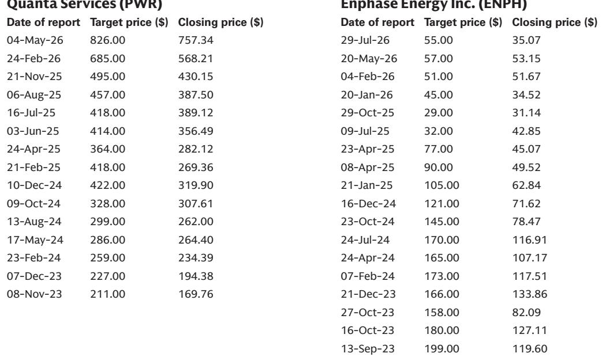

# 财报季揭示结构性转向：电网建设成为能源板块重心

能源、公用事业和矿业板块的第二季度财报季传递出一个具有战略意义的信息。纵观整个板块，表现突出的企业并非仅仅是超出市场预期的公司，而是那些展现出商业模式已锚定于多年期电气化和基础设施建设周期的企业。最具说明性的数据来自Quanta Services，该公司调整后EBITDA超出预期约21%，并将全年有机业绩指引中值上调约13%，同时完成了四项收购以增强技术劳动力和制造能力。这并非孤立事件，而是整个板块重新定价的领先指标——实体建设和连接能源基础设施的能力，其价值已超过流经其中的大宗商品分子。

这一变化带来的启示是明确的：传统能源投资中优先考虑上游资源所有权和炼化复杂度的层级结构，正被电网拥堵、数据中心需求和制造业回流带来的实体需求所重塑。FirstEnergy、Nucor和Kinder Morgan的财报进一步印证了这一判断，它们各自显示出受监管的费率基础增长、国内钢材销量回升和天然气管道利用率提升，均由同一股底层力量驱动——建设一个更加依赖电力的新经济形态。那些仍仅从油气价格角度审视该板块的读者，正在错过这个财报季已使其不可忽视的结构性变化。

当前市场环境下，这一分析的紧迫性更加突出。能源、公用事业和矿业板块在过去90天表现显著，问题已不再是主题是否成立，而是哪些子板块和具体公司在合理估值下能提供最持久的增长。财报电话会议提供了做出这一区分所需的证据，将拥有真实积压订单可见性和战略定位的公司，与那些仅受益于暂时性大宗商品价格波动的公司区分开来。在市场充分消化这些业绩所预示的长期增长之前，沿着这些新分界线调整投资组合的窗口期现已打开。

## 电网建设成为新前沿：Quanta的业绩揭示板块真实增长引擎

Quanta Services的财报是本财报季最重要的数据点，因为它量化了市场先前预期与电网基础设施实际支出速度之间的差距。调整后EBITDA超出预期21%并非源于成本削减或有利天气，而是由输电、数据中心负荷接入需求以及向垂直整合制造的战略扩张所驱动。该公司将有机业绩指引中值上调13%，同时完成四项收购，表明管理层看到了一个足以支撑有机再投资和资产负债表部署的多年期需求曲线。

Quanta业绩的战略意义在于其增长的构成。该公司不仅仅是承包商，正在成为整个电气化主题的关键路径提供者。本季度完成的收购专门针对将技术劳动力和制造能力内部化，这直接解决了行业最紧迫的约束——高电压设备的技术劳动力和制造产能。这种垂直整合使Quanta能够在从工程和采购到建设和维护的整个价值链中获取利润空间，而非仅仅作为标准化劳动力的价格接受者。该公司预计到2030年每股收益复合年增长率约为19%，其基础是765千伏输电线路、数据中心建设以及这些垂直整合项目的贡献不断增加，而这些都属于同一个结构性需求故事。

对读者而言，这一信息的含义是清晰的：市场开始将电网基础设施视为增长型行业，而非公用事业成本中心。Quanta的估值随着市场认可其积压订单质量而扩张，很可能带动整个电气设备和工程、采购、建设板块的重新评级。对投资组合构建的启示是关注直接涉及输电、变电站和数据中心互联资本支出的公司，同时减少对电气化主题间接或大宗商品相关敞口的配置。

## FirstEnergy的数据中心管线重新定义受监管公用事业增长：CPCN批准成为重新评级催化剂

FirstEnergy的财报虽与市场预期一致，但包含了公用事业覆盖范围内最具战略意义的更新：数据中心管线更新可能为公司费率基础增长前景增加100个基点。该公司预计今年下半年其Maidsville能源中心的CPCN将获得批准，这不仅是单个项目的里程碑，更证明了受监管公用事业可以通过专用发电资产参与数据中心繁荣的判断。西弗吉尼亚州第二个天然气发电厂的可能建设（可能采用GenCo结构）表明，FirstEnergy正从被动负荷服务转向主动发电开发，以把握数据中心机遇。

西弗吉尼亚州的机遇尤其引人注目，因为它将该州现有的天然气基础设施与数据中心日益增长的电力需求相结合——这些数据中心正在寻找土地可用、监管环境有利且可接入多条输电走廊的地点。FirstEnergy管理层已表示正在探索不同结构以确保快速通电，这解决了数据中心开发商面临的主要约束——困扰其他地区的多年期互联排队问题。如果Maidsville项目获批，不仅将增加费率基础，还将为其他公用事业提供可效仿的模板，可能在全国引发类似的申请浪潮。

投资角度的关键在于估值倍数扩张的可能性。FirstEnergy目前相对其公用事业同业群体存在折价，市场对其执行增长计划的能力持怀疑态度。从Maidsville批准开始的监管日程风险消除，很可能缩小这一折价并使股价向行业平均水平靠拢。这不是对数据中心需求的主观判断，而是对监管执行力的判断，以及市场对FirstEnergy已从缓慢增长的受监管公用事业转型为拥有可见项目管线的更快增长能源基础设施公司的认可。

## Nucor的销量指引确认制造业回流超级周期：关税政策已永久改变国内钢材需求曲线

Nucor的财报包含了2026年约10%的销量增长指引，这是迄今最清晰的证据，表明美国制造业回流不是政治口号，而是可衡量的工业现实。该公司明确将这一增长归因于国内钢铁生产商从进口中夺取市场份额，推动因素为去年实施的50%关税。这不是周期性回升，而是美国制造商采购行为的结构性转变——他们现在将供应链安全和关税规避置于进口钢材的边际成本节省之上。

Nucor的需求评论明显覆盖面广泛，能源、公共基础设施和数据中心建设的多年期投资周期均带来利好。该公司观察到汽车需求虽然整体偏弱，但正转向国内钢材采购，这一点尤其重要。汽车制造商历来是进口钢材对价格最敏感的买家，现在正承诺使用国内供应链，这表明关税制度为国内生产商创造了持久的定价保护伞。这一需求转变加上正在进行的基础设施建设，指向一个多年期的高产能利用率和经营杠杆时期。

对更广泛的有色金属和矿业板块而言，Nucor的业绩对整个行业都是积极信号。更高的产量和利用率应在2026年下半年推动利润率扩张，该公司的评论表明当前需求环境不是峰值，而是可以持续数年的平台期。读者应将Nucor视为与推动Quanta和FirstEnergy相同的电气化和回流主题的受益者，而非周期性的钢铁标的，其额外优势在于关税保护为定价提供了底部支撑。

## EQT的产量超预期掩盖天然气市场两面性：短期供应过剩与长期需求拐点并存

EQT的财报显示产量超出预期5%，并在较低维护性资本支出基础上上调了全年指引，这体现了天然气市场的分化特征。该公司披露持续的压缩测试使基础递减率表现超出预期3%，这证明了运营卓越性，但也加剧了近期供应过剩的叙事，对远期天然气价格形成压力。2026年天然气远期曲线自2025年底以来已大幅下移，部分受市场对二叠纪伴生气供应强劲预期驱动，EQT的产量上调进一步增加了下行压力。

然而，长期需求图景则明显更为积极。EQT对阿巴拉契亚地区约200亿立方英尺/日潜在需求增长的展望——由发电、数据中心和出口通道扩张驱动——代表了一个足以吸收当前供应过剩甚至更多的需求拐点。关键前提是，这一上行潜力中有很大部分仍需通过最终投资决定和其他约束性协议来验证。市场对缺乏约束性承诺的需求预测持合理怀疑态度，但方向是明确的：阿巴拉契亚盆地有望成为推动整个能源板块的电力需求增长的主要受益者。

投资启示需要细致区分。对于短期视角的读者，天然气勘探开发板块仍面临供应过剩和价格疲软的挑战。然而，对于多年期视角的读者，当前疲软代表了一个机会，可以在拥有资产负债表实力和商业策略的公司中建立仓位，以把握长期需求拐点。EQT迄今有效的商业和营销策略为其成为阿巴拉契亚需求增长的主要受益者提供了信心，当前估值并未充分反映这一期权价值。

## Kinder Morgan的积压订单纪律与中游新增长逻辑：FID前项目成为价值新货币

Kinder Morgan的财报实现了稳健的超预期，受益于大宗商品和价差收益（包括丁烷调和和Waha价差机会），但值得关注的并非本季度本身，而是公司前瞻性的项目管线。项目积压订单环比从101亿美元降至96亿美元符合预期，但管理层预计2026年下半年将宣布至少14亿美元的新项目，足以抵消10亿美元投入运营的项目，这证明了天然气基础设施交易的持续活力。

值得关注的具体项目包括预计未来一至两个月内达到最终投资决定的Western Gateway项目，以及TGP 219 South和NGPL Permian Link项目。这些项目并非增量扩张，而是下一波大规模天然气基础设施，旨在连接增长中的供应盆地和增长中的需求中心，特别是发电领域。Western Gateway项目尤其值得关注，它是中游板块能否把握电力需求主题的试金石，其最终投资决定将成为整个板块的重要催化剂。

Kinder Morgan业绩带来的战略洞见是，中游板块正从数量增长模式转向项目开发模式。市场已愿意为部分同行的重大FID前增长提供资本，但对Kinder Morgan的预期仍相对温和，这为相信该公司将在超过100亿美元FID前积压订单中赢得合理份额的读者创造了机会。该公司本季度的稳健执行加上其大宗商品交易能力，使其能够同时受益于天然气市场呈现的数量增长和价差捕捉机会。

## 新能源格局的决策框架：如何在电气化价值链中布局投资组合

本财报季的集体信息可以提炼为一个决策框架，帮助读者应对板块转型。框架的第一个维度是区分拥有可见、签约或费率基础增长的公司与依赖大宗商品价格实现的公司。Quanta、FirstEnergy以及较小程度上的Kinder Morgan，其增长概况锚定于实体基础设施开发，提供了大宗商品生产商无法比拟的可见性。

第二个维度是需求驱动因素的时间跨度。数据中心负荷增长、电网互联和制造业回流是多年期甚至数十年的趋势，目前仍处于早期阶段。市场为这一增长付费的意愿正在上升，Quanta的重新评级和FirstEnergy缩小估值差距的潜力即为明证。相反，天然气勘探开发板块虽然定位于长期需求增长，但面临近期供应过剩，在需求拐点更加具体化之前，估值可能保持受限。

第三个维度是资产负债表质量和资本配置策略的可信度。Nucor从更高产量中产生经营杠杆的能力、Kinder Morgan对项目开发的纪律性方法、以及EQT有效的商业策略，都表明管理质量是当前环境中的关键区分因素。读者应偏好拥有强劲资产负债表、经过验证的执行记录以及通过增长投资和资本回报计划实现股东回报的清晰路径的公司。

这一框架的实际应用是向电气化和基础设施主题倾斜，偏好直接涉及数据中心需求、输电建设和制造业回流产能的公司。能源板块已不再是单一交易，而是一系列具有不同增长概况和估值驱动因素的独立子板块。财报季已使这些区分变得清晰，在市场充分消化这些增长差异之前进行调整的窗口期现已开启。

*仅供参考。部分内容可能基于原始材料由AI辅助生成、翻译、摘要或编辑，可能包含遗漏或错误。请独立核实。本文不构成投资、法律、税务、会计或其他专业建议。*

仅供参考。部分内容可能基于原始材料由AI辅助生成、翻译、摘要或编辑，可能包含遗漏或错误。请独立核实。本文不构成投资、法律、税务、会计或其他专业建议。

