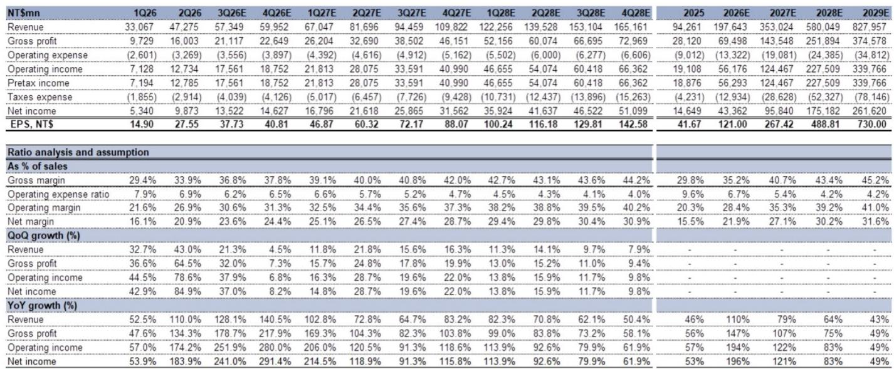
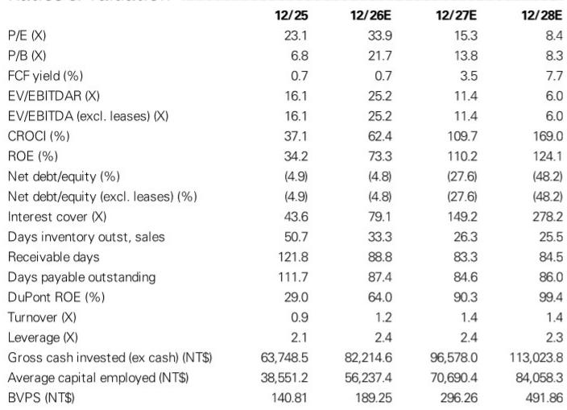
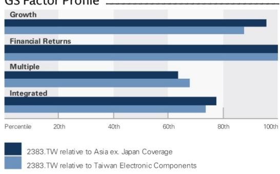

# 台光电子M9级材料拐点：2026年下半年如何重塑AI CCL市场格局

台光电子近期业绩说明会上最值得关注的信息，并非营收表现或季度指引，而是一个明确的时间节点：M9级铜箔基板（CCL）已于2026年第三季度进入量产阶段，NVIDIA HGX R200 UBB成为首个采用该材料的电路板。这意味着AI算力建设对上游材料的影响，正从规模增长转向利润增长。该公司毛利率已从第一季度的29.4%提升至第二季度的33.9%，而M9产品预估毛利率可达50%至55%以上，这代表着盈利能力的结构性变化，而非单纯的增量增长。市场对这一转变的定价尚不充分。

这一时刻的重要性在于三重因素的叠加。首先，M9 CCL正从样品验证阶段进入量产爬坡期，意味着组合中毛利率最高的产品即将成为重要的营收来源。其次，公司已释放信号，2026年下半年可能再次调价，原因在于玻纤布与高端铜箔供应偏紧——这些成本压力台光电子有能力向下游传导。第三，载板用CCL业务毛利率可达40%至50%以上，预计最早于2026年第四季度迎来首批出货。上述任一因素都足以引起关注，三者叠加则指向公司盈利轨迹的重估，而当前估值尚未充分反映这一点。

对于观察者而言，关键问题并非台光电子是否会增长——2026年营收预测为1976亿新台币，较2025年增长109.7%——而是毛利率扩张能否超越营收增速。业绩说明会上的信息显示答案是肯定的。管理层对第三季度毛利率最保守的指引为35%±1.5个百分点，中值较第二季度扩张1.1个百分点。这一保守数字尚未计入潜在的涨价因素及M9需求的进一步增长，实际结果可能明显优于指引。产品结构优化与定价能力的结合，正在形成市场一致预期尚未充分纳入的毛利率轨迹。

## M9量产标志着从验证到盈利的转变，产品单价较上一代弹性较高以上

M9级CCL代表了AI材料体系中的一次阶跃式升级。M8级CCL采用低介电玻纤布配合HVLP3铜箔，而M9升级为低介电二代玻纤布配合HVLP4铜箔——这一规格升级带来每张板材100%以上的价格溢价。这不是边际改善，而是核心产品单位经济性的弹性较高。2026年上半年，尽管出货量有限，M9已占公司总营收的较低个位数百分比。随着第三季度量产爬坡并在第四季度加速，由于价格差异，该产品对营收的贡献将以远超出货量增速的比例增长。

需求信号不仅限于NVIDIA HGX R200 UBB。管理层表示，面向LPU（语言处理单元）的M9 CCL出货将于2026年第四季度启动。这种跨加速器架构的多元化布局降低了单一客户平台带来的集中度风险。多种AI计算设计在同一年内采用M9，表明这不是一次性的验证通过，而是平台级的迁移趋势。对于在M9级CCL领域占据领先地位的台光电子而言，这意味着公司不仅参与AI增长，而且是在材料体系中毛利率最高的层级参与。

毛利率的数学逻辑清晰。以当前价格计算，M9 CCL毛利率预估为50%至55%，而公司第二季度整体毛利率约为34%，因此营收结构每向M9倾斜一个百分点，对整体盈利能力都会产生放大效应。从季度营收轨迹来看：第二季度473亿新台币，第三季度预计573亿新台币，管理层指出这是至少15%的季度环比增长。若第四季度M9占营收比重达到10%——基于爬坡节奏这是合理假设——仅此一项即可为毛利率贡献1.5至2个百分点的提升。潜在的调价因素进一步增加了上行空间，公司已展现出将原材料成本上涨向下游传导的能力。

这一轮需求周期与此前AI驱动周期的区别在于毛利率扩张的持续性。管理层认为高端CCL供应偏紧的格局至少还将持续两年以上，公司截至2028年的产能已被终端客户全部预订。这不是周期性的价格波动，而是结构性的供需失衡，有利于拥有合格产品与稳定客户关系的既有参与者。公司已在讨论2028年下半年之后的产能分配，这显示出远超行业常规规划周期的需求可见度。

## 玻纤布与铜箔供应偏紧创造有利定价环境，台光电子可在量增的同时实现价格调整

2026年下半年的定价环境受到两类关键原材料供应偏紧的影响：玻纤布（包括E-glass与低介电二代等级）以及高端铜箔（主要为HVLP4）。这些并非大宗商品类投入品，而是合格供应商有限的专用材料。这些投入品的供应偏紧创造了有利的定价环境，台光电子可以通过价格调整来传导成本上升，管理层已明确表示2026年下半年存在再次调价的可能性。这将是连续第二轮价格调整，此前已推动毛利率从第一季度的29.4%提升至第二季度的33.9%。

这种定价能力的战略意义不仅限于当期的毛利率收益。在AI CCL市场中，验证周期长、切换成本高。一旦设计锁定特定材料规格，供应关系便具有粘性。台光电子在此环境下能够调整价格，不仅反映了供需动态，也体现了其作为最先进AI加速器平台合格供应商的地位。公司对传导成本上升的信心也表明，其客户——服务于AI供应链的载板与PCB制造商——在高端材料方面的替代选择有限。

竞争格局进一步强化了这种定价能力。管理层对低端CCL同行宣称在M10产品上取得进展的说法不予重视，指出这些竞争对手缺乏高端应用的验证历史与制造能力。台光电子已提交M10样品供验证，但预计短期内不会被采用。这表明公司在最先进等级产品上的领先地位不易被挑战，随着技术向更先进世代迁移，竞争壁垒在持续加宽。公司预计，随着CCL向更先进世代演进，长期竞争格局将更加有利。

这种定价环境对公司的毛利率结构还有二阶影响。如果台光电子能够在出货量增长的同时维持价格调整，经营杠杆效应将变得显著。公司的营业费用基础相对固定——从第一季度的26亿新台币到第三季度的预计36亿新台币——而同期营收从331亿新台币增长至573亿新台币。这创造了与毛利率改善叠加的营业利润率扩张。预测清晰地展现了这一动态：EBIT利润率预计从2025年的20.3%扩张至2026年的28.4%，2027年达到35.3%，2028年达到39.2%。

## 载板用CCL于2026年底开始出货，开辟第二条高毛利增长曲线，市场份额有望在一年内弹性较高

M9 CCL是近期的催化剂，而载板用CCL机会代表了增长故事的下一篇章。载板用CCL市场2025年规模约为13亿美元，若增速与ABF/BT载板行业轨迹一致，2027年有望达到34亿美元，2028年达到55亿美元。台光电子2025年市场份额为1.6%，预计一年内将弹性较高。公司计划于2026年第四季度将载板用CCL产能扩大100%，2027年再扩大100%。对于一个尚未实现首批商业出货的业务而言，这是有计划的积极布局。

据公司评估，供应偏紧时期载板用CCL的毛利率可达50%至70%。即使取该区间下限，也显著高于公司当前的整体平均水平。首批出货最早可于2026年第四季度启动，这意味着毛利率贡献可能在两个季度内开始体现。时间节点值得注意：恰逢M9 CCL爬坡至可观出货量之际，载板用CCL业务开始贡献。这创造了超越当前年度的递进式毛利率扩张故事。

市场规模背景有助于理解其潜力。2025年载板用CCL的潜在市场13亿美元，仅约为台光电子2025年943亿新台币营收（约29亿美元）的40%。即使市场份额大幅提升，载板用CCL的营收贡献相对于核心业务仍将有限。战略价值不在于营收规模，而在于毛利率增厚。若载板用CCL到2028年能达到10%的市场份额——较当前1.6%有大幅提升——营收约为5.5亿美元，但在50%至70%的毛利率下，利润贡献将不成比例地显著。这是一个盈利能力的故事，而非营收规模的故事。

产能扩张计划支持这一判断。在2026年和2027年分别计划5%和51%的年度产能增长基础上，公司计划于2028年第一季度和第二季度分别增加每月120万张和60万张的产能，到2028年年中较2027年底产能再增加19%。这些产能已被终端客户全部预订，验证了需求的可见度。公司并非基于推测建设产能，而是为满足已确认订单而建设，2028年下半年之后的产能分配讨论已在推进中。

## 2028年前的盈利轨迹揭示复合增长的毛利率故事，当前估值尚未充分反映

财务预测展现了一个盈利能力加速增长的故事。营收预计从2025年的943亿新台币增长至2026年的1976亿新台币、2027年的3530亿新台币和2028年的5800亿新台币——三年复合年增长率约为83%。但盈利增长更为显著。每股收益预计从2025年的41.67新台币上升至2026年的121.03新台币、2027年的267.52新台币和2028年的488.99新台币——同期复合年增长率约为127%。营收增长与盈利增长之间的差距，正是毛利率扩张的故事。

季度进展清晰地展示了拐点。从2026年第一季度到2028年第四季度，营收从331亿新台币增长至1652亿新台币——5倍增长。但营业利润从71亿新台币增长至664亿新台币——9.3倍增长。营业利润率从2026年第一季度的21.6%扩张至2028年第四季度的40.2%。这不是线性进展，而是由产品结构、定价能力和经营杠杆共同驱动的复合效应。同期毛利率从29.4%扩张至约44%是主要驱动力，营业费用杠杆在此基础上进一步叠加。

估值背景值得关注。当前股价为新台币4,100元，对应2026年盈利的市盈率为33.9倍——看似偏高，但需注意这是基于仍处于毛利率扩张早期的盈利水平。以2027年盈利计算，市盈率降至15.3倍；以2028年盈利计算，市盈率进一步降至8.4倍。过去三年AI组件供应商的峰值市盈率倍数表明，市场愿意为以三位数速度增长的盈利持续支付溢价。

现金流生成能力支撑了相关判断。自由现金流预计从2025年的25亿新台币增长至2026年的96亿新台币、2027年的520亿新台币和2028年的1132亿新台币。净负债率从2025年的负25亿新台币（净现金）改善至2028年的负849亿新台币——这意味着即使在投入产能扩张之后，公司仍将积累大量净现金。2026年225亿新台币、2027年150亿新台币和2028年150亿新台币的资本支出计划规模可观，但考虑到经营性现金流生成能力，完全可控。公司在为增长提供资金的同时，也在构建稳健的资产负债表。

## AI CCL供应链的评估框架：台光电子轨迹的启示

台光电子的案例可以转化为评估AI材料供应商的通用框架。第一个标准是产品世代领先性。拥有最先进等级产品验证资格的供应商——在此案例中为M9 CCL——能够获得最高毛利率层级。较上一代100%以上的价格溢价并非异常现象，而是合格供应稀缺价值的体现。需要评估一家材料供应商是拥有最先进等级产品的领先地位，还是快速追随者。随着每一代技术的演进，由于验证周期和客户关系的累积效应，竞争壁垒在持续加宽。

第二个标准是产能可见度。台光电子截至2028年的产能已被全部预订，公司正在讨论此后的产能分配。这是一个定性信号，表明需求可见度远超行业常规规划周期。拥有确认产能预订的供应商，其盈利可见度更高，执行风险更低。公司愿意将载板用CCL产能扩大100%——这是一个新业务——表明其信心基于客户承诺而非推测。

第三个标准是定价能力的持续性。在维持出货量增长的同时能够传导原材料成本上升，表明供需格局有利。台光电子预计高端CCL供应偏紧至少持续两年以上，表明定价能力并非暂时现象。公司对低端竞争对手M10宣称的不予重视表明，验证壁垒保护了定价环境。需要评估一家供应商的定价能力是周期性的还是结构性的。

第四个标准是当前产品周期之外的毛利率扩张潜力。台光电子的载板用CCL业务提供了第二条毛利率增长曲线，恰在M9爬坡成熟之际开始贡献。供应偏紧时期载板用CCL 50%至70%的毛利率潜力，创造了市场一致预期尚未包含的上行情景。2027年和2028年的产能扩张使公司能够把握这一机会。能够有序安排多个毛利率扩张驱动因素的供应商，能够创造复合增长特征，从而支撑更高的估值。

第五个标准是为增长提供资金的资产负债表实力。台光电子产生的现金流足以支持产能扩张，同时积累净现金。这降低了融资风险，提供了战略灵活性。公司净负债与EBITDA之比预计在2028年前保持为负，利息保障倍数从2025年的43.6倍扩大至2028年的278.2倍。这是一家能够自筹资金增长并向股东返还资本的公司——股息支付率维持在60%，每股股息预计从2025年的25.00新台币增长至2028年的293.40新台币。

最后一个考量是估值纪律。当前价格对应2028年盈利的远期市盈率仅为8.4倍。风险不在于高估，而在于低估毛利率扩张的速度。第三季度35%毛利率的保守指引——未计入调价因素和M9需求的进一步增长——表明管理层在给出保守指引。上行情景明显优于指引。

AI CCL供应链正处于产品世代领先性、产能可见度和定价能力交汇的拐点。台光电子到2028年的轨迹展示了这些因素如何复合作用，创造超越营收增长的盈利增长。对于评估这一供应链的观察者而言，框架清晰：识别世代领先者，确认产能可见度，评估定价能力的持续性，评估第二条增长曲线，验证资产负债表实力。在上述五个标准上均表现突出的公司，将是AI建设持续推进过程中值得关注的参与者。

*仅供参考。部分内容可能由AI基于原始材料生成、翻译、摘要或编辑，可能存在遗漏或错误。请独立核实。本文不构成投资、法律、税务、会计或其他专业建议。*

仅供参考。部分内容可能由AI基于原始材料生成、翻译、摘要或编辑，可能存在遗漏或错误。请独立核实。本文不构成投资、法律、税务、会计或其他专业建议。

