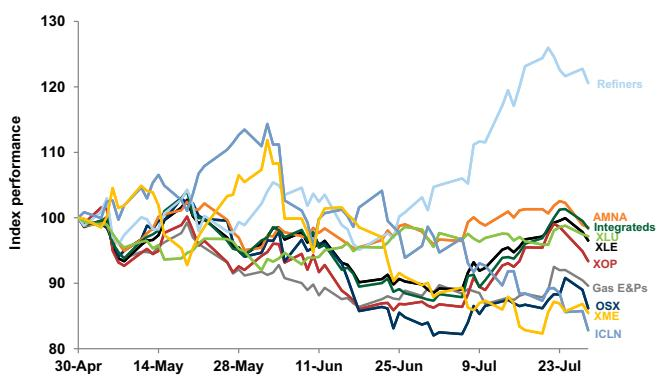
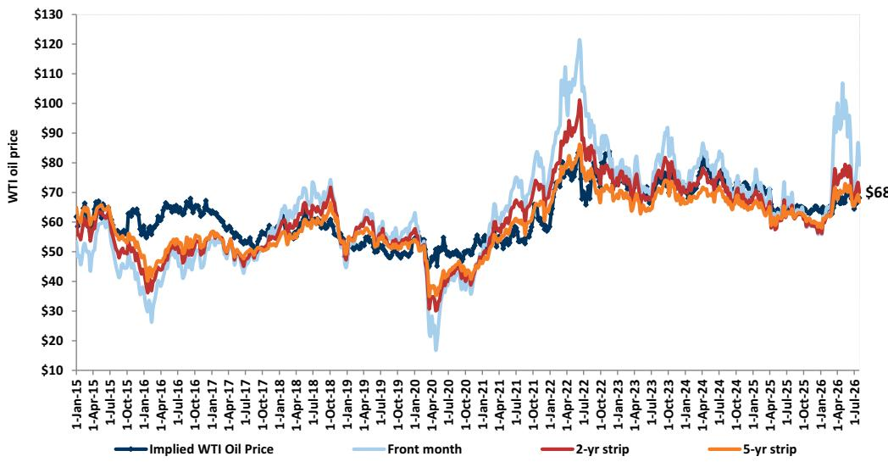
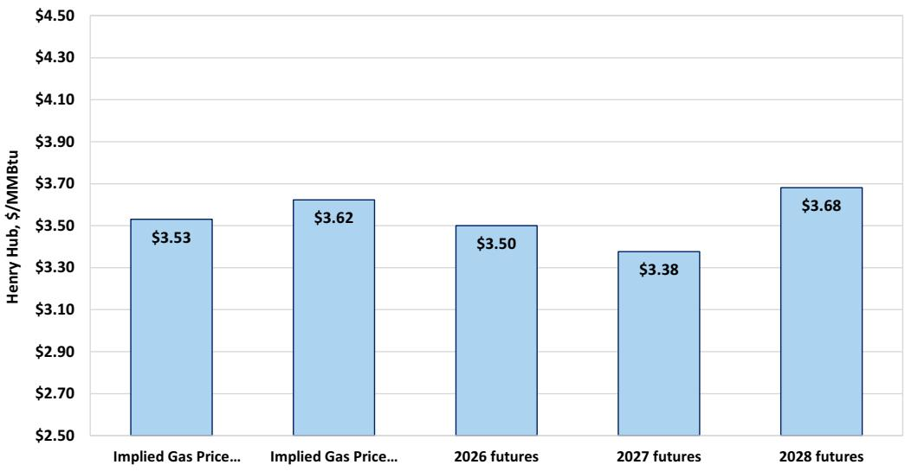
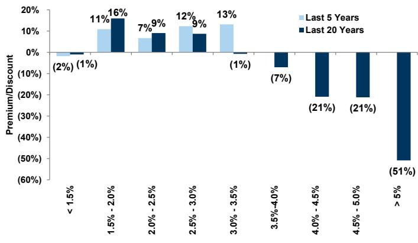
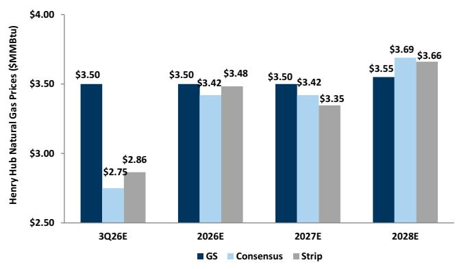
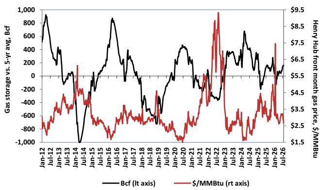

# 能源、公用事业与矿业观察：业绩期初期的几点思考

本业绩期内，部分公司在发布业绩后出现了报价波动，我们关注其对后续表现的影响。本期观察中，我们邀请资深研究团队讨论2026年第二季度业绩中表现较为突出的公司。团队将围绕以下问题展开：与先前判断相比，业绩中最值得关注的方面是什么；这些结果是否对行业其他公司具有参考意义；以及后续对这些公司的预期如何。

清洁技术：ENPH

能源服务：PWR

勘探与生产：EQT

综合油气与炼化：VLO

金属与矿业：NUE

中游：KMI

公用事业：FE

## 清洁技术

Neil Mehta
+1(212)357-4042 | neil.mehta@gs.com
GS & Co. LLC

## 能源服务

Brian Lee, CFA
+1(917)343-3110 | brian.k.lee@gs.com
GS & Co. LLC

在清洁技术领域，ENPH是我们覆盖范围内第一家发布业绩的太阳能公司，结果基本符合预期。更重要的是，公司对2026年第四季度的展望好于此前预期，尤其是包含约6100万美元的safe harbor活动后。展望未来，管理层表示欧洲市场需求强劲，尤其是电池储能领域，同时美国市场的预付租赁业务持续取得进展。公司还提到其固态变压器（SST）产品在数据中心领域取得了一些积极进展，包括已进入RFI和RFP谈判阶段的项目管线规模达到多吉瓦级。此外，管理层提到近期宣布的电力逆变器进口限制措施可能为工商业（C&I）市场带来更多机会。我们认为这些结果对住宅市场具有积极的参考意义，尤其是考虑到欧洲市场的表现，以及逆变器限制措施后工商业领域的前景。我们相信SST机会的乐观预期仍是关键的潜在上行催化因素，读者正在评估2027年的潜在增长路径与2026年safe harbor提振之间的关系。

John Mackay
+1(212)357-5379 | john.mackay@gs.com
GS & Co. LLC

Carly Davenport
+1(212)357-1914 | carly.davenport@gs.com
GS & Co. LLC

Nick Cash
+1(212)357-6372 | nick.cash@gs.com
GS & Co. LLC

Alexa Petrick Breno
+1(917)343-9472 | alexa.breno@gs.com
GS & Co. LLC

Olivia Foster
+1(801)212-7314 | olivia.foster@gs.com
GS & Co. LLC

本业绩期内，Quanta Services（PWR）表现突出，公司报告的调整后EBITDA较市场一致预期高出约21%，并将2026财年有机增长指引中值上调约13%。同时，PWR宣布完成四项收购，进一步增强了公司的技术工人和制造能力。随着PWR着眼于长期利润率增长并在数据中心和负荷中心市场进行布局，这些新增能力增强了我们对公司长期收入增长和利润率提升的信心。我们目前估计到2030年EPS复合年增长率约为19%，这反映了垂直一体化项目、765千伏输电线路和数据中心建设的贡献持续增加。随着PWR不断提升制造能力并将这些服务扩展到更多地区，我们对其长期增长保持积极看法，这得益于其在输配电领域最大参与者的地位，以及电网在未来数年持续电气化和扩建的趋势。鉴于PWR业绩的强劲表现，我们也在关注本业绩期内同行的表现，因为该行业仍受益于电力需求主题下的高增长趋势。

## 勘探与生产

在我们已发布业绩的勘探与生产覆盖公司中，EQT的结果较为突出，其2026年第二季度产量较一致预期高出5%，同时在较低维护性资本支出指引下上调了全年产量指引。对于EQT的业绩，最令我们意外的是公司持续进行的压缩测试对井况结果的显著影响——公司指出这些压缩项目使EQT的基础递减率表现提升了3%。对勘探与生产子行业其他公司具有参考意义的两个关键点是：1）近期天然气产量和供应前景持续强劲，与2）阿巴拉契亚地区长期需求上行潜力可观。首先，我们看到EQT上调了产量展望，同时多家同行也释放了不同程度的增长信号，这对近期天然气价格形成一定影响——2026年天然气远期曲线自2025年底以来已有明显变化，部分原因在于市场对二叠纪伴生气供应的强劲预期。我们还注意到EQT对阿巴拉契亚地区约200亿立方英尺/日潜在需求增长的展望，这些需求来自电力、数据中心和出口通道扩张，这对天然气勘探与生产子行业的长期前景具有积极参考意义。这一上行潜力的很大一部分仍需通过最终投资决定（FID）和其他确定性协议来验证，因此我们关注后续公告的进一步明确，同时注意到EQT迄今有效的商务和营销策略。

## 综合油气与炼化

在综合油气与炼化覆盖范围内，Valero Energy（VLO，报告评级）是迄今表现最为突出的公司之一。VLO报告的2026年第二季度每股收益为12.54美元，而GS和FactSet一致预期分别为10.25美元和10.13美元，这得益于墨西哥湾沿岸炼化和可再生柴油业务好于预期的表现。因此，在更强的现金流生成支持下，公司本季度的股东回报超出了我们的预期——管理层通过回购和分红共返还了约26亿美元。在电话会议中，我们注意到VLO讨论了成品油裂解价差前景的积极因素，包括库存水平、全球产能扰动、不断增长的出口需求以及有韧性的需求端，我们预计这对炼化行业的其他公司应具有积极的参考意义。话虽如此，虽然我们注意到年初至今的领先表现，但我们继续看好VLO的前景，认为公司是当前较高利润率环境下的主要受益者之一。此外，我们关注到公司的资产负债表实力、执行记录、优质资产组合以及对股东回报的持续承诺。

## 金属与矿业

在金属与矿业领域，NUE的结果最为突出。虽然业绩好于预期，但前瞻性评论比预期更为乐观——2026年产量指引目前接近同比增长10%。这一趋势继续显示需求正在回流至本土企业，国内钢铁生产商因去年实施的50%的232条款关税而从进口中获取市场份额。这一评论还伴随着强劲的需求信号，能源、公共基础设施、数据中心需求等多年度投资周期提供了支撑。此外，尽管汽车需求仍相对温和，但国内汽车用钢需求的评论正在增强，这也引起了我们的注意——汽车制造商正转向国内采购钢材，这应为需求提供额外支撑。我们认为NUE的评论对我们整个行业具有积极参考意义，因为更高的产量和利用率应继续推动2026年下半年的经营杠杆和利润率扩张。

## 中游

在中游领域，KMI上周率先发布了业绩，公司实现了稳健的业绩超预期，部分受益于商品/价差收益（丁烷调和、Waha价差），并上调了2026财年指引。展望未来，项目储备环比下降至96亿美元（此前为101亿美元），符合我们的预期，但管理层表示有望在2026年下半年宣布至少14亿美元（或更多）的新项目，预计将抵消10亿美元即将投入运营的项目。未来几个季度值得关注的具体项目包括：尚未做出最终投资决定的Western Gateway项目，目前预计将在未来1-2个月内达到FID（而此前可能伴随2026年第二季度业绩一起宣布），以及TGP的219 South项目和NGPL的Permian Link项目等预FID项目——这些将是评估KMI利用其覆盖区域内不断增长的电力需求能力的关键参考。我们认为KMI本季度的稳健执行对具有丁烷调和能力的产品运营商和能够围绕Waha价差进行营销的天然气管道运营商具有潜在的积极参考意义。展望未来，我们维持对KMI的积极看法，认为公司是仍然强劲的天然气基础设施主题的受益者，该主题仍是行业中最具可见性和持久性的方向。我们认为公司有望在超过100亿美元的预FID项目储备中获得合理份额，同时我们注意到市场对KMI的预期相对同行仍较为温和——市场已愿意为同行的大量预FID增长进行定价。

## 公用事业

在我们电力/公用事业覆盖范围内，目前仅有四家公司发布了业绩，FirstEnergy（FE）是其中引起我们关注的公司之一。虽然业绩本身与一致预期相符，且运维费用的时间分布比我们预期的更集中在第二季度，但我们继续认为公司有能力稳健实现全年目标。我们认为本季度最大的增量更新是数据中心项目管线的更新以及对西弗吉尼亚州潜在机会的评论。公司继续预计其Maidsville能源中心的CPCN将在下半年获得批准，如果获批，可能为公司的基础费率增长展望增加100个基点的增量。管理层还表示，由于该地区数据中心客户的强烈兴趣，公司正在探索建设第二座天然气发电厂的可能性，并指出可以考虑不同的结构以确保快速供电和客户保护，包括类似GenCo的结构。我们认为这为我们目前到2030年8%的EPS复合年增长率预期提供了上行空间，我们相信随着监管日历上的不确定性逐步消除，将推动公司估值重新评估，缩小与覆盖范围内其他公司的估值差距。虽然我们覆盖范围内也有其他公司涉足西弗吉尼亚州，AEP也对该市场有敞口，这可能在大负荷和输电/发电资本支出机会方面提供上行潜力。此外，我们继续认为数据中心更新对受监管公用事业整体而言是潜在的积极驱动因素，因为这对基础费率和盈利增长展望构成支撑。

## 编辑精选图表

图表1：能源、公用事业与矿业子行业表现
过去90天（2026年4月30日至2026年7月29日）

来源：FactSet，GS全球投资研究

图表2：我们认为勘探与生产公司反映的资金成本高于10%
勘探与生产公司基于五年期货的隐含折现率四周滚动均值

来源：Bloomberg，GS全球投资研究

图表3：我们估计7月底全球炼厂加工量同比下降650万桶/日，因中东和俄罗斯炼厂持续受到袭击

来源：IEA，Kpler，GS全球投资研究

图表4：全球炼厂加工量从4月低点回升，但7月仍处于疫情以来同期最低水平

来源：GS全球投资研究

## 行业背景

图表5：勘探与生产公司的估值反映WTI原油价格略低于五年期货
覆盖的勘探与生产公司中隐含的历史WTI价格与远期原油期货，美元/桶

来源：FactSet，GS全球投资研究

图表6：以天然气为主的勘探与生产公司大致隐含约3.60美元/百万英热单位的长期天然气价格，而我们中期观点为3.50美元/百万英热单位，2026/2027/2028年天然气期货约为3.50/3.38/3.68美元/百万英热单位

我们FCF回报表现分析中覆盖的天然气生产商隐含的Henry Hub天然气价格，对比2026/2027/2028年Henry Hub天然气期货

来源：FactSet，GS全球投资研究

图表7：从历史来看，当10年期美国国债回报表现低于约3%时，公用事业相对标普500的市盈率存在溢价，但在实际利率为负的时期，这一关系有所弱化

不同10年期美国国债回报表现环境下公用事业相对标普500的市盈率溢价/折价

来源：公司数据，GS全球投资研究

## 与读者的交流

## 勘探与生产 - Neil Mehta

EXE。读者在EXE于7月28日发布2026年第二季度业绩后持续关注该公司，同时关注7月27日宣布的以12.5亿美元收购Twin Eagle的计划。在业绩方面，读者注意到公司本季度自由现金流超出市场一致预期，考虑到天然气价格的走势。读者继续关注长期天然气需求潜力，而近期价格走势使得EXE目前以10%的自由现金流回报表现交易，相对于同行平均8%的水平（同行包括CRK、EQT、AR、NFG、RRC和TOU）。读者还注意到管理层在第一季度专注于降杠杆后，今年迄今已回购8.49亿美元，体现了对股东回报的关注。关于Twin Eagle收购，读者关注公司在2028年底前实现1.5亿美元协同效应目标的前景。读者也在寻求更多关于EXE与同行相比在获取增量商业和营销协议方面竞争定位的明确信息。

TOU。读者在TOU于7月29日发布2026年第二季度业绩后也持续关注该公司。其中一个特别关注点是TOU宣布NEBC二期建设暂停一年，读者希望了解这一暂时暂停对2027年下半年/2028年股东回报增量机会的影响。鉴于公司表示如果管理层看到定价环境持续改善，将保持按原时间表恢复二期建设的灵活性，读者期待更多关于哪些宏观指标会构成二期时间表策略变化的评论。在液体价格环境较高的背景下，读者也关注TOU在2026年下半年液体产量的展望，以及当前显著价格波动的宏观环境。

## 综合油气与炼化 - Neil Mehta & Alexa Petrick

加拿大油砂公司。本周读者关注加拿大油砂公司，CVE率先发布2026年第二季度业绩。CVE实现了强劲的每股经营现金流超预期，上调了全年产量指引以反映油砂业务的强劲表现以及Foster Creek和Christina Lake优化周转活动的成果，同时资本支出保持不变。展望未来，我们预计随着West White Rose在2026年第三季度末投产，公司将从产量和自由现金流增长中受益。运营可用性和炼化资产的持续成本纪律使公司能够利用当前定价环境——中西部库存较低、裂解价差稳健、重油价差走阔。虽然许多读者关注MEG收购后的杠杆水平，但我们注意到本季度资产负债表取得了显著进展，净债务目前低于60亿加元，使管理层能够将约75%的超额自由现金流返还给股东。话虽如此，一些短期视角的读者也可能因年初至今的强劲表现而保持谨慎。对于即将发布的IMO.TO、SU和CNQ业绩，读者关注产量增长、资本回报、管道出口、利润率捕捉以及天气状况等方面的评论。

美国综合油气公司。读者在XOM和CVX明日发布2026年第二季度业绩之前将注意力转向这两家公司。根据近期XOM的8-K文件，读者关注上游、下游和化工业务的环比改善。对公司持积极看法的读者继续强调二叠纪技术的优势、有吸引力的炼化敞口和持续的资本回报。相对估值仍是关键讨论点——我们注意到XOM在2027/2028年的自由现金流回报表现为6%，而CVX为8%。读者还关注卡塔尔受损LNG列车恢复时间表的更新。对于CVX，读者强调长期自由现金流增长与资本纪律的结合。许多人认为公司进入本季度具有积极态势，反映了美国本土以及TCO、Gorgon和Wheatstone的运营动能，同时圭亚那项目提供支撑，委内瑞拉和阿根廷可能带来产量上行。主要的讨论点涉及投资组合中的地缘政治风险，尤其是近期头条新闻后哈萨克斯坦的情况。

## 能源服务 - Neil Mehta

LBRT。本周与读者的交流聚焦于LBRT——公司在7月22日发布业绩后报价面临一定压力。读者关注LBRT 2026年资本支出要求的增加——公司指引的资本支出高于此前预期，目前预计2026财年约为15亿美元，而此前指引约为11亿美元。随着资本支出增加，单位兆瓦资本支出也有所上调——公司目前估计其表后项目的平均资本支出约为170万美元/兆瓦。我们在业绩发布后与LBRT管理层举行了一次电话会议，公司讨论了2026年及未来数年的资本支出预期，以及对2026年下半年签署可能超过500兆瓦的电力服务协议（ESA）的预期。读者关注LBRT为增加的资本支出提供资金的计划，以及公司可能采用哪些不同策略来支持高于预期的资本支出。市场还关注ESA的性质，以及如果ESA时间表推迟，LBRT是否会考虑过桥融资选项。LBRT管理层表示计划对合同使用项目融资，并认为长期客户管线强劲。

FTI。公司在7月30日发布业绩后，读者关注相对报价表现和前瞻订单情况。由于EBITDA结果高于GS和市场预期，读者关注2027年订单目标可能是什么——公司重申了对2026年至2027年水下订单增长的预期。管理层评论聚焦于2027年与2026年订单构成的差异，并指出2027年订单预计将由较大的新建项目组成，而2026年则主要是较小的棕地回接项目。随着公司继续推进水下业务其他部分的产业化（称为iEPCI 2.0），读者关注该举措可能为水下业务带来的增量EBITDA利润率扩张，以及未来数年订单增长的幅度。

## 公用事业 - Carly Davenport

FE。本周FE发布了第二季度业绩，该公司的表现在我们的读者交流中仍存在不同看法。对FE持更积极看法的读者强调：（1）西弗吉尼亚州的上行机会——Maidsville能源中心的单一天然气发电厂可为计划增加100个基点的增量基础费率增长（据公司），且由于该地区数据中心的强烈兴趣和州政府的强力支持，还有可能建设更多天然气发电厂；（2）在传输业务已经强劲的基础费率增长之上，数据中心增长和PJM开放窗口可能带来增量传输研究线索；（3）相对同行存在估值折价，且未来六个月有明确的催化因素，包括CPCN批准和西弗吉尼亚州通胀与投资调整机制的最终命令。持更谨慎看法的读者主要关注FE在多个PJM州的监管风险，包括新泽西州、马里兰州、宾夕法尼亚州和俄亥俄州。担忧主要集中在 affordability 以及新泽西州/马里兰州的监管结果、在回收机制不够有利的情况下资本可能从宾夕法尼亚州重新分配，以及俄亥俄州的州长选举风险。也有一些读者对西弗吉尼亚州的上行潜力持怀疑态度，尽管管线势头积极，但该地区的数据中心建设仍处于非常早期的阶段。

PCG。上周PCG率先发布了公用事业业绩，我们在业绩发布后收到了许多读者的问询。读者普遍在评估该公司的合适入场时机——加州州议会下周从夏季休会期返回，可能会推进该州的野火改革立法。立法会议的结果仍存在不确定性，讨论集中在是否会采取行动，或者由于州长任期将于今年晚些时候结束，潜在改革是否会被推迟到未来的立法会议。一些读者也询问是否会考虑由州政府支持的解决方案，将负担更广泛地分摊而不仅仅由加州读者拥有的公用事业客户承担。还有读者关注公司如果野火改革未获通过时的B计划——读者试图评估相对于五年730亿美元资本计划，有多少资本支出可能面临削减风险，以及公司可能如何调整资本配置策略。最后，还有一些关于公司数据中心负荷的问题，尽管一些读者仍在讨论加州是否会出现有意义的数据中心负荷。

## MLP/管道 - John Mackay & Olivia Foster

关注KGS核心压缩业务价值及电力上行空间。本周我们收到了多位读者关于KGS核心压缩业务价值的问询，此前公司报价自7月22日以来下跌了16%。这一回调是由2026年第二季度业绩后更广泛的AI和电力市场波动所驱动，包括LBRT在业绩电话会议上对长期前景持更谨慎态度（前期支出增加、对发电终值的质疑），这与PUMP积极的合同签订势头形成对比。相对更积极的市场情绪来自周二我们与LBRT管理层的线上读者活动——强调了长期合同期限和到2026年底超过500兆瓦的服务协议，以及PUMP新签约的发电容量（尽管我们注意到这些合同是针对上游和工业客户的）。值得注意的是，数据中心机会由于商业流程更为复杂，实现时间似乎更长，而油气或工业应用可能提供更快的转化时间。对于KGS，读者正在讨论电力上行空间，关注商业动能、项目经济性和回报——同时试图确定该公司的基本面底部（核心压缩业务）。大多数读者认为近期回调过度，强调支撑性宏观因素（长交付周期和行业纪律）、定价能力和利润率扩张潜力对基础压缩业务具有建设性。展望下周的业绩发布，虽然重大商业公告应会在今年晚些时候发布（根据管理层评论），但读者正在关注合同签订动能评论、KGS参与微电网解决方案的意愿、资本支出增加的可能性以及对压缩基本面的信心。

Paducah数据中心公告对天然气需求的初步参考意义。本周，包括Brookfield、NextEra Energy（NEE）和地方公用事业在内的联合体宣布在肯塔基州Paducah建设一个1000亿美元的数据中心园区，包括建设2吉瓦天然气发电和高达2.6吉瓦电池储能容量，全部建设目标于2032年完成。我们本周收到了多个关于电力用气增量需求参考意义以及哪些管道最有能力捕捉这一机会的问询。鉴于与Paducah场址的邻近性，读者讨论集中在以下四条管道是否可被视为最有优势：Trunkline（ET）、TGT（Boardwalk）、TETCO（ENB）和ANR（TRP）。在规模方面，读者询问这对增量输气量意味着什么——以每吉瓦数据中心电力约2亿立方英尺/日的假设为例，高达2吉瓦的天然气发电将意味着约4亿立方英尺/日。接下来，关注点仍在于哪个运营商最终获得增量运输承诺、任何预FID项目公告相对于分阶段发电建设的时间安排，以及对更广泛天然气管道行业的参考意义——电力用气需求继续是该行业的关键增长驱动因素。

## 清洁技术 - Brian Lee

太阳能。本周读者对关键太阳能公司业绩的兴趣有所增加，包括业绩发布前的预期和仓位情况——涉及ENPH（周二晚间发布）以及FSLR和NXT（7月30日收盘后发布）。在住宅侧，有关于美国和欧洲需求状况的问题，尤其是储能方面，以及固态变压器和其他新产品的展望。此外，ENPH业绩发布后我们持续收到问询——读者试图评估2027年收入相对于2026年确认的safe harbor活动的趋势。在公用事业规模侧，读者试图了解正在进行的232条款调查何时可能出结果，以及潜在的市场影响。此外还有一些更个股化的问题，如对FSLR的订单和平均售价预期，以及NXT近期收购的潜在更新和对财务表现的潜在影响。

稀土。本周我们收到了更多关于稀土行业的问询。读者希望了解近期相关公司报价变化的原因，以及短期内还有多少进一步下行风险。同样，我们也收到了关于行业整体格局的问题，包括地缘政治担忧，以及11月即将实施的中国出口限制是否有影响。此外，还有更多针对MP、UUUU和METC的公司特定问题，包括近期催化因素、对运营执行的看法以及其他个股因素。

## 金属与矿业 - Nick Cash

STLD。在我们恢复对该公司的覆盖后，本周关于STLD的读者问询有所增加。虽然大多数读者认同持有钢厂仍是首选投资策略，但估值似乎偏高，这令持谨慎态度的读者有所顾虑。读者继续讨论STLD与NUE的比较，以及在国内钢铁需求和定价环境改善的背景下，哪家公司具有最大的上行变化率。NUE是基本面产量/市场份额获取的故事，而一些读者认为STLD的铝业务被低估，随着2026年下半年产量爬坡，可能推动盈利上行。

## GS能源重点研究报告

## 本周GS能源研究

Cenovus Energy Inc. (CVE)：看好2026年下半年布局，West White Rose临近首油且去杠杆持续

HF Sinclair Corp. (DINO)：继续认为公司报价相对SOTP价值存在有吸引力折价；目标价114美元，报告评级

美洲能源：石油：适度上调SU和CNQ目标价；关注管道展望、资本回报与增长

Liberty Energy Inc. (LBRT)：管理层会议要点：年底前ESA可能超过500兆瓦，上调资本支出指引由项目融资支持

美洲能源：油气 - 勘探与生产：平衡近期天然气宏观温和与长期需求潜力强劲；买入EQT，RRC中性，中期观点3.50美元/百万英热单位

美洲能源：油气 - 勘探与生产：在不确定的石油宏观环境中筛选个股机会；FANG看生产率，DVN看简化

美洲美国电力管道：6月容量增加，电池储能和太阳能推动新增

SLB (SLB)：保持积极看法，受益于国际活动恢复和个股机会，贡献长期增长；报告评级

Hayward Holdings (HAYW)：2026年第二季度业绩超预期，2026财年指引维持，似乎在获取份额；中性

Pentair Plc (PNR)：业绩符合预期，Pool去库存持续，拟收购Taco将扩大数据中心敞口；中性

Enphase Energy Inc. (ENPH)：近期展望好于担忧，得益于safe harbor和欧洲；SST客户牵引力是潜在的下一个催化因素；买入

Xylem Inc. (XYL)：第二季度业绩基本符合预期，但数据中心动能似乎在积聚，利润率扩张保持完好

Kodiak Gas Services Inc. (KGS)：估值低于核心压缩价值，BTM担忧过度——重申买入

Kinder Morgan Inc. (KMI)：2026年第二季度回顾：稳健季度；2026年下半年项目公告加速是长期增长预期的关键

Golar LNG (GLNG)：涡轮机订单指向第四艘船FID动能——重申买入

FirstEnergy Corp. (FE)：2026年下半年监管不确定性消除将支持数据中心上行和盈利增长可见性；买入

美洲公用事业：电力 - IPP：更新第二季度预期；关注PJM和ERCOT监管进展

## 全球科技 全球数据中心容量更新：容量预期提高，但紧张状况持续

Steel Dynamics Inc. (STLD)：在有利的商品价格支撑和反周期铝业务上行空间下恢复报告评级

Nucor Corp. (NUE)：2026年第二季度业绩强劲；需求和利润率动能提升盈利能力和自由现金流；重申买入

## 大宗商品 - 原油和天然气期货

图表8：原油：GS vs. 一致预期 vs. 期货
GS大宗商品估计 vs. 一致预期 vs. WTI原油期货价格，美元/桶

来源：FactSet，Bloomberg，GS全球投资研究
图表9：天然气：GS vs. 一致预期 vs. 期货
GS大宗商品估计 vs. 一致预期 vs. 天然气期货价格，美元/百万英热单位

来源：FactSet，Bloomberg，GS全球投资研究
图表10：天然气库存相对五年均值存在温和盈余
天然气储存 vs. 五年均值（十亿立方英尺）vs. Henry Hub近月天然气价格（美元/百万英热单位）

来源：EIA，GS全球投资研究

## GS能源与公用事业分析师贡献者

## GS能源、公用事业与矿业团队

来源：GS全球投资研究

## 估值与主要风险

EQT。我们12个月目标价为62美元，基于2027/2028年估计8.0%的目标FCF回报表现，假设布伦特原油价格75美元/桶和Henry Hub天然气价格3.50美元/百万英热单位。主要风险包括大宗商品价格走低（尤其是天然气）、管道建设延迟、成本上升、政府政策变化以及井况结果不及预期。收盘价：52.58美元

KMI。我们维持报告评级，12个月目标价35美元，基于2027年EBITDA估计的12.5倍倍数。下行风险包括：1）天然气需求爬坡慢于预期，2）新的意外重新签约阻力，3）费率案件阻力大于预期，4）新项目回报低于预期，5）RNG战略执行情况，6）大宗商品价格走低，尤其是原油对EOR业务的影响，7）高倍数收购，以及8）资产负债表能力过度使用于回购或新项目。收盘价：31.86美元

FE。我们对FE持报告评级，12个月目标价55美元，基于Q5-Q8估计的18倍市盈率倍数，反映相对我们基准1倍的溢价。报告评级FE的主要风险包括：1）俄亥俄州费率案件结果不利；2）养老金费用和/或利息费用可能高于预期；以及3）温和天气可能对FE的盈利产生影响。收盘价：49.13美元

NUE。我们12个月目标价为303美元，基于2026-2028财年平均EBITDA的9.5倍EV/EBITDA倍数。风险：1）废钢成本高于预期；2）关税下调；3）国内产能增加可能对价格产生下行影响；4）经济增长慢于预期可能导致美国钢铁需求减速。收盘价：256.16美元

PWR。我们12个月目标价为826美元，反映我们32.0倍NTM EV/EBITDA目标倍数。我们对PWR持报告评级。主要风险：1）项目量动能丧失导致各分部收入复合年增长率放缓，2）供应链相关挑战导致项目交付延迟，3）成本通胀或其他运营挑战导致三个分部的利润率进展放缓。收盘价：560.07美元

ENPH。我们12个月目标价为55美元，基于我们20.0倍目标市盈率应用于Q5-Q8每股收益，然后加回约7美元的每股净现金。主要风险包括收入增长和利润率低于预期、竞争和技术格局变化、中美关税以及渠道中的异常库存积累。收盘价：34.90美元

VLO。我们对VLO持报告评级，6个月市盈率（我们正常化EPS预测的16.0倍）和SOTP基础目标价为357美元。主要风险涉及炼化利润率、运营执行和资本回报。收盘价：302.28美元

## 披露附录

## Reg AC

我们，Neil Mehta、Brian Lee（CFA）、John Mackay、Carly Davenport、Nick Cash、Alexa Petrick Breno和Olivia Foster，特此证明本报告中表达的所有观点均准确反映了我们个人对相关公司及其证券的看法。我们还证明，我们的薪酬中没有任何部分直接或间接与本次报告中表达的具体建议或观点相关。

除非另有说明，本报告封面所列人员均为GS全球投资研究部分析师。

贡献作者：Neil Mehta GS & Co. LLC，Brian Lee（CFA）GS & Co. LLC，John Mackay GS & Co. LLC，Carly Davenport GS & Co. LLC，Nick Cash GS & Co. LLC，Alexa Petrick Breno GS & Co. LLC，Olivia Foster GS & Co. LLC。

除非另有说明，本报告贡献作者披露中所列人员均为GS全球投资研究部分析师。

## GS因子画像

GS因子画像通过将关键属性与市场（即我们的评级股票池）及其行业同行进行比较，为股票提供投资背景。所描绘的四个关键属性为：增长、财务回报、倍数（即估值）和综合（增长、财务回报和倍数的复合）。增长、财务回报和倍数通过使用每只股票特定指标的标准化排名来计算。各指标的标准化排名随后取平均值并转换为相关属性的百分位。每个指标的具体计算可能因财年、行业和地区而异，但标准方法如下：

增长基于股票的前瞻性销售增长、EBITDA增长和EPS增长（对于金融股，仅EPS和销售增长），百分位越高表示增长性越强。财务回报基于股票的前瞻性ROE、ROCE和CROCI（对于金融股，仅ROE），百分位越高表示财务回报越高。倍数基于股票的前瞻性市盈率、市净率、价格/股息（P/D）、EV/EBITDA、EV/FCF和EV/债务调整后现金流（DACF）（对于金融股，仅市盈率、市净率和P/D），百分位越高表示股票交易倍数越高。综合百分位计算为增长百分位、财务回报百分位和（100% - 倍数百分位）的平均值。

财务回报和倍数使用GS分析师在未来至少三个季度后的财年末预测。增长使用未来至少七个季度后的财年与未来至少三个季度后的财年相比的输入（所有指标均基于每股）。

有关我们如何计算GS因子画像的更详细说明，请联系您的GS代表。

## M&A排名

在我们的全球覆盖范围内，我们使用M&A框架审视股票，考虑定性因素和定量因素（可能因行业和地区而异），以纳入某些公司可能被收购的可能性。然后我们分配M&A排名，对我们评级覆盖下的公司从1到3进行评分，1代表公司成为收购目标的可能性较高（30%-50%），2代表中等可能性（15%-30%），3代表较低可能性（0%-15%）。对于排名为1或2的公司，按照我们标准部门指引，我们将M&A组成部分纳入目标价。M&A排名为3被视为不重要，因此不计入我们的目标价，且可能在研究中讨论也可能不讨论。

## Quantum

Quantum是GS的专有数据库，提供详细的财务报表历史、预测和比率的访问。可用于对单一公司进行深入分析，或比较不同行业和市场的公司。

## 披露

Kinder Morgan Inc.的评级是相对于其覆盖范围内的其他公司：Antero Midstream Corp.、Cheniere Energy Inc.、Cheniere Energy Partners、DT Midstream Inc.、EagleRock Land、Energy Transfer LP、Enterprise Products Partners LP、Excelerate Energy Inc、Golar LNG、Hess Midstream LP、Kinder Morgan Inc.、Kinetik Holdings、Kodiak Gas Services Inc.、LandBridge、MPLX LP、NextDecade Corp.、ONEOK Inc.、Plains All American Pipeline LP、Plains GP Holdings、South Bow Corp.、TC Energy Corp.、Targa Resources Corp.、Venture Global、WaterBridge Infrastructure、Williams Cos。

FirstEnergy Corp.的评级是相对于其覆盖范围内的其他公司：Ameren Corp.、American Electric Power、Consolidated Edison Inc.、Constellation Energy Corp.、Duke Energy Corp.、Edison International、Eversource Energy、Exelon Corp.、FirstEnergy Corp.、NRG Energy Inc.、PG&E Corp.、Public Service Enterprise Group、Sempra、Southern Co.、Talen Energy Corp.、Vistra Corp.、WEC Energy Group、Xcel Energy Inc.

EQT Corp.的评级是相对于其覆盖范围内的其他公司：APA Corp.、Antero Resources Corp.、Comstock Resources Inc.、Devon Energy Corp.、Diamondback Energy Inc.、EOG Resources Inc.、EQT Corp.、Expand Energy Corp.、Magnolia Oil & Gas、Murphy Oil Corp.、Occidental Petroleum Corp.、Ovintiv Inc.、Permian Resources Corp.、Range Resources Corp.、Talos Energy、Tourmaline Oil Corp.、Viper Energy Inc.

Valero Energy Corp.的评级是相对于其覆盖范围内的其他公司：CVR Energy Inc.、Calumet Inc.、Canadian Natural Resources Ltd.、Cenovus Energy Inc.、Chevron Corp.、ConocoPhillips、Delek US Holdings、ExxonMobil Holdings、HF Sinclair Corp.、Imperial Oil Ltd.、Kosmos Energy Ltd.、Marathon Petroleum Corp.、PBF Energy Inc.、Par Pacific Holdings、Phillips 66、Suncor Energy Inc.、Valero Energy Corp.

Nucor Corp.的评级是相对于其覆盖范围内的其他公司：Cleveland-Cliffs Inc.、Commercial Metals Co.、Freeport-McMoRan Inc.、Nucor Corp.、Reliance Inc.、Steel Dynamics Inc.

Enphase Energy Inc.的评级是相对于其覆盖范围内的其他公司：Acuity Inc.、Array Technologies Inc.、Cameco Corp.、Canadian Solar Inc.、Energy Vault Holdings、Enphase Energy Inc.、First Solar Inc.、Fluence Energy Inc.、HA Sustainable Infrastructure、Hayward Holdings、JinkoSolar Holding、MP Materials、Mueller Water Products Inc.、Nextpower、Nuscale Power Corp.、Oklo Inc.、Pentair Plc、Ramaco Resources Inc.、Shoals Technologies、SolarEdge Technologies Inc.、Sunrun Inc.、Universal Display Corp.、Uranium Energy Corp.、Veralto Corp.、Watts Water Technologies Inc.、Wolfspeed Inc.、Xylem Inc.

Quanta Services的评级是相对于其覆盖范围内的其他公司：Argan Inc.、Atlas Energy Solutions、Expro Ltd.、Halliburton Co.、Helmerich & Payne Inc.、Liberty Energy Inc.、MYR Group、MasTec Inc.、NOV Inc.、Patterson-UTI Energy Inc.、ProPetro Holding Corp.、Quanta Services、SLB、TechnipFMC Plc、Weatherford International Ltd.

<table><tr><td colspan="3">
