# 需求侧因素在信用债市场中的重要性日益提升

## 核心观点

今年以来，企业信用债市场的新发行活动明显提速。美元和欧元投资级（IG）企业债市场均有望创下年度总发行量的新纪录，杠杆融资市场的发行节奏也保持活跃。尽管不同行业和评级之间的表现存在明显分化，但多数指数层面的利差估值仍处于（金融危机后的）历史区间偏紧的一端。

我们认为，这在一定程度上反映了整体需求环境较为有利。同时，这也引出了一个值得关注的问题：这种需求支撑能否持续？在本期报告中，我们梳理了衡量信用债市场需求的几项指标，以期对这一问题进行探讨。

总体来看，我们预计总需求因素将对较为密集的供给节奏形成重要对冲，且这一供给节奏预计将在多数市场中延续。不过，与人工智能相关的生态系统内发债较为集中，这一结构性特征可能会推动利差出现温和走阔，与我们此前的预测一致，且风险更倾向于更大幅度的走阔。

## 资金流向：整体稳健

衡量需求最直接的指标是资金流向数据，其兼具实时性和颗粒度。根据EPFR的数据，广泛的美元IG债券ETF已连续65周录得净流入。下图显示，美元IG基金今年通过净流入增加的资产管理规模（AUM）约为8%，美元银行贷款基金（包括以CLO为投资标的的基金）则增加了6%以上。相对少见相对落后的类别是美元高收益（HY）基金，其年初至今的净流入为0.6%。

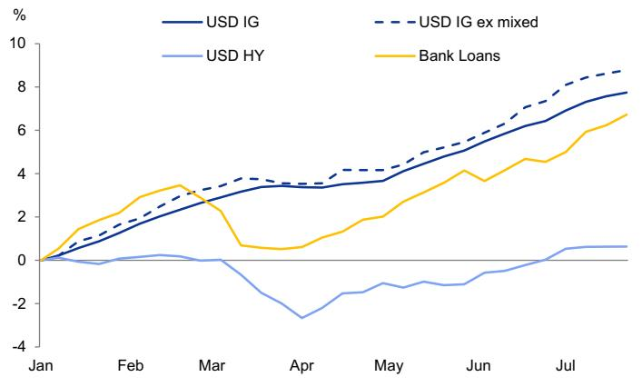
资料来源：EPFR，GS全球投资研究

在欧元市场，资金流入虽相对温和，但仍保持正值。下图显示，纯欧元IG企业基金年初至今的累计净流入为0.4%，欧元HY基金为1.2%。尽管这些数字表面上看似平淡，但值得注意的是，在利差偏紧和多重宏观因素交织的背景下，所有主要信用债市场年初至今均录得正净流入。

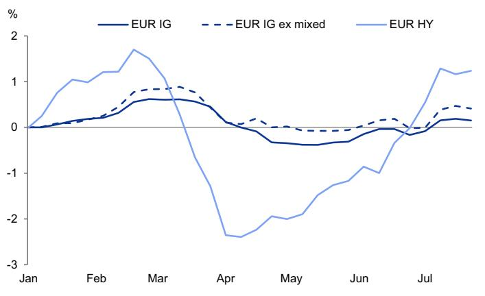
资料来源：EPFR，GS全球投资研究

在总体资金流数据之下，浮现出几个结构性特征。下图展示了各类工具（主动及被动ETF、共同基金）年初至今的累计净流入情况。被动ETF在多数资产类别中主导了年初至今的资金流，而主动管理型共同基金则大多出现净流出。鉴于信用债市场（尤其是围绕人工智能主题）的分散度上升，读者可能转向利用ETF工具来实现主动管理人的选择，这有助于解释规模较小的主动型ETF基金相对于共同基金的崛起。杠杆贷款市场是一个明显的例外，过去几年中，现有的主动管理型CLO ETF已主导了与贷款相关的资金流。

| 资产类别 | 被动ETF | 主动ETF | 主动共同基金 | 年初至今合计 |
|---|---|---|---|---|
| 美元IG（仅企业） | 48.0 | 4.8 | -3.3 | 49.5 |
| 欧元IG（仅企业） | 4.2 | 1.4 | -2.7 | 2.6 |
| 美元HY基金 | 3.6 | 3.5 | -4.6 | 2.6 |
| 美元贷款基金 | 0.4 | 12.1 | -1.9 | 10.6 |
| 欧元HY基金 | 1.0 | 0.1 | 0.8 | 2.0 |

资料来源：EPFR，GS全球投资研究

另一个值得关注的细节是IG资金流在回报表现曲线不同期限上的分化。下图显示，过去几个月，IG企业基金年初至今的流入更多集中在短久期和中久期基金，而长久期基金自5月以来则相对落后（尽管仍在录得流入）。作为背景，长久期基金占美元IG企业基金AUM的15%，短久期和中久期基金分别占36%和49%。

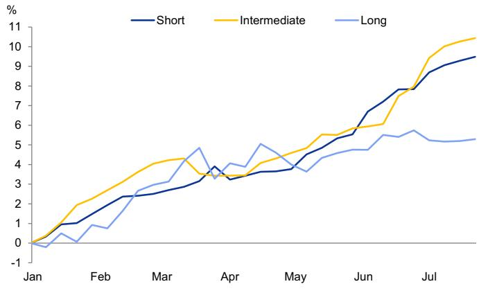
资料来源：EPFR，GS全球投资研究

虽然今年前四个月，基于回报表现的买家需求可能对长久期债券形成了支撑，但近期对长久期资产的需求已有所降温。这可能是对两方面因素的反应：（1）曲线长端面临的供给因素；（2）在央行领导层交接以及央行反应函数和对资产负债表等领域态度可能变化的背景下，信用债读者对长端利率路径仍存有一定的不确定性。年初至今，期限超过15年的债券占美元IG总发行量的27.6%，为五年来最高比例。

年初至今的表现也反映了这一特征。美元IG前端利差年初至今收紧了5个基点，而25年以上期限指数（即长端）的利差则走阔了15个基点。

## 交易商承接数据揭示读者偏好较短期限

衡量企业信用债需求的另一个稳健指标是交易层面的数据，特别是“交易商净承接”量，该指标衡量TRACE报告中交易商与客户之间的交易，将客户买入与客户卖出进行净额计算。美元IG和HY债券市场的汇总数据显示，对企业债的需求较为健康，IG市场有望创下净买入纪录，HY市场则有望创下自2020年以来的第二高年度纪录（下图）。

从曲线各期限的净承接数据来看，与资金流向的叙事相互印证：长端债券的净需求表现弱于前端和中部。例如，期限超过12年的债券占年初至今总交易量的26%，但在年初至今净需求中仅占22%。相反，期限在3至7年之间的IG债券今年占总交易量的27%，但在客户净需求中占据了49%的较大份额。

## 图表5：交易层面数据显示美元IG企业债净买入速度创纪录，美元HY接近历史高位

按年度划分的客户从交易商处净买入现货债券情况，IG（左图）和HY（右图）

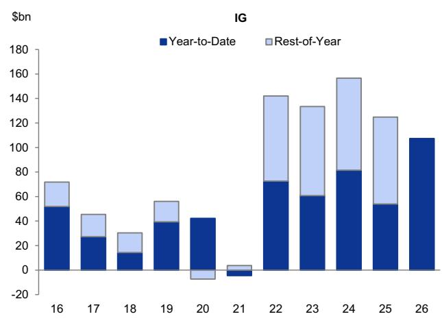
资料来源：TRACE，Haver Analytics，GS全球投资研究

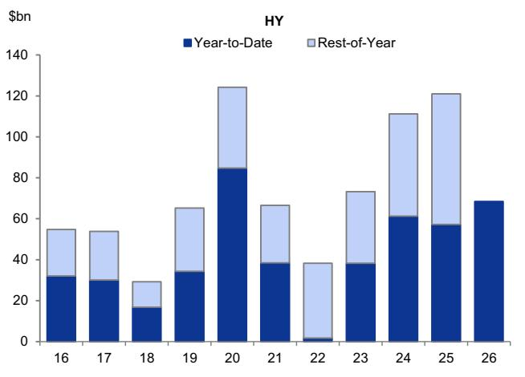

## 其他需求指标同样指向稳健的基本面

为完成对企业信用债需求的梳理，我们再看三项额外指标：外国读者对美国债券的净购买、新发行让利幅度，以及票息再投资带来的被动需求。这三项指标均指向有利的需求环境。

下图展示了基于美国财政部TIC数据的美国企业债净购买量三个月均值。（注：该数据参考的是发行人的注册地，而非债券的计价货币。）关键信息在于，外国需求（需注意该数据滞后约六周）目前已达到金融危机后的新高。事实上，自金融危机结束以来，外国净需求最高的五个单月数据均出现在过去18个月内。截至2026年5月，外国读者的长期净购买总额在过去12个月中达到4390亿美元，推动外国持有总额达到创纪录的5.3万亿美元。从结构上看，今年迄今约有一半的外国需求来自欧洲，其余分布在其他地区。

## 图表6：TIC数据显示外国对美国信用债的需求接近历史高位

外国对美国国内企业债净购买的三个月移动均值

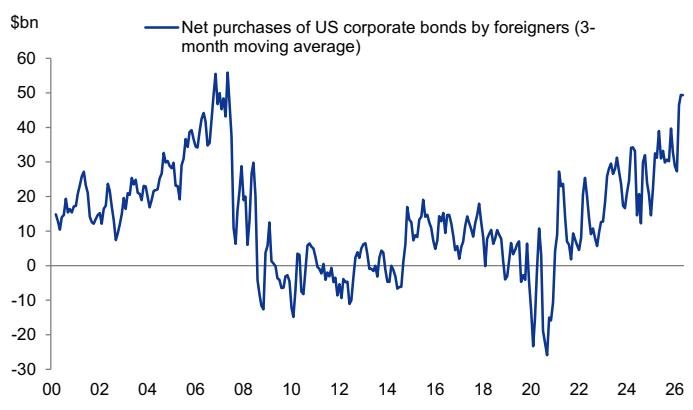
资料来源：美国财政部，Haver Analytics，GS全球投资研究

其次，我们通过监测新发行让利幅度来评估市场对增量供给的消化能力。尽管近期有少数与人工智能相关的大型交易以高于通常水平的让利定价，但总体数据描绘的画面更为温和——至少目前如此。下图追踪了美元和欧元IG市场新发行让利幅度估算值的四周移动均值。虽然两个市场在地区冲突初期均经历了上行压力，但此后已重新稳定在个位数低至中位区间——这与过去十年的水平一致。鉴于我们对人工智能相关生态系统进一步发债的预期，我们将密切关注这一指标。

图表7：尽管供给加速，新发行让利总体保持稳健
美元（左图）和欧元（右图）IG市场估算新发行让利幅度的四周移动均值
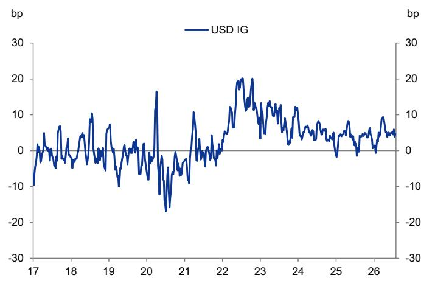
资料来源：iBoxx，Dealogic，GS全球投资研究

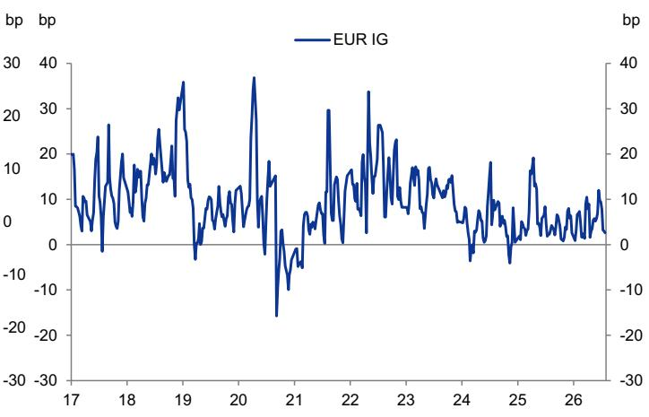

最后，我们将票息支付视为一股重要的被动需求来源，其前提假设是这些支付的大部分会重新回流到企业信用债市场。下两图展示了我们对年度票息支付与美元和欧元IG及HY市场净供给的估算。尽管今年净供给有所加速，但受2022-2023年加息周期推动的整体回报表现水平上升，票息支付总额也有所增长。我们估算，仅票息支付一项就将吸收美元IG和HY市场净供给的50%以上（图表8），以及欧元IG和HY市场净供给的约40%（图表9）。虽然这一比例低于过去几年的水平，但与过去十年相比仍处于非常健康的区间。

## 图表8：票息支付应仍足以吸收今年美元企业债市场一半以上的净供给

美元IG（左图）和HY（右图）市场的年度净供给与估算票息支付总额对比

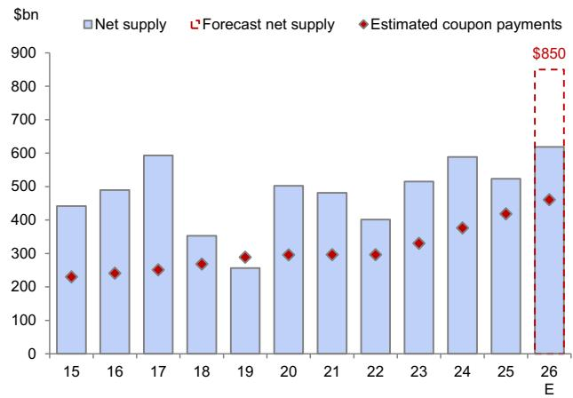
资料来源：Bloomberg，GS全球投资研究

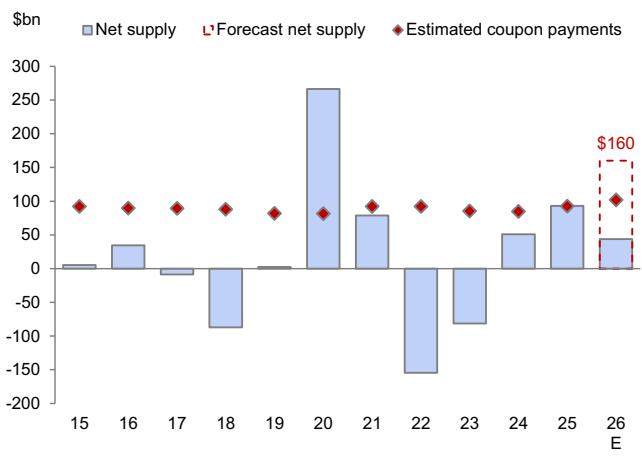

图表9：票息支付应能吸收2026年欧元企业债市场约40%的净供给
欧元IG（左图）和HY（右图）市场的年度净供给与估算票息支付总额对比
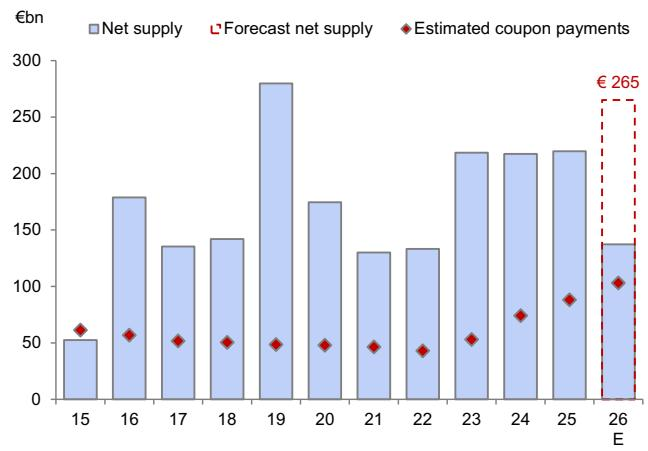

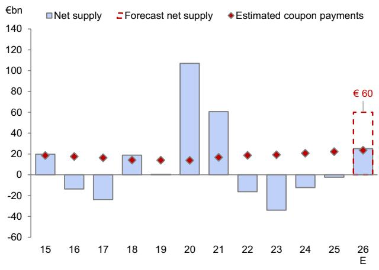
资料来源：Bloomberg，GS全球投资研究

上述每一项需求指标单独来看都不够全面——各有其局限性和潜在盲区。但综合来看，这一系列指标指向总需求因素较为有利。我们预计这将是对我们预期中密集供给节奏的重要缓解因素。

不过，与人工智能相关的生态系统内发债较为集中，这一结构性特征可能会推动利差出现温和走阔，与我们此前的预测一致，且风险更倾向于更大幅度的走阔。

作者感谢Patricia Pacheco对本报告的贡献。

## 预测概览：利差、回报、发行、违约与评级迁移

图表10：美元和欧元利差预测

| 市场 | 当前 | 2026Q3 | 2026Q4 | 2027Q1 | 2027Q2 |
|---|---|---|---|---|---|
| 美元利差（基点） | | | | | |
| 美元IG | 80 | 85 | 82 | 80 | 78 |
| 美元HY | 289 | 305 | 295 | 290 | 280 |
| 欧元利差（基点） | | | | | |
| 欧元IG | 79 | 91 | 88 | 86 | 84 |
| 欧元HY | 291 | 320 | 315 | 310 | 305 |

资料来源：Bloomberg，ICE-BAML，iBoxx，GS全球投资研究

图表11：美元和欧元超额回报预测

| 市场 | 当前久期 | 2026年初至今（%） | 2026全年预测（%） |
|---|---|---|---|
| 美元超额回报 | | | |
| 美元IG | 6.7 | 0.2% | 0.4% |
| 美元HY | 3.3 | 1.1% | 1.6% |
| 欧元超额回报 | | | |
| 欧元IG | 4.6 | 0.6% | 0.5% |
| 欧元HY | 3.1 | 1.2% | 1.4% |

资料来源：Bloomberg，ICE-BAML，iBoxx，GS全球投资研究

图表12：发行预测

| 市场 | 2026年初至今（十亿） | 2026全年预测（十亿） |
|---|---|---|
| 美元市场 | | |
| 总发行量 | | |
| IG | $1,460 | $2,100 |
| HY | $195 | $400 |
| 杠杆贷款 | $253 | -- |
| 净发行量 | | |
| IG | $617 | $850 |
| HY | $37 | $160 |
| 欧元市场 | | |
| 总发行量 | | |
| IG | € 535 | € 850 |
| HY | € 70 | € 125 |
| 杠杆贷款 | € 56 | -- |
| 净发行量 | | |
| IG | € 136 | € 265 |
| HY | € 24 | € 60 |

资料来源：Dealogic，Bloomberg，GS全球投资研究

图表13：评级迁移与违约预测
违约率为发行人加权，12个月滚动

| 市场 | 2026年初至今 | 2026全年预测 |
|---|---|---|
| 美元市场 | | |
| 升级至投资级（十亿） | $62 | $75 |
| 降级至高收益（十亿） | $34 | $60 |
| HY违约率（12个月滚动） | 4.0% | 4.0% |
| 杠杆贷款违约率（12个月滚动） | 5.0% | 4.75% |
| 欧元市场 | | |
| 升级至投资级（十亿） | € 10 | € 20 |
| 降级至高收益（十亿） | € 4 | € 30 |
| HY违约率（12个月滚动） | 4.6% | 5.0% |
| 杠杆贷款违约率（12个月滚动） | 3.6% | 4.0% |

资料来源：Bloomberg，Moody's，GS全球投资研究

## 预测概览：相对价值观点

| 区域 | 观点 | 说明 |
|---|---|---|
| 跨区域 | 超配美元 vs. 欧元 | 美国在增长、通胀和货币政策组合方面相对欧洲略占优势。因此，相对于美元市场，我们预测欧元信用利差的峰值更高（且2026年下半年的恢复更慢）。 |
| | 超配欧元IG CLO层级 vs. 美元IG CLO层级 | 欧元IG层级相对于美元IG CLO层级提供一定的票息增厚。尽管欧洲的政策和宏观环境支持力度较弱，但次级保护应能在持续的主体特定违约背景下保护资本结构中较高层级的证券。 |
| 美元市场 | 超配IG vs. HY | 鉴于估值因素以及我们经济学家对低于潜在增长率的预测，我们在美元市场中略微偏好IG而非HY。我们认为BB/BBB利差比率在当前增长和通胀组合略显挑战的背景下定价合理，对这两个评级类别持中性观点。 |
| | 超配BBB vs. 更高评级类别 | 我们倾向于持有BBB而非美元IG中评级更高的部分（A和AA），以获取额外的利差。我们也看到IG中最高评级端资产负债表质量可能发生变化的空间。 |
| | 超配BB，中性CCC，低配B | 当前利差水平表明，在所有HY评级类别中，单B相对于预期损失提供的信用风险溢价最低。 |
| | 超配HY债券 vs. 贷款 | HY债券在票息与久期之间的权衡仍优于杠杆贷款。此外，贷款对软件行业的大量敞口可能在短期内构成情绪上的压制。 |
| | 超配CLO夹层 vs. 杠杆贷款；中性CLO vs. 美元IG；中性CLO vs. CMO | 对于浮动利率读者，我们偏好CLO夹层而非杠杆贷款。历史数据显示BB和BBB CLO层级的减值率较低，当前估值提供了有吸引力的票息以及对中度至偏高违约情景的缓冲。在其他方面，我们对优先CLO层级和美元IG持中性态度；我们会利用利差走阔来增加CLO敞口。我们同样对CLO AAA和CMO浮动利率持中性态度。 |
| | 偏好机构MBS vs. IG | 机构MBS相对于IG企业债组合提供了有吸引力的分散化收益。 |
| | 超配混合资本工具 vs. BBB | 在利差偏紧的环境下，我们认为混合资本工具相对于BBB的额外利差补偿具有中等吸引力。我们也预计随着混合资本工具市场的进一步增长，其相对于BBB的利差溢价将有所压缩。 |
| 欧元市场 | 超配IG vs. HY | 鉴于欧元区增长、通胀和货币政策组合面临更多挑战，我们偏好IG而非HY。 |
| | 超配A vs. BBB | 在欧元市场，我们偏好A而非BBB，因为增长环境相对偏弱，宜采取适度提升质量的立场。但我们不会过度上移质量曲线，因为我们预计供给因素将对欧元AA市场构成一定影响。 |
| | 超配HY债券 vs. 贷款 | 与美国类似，鉴于贷款市场对软件行业的权重（以及潜在的负面情绪压制），我们偏好HY债券。央行的反应函数也可能因对通胀压力的关注而增加浮动利率发行人的融资成本。 |
| | 超配BB，中性B，低配CCC | 在当前估值水平以及我们对分化加剧的预期下，我们倾向于在欧元HY内部适度提升质量。 |

资料来源：GS全球投资研究

## 业绩日历

## 图表15：美元IG业绩报告日期

彭博美元IG指数（LUACTRUU）即将发布的业绩报告日期；最低名义价值10亿美元，包括当日该指数中报告业绩的前20大资本结构

| 代码 | 名称 | 名义（十亿美元） | 代码 | 名称 | 名义（十亿美元） | 代码 | 名称 | 名义（十亿美元） | 代码 | 名称 | 名义（十亿美元） |
|---|---|---|---|---|---|---|---|---|---|---|---|
| 2026/7/31 | | | 2026/8/3 | | | 2026/8/4 | | | 2026/8/5 | | |
| ABBV | AbbVie Inc | 57.4 | MUFG | Mitsubishi UFJ Financial Group | 41.8 | HSBC | HSBC Holdings PLC | 89.1 | LLY | Eli Lilly & Co | 39.8 |
| SUMIBK | Sumitomo Mitsui Financial Grou | 41.8 | OKE | ONEOK Inc | 29.3 | DUK | Duke Energy Corp | 68.2 | DIS | Walt Disney Co/The | 31.1 |
| ENBCN | Enbridge Inc | 22.9 | WMB | Williams Cos Inc/The | 26.5 | PFE | Pfizer Inc | 53.4 | HNDA | Honda Motor Co Ltd | 22.7 |
| XOM | ExxonMobil Holdings Corp | 18.5 | MAR | Marriott International Inc/MD | 15.0 | ET | Energy Transfer LP | 40.5 | MET | MetLife Inc | 15.6 |
| NWG | NatWest Group PLC | 15.9 | ARE | Alexandria Real Estate Equitie | 10.5 | TOYOTA | Toyota Motor Corp | 31.6 | HONA | Honeywell Aerospace Inc | 15.5 |
| ETN | Eaton Corp PLC | 14.2 | FANG | Diamondback Energy Inc | 9.4 | BPLN | BP PLC | 30.6 | PSX | Phillips 66 | 15.4 |
| LYB | LyondellBasell Industries NV | 10.8 | TSN | Tyson Foods Inc | 6.2 | SPCX | Space Exploration Technologie: | 25.0 | NI | NiSource Inc | 15.1 |
| ARESSI | Ares Management Corp | 6.1 | CNHI | CNH Industrial NV | 4.3 | MPLX | Marathon Petroleum Corp | 24.7 | O | Realty Income Corp | 14.3 |
| AN | AutoNation Inc | 3.5 | CLX | Clorox Co/The | 4.0 | GILD | Gilead Sciences Inc | 23.0 | GPN | Global Payments Inc | 13.9 |
| FTSCN | Fortis Inc/Canada | 2.7 | BWP | Loews Corp | 3.2 | CAT | Caterpillar Inc | 22.9 | KHC | Kraft Heinz Co/The | 11.8 |
| FRT | Federal Realty Investment Trus | 2.2 | CNA | Loews Corp | 3.0 | PEG | Public Service Enterprise Grou | 20.1 | OXY | Occidental Petroleum Corp | 11.2 |
| PXD | ExxonMobil Holdings Corp | 2.1 | JXN | Jackson Financial Inc | 2.1 | PRU | Prudential Financial Inc | 16.6 | ATO | Atmos Energy Corp | 9.4 |
| LIN | Linde PLC | 1.7 | GBDC | Golub Capital BDC Inc | 2.0 | SYY | Sysco Corp | 10.9 | RPRX | Royalty Pharma PLC | 8.8 |
| NVT | nVent Electric PLC | 1.3 | L | Loews Corp | 1.8 | FIS | Fidelity National Information | 10.2 | COR | Cencora Inc | 8.6 |
| ARES | Ares Management Corp | 1.3 | VNOM | Diamondback Energy Inc | 1.6 | DVN | Devon Energy Corp | 9.6 | MSI | Motorola Solutions Inc | 7.6 |
| BEN | Franklin Resources Inc | 1.2 | SBAC | SBA Communications Corp | 1.5 | RABOBK | Cooperatieve Rabobank UA | 9.4 | EXPE | Expedia Group Inc | 5.5 |
| SNE | Sony Group Corp | 1.0 | SBRA | Sabra Health Care REIT Inc | 1.2 | PNW | Pinnacle West Capital Corp | 8.8 | SOLV | Solventum Corp | 4.6 |
| | | | | | | CRBG | Corebridge Financial Inc | 7.2 | NNN | NNN REIT Inc | 4.2 |
| | | | | | | KMB | Kimberly-Clark Corp | 6.0 | HST | Host Hotels & Resorts Inc | 4.1 |
| | | | | | | MPC | Marathon Petroleum Corp | 5.4 | OC | Owens Corning | 4.0 |
| 2026/8/6 | | | 2026/8/7 | | | 2026/8/10 | | | 2026/8/11 | | |
| TMUS | Deutsche Telekom AG | 61.3 | PPL | PPL Corp | 11.2 | JBS | JBS NV | 16.1 | CAH | Cardinal Health Inc | 6.3 |
| SRE | Sempra | 25.7 | PAA | Plains All American Pipeline L | 8.2 | SPG | Simon Property Group Inc | 15.4 | HRB | H&R Block Inc | 1.5 |
| ED | Consolidated Edison Inc | 24.1 | VST | Vistra Corp | 4.0 | ABXCN | Barrick Mining Corp | 3.2 | | | |
| COP | ConocoPhillips | 18.0 | TE | Emera Inc | 3.8 | PPC | JBS NV | 3.1 | | | |
| TRGP | Targa Resources Corp | 17.9 | EMACN | Emera Inc | 2.5 | EMBRBZ | Embraer SA | 1.7 | | | |
| ONCRTX | Sempra | 15.8 | MBGL | Mobility Global Inc | 2.0 | FERG | Ferguson Enterprises Inc | 1.5 | | | |
| FISV | Fiserv Inc | 15.0 | TTWO | Take-Two Interactive Software | 1.9 | | | | | | |
| KDP | Keurig Dr Pepper Inc | 13.9 | | | | | | | | | |
| RSG | Republic Services Inc | 10.8 | | | | | | | | | |
| CQP | Cheniere Energy Inc | 9.5 | | | | | | | | | |
| DGELN | Diageo PLC | 9.2 | | | | | | | | | |
| EVRG | Evergy Inc | 8.5 | | | | | | | | | |
| KVUE | Kenvue Inc | 7.0 | | | | | | | | | |
| FOXA | Fox Corp | 6.6 | | | | | | | | | |
| AIG | American International Group I | 6.2 | | | | | | | | | |
| PH | Parker-Hannifin Corp | 5.9 | | | | | | | | | |
| CNQCN | Canadian Natural Resources Lt | 5.8 | | | | | | | | | |
| LNG | Cheniere Energy Inc | 4.7 | | | | | | | | | |
| S | Deutsche Telekom AG | 4.5 | | | | | | | | | |
| TAP | Molson Coors Beverage Co | 4.4 | | | | | | | | | |

资料来源：Bloomberg，GS全球投资研究

彭博美元HY指数（LF98TRUU）即将发布的业绩报告日期；最低名义价值5亿美元，包括当日该指数中报告业绩的前20大资本结构

## 图表16：美元HY业绩报告日期

| 代码 | 名称 | 名义（十亿美元） | 代码 | 名称 | 名义（十亿美元） | 代码 | 名称 | 名义（十亿美元） | 代码 | 名称 | 名义（十亿美元） |
|---|---|---|---|---|---|---|---|---|---|---|---|
| 2026/7/31 | | | 2026/8/3 | | | 2026/8/4 | | | 2026/8/5 | | |
| NWL | Newell Brands Inc | 4.6 | NSANY | Nissan Motor Co Ltd | 12.4 | TDG | TransDigm Group Inc | 19.8 | IRM | Iron Mountain Inc | 10.8 |
| ABR | Arbor Realty Trust Inc | 1.2 | ECHO | EchoStar Corp | 7.7 | PARA | Paramount Skydance Corp | 12.1 | SM | SM Energy Co | 6.5 |
| PRM | Perimeter Solutions Inc | 1.2 | WHR | Whirlpool Corp | 6.4 | NRG | NRG Energy Inc | 12.0 | XYZ | Block Inc | 5.2 |
| EOFP | Forvia SE | 1.0 | DISH | EchoStar Corp | 5.0 | SUN | Sunoco LP | 10.7 | RIG | Transocean Ltd | 4.3 |
| TACN | TransAlta Corp | 0.7 | CRGYFN | Crescent Energy Co | 4.2 | CE | Celanese Corp | 8.2 | GT | Goodyear Tire & Rubber Co/Th | 4.1 |
| CRI | Carter's Inc | 0.6 | ALSN | Allison Transmission Holdings | 2.4 | LVLT | Lumen Technologies Inc | 7.3 | HNDLIN | Hindalco Industries Ltd | 3.9 |
| MOGA | Moog Inc | 0.5 | SNAP | Snap Inc | 2.1 | DVA | DaVita Inc | 6.3 | WULF | Terawulf Inc | 3.2 |
| | | | JAZZ | Jazz Pharmaceuticals PLC | 1.5 | WYNMAC | Wynn Resorts Ltd | 4.1 | TLN | Talen Energy Corp | 2.7 |
| | | | DHC | Diversified Healthcare Trust | 1.4 | BALL | Ball Corp | 3.9 | SBGI | Sinclair Inc | 2.6 |
| | | | NSCO | Custom Truck One Source Inc | 0.9 | ET | Energy Transfer LP | 3.2 | MEDIND | Medline Inc | 2.5 |
| | | | VNO | Vornado Realty Trust | 0.9 | MTCHII | Match Group Inc | 3.0 | MTDR | Matador Resources Co | 2.4 |
| | | | BWXT | BWX Technologies Inc | 0.8 | W | Wayfair Inc | 2.6 | DKL | Delek US Holdings Inc | 2.2 |
| | | | JELD | JELD-WEN Holding Inc | 0.8 | WYNFIN | Wynn Resorts Ltd | 2.6 | EHC | Encompass Health Corp | 2.1 |
| | | | ON | ON Semiconductor Corp | 0.7 | CC | Chemours Co/The | 2.5 | KNTK | Kinetik Holdings Inc | 2.1 |
| | | | LIND | Lindblad Expeditions Holdings | 0.7 | NGL | NGL Energy Partners LP | 2.2 | LILAPR | Liberty Latin America Ltd | 2.0 |
| | | | GPOR | Gulfport Energy Corp | 0.7 | HOUS | Compass Inc | 2.1 | OUT | Outfront Media Inc | 2.0 |
| | | | TDW | Tidewater Inc | 0.7 | LNW | Light & Wonder Inc | 2.1 | ADNT | Adient PLC | 1.8 |
| | | | SBH | Sally Beauty Holdings Inc | 0.6 | BLKPRL | Cipher Digital Inc | 2.0 | PRGO | Perrigo Co PLC | 1.8 |
| | | | DAC | Danaos Corp | 0.5 | GPK | Graphic Packaging Holding Co | 2.0 | AXON | Axon Enterprise Inc | 1.8 |
| | | | | | | ENR | Energizer Holdings Inc | 1.8 | ECPG | Encore Capital Group Inc | 1.8 |
| 2026/8/6 | | | 2026/8/7 | | | 2026/8/10 | | | 2026/8/11 | | |
| CSCHLD | Optimum Communications Inc | 15.5 | GTN | Gray Media Inc | 5.0 | MPW | Medical Properties Trust Inc | 5.1 | VENLNG | Venture Global Inc | 11.0 |
| WBD | Warner Bros Discovery Inc | 13.7 | AXL | Dauch Corp | 2.7 | RAKUTN | Rakuten Group Inc | 3.6 | VEGLPL | Venture Global Inc | 9.5 |
| RKT | Rocket Cos Inc | 10.0 | MLTPLN | Claritev Corp | 2.2 | IHRT | iHeartMedia Inc | 2.5 | VENTGL | Venture Global Inc | 5.5 |
| POST | Post Holdings Inc | 7.1 | EMACN | Emera Inc | 2.0 | CODI | Compass Diversified Holdings | 1.3 | BGS | B&G Foods Inc | 1.3 |
| NXST | Nexstar Media Group Inc | 6.1 | GLP | Global Partners LP/MA | 1.3 | CRC | California Resources Corp | 1.3 | ARMK | Aramark | 1.2 |
| FSK | FS KKR Capital Corp | 4.3 | CTEV | Claritev Corp | 1.0 | ACH | Accendra Health Inc | 1.2 | | | |
| STWD | Starwood Property Trust Inc | 4.2 | FLR | Fluor Corp | 0.5 | SURCEN | Surgery Partners Inc | 1.2 | | | |
| NAVI | Navient Corp | 3.8 | HE | Hawaiian Electric Industries I | 0.5 | ACM | AECOM | 1.2 | | | |
| BCULC | Restaurant Brands Internationa | 3.7 | | | | BZH | Beazer Homes USA Inc | 1.0 | | | |
| FUN | Six Flags Entertainment Corp | 3.4 | | | | SDRLNO | Seadrill Ltd | 0.7 | | | |
| RHP | Ryman Hospitality Properties I | 3.3 | | | | INFNAR | Infinity Natural Resources Inc | 0.6 | | | |
| OTEXCN | Open Text Corp | 3.3 | | | | CNDT | Conduent Inc | 0.5 | | | |
| GEL | Genesis Energy LP | 3.2 | | | | | | | | | |
| GMABDC | Genmab A/S | 2.5 | | | | | | | | | |
| LAMR | Lamar Advertising Co | 2.5 | | | | | | | | | |
| GEN | Gen Digital Inc | 2.5 | | | | | | | | | |
| BURLN | Burford Capital Ltd | 2.4 | | | | | | | | | |
| GSYCN | goeasy Ltd | 2.4 | | | | | | | | | |
| KGS | Kodiak Gas Services Inc | 2.4 | | | | | | | | | |
| HTZ | Hertz Global Holdings Inc | 2.3 | | | | | | | | | |

资料来源：Bloomberg，GS全球投资研究

## 图表17：欧元IG业绩报告日期

彭博欧元IG指数（LECPTREU）即将发布的业绩报告日期；最低名义价值10亿欧元，包括当日该指数中报告业绩的前20大资本结构

| 代码 | 名称 | 名义（十亿欧元） | 代码 | 名称 | 名义（十亿欧元） | 代码 | 名称 | 名义（十亿欧元） | 代码 | 名称 | 名义（十亿欧元） |
|---|---|---|---|---|---|---|---|---|---|---|---|
| 2026/7/31 | | | 2026/8/3 | | | 2026/8/4 | | | 2026/8/5 | | |
| ENGIFP | Engie SA | 28.3 | MUFG | Mitsubishi UFJ Financial Group | 4.9 | HSBC | HSBC Holdings PLC | 22.5 | ANNGR | Vonovia SE | 15.5 |
| NWG | NatWest Group PLC | 19.7 | CNH | CNH Industrial NV | 1.8 | BKNG | Booking Holdings Inc | 15.0 | NOVOB | Novo Nordisk A/S | 13.0 |
| LIN | Linde PLC | 14.5 | MITCO | Mitsubishi Corp | 1.0 | BPLN | BP PLC | 12.7 | HEIANA | Heineken Holding NV | 11.6 |
| AXASA | AXA SA | 13.4 | | | | TOYOTA | Toyota Motor Corp | 12.0 | DHLGR | Deutsche Post AG | 10.0 |
| OMVAV | OMV AG | 7.8 | | | | BAYNGR | Bayer AG | 9.6 | FREGR | Fresenius SE & Co KGaA | 6.6 |
| RBIAV | Raiffeisen Bank International | 6.5 | | | | CCEP | Coca-Cola Europacific Partners | 8.9 | HNDA | Honda Motor Co Ltd | 5.4 |
| SUMIBK | Sumitomo Mitsui Financial Grou | 6.5 | | | | RABOBK | Cooperatieve Rabobank UA | 7.9 | IFXGR | Infineon Technologies AG | 4.8 |
| BKIR | Bank of Ireland Group PLC | 6.0 | | | | LEGGR | LEG Immobilien SE | 4.4 | MET | MetLife Inc | 4.7 |
| EJRAIL | East Japan Railway
