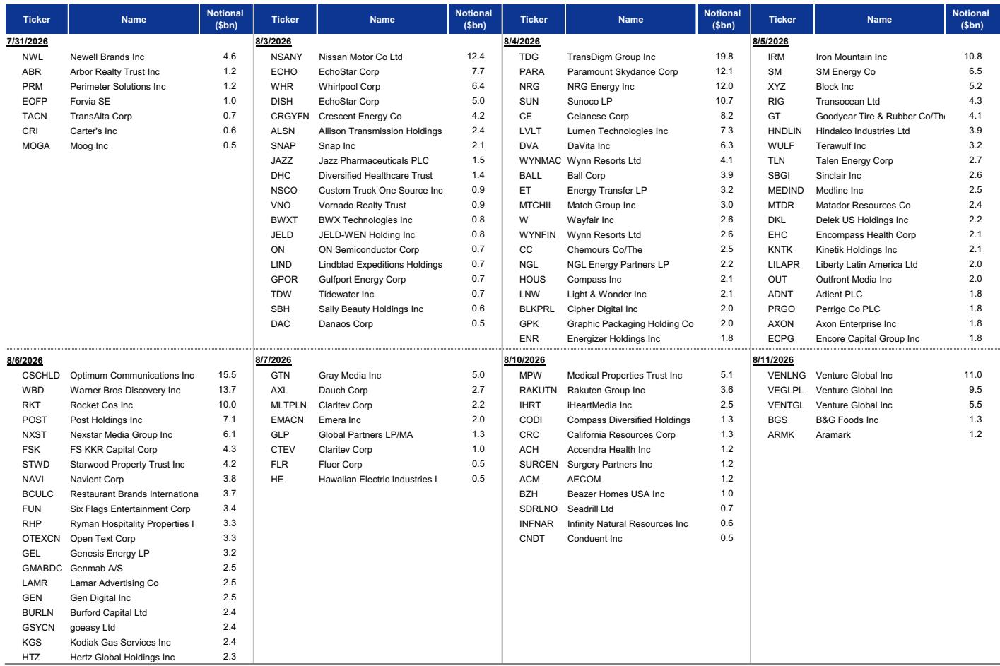
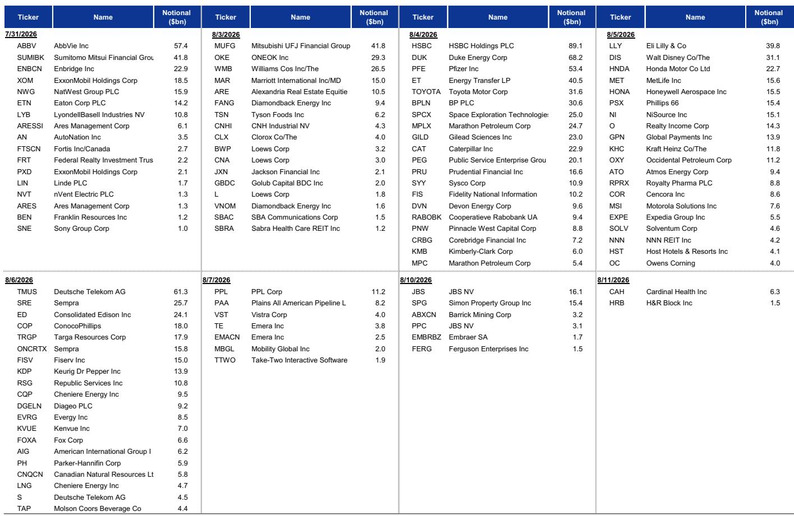
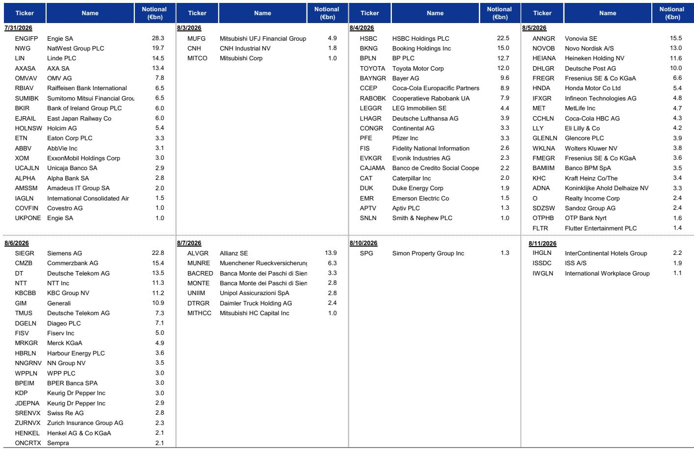

# 创纪录供给遇上创纪录需求，但真正的信用风险在于集中度，而非总量

美元投资级一级市场今年的总发行量有望达到约1.5万亿美元，同比增长31%，欧元投资级市场则已达到5350亿欧元。尽管供给汹涌，利差仍维持在金融危机后区间的紧俏一端。这种组合——创纪录的供给与紧俏的估值——构成了当前信用市场的核心张力：需求背景所起的作用远超多数读者所认知，而这一需求的持续性将决定当前利差水平是维持还是突破。

某全球投资银行的最新信用策略研究汇总了五项独立的需求衡量指标——资金流向、交易级数据、外资购买、新发债让利幅度以及票息再投资——每项指标都指向同一结论：总需求依然强劲，足以吸收供给浪潮。但该研究更具分量的发现并不在于总量层面。发行集中于AI相关生态体系，加之需求明显向短中期期限分化，表明利差风险并非均匀分布。它是具体的、结构性的，且正在累积。

这一判断之所以重要，是因为市场正处于一个决策节点。需求面技术因素一直是2026年一条安静的主线，对冲了本应导致利差走阔的供给冲击。如果需求转弱，或者AI相关债务的集中风险加速显现，当前紧俏的估值将变得脆弱。证据表明前者短期内不太可能发生；而后者已经在进行中。

## 总需求图景确实强劲，且其广度超越单一资金流向

资金流向数据提供了对读者偏好的最直接观察，几乎所有主要信用市场都呈现稳健态势。美元投资级基金今年通过净流入增加了约8%的管理资产，美元银行贷款基金（含CLO相关产品）增加了逾6%。即便是相对落后的美元高收益板块，年初至今也录得0.6%的正流入。欧洲方面，资金流入较为温和但仍为正值：纯欧元投资级企业基金净流入0.4%，欧元高收益基金为1.2%。尽管估值紧俏且地缘因素对大宗商品市场造成扰动，今年每个主要信用市场都吸引了净流入。

这些资金流入的持续性值得关注，因为它们并非来自单一读者群体。TRACE交易级数据在交易层面印证了资金流向的叙事。美元投资级市场有望创下客户净买入的纪录（以交易商对客户交易中买入减去卖出计算），美元高收益市场则有望录得2020年以来的第二高年度水平。这不是散户追逐ETF的故事，而是机构级别的大规模需求。

外资需求增添了另一层支撑。美国财政部TIC数据追踪外国读者对美国国内公司债的净购买情况，显示金融危机以来单月最高的五个数值全部出现在过去18个月中。截至2026年5月，外国读者过去12个月的长期净购买总额达4390亿美元，推动外资持有总量达到创纪录的5.3万亿美元。今年外资需求中约一半来自欧洲，其余分布在其他地区。该数据有六周滞后，因此当前实际情况可能比最新公布的数字更为强劲。

总量层面的图景是清晰的：需求不仅在吸收供给，而且在主动竞争供给。该研究预计，仅票息支付一项——在2022-2023年加息周期后回流至公司债市场——就将吸收美元投资级和高收益市场净供给的50%以上，以及欧元市场约40%。随着整体回报表现上升，这一被动需求顺风愈发显著，形成了更高票息产生更多再投资需求的自我强化循环。

## 期限维度上的需求分化是投资级信用中最被低估的风险

在健康的总量资金流之下，存在一种正在重塑信用曲线的结构性偏好。自5月以来，长久期投资级基金的资金流入相对滞后，而短中期基金吸纳了新增资金的大部分。这不是边际变化。长久期基金占美元投资级企业基金管理资产的15%，但其近期资金表现明显弱于其权重所对应的水平。该研究显示，期限超过15年的债券占美元投资级总发行量的27.6%，为五年来最高比例，而市场的反应颇具说明性：美元投资级前端利差年初至今收窄5个基点，而25年以上期限指数利差则走阔了15个基点。

交易级数据以更高的精度印证了这一模式。期限超过12年的债券占年初至今交易量的26%，但仅占客户净需求的22%。相反，期限在3至7年之间的投资级债券占总交易量的27%，却吸纳了49%的客户净需求。市场正在用资金投票选择曲线腹部，而长端正在被冷落。

这种分化不仅是技术层面的现象，它有基本面驱动因素。该研究将长端需求疲软归因于两个因素：曲线长端的供给压力，以及对长端利率路径的剩余不确定性。美联储领导层过渡引发了关于央行反应函数的不确定性，尤其是在资产负债表和货币政策路径方面。对信用读者而言，这意味着在期限溢价不确定且供给集中的时点，不愿拉长久期。

其影响是显著的。如果长端继续承压，将对选择以更长期限融资的发行人构成压力。这在今天还不是系统性风险，但它是投资级市场内部日益增长的分化来源。那些布局全面利差收窄的读者可能会失望；收窄确实在发生，但集中在已接近历史紧俏水平的期限段。

## AI发行集群是可能压倒总需求面技术因素的集中度风险

该研究的预测显示，利差将从当前水平温和走阔，风险偏向于更大幅度的走阔。其机制并非总需求崩溃，而是AI相关生态体系内债务发行的集中性。这是该研究的分析核心：需求面技术因素足以在总量层面消化创纪录的供给，但可能不足以消化来自AI相关发行人的特定集中供给。

证据已在新发债让利幅度中显现。虽然美元和欧元投资级市场的总体让利幅度已重新稳定在低至中个位数区间——与过去十年一致——但近期AI相关融资中出现了较大幅度的让利案例。这是供给正在考验市场吸收能力的典型特征：总量看起来健康，因为大多数发行人支付的让利幅度温和，但异常值集中在特定板块。

该研究的预测面板量化了预期影响。美元投资级利差预计将从当前的80个基点走阔至2026年第三季度的85个基点，随后在2027年第二季度恢复至78个基点。欧元投资级利差预计走阔幅度更大，从79个基点升至第三季度的91个基点，且恢复速度更慢。这种不对称性具有启示意义：欧元利差预计峰值更高、恢复更慢，反映出欧洲相对于美国的增长、通胀和货币政策组合较为不利。

集中度风险还有一个超越利差的二阶影响。如果AI相关发行人继续大规模进入市场，他们将挤出其他借款人，尤其是信用质量较低或增长叙事不那么突出的借款人。这可能加速AI相关发行人与市场其他部分之间的分化，为选择性读者创造机会，但如果AI投资周期显现疲态，也可能加大急剧重定价的风险。

## 被动需求引擎正在以放大支撑与风险的方式改变市场结构

资金流数据揭示了一个对信用市场运作方式具有深远影响的结构性转变。被动ETF在大多数资产类别中主导了年初至今的资金流，而主动共同基金大多遭遇净流出。一个显著的例外是杠杆贷款市场，主动管理的CLO ETF在该市场中主导了贷款相关资金流。

从主动共同基金向被动ETF的迁移不仅是产品偏好的变化；它改变了信用市场的价格发现机制。被动ETF是价格接受者，而非价格制定者。当资金流入时必须买入，当资金流出时必须卖出，无论基本面价值如何。这创造了一个资金流可能比基本面更能驱动价格的市场，同时放大上涨和抛售。

该研究提供了一个更为细致的解读：鉴于信用市场分化加剧，尤其是围绕AI主题的分化，读者已转向利用ETF载体来实现主动管理人的选择。这有助于解释规模较小的主动型ETF基金对共同基金的替代。ETF载体提供了共同基金无法匹敌的流动性和透明度优势，即使底层策略是主动管理的。

这一结构性转变对需求面技术因素有一个关键含义。被动资金流比主动资金流更具机械性、更少自由裁量。它们由配置决策驱动，而非证券选择。这意味着需求背景在短期内更具可预测性——只要资金流入持续，ETF将继续买入——但如果情绪转变，则可能更加脆弱。该研究指出，自5月以来长久期基金表现滞后，这可能反映了在ETF载体和主动策略中都存在对较短久期敞口的偏好。

票息支付作为被动需求来源的增长增添了另一层结构性支撑。2022-2023年加息周期带来的更高整体回报表现产生了更大规模的票息收入流，这些收入被再投资于公司债市场。这不是自由裁量的需求；这是无论市场条件如何都会发生的机械性再投资。该研究估计，仅此一项就吸收了美元市场净供给的一半以上，为市场提供了此前周期中不存在的底部支撑。

## 应对供需平衡的决策框架

对读者而言，该研究的分析可转化为一个实用的布局框架。第一个问题不是总需求是否会持续——证据表明会——而是需求在哪些领域较强、哪些领域最弱。数据指向对短中期期限的明确偏好，这一偏好在资金流和交易级数据中均可见。这表明读者在投资级组合中应谨慎拉长久期，尤其是在供给集中、需求最弱的长端。

第二个问题是AI发行集群的敞口。该研究明确指出：AI相关生态体系内债务发行的集中性可能推动利差温和走阔，风险偏向于更大幅度的走阔。这不是呼吁完全回避该板块——基本面故事仍然有吸引力——而是对以下假设的警示：AI相关发行人将继续在其历史区间紧俏端定价。近期AI相关融资中出现的较大让利幅度是一个早期信号，表明市场的吸收能力正在受到考验。

第三个问题是区域配置。该研究的预测面板显示对美元信用优于欧元信用的明确偏好，这得益于美国更为有利的增长、通胀和货币政策组合。欧元利差预计峰值更高、恢复更慢，这表明相对价值机会在美元市场，尤其是在需求较强的曲线腹部。

该框架可概括如下：维持信用敞口，但偏好前端和曲线腹部而非长端；在AI相关发行中保持选择性，认识到让利幅度可能维持在高位；基于相对基本面和市场面背景，偏好美元而非欧元信用。总需求面技术因素是支撑性的，但市场内部的分化才是风险与机会所在。

该研究对2026年全年美元投资级超额回报0.4%和美元高收益超额回报1.6%的预测，反映了这一细致观点：回报为正但温和，大部分收益来自票息而非利差压缩。市场已消化了大部分利好；剩余机会在于选择性和布局，而非广泛的贝塔敞口。

*仅供参考。部分内容可能基于原始材料由AI辅助生成、翻译、摘要或编辑，可能包含遗漏或错误。请独立核实。本文不构成投资、法律、税务、会计或其他专业建议。*

仅供参考。部分内容可能基于原始材料由AI辅助生成、翻译、摘要或编辑，可能包含遗漏或错误。请独立核实。本文不构成投资、法律、税务、会计或其他专业建议。

