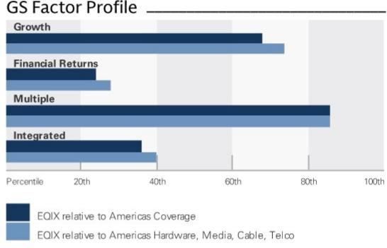
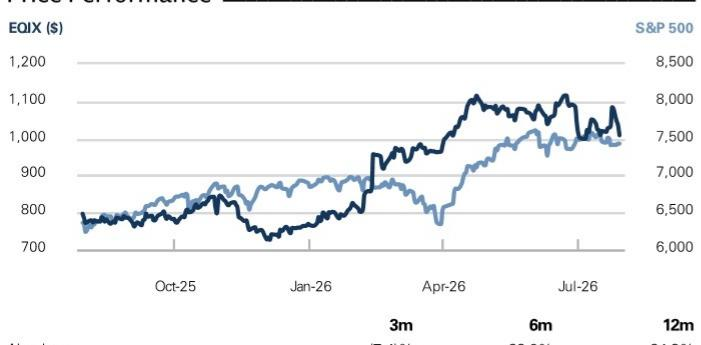
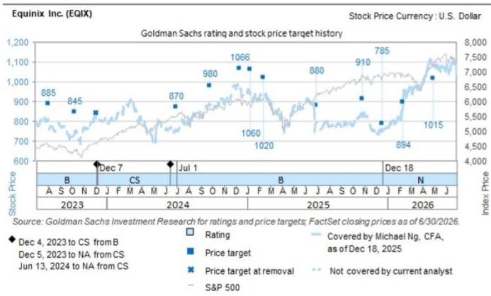

# Equinix Inc. (EQIX)

# 2Q26 业绩回顾：上调长期目标，扩张计划持续推进

12个月目标报价：\$1,060.00

潜在空间：$5.2\%$

EQIX 2Q26 EBITDA 为 \$1.396 bn，高于研究预期/市场一致预期 \$1.365/\$1.362 bn；AFFO 每股 \$11.78，高于研究预期/市场一致预期 \$11.46/\$11.36。业绩超预期主要来自收入和利润率两方面：总收入 \$2.625 bn，高于研究预期/市场一致预期 \$2.606/\$2.591 bn，主要由于非经常性收入高于预期（经常性收入略低于预期）；EBITDA 利润率 53.2%，高于研究预期/市场一致预期的 52.4%/52.6%。年化预订量 \$424 mn，介于研究预期 \$454 mn 与市场一致预期 \$404 mn 之间。

EQIX 将 2026 年收入、EBITDA 和 AFFO 每股指引上调约 1%，并将 2027-2029 年展望上调，隐含 2029 年 AFFO 每股中点约 \$58（市场一致预期为 \$56.47/\$56.20）。长期展望改善主要基于强劲的行业趋势以及产能扩张力度的加大——年度资本开支从原先的 \$3-\$4 bn 提升至 \$5-\$7 bn（其中 85% 为扩张性支出）。值得关注的是，EQIX 在零售托管数据中心稳定运营后仍能看到 25% 的现金回报率，公司也展示了执行层面的可信度：包括 3GW 项目储备及配套电力时间表，与其财务规划相匹配；土地收购策略涉及较小地块（60+MW），主要布局在其前 25 大市场。

EQIX 在零售托管和互联需求增长方面处于有利位置，这一需求可能由企业级 AI 和推理工作负载驱动，我们认为该领域仍处于增长早期阶段。

## 业绩与指引

EQIX 2Q26 调整后 EBITDA 为 \$1,396 mn，高于研究预期/Visible Alpha 一致预期 \$1,365/\$1,362 mn。

■ 总收入 \$2,625 mn，高于研究预期/市场一致预期 \$2,606/\$2,591 mn，其中：

☐ 经常性收入 \$2,377 mn，略低于研究预期/市场一致预期的 \$2,406/\$2,410 mn。

年化总预订量为 \$424 mn（1Q26 为 \$378 mn），低于研究预期 \$454 mn，但高于市场一致预期 \$404 mn。

■ AFFO 每股 \$11.78，高于研究预期/市场一致预期的 \$11.46/\$11.36。

2026 年指引上调，包括：(1) 总收入 \$10,205-\$10,285 mn（此前为 \$10,144-\$10,244 mn）；(2) 调整后 EBITDA \$5,210-\$5,270 mn（此前为 \$5,165-\$5,245 mn）；(3) AFFO \$4,240-\$4,300 mn（此前为 \$4,198-\$4,278 mn）；(4) AFFO/股 \$42.69-\$43.29（此前为 \$42.31-\$43.11）；(5) 非经常性资本开支 \$4,710-\$5,690 mn（此前约为 \$3,800 mn）；(6) 经常性资本开支 \$290-\$310 mn（此前为 \$280-\$300 mn）。

2027-2029 年展望上调，包括：(1) 总收入年增长率 10-13%（此前为 7-10%）；(2) 调整后 EBITDA 利润率 53% 以上（此前为 52% 以上）；(3) 年度资本开支 \$5,000-\$7,000 mn（此前为 \$3,000-\$4,000 mn）；(4) AFFO/股年增长率 9-12%（此前为 5-9%）。

3Q26 指引首次给出：(1) 总收入 \$2,525-\$2,575 mn（市场一致预期为 \$2.577 bn）；(2) 调整后 EBITDA \$1,275-\$1,315 mn（市场一致预期为 \$1.312 bn）；(3) 经常性资本开支 \$70-90 mn。

预测调整：我们将 2026/27/28 年 EBITDA 和 AFFO 每股预测平均上调 1.5% 和 1%，以反映 2026 年及长期指引上调带来的传导效应。

目标报价与风险：我们 12 个月目标报价为 \$1,060（此前为 \$1,015），对应 21.0 倍（不变）NTM+1Y P/AFFO。目标报价上调主要反映预测上调。

主要上行风险：(1) 数据中心市场供给端持续偏紧；(2) Equinix 以城市为中心布局的需求动能强于预期；(3) 芯片和电力效率方面的持续创新可能提升对低密度基础设施的需求。

主要下行风险：(1) 数据中心市场供给端过剩；(2) 关键客户需求动能弱于预期；(3) 现有数据中心的过时风险；(4) 来自外包数据中心服务商的竞争加剧。

## 中性

Michael Ng, CFA
+1(212)902-8618 | michael.ng@gs.com
GS & Co. LLC

Lindsey Shema
+1(801)578-2673 | lindsey.shema@gs.com
GS & Co. LLC

Yash Goenka, CFA
+1(212)934-6312 | yash.goenka@gs.com
GS India SPL

## 关键数据

市值：\$99.9bn  
企业价值：\$121.6bn  
3个月日均交易量：\$623.6mn  
美国  
美洲硬件、媒体、有线、电信  
并购排名：3

## GS 预测

<table><tr><td></td><td>12/25</td><td>12/26E</td><td>12/27E</td><td>12/28E</td></tr><tr><td>收入（\$ mn）新</td><td>9,217.0</td><td>10,294.8</td><td>11,260.5</td><td>12,452.2</td></tr><tr><td>收入（\$ mn）旧</td><td>9,217.0</td><td>10,316.5</td><td>11,105.9</td><td>11,985.7</td></tr><tr><td>EBITDA（\$ mn）</td><td>4,530.0</td><td>5,329.8</td><td>5,836.0</td><td>6,586.4</td></tr><tr><td>EBIT（\$ mn）</td><td>1,848.0</td><td>2,423.9</td><td>2,499.0</td><td>2,921.8</td></tr><tr><td>EPS（\$）新</td><td>13.76</td><td>17.03</td><td>17.63</td><td>20.29</td></tr><tr><td>EPS（\$）旧</td><td>13.76</td><td>17.99</td><td>18.42</td><td>20.81</td></tr><tr><td>P/E（倍）</td><td>60.1</td><td>59.2</td><td>57.2</td><td>49.7</td></tr><tr><td>股息率（%）</td><td>2.3</td><td>2.0</td><td>2.3</td><td>2.5</td></tr><tr><td>净债务/EBITDA（倍）</td><td>4.0</td><td>4.1</td><td>4.2</td><td>4.2</td></tr></table>

<table><tr><td></td><td>6/26</td><td>9/26E</td><td>12/26E</td><td>3/27E</td></tr><tr><td>EPS（\$）</td><td>4.83</td><td>3.99</td><td>4.00</td><td>4.18</td></tr></table>

GS 因子画像

  
来源：公司数据，GS 预测。详情请参阅披露说明。

GS 与其研究报告所覆盖的公司有业务往来并寻求开展业务。因此，读者应注意，该公司可能存在影响本报告客观性的利益冲突。读者应将本报告仅作为其决策的单一因素。有关 Reg AC 认证及其他重要披露，请参阅披露附录，或访问 www.gs.com/research/hedge.html。非美国关联机构聘用的分析师未在美国 FINRA 注册/具备研究分析师资格。

## Equinix Inc. (EQIX)

评级起始日期：2025年12月18日

比率与估值

<table><tr><td></td><td>12/25</td><td>12/26E</td><td>12/27E</td><td>12/28E</td></tr><tr><td>P/E（倍）</td><td>60.1</td><td>59.2</td><td>57.2</td><td>49.7</td></tr><tr><td>EV/EBITDA（倍）</td><td>21.9</td><td>22.7</td><td>21.4</td><td>19.5</td></tr><tr><td>EV/销售额（倍）</td><td>10.7</td><td>11.8</td><td>11.1</td><td>10.3</td></tr><tr><td>FCF 回报表现（%）</td><td>(0.5)</td><td>(1.8)</td><td>(0.7)</td><td>(0.4)</td></tr><tr><td>EV/DACF（倍）</td><td>25.0</td><td>30.3</td><td>25.0</td><td>22.6</td></tr><tr><td>CROCI（%）</td><td>10.4</td><td>9.1</td><td>10.2</td><td>10.4</td></tr><tr><td>ROE（%）</td><td>9.7</td><td>11.8</td><td>12.2</td><td>14.1</td></tr><tr><td>净债务/EBITDA（倍）</td><td>4.0</td><td>4.1</td><td>4.2</td><td>4.2</td></tr><tr><td>净债务/权益（%）</td><td>137.8</td><td>157.3</td><td>176.9</td><td>195.2</td></tr><tr><td>利息覆盖（倍）</td><td>3.5</td><td>3.8</td><td>3.5</td><td>3.6</td></tr><tr><td>库存天数</td><td>NM</td><td>NM</td><td>NM</td><td>NM</td></tr><tr><td>应收账款天数</td><td>38.6</td><td>40.2</td><td>40.6</td><td>38.3</td></tr><tr><td>应付账款天数</td><td>156.8</td><td>152.8</td><td>146.7</td><td>147.4</td></tr></table>

增长与利润率（%）

<table><tr><td colspan="5">资产负债表（\$ mn）</td></tr><tr><td></td><td>12/25</td><td>12/26E</td><td>12/27E</td><td>12/28E</td></tr><tr><td>现金及现金等价物</td><td>1,727.0</td><td>1,054.4</td><td>605.2</td><td>154.7</td></tr><tr><td>应收账款</td><td>1,001.0</td><td>1,265.1</td><td>1,239.4</td><td>1,370.8</td></tr><tr><td>存货</td><td>-</td><td>-</td><td>-</td><td>-</td></tr><tr><td>其他流动资产</td><td>2,397.0</td><td>1,720.1</td><td>1,809.4</td><td>1,908.8</td></tr><tr><td>流动资产合计</td><td>5,125.0</td><td>4,039.7</td><td>3,653.9</td><td>3,434.3</td></tr><tr><td>净固定资产</td><td>23,584.0</td><td>27,154.0</td><td>30,381.5</td><td>33,687.2</td></tr><tr><td>净无形资产</td><td>1,316.0</td><td>1,102.0</td><td>903.0</td><td>710.0</td></tr><tr><td>总投资</td><td>0.0</td><td>0.0</td><td>0.0</td><td>0.0</td></tr><tr><td>其他长期资产</td><td>10,116.0</td><td>10,328.0</td><td>10,328.0</td><td>10,328.0</td></tr><tr><td>总资产</td><td>40,141.0</td><td>42,623.7</td><td>45,266.4</td><td>48,159.5</td></tr><tr><td>应付账款</td><td>1,350.0</td><td>1,331.2</td><td>1,506.6</td><td>1,630.6</td></tr><tr><td>短期债务</td><td>1,484.0</td><td>1,355.0</td><td>1,355.0</td><td>1,355.0</td></tr><tr><td>当期租赁负债</td><td>155.0</td><td>156.0</td><td>156.0</td><td>156.0</td></tr><tr><td>其他流动负债</td><td>904.0</td><td>993.1</td><td>881.2</td><td>988.0</td></tr><tr><td>流动负债合计</td><td>3,893.0</td><td>3,835.3</td><td>3,898.7</td><td>4,129.6</td></tr><tr><td>长期债务</td><td>19,783.0</td><td>22,237.0</td><td>24,737.0</td><td>27,237.0</td></tr><tr><td>非流动租赁负债</td><td>1,304.0</td><td>1,211.0</td><td>1,211.0</td><td>1,211.0</td></tr><tr><td>其他长期负债</td><td>983.0</td><td>1,013.0</td><td>1,013.0</td><td>1,013.0</td></tr><tr><td>长期负债合计</td><td>22,070.0</td><td>24,461.0</td><td>26,961.0</td><td>29,461.0</td></tr><tr><td>总负债</td><td>25,963.0</td><td>28,296.3</td><td>30,859.7</td><td>33,590.6</td></tr><tr><td>优先股</td><td>-</td><td>-</td><td>-</td><td>-</td></tr><tr><td>普通股权益合计</td><td>14,153.0</td><td>14,302.4</td><td>14,381.7</td><td>14,543.9</td></tr><tr><td>少数股东权益</td><td>25.0</td><td>25.0</td><td>25.0</td><td>25.0</td></tr><tr><td>负债与权益合计</td><td>40,141.0</td><td>42,623.7</td><td>45,266.4</td><td>48,159.5</td></tr><tr><td>每股账面价值（\$）</td><td>144.12</td><td>144.54</td><td>144.18</td><td>144.64</td></tr></table>

<table><tr><td></td><td>12/25</td><td>12/26E</td><td>12/27E</td><td>12/28E</td></tr><tr><td>总收入增长率</td><td>5.4</td><td>11.7</td><td>9.4</td><td>10.6</td></tr><tr><td>EBITDA 增长率</td><td>10.6</td><td>17.7</td><td>9.5</td><td>12.9</td></tr><tr><td>EPS 增长率</td><td>61.6</td><td>23.7</td><td>3.5</td><td>15.1</td></tr><tr><td>DPS 增长率</td><td>10.1</td><td>10.0</td><td>10.0</td><td>10.0</td></tr><tr><td>毛利率</td><td>67.9</td><td>68.9</td><td>68.6</td><td>68.8</td></tr><tr><td>EBIT 利润率</td><td>20.0</td><td>23.5</td><td>22.2</td><td>23.5</td></tr></table>

价格表现  
  
现金流（\$ mn）  
来源：FactSet。价格截至 2026 年 7 月 29 日收盘。

<table><tr><td colspan="5">现金流量表（\$ mn）</td></tr><tr><td></td><td>12/25</td><td>12/26E</td><td>12/27E</td><td>12/28E</td></tr><tr><td>净利润</td><td>1,348.0</td><td>1,680.8</td><td>1,751.9</td><td>2,036.6</td></tr><tr><td>折旧摊销加回</td><td>2,066.0</td><td>2,327.1</td><td>2,748.2</td><td>3,032.3</td></tr><tr><td>少数股东权益加回</td><td>-</td><td>-</td><td>-</td><td>-</td></tr><tr><td>营运资本净变动</td><td>208.0</td><td>512.0</td><td>512.0</td><td>512.0</td></tr><tr><td>其他</td><td>289.0</td><td>(388.2)</td><td>68.7</td><td>112.4</td></tr><tr><td>经营活动现金流</td><td>3,911.0</td><td>4,131.7</td><td>5,080.9</td><td>5,693.2</td></tr><tr><td>资本开支</td><td>(4,311.0)</td><td>(5,889.1)</td><td>(5,776.8)</td><td>(6,145.0)</td></tr><tr><td>收购</td><td>(994.0)</td><td>(24.0)</td><td>-</td><td>-</td></tr><tr><td>剥离</td><td>-</td><td>0.0</td><td>-</td><td>-</td></tr><tr><td>其他</td><td>(1,179.0)</td><td>(572.0)</td><td>-</td><td>-</td></tr><tr><td>投资活动现金流</td><td>(6,484.0)</td><td>(6,485.1)</td><td>(5,776.8)</td><td>(6,145.0)</td></tr><tr><td>已支付股息</td><td>(1,856.0)</td><td>(2,048.2)</td><td>(2,253.4)</td><td>(2,498.7)</td></tr><tr><td>股份发行/回购</td><td>99.0</td><td>-</td><td>-</td><td>-</td></tr><tr><td>债务增减</td><td>2,934.0</td><td>2,577.0</td><td>2,500.0</td><td>2,500.0</td></tr><tr><td>其他</td><td>42.0</td><td>1,152.0</td><td>-</td><td>-</td></tr><tr><td>筹资活动现金流</td><td>1,219.0</td><td>1,680.8</td><td>246.6</td><td>1.3</td></tr><tr><td>总现金流</td><td>(1,354.0)</td><td>(672.6)</td><td>(449.3)</td><td>(450.5)</td></tr><tr><td>自由现金流</td><td>(400.0)</td><td>(1,757.3)</td><td>(695.9)</td><td>(451.8)</td></tr><tr><td>每股自由现金流（基本）（\$）</td><td>(4.09)</td><td>(17.81)</td><td>(7.00)</td><td>(4.51)</td></tr></table>

利润表（\$ mn）

<table><tr><td colspan="5">利润表（\$ mn）</td></tr><tr><td></td><td>12/25</td><td>12/26E</td><td>12/27E</td><td>12/28E</td></tr><tr><td>总收入</td><td>9,217.0</td><td>10,294.8</td><td>11,260.5</td><td>12,452.2</td></tr><tr><td>销售成本</td><td>(2,959.0)</td><td>(3,202.1)</td><td>(3,531.3)</td><td>(3,884.8)</td></tr><tr><td>销售及管理费用</td><td>(1,728.0)</td><td>(1,763.0)</td><td>(1,893.2)</td><td>(1,980.9)</td></tr><tr><td>研发费用</td><td>-</td><td>-</td><td>-</td><td>-</td></tr><tr><td>其他经营收入/支出</td><td>(616.0)</td><td>(578.8)</td><td>(588.7)</td><td>(632.4)</td></tr><tr><td>EBITDA</td><td>4,530.0</td><td>5,329.8</td><td>5,836.0</td><td>6,586.4</td></tr><tr><td>折旧与摊销</td><td>(2,066.0)</td><td>(2,327.1)</td><td>(2,748.2)</td><td>(3,032.3)</td></tr><tr><td>EBIT</td><td>1,848.0</td><td>2,423.9</td><td>2,499.0</td><td>2,921.8</td></tr><tr><td>净利息收入/支出</td><td>(334.0)</td><td>(454.0)</td><td>(524.0)</td><td>(619.0)</td></tr><tr><td>联营公司损益</td><td>-</td><td>-</td><td>-</td><td>-</td></tr><tr><td>税前利润</td><td>1,508.0</td><td>1,887.9</td><td>1,975.0</td><td>2,302.8</td></tr><tr><td>所得税准备</td><td>(160.0)</td><td>(207.0)</td><td>(223.1)</td><td>(266.2)</td></tr><tr><td>少数股东权益</td><td>-</td><td>-</td><td>-</td><td>-</td></tr><tr><td>优先股股息</td><td>-</td><td>-</td><td>-</td><td>-</td></tr><tr><td>净利润（扣除特殊项目前）</td><td>1,348.0</td><td>1,680.8</td><td>1,751.9</td><td>2,036.6</td></tr><tr><td>净利润（扣除特殊项目后）</td><td>1,350.0</td><td>1,686.8</td><td>1,759.9</td><td>2,044.6</td></tr><tr><td>EPS（基本，扣除特殊项目前）（\$）</td><td>13.77</td><td>17.03</td><td>17.63</td><td>20.34</td></tr><tr><td>EPS（摊薄，扣除特殊项目前）（\$）</td><td>13.74</td><td>16.96</td><td>17.55</td><td>20.21</td></tr><tr><td>EPS（扣除ESO费用，摊薄）（\$）</td><td>--</td><td>--</td><td>--</td><td>--</td></tr><tr><td>DPS（\$）</td><td>18.76</td><td>20.64</td><td>22.70</td><td>24.97</td></tr><tr><td>股息支付率（%）</td><td>136.2</td><td>121.2</td><td>128.8</td><td>122.8</td></tr><tr><td>加权平均股本（基本）（mn）</td><td>97.9</td><td>98.7</td><td>99.4</td><td>100.2</td></tr><tr><td>加权平均股本（摊薄）（mn）</td><td>98.1</td><td>99.1</td><td>99.9</td><td>100.8</td></tr></table>

来源：公司数据，GS 预测。

## 披露附录

## Reg AC

我们，Michael Ng, CFA、Lindsey Shema 和 Yash Goenka, CFA，特此证明本报告中表达的所有观点均准确反映了我们个人对相关公司及其证券的看法。我们还证明，我们的薪酬中没有任何部分直接或间接与本次报告中表达的具体建议或观点相关。

除非另有说明，本报告封面上列出的个人均为 GS 全球投资研究部门的分析师。

贡献作者：Michael Ng, CFA GS & Co. LLC、Lindsey Shema GS & Co. LLC、Yash Goenka, CFA GS India SPL。

除非另有说明，本报告贡献作者披露中列出的个人均为 GS 全球投资研究部门的分析师。

## GS 因子画像

GS 因子画像通过将股票的关键属性与市场（即我们的评级股票池）及其行业同行进行比较，提供投资背景信息。所展示的四个关键属性为：增长、财务回报、倍数（即估值）和综合（增长、财务回报和倍数的复合指标）。增长、财务回报和倍数通过计算每只股票特定指标的标准化排名得出。各指标的标准化排名随后取平均值并转换为相关属性的百分位。每个指标的具体计算可能因财年、行业和地区而异，但标准方法如下：

增长基于股票的前瞻性销售增长、EBITDA 增长和 EPS 增长（对于金融类股票，仅使用 EPS 和销售增长），百分位越高表示增长性越强。财务回报基于股票的前瞻性 ROE、ROCE 和 CROCI（对于金融类股票，仅使用 ROE），百分位越高表示财务回报越高。倍数基于股票的前瞻性 P/E、P/B、价格/股息（P/D）、EV/EBITDA、EV/FCF 和 EV/债务调整后现金流（DACF）（对于金融类股票，仅使用 P/E、P/B 和 P/D），百分位越高表示交易倍数越高。综合百分位计算为增长百分位、财务回报百分位和（100% - 倍数百分位）的平均值。

财务回报和倍数使用 GS 分析师对至少三个季度后财年末的预测。增长使用至少七个季度后的财年与至少三个季度后的财年相比的输入（所有指标均按每股基础计算）。

有关 GS 因子画像计算方式的更详细说明，请联系您的 GS 代表。

## 并购排名

在我们的全球覆盖范围内，我们使用并购框架审视股票，综合考虑定性因素和定量因素（可能因行业和地区而异），以纳入某些公司可能被收购的可能性。然后我们为评级覆盖下的公司分配 1 至 3 的并购排名，其中 1 表示公司成为收购目标的可能性较高（30%-50%），2 表示中等可能性（15%-30%），3 表示较低可能性（0%-15%）。对于排名为 1 或 2 的公司，按照我们的标准部门指南，我们将并购因素纳入目标报价。并购排名为 3 被视为不重要，因此不计入目标报价，可能在研究中讨论也可能不讨论。

## Quantum

Quantum 是 GS 专有数据库，提供详细的财务报表历史、预测和比率。可用于对单一公司进行深入分析，或比较不同行业和市场的公司。

## 披露

Equinix Inc. 的评级相对于其覆盖范围内的其他公司：AT&T Inc.、American Tower Corp.、Apple Inc.、Arista Networks Inc.、Axon Enterprise Inc.、Blend Labs、Celestica Inc.、Charter Communications Inc.、Cisco Systems Inc.、Cogent Communications Holdings、Comcast Corp.、Compass Inc.、Crown Castle Inc.、Dell Technologies Inc.、Digital Realty Trust Inc.、Equinix Inc.、F5 Inc.、HP Inc.、Hewlett Packard Enterprise Co.、IREN Ltd.、Ingram Micro、Lumen Technologies Inc.、NetApp Inc.、Opendoor Technologies Inc.、Optimum Communications Inc.、Penguin Solutions Inc.、SBA Communications Corp.、Stagwell Inc.、Super Micro Computer Inc.、T-Mobile US Inc.、TD SYNNEX Corp.、Verizon Communications、Versant Media Group、Walt Disney Co.、Zillow Group

## 公司特定监管披露

以下披露涉及 GS Group, Inc.（及其关联公司，"GS"）与 GS 全球投资研究覆盖并在本研究中提及的公司之间的关系。

GS 在过去 12 个月内因投资银行服务获得报酬：Equinix Inc. (\$1,008.02)

GS 预计在未来 3 个月内寻求因投资银行服务获得报酬：Equinix Inc. (\$1,008.02)

GS 在过去 12 个月内与以下公司存在投资银行服务客户关系：Equinix Inc. (\$1,008.02)

GS 在过去 12 个月内与以下公司存在非投资银行证券相关服务客户关系：Equinix Inc. (\$1,008.02)

GS 在过去 12 个月内与以下公司存在非证券服务客户关系：Equinix Inc. (\$1,008.02)

GS 做市该证券或其衍生品：Equinix Inc. (\$1,008.02)

## 评级/投资银行关系分布

GS 投资研究全球股票覆盖范围

<table><tr><td rowspan="2"></td><td colspan="3">评级分布</td><td colspan="3">投资银行关系</td></tr><tr><td>买入</td><td>持有</td><td>卖出</td><td>买入</td><td>持有</td><td>卖出</td></tr><tr><td>全球</td><td>50%</td><td>34%</td><td>16%</td><td>65%</td><td>59%</td><td>43%</td></tr></table>

截至 2026 年 7 月 1 日，GS 全球投资研究对 3,104 只股票有投资评级。GS 将股票分配为各区域投资清单上的买入和卖出；未如此分配的股票视为中性。该等分配等同于 FINRA 规则要求的上述披露中的买入、持有和卖出。请参阅下文"评级、覆盖范围及相关定义"。投资银行关系图表反映了每个评级类别中 GS 在过去十二个月内提供投资银行服务的公司百分比。

## 目标报价与评级历史图表

  
所示目标报价应结合此前所有已发布的 GS 报告（可能包含也可能不包含目标报价）以及公司、行业和金融市场的发展情况来理解。

## 目标报价历史表 Equinix Inc. (EQIX)

<table><tr><td>报告日期</td><td>目标报价（\$）</td><td>收盘价（\$）</td></tr><tr><td>2026年4月30日</td><td>1,015.00</td><td>1,082.83</td></tr><tr><td>2026年2月12日</td><td>894.00</td><td>957.87</td></tr><tr><td>2025年12月18日</td><td>785.00</td><td>744.08</td></tr><tr><td>2025年10月30日</td><td>910.00</td><td>833.16</td></tr><tr><td>2025年7月1日</td><td>880.00</td><td>795.38</td></tr><tr><td>2025年2月13日</td><td>1,020.00</td><td>923.00</td></tr><tr><td>2025年1月10日</td><td>1,060.00</td><td>899.83</td></tr><tr><td>2024年12月12日</td><td>1,066.00</td><td>975.30</td
