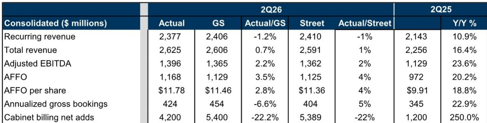
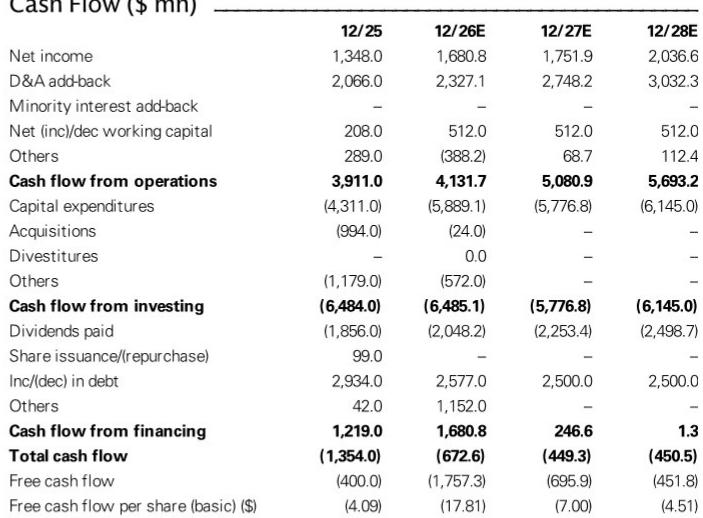
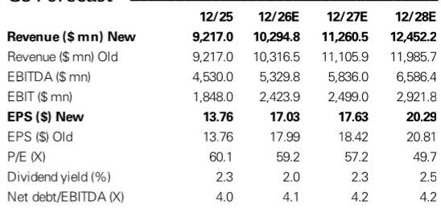

# Equinix 产能升级：业绩超预期背后的真正看点

Equinix 2026年第二季度业绩在表面上表现稳健——调整后EBITDA为13.96亿美元，超出卖方预期和市场一致预期约2%；每股AFFO为11.78美元，较预期高出约3%。但头条数字并非战略意义所在。公司同时上调了多年增长目标，将2027-2029年营收增长预期从每年7-10%提升至10-13%，并将年度计划资本支出规模从30-40亿美元近乎弹性较高至50-70亿美元，其中85%用于扩张性项目。这不是一次简单的指引微调，而是一份声明：零售托管市场正在进入供给受限的超级周期，Equinix 意图成为主要受益者。

市场初期的反应——财报发布后约5.2%的温和上涨——可能低估了这一季度作为战略重新定位事件的意义。通过承诺300万千瓦的储备项目，并将电力可用性与财务计划相匹配，Equinix 正在回答困扰数据中心读者两年的问题：零售托管服务商能否以超大规模需求的速度扩展产能，同时不牺牲其历史上纪律严明的回报水平？本季度指引中蕴含的答案是“有条件的肯定”，但条件本身与肯定同样重要。

整个报告中最重要的数字并非EBITDA超预期或AFFO增长率，而是在公司将其土地收购策略转向前25大市场中60+兆瓦的小型地块时，仍然维持新零售托管数据中心稳定运营后25%的现金回报预期。这一数据点调和了激进扩张与财务纪律之间的表面张力。Equinix 并非简单地将资本投入增长故事，而是在论证零售托管的单位经济性已结构性改善，其驱动力来自仍处于早期阶段的企业AI和推理工作负载。

## 经常性收入未达预期背后：需求结构优于表面数据

总营收26.25亿美元超出市场一致预期约1%，但超预期的构成值得审视。经常性收入23.77亿美元实际上低于卖方预期的24.06亿美元和市场一致预期的24.10亿美元约1%。超预期完全来自非经常性收入——这一类别通常包括安装费、开通费和其他一次性项目。表面上看，这似乎是盈利质量隐忧——在持久性较弱的项目上超预期，而在年金流上未达预期。

但如果结合预订量和机柜净增来看，解读则更为细致。年化总预订量4.24亿美元低于卖方预期的4.54亿美元，但高于市场一致预期的4.04亿美元，同比增长22.9%。更值得注意的是，机柜计费净增4,200台，较卖方预期的5,400台低22%，但较去年同期新增的1,200台增长250%。环比轨迹比单季度偏差更重要。2026年第一季度预订量为3.78亿美元；第二季度预订量4.24亿美元，环比加速12%。需求环境在增强，而非减弱。

经常性收入未达预期更适合理解为时间性因素而非需求信号。当一家公司像Equinix现在这样激进地扩展新产能时，机柜签约与开始产生经常性收入之间的时间差会造成季度间的波动。非经常性收入超预期——可能反映了新激活产能上的安装和互联费用——实际上是已签约储备转化为创收资产的领先指标。经常性收入同比增长10.9%，虽然低于卖方乐观预测，但对于这一规模的公司而言仍是健康的有机增长率。

市场应关注的是加速的预订量、强劲的机柜净增以及维持25%现金回报的组合。这三者表明Equinix并未牺牲定价权或利用率纪律来填充其扩张的产能管道。公司以证明更高资本密集度合理性的回报水平出售产能，这是上调长期指引可信的必要条件。

## 资本支出跃升：重塑竞争格局的战略信号

将年度资本支出从30-40亿美元提升至50-70亿美元，其中85%分配给扩张性项目，是本报告中最具战略意义的举措。以新区间中点计算，这代表潜在75%的增长。对于一家市值约1,000亿美元、企业价值1,216亿美元的公司而言，这是对资产负债表能力的重大承诺。净债务/EBITDA预计将从2025年的4.0倍上升至2028年的4.2倍，净债务/权益比率预计同期从137.8%攀升至195.2%。杠杆上升是深思熟虑的选择，而非偶然。

战略逻辑清晰。企业AI和推理工作负载需要与主导近期数据中心建设的超大规模训练集群不同的基础设施形态。推理工作负载更加分布式、需要更低延迟，并且需要更靠近数据生成和消费的地点。这正是Equinix等零售托管服务商所占据的细分市场。公司以主要商业枢纽而非偏远电力富集地区的数据中心布局，对推理工作负载而言是结构性优势。提高资本支出是对这一需求细分市场将以超过当前市场定价的速度增长的押注。

土地收购策略强化了这一解读。通过瞄准较小的地块——60+兆瓦而非超大规模开发商偏好的数百兆瓦级场地——Equinix正在优化速度和灵活性而非规模。较小的地块可以更快完成审批、许可和建设，这在电力可用性成为硬约束的市场中至关重要。300万千瓦的储备项目及其与财务计划相匹配的电力时间表，是对行业最持久瓶颈的直接回应。Equinix不仅在建产能，还在建设供应链能力，以便在市场需要时将产能上线。

风险在于，这一扩张恰逢超大规模云服务商开始更多内化其基础设施需求，或新进入者涌入零售托管领域。报告通过下行风险因素承认了这一点，包括过剩供给侧动态和来自外包数据中心服务商更激烈的价格竞争。维持25%的回报假设是关键考验。如果Equinix能够在资本支出增长75%的同时维持这一回报水平，上调的指引就是可信的。如果回报假设在竞争压力下受到侵蚀，杠杆上升将成为负担而非助力。

## 上调长期指引：反映营收增长与利润率预期的结构性转变

公司将2027-2029年营收增长预期从每年7-10%上调至10-13%，调整后EBITDA利润率从52%+上调至53%+，这不仅仅是反映更高预订量的机械更新，而是对当前需求周期持久性的判断。此前7-10%的增长区间与成熟基础设施公司与其可服务市场同步增长的定位一致。新的10-13%区间意味着Equinix预期在一个本身扩张速度快于此前预期的市场中获取份额。

53%+ EBITDA利润率目标中蕴含的利润率扩张同样重要。2025年调整后EBITDA利润率约为营收的49.1%。2026年指引中点——营收102.45亿美元对应EBITDA 52.4亿美元——隐含利润率51.1%。2027-2029年53%+的展望代表持续的经营杠杆，考虑到资本密集度提高以及折旧和摊销费用预期增加，这一点令人意外。公司在扩大资本支出的同时扩张利润率，表明零售托管市场的定价权在增强而非减弱。

2027-2029年AFFO每股增长指引从之前的每年5-9%上调至9-12%，是直接影响股权估值的最关键指标。隐含的2029年AFFO每股约58美元（中点），与市场一致预期的56.20-56.47美元相比具有优势。公司内部展望与卖方一致预期之间的差距是潜在上行空间来源。如果Equinix兑现其上调的指引，市场将需要向上修正预期。

2026年指引上调本身幅度温和——营收、EBITDA和AFFO每股均增长约1%——但方向与长期叙事一致。公司将其非经常性资本支出指引从约38亿美元上调至47.1-56.9亿美元，确认扩张周期前置。2026年的数字不如它们所传递的管理层对2027-2029年轨迹的信心重要。

## 估值框架：从收益到增长的转变需要新的分析视角

该股票目前交易于59.2倍远期市盈率和22.7倍远期EV/EBITDA，这并非明显便宜的倍数。约2.0%的股息回报表现和每年10%的预期股息增长具有吸引力，但不足以仅从收益角度证明估值的合理性。研究逻辑建立在AFFO每股增长轨迹之上。在新的2029年前9-12% AFFO每股增长指引下，该股票需要实现十年的两位数运营资金增长才能证明其当前倍数合理。

资产负债表数据揭示了模型中的张力。自由现金流预计到2028年持续为负——2026年负17.6亿美元，2027年负6.96亿美元，2028年负4.52亿美元。股息支付率超过净利润的120%，意味着股息通过债务和股权发行而非内部产生的现金流来融资。这不是批评，而是大力投资扩张的成长型公司的本质。但这确实意味着股权故事完全依赖于投入资本回报按预期实现。

CROCI（投入资本现金回报）预测从2026年的9.1%上升至2028年的10.4%，是值得关注的关键指标。如果Equinix能够在资本基础增长75%的同时将CROCI维持在10%以上，价值创造就是真实的。如果CROCI向资本成本回落，增加的杠杆将成为股权价值的拖累。新项目维持25%的现金回报假设是当前CROCI与预期改善之间的桥梁。

读者还应注意到应收账款天数从2025年的38.6天上升至2026年的40.2天，这表明随着公司扩展新产能，客户付款时间略有延长。这是轻微的营运资本拖累，但在当前水平不构成担忧。更显著的资产负债表趋势是预计现金余额从2025年的17.3亿美元下降至2028年的1.55亿美元，同时长期债务从198亿美元上升至272亿美元。公司有意运行更紧的流动性状况以资助增长，这增加了再融资风险，但也传递了对现金流稳定性的信心。

## 数据中心基础设施布局的决策框架

对于评估Equinix与其他数据中心敞口的读者而言，关键差异在于零售托管模式与超大规模批发模式。报告强调企业AI和推理工作负载是主要需求驱动力，这是研究逻辑的核心。推理工作负载比驱动超大规模需求的巨型训练集群更分布式、对延迟更敏感，更可能部署在都市区域。如果推理逻辑成立，Equinix以都市为中心的布局是批发服务商在偏远地区建设难以复制的结构性优势。

评估该股票的框架应围绕三个变量。第一，300万千瓦储备项目以预期25%现金回报转化为创收产能。任何回报受到侵蚀的证据——通过定价压力、更高建设成本或更慢的租赁速度——都将削弱上调的指引。第二，机柜计费净增轨迹，这是最直接的需求领先指标。第二季度4,200台净增虽然低于卖方预期，但同比增长250%，支持需求周期加速的逻辑。第三，新产能上线时利润率形态的演变。2027-2029年53%+ EBITDA利润率目标意味着公司能够在扩张的同时维持定价权。

逻辑的风险不在于需求故事，而在于供给响应。报告指出市场正在经历增量供给紧张，这对定价有利。然而，Equinix及其竞争对手增加的资本支出可能在需求增长减速时造成供给过剩局面。报告的下行风险因素——过剩供给侧动态、客户需求减弱、过时风险和价格竞争——是上行逻辑的镜像。当前估值已包含显著的成长预期，容错空间有限。

最有趣的二阶影响是零售托管市场整合可能加剧。如果Equinix成功扩展产能并维持回报水平，它很可能从缺乏资产负债表能力进行同等扩张的小型服务商手中获取市场份额。报告提及公司在覆盖范围内的并购排名为第3，表明Equinix被视为潜在整合者。有机扩张与战略收购的结合可能将公司增长轨迹推升至甚至超过上调后的指引。

读者的决策不在于是否持有数据中心敞口——市场对该板块的估值已经给出了肯定回答——而在于Equinix的零售托管模式是否是这一敞口的合适载体。第二季度报告提出了可信的理由。公司正在把握需求周期，以有吸引力的回报扩展产能，并以显示对趋势持久性信心的方式上调指引。估值要求较高，但增长轨迹现在更加清晰。未来两年将揭示25%回报假设在大规模下是否成立，这将决定该股票是否值得其溢价倍数。

*仅供参考。部分内容可能基于原始材料由AI辅助生成、翻译、总结或编辑，可能包含遗漏或错误。请独立核实。本文不构成投资、法律、税务、会计或其他专业建议。*
