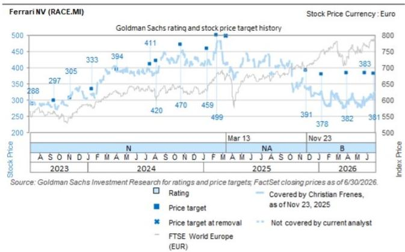
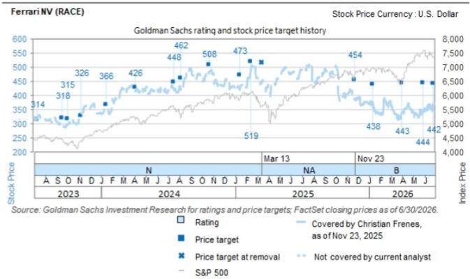

# Ferrari NV (RACE.MI): 2Q26业绩超预期，订单覆盖2027全年，公司上调全年指引

Ferrari于7月30日发布2Q26业绩。我们认为，随着新指引高于当前市场一致预期，Ferrari 2026年市场一致预期EPS在短期内有望获得中等个位数上修，且3Q仍有进一步上调空间。我们维持报告评级。

**2Q26业绩超预期，个性化定制表现强劲**：Ferrari 2Q26调整后EBIT较Visible Alpha一致预期高出6.3%（实际€569mn，GSe €590mn），当季受益于强劲的价格组合€122mn（GSe €82mn）。交付量3,366台，较一致预期低1.9%（一致预期3,433台，GSe 3,397台）。尽管交付量略低，整体收入受益于更丰富的车型组合和个性化定制率（20% vs 中期指引18%），收入较一致预期高出4.3%（€1.86bn），与GSe €1.90bn基本一致。Ferrari确认当前订单已覆盖2027年全年。2Q特别系列车型组合略低于我们的预期。

**工业自由现金流略低于预期，主因库存增加及折旧摊销减少**：Ferrari工业自由现金流较一致预期低1.9%，主要可归因于负向营运资本变动及拨备。资本开支略低于预期，为-€236mn（GSe -€247mn）。现金研发支出€267mn（GSe €255mn），资本化率约45.7%（GSe 43%），带来略好的损益净收益€49mn（GSe €30mn）。

**2026年指引上调，仍有进一步上调空间**：Ferrari上调FY26指引，现预计收入€7.60bn（此前约€7.5bn，一致预期€7.55bn，GSe €7.84bn），调整后EBIT ≥€2.26bn（此前≥€2.22bn，一致预期€2.25bn，GSe €2.32bn），工业自由现金流 ≥€1.55bn（此前>€1.5bn，一致预期€1.61bn，GSe €1.73bn）。我们继续认为Ferrari可能在3Q26再次上调指引，因我们预计产品组合将在2H26继续优化，受益于F80超级跑车和296 Versione Speciale的爬坡，个性化定制需求保持强劲。我们注意到，上调后的指引意味着FY26-30收入复合年增长率高于CMD给出的5%指引，这可能增强市场对5%复合年增长率目标作为增长下限而非目标的信心。

**电话会议关键问题**：1) 近期英国和德国豪华车残值强劲回升的原因是什么？2) 除英国外，公司是否在其他市场采取措施应对残值变化？3) 2Q F80/499P的交付量是多少？4) 2Q26个性化定制率是多少，尽管管理层预期较低，但这一积极发展的驱动因素是什么？

Christian Frenes +44(20)7051-8641 | christian.frenes@gs.com GS International

Robert Triulzi  
+44(20)7552-2281 | robert.triulzi@gs.com GS International

Shivam Kotecha
+1(332)245-7822 |
shivam.kotecha@gs.com
GS India SPL

Monika Mengting Liu, CFA
+44(20)7051-7601 | monika.liu@gs.com
GS International

GS从事并寻求与研究报告所覆盖公司开展业务。因此，读者应知悉公司可能存在影响本报告客观性的利益冲突。读者应将本报告视为作出投资决策的单一因素。有关Reg AC认证及其他重要披露，请参阅披露附录，或访问 www.gs.com/research/hedge.html。非美国关联公司聘用的分析师未在美国FINRA注册/具备研究分析师资格。

Exhibit 1:

## 2Q26业绩 vs. GSe及一致预期

Exhibit 2: Ferrari 2Q26业绩 vs. GSe及Visible Alpha一致预期

<table><tr><td rowspan="2">(€ mn)</td><td colspan="5">2Q26</td><td colspan="3">2026E</td><td colspan="3">2027E</td></tr><tr><td>实际</td><td>GSe</td><td>一致预期</td><td>实际 vs GSe</td><td>实际 vs 一致预期</td><td>GSe</td><td>一致预期</td><td>GSe vs 一致预期</td><td>GSe</td><td>一致预期</td><td>GSe vs 一致预期</td></tr><tr><td>交付量</td><td>3,366</td><td>3,397</td><td>3,433</td><td>-0.9%</td><td>-1.9%</td><td>13,519</td><td>13,655</td><td>-1.0%</td><td>13,940</td><td>13,849</td><td>0.7%</td></tr><tr><td>收入</td><td>1,938</td><td>1,903</td><td>1,857</td><td>1.8%</td><td>4.3%</td><td>7,837</td><td>7,551</td><td>3.8%</td><td>8,697</td><td>8,198</td><td>6.1%</td></tr><tr><td>其中：汽车及零部件</td><td>1,629</td><td>1,587</td><td>1,554</td><td>2.7%</td><td>4.8%</td><td>6,565</td><td>6,331</td><td>3.7%</td><td>7,340</td><td>6,925</td><td>6.0%</td></tr><tr><td>调整后EBITDA</td><td>755</td><td>757</td><td>732</td><td>-0.3%</td><td>3.1%</td><td>3,034</td><td>2,963</td><td>2.4%</td><td>3,337</td><td>3,235</td><td>3.1%</td></tr><tr><td>调整后EBITDA利润率</td><td>39.0%</td><td>39.8%</td><td>39.4%</td><td>-0.8%</td><td>-0.5%</td><td>38.7%</td><td>39.2%</td><td>-0.5%</td><td>38.4%</td><td>39.5%</td><td>-1.1%</td></tr><tr><td>调整后EBIT</td><td>605</td><td>590</td><td>569</td><td>2.6%</td><td>6.3%</td><td>2,317</td><td>2,250</td><td>2.9%</td><td>2,518</td><td>2,472</td><td>1.9%</td></tr><tr><td>调整后EBIT利润率</td><td>31.2%</td><td>31.0%</td><td>30.6%</td><td>0.2%</td><td>0.6%</td><td>29.6%</td><td>29.8%</td><td>-0.2%</td><td>29.0%</td><td>30.1%</td><td>-1.2%</td></tr><tr><td>调整后EPS</td><td>2.62</td><td>2.53</td><td>2.46</td><td>3.7%</td><td>6.6%</td><td>9.94</td><td>9.71</td><td>2.3%</td><td>10.89</td><td>10.83</td><td>0.5%</td></tr><tr><td>自由现金流</td><td>276</td><td>289</td><td>281</td><td>-4.4%</td><td>-1.9%</td><td>1,731</td><td>1,613</td><td>7.3%</td><td>1,641</td><td>1,704</td><td>-3.7%</td></tr></table>

资料来源：Visible Alpha一致预期数据、GS全球投资研究、公司数据

Exhibit 3: Ferrari FY26指引及FY30目标 vs GSe及Visible Alpha一致预期

<table><tr><td></td><td>2025</td><td colspan="3">2026E</td><td colspan="3">vs FY25实际</td><td colspan="3">2030E</td><td colspan="3">隐含26-30复合年增长率</td></tr><tr><td>(€ mn)</td><td>实际</td><td>GSe</td><td>指引下限</td><td>差异%</td><td>GSe</td><td>指引下限</td><td>差异%</td><td>GSe</td><td>指引</td><td>差异%</td><td>GSe</td><td>指引</td><td>差异%</td></tr><tr><td>收入</td><td>7,146</td><td>7,837</td><td>7,600</td><td>3.1%</td><td>9.7%</td><td>6.4%</td><td>3.3%</td><td>10,044</td><td>9,000</td><td>11.6%</td><td>6%</td><td>4%</td><td>48.2%</td></tr><tr><td>调整后EBITDA</td><td>2,772</td><td>3,034</td><td>2,970</td><td>2.1%</td><td>9.5%</td><td>7.2%</td><td>2.3%</td><td>3,823</td><td>3,600</td><td>6.2%</td><td>6%</td><td>5%</td><td>20.8%</td></tr><tr><td>调整后EBITDA利润率</td><td>38.8%</td><td>38.7%</td><td>39.1%</td><td>-0.4%</td><td></td><td></td><td></td><td>38.1%</td><td>40.0%</td><td>-1.9%</td><td></td><td></td><td></td></tr><tr><td>调整后EBIT</td><td>2,110</td><td>2,317</td><td>2,260</td><td>2.5%</td><td>9.8%</td><td>7.1%</td><td>2.7%</td><td>2,907</td><td>2,750</td><td>5.7%</td><td>6%</td><td>5%</td><td>16.1%</td></tr><tr><td>调整后EBIT利润率</td><td>29.5%</td><td>29.6%</td><td>29.7%</td><td>-0.2%</td><td></td><td></td><td></td><td>28.9%</td><td>30.6%</td><td>-1.6%</td><td></td><td></td><td></td></tr><tr><td>调整后EPS</td><td>8.96</td><td>9.94</td><td>9.68</td><td>2.6%</td><td>11.0%</td><td>8.1%</td><td>2.9%</td><td>13.13</td><td>11.50</td><td>14.2%</td><td>7%</td><td>4%</td><td>64.0%</td></tr><tr><td>自由现金流</td><td>1,538</td><td>1,731</td><td>1,550</td><td>11.7%</td><td></td><td></td><td></td><td></td><td></td><td></td><td></td><td></td><td></td></tr><tr><td>折旧及摊销</td><td>662</td><td>717</td><td>710</td><td>1.0%</td><td></td><td></td><td></td><td></td><td></td><td></td><td></td><td></td><td></td></tr><tr><td></td><td>2025</td><td colspan="3">2026E</td><td colspan="3">vs FY25实际</td><td colspan="3">2030E</td><td colspan="3">隐含26-30复合年增长率</td></tr><tr><td>(€ mn)</td><td>实际</td><td>一致预期</td><td>指引下限</td><td>差异%</td><td>一致预期</td><td>指引下限</td><td>差异%</td><td>一致预期</td><td>指引</td><td>差异%</td><td>一致预期</td><td>指引*</td><td>FY26一致预期</td></tr><tr><td>收入</td><td>7,146</td><td>7,551</td><td>7,600</td><td>-0.6%</td><td>5.7%</td><td>6.4%</td><td>-0.7%</td><td>9,488</td><td>9,000</td><td>5.4%</td><td>6%</td><td>4%</td><td>36.0%</td></tr><tr><td>调整后EBITDA</td><td>2,772</td><td>2,963</td><td>2,970</td><td>-0.2%</td><td>6.9%</td><td>7.2%</td><td>-0.3%</td><td>3,820</td><td>3,600</td><td>6.1%</td><td>7%</td><td>5%</td><td>33.2%</td></tr><tr><td>调整后EBITDA利润率</td><td>38.8%</td><td>39.2%</td><td>39.1%</td><td>0.2%</td><td></td><td></td><td></td><td>40.3%</td><td>40.0%</td><td>0.3%</td><td></td><td></td><td></td></tr><tr><td>调整后EBIT</td><td>2,110</td><td>2,250</td><td>2,260</td><td>-0.4%</td><td>6.7%</td><td>7.1%</td><td>-0.5%</td><td>2,931</td><td>2,750</td><td>6.6%</td><td>7%</td><td>5%</td><td>35.9%</td></tr><tr><td>调整后EBIT利润率</td><td>29.5%</td><td>29.8%</td><td>29.7%</td><td>0.1%</td><td></td><td></td><td></td><td>30.9%</td><td>30.6%</td><td>0.3%</td><td></td><td></td><td></td></tr><tr><td>调整后EPS</td><td>8.96</td><td>9.71</td><td>9.68</td><td>0.3%</td><td>8.4%</td><td>8.1%</td><td>0.3%</td><td>13.22</td><td>11.50</td><td>14.9%</td><td>8%</td><td>4%</td><td>82.3%</td></tr><tr><td>自由现金流</td><td>1,538</td><td>1,613</td><td>1,550</td><td>4.1%</td><td></td><td></td><td></td><td></td><td></td><td></td><td></td><td></td><td></td></tr></table>

资料来源：Visible Alpha一致预期数据、GS全球投资研究、公司数据

## 估值与主要风险

我们对Ferrari持报告评级。我们采用P/E估值法，将35x目标倍数应用于2027E EPS €10.92，得出12个月目标价€381/$442。

主要下行风险包括：1) 汽车残值大幅变化对Ferrari品牌力和订单簿构成挑战；2) Ferrari混合动力和纯电动车型市场接受度不及燃油车型，导致订单减少；3) 关键市场趋于饱和，制约Ferrari为后续车型定价的能力；4) 低估未来数年产品创新的资本开支需求；5) 供应链或全球贸易中断影响Ferrari新产品交付。

<table><tr><td>RACE.MI</td><td>12个月目标价：€381.00</td><td>现价：€339.80</td><td>上行空间：12.1%</td></tr><tr><td>RACE</td><td>12个月目标价：$442.00</td><td>现价：$385.69</td><td>上行空间：14.6%</td></tr></table>

<table><tr><td>买入</td><td colspan="5">GS预测</td></tr><tr><td></td><td></td><td>12/25</td><td>12/26E</td><td>12/27E</td><td>12/28E</td></tr><tr><td>市值：€60.6bn / $69.0bn</td><td>收入 (€ mn)</td><td>7,145.8</td><td>7,837.5</td><td>8,697.1</td><td>9,044.3</td></tr><tr><td>企业价值：</td><td>EBIT (€ mn)</td><td>2,109.7</td><td>2,316.6</td><td>2,517.9</td><td>2,611.5</td></tr><tr><td>€60.4bn / $68.8bn</td><td>EPS (€)</td><td>8.96</td><td>9.94</td><td>10.89</td><td>11.45</td></tr><tr><td>3个月日均交易量：€180.5mn / $208.5mn</td><td>EV/EBITDA (X)</td><td>25.7</td><td>19.6</td><td>17.5</td><td>16.5</td></tr><tr><td>意大利</td><td>P/E (X)</td><td>44.5</td><td>34.2</td><td>31.2</td><td>29.7</td></tr><tr><td>欧洲汽车</td><td>股息率 (%)</td><td>0.9</td><td>1.2</td><td>1.3</td><td>1.3</td></tr><tr><td>并购排名：3</td><td>自由现金流回报表现 (%)</td><td>2.0</td><td>2.8</td><td>2.8</td><td>3.0</td></tr><tr><td>租赁包含在净债务及企业价值中？：</td><td>CROCI (%)</td><td>21.6</td><td>19.6</td><td>20.3</td><td>19.7</td></tr><tr><td>是</td><td>净债务/EBITDA (X)</td><td>0.0</td><td>(0.1)</td><td>(0.2)</td><td>(0.2)</td></tr><tr><td></td><td></td><td>3/26</td><td>6/26E</td><td>9/26E</td><td>12/26E</td></tr><tr><td></td><td>EPS (€)</td><td>2.33</td><td>2.53</td><td>2.50</td><td>2.58</td></tr></table>

资料来源：公司数据、GS预测、FactSet。价格为2026年7月29日收盘价。

## 披露附录

## Reg AC

我们，Christian Frenes、Robert Triulzi、Shivam Kotecha和Monika Mengting Liu（CFA），特此证明本报告中表达的所有观点均准确反映我们个人对相关公司及其证券的看法。我们还证明，我们的薪酬中没有任何部分直接或间接与本报告中表达的具体建议或观点相关。

除非另有说明，本报告封面所列人员均为GS全球投资研究部分析师。

供稿作者：Christian Frenes GS International、Robert Triulzi GS International、Shivam Kotecha GS India SPL、Monika Mengting Liu（CFA）GS International。

除非另有说明，本报告供稿作者披露中所列人员均为GS全球投资研究部分析师。

## GS因子画像

GS因子画像通过将股票的关键属性与市场（即我们的评级股票池）及其行业同行进行比较，提供投资背景。所展示的四个关键属性为：增长、财务回报、倍数（即估值）和综合（增长、财务回报和倍数的复合）。增长、财务回报和倍数通过计算每只股票特定指标的标准化排名得出。各指标的标准化排名随后取平均值并转换为相关属性的百分位。各指标的具体计算可能因财年、行业和地区而异，但标准方法如下：

增长基于股票的前瞻性销售增长、EBITDA增长和EPS增长（对于金融股，仅EPS和销售增长），百分位越高表明增长性越强。财务回报基于股票的前瞻性ROE、ROCE和CROCI（对于金融股，仅ROE），百分位越高表明财务回报越高。倍数基于股票的前瞻性P/E、P/B、价格/股息（P/D）、EV/EBITDA、EV/FCF和EV/债务调整后现金流（DACF）（对于金融股，仅P/E、P/B和P/D），百分位越高表明估值倍数越高。综合百分位按增长百分位、财务回报百分位和（100% - 倍数百分位）的平均值计算。

财务回报和倍数使用GS分析师对未来至少三个季度后的财年末预测。增长使用未来至少七个季度后的财年与至少三个季度后的财年相比的输入（所有指标均按每股基准）。

有关GS因子画像计算方式的更详细说明，请联系您的GS代表。

## 并购排名

在我们的全球覆盖范围内，我们使用并购框架审视股票，综合考虑定性因素和定量因素（可能因行业和地区而异），以纳入某些公司被收购的可能性。然后我们按1至3分对评级覆盖下的公司进行并购排名，1代表公司成为收购目标的可能性较高（30%-50%），2代表中等可能性（15%-30%），3代表较低可能性（0%-15%）。对于排名为1或2的公司，按照我们的标准部门指引，我们将并购因素纳入目标价。并购排名3被视为不重要，因此不计入目标价，且可能在研究中讨论或不讨论。

## Quantum

Quantum是GS的专有数据库，提供详细的财务报表历史、预测和比率访问。可用于对单一公司进行深入分析，或比较不同行业和市场的公司。

## 披露

Ferrari NV的评级相对于其覆盖范围内的其他公司：Aston Martin Lagonda Global Holdings、BMW、Ferrari NV、Mercedes-Benz Group AG、Porsche AG、Renault、Stellantis NV、Volkswagen

## 公司特定监管披露

以下披露涉及The GS Group, Inc.（及其关联公司，"GS"）与GS全球投资研究部所覆盖公司之间的关系。

GS在过去12个月内因投资银行服务获得报酬：Ferrari NV（€339.80）和Ferrari NV（$385.69）

GS预计在未来3个月内获得或寻求获得投资银行服务报酬：Ferrari NV（€339.80）和Ferrari NV（$385.69）

GS在过去12个月内与以下公司存在投资银行服务客户关系：Ferrari NV（€339.80）和Ferrari NV（$385.69）

GS在过去12个月内与以下公司存在非投资银行证券相关服务客户关系：Ferrari NV（€339.80）和Ferrari NV（$385.69）

GS在过去12个月内与以下公司存在非证券服务客户关系：Ferrari NV（€339.80）和Ferrari NV（$385.69）

GS做市于以下证券或其衍生品：Ferrari NV（€339.80）和Ferrari NV（$385.69）

评级/投资银行关系分布
GS投资研究全球股票覆盖范围

<table><tr><td rowspan="2"></td><td colspan="3">评级分布</td><td colspan="3">投资银行关系</td></tr><tr><td>买入</td><td>持有</td><td>卖出</td><td>买入</td><td>持有</td><td>卖出</td></tr><tr><td>全球</td><td>50%</td><td>34%</td><td>16%</td><td>65%</td><td>59%</td><td>43%</td></tr></table>

截至2026年7月1日，GS全球投资研究部对3,104只股票进行投资评级。GS将股票分配至各区域投资清单中的买入和卖出；未分配至清单的股票视为中性。此类分配等同于FINRA规则要求的上述披露中的买入、持有和卖出。请参阅下方"评级、覆盖范围及相关定义"。投资银行关系图表反映了GS在过去十二个月内为各评级类别中提供投资银行服务的公司百分比。

## 目标价及评级历史图表

  
所示目标价应结合GS此前所有已发布报告（可能包含或不包含目标价）以及公司、行业和金融市场相关发展情况综合考虑。

  
所示目标价应结合GS此前所有已发布报告（可能包含或不包含目标价）以及公司、行业和金融市场相关发展情况综合考虑。

## 目标价历史表

## Ferrari NV (RACE)

Ferrari NV (RACE.MI)

<table><tr><td>报告日期</td><td>目标价 ($)</td><td>收盘价 ($)</td><td>报告日期</td><td>目标价 (€)</td><td>收盘价 (€)</td></tr><tr><td>26-Jun-26</td><td>442.00</td><td>368.34</td><td>26-Jun-26</td><td>381.00</td><td>322.15</td></tr><tr><td>28-May-26</td><td>444.00</td><td>346.35</td><td>28-May-26</td><td>383.00</td><td>293.65</td></tr><tr><td>01-Apr-26</td><td>443.00</td><td>342.43</td><td>01-Apr-26</td><td>382.00</td><td>297.80</td></tr><tr><td>12-Jan-26</td><td>438.00</td><td>377.20</td><td>12-Jan-26</td><td>378.00</td><td>323.20</td></tr><tr><td>23-Nov-25</td><td>454.00</td><td>389.19</td><td>23-Nov-25</td><td>391.00</td><td>337.20</td></tr><tr><td>12-Feb-25</td><td>519.00</td><td>482.55</td><td>12-Feb-25</td><td>499.00</td><td>462.00</td></tr><tr><td>14-Jan-25</td><td>473.00</td><td>421.97</td><td>14-Jan-25</td><td>459.00</td><td>410.70</td></tr><tr><td>22-Oct-24</td><td>508.00</td><td>478.51</td><td>22-Oct-24</td><td>470.00</td><td>443.70</td></tr><tr><td>06-Aug-24</td><td>462.00</td><td>416.82</td><td>06-Aug-24</td><td>420.00</td><td>382.00</td></tr><tr><td>18-Jul-24</td><td>448.00</td><td>422.43</td><td>18-Jul-24</td><td>411.00</td><td>386.70</td></tr><tr><td>03-Apr-24</td><td>426.00</td><td>419.51</td><td>03-Apr-24</td><td>394.00</td><td>388.10</td></tr><tr><td>16-Jan-24</td><td>366.00</td><td>346.74</td><td>16-Jan-24</td><td>333.00</td><td>319.10</td></tr><tr><td>08-Nov-23</td><td>326.00</td><td>337.22</td><td>08-Nov-23</td><td>305.00</td><td>314.30</td></tr><tr><td>02-Oct-23</td><td>315.00</td><td>296.59</td><td>18-Sep-23</td><td>297.00</td><td>279.80</td></tr><tr><td>18-Sep-23</td><td>318.00</td><td>299.68</td><td></td><td></td><td></td></tr></table>

表中所示目标价未针对公司行为进行调整。

## 监管披露

## 美国法律法规要求的披露

有关本报告所述公司的以下任何披露，请参阅上述公司特定监管披露：待处理交易中的主承销商或联席主承销商；1%或其他所有权；特定服务报酬；客户关系类型；前期管理/联席管理的公开发行；董事职位；对于股票证券，做市和/或专家角色。GS作为本金交易或可能交易本报告所述发行人的债务证券（或相关衍生品）。

以下为额外要求的披露：所有权和重大利益冲突：GS政策禁止其分析师、向分析师汇报的专业人员及其家庭成员持有分析师覆盖范围内任何公司的证券。分析师薪酬：分析师薪酬部分基于GS的盈利能力，其中包括投资银行收入。分析师作为高管或董事：GS政策通常禁止其分析师、向分析师汇报的人员或其家庭成员在分析师覆盖范围内的任何公司担任高管、董事或顾问。非美国分析师：非美国分析师可能不是GS & Co. LLC的关联人员，因此可能不受FINRA规则2241或FINRA规则2242关于与目标公司沟通、公开露面及交易所覆盖证券的限制。

## 美国以外司法管辖区法律法规要求的额外披露

以下披露为指定司法管辖区要求，除非已根据美国法律法规在上文作出。澳大利亚：GS Australia Pty Ltd及其关联公司不是澳大利亚《1959年银行法》（联邦）所定义的授权存款机构，不在澳大利亚提供银行服务或开展银行业务。本研究及其访问权限仅面向澳大利亚《公司法》所定义的"批发客户"，除非GS另有约定。在编制研究报告时，GS Australia全球投资研究部成员可能参加由其研究报告所涉公司及其他实体主办或主持的实地考察和会议。在某些情况下，如果GS Australia认为在实地考察或会议的具体情况下适当且合理，此类实地考察或会议的费用可能部分或全部由发行人承担。如果本文件内容包含任何金融产品建议，则仅为一般性建议，由GS在未考虑客户目标、财务状况或需求的情况下编制。客户在根据任何此类建议采取行动前，应考虑该建议是否适合其自身目标、财务状况和需求。GS Australia和New Zealand利益披露副本及GS澳大利亚卖方研究独立性政策声明副本可在以下网址获取：https://www.goldmansachs.com/disclosures/australia-new-zealand/index.html。巴西：有关CVM Resolution n. 20的披露信息可在https://www.gs.com/worldwide/brazil/area/gir/index.html获取。在适用情况下，根据CVM Resolution n. 20第20条定义的巴西注册首席分析师为本报告开头列出的第一作者，除非文末另有说明。加拿大：本信息仅供您参考，在任何情况下均不应被解释为GS & Co. LLC向加拿大证券购买者发出的广告、要约或招揽，以交易任何加拿大证券。GS & Co. LLC未在加拿大任何司法管辖区注册为交易商，通常不被允许交易加拿大证券，并可能被禁止在加拿大某些司法管辖区销售某些证券和产品。如果您希望在加拿大交易任何加拿大证券或其他产品，请联系GS Canada Inc.（The GS Group Inc.的关联公司）或其他注册加拿大交易商。香港：可向GS (Asia) L.L.C.索取本研究中所述被覆盖公司证券的进一步信息。印度：有关本研究中所述公司的进一步信息，可从GS (India) Securities Private Limited获取，研究分析师 - SEBI注册号INH000001493，地址：10th Floor, Ascent-Worli, Sudam Kalu Ahire Marg, Worli, Mumbai-400 025, India，公司识别号U74140MH2006FTC160634，电话+91 22 6616 9000，传真+91 22 6616 9001。GS可能实益拥有本研究报告中所述公司1%或以上的证券（该术语定义见印度《1959年证券合约（监管）法》第2(h)条）。SEBI颁发的注册和NISM认证不以任何方式保证中介机构的业绩或向读者提供任何回报保证。GS (India) Securities Private Limited合规官和读者投诉联系方式、年度合规审计报告副本及其他相关信息和披露可在以下链接找到：https://www.goldmansachs.com/worldwide/india/research-analyst。日本：见下文。韩国：本研究及其访问权限仅面向《金融服务和资本市场法》所定义的"专业读者"，除非GS另有约定。可从GS (Asia) L.L.C.首尔分行获取本研究中所述公司的进一步信息。新西兰：GS New Zealand Limited及其关联公司不是新西兰《1989年新西兰储备银行法》所定义的"注册银行"或"存款接受机构"。本研究及其访问权限面向《2008年金融顾问法》所定义的"批发客户"，除非GS另有约定。GS Australia和New Zealand
