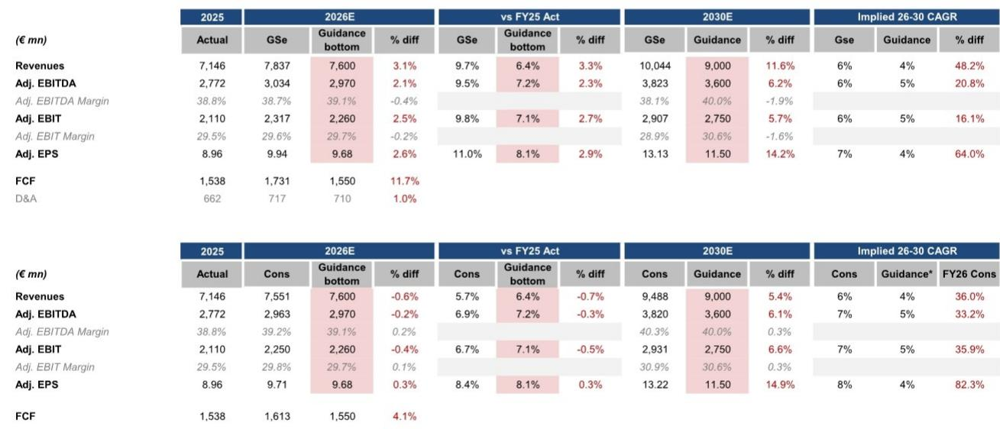
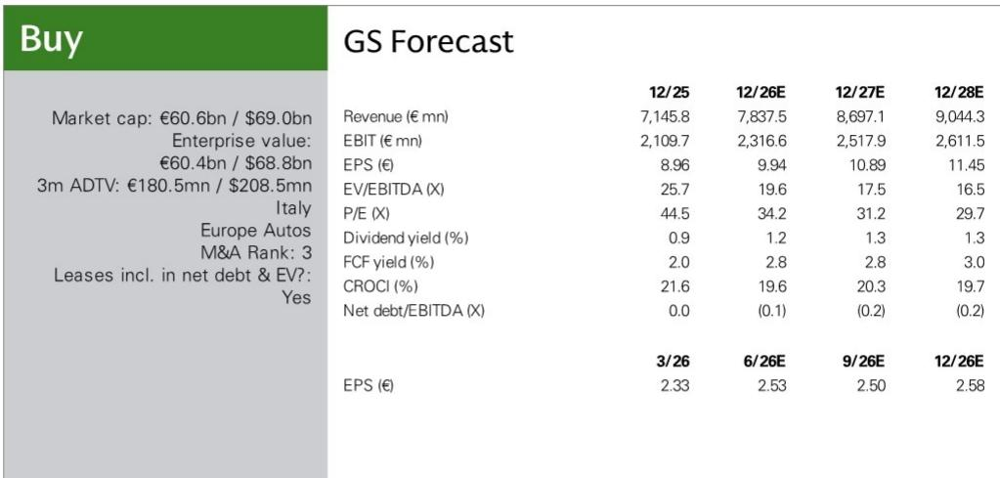
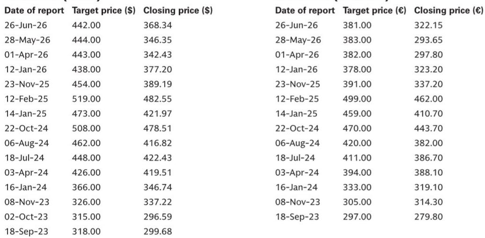

# 法拉利的个性化引擎：超越产量天花板的增长路径

法拉利于7月30日发布的2026年第二季度业绩，交出了一份超出预期的答卷。调整后EBIT达到6.05亿欧元，较市场一致预期高出6.3%；营收达到19.4亿欧元，超出预期4.3%。更值得关注的是业绩背后的驱动因素：交付量为3,366辆，较一致预期低1.9%，但公司仍在盈利层面实现了显著超越。这两个数字之间的落差，正是本期业绩的核心看点。

本季度的增长引擎来自个性化定制业务。法拉利披露的个性化定制率为20%，高于18%的中期指引水平，为价格组合贡献了1.22亿欧元的增量收益，而卖方此前模型假设为8,200万欧元。这一表现并非偶然。公司已将2026全年营收指引上调至76.0亿欧元，调整后EBIT不低于22.6亿欧元，工业自由现金流不低于15.5亿欧元。即便经过此次上调，新指引仍低于部分更为乐观的分析师预测，表明管理层依然留有空间。

目前，法拉利的订单已经覆盖2027年全年。这一事实本身，就足以重新定义市场对法拉利增长轨迹的理解。公司并非在简单地销售汽车，而是在一份排至18个月之后的等候名单上，对稀缺产品进行分配。战略问题已不再是法拉利能否维持需求，而是能否在不损害其稀缺性定位的前提下，持续将需求转化为利润。

## 产量与利润的脱钩：法拉利的新常态

对于大多数汽车制造商而言，交付量低于预期1.9%往往会引发一连串的盈利预测下调。法拉利本季度的表现则颠覆了这一逻辑。尽管交付量不及预期，公司调整后EBIT利润率仍扩大至31.2%，同比提升60个基点，较一致预期高出40个基点。其机制并不复杂：当一个品牌拥有如此量级的定价权时，产量便成为次要变量。

本季度1.22亿欧元的价格组合贡献，意味着仅凭组合与定价因素便实现了6.3%的营收提升。作为参照，法拉利总营收同比增长9.7%，其中超过一半的增长并非来自销售更多汽车，而是来自以更多选装、更多定制内容以及更高规格版本销售同样的汽车。这便是个性化定制的飞轮效应：每一位选择定制内饰、特殊车漆或独特碳纤维套件的客户，都能以接近全边际的利润率带来增量营收。

这一模式的可持续性依托于订单储备。在2027年已被完全覆盖的情况下，法拉利拥有多年的可见度，可以在不必担心产能闲置的前提下，将产品组合向更高利润率的方向引导。296 Versione Speciale与F80超级跑车均将于2026年下半年进入爬坡期，预计将进一步加速这一组合优化进程。第二季度特别系列占比略低于预期，但指引上调表明管理层预计下半年将出现显著提升。

对观察者而言，这意味着法拉利的盈利能力正日益与汽车行业周期脱钩。一家能够在产量不及预期的情况下依然超越盈利预期的公司，实际上已经对行业首要风险因素形成了免疫。曾困扰其他奢侈品牌的残值担忧，对法拉利而言属于次要问题，因为其稀缺性模式保护了存量产品的价值。

## 指引上调是信号，而非事件本身

法拉利上调后的2026年指引，相对于卖方更为乐观的预测仍显保守。公司目前预期营收为76.0亿欧元，而最乐观的分析师模型为78.4亿欧元。调整后EBIT指引不低于22.6亿欧元，与市场一致预期的22.5亿欧元及卖方估计的23.2亿欧元相比仍有差距。指引与预测区间上沿之间的空间，正是机会所在。

这一模式并不陌生。法拉利历来倾向于设定一个能够超越的指引水平，随后在年内逐步上调。上半年表现已表明，全年数据将落在最初指引区间上沿或以上。随着F80与296 Versione Speciale在第三季度进入爬坡期，且个性化定制率持续高于中期目标，再次上调的条件已经具备。

更具意义的是指引所隐含的长期增长逻辑。法拉利在资本市场日设定了2030年前营收复合年增长率5%的目标。上调后的2026年指引所隐含的增速高于该水平，卖方将此解读为5%目标更可能是下限而非上限。这是一个微妙但重要的叙事转变：法拉利不再是一家需要以5%增速来达成目标的公司，而是一家很可能超越该水平的公司，5%的数字更多充当读者预期的下行保护机制。

不低于15.5亿欧元的自由现金流指引同样偏于保守。卖方模型为17.3亿欧元，而上半年在营运资本拖累下已实现2.76亿欧元工业自由现金流。指引与卖方数字之间的差距，反映的是管理层在时间节奏上的一贯审慎，而非现金创造能力的弱化。本季度资本开支低于预期，也支持了法拉利能够以较高比率将盈利增长转化为现金的判断。

## 个性化定制率：豪华汽车领域最被低估的指标

第二季度20%的个性化定制率，值得获得比目前更多的关注。管理层此前给出的中期平均指引为18%，言下之意是随着特别系列与入门级车型组合的波动，部分季度可能低于该水平。然而，法拉利实际交出的季度表现，比结构性目标高出了整整两个百分点。

个性化定制的运作机制值得拆解。当客户订购一辆法拉利时，基础车价仅仅是起点。平均而言，客户会在定制选项上花费可观的额外支出：定制车漆、内饰皮革、碳纤维饰件以及其他个性化配置。这些选项的毛利率显著高于基础车型，因为生产一套独特内饰或定制颜色的边际成本，仅占所收取价格的一小部分。

第二季度的结果表明，法拉利的客户群体越来越愿意在个性化定制上投入，而公司在引导这一行为方面也变得更加高效。正在爬坡的296 Versione Speciale天然适合个性化定制，因为它是一款限量版车型，吸引的是希望自己座驾独一无二的收藏家。而选装前价格已超过300万欧元的F80超级跑车，则将这一逻辑推向了另一个层次。

战略层面的含义在于，即便交付量保持平稳，法拉利的单车营收也很可能持续上升。公司给出的2030年前营收复合年增长率指引为5%，但如果个性化定制率持续高于中期目标，实际增速可能更高。这类期权价值难以建模，但在季度数据中正变得越来越清晰可见。

## 自由现金流的短期波动：时点问题，而非趋势恶化

本季度相对少见的瑕疵在于工业自由现金流的短期不及预期。法拉利实现工业自由现金流2.76亿欧元，较一致预期低1.9%，较卖方估计低4.4%。不及预期的原因在于营运资本与拨备的负向变动，其中库存积累是主要因素。资本开支略低于预期的2.36亿欧元，现金研发支出为2.67亿欧元，而估计值为2.55亿欧元。

营运资本拖累值得审视，因为它有机制性的解释。法拉利正在推进新车型的产能爬坡，这需要在交付之前建立库存。F80与296 Versione Speciale均处于早期生产阶段，相关零部件与原材料需要在整车发运之前完成采购。这是时点问题，而非结构性问题。

研发资本化率45.7%与估计值43%之间的差异，则是一个更为细致的观察点。更高的资本化率意味着更多研发支出被记为资产而非费用，这会对报告盈利产生正面影响。对利润表的贡献为4,900万欧元，而估计值为3,000万欧元。这并非警示信号，但提醒我们法拉利的报告盈利能力在一定程度上受到研发资本化会计选择的影响。

对于观察者而言，自由现金流的短期波动应放在全年指引的背景下看待。法拉利已将工业自由现金流指引上调至不低于15.5亿欧元，这意味着下半年需要显著加速。上半年已实现2.76亿欧元，下半年需产生超过12.7亿欧元方能达成指引。考虑到交付的季节性模式——第四季度占比历来较高——这一目标可以实现，但确实意味着营运资本拖累需要逆转。

## 解读法拉利季度业绩的决策框架

第二季度业绩为未来评估法拉利的季度表现提供了一个参考模板。第一层筛选是产量与价格组合的拆分。如果法拉利产量不及预期但价格组合超越预期，那么产量缺口并不重要，因为公司盈利能力由组合驱动而非产量驱动。第二层筛选是个性化定制率相对于18%中期目标的表现。持续高于20%的比率意味着单车营收轨迹正在加速。

第三层筛选是指引轨迹。法拉利通常在卖方预测已高于新数字时上调指引，这形成了支撑股价的连续上调模式。第四层筛选是自由现金流桥接。车型爬坡期间的营运资本波动属于正常现象，但转化率的持续恶化将是警示信号。第五层筛选是订单储备。只要订单覆盖范围延伸至当前年度之后，定价权与组合管理能力便保持完好。

将这一框架应用于第二季度：产量缺口无关紧要，个性化定制率高于目标，指引已上调且仍有进一步上调空间，自由现金流波动属于时点问题，订单储备覆盖2027年全年。结论清晰明确。在长期研究逻辑所关注的每一个维度上，本季度均呈现积极表现。

残值问题仍是需要持续关注的关键风险。法拉利的品牌价值最终锚定于其车型在二手市场的表现。公司已采取措施应对残值变化，尤其是在英国市场，近期英国与德国豪华车残值的回升是一个积极信号。但这是一个可能快速变化的变量，也是相对少见可能打破个性化飞轮的因素。如果残值走弱，客户在选装配置上的支出意愿可能趋于谨慎，因为这些配置未必能充分保留其价值。

就目前而言，证据表明法拉利已找到一条不依赖产量增长而实现利润增长的路径，这在汽车行业是最为稀缺的组合。公司能够在交付量低于预期的情况下上调指引、超越预期并维持两年的订单储备，这充分体现了其品牌实力与战略有效性。2026年下半年，随着F80与296 Versione Speciale进入爬坡期，这一轨迹能否延续将获得进一步的验证。

*仅供参考。部分内容可能基于原始材料由AI辅助生成、翻译、摘要或编辑，可能存在遗漏或错误。请独立核实。本文不构成投资、法律、税务、会计或其他专业建议。*

仅供参考。部分内容可能基于原始材料由AI辅助生成、翻译、摘要或编辑，可能存在遗漏或错误。请独立核实。本文不构成投资、法律、税务、会计或其他专业建议。

