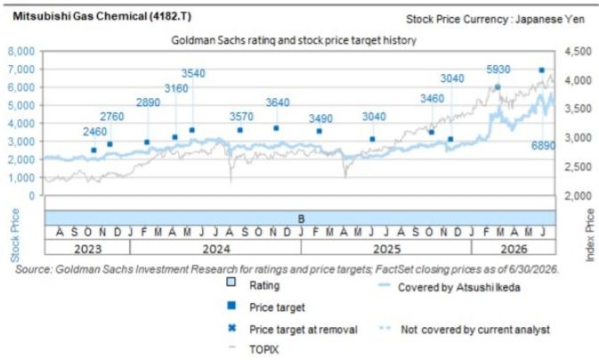
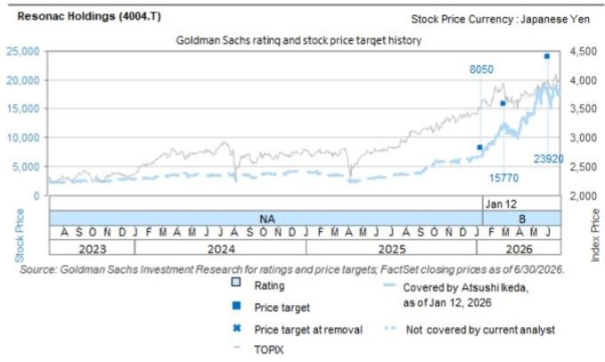
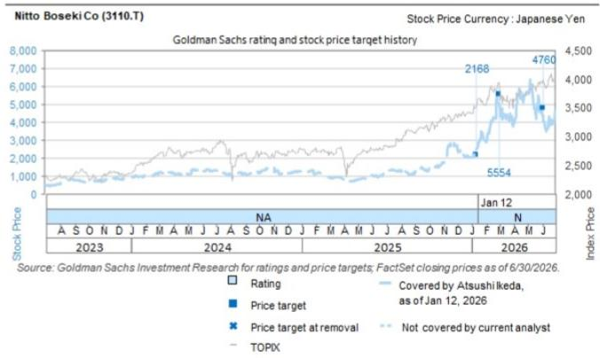

# 日本化学品行业：CCL贸易数据观察——4-6月出货金额同比增长41%，对三菱瓦斯化学、三井金属等公司具有积极参考意义

根据日本财务省2026年6月贸易统计，覆铜板（CCL）出货量同比增长15%，出货金额同比增长46%。从金额角度看，需求保持强劲态势。2026年4-6月季度总出货金额同比增长41%，环比增长12%，我们认为这对三菱瓦斯化学、Resonac以及三井金属、日东纺等关联公司具有广泛的积极参考意义。

我们推测，相关数据表现与三菱瓦斯化学的业绩指引（BT材料全年销售额增长15%）保持同步。三菱瓦斯化学在全球半导体封装基板用BT材料市场占据领先份额。同时，三井金属在超薄铜箔领域拥有较大份额，其MicroThin™产品上半年出货量展望为同比增长20%。

我们判断，这一趋势主要受到AI服务器（如NVIDIA下一代Rubin GPU）封装基板尺寸增Daiwa层数增加，以及LPDDR和e-SSD强劲需求的推动。我们维持此前观点，即CCL价格调整将从下半年开始逐步推进，并对相关公司保持积极看法，包括正在推进价格调整的三井金属，以及在供需关系偏紧的T玻璃布领域具有较强存在感的日东纺。

2026年6月，CCL出货量同比增长15%/环比增长15%，出货金额同比增长46%/环比增长16%，均处于较强水平。2026年4-6月季度出货金额达到327亿日元，较去年同期（232亿日元）显著增长41%。与上一季度（2026年1-3月，293亿日元）相比，环比增长12%。此外，考虑到三菱瓦斯化学于2025年12月投产的新泰国工厂（总产能增加50%）可能带动泰国出货量增长，我们认为全球CCL需求的韧性可以得到进一步验证。

池田敦
+81(3)4587-9940 |
atsushi.ikeda@gs.com
GS Japan Co., Ltd.

泉川百合
+81(3)4587-3643 |
yuri.x.izumikawa@gs.com
GS Japan Co., Ltd.

图表1：CCL出口量与出口金额月度趋势

资料来源：日本财务省、彭博

## 目标价格风险与方法论——三菱瓦斯化学

我们对三菱瓦斯化学给予积极评级，12个月目标价格为6,890日元。目标价格基于材料板块EV/GCI与FY3/28E CROCI/WACC相关性（板块现金回报倍数0.75倍，较板块平均溢价5%）。

主要风险：智能手机镜头用特种树脂和半导体封装基板材料领域竞争加剧、日元升值、甲醇及其他市场敏感产品价格下行。

## 目标价格风险与方法论——Resonac

我们对Resonac给予积极评级，12个月目标价格为23,920日元。目标价格基于材料板块EV/GCI与FY12/27E CROCI/WACC相关性（现金回报倍数0.7倍，较板块平均溢价30%）。主要风险包括半导体需求变化、日元升值以及石墨电极盈利下行。

## 目标价格风险与方法论——三井金属

我们对三井金属给予积极评级，12个月目标价格为62,600日元。目标价格基于材料板块EV/GCI与FY3/28E CROCI/WACC预测的相关性（现金回报倍数0.7倍，较板块平均溢价60%）。主要风险包括AI服务器需求变化、日元升值以及锌和其他金属价格下行。

## 目标价格风险与方法论——日东纺

我们对日东纺给予积极评级，12个月目标价格为4,820日元。目标价格基于材料板块EV/GCI与FY3/28E CROCI/WACC预测的相关性（现金回报倍数0.7倍，较板块平均溢价60%）。主要风险包括半导体需求波动、汇率波动以及特种玻璃竞争格局变化。

## 披露附录

## Reg AC

我们，池田敦和泉川百合，特此证明本报告中表达的所有观点准确反映了我们对相关公司及其证券的个人观点。我们还证明，我们的薪酬中没有任何部分直接或间接与本报告中表达的具体建议或观点相关。

除非另有说明，本报告封面上列出的个人均为GS全球投资研究部门的分析师。

供稿作者：池田敦 GS Japan Co., Ltd.，泉川百合 GS Japan Co., Ltd.。

除非另有说明，本报告供稿作者披露中列出的个人均为GS全球投资研究部门的分析师。

## GS因子概况

GS因子概况通过将股票的关键属性与市场（即我们的评级股票范围）及其行业同行进行比较，为股票提供投资背景参考。所描绘的四个关键属性为：成长性、财务回报、倍数（如估值）和综合（成长性、财务回报和倍数的复合指标）。成长性、财务回报和倍数通过使用每只股票特定指标的标准化排名计算得出。各指标的标准化排名随后取平均值并转换为相关属性的百分位数。每个指标的具体计算可能因财年、行业和地区而异，但标准方法如下：

成长性基于股票的前瞻性销售增长、EBITDA增长和EPS增长（对于金融类股票，仅EPS和销售增长），百分位数越高表示成长性越强。财务回报基于股票的前瞻性ROE、ROCE和CROCI（对于金融类股票，仅ROE），百分位数越高表示财务回报越高。倍数基于股票的前瞻性P/E、P/B、价格/股息（P/D）、EV/EBITDA、EV/FCF和EV/债务调整后现金流（DACF）（对于金融类股票，仅P/E、P/B和P/D），百分位数越高表示股票交易倍数越高。综合百分位数计算为成长性百分位数、财务回报百分位数和（100% - 倍数百分位数）的平均值。

财务回报和倍数使用GS分析师在至少三个季度后的财年末预测。成长性使用至少七个季度后的财年输入，与至少三个季度后的财年进行比较（所有指标均按每股基础计算）。

有关我们如何计算GS因子概况的更详细说明，请联系您的GS代表。

## M&A排名

在我们的全球覆盖范围内，我们使用M&A框架审视股票，综合考虑定性因素和定量因素（可能因行业和地区而异），以纳入某些公司可能被收购的潜在可能性。然后我们分配一个M&A排名，作为对我们评级覆盖下的公司进行评分的工具，范围从1到3，其中1表示公司成为收购目标的可能性较高（30%-50%），2表示中等可能性（15%-30%），3表示较低可能性（0%-15%）。对于排名为1或2的公司，按照我们标准部门指引，我们将M&A组成部分纳入目标价格。M&A排名为3的公司被视为不重要，因此不计入目标价格，可能在研究中讨论也可能不讨论。

## Quantum

Quantum是GS的专有数据库，提供详细的财务报表历史、预测和比率访问。它可用于对单一公司进行深入分析，或在不同行业和市场的公司之间进行比较。

## 披露

## 财务顾问披露

GS和/或其关联公司正在就一项已公布的战略事项担任以下公司或其关联公司的财务顾问：RESONAC HOLDINGS CORPORATION

三菱瓦斯化学、三井金属、日东纺和Resonac Holdings的评级相对于其覆盖范围内的其他公司：旭化成、大赛璐、Denka、不二越、JX先进金属、可乐丽、三菱瓦斯化学、三井化学、三井金属、日本涂料控股、日东纺、Resonac Holdings、SUMCO、信越化学、东京应化工业、东丽、Tri化学实验室、Zeon

## 公司特定监管披露

以下披露涉及GS集团（及其关联公司，"GS"）与GS全球投资研究覆盖的公司之间的关系。

截至本报告前一个月末，GS实益拥有以下公司普通股1%或以上（不包括根据美国证券法无需汇总的关联公司和业务部门管理的头寸）：三菱瓦斯化学（3,820日元）、三井金属（25,665日元）、日东纺（2,622日元）和Resonac Holdings（12,245日元）

GS预计在未来3个月内收取或寻求收取投资银行服务报酬：三菱瓦斯化学（3,820日元）和Resonac Holdings（12,245日元）

GS在过去12个月内与以下公司存在投资银行服务客户关系：三菱瓦斯化学（3,820日元）和Resonac Holdings（12,245日元）

GS在过去12个月内与以下公司存在非投资银行证券相关服务客户关系：Resonac Holdings（12,245日元）

GS在过去12个月内与以下公司存在非证券服务客户关系：三井金属（25,665日元）和Resonac Holdings（12,245日元）

## 评级/投资银行关系分布

GS投资研究全球股票覆盖范围

<table><tr><td colspan="3">评级分布</td></tr><tr><td>买入</td><td>持有</td><td>卖出</td></tr><tr><td>50%</td><td>34%</td><td>16%</td></tr></table>

<table><tr><td colspan="3">投资银行关系</td></tr><tr><td>买入</td><td>持有</td><td>卖出</td></tr><tr><td>65%</td><td>59%</td><td>43%</td></tr></table>

截至2026年7月1日，GS全球投资研究对3,104只股票进行了投资评级。GS将股票分配为各地区投资清单上的买入和卖出；未如此分配的股票被视为中性。此类分配等同于FINRA规则要求的上述披露中的买入、持有和卖出。参见下文"评级、覆盖范围和相关定义"。投资银行关系图表反映了GS在过去十二个月内为每个评级类别中的标公司提供投资银行服务的百分比。

## 目标价格和评级历史图表

所示目标价格应结合GS此前所有已发布研究报告（可能包含也可能不包含目标价格）以及公司、行业和金融市场的发展情况来考虑。

所示目标价格应结合GS此前所有已发布研究报告（可能包含也可能不包含目标价格）以及公司、行业和金融市场的发展情况来考虑。

所示目标价格应结合GS此前所有已发布研究报告（可能包含也可能不包含目标价格）以及公司、行业和金融市场的发展情况来考虑。

所示目标价格应结合GS此前所有已发布研究报告（可能包含也可能不包含目标价格）以及公司、行业和金融市场的发展情况来考虑。

## 目标价格历史表格

## 三菱瓦斯化学（4182.T）

<table><tr><td>报告日期</td><td>目标价格（日元）</td><td>收盘价（日元）</td></tr><tr><td>2026年6月5日</td><td>6,890</td><td>5,180</td></tr><tr><td>2026年3月1日</td><td>5,930</td><td>4,364</td></tr><tr><td>2025年11月21日</td><td>3,040</td><td>2,537</td></tr><tr><td>2025年10月10日</td><td>3,460</td><td>2,706</td></tr><tr><td>2025年6月6日</td><td>3,040</td><td>2,181</td></tr><tr><td>2025年2月13日</td><td>3,490</td><td>2,724</td></tr><tr><td>2024年11月13日</td><td>3,640</td><td>2,795</td></tr><tr><td>2024年8月28日</td><td>3,570</td><td>2,687</td></tr><tr><td>2024年5月17日</td><td>3,540</td><td>3,020</td></tr><tr><td>2024年4月10日</td><td>3,160</td><td>2,752</td></tr><tr><td>2024年2月9日</td><td>2,890</td><td>2,316</td></tr><tr><td>2023年11月23日</td><td>2,760</td><td>2,264</td></tr><tr><td>2023年10月19日</td><td>2,460</td><td>2,018</td></tr></table>

## Resonac Holdings（4004.T）

<table><tr><td>报告日期</td><td>目标价格（日元）</td><td>收盘价（日元）</td></tr><tr><td>2026年6月5日</td><td>23,920</td><td>17,315</td></tr><tr><td>2026年3月1日</td><td>15,770</td><td>11,930</td></tr><tr><td>2026年1月12日</td><td>8,050</td><td>6,810</td></tr></table>

<table><tr><td colspan="3">三井金属（5706.T）</td><td colspan="3">日东纺（3110.T）</td></tr><tr><td>报告日期</td><td>目标价格（日元）</td><td>收盘价（日元）</td><td>报告日期</td><td>目标价格（日元）</td><td>收盘价（日元）</td></tr><tr><td>2026年6月5日</td><td>62,600</td><td>44,490</td><td>2026年7月6日</td><td>4,820</td><td>3,515</td></tr><tr><td>2026年3月1日</td><td>44,100</td><td>36,910</td><td>2026年6月5日</td><td>23,800</td><td>4,050</td></tr><tr><td>2026年1月12日</td><td>24,000</td><td>19,900</td><td>2026年3月1日</td><td>27,770</td><td>5,040</td></tr><tr><td></td><td></td><td></td><td>2026年1月12日</td><td>10,840</td><td>2,508</td></tr></table>

表格中所示目标价格未针对公司行为进行调整。

## 监管披露

## 美国法律法规要求的披露

参见上文公司特定监管披露，了解本报告中提及公司所需的以下任何披露：待处理交易中的主承销商或联合主承销商；1%或其他所有权；某些服务的报酬；客户关系类型；以前期间的承销公开发行；董事职位；对于股票证券，做市和/或专家角色。GS作为主体交易或可能交易本报告中讨论的发行人债务证券（或相关衍生品）。

以下为额外要求的披露：所有权和重大利益冲突：GS政策禁止其分析师、向分析师汇报的专业人员及其家庭成员持有分析师覆盖范围内任何公司的证券。分析师薪酬：分析师薪酬部分基于GS的盈利能力，其中包括投资银行收入。分析师作为高管或董事：GS政策通常禁止其分析师、向分析师汇报的人员或其家庭成员在分析师覆盖范围内的任何公司担任高管、董事或顾问。非美国分析师：非美国分析师可能不是GS & Co. LLC的关联人员，因此可能不受FINRA规则2241或FINRA规则2242关于与标的公司沟通、公开露面以及交易所覆盖证券的限制。

## 美国以外司法管辖区法律和法规要求的额外披露

以下披露为指定司法管辖区要求的披露，除非已根据美国法律法规在上文作出。澳大利亚：GS Australia Pty Ltd及其关联公司不是澳大利亚的授权存款机构（该术语在1959年银行法（联邦）中定义），不提供银行服务，也不在澳大利亚开展银行业务。本研究及其访问权限仅面向《澳大利亚公司法》定义的"批发客户"，除非GS另有约定。在编制研究报告时，GS Australia全球投资研究成员可能参加由其研究报告标的公司和实体主办或组织的实地考察和会议。在某些情况下，如果GS Australia认为在实地考察或会议的具体情况下适当且合理，此类实地考察或会议的费用可能部分或全部由发行人承担。如果本文件内容包含任何金融产品建议，则仅为一般性建议，由GS在未考虑客户目标、财务状况或需求的情况下编制。客户在根据任何此类建议采取行动前，应考虑该建议相对于自身目标、财务状况和需求的适当性。GS Australia和New Zealand的某些利益披露副本以及GS澳大利亚卖方研究独立性政策声明副本可在以下网址获取：https://www.goldmansachs.com/disclosures/australia-new-zealand/index.html。巴西：有关CVM第20号决议的披露信息可在https://www.gs.com/worldwide/brazil/area/gir/index.html获取。在适用情况下，根据CVM第20号决议第20条定义，本研究报告内容的主要负责巴西注册分析师为本报告开头指定的第一作者，除非文末另有说明。加拿大：此信息仅供您参考，不构成且在任何情况下均不应被解释为GS & Co. LLC为在加拿大购买证券的客户买卖任何加拿大证券的广告、要约或招揽。GS & Co. LLC未在加拿大任何司法管辖区注册为适用加拿大证券法下的交易商，通常不被允许交易加拿大证券，并可能被禁止在加拿大的某些司法管辖区出售某些证券和产品。如果您希望在加拿大交易任何加拿大证券或其他产品，请联系GS Group Inc.的关联公司GS Canada Inc.或另一家注册加拿大交易商。香港：可应要求从GS (Asia) L.L.C.获取本研究中提及的所覆盖公司证券的进一步信息。印度：可从GS (India) Securities Private Limited获取本研究中提及的标的公司的进一步信息，研究分析师– SEBI注册号INH000001493，地址：10th Floor, Ascent-Worli, Sudam Kalu Ahire Marg, Worli, Mumbai-400 025, India，公司识别号U74140MH2006FTC160634，电话+91 22 6616 9000，传真+91 22 6616 9001。GS可能实益拥有本研究报告提及的标的公司1%或以上的证券（该术语在1956年印度证券合约（监管）法第2(h)条中定义）。SEBI的注册和NISM的认证不以任何方式保证中介机构的业绩或向读者提供回报保证。GS (India) Securities Private Limited的合规官和读者投诉联系详情、年度合规审计报告副本以及其他相关信息和披露可在以下链接找到：

https://www.goldmansachs.com/worldwide/india/research-analyst。日本：见下文。韩国：本研究及其访问权限仅面向《金融服务和资本市场法》定义的"专业读者"，除非GS另有约定。可从GS (Asia) L.L.C.首尔分行获取本研究中提及的标的公司的进一步信息。新西兰：GS New Zealand Limited及其关联公司不是新西兰的"注册银行"或"存款接受者"（定义见1989年新西兰储备银行法）。本研究及其访问权限面向《2008年金融顾问法》定义的"批发客户"，除非GS另有约定。GS Australia和New Zealand的某些利益披露副本可在以下网址获取：https://www.goldmansachs.com/disclosures/australia-new-zealand/index.html。俄罗斯：在俄罗斯联邦分发的研究报告不是俄罗斯立法定义的广告，而是信息和分析，不以产品推广为主要目的，不提供俄罗斯评估立法意义上的评估。研究报告不构成俄罗斯法律法规定义的个人化研究交流，不针对特定客户，且未分析客户的财务状况、投资概况或风险概况。GS不对客户或任何其他人基于本研究报告可能做出的任何投资决策承担责任。新加坡：GS (Singapore) Pte.（公司编号：198602165W），受新加坡金融管理局监管，对本研究承担法律责任，如有任何与本研究报告相关的事宜，请联系该公司。台湾：本材料仅供参考，未经许可不得转载。读者应仔细考虑自身的投资风险。投资结果由个人读者自行承担。英国：在英国将被归类为零售客户的个人（该术语定义见金融行为监管局规则）应结合GS此前关于本报告所提及公司的研究报告阅读本研究，并应参阅GS International已发送给他们的风险警告。这些风险警告的副本以及本报告中使用的某些金融术语词汇表可应要求从GS International获取。

欧盟和英国：关于欧洲委员会授权条例（EU）（2016/958）第6(2)条的披露信息（补充欧洲议会和理事会条例（EU）No 596/2014，包括该授权条例在英国退出欧盟和欧洲经济区后转化为英国国内法律和法规的情况），涉及研究交流或其他建议或暗示投资策略的信息的客观呈现技术安排以及特定利益或利益冲突迹象的披露，可在https://www.gs.com/disclosures/europeanpolicy.html获取，该页面陈述了与投资研究相关的利益冲突管理欧洲政策。

日本：GS Japan Co., Ltd.是在关东财务局注册的金融工具交易商，注册号Kinsho 69，是日本证券业协会、日本金融期货协会、日本第二类金融工具交易商协会和日本投资管理协会的会员。股票买卖需支付与客户预先确定的佣金加消费税。有关日本证券交易所、日本证券业协会或日本证券金融公司要求的任何适用披露，请参见公司特定披露。

## 评级、覆盖范围和相关定义

买入（B）、中性（N）、卖出（S）分析师建议将股票作为买入或卖出纳入各地区投资清单。被分配为投资清单上的买入或卖出取决于股票相对于其覆盖范围的总回报潜力。任何未被分配为投资清单上买入或卖出且具有有效评级（即未被暂停评级、未评级、早期生物科技、暂停覆盖或未覆盖的股票）的股票被视为中性。每个地区管理区域信念清单，该清单从各自地区投资清单上的报告评级股票中选出，代表侧重于总回报潜力大小和/或在其各自覆盖范围内实现回报可能性的研究交流。此类信念清单中股票的添加或移除由各地区的投资审查委员会或其他指定委员会管理，不构成分析师对此类股票投资评级的变更。

总回报潜力代表当前股价与目标价格之间的上行或下行差异，包括在目标价格相关时间范围内预期支付或预计的所有股息。所有覆盖股票均需设定目标价格。总回报潜力、目标价格和相关时间范围在每份添加或重申投资清单成员资格的报告中有说明。

覆盖范围：每个覆盖范围的所有股票列表可按首席分析师、股票和覆盖范围在https://www.gs.com/research/hedge.html获取。

未评级（NR）。当GS在涉及该公司的合并或战略交易中担任顾问角色、由于GS参与交易而存在法律、监管或政策限制，以及在某些其他情况下，投资评级、目标价格和盈利预测（如适用）将根据GS政策移除。早期生物科技（ES）。当该公司既没有通过II期临床试验的药物、治疗或医疗设备，也没有分销后II期药物、治疗或医疗设备的许可时，根据GS政策不分配投资评级和目标价格。评级暂停（RS）。GS已暂停该股票的投资评级和目标价格，因为没有足够的基本面基础来确定投资评级或目标价格。先前的投资评级和目标价格（如有）不再对该股票有效，不应依赖。覆盖暂停（CS）。GS已暂停对该公司的覆盖。未覆盖（NC）。GS不覆盖该公司。

## 全球产品；分发实体

GS全球投资研究在全球范围内为GS客户制作和分发研究产品。GS全球各办事处的分析师对行业和公司以及宏观经济、货币、大宗商品和投资组合策略进行研究。本研究由以下机构分发：澳大利亚由GS Australia Pty Ltd（ABN 21 006 797 897）；巴西由GS do Brasil Corretora de Títulos e Valores Mobiliários S.A.；GS巴西公共沟通渠道：0800 727 5764和/或contatogoldmanbrasil@gs.com。工作日（节假日除外），上午9点至下午6点。Canal de Comunicação com o Público GS Brasil: 0800 727 5764 e/ou contatogoldmanbrasil@gs.com. Horário de funcionamento: segunda-feira à sexta-feira (exceto feriados), das 9h às 18h；加拿大由GS & Co. LLC；香港由GS (Asia) L.L.C.；印度由GS (India) Securities Private Ltd.；日本由GS Japan Co., Ltd.；韩国由GS (Asia) L.L.C.首尔分行；新西兰由GS New Zealand Limited；俄罗斯由OOO GS；新加坡由GS (Singapore) Pte.（公司编号：198602165W）；美国由GS & Co. LLC。GS International已批准本研究在英国的分发。

GS International（"GSI"），由审慎监管局（"PRA"）授权并由金融行为监管局（"FCA"）和PRA监管，已批准本研究在英国的分发。

欧洲经济区：GS Bank Europe SE（"GSBE"）是一家在德国注册的信贷机构，在单一监管机制下受欧洲中央银行直接审慎监管，在其他方面受德国联邦金融服务监管局（Bundesanstalt für Finanzdienstleistungsaufsicht，BaFin）和德意志联邦银行监管，并在欧洲经济区内分发研究。

## 一般披露

本研究仅供我们的客户使用。除与GS相关的披露外，本研究基于我们认为可靠的当前公开信息，但我们不声明其准确或完整，也不应依赖。本文包含的信息、意见、估计和预测截至本报告日期，如有变更恕不另行通知。我们寻求在适当情况下更新我们的研究，但各种法规可能阻止我们这样做。除某些定期发布的行业报告外，大多数报告根据分析师的判断不定期发布。

GS开展全球全方位服务的综合投资银行、投资管理和经纪业务。我们与全球投资研究覆盖的相当大比例的公司存在投资银行和其他业务关系。GS & Co. LLC是美国经纪交易商，是SIPC成员（https://www.sipc.org）。

我们的销售人员、交易员和其他专业人员可能向我们的客户和主要交易部门提供与本研究中表达的意见相反的口头或书面市场评论或交易策略。我们的资产管理、主要交易部门和投资业务可能做出与本研究中表达的建议或观点不一致的投资决策。

本报告中指定的分析师可能不时与我们的客户（包括GS销售人员和交易员）讨论，或可能在本报告中讨论交易策略，这些策略涉及可能对本报告讨论的股票证券市场价格产生近期影响的催化剂或事件，该影响可能与分析师对此类股票公布的的目标价格预期方向相反。任何此类交易策略均不同于分析师的此类股票基本面股票评级，该评级反映股票相对于其覆盖范围的总回报潜力，如本文所述。

我们和我们的关联公司、高级管理人员、董事和员工将不时持有多头或空头头寸，作为主体参与，并买入或卖出本研究中提及的证券或衍生品（如有），除非法规或GS政策另有禁止。

在GS安排的会议上归因于第三方演讲者的观点，包括来自GS其他部门的个人，不一定反映全球投资研究的观点，也不是GS的官方观点。

本文引用的任何第三方，包括任何销售人员、交易员和其他专业人员或其家庭成员，可能持有与本报告指定分析师表达的观点不一致的所提及产品的头寸。

本研究不构成在任何司法管辖区出售任何证券的要约或招揽购买任何证券的要约，在该等要约或招揽将是非法的。它不构成个人建议，也不考虑个别客户的具体投资目标、财务状况或需求。客户应考虑本研究中的任何建议或推荐是否适合其特定情况，并在适当时寻求专业建议，包括税务建议。本研究中提及的投资的价格和价值及其收入可能会波动。过往表现并非未来表现的指引，未来回报不保证，可能发生原始资本损失。汇率波动可能对某些投资的价值或价格或收入产生不利影响。

某些交易，包括涉及期货、期权和其他衍生品的交易，会产生重大风险，不适合所有读者。读者应查看当前期权和期货披露文件，可从GS销售代表或https://www.theocc.com/about/publications/character-risks.jsp和https://www.goldmansachs.com/disclosures/cftc_fcm_disclosures获取。期权策略（如价差）涉及多次买入和卖出期权，交易成本可能很高。支持文件将应要求提供。

全球投资研究提供的不同服务级别：GS全球投资研究向您提供的服务级别和类型可能与向GS内部和其他外部客户提供的服务不同，取决于各种因素，包括您对沟通频率和方式的个人偏好、您的风险概况和投资重点及视角（如市场范围、行业特定、长期、短期）、您与GS整体客户关系的规模和范围，以及法律和监管限制。例如，某些客户可能要求在特定证券研究发布时收到通知，某些客户可能要求我们内部客户网站上提供的分析师基本面分析特定数据通过数据源或其他方式以电子方式传送给他们。分析师基本面研究观点的任何变更（如评级、目标价格或股票盈利预测的重大变更）不会在任何客户之前传达，而是在研究报告通过电子方式广泛分发到我们内部客户网站或通过其他必要方式分发给所有有权接收此类报告的客户之前。

所有研究报告同时通过电子方式发布到我们内部客户网站，分发给所有客户。并非所有研究内容都重新分发给我们的客户或提供给第三方聚合商，GS也不对第三方聚合商重新分发我们的研究负责。有关一个或多个证券、市场或资产类别（包括相关服务）的研究、模型或其他数据，请联系您的GS代表或访问https://research.gs.com。

披露信息也可在https://www.gs.com/research/hedge.html或联系Research Compliance，200 West Street, New York, NY 10282获取。

## © 2026 GS。

您被允许存储、展示、分析、修改、重新格式化并打印通过此服务提供的信息，仅供您自己使用。未经GS明确书面同意，您不得转售或逆向工程此信息以计算或开发任何指数用于披露和/或营销，或创建任何其他衍生作品或商业产品、数据或产品。未经GS明确书面同意，您不得以任何格式向任何第三方发布、传输或以其他方式复制此信息（全部或部分）。前述限制包括但不限于使用、提取、下载或检索此信息（全部或部分）来训练或微调机器学习或人工智能系统，或作为任何此类系统的提示或输入提供或复制此信息（全部或部分）。
