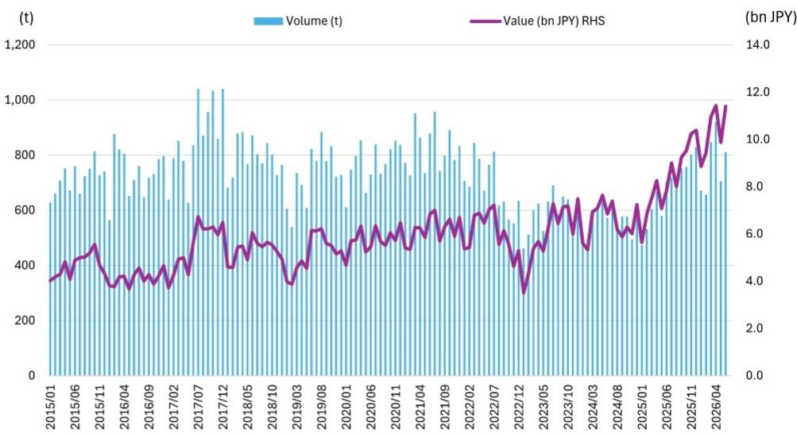
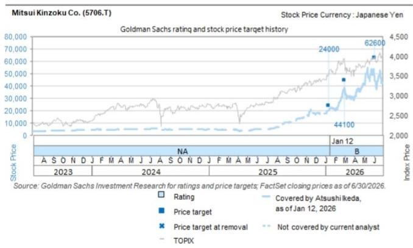

# 日本CCL出口增长：不只是AI库存故事，更指向封装基板材料的结构性变化

日本财务省2026年6月贸易数据显示，铜箔基板（CCL）出货值同比增长46%，为2026财年第一季度画上句号——该季度同比扩张41%，环比增长12%。这并非周期性的短期波动。出货量同比增长15%，揭示了更重要的信息：行业实际出货量在显著增加，而单位价值差距则表明产品组合正向高阶层数、高附加值板材迁移，这类产品在定价上具有结构性优势。对于关注三菱瓦斯化学、Resonac、三井金属和日东纺的观察者而言，这些数据确认了AI服务器建设已从概念叙事进入实际贸易统计层面。

其意义不止于表面的增长率。日本CCL出口是全球半导体封装供应链的先行指标，4月至6月季度的持续加速表明需求曲线正在变陡，而非趋平。在同比扩张41%的基础上，环比再增12%，指向订单管道仍在积蓄动能而非见顶。对本报告覆盖的四家标的而言，其传导路径直接：它们在AI服务器周期加速前设定的全年指引，如今看来偏于保守。

这批数据尤为值得关注的是增长的构成。15%的出货量增幅与46%的出货值增幅之间的差距，并非通胀或汇率因素——而是产品组合信号。市场正在吸纳更多面向AI服务器封装基板的高阶、高阶层数CCL产品，其定价与大宗板材有本质区别。这正是推动本财年下半年利润率扩张的机制，且已在贸易统计中有所显现。

## 量价背离揭示向AI级材料的组合迁移，大宗厂商难以复制

6月数据中，出货量增长（15%）与出货值增长（46%）之间31个百分点的差距，是本次发布中最具信息量的指标。在成熟的大宗商品市场中，价值与数量通常同步变动，差距仅在几个百分点以内，反映定价稳定或温和通胀。如此幅度的背离说明出货产品构成正在快速变化——且方向是材料谱系的高端。

这正是AI服务器周期应当产生的效应。新一代GPU和加速器需要物理尺寸更大、层数更多、电性能容差更严的封装基板。每一项要求都会增加单块基板的CCL材料用量，更重要的是，将需求推向定价显著更高的高端等级。因此，46%的出货值增长不仅是出货量增加的结果，更反映了出货产品本身的结构性升级。

对供应链而言，含义清晰：在高端CCL产能上有所布局的企业——尤其是半导体封装基板用BT材料及超薄铜箔领域——有望在这一周期中获取不成比例的价值。三菱瓦斯化学在全球BT材料市场占据领先份额，三井金属在超薄铜箔领域拥有较大份额，它们是直接受益者。其产品组合恰好契合AI服务器封装所需的规格，而贸易数据表明对这些规格的需求正在加速。

## 三菱瓦斯化学BT材料业务领先指引，泰国新增产能解除主要约束

三菱瓦斯化学对BT材料的全年指引假设销售增长15%。4月至6月的CCL出货数据与BT材料需求高度相关，表明实际表现可能领先于该节奏。该公司在半导体封装基板用BT材料领域的主导地位，意味着其命运与封装基板建设直接挂钩，而贸易统计显示这一建设正在加速。

更具深远意义的是三菱瓦斯化学泰国新工厂于2025年12月投产，总产能增加50%。这一产能投放的时点与需求上升的节奏高度契合。贸易数据显示来自泰国的出货量可能正在增加，这意味着公司不仅在承接需求增长，而且是借助新的、可能更高效的产能来实现。这种双重效应——更高的出货量和改善的成本结构——应在本财年下半年放大利润率表现。

泰国扩产的策略意义不止于三菱瓦斯化学自身的财务表现。它代表了半导体材料供应链在地理布局上的有意多元化，将生产向东南亚组装与测试枢纽靠拢，这些枢纽在全球芯片封装生态系统中日益重要。对于观察者而言，这降低了日本材料行业历来存在的集中风险——过去单一国内工厂可能成为瓶颈。如今产能已就位，可以在不重演以往上行周期供应约束的情况下服务AI周期。

## 三井金属超薄铜箔与日东纺T玻璃布：基板复杂度趋势的次级受益者

AI服务器封装趋势并非只惠及基板材料生产商。它沿供应链向下传导至那些支撑更高层数和更大基板尺寸的组件材料。三井金属的MicroThin超薄铜箔便是此类组件，公司上半年出货量同比增长20%的展望表明其正直接受益于复杂度趋势。

超薄铜箔是高密度互连基板的关键支撑材料。随着层数增加和线宽收窄，铜箔必须在保持电气完整性的同时变得更薄。这是一个技术门槛高、进入壁垒大的产品类别，这也是三井金属较大市场份额能够转化为定价能力的原因。报告指出三井金属在提价方面已取得进展，表明超薄铜箔的供需关系正在趋紧——这一动态应在出货量增长的同时支撑利润率扩张。

日东纺则凭借T玻璃布占据互补性细分位置。T玻璃布是一种增强材料，为大型、高阶层数基板提供所需的尺寸稳定性。报告指出T玻璃布供需偏紧，这是基板尺寸增大的直接结果。更大的基板需要更多玻璃布，而T玻璃布的特殊性——相对于标准E玻璃——限制了合格供应商的范围。这种偏紧状态应能支撑整个周期的定价，也解释了为何日东纺的现金回报倍数较行业平均有60%的溢价。

## 定价权叙事正从数量驱动转向价格驱动，下半年动能应确认拐点

本报告的核心论点——CCL提价将从下半年起获得动能——建立在供需计算之上，而贸易数据现已为此提供支撑。财年上半年展现了出货量增长和产品组合改善。下半年应展现定价能力，因为高端材料类别的产能利用率趋紧，供应商获得推进提价的信心。

这一顺序——先数量、后价格——是供应链从复苏走向扩张的经典模式。上半年的出货量增长吸收了可用产能并消化了库存。下半年的提价将反映稀缺高端产能面对持续需求的新现实。对于本报告覆盖的四家公司，这应转化为经营杠杆，使盈利增速快于营收增速。

定价动态对三井金属尤为重要，报告明确提到其提价已取得进展。该公司的超薄铜箔是差异化产品，竞争有限，在此环境下提价的能力直接印证了定价权。对日东纺而言，T玻璃布供需偏紧的状态应支持类似的定价举措。因此，财年下半年不仅是数量动能的问题——更是以更优价格销售相同或相近数量所带来的利润率扩张。

## CCL供应链布局的决策框架：区分产能驱动与技术驱动增长

对于评估CCL周期敞口的观察者而言，贸易数据支持一个区分两类受益者的框架。第一类是产能驱动型：因在正确时点增加产能而获胜，如今能够承接超出行业供给的需求。第二类是技术驱动型：因产品在技术上为AI基板规格所必需而获胜，与行业整体产能无关。

三菱瓦斯化学是产能驱动型受益者最清晰的例子。泰国工厂扩产恰逢需求加速之际上线，使公司能够承接竞争对手无法匹配的增长。50%的产能增加是一次策略性押注，如今正在兑现，贸易数据表明这一押注时机得当。

三井金属和日东纺属于技术驱动型受益者。其产品——超薄铜箔和T玻璃布——是AI服务器所需特定基板设计的必要输入。它们的增长不依赖于增加产能，而在于技术上的不可或缺性。这一区分对可持续性至关重要：技术驱动型定位在多个周期中更具防御性，而产能驱动型定位更容易受到竞争者产能增加的冲击。

Resonac介于两类之间，产品组合更广泛，涵盖大宗与特种材料。其评级反映了半导体材料周期的整体强度，但对AI基板趋势的特定敞口不如其他三家集中。对于寻求纯粹表达基板复杂度趋势的观察者而言，技术驱动型标的提供了更清晰的叙事呈现。

截至2026年6月的贸易数据验证了覆盖四家公司的核心论点：AI服务器周期正推动高端CCL材料需求的结构性增长，而处于该细分领域技术与产能前沿的企业正在获取价值。下半年的定价拐点应确认这不仅是数量故事，更是利润率故事——而在供给受限、技术差异化的市场中，利润率扩张是最持久的价值来源。

*仅供参考。部分内容可能基于原始材料由AI辅助生成、翻译、摘要或编辑，可能存在遗漏或错误。请独立核实。本文不构成任何专业建议。*

仅供参考。部分内容可能基于原始材料由AI辅助生成、翻译、摘要或编辑，可能存在遗漏或错误。请独立核实。本文不构成任何专业建议。

