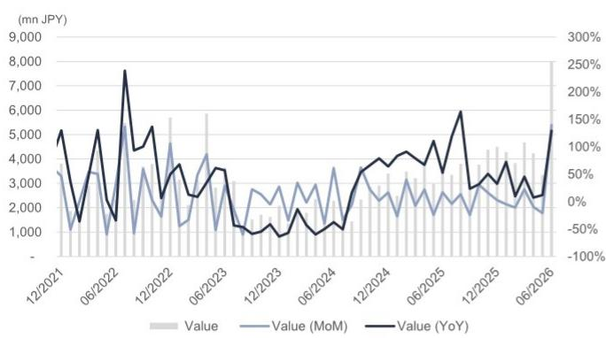
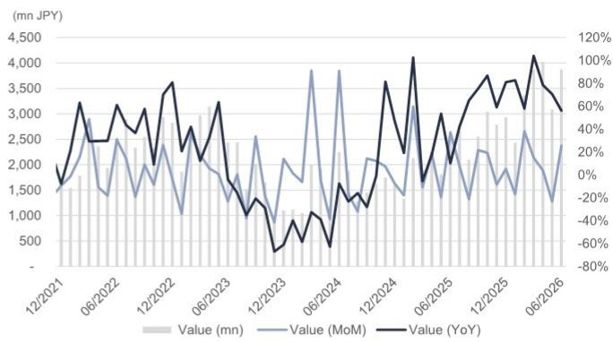
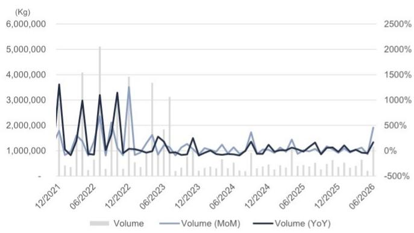
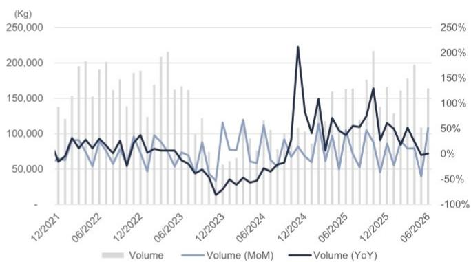
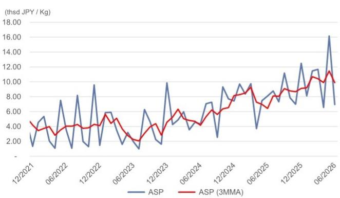
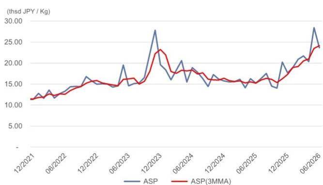
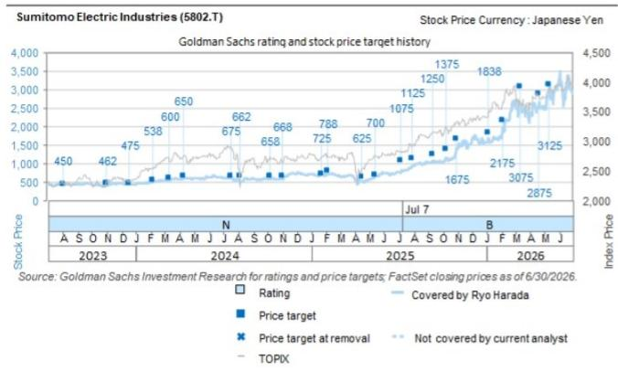
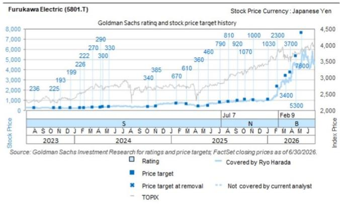
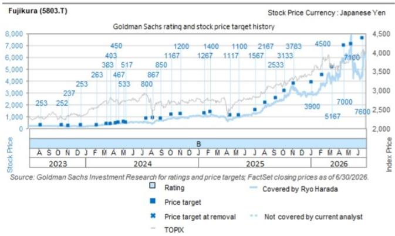
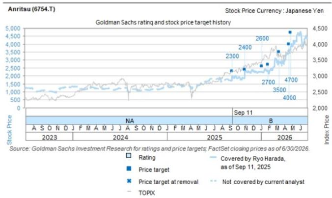

# 日本工业电子：6月财务省贸易数据（光纤/光缆）——光纤/光缆出口额显著增长；行业基本面稳健

**光学时代：AI背后的创新**
**光学产品技术与趋势洞察**
探索 >

Ryo Harada
+81(3)4587-9865 | ryo.harada@gs.com
GS Japan Co., Ltd.

Hiroki Muramatsu
+81(3)4587-9872 |
hiroki.muramatsu@gs.com
GS Japan Co., Ltd.

根据财务省6月贸易统计（7月30日发布），光缆出口额同比增长129%，光纤（含部分其他光缆）出口额同比增长56%。光纤平均出口价格同比上涨55%。从Corning于7月28日公布的业绩来看，光学行业基本面表现稳健。在此背景下，日本光学相关公司在远期市盈率（LSEG数据）基础上仍存在估值差距：Fujikura为24倍，住友电工为18倍，古河电工为20倍，而Corning为32倍，我们认为这一差距有望收窄。

展望一季度业绩，我们特别关注住友电工，认为其信息通信业务存在较大的业绩指引上调空间。对于6月19日已宣布上调指引的Fujikura，我们认为进一步上调的空间有限，但近期日元走弱可能带来积极的汇率影响。其下半年指引仍显保守。对于古河电工，我们认为下半年业绩更可能成为催化剂，因为最大驱动因素——水冷板——将从下半年开始贡献业绩。短期内，部分读者提及大规模投资可能伴随某种形式的股权融资，并将其视为一个关注点（链接）。对于光模块测试设备制造商Anritsu，我们预计其业绩表现强劲，因为800G/1.6T相关需求同样旺盛。

按目的地划分（图表7），对美光纤和光缆出口的平均价格均实现同比和环比增长。按海关辖区划分（图表9），东京、横滨和名古屋的光缆出口额均同比增长，表明三大光缆制造商的出口可能正在增加。我们覆盖的三大光缆公司的主要生产基地分别为：Fujikura——千叶（东京海关辖区），住友电工——横滨（横滨海关辖区），古河电工——三重（名古屋海关辖区）。

图表1：光缆出口额（百万日元）

来源：财务省

图表2：光纤出口额（百万日元）

含部分其他光缆。
来源：财务省

图表3：光缆出口量（千克）

来源：财务省

图表4：光纤出口量（千克）

含部分其他光缆。
来源：财务省

图表5：光缆平均出口价格（千日元/千克）

来源：财务省

图表6：光纤平均出口价格（千日元/千克）

含部分其他光缆。

图表7：前十大目的地出口额、出口量及平均出口价格（同比、环比）

<table><tr><td rowspan="2">地区</td><td rowspan="2">CY2025占比</td><td colspan="2">金额</td><td colspan="2">数量</td><td colspan="2">平均价格</td></tr><tr><td>同比</td><td>环比</td><td>同比</td><td>环比</td><td>同比</td><td>环比</td></tr><tr><td colspan="8">光缆</td></tr><tr><td>美国</td><td>58%</td><td>50%</td><td>95%</td><td>-16%</td><td>66%</td><td>78%</td><td>18%</td></tr><tr><td>墨西哥</td><td>10%</td><td>293%</td><td>1030%</td><td>243%</td><td>435%</td><td>15%</td><td>111%</td></tr><tr><td>中国</td><td>5%</td><td>54%</td><td>-20%</td><td>102%</td><td>30%</td><td>-24%</td><td>-38%</td></tr><tr><td>英国</td><td>4%</td><td>-83%</td><td>247%</td><td>-69%</td><td>359%</td><td>-46%</td><td>-24%</td></tr><tr><td>波兰</td><td>4%</td><td>-</td><td>-</td><td>-89%</td><td>-92%</td><td>-</td><td>-</td></tr><tr><td>台湾</td><td>3%</td><td>199%</td><td>129%</td><td>311%</td><td>11%</td><td>-27%</td><td>107%</td></tr><tr><td>澳大利亚</td><td>3%</td><td>687%</td><td>186%</td><td>1870%</td><td>196%</td><td>-60%</td><td>-3%</td></tr><tr><td>加拿大</td><td>2%</td><td>195%</td><td>190%</td><td>31%</td><td>136%</td><td>125%</td><td>23%</td></tr><tr><td>菲律宾</td><td>1%</td><td>-</td><td>937231%</td><td>-</td><td>325171%</td><td>-</td><td>188%</td></tr><tr><td>越南</td><td>1%</td><td>415%</td><td>387%</td><td>132%</td><td>268%</td><td>122%</td><td>33%</td></tr><tr><td>全部地区</td><td>100%</td><td>129%</td><td>140%</td><td>168%</td><td>458%</td><td>-14%</td><td>-57%</td></tr><tr><td colspan="8">光纤</td></tr><tr><td>美国</td><td>54%</td><td>109%</td><td>138%</td><td>21%</td><td>117%</td><td>72%</td><td>10%</td></tr><tr><td>罗马尼亚</td><td>13%</td><td>-56%</td><td>-21%</td><td>-62%</td><td>-5%</td><td>16%</td><td>-16%</td></tr><tr><td>中国</td><td>9%</td><td>4%</td><td>-39%</td><td>-51%</td><td>-50%</td><td>112%</td><td>22%</td></tr><tr><td>荷兰</td><td>3%</td><td>-100%</td><td>-100%</td><td>-100%</td><td>-100%</td><td>-</td><td>-</td></tr><tr><td>瑞典</td><td>3%</td><td>31%</td><td>-10%</td><td>-38%</td><td>-49%</td><td>112%</td><td>77%</td></tr><tr><td>土耳其</td><td>3%</td><td>637%</td><td>239%</td><td>132%</td><td>214%</td><td>218%</td><td>8%</td></tr><tr><td>法国</td><td>2%</td><td>-69%</td><td>-21%</td><td>-60%</td><td>-12%</td><td>-24%</td><td>-10%</td></tr><tr><td>台湾</td><td>2%</td><td>226%</td><td>149%</td><td>111%</td><td>116%</td><td>55%</td><td>15%</td></tr><tr><td>英国</td><td>1%</td><td>19%</td><td>-29%</td><td>-48%</td><td>574%</td><td>127%</td><td>-90%</td></tr><tr><td>阿联酋</td><td>1%</td><td>-</td><td>30%</td><td>-</td><td>-11%</td><td>-</td><td>46%</td></tr><tr><td>全部地区</td><td>100%</td><td>56%</td><td>26%</td><td>0%</td><td>51%</td><td>55%</td><td>-17%</td></tr></table>

CY2025占比基于光缆金额和光纤数量。
来源：财务省

图表8：两大欧洲市场及美国的出口额、出口量及平均出口价格（同比、环比）

<table><tr><td rowspan="2"></td><td rowspan="2">CY2025占比</td><td colspan="2">金额</td><td colspan="2">数量</td><td colspan="2">平均价格</td></tr><tr><td>同比</td><td>环比</td><td>同比</td><td>环比</td><td>同比</td><td>环比</td></tr><tr><td colspan="8">光缆</td></tr><tr><td>美国</td><td>58%</td><td>50%</td><td>95%</td><td>-16%</td><td>66%</td><td>78%</td><td>18%</td></tr><tr><td>英国</td><td>4%</td><td>-83%</td><td>247%</td><td>-69%</td><td>359%</td><td>-46%</td><td>-24%</td></tr><tr><td>法国</td><td>0%</td><td>-63%</td><td>1%</td><td>-99%</td><td>0%</td><td>6095%</td><td>1%</td></tr><tr><td>全部地区</td><td>100%</td><td>129%</td><td>140%</td><td>168%</td><td>458%</td><td>-14%</td><td>-57%</td></tr><tr><td colspan="8">光纤</td></tr><tr><td>美国</td><td>54%</td><td>109%</td><td>138%</td><td>21%</td><td>117%</td><td>72%</td><td>10%</td></tr><tr><td>英国</td><td>1%</td><td>19%</td><td>-29%</td><td>-48%</td><td>574%</td><td>127%</td><td>-90%</td></tr><tr><td>法国</td><td>2%</td><td>-69%</td><td>-21%</td><td>-60%</td><td>-12%</td><td>-24%</td><td>-10%</td></tr><tr><td>全部地区</td><td>100%</td><td>56%</td><td>26%</td><td>0%</td><td>51%</td><td>55%</td><td>-17%</td></tr></table>

CY2025占比基于光缆金额和光纤数量。
来源：财务省

图表9：按海关辖区划分的出口额、出口量及平均出口价格（同比、环比）

<table><tr><td rowspan="2">海关</td><td rowspan="2">CY2025占比</td><td colspan="2">金额</td><td colspan="2">数量</td><td colspan="2">平均价格</td></tr><tr><td>同比</td><td>环比</td><td>同比</td><td>环比</td><td>同比</td><td>环比</td></tr><tr><td colspan="8">光缆</td></tr><tr><td>东京</td><td>37%</td><td>38%</td><td>-3%</td><td>13%</td><td>-12%</td><td>22%</td><td>10%</td></tr><tr><td>横滨</td><td>53%</td><td>226%</td><td>419%</td><td>372%</td><td>1066%</td><td>-31%</td><td>-55%</td></tr><tr><td>名古屋</td><td>2%</td><td>89%</td><td>354%</td><td>-53%</td><td>234%</td><td>302%</td><td>36%</td></tr><tr><td>全部海关</td><td>100%</td><td>129%</td><td>140%</td><td>168%</td><td>458%</td><td>-14%</td><td>-57%</td></tr><tr><td colspan="8">光纤</td></tr><tr><td>东京</td><td>93%</td><td>58%</td><td>32%</td><td>2%</td><td>64%</td><td>55%</td><td>-19%</td></tr><tr><td>横滨</td><td>0%</td><td>-100%</td><td>-100%</td><td>-</td><td>0%</td><td>-</td><td>0%</td></tr><tr><td>名古屋</td><td>3%</td><td>-65%</td><td>-9%</td><td>-98%</td><td>0%</td><td>1872%</td><td>-9%</td></tr><tr><td>全部海关</td><td>100%</td><td>56%</td><td>26%</td><td>0%</td><td>51%</td><td>55%</td><td>-17%</td></tr></table>

CY2025占比基于光缆金额和光纤数量。
来源：财务省

## 目标价风险与方法论——Fujikura

我们给予报告评级。我们的12个月目标价为7,500日元，基于EV/EBITDA的25.0倍（FY3/28E；该倍数基于其国内外竞争对手的EV/EBITDA与EBITDA利润率相关性）。下行风险：电信领域：超大规模数据中心投入的收益延迟、电信运营商资本开支持续受限，以及竞争对手在超高密度光缆领域追赶Fujikura。电子领域：智能手机市场放缓幅度超预期和/或竞争加剧。汽车产品领域：汽车产量低于我们的假设。公司整体：汇率波动。

## 目标价风险与方法论——古河电工

我们的12个月目标价为7,200日元。我们采用EV/EBITDA的25.0倍（FY3/28E，基于国内外竞争对手EV/EBITDA与EBITDA增长率的相关性）。我们给予报告评级。风险：通信解决方案领域：如果数据中心高利润率光学产品的销售扩张不及预期且利润未获改善；如果收购的Furukawa FITEL Optical Components（FFOC）因竞争力变化等因素导致盈利能力再次下降；如果生成式AI数据中心投入因部分关键产品供应短缺导致数据中心建设延迟而放缓，或因组件产品价格上涨导致项目盈利能力下降而使生成式AI数据中心投入开始减弱。能源基础设施领域：如果因生成式AI投入放缓导致高压和中低压电缆需求均下降；如果公司决定对高压直流电缆进行资本开支但未能获得预期的客户订单。电子与汽车系统领域：如果汽车产量或公司供应车型的销量增长不及预期；如果汽车产量波动大于预期且公司无法通过价格调整等措施吸收固定成本；如果材料价格涨幅超预期且公司无法将其转嫁给客户。功能产品领域：在铜箔业务中，如果高功能电路箔的销售扩张未按计划推进且盈利能力改善不及预期，如果生成式AI热管理产品的订单因某种原因未确认为销售或出现延迟，或者半导体制造胶带的新客户获取进展不及预期。

## 目标价风险与方法论——住友电工

我们给予报告评级。我们的12个月目标价为3,400日元。我们采用目标EV/EBITDA倍数13.0倍（基于FY3/28E，采用分部加总法）。主要下行风险：汽车领域：汽车产量下降；材料采购成本向销售价格的传导慢于预期。信息通信领域：因超大规模数据中心资本开支放缓导致库存调整时间长于预期；竞争对手在超高密度光缆领域追赶。环境与能源领域：因材料采购和劳动力保障困难导致新建及替代电力基础设施项目延迟；日本政府清洁能源战略的盈利贡献慢于预期。工业材料及其他领域：因宏观环境变化导致硬质合金工具等需求下降；因能源价格上涨导致烧结零部件等制造成本上升。公司整体：汇率波动；材料价格持续高企。

## 目标价风险与方法论——Anritsu

我们的12个月目标价为5,300日元，基于FY3/28E目标EV/EBITDA倍数17倍（我们的目标倍数基于全球竞争对手EV/EBITDA与EBITDA利润率的相关性）。我们给予报告评级。

风险：测试与测量领域：5G应用需求已有所降温，存在销售增长不及预期导致利润率下降的风险。数据中心业务方面，美国关税带来的不确定性可能导致客户决策放缓，从而使需求停滞或减弱。测试方法可能从100%测试转变为抽样测试。PQA领域：国内市场份额可能下降，或在公司加速业务拓展的地区（如北美、欧洲和中国）销售扩张不及预期。环境测量领域：因BEV市场变化导致电池测试设备收益增长不及预期。公司整体：并购和/或增长投入的回报不及预期；研发费用率上升；日元升值。

## 披露附录

## Reg AC

我们，Ryo Harada和Hiroki Muramatsu，特此证明本报告中表达的所有观点准确反映了我们对标的公司及其证券的个人观点。我们还证明，我们的薪酬中没有任何部分直接或间接与本报告中表达的具体建议或观点相关。

除非另有说明，本报告封面所列人员为GS全球投资研究部门的分析师。

撰稿作者：Ryo Harada GS Japan Co., Ltd.，Hiroki Muramatsu GS Japan Co., Ltd.。

除非另有说明，本报告撰稿作者披露中所列人员为GS全球投资研究部门的分析师。

## GS因子画像

GS因子画像通过将股票的关键属性与市场（即我们的评级股票范围）及其行业同行进行比较，为股票提供投资背景参考。所展示的四个关键属性为：成长性、财务回报、估值倍数（即估值）和综合（成长性、财务回报和估值倍数的复合指标）。成长性、财务回报和估值倍数通过每只股票特定指标的标准化排名计算得出。各指标的标准化排名随后取平均值并转换为相应属性的百分位。每项指标的具体计算方式可能因财年、行业和地区而异，但标准方法如下：

成长性基于股票的前瞻性销售增长、EBITDA增长和EPS增长（对于金融类股票，仅EPS和销售增长），百分位越高表示成长性越强。财务回报基于股票的前瞻性ROE、ROCE和CROCI（对于金融类股票，仅ROE），百分位越高表示财务回报越高。估值倍数基于股票的前瞻性P/E、P/B、价格/股息（P/D）、EV/EBITDA、EV/FCF和EV/债务调整后现金流（DACF）（对于金融类股票，仅P/E、P/B和P/D），百分位越高表示估值倍数越高。综合百分位按成长性百分位、财务回报百分位和（100% - 估值倍数百分位）的平均值计算。

财务回报和估值倍数使用GS分析师对至少三个季度后的财年末的预测。成长性使用至少七个季度后的财年与至少三个季度后的财年相比的输入数据（所有指标均按每股基准计算）。

有关GS因子画像计算方式的更详细说明，请联系您的GS代表。

## M&A排名

在我们的全球覆盖范围内，我们使用M&A框架审视股票，综合考虑定性因素和定量因素（可能因行业和地区而异），以纳入某些公司可能被收购的可能性。然后我们对评级覆盖下的公司进行M&A排名，从1到3，其中1表示公司成为收购目标的可能性较高（30%-50%），2表示中等可能性（15%-30%），3表示较低可能性（0%-15%）。对于排名为1或2的公司，按照我们的标准部门指引，我们将M&A因素纳入目标价。M&A排名为3的公司被视为不重大，因此不计入目标价，可能在研究中讨论也可能不讨论。

## Quantum

Quantum是GS的专有数据库，提供详细的财务报表历史、预测和比率数据。可用于对单一公司进行深入分析，或对不同行业和市场的公司进行比较。

## 披露

Anritsu、Fujikura、古河电工和住友电子的评级相对于其覆盖范围内的其他公司：Anritsu、Daihen、富士电机、Fujikura、古河电工、日立、明电舍、三菱电机、Panasonic Holdings、SWCC、住友电工

## 公司特定监管披露

以下披露涉及GS集团（及其关联公司，"GS"）与GS全球投资研究覆盖并在此研究中提及的公司之间的关系。

截至本报告前一个月末，GS实益拥有以下公司普通股1%或以上（不包括根据美国证券法无需汇总的关联公司和业务部门持有的头寸）：Anritsu（¥3,554）和古河电工（¥2,776）

GS预计在未来3个月内收取或有意寻求投资银行服务报酬：Fujikura（¥3,702）、古河电工（¥2,776）和住友电工（¥2,087）

GS在过去12个月内与以下公司存在投资银行服务客户关系：Fujikura（¥3,702）、古河电工（¥2,776）和住友电工（¥2,087）

GS在过去12个月内与以下公司存在非投资银行证券相关服务客户关系：古河电工（¥2,776）和住友电工（¥2,087）

GS在过去12个月内与以下公司存在非证券服务客户关系：Anritsu（¥3,554）、Fujikura（¥3,702）、古河电工（¥2,776）和住友电工（¥2,087）

## 评级分布/投资银行关系

GS投资研究全球股票覆盖范围

<table><tr><td rowspan="2"></td><td colspan="3">评级分布</td><td colspan="3">投资银行关系</td></tr><tr><td>买入</td><td>中性</td><td>卖出</td><td>买入</td><td>中性</td><td>卖出</td></tr><tr><td>全球</td><td>50%</td><td>34%</td><td>16%</td><td>65%</td><td>59%</td><td>43%</td></tr></table>

截至2026年7月1日，GS全球投资研究对3,104只股票进行了投资评级。GS将股票指定为各区域投资清单上的买入和卖出；未如此指定的股票被视为中性。这些指定等同于FINRA规则要求的上述披露中的买入、持有和卖出。参见下方"评级、覆盖范围和相关定义"。投资银行关系图表反映了每个评级类别中GS在过去十二个月内提供过投资银行服务的标的公司的百分比。

## 目标价与评级历史图表

所示目标价应结合GS此前所有已发布研究报告（可能包含也可能不包含目标价）以及公司、行业和金融市场的发展情况来理解。

所示目标价应结合GS此前所有已发布研究报告（可能包含也可能不包含目标价）以及公司、行业和金融市场的发展情况来理解。

所示目标价应结合GS此前所有已发布研究报告（可能包含也可能不包含目标价）以及公司、行业和金融市场的发展情况来理解。

所示目标价应结合GS此前所有已发布研究报告（可能包含也可能不包含目标价）以及公司、行业和金融市场的发展情况来理解。

## 目标价历史表

住友电工（5802.T）

<table><tr><td>报告日期</td><td>目标价（日元）</td><td>收盘价（日元）</td></tr><tr><td>2026年7月7日</td><td>3,400</td><td>2,443</td></tr><tr><td>2026年5月12日</td><td>12,500</td><td>2,913</td></tr><tr><td>2026年4月20日</td><td>11,500</td><td>2,494</td></tr><tr><td>2026年3月13日</td><td>12,300</td><td>2,598</td></tr><tr><td>2026年2月3日</td><td>8,700</td><td>1,914</td></tr><tr><td>2026年1月5日</td><td>7,350</td><td>1,678</td></tr><tr><td>2025年10月31日</td><td>6,700</td><td>1,413</td></tr><tr><td>2025年10月9日</td><td>5,500</td><td>1,158</td></tr><tr><td>2025年9月10日</td><td>5,000</td><td>1,073</td></tr><tr><td>2025年7月31日</td><td>4,500</td><td>940</td></tr><tr><td>2025年7月7日</td><td>4,300</td><td>756</td></tr><tr><td>2025年5月13日</td><td>2,800</td><td>658</td></tr><tr><td>2025年4月16日</td><td>2,500</td><td>516</td></tr><tr><td>2025年2月4日</td><td>3,150</td><td>752</td></tr><tr><td>2025年1月22日</td><td>2,900</td><td>727</td></tr><tr><td>2024年11月1日</td><td>2,670</td><td>583</td></tr><tr><td>2024年10月7日</td><td>2,630</td><td>606</td></tr><tr><td>2024年8月7日</td><td>2,650</td><td>530</td></tr><tr><td>2024年7月18日</td><td>2,700</td><td>600</td></tr></table>

Fujikura（5803.T）

<table><tr><td>报告日期</td><td>目标价（日元）</td><td>收盘价（日元）</td></tr><tr><td>2026年7月7日</td><td>7,500</td><td>5,072</td></tr><tr><td>2026年6月18日</td><td>7,600</td><td>4,461</td></tr><tr><td>2026年5月14日</td><td>7,100</td><td>6,355</td></tr><tr><td>2026年4月20日</td><td>7,000</td><td>5,529</td></tr><tr><td>2026年3月13日</td><td>31,000</td><td>4,420</td></tr><tr><td>2026年2月9日</td><td>27,000</td><td>3,659</td></tr><tr><td>2026年1月5日</td><td>23,400</td><td>3,074</td></tr><tr><td>2025年11月7日</td><td>22,700</td><td>3,403</td></tr><tr><td>2025年10月9日</td><td>18,800</td><td>2,798</td></tr><tr><td>2025年9月10日</td><td>15,200</td><td>2,272</td></tr><tr><td>2025年8月7日</td><td>13,000</td><td>1,918</td></tr><tr><td>2025年7月7日</td><td>9,400</td><td>1,235</td></tr><tr><td>2025年5月13日</td><td>6,600</td><td>957</td></tr><tr><td>2025年4月16日</td><td>6,700</td><td>761</td></tr><tr><td>2025年2月10日</td><td>8,400</td><td>1,113</td></tr><tr><td>2025年1月22日</td><td>7,600</td><td>1,157</td></tr><tr><td>2024年11月7日</td><td>7,200</td><td>968</td></tr><tr><td>2024年10月7日</td><td>7,000</td><td>831</td></tr><tr><td>2024年9月2日</td><td>5,100</td><td>736</td></tr></table>

<table><tr><td colspan="3">住友电工（5802.T）</td></tr><tr><td>报告日期</td><td>目标价（日元）</td><td>收盘价（日元）</td></tr><tr><td>2024年4月9日</td><td>2,600</td><td>602</td></tr><tr><td>2024年3月12日</td><td>2,400</td><td>556</td></tr><tr><td>2024年2月5日</td><td>2,150</td><td>501</td></tr><tr><td>2023年12月19日</td><td>1,900</td><td>443</td></tr><tr><td>2023年11月2日</td><td>1,850</td><td>404</td></tr><tr><td>2023年8月2日</td><td>1,800</td><td>469</td></tr></table>

<table><tr><td colspan="3">Fujikura（5803.T）</td></tr><tr><td>报告日期</td><td>目标价（日元）</td><td>收盘价（日元）</td></tr><tr><td>2024年8月8日</td><td>5,200</td><td>423</td></tr><tr><td>2024年7月18日</td><td>4,800</td><td>518</td></tr><tr><td>2024年5月13日</td><td>3,100</td><td>474</td></tr><tr><td>2024年5月6日</td><td>3,200</td><td>463</td></tr><tr><td>2024年4月18日</td><td>2,800</td><td>444</td></tr><tr><td>2024年4月9日</td><td>2,700</td><td>422</td></tr><tr><td>2024年3月24日</td><td>2,420</td><td>358</td></tr><tr><td>2024年3月12日</td><td>2,300</td><td>316</td></tr><tr><td>2024年2月8日</td><td>1,580</td><td>210</td></tr><tr><td>2023年12月19日</td><td>1,520</td><td>174</td></tr><tr><td>2023年11月8日</td><td>1,420</td><td>192</td></tr><tr><td>2023年10月17日</td><td>1,510</td><td>200</td></tr><tr><td>2023年8月10日</td><td>1,520</td><td>191</td></tr></table>

<table><tr><td>报告日期</td><td>目标价（日元）</td><td>收盘价（日元）</td></tr><tr><td>2026年7月7日</td><td>7,200</td><td>3,674</td></tr><tr><td>2026年5月12日</td><td>76,000</td><td>5,043</td></tr><tr><td>2026年4月20日</td><td>53,000</td><td>4,307</td></tr><tr><td>2026年3月30日</td><td>37,000</td><td>3,095</td></tr><tr><td>2026年3月13日</td><td>34,000</td><td>3,069</td></tr><tr><td>2026年2月9日</td><td>23,000</td><td>1,750</td></tr><tr><td>2026年1月5日</td><td>10,300</td><td>1,054</td></tr><tr><td>2025年11月10日</td><td>10,000</td><td>946</td></tr><tr><td>2025年10月9日</td><td>10,700</td><td>986</td></tr><tr><td>2025年9月10日</td><td>9
