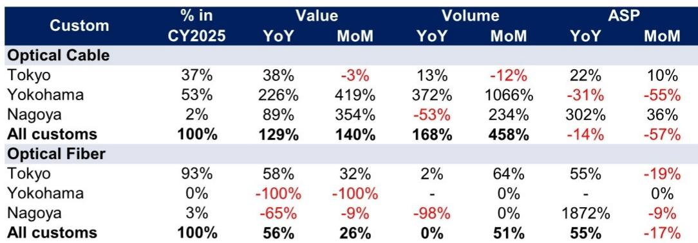
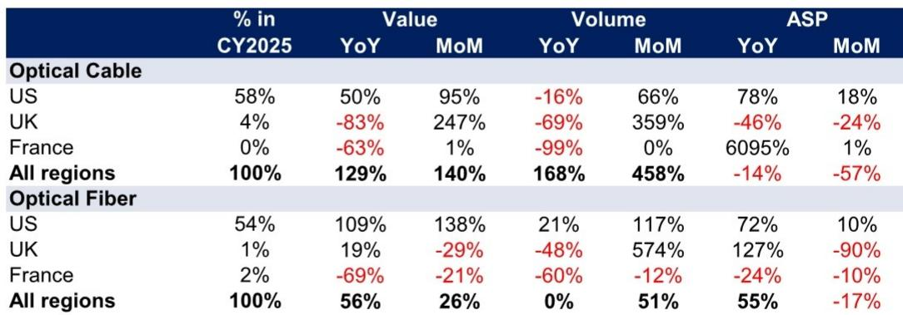
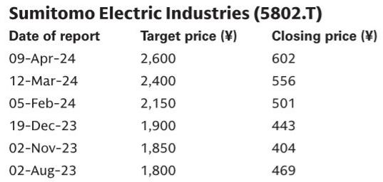

# GS：跨境贸易数据与主题变化观察

日本财务省7月30日发布的6月贸易统计显示，光缆出口额同比增长129%，光纤出口额增长56%，光纤平均出口价格同比上升55%。这份GS研报把贸易数据与康宁7月28日的业绩放在一起观察，认为光通信行业基本面处于有利位置，但日本相关公司估值仍低于美国同行，这一差距可能收窄。

报告覆盖藤仓、住友电气工业、古河电工和安立四家公司，核心判断是：行业需求由AI数据中心建设拉动，日本厂商在超高频光纤光缆等环节有位置，但市场定价尚未完全反映。按远期市盈率计，藤仓约24倍、住友电气约18倍、古河电工约20倍，而康宁约32倍。

## 1. 对美出口额与均价同步上升，海关辖区数据指向三大厂商

按目的地拆分，6月对美光缆出口额同比增长50%，环比增长95%；对美光纤出口额同比增长109%，环比增长138%。均价方面，对美光缆均价同比上升78%，光纤均价同比上升72%。量价关系值得注意：对美光缆出口量同比下降16%，但均价大幅上升，说明出口结构偏向高附加值产品。

按海关辖区拆分，光缆出口额在东京、横滨、名古屋三个辖区均同比增长。报告指出，三家主要光缆厂商的制造基地分别位于千叶（东京海关辖区）、横滨（横滨海关辖区）和三重（名古屋海关辖区），这暗示三大厂商出口可能都在增加。横滨辖区光缆出口额同比增长226%，环比增长419%，是三个辖区中增速最快的。

> **KC评论：** 对美出口量降但金额涨，说明日本光缆出口的单价逻辑比数量逻辑更值得跟踪。海关辖区数据把国家层面的增长拆到了厂商层面，横滨辖区的高增速对应住友电气的出货节奏，这是看单家公司时容易被忽略的线索。

## 2. 住友电气信息通信业务存在上调空间，藤仓汇率影响偏正面

报告对四家公司一季报前的关注点做了区分。住友电气被列为重点，理由是信息通信业务指引存在明显上调空间。藤仓6月19日已宣布上调业绩预期，报告认为进一步上调空间有限，但近期日元走弱可能带来正面汇兑影响，其下半年指引仍偏保守。

古河电工的催化剂更可能出现在下半年，因为最大驱动因素水冷冷板从下半年开始贡献收入。报告同时提到，部分读者关注公司是否为大额研究进行股权融资。安立作为光收发器测试设备厂商，报告预计其业绩强劲，800G/1.6T相关需求同样旺盛。

## 3. 估值差距的观察框架：用美国同行做锚，看日本厂商的折价来源

报告给出的估值对比框架并不复杂：以康宁为锚，日本四家光通信相关公司均存在折价。这个差距能否收窄，取决于两个条件——日本厂商的业绩兑现节奏，以及市场是否愿意按AI数据中心受益链条重新定价。

可复用的观察方法是：先看贸易数据确认行业景气度，再看具体公司的业绩指引与汇率敏感度，最后用美国同行的估值水平做参照。贸易数据提供行业层面的验证，公司层面的差异则体现在指引调整空间、产品组合和汇兑影响上。报告认为，随着一季报陆续披露，这些差异会逐步清晰。

For informational purposes only. Portions may be generated,translated,summarized,or edited with AI assistance based on source materials and may contain omissions or errors. Please verify independently. This is not investment,legal,tax,accounting,or other professional advice.

For informational purposes only. Portions may be generated,translated,summarized,or edited with AI assistance based on source materials and may contain omissions or errors. Please verify independently. This is not investment,legal,tax,accounting,or other professional advice.

