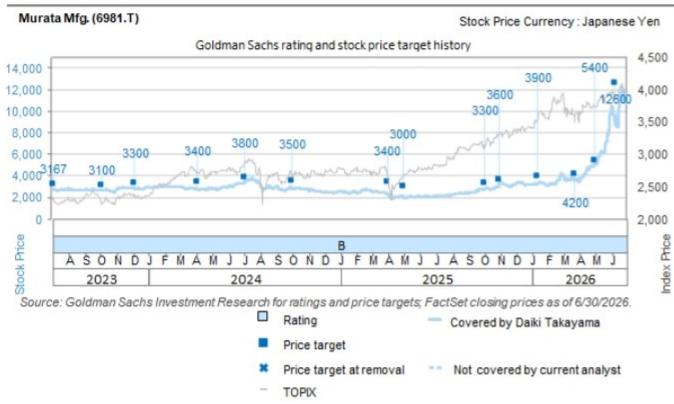
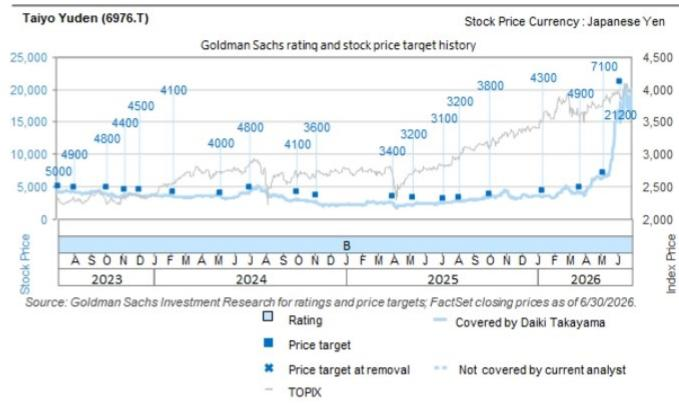
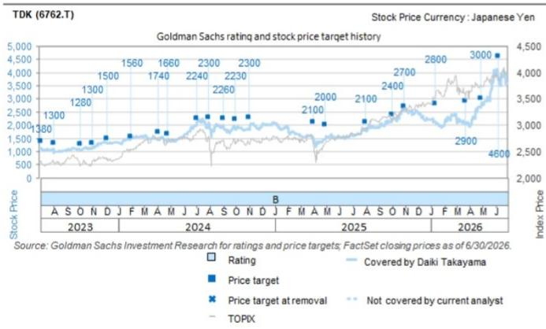

# 日本科技行业观察：电子元器件——6月贸易统计数据显示MLCC供需格局持续偏紧

根据日本财务省7月30日公布的6月贸易统计数据，MLCC平均出口价格环比上升4%，出口数量环比增长6%，出口金额环比增长11%。同比来看，上述三项指标分别增长23%、6%和31%。结合产业链调研反馈，6月供需紧张程度或进一步加深，上述数据与这一判断基本吻合。在AI/数据中心应用需求持续旺盛的背景下，其他应用领域的供应关注度也在上升，我们观察到客户普遍在为2026年需求提前备货，同时针对2027年的长期供应协议问询也在增加。

我们对村田制作所、太阳诱电以及TDK维持积极评级。村田制作所、TDK和太阳诱电分别计划于7月31日14:00、7月31日15:30及8月5日15:30公布第一季度业绩。尽管近期MLCC相关公司报价处于调整阶段，但我们认为基本面在过去一个月实际上有所增强。在即将到来的业绩发布中，我们将重点关注：（1）订单出货比（4-6月是否存在进一步环比上升的可能）；（2）定价策略（在亚洲厂商活跃度提升的背景下，日本厂商维持价格平稳是否有新的动向或信号）；（3）产能利用率和供应能力。

大高くだいき
+81(3)4587-9870 |
daiki.takayama@gs.com
GS Japan Co., Ltd.

一戸光博
+81(3)4587-9836 |
mitsuhiro.x.icho@gs.com
GS Japan Co., Ltd.

高原誠
+81(3)4587-4270 |
makoto.takahara@gs.com
GS Japan Co., Ltd.

日高裕司
+81(3)4587-3656 | yuji.hidaka@gs.com
GS Japan Co., Ltd.

图表1：MLCC出口数量与平均出口价格（ASP）

资料来源：日本财务省

## 目标价风险与研究方法

## 目标价风险与研究方法——村田制作所

估值方法：我们对村田制作所给予积极评级，12个月目标价为12,600日元。目标价基于FY3/29E EV/GCI与CROCI/WACC的对比，在行业倍数10倍基础上给予80%溢价（对应FY3/29E市盈率约30倍）。

主要风险：智能手机产量下滑、MLCC供需关系变化、日元升值。

## 目标价风险与研究方法——太阳诱电

估值方法：我们对太阳诱电给予积极评级，12个月目标价为21,200日元。目标价基于FY3/29E EV/GCI与CROCI/WACC的对比，在行业倍数10倍基础上给予80%溢价（对应FY3/29E市盈率约31倍）。

主要风险：智能手机需求不及预期、MLCC供需关系变化、日元升值。

## 目标价风险与研究方法——TDK

估值方法：我们对TDK给予积极评级，12个月目标价为4,600日元。目标价基于FY3/29E EV/GCI与CROCI/WACC的对比，在行业平均EV/DACF倍数10倍基础上给予10%溢价（对应FY3/28E市盈率约31倍）。

主要风险：智能手机产量下滑、投入成本上升、日元升值。

## 披露附录

## Reg AC

我们——大高くだいき、一戸光博、高原誠、日高裕司——特此证明，本报告中表达的所有观点均准确反映了我们个人对相关公司及其证券的看法。我们还证明，我们的薪酬中没有任何部分直接或间接与本报告中表达的具体建议或观点相关。

除非另有说明，本报告封面上列出的个人均为GS全球投资研究部门的分析师。

撰稿作者：大高くだいき GS Japan Co., Ltd.、一戸光博 GS Japan Co., Ltd.、高原誠 GS Japan Co., Ltd.、日高裕司 GS Japan Co., Ltd.。

除非另有说明，本报告撰稿作者披露中列出的个人均为GS全球投资研究部门的分析师。

## GS因子画像

GS因子画像通过将股票的关键属性与市场（即我们的评级股票池）及其行业同行进行比较，为个股提供研究背景。四个关键属性为：成长性、财务回报、估值倍数（如估值）和综合指标（成长性、财务回报和估值倍数的复合）。成长性、财务回报和估值倍数通过每只股票特定指标的标准化排名计算得出。各指标的标准化排名取平均值后转换为相关属性的百分位。每个指标的具体计算方式可能因财年、行业和地区而异，但标准方法如下：

成长性基于股票的前瞻性销售收入增长、EBITDA增长和每股收益增长（对于金融类公司，仅使用每股收益和销售收入增长），百分位越高表示成长性越强。财务回报基于股票的前瞻性ROE、ROCE和CROCI（对于金融类公司，仅使用ROE），百分位越高表示财务回报越高。估值倍数基于股票的前瞻性市盈率、市净率、股息率、EV/EBITDA、EV/FCF和EV/债务调整后现金流（对于金融类公司，仅使用市盈率、市净率和股息率），百分位越高表示估值倍数越高。综合百分位为成长性百分位、财务回报百分位和（100%—估值倍数百分位）的平均值。

财务回报和估值倍数使用GS分析师对未来至少三个季度后的财年末的预测。成长性使用未来至少七个季度后的财年与未来至少三个季度后的财年相比的输入数据（所有指标均基于每股口径）。

有关GS因子画像计算方式的更详细说明，请联系您的GS代表。

## 并购排名

在我们的全球覆盖范围内，我们使用并购分析框架审视公司，综合考虑定性因素和定量因素（可能因行业和地区而异），以评估某些公司被收购的可能性。然后我们为评级覆盖范围内的公司分配1至3的并购排名，其中1表示公司成为收购目标的可能性较高（30%-50%），2表示中等可能性（15%-30%），3表示较低可能性（0%-15%）。对于排名为1或2的公司，按照我们的标准部门指引，我们将并购因素纳入目标价。并购排名为3的公司被视为不重大，因此不计入目标价，可能在研究报告中提及也可能不提及。

## Quantum

Quantum是GS的专有数据库，提供详细的财务报表历史、预测和比率数据。可用于对单一公司进行深入分析，或比较不同行业和市场的公司。

## 披露

对村田制作所、TDK和太阳诱电的评级相对于其覆盖范围内的其他公司：Alps Alpine、大日本印刷、广濑电机、IRISO Electronics、揖斐电、日本航空电子工业、兴国工业、京瓷、MARUWA、马渊电机、麦克赛尔、美蓓亚三美、村田制作所、NGK、尼吉康、尼得科、日本陶瓷、Niterra、日东电工、瑞萨电子、罗姆、TDK、TOPPAN Holdings、太阳诱电

## 公司特定监管披露

以下披露涉及GS集团（及其关联方，"GS"）与GS全球投资研究覆盖并在本研究中提及的公司之间的关系。

截至本报告前一个月末，GS实益持有普通股1%或以上（不包括根据美国证券法无需汇总的关联方和业务部门管理的持仓）：太阳诱电（9,005日元）

GS在过去12个月内因投资银行服务获得报酬：村田制作所（6,231日元）、TDK（2,746日元）和TDK（ADR）（45.24美元）

GS预计在未来3个月内获得或有意寻求投资银行服务报酬：村田制作所（6,231日元）、太阳诱电（9,005日元）、TDK（2,746日元）和TDK（ADR）（45.24美元）

GS在过去12个月内因非投资银行服务获得报酬：村田制作所（6,231日元）

GS在过去12个月内与以下公司存在投资银行服务客户关系：村田制作所（6,231日元）、太阳诱电（9,005日元）、TDK（2,746日元）和TDK（ADR）（45.24美元）

GS在过去12个月内与以下公司存在非投资银行证券相关服务客户关系：村田制作所（6,231日元）、TDK（2,746日元）和TDK（ADR）（45.24美元）

GS在过去12个月内与以下公司存在非证券服务客户关系：TDK（2,746日元）和TDK（ADR）（45.24美元）

## 评级/投资银行关系分布

GS投资研究全球股票覆盖范围

<table><tr><td rowspan="2"></td><td colspan="3">评级分布</td><td colspan="3">投资银行关系</td></tr><tr><td>积极</td><td>中性</td><td>谨慎</td><td>积极</td><td>中性</td><td>谨慎</td></tr><tr><td>全球</td><td>50%</td><td>34%</td><td>16%</td><td>65%</td><td>59%</td><td>43%</td></tr></table>

截至2026年7月1日，GS全球投资研究对3,104只股票进行了评级。GS将股票评为积极或谨慎，以纳入各地区的投资清单；未纳入清单的股票视为中性。上述分类对应FINRA规则披露要求中的积极、持有和谨慎。参见下文"评级、覆盖范围和相关定义"。投资银行关系图表反映了各评级类别中GS在过去十二个月内提供投资银行服务的公司百分比。

## 目标价与评级历史图表

所示目标价应结合GS此前所有已发布研究报告（可能包含也可能不包含目标价）以及公司、行业和金融市场的发展情况来理解。

所示目标价应结合GS此前所有已发布研究报告（可能包含也可能不包含目标价）以及公司、行业和金融市场的发展情况来理解。

所示目标价应结合GS此前所有已发布研究报告（可能包含也可能不包含目标价）以及公司、行业和金融市场的发展情况来理解。

## 目标价历史表

太阳诱电（6976.T）
村田制作所（6981.T）

<table><tr><td>报告日期</td><td>目标价（日元）</td><td>收盘价（日元）</td><td>报告日期</td><td>目标价（日元）</td><td>收盘价（日元）</td></tr><tr><td>2026年6月8日</td><td>21,200</td><td>14,975</td><td>2026年6月8日</td><td>12,600</td><td>8,711</td></tr><tr><td>2026年5月8日</td><td>7,100</td><td>6,663</td><td>2026年4月30日</td><td>5,400</td><td>5,156</td></tr><tr><td>2026年3月23日</td><td>4,900</td><td>3,926</td><td>2026年3月23日</td><td>4,200</td><td>3,508</td></tr><tr><td>2026年1月12日</td><td>4,300</td><td>3,405</td><td>2026年1月12日</td><td>3,900</td><td>3,194</td></tr><tr><td>2025年10月2日</td><td>3,800</td><td>3,382</td><td>2025年10月31日</td><td>3,600</td><td>3,392</td></tr><tr><td>2025年8月5日</td><td>3,200</td><td>2,841</td><td>2025年10月2日</td><td>3,300</td><td>2,770</td></tr><tr><td>2025年7月7日</td><td>3,100</td><td>2,488</td><td>2025年4月30日</td><td>3,000</td><td>2,214</td></tr><tr><td>2025年5月9日</td><td>3,200</td><td>2,202</td><td>2025年3月31日</td><td>3,400</td><td>2,306</td></tr><tr><td>2025年3月31日</td><td>3,400</td><td>2,467</td><td>2024年10月1日</td><td>3,500</td><td>2,893</td></tr><tr><td>2024年11月7日</td><td>3,600</td><td>2,781</td><td>2024年7月2日</td><td>3,800</td><td>3,364</td></tr><tr><td>2024年10月1日</td><td>4,100</td><td>3,081</td><td>2024年4月3日</td><td>3,400</td><td>2,768</td></tr><tr><td>2024年7月2日</td><td>4,800</td><td>4,105</td><td>2023年12月6日</td><td>3,300</td><td>2,892</td></tr><tr><td>2024年5月8日</td><td>4,000</td><td>3,643</td><td>2023年10月4日</td><td>3,100</td><td>2,657</td></tr><tr><td colspan="3">太阳诱电（6976.T）</td><td colspan="3">村田制作所（6981.T）</td></tr><tr><td>报告日期</td><td>目标价（日元）</td><td>收盘价（日元）</td><td>报告日期</td><td>目标价（日元）</td><td>收盘价（日元）</td></tr><tr><td>2024年2月7日</td><td>4,100</td><td>3,431</td><td></td><td></td><td></td></tr><tr><td>2023年12月6日</td><td>4,500</td><td>3,627</td><td></td><td></td><td></td></tr><tr><td>2023年11月7日</td><td>4,400</td><td>3,695</td><td></td><td></td><td></td></tr><tr><td>2023年10月4日</td><td>4,800</td><td>3,963</td><td></td><td></td><td></td></tr><tr><td>2023年8月3日</td><td>4,900</td><td>4,164</td><td></td><td></td><td></td></tr></table>

## TDK（6762.T）

<table><tr><td>报告日期</td><td>目标价（日元）</td><td>收盘价（日元）</td></tr><tr><td>2026年6月8日</td><td>4,600</td><td>3,715</td></tr><tr><td>2026年4月28日</td><td>3,000</td><td>2,677</td></tr><tr><td>2026年3月23日</td><td>2,900</td><td>2,043</td></tr><tr><td>2026年1月12日</td><td>2,800</td><td>2,142</td></tr><tr><td>2025年10月31日</td><td>2,700</td><td>2,673</td></tr><tr><td>2025年10月2日</td><td>2,400</td><td>2,154</td></tr><tr><td>2025年8月1日</td><td>2,100</td><td>1,876</td></tr><tr><td>2025年4月28日</td><td>2,000</td><td>1,460</td></tr><tr><td>2025年3月31日</td><td>2,100</td><td>1,546</td></tr><tr><td>2024年11月1日</td><td>2,300</td><td>1,848</td></tr><tr><td>2024年10月1日</td><td>2,230</td><td>1,948</td></tr><tr><td>2024年9月2日</td><td>11,300</td><td>2,023</td></tr><tr><td>2024年7月30日</td><td>11,500</td><td>2,029</td></tr><tr><td>2024年7月2日</td><td>11,200</td><td>2,004</td></tr><tr><td>2024年4月26日</td><td>8,300</td><td>1,462</td></tr><tr><td>2024年4月3日</td><td>8,700</td><td>1,488</td></tr><tr><td>2024年1月31日</td><td>7,800</td><td>1,488</td></tr><tr><td>2023年12月6日</td><td>7,500</td><td>1,338</td></tr><tr><td>2023年11月1日</td><td>6,500</td><td>1,158</td></tr><tr><td>2023年10月4日</td><td>6,400</td><td>1,052</td></tr><tr><td>2023年8月2日</td><td>6,500</td><td>1,089</td></tr></table>

表中所示目标价未针对公司行动进行调整。

## 监管披露

## 美国法律法规要求的披露

参见上文公司特定监管披露，了解本报告提及公司所需的以下任何披露：待处理交易中的主承销商或联合主承销商；1%或其他所有权；特定服务报酬；客户关系类型；此前期间的承销公开发行；董事职位；对于股票证券，做市和/或专家角色。GS作为本金交易或可能交易本报告讨论的发行人债务证券（或相关衍生品）。

以下为额外要求的披露：所有权和重大利益冲突：GS政策禁止其分析师、向分析师汇报的专业人员及其家庭成员持有分析师覆盖范围内任何公司的证券。分析师薪酬：分析师薪酬部分基于GS的盈利能力，其中包括投资银行收入。分析师作为高管或董事：GS政策通常禁止其分析师、向分析师汇报的人员或其家庭成员在分析师覆盖范围内的任何公司担任高管、董事或顾问。非美国分析师：非美国分析师可能不是GS & Co. LLC的关联人员，因此可能不受FINRA规则2241或FINRA规则2242关于与标的公司沟通、公开露面以及交易所覆盖证券的限制。

## 美国以外司法管辖区法律和法规要求的额外披露

以下披露为指定司法管辖区要求的披露，但上文已根据美国法律法规作出的披露除外。澳大利亚：GS Australia Pty Ltd及其关联方不是澳大利亚的授权存款机构（该术语在1959年银行法（联邦）中定义），不提供银行服务，也不在澳大利亚开展银行业务。本研究及其访问权限仅面向澳大利亚公司法定义的"批发客户"，除非GS另有约定。在撰写研究报告时，GS Australia全球投资研究部门的成员可能参加其研究报告标的公司和实体的实地考察和其他会议。在某些情况下，如果GS Australia认为在实地考察或会议的具体情况下适当且合理，此类实地考察或会议的费用可能部分或全部由发行人承担。如果本文件内容包含任何金融产品建议，则仅为一般性建议，由GS在未考虑客户的目标、财务状况或需求的情况下编制。客户在根据任何此类建议采取行动前，应考虑该建议是否适合其自身的目标、财务状况和需求。GS Australia和New Zealand的某些利益披露副本以及GS的澳大利亚卖方研究独立性政策声明副本可在以下网址获取：https://www.goldmansachs.com/disclosures/australia-new-zealand/index.html。巴西：有关CVM Resolution n. 20的披露信息可在https://www.gs.com/worldwide/brazil/area/gir/index.html获取。如适用，根据CVM Resolution n. 20第20条定义，本研究报告内容的巴西注册主要分析师为本报告开头列出的第一作者，除非文末另有说明。加拿大：本信息仅供您参考，不构成且在任何情况下均不应被解释为GS & Co. LLC为在加拿大购买证券而进行的广告、要约或招揽。GS & Co. LLC未在加拿大任何司法管辖区注册为交易商，通常不允许交易加拿大证券，并可能被禁止在加拿大的某些司法管辖区销售某些证券和产品。如果您希望在加拿大交易任何加拿大证券或其他产品，请联系GS Canada Inc.（GS Group Inc.的关联公司）或其他注册加拿大交易商。香港：可应要求从GS (Asia) L.L.C.获取本研究中提及的所覆盖公司证券的进一步信息。印度：可从GS (India) Securities Private Limited获取本研究中提及的标的公司的进一步信息，研究分析师-SEBI注册号INH000001493，地址：10th Floor, Ascent-Worli, Sudam Kalu Ahire Marg, Worli, Mumbai-400 025, India，公司识别号U74140MH2006FTC160634，电话+91 22 6616 9000，传真+91 22 6616 9001。GS可能实益持有本研究报告提及的标的公司1%或以上的证券（该术语在1956年印度证券合约（监管）法第2(h)条中定义）。SEBI的注册和NISM的认证不以任何方式保证中介机构的业绩或向读者提供回报保证。GS (India) Securities Private Limited的合规官和读者投诉联系详情、年度合规审计报告副本以及其他相关信息和披露可在以下链接找到：

https://www.goldmansachs.com/worldwide/india/research-analyst。日本：见下文。韩国：本研究及其访问权限仅面向金融服务和资本市场法定义的"专业读者"，除非GS另有约定。可从GS (Asia) L.L.C.首尔分行获取本研究中提及的标的公司的进一步信息。新西兰：GS New Zealand Limited及其关联方不是新西兰的"注册银行"或"存款接受者"（该术语在1989年新西兰储备银行法中定义）。本研究及其访问权限面向"批发客户"（该术语在2008年金融顾问法中定义），除非GS另有约定。GS Australia和New Zealand的某些利益披露副本可在以下网址获取：https://www.goldmansachs.com/disclosures/australia-new-zealand/index.html。俄罗斯：在俄罗斯联邦分发的研究报告不属于俄罗斯法律定义的广告，而是信息和分析，不以产品推广为主要目的，不提供俄罗斯评估活动法律意义上的评估。研究报告不构成俄罗斯法律法规定义的个人化研究交流，不针对特定客户，且未分析客户的财务状况、投资概况或风险概况。GS不对客户或任何其他人基于本研究报告可能做出的任何投资决策承担责任。新加坡：GS (Singapore) Pte.（公司编号：198602165W），受新加坡金融管理局监管，对本研究承担法律责任，如有任何与本研究相关或由此产生的事宜，请联系该公司。台湾：本资料仅供参考，未经许可不得转载。读者应仔细考虑自身的投资风险。投资结果由个人读者自行承担。英国：在英国被归类为零售客户的个人（该术语由金融行为监管局规则定义）应结合GS此前关于本报告所提及公司的研究报告阅读本研究，并应参阅GS International已发送给他们的风险警告。这些风险警告的副本以及本报告中使用的某些金融术语的词汇表可应要求从GS International获取。

欧盟和英国：关于欧洲委员会授权条例（EU）（2016/958）第6(2)条的披露信息（该条例补充欧洲议会和理事会条例（EU）No 596/2014，包括该授权条例在英国退出欧盟和欧洲经济区后转化为英国国内法律和法规的情况），涉及研究交流或其他建议或暗示投资策略的信息的客观呈现技术安排以及特定利益或利益冲突迹象的披露，可在https://www.gs.com/disclosures/europeanpolicy.html获取，该页面载明了与投资研究相关的利益冲突管理欧洲政策。

日本：GS Japan Co., Ltd.是在关东财务局注册的金融工具交易商，注册号Kinsho 69，是日本证券业协会、日本金融期货协会、第二类金融工具交易商协会和日本投资管理协会的会员。股票买卖需支付与客户预先确定的佣金外加消费税。参见公司特定披露，了解日本证券交易所、日本证券业协会或日本证券金融公司要求的任何适用披露。

## 评级、覆盖范围和相关定义

积极（B）、中性（N）、谨慎（S）分析师建议将股票评为积极或谨慎，以纳入各地区的投资清单。是否将股票评为投资清单上的积极或谨慎，取决于该股票相对于其覆盖范围的总回报潜力。任何未被列入投资清单积极或谨慎评级且具有有效评级的股票（即未被暂停评级、未评级、早期生物科技、暂停覆盖或未覆盖的股票）均视为中性。每个地区管理区域信心清单，该清单从各地区投资清单中积极评级的股票中选出，代表重点关注总回报潜力大小和/或实现回报可能性的研究交流。此类信心清单中股票的添加或移除由各地区的投资审查委员会或其他指定委员会管理，不构成分析师对该等股票投资评级的变更。

总回报潜力代表当前股价与目标价之间的上行或下行差异，包括目标价相关时间范围内预期支付或应计的股息。所有覆盖股票均需设定目标价。总回报潜力、目标价和相关时间范围在每份添加或重申投资清单成员资格的研究报告中均有说明。

覆盖范围：每个覆盖范围内的所有股票列表可通过主要分析师、股票和覆盖范围在https://www.gs.com/research/hedge.html获取。

未评级（NR）。当GS在涉及该公司的合并或战略交易中担任顾问角色、因GS参与交易而存在法律、监管或政策限制，以及在某些其他情况下，根据GS政策移除投资评级、目标价和盈利预测（如适用）。早期生物科技（ES）。当该公司既没有通过II期临床试验的药物、治疗或医疗器械，也没有获得II期后药物、治疗或医疗器械的分销许可时，根据GS政策不分配投资评级和目标价。评级暂停（RS）。GS已暂停该股票的投资评级和目标价，因为没有足够的基本面基础来确定投资评级或目标价。此前的投资评级和目标价（如有）不再对该股票有效，不应依赖。覆盖暂停（CS）。GS已暂停对该公司的覆盖。未覆盖（NC）。GS不覆盖该公司。

## 全球产品；分发实体

GS全球投资研究为GS客户在全球范围内制作和分发研究报告。位于GS全球各办事处的分析师对各行业和公司以及宏观经济、货币、大宗商品和投资组合策略进行研究。本研究由以下机构分发：澳大利亚由GS Australia Pty Ltd（ABN 21 006 797 897）；巴西由GS do Brasil Corretora de Títulos e Valores Mobiliários S.A.；GS巴西公共沟通渠道：0800 727 5764和/或contatogoldmanbrasil@gs.com。工作日（节假日除外），上午9点至下午6点。Canal de Comunicação com o Público GS Brasil: 0800 727 5764 e/ou contatogoldmanbrasil@gs.com. Horário de funcionamento: segunda-feira à sexta-feira (exceto feriados), das 9h às 18h；加拿大由GS & Co. LLC；香港由GS (Asia) L.L.C.；印度由GS (India) Securities Private Ltd.；日本由GS Japan Co., Ltd.；韩国由GS (Asia) L.L.C.首尔分行；新西兰由GS New Zealand Limited；俄罗斯由OOO GS；新加坡由GS (Singapore) Pte.（公司编号：198602165W）；美国由GS & Co. LLC。GS International已批准本研究在英国的分发。

## GS International（"GSI"），由审慎监管局（"PRA"）授权并由金融行为监管局（"FCA"）和PRA监管，已批准本研究在英国的分发。

欧洲经济区：GS Bank Europe SE（"GSBE"）是一家在德国注册的信贷机构，在单一监管机制内受欧洲中央银行直接审慎监管，并在其他方面受德国联邦金融服务监管局（Bundesanstalt für Finanzdienstleistungsaufsicht, BaFin）和德意志联邦银行监管，在欧洲经济区内分发研究报告。

## 一般披露

本研究仅供我们的客户使用。除与GS相关的披露外，本研究基于我们认为可靠的当前公开信息，但我们不保证其准确或完整，也不应依赖。本文包含的信息、观点、估计和预测截至本报告日期，如有变更恕不另行通知。我们寻求适时更新我们的研究，但各种法规可能阻止我们这样做。除某些定期发布的行业报告外，大多数报告根据分析师的判断不定期发布。

GS开展全球全方位、综合性的投资银行、投资管理和经纪业务。我们与全球投资研究覆盖的相当大比例的公司存在投资银行和其他业务关系。GS & Co. LLC是美国经纪交易商，是SIPC成员（https://www.sipc.org）。

我们的销售人员、交易员和其他专业人员可能向我们的客户和自营交易部门提供口头或书面的市场评论或交易策略，反映与本研究中表达的观点相反的观点。我们的资产管理领域、自营交易部门和投资业务可能做出与本研究中表达的建议或观点不一致的投资决策。

本报告中提到的分析师可能不时与我们的客户（包括GS销售人员和交易员）讨论或在本报告中讨论交易策略，这些策略涉及可能对本报告讨论的股票证券市场价格产生近期影响的催化剂或事件，该影响可能与分析师公布的该等股票目标价预期方向相反。任何此类交易策略均不同于且不影响分析师对该等股票的基本面股票评级，该评级反映股票相对于其覆盖范围的总回报潜力，如本文所述。

我们及我们的关联方、高级管理人员、董事和员工将不时持有本研究中提及的证券或衍生品（如有）的多头或空头头寸，担任本金角色，并买入或卖出该等证券或衍生品，除非法规或GS政策另有禁止。

在GS安排的会议上第三方演讲者（包括来自GS其他部门的个人）表达的观点不一定反映全球投资研究的观点，也不构成GS的官方观点。

本文引用的任何第三方，包括任何销售人员、交易员和其他专业人员或其家庭成员，可能持有本报告提及产品的头寸，与本报告署名分析师表达的观点不一致。

本研究不构成在任何司法管辖区出售任何证券的要约或招揽购买任何证券的要约，在该等要约或招揽为非法的司法管辖区亦然。本研究不构成个人建议，也未考虑个别客户的具体投资目标、财务状况或需求。客户应考虑本研究中的任何建议或推荐是否适合其具体情况，并在适当时寻求专业建议，包括税务建议。本研究中提及的投资的价格和价值及其产生的收入可能波动。过往表现并非未来表现的指引，未来回报不保证，可能发生原始资本损失。汇率波动可能对某些投资的价值或价格或产生的收入产生不利影响。

某些交易，包括涉及期货、期权和其他衍生品的交易，具有重大风险，不适合所有读者。读者应查阅当前期权和期货披露文件，可从GS销售代表或https://www.theocc.com/about/publications/character-risks.jsp和https://www.goldmansachs.com/disclosures/cftc\_fcm\_disclosures获取。期权策略中要求多次买入和卖出期权（如价差策略）的交易成本可能很高。可应要求提供支持文件。

全球投资研究提供的不同服务级别：GS全球投资研究向您提供的服务级别和类型可能与向GS内部和其他外部客户提供的服务不同，取决于各种因素，包括您对接收沟通频率和方式的个人偏好、您的风险概况和投资重点和视角（如全市场、特定行业、长期、短期）、您与GS整体客户关系的规模和范围，以及法律和监管限制。例如，某些客户可能要求在特定证券研究报告发布时收到通知，某些客户可能要求将分析师基本面分析所依据的特定数据从我们的内部客户网站以数据馈送或其他方式以电子方式传送给他们。分析师基本面研究观点的任何变更（如评级、目标价或股票证券盈利预测的重大变更）均不会在任何客户之前传达，而是包含在通过电子发布到我们内部客户网站或以其他必要方式广泛分发给所有有权接收此类报告的客户的研究报告中。

所有研究报告通过电子发布到我们的内部客户网站同时分发给所有客户。并非所有研究内容都会重新分发给我们的客户或提供给第三方聚合商，GS也不对第三方聚合商重新分发我们的研究负责。有关与一项或多项证券、市场或资产类别相关的数据（包括相关服务）的研究、模型或其他数据，请联系您的GS代表或访问https://research.gs.com。

披露信息也可在https://www.gs.com/research/hedge.html或联系Research Compliance, 200 West Street, New York, NY 10282获取。

## © 2026 GS。

您仅可为本人的使用存储、展示、分析、修改、重新格式化并打印通过本服务获得的信息。未经GS明确书面同意，您不得转售或逆向工程此信息以计算或开发任何指数用于披露和/或营销，或创建任何其他衍生作品或商业产品、数据或服务。未经GS明确书面同意，您不得以任何格式向任何第三方发布、传输或以其他方式复制本信息（整体或部分）。前述限制包括但不限于使用、提取、下载或检索本信息（整体或部分）来训练或微调机器学习或人工智能系统，或作为任何此类系统的提示或输入来提供或复制本信息（整体或部分）。
