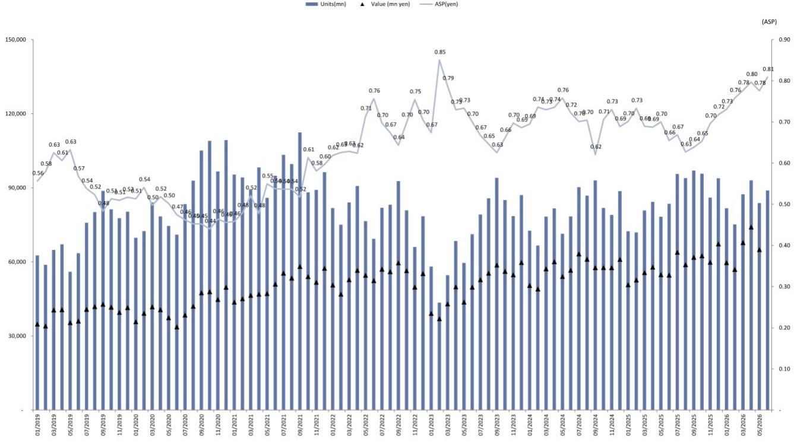
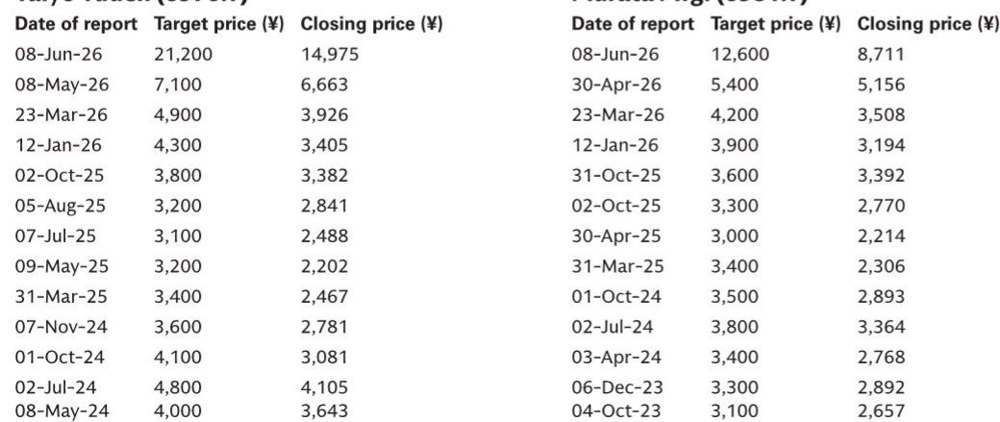

# MLCC出口数据指向的市场供需状况，比当前报价所反映的更为紧张

7月30日发布的多层陶瓷电容器（MLCC）6月贸易统计数据显示，平均出口价格环比上升4%，出口量环比增长6%，带动出口总额环比增长11%。同比来看，上述三项指标分别为增长23%、增长6%和增长31%。对于一个过去两年一直在消化库存调整和需求不确定性的行业而言，价格与数量同步上升并非一个常规数据点——它表明供需格局的转变速度已快于市场定价所消化的程度。

主要MLCC厂商的报价已进入调整阶段。然而，从贸易流量和供应链调研所反映的基本面来看，过去一个月实际在进一步增强。报价走势与实体市场数据之间的这种背离，是观察者需要理解的核心张力。6月的数据表明，最初在AI和数据中心应用中出现的供应紧张，正在向其他终端市场扩散，促使客户不仅为当前周期锁定供应，还在为2026年乃至更远做准备，对2027年长期协议的询问也在增加。

6月数据尤其值得关注之处，在于平均售价与出货量同步上升。在典型的需求复苏中，可能会出现量增而价难涨的情况，因为厂商为争夺订单而竞争。而日本供应商历来价格策略较为稳定，如今其平均出口价格也在攀升，这表明市场已超越单纯的产能利用率恢复，进入真正的供应稀缺阶段。供应链调研也印证了这一判断，显示6月的紧张程度在加剧而非仅仅延续。

这一影响不仅限于主导高端MLCC市场的三家日本厂商——村田、TDK和太阳诱电。如果客户已经在洽谈2026年的分配额度并询问2027年长期协议，那么当前周期就不是一次短期的库存回补，而是对产能需求的结构性重估。对于观察者而言，问题在于MLCC相关公司报价的调整，究竟是代表一个介入机会，还是贸易数据作为滞后指标所预示的阶段性高点。6月的数据倾向于前者，但答案将取决于未来两个季度产能利用率和定价策略如何演变。

## 价格与数量同步上升指向结构性转变，而非周期性波动

6月贸易数据打破了2020年疫情后调整以来MLCC市场的既有模式。2023年和2024年全年，厂商持续面临库存过剩和终端需求偏弱，尤其在智能手机和消费电子领域。定价能力受限，数量增长以牺牲利润率为代价。6月的数据扭转了这一动态：出口量环比增长6%，平均价格环比上升4%，表明买方愿意接受更高价格以确保供应。这是卖方市场的典型特征。

同比数据进一步强化了这一解读。出口总额同比增长31%，其中数量仅贡献了6个百分点，其余25个百分点来自价格因素。当价格成为收入增长的主要驱动力时，意味着市场已从过剩转向稀缺。厂商不再通过降价来消化库存，而是在将供应分配给愿意出更高价格的买家，客户则在当前或更高价位上预先承诺未来采购量。

供应链调研提供了贸易数据本身无法给出的额外确认。报告显示，客户正在加紧为2026年备货，对2027年长期协议的询问也在增加。只有当买方预期供应紧张将持续或加剧时，这种行为才是理性的。如果是短期供应中断，客户会选择推迟采购而非提前。而他们正在锁定多年期协议，这表明市场对MLCC供应格局正在发生根本性的重新评估，其驱动力来自未见消退迹象的AI和数据中心建设浪潮。

这一判断面临的风险在于客户可能像2021年那样重复下单，形成最终会消散的虚假需求。不过报告指出，日本厂商一直保持价格平稳，而亚洲竞争对手在定价上更为积极。这种定价自律表明，现有厂商并未以牺牲利润率为代价追逐数量，这降低了2021年式库存过剩的可能性。当前的供应紧张看起来是真实的，6月数据是第一个表明紧张正在从AI细分领域向外扩散的硬性证据。

## AI与数据中心需求正向外溢至相邻市场，形成多季度的产能约束

MLCC供应紧张的第一波集中在AI加速器和数据中心基础设施领域，这些场景中单台服务器的元件用量远高于传统计算设备。但6月数据表明，这一需求正在向相邻应用扩散——网络设备、存储、电源管理，乃至工业自动化——因为更广泛的技术生态正在适应AI建设的需求。这种级联效应正是将细分领域的供应约束转化为全市场现象的关键机制。

其传导路径清晰直接。AI数据中心不仅需要GPU，还需要高带宽内存、先进网络交换芯片和复杂的供电系统。这些子系统都依赖MLCC，而从400G到800G网络的升级，或从传统供电到液冷配电的转变，都会增加单系统的MLCC用量。随着超大规模云服务商承诺多年期的AI基础设施项目，其元件供应商正在下达远超当前季度的订单，吸收了原本服务于智能手机、汽车和工业客户的产能。

报告指出"其他应用"领域的供应担忧正在上升，印证了这一外溢效应。感受到供应压力的已不仅是AI供应链。从PC到汽车电子等传统终端市场，都在经历更长的交付周期和更紧的分配额度。这是一个产能受限行业的典型模式：某一细分领域的需求冲击会迅速沿供应链传导，因为厂商会将产出重新分配给利润率更高、优先级更高的客户。

对于观察者而言，第二层含义在于这种紧张并非单一季度现象。MLCC的产能扩张周期较长——新产线从建设到投产需要18至24个月，而高端元件所需的精度要求限制了产出提升的速度。如果2026年的需求已被预先承诺，2027年长期协议已在洽谈之中，那么行业面临的将是持续多年的供需不平衡，即使AI投资增速从当前水平放缓，这一格局仍将延续。

## 日本厂商是这一供应紧张的结构性受益者，但定价策略将决定受益幅度

三家日本MLCC厂商——村田、TDK和太阳诱电——在这一市场中占据有利位置。它们掌控着高端细分市场，该领域对精度、可靠性和性能的要求构成了较高的进入壁垒。中国和台湾地区的竞争对手已在通用型MLCC领域取得进展，但用于AI服务器和先进汽车系统的高容值、小尺寸元件仍由日本供应商主导。这也是报告在近期报价调整后仍对这三家公司保持既有观点的原因。

这些厂商的定价策略是关键变量。报告指出，即使在亚洲竞争对手更为积极的情况下，日本公司仍保持价格平稳。这种自律有两重目的：在供应稀缺期维持客户忠诚度，以及避免在产能追上需求后引发侵蚀利润的价格战。然而，如果供应紧张持续且亚洲竞争对手继续提价，日本厂商在不大幅流失份额的情况下，也有跟随调整的空间。

6月的平均出口价格数据——反映所有日本MLCC出口商的整体水平——表明一定的定价能力已经开始显现。环比4%的升幅并不剧烈，但方向性意义显著，尤其是与数量增长相结合时。如果这一趋势在未来两个季度延续，考虑到高利用率制造所固有的经营杠杆，对盈利的影响可能相当可观。在其他条件不变的情况下，一款增量利润率为40%的产品提价10%，对应收入增长4%和营业利润增长10%。

即将发布的季度业绩将提供第一个硬性证据，检验这种定价能力是否正在转化为盈利。报告指出了三个值得关注的指标：订单出货比——反映需求是否超过出货；定价策略——揭示日本厂商是否开始调整价格；以及产能利用率——显示行业距离满产还有多远。如果订单出货比逐季上升而利用率保持在90%以上，则供应紧张是真实且持续的，当前报价的调整幅度可能已过度。

## 订单出货比与产能利用率将区分真实紧张与库存游戏

并非所有表面上的供应紧张都是真实的。MLCC行业在感知到稀缺的时期有重复下单的历史，客户急于锁定供应，待恐慌消退后又取消订单。2021年的周期就是前车之鉴：需求看似无穷无尽，厂商扩张产能，随后随着库存沿供应链堆积，市场崩塌。如果AI驱动的需求不如表面看起来那样持久，当前周期可能重蹈覆辙。

订单出货比是防止误判的第一道防线。如果该比率高于1，意味着订单超过出货，积压订单在增加。如果逐季上升，则表明客户不仅在下单，而且承诺提货。报告指出，4-6月订单出货比有进一步逐季上升的可能，这将确认供应紧张是需求驱动而非供给驱动。

产能利用率是第二个关键指标。如果厂商以95%的利用率运行，提升产出的空间有限，任何需求增长都会直接转化为价格上涨。如果利用率在80%，系统内存在余量，紧张局面可以通过增加产线运行来缓解。报告暗示供应能力是即将发布业绩的关注重点，这意味着利用率已处于较高水平，问题在于新增产能能否及时上线以满足需求。

这两个指标的互动决定了市场走向。高订单出货比叠加高利用率是最有利的组合，表明真实稀缺且短期内无缓解迹象。高订单出货比叠加低利用率则更令人担忧，因为这意味着客户在超量下单，超额需求可能最终消散。6月贸易数据——价格与数量同步上升——倾向于前一种解读，但即将发布的季度业绩将提供确认。

## 观察者的决策框架：四个问题判断调整是否构成介入机会

对于试图理解这一市场的观察者而言，MLCC供应紧张可以提炼为一个区分信号与噪音的决策框架。该框架围绕四个问题展开，每个问题都可以用即将发布的季度业绩和后续贸易统计数据来回答。

第一个问题是订单出货比是否在上升。4-6月的环比增长将确认需求在加速而非趋平。报告将其列为一个关注重点，表明分析者预期增长但需要确认。如果该比率持平或下降，供应紧张可能正在见顶，报价调整也就有了合理性。

第二个问题是日本厂商是否在调整定价策略。报告指出它们一直保持价格平稳，而亚洲竞争对手更为积极。如果日本厂商开始提价，则表明它们认为供应紧张是持久的，且具备传导成本压力的定价能力。如果它们在需求上升的情况下仍保持价格平稳，则可能意味着它们在以定价作为竞争工具来获取份额——这对数量有利但对利润率不利。

第三个问题是产能利用率是否已接近上限。报告对供应能力的强调表明利用率已经较高，但问题在于未来12个月内能否有新增产能上线。如果答案是否定的，供应紧张将持续，定价能力增强。如果答案是肯定的，市场可能在2027年前转入供应过剩，使当前估值显得偏高。

第四个问题是2027年长期协议的需求是真实的还是投机性的。如果客户要求签订长期协议是因为自身已有确定的订单，那么需求是真实且持久的。如果它们是在为潜在短缺购买保险，那么当感知中的稀缺未能兑现时，这部分需求可能消散。仅凭贸易数据难以区分这两者，但长期协议的条款——包括最低采购承诺和违约条款——可以提供线索。

将这一框架应用于当前情况，6月的证据偏向积极方向。价格在上升，数量在增长，客户在预先承诺未来供应。报价的调整看起来更多是情绪驱动的回撤，而非基本面的恶化。然而，框架也提示了风险：如果订单出货比停滞，如果日本厂商维持价格自律过久，或者如果2027年长期协议请求被证明是投机性的，当前的供应紧张可能像出现时一样迅速逆转。未来两个季度将是检验期。

*仅供参考。部分内容可能基于原始材料由AI辅助生成、翻译、摘要或编辑，可能存在遗漏或错误。请独立核实。本文不构成投资、法律、税务、会计或其他专业建议。*

仅供参考。部分内容可能基于原始材料由AI辅助生成、翻译、摘要或编辑，可能存在遗漏或错误。请独立核实。本文不构成投资、法律、税务、会计或其他专业建议。

