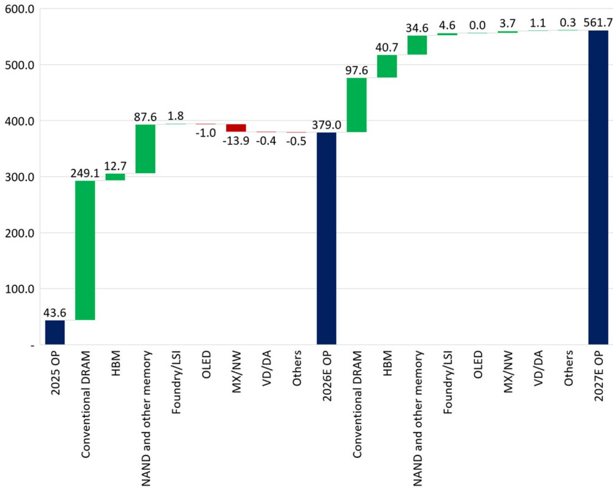
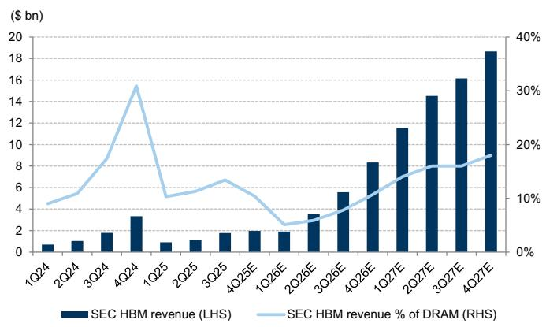
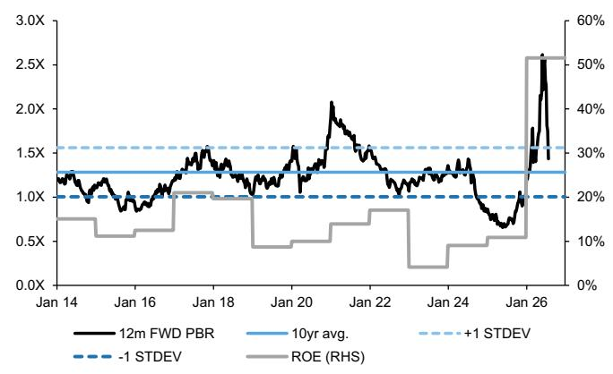
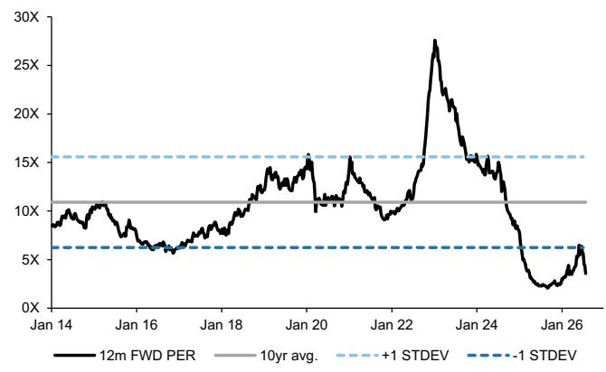

# Samsung Electronics (005930.KS)

# 业绩回顾：2Q26营业利润符合预告，存储基本面稳健，估值具备吸引力；上调目标价至490,000韩元，维持报告评级

<table><tr><td>005930.KS</td><td>12个月目标价：490,000韩元</td><td>现价：207,000韩元</td><td>潜在空间：136.7%</td></tr><tr><td>005935.KS</td><td>12个月目标价：360,000韩元</td><td>现价：151,000韩元</td><td>潜在空间：138.4%</td></tr></table>

2Q26营业利润符合预期，DRAM/NAND利润率环比改善，尽管计提了特别奖金

三星电子（SEC）公布2Q26营收为171.5万亿韩元，营业利润为89.5万亿韩元，与此前业绩预告的171万亿韩元/89.4万亿韩元基本一致。存储业务利润在业绩预告后基本符合我们的预期，我们认为存储定价的稳健增长推动DRAM营业利润率环比提升至接近80%，NAND营业利润率超过60%，尽管本季度计提了特别奖金。

尽管过去一个月公司报价回调接近40%，但我们认为公司核心基本面并未发生实质性变化——存储需求持续显著超过供给，供需缺口预计在2027年扩大并延续至2028年；长期协议（LTA）正在签署，有助于保护下行风险；公司在HBM业务方面持续取得进展，目前目标是成为市场领导者。加上股东回报存在显著提升的潜力，我们对该标的保持积极看法，当前基于2027年预测的估值水平为3.1倍市盈率和1.2倍市净率，净资产回报率接近50%。维持报告评级，12个月目标价上调至490,000韩元（此前为480,000韩元）。

## 主要要点

■ AI服务器需求持续强劲，带动位元出货增长和低库存水平：公司积极应对AI服务器带来的强劲存储需求，本季度服务器收入占比创下历史新高（我们估计接近DRAM位元出货量的一半）。围绕服务器需求的强劲表现，公司DRAM位元出货量超出指引（环比增长低双位数百分比，而指引为环比增长中个位数百分比），我们估计库存水平仅为2-3周，低于正常库存水平。

■ 2027年存储供需将比2026年更为紧张，紧张态势预计延续至2028年：公司观察到代理式AI的扩展带动token需求指数级增长，进而推动AI服务器和通用服务器需求强劲增长。尽管供应商努力增加资本开支建设新产能，但由于产能释放需要较长的前置时间，公司预计2028年前供给不会出现显著增加。此外，根据公司看到的客户预订需求，公司继续预计今年供需失衡将在2027年扩大，紧张态势预计延续至2028年。

■ 长期协议（LTA）进展好于预期：公司提到存储供应紧张导致客户寻求签订长期协议，鉴于可用供应有限，公司正在优先与能够保证长期需求的客户进行讨论。公司的LTA讨论通常以五年为期限，采用滚动合同结构，每年进行谈判以延长合同期限一年。公司还披露已完成与全球前五大数据中心客户的合同签订，目前正在与另外五家与AI需求相关的大型客户进行最后阶段的谈判。一旦合同最终确定，多年期合同量预计将达到计划产能的约60-70%。为增强合同的约束力，公司正在纳入以多年期保证金形式存在的大额预付款。LTA采用不同的定价模式，视客户群体和产品类别而定，对于通用产品，公司设定的底价水平足以应对未来市场价格波动可能带来的投资风险。根据近期与读者的交流，我们认为公司披露的LTA细节和条款好于预期，并预计这些LTA将有助于提供比以往周期更好的盈利可见性和稳定性。

■ HBM领导地位的信心：公司旨在维持HBM与传统DRAM之间的均衡供应组合，不受这两种产品利润率差距的影响，以支持持续的AI需求。同时，公司在HBM业务方面持续看到显著改善，我们估计2Q26收入环比增长超过80%，得益于HBM3E和HBM4的稳健出货，并认为公司有望实现今年HBM销售增长超过3倍。公司预计3Q26 HBM4收入环比增长超过3倍，并预计2H26 HBM4占HBM收入比例将超过60%。因此，公司目标是在2H26实现与DRAM市场份额相当的HBM市场份额，这意味着其目标是成为AI存储领域的市场份额领导者。

## ■ 特别股东回报公告可能即将发布

尽管市场对此有所期待（根据我们与读者的交流），希望公司更新股东回报计划并可能宣布特别股息和/或回购，但公司在业绩电话会议上未提供新的更新。不过，公司确实提到目前正在进行内部深入讨论，并正在考虑包括特别股息在内的多种方案，计划在不久的将来提供更新。我们继续认为公司强劲的自由现金流产生能力可能带来股东回报前景的显著提升。

## 上调盈利预测和目标价至490,000韩元；维持报告评级

主要反映传统DRAM、HBM和NAND位元出货假设上调以及DRAM利润率预测上调，部分被DRAM/NAND平均售价预测小幅下调所抵消，我们将2026E-2028E每股盈利预测上调约2%。相应地，我们将基于SOTP的2026E-2027E平均12个月目标价上调至490,000韩元（此前为480,000韩元）。

尽管过去一个月公司报价回调接近40%，但我们认为公司核心基本面并未发生实质性变化——存储需求持续显著超过供给，供需缺口预计在2027年扩大并延续至2028年；长期协议正在签署，有助于保护下行风险；公司在HBM业务方面持续取得进展，目前目标是成为市场领导者。加上股东回报存在显著提升的潜力，我们对该标的保持积极看法，当前基于2027年预测的估值水平为3.1倍市盈率和1.2倍市净率，净资产回报率接近50%，维持报告评级。

对于优先股（005935.KS，买入），我们维持12个月目标价360,000韩元，应用目标优先股折价率27%（此前为25%），该折价率由以下两项平均得出：1）双因子模型的优先股折价，2）过去1个月优先股相对普通股的平均折价。主要风险包括：1）存储供需格局显著恶化，2）智能手机利润率大幅收缩，3）移动OLED市场份额流失。

Exhibit 1: SEC营业利润瀑布图（万亿韩元）

来源：公司数据，GS全球投资研究

Exhibit 2: SEC季度营业利润

来源：公司数据，GS全球投资研究

Exhibit 3: SEC HBM收入及占DRAM总收入比例

来源：公司数据，GS全球投资研究

Exhibit 4: SEC当前交易于1.4倍12个月远期市净率，2026E/2027E净资产回报率为52%/48%
SEC 12个月远期市净率 vs. 净资产回报率

来源：Bloomberg，公司数据，GS全球投资研究

Exhibit 5: SEC当前交易于3.6倍12个月远期市盈率
SEC 12个月远期市盈率

来源：Bloomberg，公司数据，GS全球投资研究

Exhibit 6: SEC DRAM关键假设

<table><tr><td>DRAM：关键假设</td><td>1Q26</td><td>2Q26</td><td>3Q26E</td><td>4Q26E</td><td>1Q27E</td><td>2Q27E</td><td>3Q27E</td><td>4Q27E</td><td>2024</td><td>2025</td><td>2026E</td><td>2027E</td><td>2028E</td></tr><tr><td>平均售价（美元，1Gb等效）</td><td>1.1</td><td>1.6</td><td>1.9</td><td>2.0</td><td>2.2</td><td>2.2</td><td>2.3</td><td>2.2</td><td>0.4</td><td>0.4</td><td>1.7</td><td>2.2</td><td>2.3</td></tr><tr><td>环比变化（%）</td><td>93%</td><td>44%</td><td>14%</td><td>6%</td><td>9%</td><td>3%</td><td>1%</td><td>-4%</td><td>61%</td><td>22%</td><td>283%</td><td>32%</td><td>2%</td></tr><tr><td>出货量（百万，1Gb等效）</td><td>32,750</td><td>36,200</td><td>38,010</td><td>39,150</td><td>37,858</td><td>40,508</td><td>44,478</td><td>47,592</td><td>106,580</td><td>116,450</td><td>146,110</td><td>170,437</td><td>207,058</td></tr><tr><td>环比变化（%）</td><td>2%</td><td>11%</td><td>5%</td><td>3%</td><td>-3%</td><td>7%</td><td>10%</td><td>7%</td><td>14%</td><td>9%</td><td>25%</td><td>17%</td><td>21%</td></tr><tr><td>晶圆产能（WPM，12英寸等效）</td><td>680</td><td>700</td><td>750</td><td>770</td><td>800</td><td>810</td><td>800</td><td>820</td><td>616</td><td>655</td><td>725</td><td>808</td><td>878</td></tr><tr><td>环比变化（%）</td><td>5%</td><td>3%</td><td>7%</td><td>3%</td><td>4%</td><td>1%</td><td>-1%</td><td>2%</td><td>9%</td><td>6%</td><td>11%</td><td>11%</td><td>9%</td></tr><tr><td>销售额（万亿韩元）</td><td>54.9</td><td>89.5</td><td>104.2</td><td>112.2</td><td>112.9</td><td>124.4</td><td>138.3</td><td>142.0</td><td>52.4</td><td>72.7</td><td>360.7</td><td>517.6</td><td>629.9</td></tr><tr><td>环比变化（%）</td><td>100%</td><td>63%</td><td>16%</td><td>8%</td><td>1%</td><td>10%</td><td>11%</td><td>3%</td><td>92%</td><td>39%</td><td>396%</td><td>43%</td><td>22%</td></tr><tr><td>营业利润（万亿韩元）</td><td>43.0</td><td>70.3</td><td>85.2</td><td>92.6</td><td>94.4</td><td>103.9</td><td>114.8</td><td>116.3</td><td>16.2</td><td>29.3</td><td>291.1</td><td>429.4</td><td>513.7</td></tr><tr><td>环比变化（%）</td><td>181%</td><td>64%</td><td>21%</td><td>9%</td><td>2%</td><td>10%</td><td>10%</td><td>1%</td><td>-1574%</td><td>81%</td><td>893%</td><td>47%</td><td>20%</td></tr><tr><td>营业利润率（%）</td><td>78%</td><td>79%</td><td>82%</td><td>83%</td><td>84%</td><td>84%</td><td>83%</td><td>82%</td><td>31%</td><td>40%</td><td>81%</td><td>83%</td><td>82%</td></tr></table>

来源：公司数据，GS全球投资研究

Exhibit 7: SEC NAND关键假设

<table><tr><td>NAND：关键假设</td><td>1Q26</td><td>2Q26</td><td>3Q26E</td><td>4Q26E</td><td>1Q27E</td><td>2Q27E</td><td>3Q27E</td><td>4Q27E</td><td>2024</td><td>2025</td><td>2026E</td><td>2027E</td><td>2028E</td></tr><tr><td>平均售价（美元，16Gb等效）</td><td>0.3</td><td>0.5</td><td>0.6</td><td>0.6</td><td>0.7</td><td>0.7</td><td>0.6</td><td>0.6</td><td>0.1</td><td>0.1</td><td>0.5</td><td>0.6</td><td>0.6</td></tr><tr><td>环比变化（%）</td><td>89%</td><td>67%</td><td>17%</td><td>9%</td><td>5%</td><td>2%</td><td>-5%</td><td>-7%</td><td>63%</td><td>-8%</td><td>278%</td><td>28%</td><td>-10%</td></tr><tr><td>出货量（百万，16Gb等效）</td><td>46,200</td><td>46,600</td><td>49,862</td><td>47,868</td><td>48,346</td><td>51,247</td><td>55,859</td><td>59,211</td><td>163,000</td><td>168,000</td><td>190,530</td><td>214,663</td><td>252,561</td></tr><tr><td>环比变化（%）</td><td>8%</td><td>1%</td><td>7%</td><td>-4%</td><td>1%</td><td>6%</td><td>9%</td><td>6%</td><td>12%</td><td>3%</td><td>13%</td><td>13%</td><td>18%</td></tr><tr><td>晶圆产能（WPM，12英寸等效）</td><td>405</td><td>400</td><td>400</td><td>400</td><td>400</td><td>390</td><td>370</td><td>350</td><td>483</td><td>435</td><td>401</td><td>378</td><td>380</td></tr><tr><td>环比变化（%）</td><td>-1%</td><td>-1%</td><td>0%</td><td>0%</td><td>0%</td><td>-3%</td><td>-5%</td><td>-5%</td><td>-3%</td><td>-10%</td><td>-8%</td><td>-6%</td><td>1%</td></tr><tr><td>销售额（万亿韩元）</td><td>19.8</td><td>34.1</td><td>41.5</td><td>42.8</td><td>43.2</td><td>46.7</td><td>48.4</td><td>47.7</td><td>31.6</td><td>31.3</td><td>138.3</td><td>186.1</td><td>195.2</td></tr><tr><td>环比变化（%）</td><td>106%</td><td>72%</td><td>22%</td><td>3%</td><td>1%</td><td>8%</td><td>4%</td><td>-1%</td><td>90%</td><td>-1%</td><td>342%</td><td>35%</td><td>5%</td></tr><tr><td>营业利润（万亿韩元）</td><td>11.5</td><td>21.4</td><td>27.9</td><td>29.6</td><td>30.0</td><td>32.4</td><td>32.4</td><td>30.1</td><td>4.0</td><td>2.7</td><td>90.3</td><td>124.9</td><td>124.9</td></tr><tr><td>环比变化（%）</td><td>384%</td><td>85%</td><td>30%</td><td>6%</td><td>2%</td><td>8%</td><td>0%</td><td>-7%</td><td>-135%</td><td>-33%</td><td>3288%</td><td>38%</td><td>0%</td></tr><tr><td>营业利润率（%）</td><td>58%</td><td>63%</td><td>67%</td><td>69%</td><td>69%</td><td>69%</td><td>67%</td><td>63%</td><td>13%</td><td>9%</td><td>65%</td><td>67%</td><td>64%</td></tr></table>

来源：公司数据，GS全球投资研究

Exhibit 8: SEC盈利预测调整

<table><tr><td rowspan="2">（万亿韩元）</td><td colspan="4">调整后</td><td colspan="4">调整前</td><td colspan="4">变动幅度</td></tr><tr><td>2Q26</td><td>FY26E</td><td>FY27E</td><td>FY28E</td><td>2Q26P</td><td>FY26E</td><td>FY27E</td><td>FY28E</td><td>2Q26</td><td>FY26E</td><td>FY27E</td><td>FY28E</td></tr><tr><td>销售额</td><td>171.50</td><td>720.05</td><td>928.29</td><td>1,056.6</td><td>171.00</td><td>712.03</td><td>918.60</td><td>1,045.7</td><td>0.3%</td><td>1.1%</td><td>1.1%</td><td>1.0%</td></tr><tr><td>DS（半导体）</td><td>127.50</td><td>525.41</td><td>735.15</td><td>858.97</td><td>129.64</td><td>519.75</td><td>720.58</td><td>840.52</td><td>-1.7%</td><td>1.1%</td><td>2.0%</td><td>2.2%</td></tr><tr><td>半导体</td><td>127.50</td><td>525.39</td><td>735.11</td><td>858.93</td><td>129.63</td><td>519.72</td><td>720.54</td><td>840.48</td><td>-1.6%</td><td>1.1%</td><td>2.0%</td><td>2.2%</td></tr><tr><td>存储</td><td>120.80</td><td>496.58</td><td>704.27</td><td>825.68</td><td>122.40</td><td>490.22</td><td>689.53</td><td>807.05</td><td>-1.3%</td><td>1.3%</td><td>2.1%</td><td>2.3%</td></tr><tr><td>DRAM</td><td>89.50</td><td>360.74</td><td>517.61</td><td>629.88</td><td>87.96</td><td>351.38</td><td>498.81</td><td>606.99</td><td>1.8%</td><td>2.7%</td><td>3.8%</td><td>3.8%</td></tr><tr><td>NAND</td><td>34.10</td><td>138.25</td><td>186.06</td><td>195.15</td><td>34.34</td><td>138.42</td><td>190.27</td><td>199.58</td><td>-0.7%</td><td>-0.1%</td><td>-2.2%</td><td>-2.2%</td></tr><tr><td>系统LSI/代工</td><td>6.70</td><td>28.81</td><td>30.85</td><td>33.25</td><td>7.23</td><td>29.50</td><td>31.02</td><td>33.43</td><td>-7.3%</td><td>-2.3%</td><td>-0.5%</td><td>-0.5%</td></tr><tr><td>SDC（显示面板）</td><td>7.49</td><td>31.08</td><td>29.20</td><td>28.83</td><td>7.55</td><td>31.63</td><td>29.73</td><td>29.34</td><td>-0.8%</td><td>-1.7%</td><td>-1.8%</td><td>-1.7%</td></tr><tr><td>AM OLED</td><td>7.49</td><td>31.08</td><td>29.20</td><td>28.83</td><td>7.55</td><td>31.63</td><td>29.73</td><td>29.34</td><td>-0.8%</td><td>-1.7%</td><td>-1.8%</td><td>-1.7%</td></tr><tr><td>DX</td><td>47.73</td><td>192.28</td><td>182.07</td><td>186.12</td><td>46.28</td><td>185.63</td><td>174.83</td><td>179.66</td><td>3.1%</td><td>3.6%</td><td>4.1%</td><td>3.6%</td></tr><tr><td>MX/NW（移动、网络）</td><td>33.20</td><td>135.22</td><td>125.55</td><td>128.67</td><td>31.62</td><td>128.05</td><td>117.96</td><td>121.77</td><td>5.0%</td><td>5.6%</td><td>6.4%</td><td>5.7%</td></tr><tr><td>移动</td><td>32.34</td><td>132.28</td><td>122.22</td><td>125.26</td><td>31.03</td><td>125.49</td><td>114.86</td><td>118.55</td><td>4.2%</td><td>5.4%</td><td>6.4%</td><td>5.7%</td></tr><tr><td>手机</td><td>25.55</td><td>105.43</td><td>96.68</td><td>99.58</td><td>24.60</td><td>99.31</td><td>89.34</td><td>92.76</td><td>3.9%</td><td>6.2%</td><td>8.2%</td><td>7.3%</td></tr><tr><td>PC</td><td>4.79</td><td>18.81</td><td>18.05</td><td>17.91</td><td>4.56</td><td>18.39</td><td>18.08</td><td>18.07</td><td>5.1%</td><td>2.3%</td><td>-0.2%</td><td>-0.9%</td></tr><tr><td>平板</td><td>2.00</td><td>8.04</td><td>7.49</td><td>7.76</td><td>1.87</td><td>7.80</td><td>7.44</td><td>7.71</td><td>6.7%</td><td>3.1%</td><td>0.7%</td><td>0.7%</td></tr><tr><td>设备及其他</td><td>0.86</td><td>2.94</td><td>3.33</td><td>3.42</td><td>0.59</td><td>2.55</td><td>3.10</td><td>3.22</td><td>46.3%</td><td>15.1%</td><td>7.3%</td><td>6.2%</td></tr><tr><td>VD/DA（视觉显示、家电）</td><td>14.53</td><td>57.06</td><td>56.52</td><td>57.45</td><td>14.66</td><td>57.59</td><td>56.87</td><td>57.90</td><td>-0.9%</td><td>-0.9%</td><td>-0.6%</td><td>-0.8%</td></tr><tr><td>视觉显示</td><td>7.70</td><td>31.24</td><td>30.32</td><td>30.92</td><td>7.60</td><td>30.98</td><td>30.04</td><td>30.86</td><td>1.3%</td><td>0.8%</td><td>0.9%</td><td>0.2%</td></tr><tr><td>家电及其他</td><td>6.83</td><td>25.82</td><td>26.20</td><td>26.52</td><td>7.06</td><td>26.61</td><td>26.83</td><td>27.04</td><td>-3.3%</td><td>-2.9%</td><td>-2.4%</td><td>-1.9%</td></tr><tr><td>哈曼</td><td>4.55</td><td>17.77</td><td>17.87</td><td>18.70</td><td>4.23</td><td>17.45</td><td>17.45</td><td>18.14</td><td>7.6%</td><td>1.8%</td><td>2.4%</td><td>3.1%</td></tr><tr><td>营业利润</td><td>89.49</td><td>379.01</td><td>561.69</td><td>650.24</td><td>89.40</td><td>374.75</td><td>551.10</td><td>637.95</td><td>0.1%</td><td>1.1%</td><td>1.9%</td><td>1.9%</td></tr><tr><td>DS（半导体）</td><td>89.20</td><td>376.10</td><td>553.61</td><td>640.37</td><td>88.87</td><td>369.61</td><td>540.54</td><td>625.31</td><td>0.4%</td><td>1.8%</td><td>2.4%</td><td>2.4%</td></tr><tr><td>半导体</td><td>89.20</td><td>376.08</td><td>553.57</td><td>640.33</td><td>88.86</td><td>369.58</td><td>540.50</td><td>625.27</td><td>0.4%</td><td>1.8%</td><td>2.4%</td><td>2.4%</td></tr><tr><td>存储</td><td>91.64</td><td>381.39</td><td>554.30</td><td>638.58</td><td>91.83</td><td>374.92</td><td>541.07</td><td>623.39</td><td>-0.2%</td><td>1.7%</td><td>2.4%</td><td>2.4%</td></tr><tr><td>DRAM</td><td>70.32</td><td>291.11</td><td>429.37</td><td>513.68</td><td>69.96</td><td>283.98</td><td>412.35</td><td>494.32</td><td>0.5%</td><td>2.5%</td><td>4.1%</td><td>3.9%</td></tr><tr><td>NAND</td><td>21.37</td><td>90.33</td><td>124.92</td><td>124.88</td><td>21.86</td><td>90.94</td><td>128.71</td><td>129.06</td><td>-2.2%</td><td>-0.7%</td><td>-2.9%</td><td>-3.2%</td></tr><tr><td>系统LSI/代工</td><td>(2.44)</td><td>(5.32)</td><td>(0.73)</td><td>1.75</td><td>(2.97)</td><td>(5.35)</td><td>(0.57)</td><td>1.88</td><td>不适用</td><td>不适用</td><td>不适用</td><td>-7.2%</td></tr><tr><td>SDC（显示面板）</td><td>0.70</td><td>3.16</td><td>3.17</td><td>3.36</td><td>0.60</td><td>3.20</td><td>3.30</td><td>3.45</td><td>16.0%</td><td>-1.3%</td><td>-3.7%</td><td>-2.7%</td></tr><tr><td>AM OLED</td><td>0.70</td><td>3.16</td><td>3.17</td><td>3.36</td><td>0.60</td><td>3.20</td><td>3.30</td><td>3.45</td><td>16.0%</td><td>-1.3%</td><td>-3.7%</td><td>-2.7%</td></tr><tr><td>DX</td><td>(0.75)</td><td>(1.52)</td><td>3.33</td><td>4.94</td><td>(0.45)</td><td>0.55</td><td>5.71</td><td>7.65</td><td>不适用</td><td>不适用</td><td>-41.6%</td><td>-35.4%</td></tr><tr><td>MX/NW（移动、网络）</td><td>(0.74)</td><td>(0.97)</td><td>2.78</td><td>4.02</td><td>(0.32)</td><td>0.89</td><td>4.88</td><td>6.69</td><td>不适用</td><td>不适用</td><td>-43.1%</td><td>-39.9%</td></tr><tr><td>移动</td><td>(0.83)</td><td>(1.26)</td><td>2.40</td><td>3.62</td><td>(0.38)</td><td>0.64</td><td>4.53</td><td>6.31</td><td>不适用</td><td>不适用</td><td>-47.0%</td><td>-42.7%</td></
