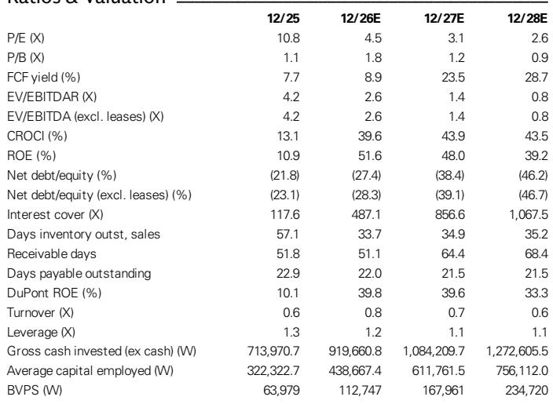
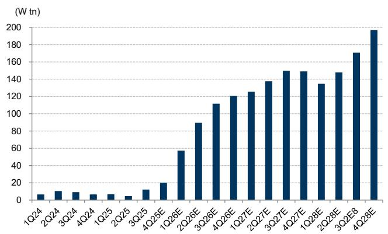

# GS：三星电子业务与季度数据观察

三星电子在2Q26交出与预告一致的业绩：营收171.5万亿韩元，营业利润89.5万亿韩元。这份GS研报的核心判断是，公司基本面没有因为近一个月约40%的价格回调而改变——存储需求持续显著超过供给，长期协议（LTA）正在锁定节奏变化不确定性，HBM业务仍在改善。

真正值得关注的不是季度数字本身，而是数字背后的结构变化。DRAM营业利润率环比提升至接近80%，NAND超过60%，这一水平即便在扣除当季特殊奖金拨备后依然成立。服务器需求占DRAM出货比重创下新高，接近一半。公司DRAM位元出货量环比增长低双位数，超过此前中个位数增长的指引，库存降至仅2-3周，低于正常水平。

## 1. 2027年存储供需缺口预计比2026年更大

报告认为，2027年对存储行业而言是比2026年更紧的一年，且紧张状态可能延续到2028年。三星电子看到agentic AI的扩展带来token需求指数级增长，进而拉动AI服务器和通用服务器需求。尽管供应商在增加资本开支建设新产能，但由于交付周期较长，2028年之前供给难以出现有意义的增加。

基于客户预订需求，公司预计今年的供需失衡将在2027年扩大。这一判断与市场部分观点不同——有人担心高利润会推动供给快速释放，但报告认为存储扩产的物理周期限制了短期供给弹性。

> **KC评论：** 这里的关键不是2026年有多好，而是2027年供需缺口比2026年更大。如果这个判断成立，存储价格的支撑时间会比多数人预期的更长。

## 2. 长期协议覆盖六至七成计划产能

存储紧缺正在改变客户行为。三星电子披露，客户开始主动要求签订长期协议。公司通常以五年为期限、滚动续约的方式谈判，每年协商延长一年。目前已完成与全球前五大数据中心客户的合同，另有五家与AI需求相关的大型客户处于谈判最后阶段。

一旦合同全部落地，多年期合同量预计达到计划产能的60-70%。为增强约束力，公司加入了多年期预付保证金条款。通用产品设置了最低价格，以覆盖未来市场价格波动带来的研究不确定性。报告认为，这些LTA条款细节好于读者预期，将提供比以往周期更清晰的盈利可见度。

这一变化值得行业观察者留意：存储行业的定价机制正在从现货市场主导转向合约市场主导，对下游客户而言，锁定供应意味着接受更长的承诺周期；对三星电子而言，盈利波动性可能系统性下降。

## 3. HBM4收入预计三季度环比增长三倍以上

三星电子在HBM业务上的进展是报告另一条主线。2Q26 HBM收入环比增长超过80%，HBM3E和HBM4出货均表现扎实。公司预计HBM4收入在3Q26环比增长三倍以上，并在2H26占HBM收入超过60%。

公司目标是在2H26实现与DRAM市场份额相近的HBM市场份额。考虑到三星电子在DRAM市场的地位，这意味着其目标直指AI存储市场份额第一。报告同时指出，公司计划在HBM和传统DRAM之间保持均衡的供给结构，不单纯追逐两者之间的利润率差异。

## 4. 股东回报方案可能临近公布

三星电子在本次业绩电话会上没有更新股东回报计划，但管理层表示内部正在深入讨论，包括特别股息等选项，并计划在近期提供更新。报告认为，公司强劲的自由现金流生成能力可能带来股东回报预期的显著上行空间。

从现金流数据看，2026年预计自由现金流118.5万亿韩元，2027年预计313.2万亿韩元，2028年预计381.8万亿韩元。净现金头寸持续扩大，2027年预计净债务/权益比降至-38.4%。这些数字为特别股息或回购提供了财务基础。

> **KC评论：** 存储周期上行叠加HBM放量，三星电子的现金流创造能力已经进入另一个量级。股东回报方案如果落地，可能成为市场重新评估这家公司的重要催化剂。

报告小幅上调2026-2028年每股盈利预期约2%，主要反映DRAM、HBM和NAND位元出货假设上调，以及DRAM利润率预期提高，部分被DRAM/NAND均价假设下调所抵消。当前报价对应2027年预期市盈率3.1倍、市净率1.2倍，预期ROE接近50%。

For informational purposes only. Portions may be generated,translated,summarized,or edited with AI assistance based on source materials and may contain omissions or errors. Please verify independently. This is not investment,legal,tax,accounting,or other professional advice.

For informational purposes only. Portions may be generated,translated,summarized,or edited with AI assistance based on source materials and may contain omissions or errors. Please verify independently. This is not investment,legal,tax,accounting,or other professional advice.

