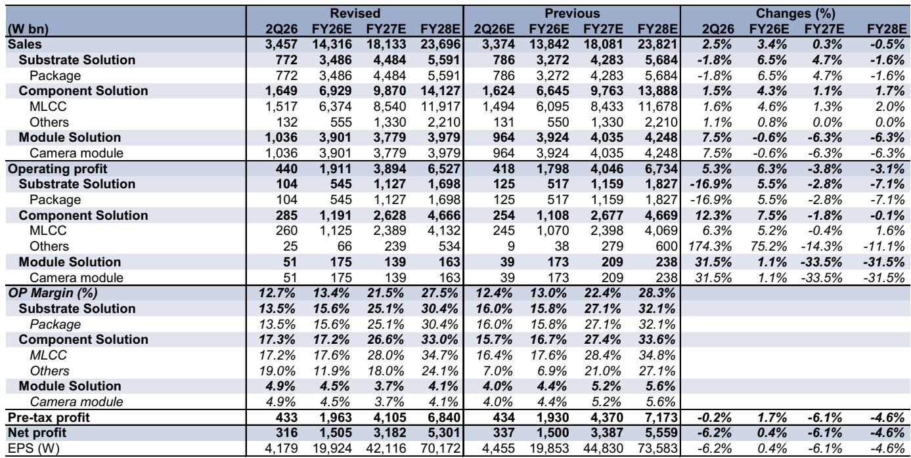
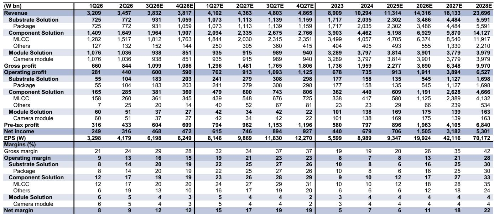
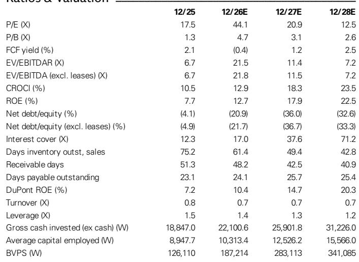

# AI供应链的定价权已转向被动元件，三星电机是风向标

三星电机公布2026年第二季度营业利润为4400亿韩元，高于分析师预期的4180亿韩元和市场一致预期的4210亿韩元，营收达3.5万亿韩元。超预期表现来自MLCC和摄像头模组盈利能力好于预期，而非出货量意外。这一区别很重要：它表明定价权——而不仅仅是需求——已经回归被动元件行业。

公司股价目前报87万韩元，尽管业绩超预期，近期仍出现回调。基本面强劲与价格走势疲弱之间的张力，为观察者提出了核心问题：市场是在定价周期顶部，还是忽略了元件供应链的结构性重估？

答案取决于财报中记录的三项进展：MLCC收入环比增长19%、同比增长44%，由AI数据中心和汽车需求驱动；公司预计其最高容值MLCC产品明年需求将增长七倍；多家全球云服务提供商正在寻求固定价格的长期协议。这些并非典型的周期信号，而是供应链围绕AI基础设施建设重新自我调整的标志。

## 业绩超预期背后是更重要的转变：管理层对定价的态度已明确转向积极

二季度数字本身不如它们所揭示的管理层行为重要。三星电机明确表示，面对供应趋紧和强劲的AI服务器需求，将“更积极地响应定价”。这与公司历史上的做法——在MLCC业务中优先考虑市场份额和客户关系而非价格纪律——形成了有意义的转变。

定价表态伴随着具体的需求信号：公司预计其1005 47μF MLCC产品明年需求将增长七倍。这不是泛泛的“AI在增长”的表述，而是一个具体到产品层面的预测，表明公司看到AI服务器的规格要求正在发生阶跃式变化。更高容值、更小尺寸、更高功率密度是AI数据中心所用MLCC的典型特征，这些产品享有溢价。

包含MLCC业务的元件解决方案部门，二季度营业利润率扩大至百分之十几区间。这是该公司近年来未能持续维持的水平，反映了向AI和汽车应用的结构性转变。该部门在1.649万亿韩元营收基础上实现2850亿韩元营业利润，利润率为17.3%。公司整体营业利润率为12.7%。

管理层对三季度的指引更为积极：分析师将三季度营业利润预期从5290亿韩元上调至6000亿韩元，相当于环比增长36%、同比增长131%。公司预计这一势头将持续到四季度并进入2027年。这种信心并非模糊的乐观，而是有正在与客户签署的长期协议作为支撑。

## 固定价格长期协议将MLCC从周期性大宗商品转变为高可见度业务

这份财报中最被低估的进展是关于长期协议的细节。三星电机已与全球云服务提供商和半导体公司签署了约10份MLCC长期协议，并正在积极回应更多请求。这些协议通常为一年期固定价格，这意味着公司在该业务中锁定了此前从未有过的收入和利润率可见度。

战略逻辑很清晰。AI基础设施建造者需要高规格MLCC的供应保障，他们愿意以固定价格承诺来确保供应。元件制造商则获得盈利可见度，并免受被动元件行业历史上典型的繁荣-萧条周期影响。长期协议结构使双方激励一致：客户获得关键元件的供应确定性，供应商获得支撑产能投资的定价稳定性。

同样的动态也发生在FC-BGA基板——另一个关键增长驱动上。公司正在与大多数主要AI和数据中心参与者进行长期协议讨论，这些协议以资本支出赞助的形式构建。客户实质上是在共同出资支持产能扩张，以换取供应保障。这是基板业务风险特征的重大变化——该业务历来需要巨额资本支出却没有需求保障。

FC-BGA利用率预计将在2026年下半年达到满产。届时，公司收入增长能力将完全取决于新产能的上线。带有资本支出赞助的长期协议结构降低了扩张的财务风险，同时确保了填充产能的需求。基板解决方案部门收入估计环比增长9%、同比增长60%，公司预计下半年将继续强劲增长。

## 财务轨迹不是周期性的尖峰，而是回报加速的复合增长故事

本报告中的财务预测描述了一家正在经历根本性盈利转型的公司，而非周期性上行。收入预计从2025年的11.3万亿韩元增长至2026年的14.3万亿韩元、2027年的18.1万亿韩元和2028年的23.7万亿韩元。这对应2026年增长26.5%、2027年增长26.7%、2028年增长30.7%。三年约28%的年复合收入增长不是周期性现象。

利润率扩张更为显著。EBIT利润率预计从2025年的8.1%上升至2026年的13.4%、2027年的21.5%和2028年的27.5%。EBITDA利润率也呈现类似路径，同期从16.2%升至34.1%。公司不仅在增长收入，而且在以不断提高的盈利能力增长收入。这是定价权与经营杠杆相结合的标志。

资本回报指标也讲述着同样的故事。CROCI（投入资本现金回报率）预计从2025年的10.5%上升至2028年的23.5%。ROE预计同期从7.7%上升至22.5%。公司正在从一家赚取约等于资本成本的业务，转变为一笔投资能获得可观溢价回报的业务。正是这种转变驱动了分析师预期的盈利倍数扩张。

资产负债表支撑增长计划。公司预计2026年产生2.6万亿韩元经营现金流，到2028年升至5.7万亿韩元。资本支出预计2026年为2.9万亿韩元、2027年为3.5万亿韩元、2028年为4.0万亿韩元。公司在以内部资金支持产能扩张，同时建立预计到2027年达7.9万亿韩元的净现金头寸。股息预计从2025年的每股2350韩元增长至2028年的18500韩元，这一派息率约为盈利的26%，仍然保守。

## 观察框架：核心逻辑建立在三个可验证假设之上，每个都有明确的监测点

对三星电子的研究逻辑可以归结为三个假设，每个都可以通过可观察的数据点来验证。观察者应围绕这些假设建立自己的判断框架，并系统性地进行监测。

第一个假设是AI服务器对高容值MLCC的需求继续以预期速度增长。公司预计1005 47μF产品需求明年将增长七倍，这一预期具体且可检验。监测点是季度MLCC收入增长和公司关于订单可见度的评论。如果公司继续给出两位数的环比增长指引，假设成立。如果增长放缓至个位数，逻辑则被削弱。

第二个假设是长期协议结构能够维持，即客户履行固定价格和数量承诺。监测点是已签署的长期协议数量以及MLCC收入中合同覆盖的比例。公司已签署约10份MLCC长期协议，并正在与大多数主要AI和数据中心参与者就FC-BGA进行讨论。风险在于，如果供需平衡发生变化，客户可能寻求重新谈判条款，但当前供应紧张表明他们更可能延长和扩大协议。

第三个假设是公司能够在利润率不被稀释的情况下执行产能扩张。FC-BGA业务预计在2026年下半年达到满产，这将创造一个关键拐点。监测点是产能增加的速度和基板解决方案部门的营业利润率。如果公司能够在新产能上线的同时维持或扩大利润率，盈利轨迹是可信的。如果产能上线伴随利润率稀释，故事就会改变。

估值框架支持这一逻辑。股价对应12个月远期市盈率为30.6倍，相对意义上偏贵，但考虑到预期盈利增长则合理。假设盈利预期达成，市盈率预计将从2026年的44.1倍降至2027年的20.9倍和2028年的12.5倍。3.6倍的市净率对应2026年13%和2027年18%的预期ROE，表明市场并未充分定价回报改善。

## 谨慎观点确实存在但范围有限：风险集中在供给响应和需求持续性，而非执行层面

主要下行风险在于行业MLCC供给增加强于预期，以及AI服务器、汽车和智能手机需求弱于预期。这些是合理的担忧，值得认真对待。

供给方面，MLCC行业有产能扩张超过需求增长的历史，导致价格侵蚀和利润率压缩。当前的供应紧张可能吸引新进入者或触发现有参与者的激进扩张。公司的应对是长期协议结构，在竞争对手能够上线产能之前锁定价格和数量。风险在于长期协议只覆盖市场的一部分，现货市场仍易受供应过剩影响。

需求方面，如果AI应用的经济性未能如期实现，AI基础设施建设可能放缓。公司的增长预测假设全球云服务提供商持续投资数据中心产能。如果这些提供商因宏观环境压力或AI回报不及预期而减少资本支出，元件需求将走弱。高容值MLCC需求增长七倍是一个具体预测，在需求放缓的情况下将难以实现。

摄像头模组业务作为第三个部门，更多是不确定性的来源而非增长动力。收入预计从2026年的3.901万亿韩元下降至2027年的3.779万亿韩元，然后在2028年恢复至3.979万亿韩元。分析师在此次更新中下调了摄像头模组利润率预期，反映了竞争压力和智能手机市场的成熟特性。该部门不是核心逻辑的驱动力，但如果利润率进一步恶化，可能成为盈利拖累。

分析师还下调了FC-BGA利润率预期，这是一个值得注意的谨慎信号。基板解决方案部门预计2026年贡献5450亿韩元营业利润，高于二季度年化的1040亿韩元，但利润率假设比以前更为保守。公司在增加产能的同时能否扩大基板利润率，将是盈利预期能否达成的关键决定因素。

## 市场的怀疑创造了机会：股价尚未跟上盈利轨迹

股价报87.9万韩元，而12个月目标价为225万韩元。价格与目标之间的差距反映了市场对盈利增长可持续性、定价权持久性以及产能扩张执行风险的怀疑。分析师的研判表明这种怀疑可能并不恰当，但举证责任在公司一方，需要兑现其指引。

三季度将是第一个考验。分析师预计营业利润为6000亿韩元，相当于环比增长36%、同比增长131%。如果公司兑现这一预期，市场将需要调和强劲业绩与近期股价回调之间的矛盾。如果公司未达预期，谨慎观点将得到验证，股价可能进一步下行。

更长期的轨迹比任何单一季度都重要。公司预计营业利润从2026年的1.911万亿韩元增长至2027年的3.894万亿韩元和2028年的6.527万亿韩元。每股盈利轨迹更为显著，从2026年的19924韩元到2027年的42116韩元和2028年的70172韩元。如果这些预期达成，当前价位的股价将对应2028年盈利的12.5倍，这将是对市场的显著折价。

结构性论证具有说服力。AI基础设施需要不同类别的被动元件，而这些元件的供应商正在通过长期协议巩固其定价权。三星电机是少数拥有规模、技术和客户关系能够参与这一转变的公司之一。市场对周期性的关注忽略了供应链中的结构性变化，而这种误读创造了机会。

公司预计到2027年达到7.9万亿韩元的净现金头寸，为研究逻辑提供了底部支撑。即使盈利增长不及预期，资产负债表实力也限制了下行风险，并支持股息增长轨迹。预计到2028年每股18500韩元的股息，按当前价格计算对应2.1%的回报表现，单独来看并不突出，但与盈利增长结合时则具有意义。

观察框架是清晰的。核心逻辑建立在AI需求的持久性、长期协议结构的有效性以及产能扩张的执行力之上。每一项都可以通过可观察的数据点来验证。谨慎观点则基于供给响应和需求疲弱，这两者都会在同样的数据点中显现。不对称性有利于基本面支撑。

近期股价回调似乎是情绪驱动的波动，而非基本面恶化。业绩超预期、积极的定价表态和长期协议势头都支持分析师的判断。市场的怀疑可能会持续到公司交出多个季度的强劲业绩，但证据越来越多地支持这样一种观点：元件供应链已进入定价权和盈利可见性的新阶段。

*仅供参考。部分内容可能基于原始材料由AI辅助生成、翻译、摘要或编辑，可能存在遗漏或错误。请独立核实。本文不构成投资、法律、税务、会计或其他专业建议。*

仅供参考。部分内容可能基于原始材料由AI辅助生成、翻译、摘要或编辑，可能存在遗漏或错误。请独立核实。本文不构成投资、法律、税务、会计或其他专业建议。

