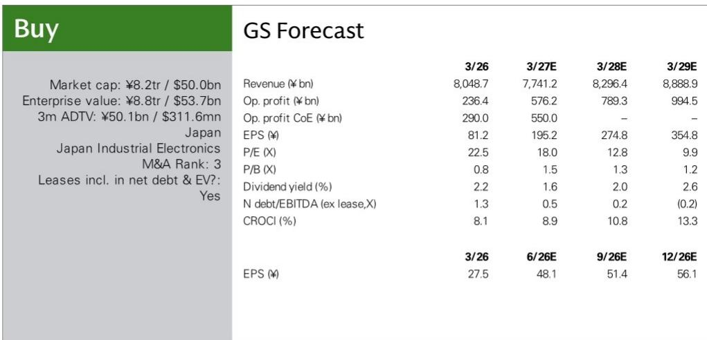
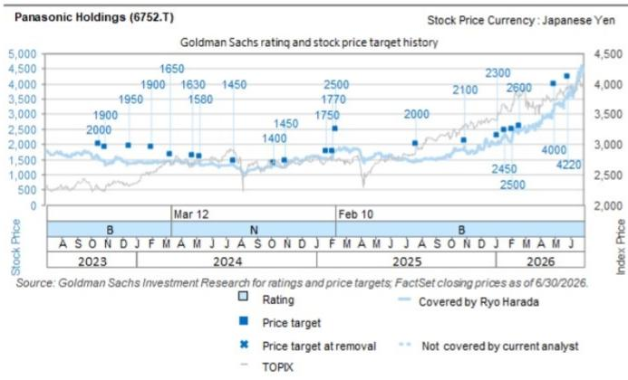

# 松下将闲置电动汽车电池产线改造为AI电源业务基石

松下控股近期战略中最值得关注的细节，并非新产品发布或大规模并购，而是7月下旬披露的一项计划：自2026财年（截至2027年3月）起，将其位于大阪府的电动汽车电池生产线改造为超级电容器的量产基地。这并非简单的产能置换，而是松下开始将包括利用率不足的汽车工厂在内的整体实物资产视为一个综合组合来运营的信号，其直接受益方向是生成式AI数据中心建设。

多年来，松下一直被视作依靠惯性维系多元业务的综合企业集团。汽车电池业务部门松下能源与工业元器件业务部门松下工业，长期以各自独立的文化、客户群和资本配置优先级运营。据报道，松下工业将在松下能源位于大阪的电动汽车电池工厂内量产超级电容器，这一决定打破了原有格局。这表明，常被批评缺乏战略一致性的控股公司架构，正被用作跨业务资产优化的机制。市场应予以关注，因为这是集团协同效应转化为工厂车间运营决策的首个具体证据，而不仅仅停留在读者日演示文稿中。

这一战略逻辑在多个层面具有说服力。大阪工厂此前为特斯拉Model S和Model X生产电池，这些车型正逐步退市或已停止生产。这些设施的利用率下降，固定成本被搁置。超级电容器作为AI数据中心电容备用单元（CBU）中日益关键的组件，代表着一个高增长应用领域，虽然需要不同的制造技能，但与电池制造共享基础生产技术原理。通过改造而非关闭生产线，松下可以将成本负担转化为收入机会，而无需建设全新超级电容器工厂所需的多年准备时间和资本支出。公司实际上是在利用自身的工业积淀进行套利。

这一举措还需放在更广泛的AI基础设施投资周期背景下理解。AI数据中心需要大量不间断电力来训练和运行模型。超大规模设施的电力故障不仅是麻烦，还可能中断持续数天的训练任务并造成数百万美元损失。CBU提供短时、高可靠性的备用电源，正成为这些设施的标准组件。需求曲线陡峭，松下正通过利用现有制造布局来占据这一市场份额。据报道，公司还计划于2027年2月至3月前后在北海道千岁市增加面向外部销售的超级电容器产量，进一步表明这并非小规模试验，而是向战略重要产品类别的审慎扩张。

对松下估值的影响比直接收入贡献更为显著。公司当前市净率约为0.8倍，这一折价反映了市场对管理层能否从其庞大资产基础中提取价值的怀疑。8.2万亿日元市值和8.8万亿日元企业价值，对应的是营业利润从2025财年的2364亿日元增长至2028财年的9945亿日元的预测。这一预计约四倍的利润增长，假设松下能够执行其业务组合改革和固定成本削减计划。超级电容器项目是支持这一假设的具体数据点。如果松下能够证明其可以跨业务部门重新配置资产以捕捉新兴需求，市场可能开始重新评估公司价值——不是因为超级电容器收入本身，而是因为它所传递的管理层执行更广泛战略议程能力的信号。

## 资产改造蓝图：将遗留问题转化为AI增长引擎

这一改造的具体机制值得审视。松下工业将在松下能源位于大阪府的电动汽车电池工厂量产超级电容器，利用“两家公司共享的生产技术基础”。这句话是关键所在。它意味着锂离子电池和超级电容器的制造工艺——电极涂布、卷绕、电解液注入和电芯组装——具有足够的共通性，熟练的劳动力队伍和现有洁净室环境可以通过可控的投资进行适配。这一点不容小觑。在资本昂贵、新技术产能扩张需要多年准备时间的时代，将现有高规格制造产能转化为新产品类别的能力，是难以复制的竞争优势。

时间节点同样具有参考价值。目标是在2026财年内开始量产，这意味着产线转换、设备改造和认证流程可能已在推进或计划于近期启动。对于此类制造跨界而言，这是一个相对紧凑的时间表。这表明松下内部已为此工作了一段时间，公开报道只是确认了一项低调进行的工程努力。大阪府有两座电动汽车电池工厂，具体是哪一座尚未披露，这是次要细节。重要的是松下已识别出闲置或利用率不足的产能，并制定了将其投入高增长应用的计划。

这一决定还凸显了控股公司模式中常被忽视的结构性优势。虽然松下能源和松下工业是各自拥有独立损益责任的运营公司，但母公司可以在符合集团战略利益时授权或激励合作。超级电容器项目是整体大于部分之和的典型案例。松下能源得以盘活闲置厂房空间，并可能保留原本可能被裁减的熟练制造人员。松下工业则无需从零建设新工厂即可获得产能，这原本需要更长时间和更多资本。控股公司则得以证明其组合逻辑超越了单纯的财务工程。

这并非没有风险。汽车电池业务一直在应对电动汽车需求放缓和价格压力，尤其是在特斯拉作为主要客户的圆柱形电池领域。报告指出，风险包括特斯拉增加使用其他公司生产的电池，导致更强的价格压力。通过将部分产能转向超级电容器，松下实际上是在对冲其对电动汽车市场波动的敞口。但这种对冲只有在超级电容器生产能够迅速达到足够规模和成本竞争力时才有效。公司押注AI数据中心需求周期将足够强劲以消化产出，并相信其制造专长能使其在尚未占据主导地位的产品类别中实现有竞争力的良率和成本结构。

## AI数据中心电源链路：电容备用单元为何是战略桥头堡

要理解这一举措的战略意义，有必要了解现代AI数据中心的电源架构。这些设施消耗大量电力，供电系统必须同时满足持续运行和瞬时切换的要求。传统不间断电源（UPS）依赖电池在主电网供电故障时提供备用电力。然而，AI工作负载的功率密度和响应时间要求正推动行业走向电池与超级电容器或混合电容器相结合的方式。超级电容器能在短时间内提供非常高的功率，非常适合在电力事件与更长时长的电池备用启动之间起到桥接作用。它们还拥有比电池长得多的循环寿命，这在电能质量事件可能频繁发生的应用中至关重要。

电容备用单元（CBU）是这一概念的产品化形态。它是一种机架式单元，提供瞬时功率支持，正成为下一代AI数据中心参考架构中的标准组件。松下决定将其超级电容器集成到面向AI数据中心的CBU中，正是对这一趋势的直接布局。公司不仅是在销售组件，而是在销售解决超大规模运营商关键痛点的方案。这使松下处于价值链中比单纯向第三方集成商销售超级电容器电芯更高价值的位置。

这一领域的竞争格局正在快速演变。报告指出，松下工业在生成式AI相关的混合电容器和电路板材料业务中面临更激烈的竞争。这是现实的评估。高性能电容器和电源管理组件的需求正在吸引新进入者，现有参与者也在扩大产能。松下的优势在于其制造规模、大规模生产储能设备的经验，以及利用汽车电池技术积累的能力。问题在于这些优势是否足以在市场扩张时维持定价能力和市场份额。

对更广泛供应链的二阶影响是显著的。如果松下成功将电动汽车电池产线改造为超级电容器生产，它将展示出其他制造商可以效仿的范本。这可能导致全球超级电容器产能更快速扩张，对寻求供应安全的数据中心运营商有利，但对缺乏松下这样制造规模的专业超级电容器制造商则可能构成挑战。随着传统电池制造商利用其规模和工艺专长进入相邻产品类别，储能行业的竞争格局可能发生变化。

## 跨业务协同作为估值催化剂：控股公司模式终于发挥作用

这里的理念转变是从综合企业折价到综合企业溢价。松下长期以低于各部分之和的价格交易，部分原因是市场看不到连接其消费电子、汽车电池、工业元器件和生活业务的一致战略。超级电容器项目提供了一个具体案例，说明控股公司如何通过促进运营公司之间的资源共享和战略协调来创造价值。这是能够开始改变读者认知的那类证据。

财务模型支持这一观点。从2025财年2364亿日元到2028财年9945亿日元的预测营业利润轨迹是雄心勃勃的，意味着利润率的显著改善。公司CROCI（现金投入现金回报率）预计同期从8.1%提升至13.3%。这些不是渐进式改善，而是资本效率的阶跃式变化。超级电容器项目是这一拼图的一部分，但它是重要的一块，因为它表明公司愿意做出大胆的运营决策来改善资产利用率。净债务与EBITDA之比预计从1.3倍变动至-0.2倍，表明公司将在2028财年末实现净现金为正。这为进一步的战略投资或股东回报提供了财务灵活性。

市场已开始认可这一转变。股价从2025年7月的约4400日元上涨至当前的约5000日元，反映出市场对公司转型信心的增强。超级电容器的消息如果得到确认并执行良好，将为这一重新评估提供进一步支撑。

这一论点存在风险。报告列出了若干风险，包括固定成本削减进展不及预期、重组过程中关键人员流失，以及业务组合改革进展慢于预期。超级电容器项目本身也承担执行风险，特别是产能爬坡时间表和实现有竞争力良率的能力。还存在AI数据中心需求周期在松下产能于2026财年上线之前见顶的风险，导致供应过剩和价格压力。然而，这一举措的基本逻辑是合理的：在具有强劲长期顺风的市场中，将搁浅资产转化为增长产能。

## 决策框架：松下执行资产重新配置时应关注什么

对于评估松下战略的读者而言，超级电容器项目为评估更广泛的转型提供了有用的模板。首先要关注的是执行速度。如果松下能按报道在2026财年开始量产，将证明公司能够从战略意图快速转向运营现实。任何重大延迟都会引发对公司执行更广泛组合改革能力的质疑。其次是超级电容器业务的利润率状况。如果改造后的产线能实现与汽车电池业务相当或更好的利润率，将验证松下通过将产能转向高增长应用来创造价值的论点。第三是客户管道。报告指出超级电容器将集成到AI数据中心的CBU中，但未披露具体客户。应关注设计中标或与主要数据中心运营商及其设备供应商签订供应协议的公告。

第四个因素是更广泛的组合逻辑。超级电容器项目不应孤立看待。它是包括电池备用单元（BBU）策略和更广泛AI相关基础设施布局在内的模式的一部分。如果松下能够继续识别和执行类似的跨业务机会，对盈利能力和估值的累积效应可能是可观的。第五是竞争回应。报告指出生成式AI相关混合电容器和电路板材料业务竞争加剧。如果竞争对手以激进的产能扩张或定价回应，松下在此项目上的回报可能被压缩。在竞争中维持定价能力将是检验公司战略定位的关键。

最后，应考虑资产负债表影响。报告预测松下将在2028财年末实现净现金为正，这将提供显著的财务灵活性。这可用于进一步的战略投资、收购或增加股东回报。股息率预计在预测期内从2.2%提升至2.6%，市盈率预计随着盈利增长从22.5倍压缩至9.9倍。估值重新评估将取决于市场对盈利增长可持续性的信心，超级电容器项目是支持这一信心的具体数据点。

## 工业套利的战略逻辑：将遗留产能转化为增长期权

超级电容器项目最好被理解为一种工业套利形式。松下正在将一项为特定目的设计、因汽车市场变化而部分搁浅的资产，转化为服务不同、更高增长目的的能力。这不是简单的产能利用率操作，而是对制造技术融合和AI基础设施需求持久性的战略押注。这一押注的成功将取决于很大程度上在松下可控范围内的因素：执行速度、良率改善、成本管理和客户认证。需求侧更不确定，但AI数据中心建设和电力可靠性要求的长期趋势提供了强劲的顺风。

集团协同角度是这一故事中最被低估的方面。多年来，市场将松下的运营公司视为由公司外壳维系在一起的独立实体。超级电容器项目表明，控股公司可以通过促进这些实体之间的合作来创造价值。这不是一次性事件，而是可以应用于其他产品类别和其他运营公司组合的模板。如果松下能够将这种跨业务资产优化方法制度化，长期压制股价的综合企业折价可能开始收窄。市场正开始将这一点纳入定价，这从近期的股价重新评估中可见一斑。

竞争影响超出松下本身。将电动汽车电池产线改造为超级电容器生产的能力可能重塑储能行业的竞争格局。传统超级电容器制造商可能发现自己要与规模更大、资本更雄厚、拥有成熟制造生态系统的进入者竞争。这可能导致行业整合或洗牌，较强者占据主导市场地位。对客户而言，这可能是积极的，因为竞争加剧应导致价格下降和产品可用性改善。对读者而言，关键问题是松下能否在这一转变中占据不成比例的价值份额。

报告对风险的承认具有参考意义。生成式AI相关电容器业务的竞争强度是真实的，松下需要在技术、质量和成本上进行差异化。公司在大规模制造储能设备方面的经验应能提供基础，但成功并非必然。2026财年产能爬坡的时间表是紧凑的，任何延误都可能让竞争对手建立更强地位。公司管理这些风险的能力将是决定超级电容器项目能否实现预期回报的关键因素。

## 组合逻辑：超级电容器如何融入松下更广泛的AI基础设施战略

超级电容器项目应被视为更广泛战略的一部分，该战略旨在将松下定位为AI基础设施建设的关键供应商。公司已活跃于AI数据中心的电池备用单元（BBU）领域，这是确保电力可靠性的关键组件。超级电容器和CBU的加入扩大了公司的可寻址市场，并深化了与数据中心运营商及其供应链的关系。共同主线是电源管理和储能，随着AI工作负载推动更高功率密度和更严格的可靠性要求，这些正变得越来越重要。

战略逻辑是提供从短时超级电容器到更长时电池的全面电源管理解决方案组合。这使松下能够作为数据中心电源备用需求的一站式供应商，在供应链复杂性和认证周期构成显著进入壁垒的行业中，这是有价值的。公司的制造规模和全球布局在成本竞争力和供应安全方面提供了额外优势。这些因素的结合可能使松下在AI数据中心电源基础设施市场中占据可观份额。

这一战略的财务影响可能在多年内逐步显现。超级电容器对收入和利润的直接贡献预计在初期是适度的，但战略定位比近期数字更重要。如果松下能够确立自己作为AI数据中心电源管理解决方案领先供应商的地位，收入和利润潜力是可观的。到2028财年营业利润增长至9945亿日元的预测表明，公司已开始看到战略重新定位的收益，超级电容器项目预计将为这一轨迹做出贡献。

这一战略的风险主要是竞争性和技术性的。电源管理市场竞争激烈，既有老牌参与者也有新进入者争夺位置。技术正在快速演进，松下需要投资研发以维持竞争优势。公司应对这些挑战的能力将决定其能否实现AI基础设施战略的全部潜力。报告的风险评估突出了关键关注领域，包括混合电容器业务的竞争，以及如果AI投资周期早于预期见顶则需求可能放缓的可能性。

## 执行考验：超级电容器产能爬坡将揭示松下转型的可信度

超级电容器项目是对松下执行战略计划能力的考验。公司有宣布雄心勃勃计划但结果参差不齐的历史，市场将密切关注超级电容器产能爬坡是否按计划推进。报道的2026财年时间表是紧凑的，公司需要证明其能够高效且经济地完成现有电动汽车电池产线的改造。与数据中心客户的认证过程可能严格，任何延误都可能推迟收入贡献并引发对公司执行能力的质疑。

这一举措的成功还取决于公司在不干扰现有运营的情况下管理转型的能力。大阪工厂一直在为特斯拉生产电池，转向超级电容器需要仔细规划以避免供应中断。公司与特斯拉的关系很重要，任何被认为对汽车电池业务关注不足的迹象都可能产生负面影响。报告指出特斯拉可能增加使用其他公司生产的电池，这是松下需要谨慎管理的风险。

这一举措的更广泛背景是公司的组合改革，涉及剥离表现不佳的业务并聚焦增长领域。超级电容器项目是后者的明确例证，表明公司愿意采取大胆行动捕捉新机遇。市场对这一举措的反应将是其对松下执行更广泛战略议程能力信心的重要指标。近期股价的重新评估表明信心正在建立，但超级电容器产能爬坡将提供具体考验，检验这种信心是否合理。

公司的财务状况为执行风险提供了缓冲。预计到2028财年净债务与EBITDA之比改善至-0.2倍，表明公司将拥有显著的财务灵活性。这可用于为超级电容器业务提供额外投资，或应对任何短期执行挑战。2.2%的股息率为股票提供了一定下行支撑，预计改善至2.6%将使股票对收益导向型读者更具吸引力。增长潜力与股东回报的结合使松下成为一个有趣的研究对象，但执行风险是真实的，不应低估。

超级电容器项目是松下更广泛转型的缩影。它展示了公司做出大胆战略举措的意愿、利用现有资产基础的能力，以及对高增长市场的聚焦。执行将具有挑战性，竞争环境激烈，但潜在回报是显著的。如果松下能够成功执行这一项目，将为公司转型的真实性和可持续性提供有力证据。市场对公司兑现承诺能力的信心将是未来几年股价表现的关键决定因素。

*仅供参考。部分内容可能基于源材料由AI辅助生成、翻译、摘要或编辑，可能包含遗漏或错误。请独立核实。本文不构成投资、法律、税务、会计或其他专业建议。*

仅供参考。部分内容可能基于源材料由AI辅助生成、翻译、摘要或编辑，可能包含遗漏或错误。请独立核实。本文不构成投资、法律、税务、会计或其他专业建议。

