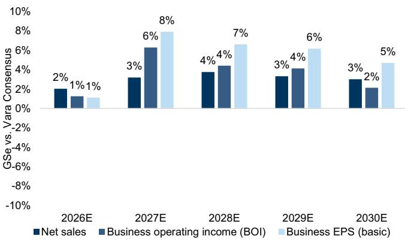
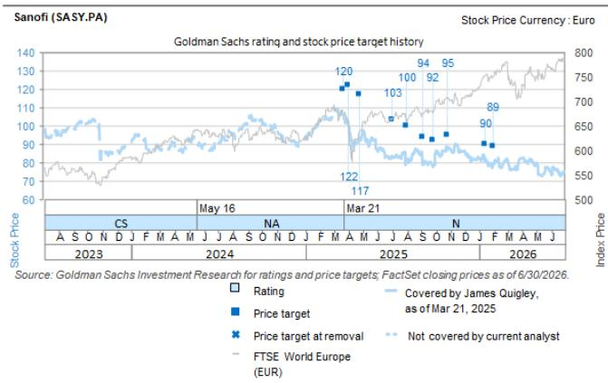
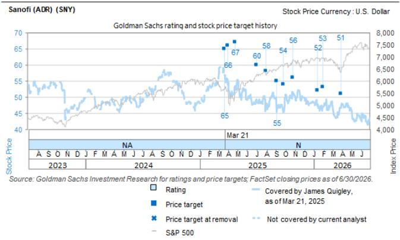

# Sanofi (SASY.PA)

# 商业执行力稳健，研发管线进展仍是市场关注焦点

<table><tr><td>SASY.PA</td><td>12个月目标价：€79.00</td><td>现价：€72.77</td><td>潜在空间：8.6%</td></tr><tr><td>SNY</td><td>12个月目标价：$45.00</td><td>现价：$42.89</td><td>潜在空间：4.9%</td></tr></table>

在2Q26业绩公布后，我们更新了模型，主要调整包括：（i）最新汇率趋势；（ii）2Q26业绩；（iii）业绩发布中的关键产品相关评论/趋势以及已宣布的资产终止情况。短期（FY26/FY27）我们上调业务每股盈利2-3%，但长期下调约1%，原因是研发投入增加以及终止资产带来的收入贡献被剔除。商业执行依然强劲，尤其是Dupixent的表现，进一步支撑了近期的盈利动能。然而，本次发布中连续出现的研发失败以及部分资产因未达到内部疗效标准而终止，重新引发了市场对管线能否替代/对冲Dupixent生物类似药长期竞争威胁的担忧，推动股价回落至年初至今低点附近——总体来看，这可能存在过度反应，因为部分研发项目的预期本就偏低。管理层可用于对冲长期增长担忧的关键手段包括（1）业务拓展/并购，（2）向Regeneron联盟注入更多资产，以及（3）提升研发效率，但这些措施均需时间才能产生实质性影响，因此我们维持中性评级。基于上述调整，我们将12个月目标价下调至€79（此前为€84），对应业绩发布后回调价格约9%的潜在空间。

研发转型的进展以及业务拓展/并购将是重建市场信心的关键。业绩发布后股价收盘下跌约9%，我们认为读者可能需要看到更结构化的转型方案，以及管理层能够成功执行管线变革的切实证据，市场情绪才会明显改善。虽然新任CEO已明确强调加强科学严谨性、精简治理、强化问责和重新确定管线优先级等优先事项，但这些举措仍处于早期阶段，研发效率的实质性改善预计需要时间。同样，业务拓展/并购有潜力补充内部管线，但读者可能会等待这些战略变化转化为更强创新引擎和更优管线质量的证据。我们认为，2026年下半年举办专门的研发活动，制定全面的转型战略，明确优先级、里程碑和时间表，可能成为重要催化剂，为评估进展提供框架——但能否兑现这些优先事项将是重建读者对长期前景信心的关键。

\- 根据业绩、最新汇率、基于公司评论的产品层面变化（疫苗分阶段影响及Dupixent在强劲内生增长驱动下的更高销售）以及管线更新（终止资产包括特应性皮炎的amlitelimab、慢阻肺和CRSwNP的itepekimab以及溃疡性结肠炎/克罗恩病的balinatunfib），我们更新预测，12个月目标价为€79（此前为€84）。我们的12个月目标价由DCF和PE各占50%混合得出。自下而上的DCF分析显示每股估值€75（此前为€83）。倍数法方面，将2027E混合每股盈利适用8倍（自8.5倍下调）目标倍数，对应每股估值€82（此前为€85）。混合后，12个月目标价为€79（此前为€84），ADR目标价为每股$45（此前为$49）。

## 业绩电话会议/读者交流要点

研发转型已启动，但全面扭转尚需时日。管理层表示，研发转型的早期阶段已通过对后期管线的战略审查开始，以实现资源向科学价值更高、商业潜力更大的资产重新配置，并承认除已宣布的终止外，未来仍可能有进一步终止。新任CEO强调了初期重点是加强科学严谨性、精简治理、确保在适当层级做出决策，同时强化问责和基于事实的决策，以管理运营风险。公司还预计短期内研发投入将适度增加，支出将随潜在业务发展和并购机会而演变，并指出大部分研发预算用于临床开发。管理层承认了历史上的管线失败和研发挑战，并表示转型需要时间，但未提供具体时间表。

☐ 我们的观点：考虑到研发组织的完整转型周期，我们认为这可能需要7年以上。目前难以判断研发效率不足是源于试验的运营执行还是科学认知层面。因此，我们预计读者对研发效率恢复速度将保持谨慎。管理层暗示可能在2026年下半年举办专门的研发更新活动，阐述更全面的转型战略，包括明确的优先级、里程碑和时间表，以及潜在进一步管线精简的更多细节。这样的活动有助于市场理解研发组织的新愿景或新研发负责人，但如上所述，管线获得充分信任仍需时间。

Regeneron联盟仍具战略重要性，有空间加强协作并扩大合作。管理层重申了与Regeneron联盟的战略重要性，强调了Dupixent取得的显著成功，同时承认该合作有提升敏捷性和透明度的空间。关于联盟的潜在扩展，赛诺菲表示讨论正在进行中，未来可选择纳入两家公司的更多资产。此外，管理层澄清该联盟不限制赛诺菲的并购战略，独立开展收购不存在障碍。但在评估外部机会时，公司表示会考虑收购资产若在Regeneron合作框架内开发是否能创造更大价值。

我们的观点：Regeneron联盟仍然复杂，尤其是两家公司在资源分配方面持续存在分歧。最终，我们认为利用Dupixent的分成来增强免疫学管线资产的竞争定位符合双方最佳利益，但由于双方可贡献资产可能存在不平衡（赛诺菲——临床前STAT6 vs. Regeneron的长效IL13和IL13/IL4组合），这可能导致赛诺菲向Regeneron支付现金——作为联盟的一部分——增加了另一层复杂性。因此，市场需要更长时间才能更清晰地看到该联盟推动长期增长的潜力。

业务拓展/并购战略将延伸至早期资产之外，同时保持以科学为导向的纪律性。管理层表示，虽然赛诺菲历史上侧重于收购早期资产，但现在也在考虑后期乃至已商业化资产，前提是这些资产具有吸引力的战略契合度。公司强调，未来交易不太可能集中于单一大型收购，而是侧重于科学依据较强、战略相关性最高和财务回报最优的机会。管理层还重申，业务拓展/并购活动将聚焦于免疫学、罕见病和疫苗三大核心治疗支柱。

我们交流的多头关注商业实力，认为市场可能过度聚焦于Regeneron合作。虽然Dupixent内生增长超预期，药品板块超预期部分的80%由Dupixent贡献，但市场关注Dupixent专利到期后的情况，强劲表现可能形成长期压制。我们认为产生的现金是关键利好，但市场需要更好地理解管理层将如何部署现金用于未来的业务拓展/并购。部分读者对我们First Take中提出的内生增长未达预期2-3%的观点提出异议，因为我们未加回与终止产品相关的一次性研发费用（研发成本增加超过2亿欧元）。我们认为，管线终止是真实成本，在分析业绩时不应加回，否则加回/忽略该成本可能变相奖励低效的管线产出。部分读者质疑为何市场如此关注Regeneron合作——我们认为该合作确实重要，因为内部管线尚未交出成果。如果全资拥有的管线能在近期至中期产出多项积极试验结果，将降低对Regeneron合作的依赖。

我们交流的空头质疑为何在同行专利到期前表现领先以及管线有限的情况下，下行空间不大。看空读者指出，BMY曾低至6倍前瞻市盈率，而赛诺菲目前约8倍，暗示可能还有更多下行空间。虽然我们已将目标倍数下调至8倍（自8.5倍），但我们认为强劲的商业表现和现金流（尽管专利悬崖影响可能加大）可支撑当前倍数，因为这为赛诺菲提供了更多交易能力。空头继续认为迫切需要并购——无论是商业/后期还是临床阶段——以帮助分散组合。

## 预测调整

我们预测的主要更新：（1）纳入2Q26业绩和最新汇率；（2）剔除终止资产的销售预测——特应性皮炎的amlitelimab（我们继续模型化乳糜泻适应症的amlitelimab销售——纳入7.5亿欧元未调整峰值销售，成功概率40%）、慢阻肺和CRSwNP的itepekimab以及溃疡性结肠炎/克罗恩病的balinatunfib；（3）疫苗分阶段影响，3Q26预计出现低至中双位数下降，FY26整体略负增长；（4）基于强劲内生增长和2030年峰值销售指引上调，我们上调Dupixent预测（GSe峰值销售：2031年268亿欧元）；（5）鉴于III期VITALIZE研究在IVig治疗人群中的读出预计于2H27进行，我们上调riliprubart的成功概率（自10%上调至30%）。

总体而言，我们2026-30E的销售、业务营业利润和业务每股盈利预测平均上调约+2%/+1%/+1%。

Exhibit 1: 赛诺菲2026-30E预测调整

<table><tr><td></td><td>2026</td><td>2027</td><td>2028</td><td>2029</td><td>2030</td></tr><tr><td>销售 - 新</td><td>47,795</td><td>51,369</td><td>54,444</td><td>57,042</td><td>59,178</td></tr><tr><td>销售 - 旧</td><td>46,657</td><td>50,015</td><td>53,127</td><td>56,037</td><td>58,453</td></tr><tr><td>差异 %</td><td>2.4%</td><td>2.7%</td><td>2.5%</td><td>1.8%</td><td>1.2%</td></tr><tr><td>差异相对值</td><td>1,138</td><td>1,354</td><td>1,317</td><td>1,005</td><td>725</td></tr><tr><td>营业利润 - 新</td><td>13,392</td><td>14,872</td><td>15,865</td><td>17,020</td><td>17,743</td></tr><tr><td>营业利润 - 旧</td><td>13,024</td><td>14,494</td><td>15,677</td><td>17,084</td><td>17,975</td></tr><tr><td>差异 %</td><td>2.8%</td><td>2.6%</td><td>1.2%</td><td>-0.4%</td><td>-1.3%</td></tr><tr><td>差异相对值</td><td>369</td><td>378</td><td>187</td><td>-64</td><td>-233</td></tr><tr><td>每股盈利 - 新</td><td>8.60</td><td>9.75</td><td>10.58</td><td>11.52</td><td>12.27</td></tr><tr><td>每股盈利 - 旧</td><td>8.46</td><td>9.50</td><td>10.45</td><td>11.56</td><td>12.43</td></tr><tr><td>差异 %</td><td>1.6%</td><td>2.7%</td><td>1.2%</td><td>-0.4%</td><td>-1.3%</td></tr><tr><td>差异相对值</td><td>0.14</td><td>0.25</td><td>0.13</td><td>-0.04</td><td>-0.16</td></tr></table>

净销售和业务每股盈利（基本）所示

来源：GS全球投资研究

## 后续催化剂

2026年剩余时间消息面有限。我们认为关键更新是lunsekimig的详细II期数据，将于2026年9月欧洲呼吸学会会议上公布。

Exhibit 2: 关键消息流

<table><tr><td>时间</td><td>药物/疫苗</td><td>适应症</td><td>说明</td><td>潜在价格变动</td></tr><tr><td colspan="5">2026</td></tr><tr><td>2H26</td><td>lunsekimig</td><td>中重度哮喘</td><td>ERS 2026年9月详细II期数据</td><td> $\uparrow / \downarrow$ </td></tr><tr><td>2H26</td><td>Sarclisa</td><td>适合移植的多发性骨髓瘤</td><td>III期数据</td><td> $\uparrow / \downarrow$ </td></tr><tr><td>2H26</td><td>Nexviazyme</td><td>IOPD</td><td>监管提交（美国）</td><td>-</td></tr><tr><td>2H26</td><td>efdoralprin alpha</td><td>AATD肺气肿</td><td>监管提交（美国）</td><td>-</td></tr><tr><td>2H26</td><td>SP0087</td><td>狂犬病</td><td>监管提交（美国）</td><td>-</td></tr><tr><td colspan="5">2027</td></tr><tr><td>1H27</td><td>SP0218</td><td>黄热病</td><td>黄热病II期/关键性读出——2027年数据和提交</td><td> $\uparrow / \downarrow$ </td></tr><tr><td>1H27</td><td>Dupixent</td><td>CSU</td><td>诺华remibrutinib vs Dupixent III期头对头（RECLAIM主要完成2027年2月）</td><td> $\uparrow / \downarrow$ </td></tr><tr><td>2H27</td><td>frexalimab</td><td>1型糖尿病</td><td>II期数据（FABULINUS主要完成2027年4月）</td><td> $\uparrow / \downarrow$ </td></tr><tr><td>1H27</td><td>brivekimig</td><td>克罗恩病</td><td>II期CHROMA-CD（主要完成2026年12月）</td><td> $\uparrow / \downarrow$ </td></tr><tr><td>1H27</td><td>brivekimig</td><td>溃疡性结肠炎</td><td>II期COLOR-UC（主要完成2026年12月）</td><td> $\uparrow / \downarrow$ </td></tr><tr><td>1H27</td><td>brivekimig</td><td>1型糖尿病</td><td>II期T1D OBTAIN（主要完成2027年4月）</td><td> $\uparrow / \downarrow$ </td></tr><tr><td>2H27</td><td>frexalimab</td><td>RMS</td><td>III期数据（FREXALT，主要完成2027年5月）</td><td> $\uparrow / \downarrow$ </td></tr><tr><td>2H27</td><td>riliprubart</td><td>CIDP</td><td>III期VITALIZE（主要完成2027年7月）</td><td> $\uparrow / \downarrow$ </td></tr><tr><td>2H27</td><td>brivekimig</td><td>HS</td><td>II期BRIGHTEN HS数据（主要完成2027年8月）</td><td> $\uparrow / \downarrow$ </td></tr><tr><td>2H27</td><td>lunsekimig</td><td>高风险哮喘</td><td>II期AIRLYMPUS（主要完成2027年9月）</td><td> $\uparrow / \downarrow$ </td></tr><tr><td>2027</td><td>SP0202</td><td>PCV</td><td>III期数据</td><td> $\uparrow / \downarrow$ </td></tr><tr><td>2H27</td><td>frexalimab</td><td>RMS/mrSPMS</td><td>监管提交</td><td>-</td></tr></table>

来源：公司数据，GS全球投资研究

## GSe vs 市场一致预期

总体而言，我们较2Q26前Vara一致预期在FY26-30E平均高出+3%/+4%/+5%（销售/业务营业利润/业务每股盈利）。

Exhibit 3: GSe vs 一致预期

  
来源：Vara Research，GS全球投资研究

## 估值与风险

我们维持中性评级。我们使用DCF估值和市盈率倍数法各占50%的混合方法推导欧洲大型制药目标价。我们的自下而上DCF方法使用8%加权平均资本成本和-2%终端增长率，对应每股估值€75（此前为€83）。我们的市盈率方法对2027E每股盈利适用8倍（自8.5倍下调，反映管线资产终止对长期增长潜力的影响）目标倍数，对应每股估值€82（此前为€85）。混合后，12个月目标价为每股€79（此前为€84），ADR目标价为$45（此前为$49）。

## 我们观点和目标价的上行风险：

1. 临床管线读出强劲，包括II期读出，推动积极反应；

2. Dupixent、Altuviiio、Ayvakit和Beyfortus销售增长快于预期，推动盈利动能；以及

3. 资本配置（即延长当前回购计划或并购）也可能产生积极影响。

## 下行风险：

1. 临床管线读出令人失望，引发对Dupixent长期替代战略的担忧；

2. 由于汇率短期影响以及Regeneron分成计入其他营业收入的长期影响，每股盈利一致预期下修；以及

3. Dupixent、Altuviiio和Beyfortus销售增长慢于预期。

## 披露附录

## Reg AC

我们，James Quigley、Rajan Sharma、Shyam Kotadia、Kaaviya Ganesan、Max Da博士和Theodora Rowe Beadle，特此证明本报告中表达的所有观点准确反映了我们个人对标的公司及其证券的看法。我们还证明，我们的薪酬中没有任何部分直接或间接与本报告中表达的具体建议或观点相关。

除非另有说明，本报告封面所列人员均为GS全球投资研究部分析师。

贡献作者：James Quigley GS International，Rajan Sharma GS International，Shyam Kotadia GS International，Kaaviya Ganesan GS India SPL，Max Da博士 GS International，Theodora Rowe Beadle GS International。

除非另有说明，本报告贡献作者披露中所列人员均为GS全球投资研究部分析师。

## GS因子画像

GS因子画像通过将关键属性与市场（即我们的评级股票池）及其行业同行进行比较，为个股提供投资背景。四个关键属性为：增长、财务回报、倍数（即估值）和综合（增长、财务回报和倍数的复合）。增长、财务回报和倍数通过计算每只股票特定指标的标准化排名得出。各指标的标准化排名随后取平均并转换为相应属性的百分位。每个指标的具体计算可能因财年、行业和地区而异，但标准方法如下：

增长基于股票的前瞻销售增长、EBITDA增长和每股盈利增长（对于金融股，仅每股盈利和销售增长），百分位越高表示增长性越强。财务回报基于股票的前瞻ROE、ROCE和CROCI（对于金融股，仅ROE），百分位越高表示财务回报越高。倍数基于股票的前瞻市盈率、市净率、价格/股息、EV/EBITDA、EV/FCF和EV/债务调整后现金流（对于金融股，仅市盈率、市净率和价格/股息），百分位越高表示倍数越高。综合百分位计算为增长百分位、财务回报百分位和（100% - 倍数百分位）的平均值。

财务回报和倍数使用GS分析师对未来至少三个季度后的财年末预测。增长使用未来至少七个季度后的财年与至少三个季度后的财年相比的输入（所有指标均按每股基础）。

有关我们如何计算GS因子画像的更详细说明，请联系您的GS代表。

## 并购排名

在我们的全球覆盖范围内，我们使用并购框架审视股票，考虑定性因素和定量因素（可能因行业和地区而异），以纳入某些公司可能被收购的可能性。然后我们分配并购排名，将评级覆盖下的公司从1到3进行评分，1代表高（30%-50%）被收购概率，2代表中（15%-30%）概率，3代表低（0%-15%）概率。对于排名为1或2的公司，按照我们标准部门指引，我们将并购因素纳入目标价。并购排名为3被视为不重要，因此不计入目标价，可能在研究中讨论也可能不讨论。

## Quantum

Quantum是GS的专有数据库，提供详细的财务报表历史、预测和比率。可用于对单一公司进行深入分析，或比较不同行业和市场的公司。

## 披露

赛诺菲和赛诺菲（ADR）的评级相对于其覆盖范围内的其他公司：阿斯利康、拜耳、GSK、GSK（ADR）、Galderma、龙沙集团、诺华、诺华（ADR）、诺和诺德、诺和诺德（ADR）、罗氏、山德士集团、赛诺菲、赛诺菲（ADR）、赛多利斯、赛多利斯斯泰迪生物技术

## 公司特定监管披露

以下披露涉及GS集团（及其关联方，"GS"）与GS全球投资研究覆盖并在本研究中提及的公司之间的关系。

GS在过去12个月内因投资银行服务获得报酬：赛诺菲（€72.77）和赛诺菲（ADR）（$42.89）

GS预计在未来3个月内获得或寻求投资银行服务报酬：赛诺菲（€72.77）和赛诺菲（ADR）（$42.89）

GS在过去12个月内与以下公司存在投资银行服务客户关系：赛诺菲（€72.77）和赛诺菲（ADR）（$42.89）

GS在过去12个月内与以下公司存在非证券服务客户关系：赛诺菲（€72.77）和赛诺菲（ADR）（$42.89）

GS做市该证券或衍生品：赛诺菲（€72.77）和赛诺菲（ADR）（$42.89）

## 评级/投资银行关系分布

GS投资研究全球股票覆盖范围

<table><tr><td rowspan="2"></td><td colspan="3">评级分布</td><td colspan="3">投资银行关系</td></tr><tr><td>买入</td><td>持有</td><td>卖出</td><td>买入</td><td>持有</td><td>卖出</td></tr><tr><td>全球</td><td>50%</td><td>34%</td><td>16%</td><td>65%</td><td>59%</td><td>43%</td></tr></table>

截至2026年7月1日，GS全球投资研究对3,104只股票有投资评级。GS将股票分配为各区域投资清单上的买入和卖出；未分配至此的股票视为中性。该等分配等同于买入、持有和卖出，以满足上述FINRA规则要求的披露。参见下方"评级、覆盖范围和相关定义"。投资银行关系图表反映了每个评级类别中GS在过去十二个月内提供投资银行服务的标的公司百分比。

## 目标价和评级历史图表

  
所示目标价应结合GS此前所有已发布研究（可能包含或不包含目标价）以及公司、行业和金融市场的发展情况来理解。

  
所示目标价应结合GS此前所有已发布研究（可能包含或不包含目标价）以及公司、行业和金融市场的发展情况来理解。

## 目标价历史表

赛诺菲（ADR）（SNY）

赛诺菲（SASY.PA）

<table><tr><td>报告日期</td><td>目标价（$）</td><td>收盘价（$）</td><td>报告日期</td><td>目标价（€）</td><td>收盘价（€）</td></tr><tr><td>2026年7月6日</td><td>49.00</td><td>42.61</td><td>2026年7月6日</td><td>84.00</td><td>74.51</td></tr><tr><td>2026年3月30日</td><td>51.00</td><td>46.72</td><td>2026年1月30日</td><td>89.00</td><td>79.20</td></tr><tr><td>2026年1月30日</td><td>53.00</td><td>47.04</td><td>2026年1月15日</td><td>90.00</td><td>81.63</td></tr><tr><td>2026年1月15日</td><td>52.00</td><td>47.47</td><td>2025年10月27日</td><td>95.00</td><td>88.13</td></tr><tr><td>2025年10月27日</td><td>56.00</td><td>51.41</td><td>2025年9月25日</td><td>92.00</td><td>77.52</td></tr><tr><td>2025年9月25日</td><td>54.00</td><td>45.07</td><td>2025年9月4日</td><td>94.00</td><td>78.96</td></tr><tr><td>2025年9月4日</td><td>55.00</td><td>45.33</td><td>2025年8月1日</td><td>100.00</td><td>80.34</td></tr><tr><td>2025年8月1日</td><td>58.00</td><td>46.75</td><td>2025年7月2日</td><td>103.00</td><td>83.61</td></tr><tr><td>2025年7月2日</td><td>60.00</td><td>49.31</td><td>2025年4月24日</td><td>117.00</td><td>93.35</td></tr><tr><td>2025年4月24日</td><td>67.00</td><td>53.54</td><td>2025年4月2日</td><td>122.00</td><td>100.40</td></tr><tr><td>2025年4月2日</td><td>66.00</td><td>53.95</td><td>2025年3月21日</td><td>120.00</td><td>105.84</td></tr><tr><td>2025年3月21日</td><td>65.00</td><td>56.90</td><td></td><td></td><td></td></tr></table>

表中所示目标价未针对公司行为进行调整。

## 监管披露

## 美国法律法规要求的披露

参见上文公司特定监管披露，了解本报告提及公司所需的以下任何披露：待处理交易中的主承销商或联合主承销商；1%或其他所有权；特定服务报酬；客户关系类型；前期管理/联合管理公开发行；董事职位；对于股票证券，做市和/或专家角色。GS作为主体交易或可能交易本报告讨论的发行人的债务证券（或相关衍生品）。

以下为额外要求的披露：所有权和重大利益冲突：GS政策禁止其分析师、向分析师汇报的专业人员及其家庭成员持有分析师覆盖范围内任何公司的证券。分析师薪酬：分析师薪酬部分基于GS的盈利能力，其中包括投资银行收入。分析师作为高管或董事：GS政策通常禁止其分析师、向分析师汇报的人员或其家庭成员在分析师覆盖范围内的任何公司担任高管、董事或顾问。非美国分析师：非美国分析师可能不是GS & Co. LLC的关联人员，因此可能不受FINRA规则2241或FINRA规则2242关于与标的公司沟通、公开露面以及交易所覆盖证券的限制。

## 美国以外司法辖区法律和法规要求的额外披露

以下披露为指定司法辖区要求的披露，但上文已根据美国法律法规作出的披露除外。澳大利亚：GS Australia Pty Ltd及其关联方不是澳大利亚的授权存款机构（该术语在《1959年银行法》（联邦）中定义），不提供银行服务，也不在澳大利亚开展银行业务。本研究及其任何访问权限仅面向《澳大利亚公司法》定义的"批发客户"，除非GS另行同意。在撰写研究报告时，GS Australia全球投资研究成员可能参加由其研究报告标的公司和实体主办或组织的实地考察和其他会议。在某些情况下，如果GS Australia认为在实地考察或会议的具体情况下适当合理，此类实地考察或会议的部分或全部费用可能由发行人承担。如果本文件内容包含任何金融产品建议，则仅为一般性建议，由GS在未考虑客户目标、财务状况或需求的情况下编制。客户在根据任何此类建议行事前，应考虑该建议相对于自身目标、财务状况和需求的适当性。GS Australia和New Zealand的某些利益披露副本以及GS澳大利亚卖方研究独立性政策声明副本可在以下网址获取：https://www.goldmansachs.com/disclosures/australia-new-zealand/index.html。巴西：有关CVM Resolution n. 20的披露信息可在https://www.gs.com/worldwide/brazil/area/gir/index.html获取。如适用，主要负责本研究报告内容的巴西注册分析师，按CVM Resolution n. 20第20条定义，为本报告开头列出的第一作者，除非文末另有说明。加拿大：本信息仅供您参考，不是也不应在任何情况下被解释为GS & Co. LLC为在加拿大购买证券而进行的广告、要约或招揽。GS & Co. LLC未在加拿大任何司法辖区注册为交易商，通常不被允许交易加拿大证券，并可能被禁止在加拿大某些司法辖区销售某些证券和产品。如果您希望在加拿大交易任何加拿大证券或其他产品，请联系GS Group Inc.的关联公司GS Canada Inc.或其他注册加拿大交易商。香港：可应要求从GS (Asia) L.L.C.获取本研究中提及的所覆盖公司证券的进一步信息。印度：可从GS (India) Securities Private Limited获取本研究中提及的标的公司的进一步信息，研究分析师 - SEBI注册号INH000001493，地址：10th Floor, Ascent-Worli, Sudam Kalu Ahire Marg, Worli, Mumbai-400 025, India，公司识别号U74140MH2006FTC160634，电话+91 22 6616 9000，传真+91 22 6616 9001。GS可能实益拥有本研究报告提及的标的公司1%或以上的证券（该术语在印度《证券合约（监管）法》1956年第2(h)条中定义）。SEBI的注册和NISM的认证不以任何方式保证中介机构的业绩或向读者提供回报保证。GS (India) Securities Private Limited合规官和读者投诉联系方式、年度合规审计报告副本以及其他相关信息和披露可在以下链接获取：https://www.goldmansachs.com/worldwide/india/research-analyst。日本：见下文。韩国：本研究及其任何访问权限仅面向《金融服务和资本市场法》定义的"专业读者"，除非GS另行同意。可从GS (Asia) L.L.C.首尔分行获取本研究中提及的标的公司的进一步信息。新西兰：GS New Zealand Limited及其关联方不是新西兰的"注册银行"或"存款接受者"（定义见《新西兰储备银行法》1989）。本研究及其任何访问权限面向《金融顾问法》2008定义的"批发客户"，除非GS另行同意。GS Australia和New Zealand的某些利益披露副本可在以下网址获取：https://www.goldmansachs.com/disclosures/australia-new-zealand/index.html。俄罗斯：在俄罗斯联邦分发的研究报告不属于俄罗斯法律定义的广告，而是信息和分析，不以产品推广为主要目的，不提供俄罗斯评估活动法律意义上的评估。研究报告不构成俄罗斯法律法规定义的个人化研究交流，不针对特定客户，且未分析客户的财务状况、投资概况或风险概况。GS不对客户或任何其他人基于本研究报告可能做出的任何投资决策承担责任。新加坡：GS (Singapore) Pte.（公司编号：198602165W），受新加坡金融管理局监管，对本研究承担法律责任，如有任何问题应联系该公司。台湾：本材料仅供参考，未经许可不得转载。读者应仔细考虑自身的投资风险。投资结果由个人读者自行承担。英国：在英国将被归类为零售客户的个人（该术语定义见金融行为监管局规则）应结合GS此前关于所覆盖公司的研究阅读本研究，并应参阅GS International已发送给他们的风险警告。这些风险警告的副本以及本报告中使用的某些金融术语词汇表可应要求从GS International获取。

欧盟和英国：有关欧洲委员会授权条例（EU）（2016/958）第6(2)条的披露信息（该条例补充欧洲议会和理事会条例（EU）No 596/2014，包括该授权条例在英国退出欧盟和欧洲经济区后转化为英国国内法律和法规的情况），涉及研究交流或建议投资策略的其他信息的客观呈现技术安排以及特定利益或利益冲突迹象披露的技术标准，可在https://www.gs.com/disclosures/europeanpolicy.html获取，该页面陈述了与投资研究相关的利益冲突管理欧洲政策。

日本：GS Japan Co., Ltd.是在关东财务局注册的金融工具交易商，注册号Kinsho 69，是日本证券业协会、日本金融期货协会、第二类金融工具交易商协会和日本投资管理协会的会员。股票买卖需支付与客户预先确定的佣金加消费税。参见公司特定披露，了解日本交易所、日本证券业协会或日本证券金融公司要求的任何适用披露。

## 评级、覆盖范围和相关定义

买入（B）、中性（N）、卖出（S）分析师建议将股票作为买入或卖出纳入各区域投资清单。被分配为投资清单上的买入或卖出取决于股票相对于其覆盖范围的总回报潜力。任何未被分配为投资清单上买入或卖出且具有有效评级（即未被暂停评级、未评级、早期生物技术、暂停覆盖或未覆盖）的股票均视为中性。各区域管理区域信念清单，从各自区域投资清单上的报告评级股票中选出，代表聚焦于总回报潜力大小和/或实现回报可能性的研究交流。此类信念清单中股票的添加或移除由各区域投资审查委员会或其他指定委员会管理，不代表分析师对该等股票投资评级的变更。

总回报潜力代表当前股价与目标价之间的上行或下行差异，包括在目标价相关时间范围内预期支付或已宣告的所有股息。所有覆盖股票均需设定目标价。总回报潜力、目标价和相关时间范围在每份添加或重申投资清单成员资格的报告中有明确说明。

覆盖范围：每个覆盖范围的所有股票列表可按首席分析师、股票和覆盖范围在https://www.gs.com/research/hedge.html获取。

未评级（NR）。当GS在涉及该公司的合并或战略交易中担任顾问角色、因GS参与交易而存在法律、监管或政策限制，以及在某些其他情况下，投资评级、目标价和盈利预测（如相关）将根据GS政策移除。早期生物技术（ES）。当该公司既没有通过II期临床试验的药物、治疗或医疗器械，也没有分销后II期药物、治疗或医疗器械的许可时，根据GS政策不分配投资评级和目标价。评级暂停（RS）。GS已暂停该股票的投资评级和目标价，因为没有足够的基本面基础来确定投资评级或目标价。此前的投资评级和目标价（如有）不再对该股票有效，不应依赖。覆盖暂停（CS）。GS已暂停对该公司的覆盖。未覆盖（NC）。GS不覆盖该公司。

## 全球产品；分发实体

GS全球投资研究在全球范围为GS客户制作和分发研究产品。GS全球各办公室的分析师研究行业和公司，以及宏观经济、货币、大宗商品和组合策略。本研究由以下机构分发：澳大利亚GS Australia Pty Ltd（ABN 21 006 797 897）；巴西GS do
