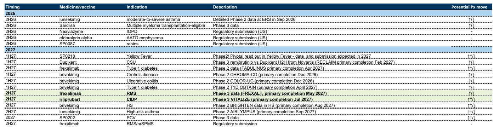

# Sanofi的商业引擎跑赢其科学管线，估值迫使市场在耐心与验证之间做出选择

Sanofi 2026年第二季度业绩呈现出一个矛盾局面，市场以约9%的下跌回应了这一结果：公司上调了近两年盈利预期2-3%，同时因管理层终止数个未达内部疗效标准的后期管线资产，将长期展望下调约1%。股价收于年内至今的72.77欧元附近。这种张力并非好坏消息之争，而是两种不同时间维度之间的权衡。未来两年，以Dupixent领衔的商业执行力足以支撑8.5倍前瞻市盈率与接近5.7%的股息率。但放眼未来五至七年，公司管线尚未证明其能够接替Dupixent最终因生物类似药竞争而流失的增长，市场已不再愿意为承诺买单。

此次下跌在狭义上可能属于过度反应，因为部分被终止项目的预期本已不高。但更深层的信号在于，读者对Sanofi的定价逻辑已从盈利能力转向创新引擎的可信度。这一转变之所以关键，是因为两者已不再对齐：商业板块正在兑现，科学板块尚未建立信誉，而这两者之间的落差构成了整个观察讨论的核心。

本文探讨这一落差背后的具体机制、为何近期上调无法化解该问题，以及需要何种证据才能弥合差距。分析基于某全球性机构在2Q26业绩后发布的研究报告，该报告更新了汇率、产品层面评论及已宣布的资产终止信息。报告维持原有观点，并认为管理层可用的三个杠杆——业务拓展、扩大与再生元的合作、提升研发效率——均可能需要时间才能对长期增长轨迹产生实质性影响。

## 盈利上调真实存在但具有误导性，因其源于成本纪律与Dupixent，而非管线进展

修正后的预期清晰反映了近期状况。2026年收入由497亿欧元上调至508亿欧元，2027年由531亿欧元上调至544亿欧元。2026年业务每股收益由8.42欧元上调至8.56欧元，2027年由9.46欧元上调至9.72欧元。这些调整并非无足轻重，代表着未来两年盈利能力2-3%的提升。驱动因素具体且多属商业层面：Dupixent在基本增长支撑下销售走强、疫苗排期有利、运营杠杆持续释放。EBIT利润率预计从2025年的约26%扩张至2028年的27.5%，公司2026年预计产生超过128亿欧元的经营现金流，高于2025年的107亿欧元。

但长期下调揭示了抵消力量。报告将2028年收入由563亿欧元下调至576亿欧元——净减少约13亿欧元——并将2028年每股收益由10.41欧元微调至10.53欧元。下调由两个因素驱动：研发投入增加以及终止资产收入贡献的剔除。被终止的项目包括特应性皮炎的amlitelimab、慢阻肺及慢性鼻窦炎伴鼻息肉的itepekimab，以及溃疡性结肠炎和克罗恩病的balinatunfib。这些在短期内均非重磅机会，但其剔除的意义不在于具体收入损失，而在于传递了管理层在资产未达内部疗效标准时愿意精简管线的信号。

精简的战略逻辑是合理的。资源不应投向科学价值薄弱的资产。但市场反应表明，读者并未将这些终止视为纪律性的资本配置，而是将其解读为管线比此前认知更为单薄的证据。这一区别至关重要。成本纪律与商业执行可推动两年盈利上调，但无法替代决定Sanofi在Dupixent之外是否还有增长故事的科学实力。近期上调是真实的，但若被解读为长期问题正在解决的证据，则同样具有误导性。

## 估值下修反映从盈利能力到管线可信度的转变，两者现已被区别定价

估值机制使这一转变清晰可见。DCF分析显示每股价值为75欧元，低于此前的83欧元；而倍数法——对2027E综合每股收益应用8倍目标倍数——显示每股82欧元，低于此前的85欧元。目标倍数从8.5倍下调至8倍是最具说明性的调整。其驱动因素并非近期盈利变化，而是市场对这些盈利持久性信心的改变。

在8.5倍前瞻盈利水平上，市场隐含地认可了Sanofi管线最终将抵消Dupixent竞争侵蚀的潜力。在8倍水平上，市场表明在没有证据的情况下不再给予这种认可。该股目前交易于2026E每股收益的8.5倍和2027E的7.5倍，股息率5.7%并在2027年升至5.9%。纯粹从盈利角度看，该股并不昂贵。但过去一年市盈率压缩——股价12个月相对跌幅14.9%，相对FTSE World Europe跑输27.7%——表明价值型读者并未因所承担的管线风险而获得补偿。

报告自身的框架捕捉了这一动态：商业执行依然强劲，尤其是Dupixent，但连续的研发挫折和产品终止重新点燃了读者对管线能否替代或抵消Dupixent生物类似药长期竞争威胁的担忧。市场并非将Sanofi定价为一家拥有5.7%股息率和2028年每股收益超10欧元路径的公司；而是将其定价为一家核心增长资产将在管线证明其有继任者之前面临生物类似药竞争的公司。在这一假设下，估值下修是理性的，并将持续到管线问题以证据而非承诺得到回答为止。

## 研发转型是七年课题而非两年项目，市场缺乏衡量进展的框架

Sanofi局面最棘手之处在于研发转型无法按季度评估。报告明确指出，鉴于研发周期，组织的全面转型可能需要七年或更长时间。这一时间线从根本上与市场的评估周期错配。读者被要求基于管理层能够执行公司近期历史中并无先例的转型这一信念，持有该股近十年。

管理层已阐明优先事项：加强科学严谨性、优化治理、增强问责制、重新确定管线优先级。新任CEO强调基于事实的决策和运营风险管理。这些都是正确的表述，但尚不构成框架。报告建议，2026年下半年举办专门的研发活动，制定包含明确优先级、里程碑和时间线的全面转型战略，可能成为重要催化剂。这样的活动将为读者提供评估进展的结构。

但时间线的缺失本身具有信息量。管理层承认转型需要时间，但未给出具体期限。报告自身七年以上的估计基于行业研发转型经验，而非公司任何指引。管理层愿意公开承诺的内容与行业认为现实的情况之间的差距，是读者谨慎的来源。缺乏框架，市场无法区分进展与噪音，只能默认对管线整体折价。

更深层的问题在于研发效率不足是源于试验运营执行还是基础科学本身。报告将此列为开放性问题。如果问题在运营层面——试验设计、患者招募、数据管理——则可通过流程改进和治理变革解决。如果问题在科学层面——靶点、机制、生物学——则任何运营纪律都无法产生更好的资产。这一区别至关重要，因为市场需要知道正在解决的是哪个问题，而当前披露并未提供这种清晰度。

## 与再生元的合作是最被低估的战略选项，但无法仓促推进且自带复杂性

与再生元的合作是Sanofi商业成功最重要的单一驱动因素，尤其是通过Dupixent。管理层重申其战略重要性，并承认有空间使合作更加灵活透明。双方正在讨论可能纳入两家公司的额外资产。该合作不限制Sanofi的并购策略，独立进行收购不存在障碍。然而，在评估外部机会时，公司会考虑收购资产若在再生元合作框架内开发是否能创造更大价值。

扩大合作的战略逻辑具有说服力。两家公司在免疫学领域拥有互补资产：Sanofi拥有临床前STAT6项目，再生元拥有长效IL13及IL13/IL4组合。更广泛的合作可能创建比任何一家公司独立构建都更全面的免疫学专营权。但报告也指出，该合作仍然复杂，双方在资源分配方面持续存在分歧。可供贡献的资产可能不平衡——Sanofi的早期项目与再生元更成熟的组合——可能导致Sanofi向再生元支付现金以重新平衡经济利益。

该合作是最被低估的战略选项，因为它提供了无需承担收购全部风险的管线增强路径。但它无法仓促推进。现有关系的复杂性、资源分配分歧的历史以及财务再平衡的可能性都表明，任何扩展都需要时间谈判，更长时间才能交付价值。市场不太可能在看到具体条款前给予Sanofi合作潜力的认可，即使届时，认可也将取决于所增资产的质量而非公告本身。

## 读者的决策框架：将商业板块与管线期权分离，独立定价

Sanofi的局面为面临商业执行与科学可信度类似分歧的读者提供了有用的决策框架。第一步是将商业板块与管线期权分离并独立估值。商业板块——Dupixent、疫苗业务、消费者保健组合及成熟产品——可依据自身价值使用标准盈利倍数和现金流分析进行估值。管线期权——新产品接替Dupixent增长并创造新收入来源的潜力——应作为期权估值，为每个主要项目附加成功概率，并以反映不确定性的折现率进行贴现。

第二步是识别将改变管线期权估值的具体证据。对Sanofi而言，证据包括：具有明确里程碑和时间线的全面研发活动；再生元合作扩展的实质性进展，最好指明具体资产；以及引入具有明确商业潜力的后期资产的业务拓展交易。这三项证据中任何一项的缺失都应被视为负面信号，而非中性状态。

第三步是评估资产负债表支持转型的能力。Sanofi的资产负债表强劲：净债务与EBITDA之比预计从2025年的0.8倍降至2026年的0.6倍和2027年的0.2倍，公司2026年预计产生超过90亿欧元的自由现金流，是股息义务的两倍以上。资产负债表提供了进行收购、增加研发投入或以现金支付重新平衡再生元合作的财务灵活性。问题不在于Sanofi是否有能力修复管线，而在于管理层是否会利用可用资源做出正确选择。

第四步是设定时间周期。报告分析表明研发效率提升需要七年或更长时间才能完全显现。不愿等待该时长的读者不应为管线期权付费；他们应纯粹基于商业板块对Sanofi估值，这意味着较低的倍数和较高的股息率要求。愿意长期持有的读者应在每个里程碑寻求进展证据，并在证据未出现时准备退出。

## 观察结论不在于下个季度，而在于管理层能否将资产负债表实力转化为科学可信度

近期盈利状况稳健，该股在传统指标上并不昂贵。但市场已越过传统指标足够的阶段。估值下修反映了管线不可信的判断，而这一判断不会因一个季度的强劲Dupixent销售或温和的每股收益超预期而逆转。只有科学改善的证据才能扭转这一判断。

报告的观点、盈利支持和资产负债表实力均指向一定支撑，但在管线问题得到回答之前上行空间受限。业绩后的下跌可能如报告所言属于过度反应，但过度反应是更深层问题的症状——市场不再信任管线叙事，重建这种信任需要的不仅仅是几个季度的商业表现。

最值得关注的变量不是下一份业绩报告，而是管理层暗示的2026年下半年研发活动。如果该活动提供包含明确优先级、里程碑和时间线的全面转型战略，则可能为市场提供评估进展所需的框架。如果未能提供，估值下修可能持续，该股将越来越多地依据股息率和资产负债表实力而非增长潜力进行交易。

对读者而言，决策不在于Sanofi是否是一家好公司，而在于当前价格是否充分补偿了管线不确定性。在8.5倍前瞻盈利和5.7%股息率水平上，市场提供了合理的收入流和适度的资本增值潜力。问题在于这是否足以支撑度过管理层已隐含承认的七年研发转型期。答案将取决于每位读者的时间周期、风险承受能力以及对管理层执行公司近期历史中并无先例的转型的信心。

*仅供参考。部分内容可能基于源材料由AI辅助生成、翻译、摘要或编辑，可能包含遗漏或错误。请独立核实。本文不构成投资、法律、税务、会计或其他专业建议。*

仅供参考。部分内容可能基于源材料由AI辅助生成、翻译、摘要或编辑，可能包含遗漏或错误。请独立核实。本文不构成投资、法律、税务、会计或其他专业建议。

