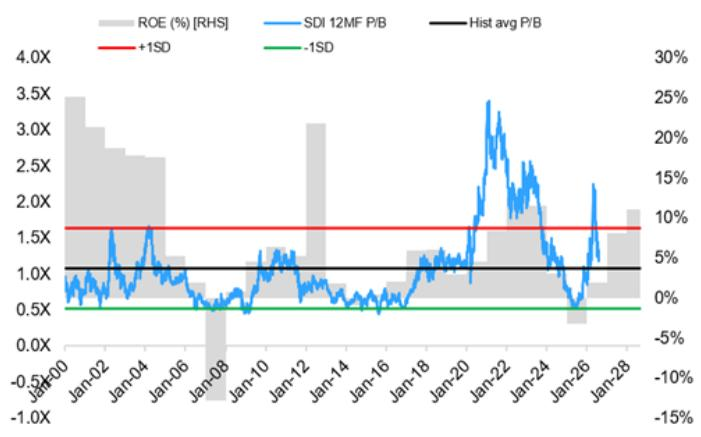
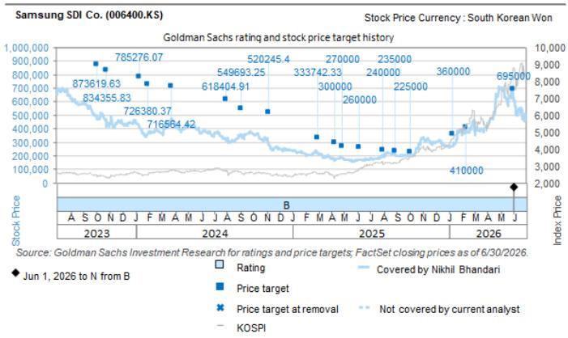

# Samsung SDI Co. (006400.KS)：核心营业利润符合预期，AI基础设施电池动能增强

Samsung SDI（SDI）公布二季度营收强劲增长（同比+19%），在连续六个季度亏损后，实现营业利润转正至2040亿韩元。业绩包含约2000亿韩元与去年缴纳关税相关的一次性退税；剔除该因素后，营业利润接近彭博一致预期（-130亿韩元）。分析师电话会议要点如下：

**复苏将是渐进式的，由小型圆柱电池引领。** UPS和BBU电池业务2026年营收预计分别同比增长超过70%，市场份额约40-50%。现有高功率圆柱产线已满负荷运转，并计划扩产；瞬时高功率输出和安全方面的认证壁垒，支撑其盈利能力优于其他产品类别。

**美国ESS订单簿已延伸至2029年，并指向2028年起产能趋紧。** 已确认订单覆盖了截至2029年的相当一部分产能，若计入2026年下半年极有可能中标的项目，预计2028年起需求将超过产能，目前正在评估增加产能的选项；相比之下，2026年一季度给出的指引为美国本土产能覆盖2-3年。

**电动车复苏由欧洲引领，年内预计将有更多订单落地。** 随着二季度量产车型爬坡，xEV亏损预计将收窄，但现有项目销量下滑被视为风险因素。SDI正基于其棱柱形产品线（涵盖高镍、中镍和LFP）与多家欧洲OEM进行讨论，继4月赢得梅赛德斯-奔驰订单后，预计年内将获得更多订单。

**全固态电池。** 2027年下半年全固态电池量产目标维持不变，人形机器人可能是首个商业应用场景，样品将于2026年下半年交付；电动车应用开发同步推进，后续将逐步扩展。近期来看，美国ESS用棱柱形LFP电池将于10月开始电芯生产，SBB 2.0将于年内交付；钠离子UPS和公用事业ESS解决方案正在开发中，量产线正在筹备，SDI已赢得首个将圆柱电池应用于HEV的项目。

**主要上行/下行风险因素：**（1）全球电动车渗透率增速高于/低于预期；（2）电池相关业务的电动车/ESS出货量和市场份额增长快于/慢于预期；（3）电池业务利润率高于/低于预期，EM业务利润率高于/低于预期；（4）韩元兑美元汇率强于/弱于预期。

## Nikhil Bhandari

+65-6889-2867 | nikhil.bhandari@gs.com GS (Singapore) Pte

Giuni Lee
+82(2)3788-1177 | giuni.lee@gs.com
GS (Asia) L.L.C., Seoul Branch

John Tsang
+65-6654-5454 | john.tsang@gs.com
GS (Singapore) Pte

图表1：Samsung SDI 12个月远期P/B与ROE趋势

资料来源：Refinitiv Eikon，GS全球投资研究

## 投资论点 - Samsung SDI

Samsung SDI（SDI）是一家电池和电子材料制造商，在大尺寸电池业务中保持行业领先的盈利水平，同时日益成为一家更纯粹的电池公司。我们预计，鉴于与优质客户的长期合同，Samsung SDI的电池利润率将比同行更具韧性。与此同时，SDI在技术领先方面（与LGES并列）取得了良好进展，拥有强大的专有技术和多元化的新产品组合（高镍含量>90%的棱柱形P6、46-pi圆柱电池和固态电池的量产）。我们还看到美国市场进一步获得电芯订单的潜力，因为OEM正在寻求电池供应商和外形尺寸的多元化。

虽然我们对SDI的基本面保持积极看法，但当前报价已计入我们的基准情景下的xEV长期市场份额和核心xEV EBITDA利润率增长，以及我们的基准情景ESS假设。该报价也高于其长期平均12个月远期P/B倍数。我们对该报价持中性评级。

## 目标价风险与方法论 - Samsung SDI Co.

我们对Samsung SDI持中性评级，基于SOTP的12个月目标价为695,000韩元（2027E/28E）（xEV电池：DCF；小型电池/ESS/EM：11倍/14倍/8倍 27E/28E EBITDA倍数；上市/非上市子公司：市值/账面价值）。

## 主要上行/下行风险：

（1）全球电动车渗透率增速高于/低于预期；（2）电池相关业务的电动车/ESS出货量和市场份额增长快于/慢于预期；（3）电池业务利润率高于/低于预期，EM业务利润率高于/低于预期；（4）韩元兑美元汇率强于/弱于预期。

<table><tr><td>006400.KS</td><td colspan="2">12个月目标价：695,000韩元</td><td colspan="2">报价：358,500韩元</td><td colspan="2">上行空间：93.9%</td></tr><tr><td colspan="2">中性</td><td colspan="5">GS预测</td></tr><tr><td colspan="2"></td><td></td><td>12/25</td><td>12/26E</td><td>12/27E</td><td>12/28E</td></tr><tr><td rowspan="9" colspan="2">市值：24.0万亿韩元 / 166亿美元企业价值：32.2万亿韩元 / 223亿美元3个月日均成交量：3491亿韩元 / 2.321亿美元韩国韩国电动车电池并购排名：3租赁包含在净债务及EV中？：是</td><td>营收（十亿韩元）</td><td>13,266.7</td><td>15,732.7</td><td>24,143.5</td><td>31,838.1</td></tr><tr><td>EBITDA（十亿韩元）</td><td>380.6</td><td>2,438.3</td><td>4,684.2</td><td>6,290.3</td></tr><tr><td>每股收益（韩元）</td><td>(8,253)</td><td>5,227</td><td>23,551</td><td>35,477</td></tr><tr><td>市盈率（倍）</td><td>NM</td><td>68.6</td><td>15.2</td><td>10.1</td></tr><tr><td>市净率（倍）</td><td>0.7</td><td>1.2</td><td>1.1</td><td>1.0</td></tr><tr><td>股息率（%）</td><td>0.0</td><td>0.0</td><td>0.0</td><td>0.0</td></tr><tr><td>净债务/EBITDA（不含租赁，倍）</td><td>23.9</td><td>3.4</td><td>1.7</td><td>1.0</td></tr><tr><td>CROCI（%）</td><td>2.0</td><td>3.9</td><td>6.5</td><td>7.9</td></tr><tr><td>自由现金流回报表现（%）</td><td>(14.6)</td><td>(0.8)</td><td>(1.6)</td><td>2.6</td></tr><tr><td colspan="2"></td><td></td><td>3/26</td><td>6/26E</td><td>9/26E</td><td>12/26E</td></tr><tr><td colspan="2"></td><td>每股收益（韩元）</td><td>(356)</td><td>487</td><td>2,179</td><td>2,917</td></tr></table>

资料来源：公司数据，GS预测，FactSet。报价截至2026年7月30日收盘。

## 披露附录

## Reg AC

我们，Nikhil Bhandari、Giuni Lee和John Tsang，特此证明本报告中表达的所有观点准确反映了我们个人对相关公司及其证券的看法。我们还证明，我们薪酬的任何部分均未直接或间接地与本次报告中表达的具体建议或观点相关。

除非另有说明，本报告封面所列人员均为GS全球投资研究部分析师。

供稿作者：Nikhil Bhandari GS (Singapore) Pte，Giuni Lee GS (Asia) L.L.C., Seoul Branch，John Tsang GS (Singapore) Pte。

除非另有说明，本报告“供稿作者”披露中所列人员均为GS全球投资研究部分析师。

## GS因子画像

GS因子画像通过将股票的关键属性与市场（即我们的评级股票池）及其行业同行进行比较，提供投资背景信息。所展示的四个关键属性为：成长性、财务回报、估值倍数（例如估值）和综合（成长性、财务回报和估值倍数的复合）。成长性、财务回报和估值倍数通过使用每只股票特定指标的标准化排名来计算。各指标的标准化排名随后取平均值，并转换为相关属性的百分位。每个指标的具体计算可能因财年、行业和地区而异，但标准方法如下：

成长性基于股票的前瞻性销售增长、EBITDA增长和每股收益增长（对于金融股，仅使用每股收益和销售增长），百分位越高表示成长性越强。财务回报基于股票的前瞻性ROE、ROCE和CROCI（对于金融股，仅使用ROE），百分位越高表示财务回报越高。估值倍数基于股票的前瞻性市盈率、市净率、价格/股息（P/D）、EV/EBITDA、EV/FCF和EV/债务调整后现金流（DACF）（对于金融股，仅使用市盈率、市净率和P/D），百分位越高表示估值倍数越高。综合百分位计算为成长性百分位、财务回报百分位和（100% - 估值倍数百分位）的平均值。

财务回报和估值倍数使用GS分析师对至少三个季度后的财年末所做的预测。成长性使用至少七个季度后的财年输入数据，与至少三个季度后的财年进行比较（所有指标均按每股基础计算）。

有关我们如何计算GS因子画像的更详细说明，请联系您的GS代表。

## 并购排名

在我们的全球覆盖范围内，我们使用并购框架审视股票，综合考虑定性因素和定量因素（可能因行业和地区而异），以纳入某些公司可能被收购的可能性。然后我们对评级覆盖下的公司进行1至3的并购排名，其中1表示公司成为收购目标的可能性较高（30%-50%），2表示可能性中等（15%-30%），3表示可能性较低（0%-15%）。对于排名为1或2的公司，按照我们的标准部门指引，我们将并购因素纳入目标价。并购排名为3被视为不重要，因此不计入目标价，且可能在研究中讨论或不讨论。

## Quantum

Quantum是GS的专有数据库，提供详细的财务报表历史、预测和比率访问权限。它可用于对单一公司进行深入分析，或比较不同行业和市场中的公司。

## 披露

Samsung SDI Co.的评级相对于其覆盖范围内的其他公司：Ecopro BM、L&F、LG Chem、LG Energy Solution、Posco Future M、SK Innovation、Samsung SDI Co.

## 公司特定监管披露

以下披露涉及GS集团（及其关联公司，“GS”）与GS全球投资研究覆盖并在本研究中提及的公司之间的关系。

截至本报告前一个月末，GS实益拥有普通股1%或以上（不包括根据美国证券法无需汇总的关联公司和业务部门管理的头寸）：Samsung SDI Co.（358,500韩元）

GS预计在未来3个月内收取或打算寻求投资银行服务报酬：Samsung SDI Co.（358,500韩元）

GS在过去12个月内与以下公司存在非证券服务客户关系：Samsung SDI Co.（358,500韩元）

评级/投资银行关系分布
GS投资研究全球股票覆盖范围

<table><tr><td rowspan="2"></td><td colspan="3">评级分布</td><td colspan="3">投资银行关系</td></tr><tr><td>买入</td><td>持有</td><td>卖出</td><td>买入</td><td>持有</td><td>卖出</td></tr><tr><td>全球</td><td>50%</td><td>34%</td><td>16%</td><td>65%</td><td>59%</td><td>43%</td></tr></table>

截至2026年7月1日，GS全球投资研究对3,104只股票进行了投资评级。GS将股票指定为各区域投资清单上的买入和卖出；未如此指定的股票被视为中性。就FINRA规则要求的上述披露而言，此类指定等同于买入、持有和卖出。请参阅下文“评级、覆盖范围和相关定义”。投资银行关系图表反映了GS在过去十二个月内为每个评级类别中的标的企业提供投资银行服务的百分比。

## 目标价和评级历史图表

所示目标价应结合GS此前所有已发布的研究（可能包含或不包含目标价）以及公司、行业和金融市场相关进展来理解。

## 目标价历史表 Samsung SDI Co. (006400.KS)

报告日期 目标价（韩元） 收盘价（韩元）

<table><tr><td>报告日期</td><td>目标价（韩元）</td><td>收盘价（韩元）</td></tr><tr><td>2026年6月1日</td><td>695,000</td><td>652,000</td></tr><tr><td>2026年2月11日</td><td>410,000</td><td>377,000</td></tr><tr><td>2026年1月11日</td><td>360,000</td><td>267,500</td></tr><tr><td>2025年10月3日</td><td>225,000</td><td>206,500</td></tr><tr><td>2025年8月28日</td><td>235,000</td><td>216,000</td></tr><tr><td>2025年7月31日</td><td>240,000</td><td>201,000</td></tr><tr><td>2025年6月8日</td><td>260,000</td><td>174,300</td></tr><tr><td>2025年4月27日</td><td>270,000</td><td>185,100</td></tr><tr><td>2025年4月10日</td><td>300,000</td><td>177,200</td></tr><tr><td>2025年3月2日</td><td>340,000</td><td>218,876</td></tr><tr><td>2024年11月6日</td><td>530,000</td><td>291,672</td></tr><tr><td>2024年9月4日</td><td>560,000</td><td>349,811</td></tr><tr><td>2024年7月30日</td><td>630,000</td><td>322,940</td></tr><tr><td>2024年3月25日</td><td>730,000</td><td>474,883</td></tr><tr><td>2024年1月30日</td><td>740,000</td><td>365,934</td></tr><tr><td>2024年1月9日</td><td>800,000</td><td>422,118</td></tr><tr><td>2023年10月26日</td><td>850,000</td><td>413,324</td></tr><tr><td>2023年10月3日</td><td>890,000</td><td>500,289</td></tr></table>

表中所示目标价未针对公司行动进行调整。

## 监管披露

## 美国法律法规要求的披露

有关本报告提及公司的以下任何披露要求，请参阅上述公司特定监管披露：未决交易中的主承销商或联合主承销商；1%或其他所有权；特定服务的报酬；客户关系类型；以往期间的承销公开发行；董事职位；对于股票证券，做市和/或专家角色。GS作为主体交易或可能交易本报告所讨论发行人的债务证券（或相关衍生品）。

以下为额外要求的披露：所有权和重大利益冲突：GS政策禁止其分析师、向分析师汇报的专业人员及其家庭成员持有分析师覆盖范围内任何公司的证券。分析师薪酬：分析师薪酬部分基于GS的盈利能力，其中包括投资银行收入。分析师作为高管或董事：GS政策通常禁止其分析师、向分析师汇报的人员及其家庭成员在分析师覆盖范围内的任何公司担任高管、董事或顾问。非美国分析师：非美国分析师可能不是GS & Co. LLC的关联人员，因此可能不受FINRA规则2241或FINRA规则2242关于与标的公司沟通、公开露面以及交易所覆盖证券的限制。

## 美国以外司法辖区法律和法规要求的额外披露

以下披露为指定司法辖区所要求，除非已根据美国法律法规在上文作出。澳大利亚：GS Australia Pty Ltd及其关联公司不是澳大利亚的授权存款机构（该术语在《1959年银行法》（联邦）中定义），不提供银行服务，也不在澳大利亚开展银行业务。本研究及其任何访问权限仅面向《澳大利亚公司法》定义的“批发客户”，除非GS另有约定。在编制研究报告时，GS Australia全球投资研究部门的成员可能参加由其研究报告标的公司和其他实体主办或组织的实地考察和其他会议。在某些情况下，如果GS Australia认为在实地考察或会议的具体情况下适当且合理，此类实地考察或会议的部分或全部费用可能由相关发行人承担。如果本文件内容包含任何金融产品建议，则仅为一般性建议，由GS在未考虑客户的目标、财务状况或需求的情况下编制。客户在依据任何此类建议行事前，应考虑该建议是否适合其自身的目标、财务状况和需求。某些GS Australia和New Zealand利益披露以及GS澳大利亚卖方研究独立性政策声明的副本可在以下网址获取：https://www.goldmansachs.com/disclosures/australia-new-zealand/index.html。巴西：有关CVM第20号决议的披露信息可在https://www.gs.com/worldwide/brazil/area/gir/index.html获取。如适用，根据CVM第20号决议第20条定义，对本研究报告内容负主要责任的巴西注册分析师为本报告开头列出的第一作者，除非文本末尾另有说明。加拿大：此信息仅供您参考，在任何情况下均不应被解释为GS & Co. LLC为在加拿大购买证券的客户提供的广告、要约或招揽，以交易任何加拿大证券。GS & Co. LLC未在加拿大任何司法辖区根据适用的加拿大证券法注册为交易商，通常不被允许交易加拿大证券，并可能被禁止在加拿大的某些司法辖区销售某些证券和产品。如果您希望在加拿大交易任何加拿大证券或其他产品，请联系GS Canada Inc.（GS Group Inc.的关联公司）或其他注册的加拿大交易商。香港：有关本研究中提及的所覆盖公司证券的进一步信息，可向GS (Asia) L.L.C.索取。印度：有关本研究中提及的标的公司的进一步信息，可从GS (India) Securities Private Limited获取，研究分析师 - SEBI注册号INH000001493，地址：10th Floor, Ascent-Worli, Sudam Kalu Ahire Marg, Worli, Mumbai-400 025, India，公司识别号U74140MH2006FTC160634，电话+91 22 6616 9000，传真+91 22 6616 9001。GS可能实益拥有本研究报告提及的标的公司1%或以上的证券（该术语在印度《1957年证券合约（监管）法》第2(h)条中定义）。SEBI授予的注册和NISM的认证不以任何方式保证中介机构的业绩，也不提供对读者回报的任何保证。GS (India) Securities Private Limited的合规官和读者投诉联系方式、年度合规审计报告副本以及其他相关信息和披露可在以下链接找到：https://www.goldmansachs.com/worldwide/india/research-analyst。日本：见下文。韩国：本研究及其任何访问权限仅面向《金融服务与资本市场法》定义的“专业读者”，除非GS另有约定。有关本研究中提及的标的公司的进一步信息，可从GS (Asia) L.L.C., Seoul Branch获取。新西兰：GS New Zealand Limited及其关联公司不是新西兰的“注册银行”或“存款接受机构”（定义见《1989年新西兰储备银行法》）。本研究及其任何访问权限面向《2008年金融顾问法》定义的“批发客户”，除非GS另有约定。某些GS Australia和New Zealand利益披露副本可在以下网址获取：https://www.goldmansachs.com/disclosures/australia-new-zealand/index.html。俄罗斯：在俄罗斯联邦分发的研究报告不是俄罗斯立法定义的广告，而是信息和分析，其主要目的不是推广产品，也不提供俄罗斯评估立法意义上的评估。研究报告不构成俄罗斯法律法规定义的个人化研究交流，不针对特定客户，且未分析客户的经济状况、投资概况或风险概况。GS对客户或任何其他人可能基于本研究报告做出的任何投资决策不承担任何责任。新加坡：GS (Singapore) Pte.（公司编号：198602165W），受新加坡金融管理局监管，对本研究承担法律责任，如有任何与本相关的事项，请联系该公司。台湾：本材料仅供参考，未经许可不得转载。读者应仔细考虑自身的投资风险。投资结果由个人读者自行负责。英国：在英国将被归类为零售客户的人士（定义见金融行为监管局规则）应结合GS此前关于所提及覆盖公司的研究阅读本研究，并应参阅GS International已发送给他们的风险警告。这些风险警告的副本以及本报告中使用的某些金融术语词汇表，可向GS International索取。

欧盟和英国：有关欧盟委员会授权条例（EU）（2016/958）第6条第(2)款的披露信息（该条例补充了欧洲议会和理事会条例（EU）No 596/2014，包括该授权条例在英国退出欧盟和欧洲经济区后转化为英国国内法律和法规的情况），涉及客观呈现研究交流或其他建议或暗示投资策略的信息的技术安排，以及披露特定利益或利益冲突迹象，可在https://www.gs.com/disclosures/europeanpolicy.html获取，其中载明了与投资研究相关的利益冲突管理欧洲政策。

日本：GS Japan Co., Ltd.是在关东财务局注册的金融工具交易商，注册号Kinsho 69，是日本证券业协会、日本金融期货协会第二类金融工具业者协会和日本投资管理协会的会员。股票买卖需支付与客户预先确定的佣金加消费税。有关日本证券交易所、日本证券业协会或日本证券金融公司要求的任何适用披露，请参阅公司特定披露。

## 评级、覆盖范围和相关定义

买入（B）、中性（N）、卖出（S）
分析师建议将股票作为买入或卖出纳入各区域投资清单。被指定为投资清单上的买入或卖出取决于股票相对于其覆盖范围的总回报潜力。任何未被指定为投资清单上买入或卖出且具有有效评级（即未被暂停评级、未评级、早期生物科技、暂停覆盖或未覆盖的股票）的股票均被视为中性。每个区域管理区域信念清单，该清单从各区域投资清单中选出的报告评级股票中挑选，代表侧重于总回报潜力大小和/或在其各自覆盖范围内实现回报可能性的研究交流。此类信念清单中股票的加入或移除由各区域的投
