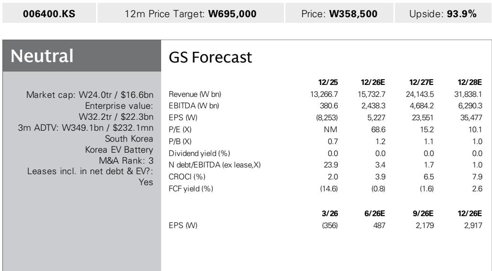

# 电池业务的转折正在发生，但市场报价或已提前反映：三星SDI的AI基础设施机遇已被充分定价

三星SDI在2026年第二季度恢复了营业利润，报告营业利润为2040亿韩元，此前经历了连续六个季度的亏损。但这一表面数字掩盖了实际经营状况。剔除约2000亿韩元的一次性关税返还后，该公司实际录得约130亿韩元的营业亏损——基本符合市场一致预期，但仍然是亏损状态。市场的反应，或者说缺乏反应，反映了一个更深层的矛盾：基本面确实在改善，但公司报价已处于前瞻市净率1.2倍的水平，高于其长期均值。

本季度最重要的进展并非电动车业务的复苏——该复苏仍以欧洲为主导且步伐渐进。真正的重点是AI基础设施电池——UPS和BBU系统——的加速增长，2026年该业务收入指引同比增长超过70%，且已获得40%至50%的市场份额。这是多年来三星SDI首次拥有一个不依赖全球电动车普及曲线的增长故事。公司在美国储能系统的订单簿已延伸至2029年，管理层明确表示从2028年起需求将超过产能，这与仅一个季度前指引的美国本地产能覆盖两至三年的情况相比，发生了显著变化。

对于观察者而言，战略问题不在于三星SDI是否在好转——它确实在好转。问题在于市场是否正确评估了以下因素的组合：渐进式的电动车复苏、高利润率的AI基础设施机遇，以及包含全固态电池（以人形机器人为首个商业应用）的技术路线图。答案是微妙的：AI基础设施业务是真正的重估催化剂，但电动车复苏的定价似乎假设其将平稳推进，而全固态电池的时间表存在执行风险，当前估值并未充分反映这一点。

## 核心营业亏损掩盖了盈利质量的结构性转变

第二季度业绩需要仔细解读，因为关税返还掩盖了潜在趋势。剔除一次性项目后，三星SDI在营业层面仍然亏损。但方向比水平更重要。收入同比增长19%，公司在连续六个季度亏损后已止住下滑势头。从第一季度每股亏损3560亿韩元到第二季度每股收益4870亿韩元的环比改善，表明成本结构终于与收入基础趋于一致。

盈利质量问题对估值至关重要。通过关税返还实现盈利的公司并未展示定价能力或运营杠杆。但2026年UPS和BBU电池收入增长超过70%、市场份额达40%至50%的指引，则是另一种信号。这些是高功率圆柱形电池，需要瞬时高功率输出并满足严格的安全认证要求。认证壁垒构成了大宗圆柱形电芯所不具备的护城河。管理层确认现有高功率圆柱形产线已满负荷运转，扩产计划已在推进中。

这是当前周期中三星SDI首次拥有一个兼具销量增长和利润率保护的产品类别。AI基础设施电池业务不是周期性复苏的故事；它是一个由数据中心建设、电网稳定需求和备用电源系统电气化驱动的结构性需求故事。70%的增长指引如果兑现，将在两年内使该板块成为集团盈利的重要贡献者，而非边缘附加项。

## 美国储能需求已超出公司产能规划

本季度最引人注目的数据点是美国储能系统订单簿延伸至2029年。在第一季度业绩电话会议上，管理层指引美国本地产能覆盖为两至三年。现在，包括2026年下半年极有可能获得的项目在内，预计从2028年起需求将超过产能。这意味着产能约束时间表提前了一年，对定价能力和资本配置有直接影响。

产能约束不是问题，而是战略机遇。当需求超过供给时，公司可以选择利润率最高的订单，优先考虑长期合同，并为扩张资本提供合理性。管理层表示正在评估获取额外产能的方案，这表明他们正在考虑美国产能扩张或替代性制造安排。他们尚未承诺具体的扩张路径，说明正在权衡捕捉近期需求与避免AI基础设施建设放缓时产能过剩风险之间的取舍。

与电动车业务的对比具有启发性。在电动车领域，三星SDI是一个产能过剩且面临中国竞争对手激烈竞争的市场中的价格接受者。在美国储能系统市场，公司拥有40%至50%的市场份额、认证壁垒以及超出当前产能的需求曲线。这是利润率扩张的经典条件：稀缺产能、粘性客户和有利于本土生产的监管环境。美国市场尤其受益于《通胀削减法案》的本土含量要求，这为本地制造商相对于亚洲进口产品创造了结构性优势。

第二个层面的含义是，三星SDI未来十二个月的资本配置决策将决定AI基础设施业务的发展轨迹。如果激进扩张产能，可以抢占市场份额，但如果需求正常化则面临利润率稀释风险。如果保守扩张，可以保持定价能力，但会将份额让给正在建设美国产能的竞争对手。最优路径可能是中间路线：扩张到足以维持40%至50%的份额，但依靠认证护城河来支撑溢价定价。

## 电动车复苏真实但范围有限，风险在于现有车型的销量下滑

电动车电池业务仍是最大板块，但复苏以欧洲为主导且较为集中。管理层指引xEV亏损将收窄，因为第二季度进入量产的量产车型正在爬坡。4月赢得的梅赛德斯-奔驰订单是对方形电池产品线的重要验证，该产品线现已覆盖高镍、中镍和磷酸铁锂等多种化学体系。这种多元化在战略上很重要，因为它使三星SDI能够在不同价格点和客户需求之间提供服务，同时不牺牲技术领先地位。

然而，管理层指出的风险是现有项目的销量下滑。这是一个关键的表态。电动车市场并非全面复苏，而是在分化。新车型发布正在爬坡，但现有项目因OEM调整生产计划以匹配需求而出现销量减少。净效应是三星SDI的电动车销量增长可能比表面复苏所暗示的要慢。以欧洲为主导的复苏是真实的，但并不广泛，公司面临欧洲OEM将订单簿转化为生产的速度风险。

方形电池产品线的扩张是正确的战略举措。通过提供高镍用于高端性能、中镍用于成本优化、磷酸铁锂用于入门级应用，三星SDI可以在整个价格区间展开竞争。年内指引的额外订单将是需要关注的关键催化剂。如果公司赢得另一家欧洲主要OEM，将验证方形电池战略，并将销量爬坡延伸到当前梅赛德斯-奔驰项目之外。但时机不确定，市场已经定价了平稳复苏路径。

根本问题在于，电动车复苏是一个利润率正常化的故事，而非增长故事。三星SDI在电动车电池上亏损；复苏将使其回到盈亏平衡，然后实现适度盈利。但考虑到中国竞争对手的激烈竞争，市场对正常化的电动车电池业务所给予的估值倍数不太可能慷慨。重估潜力来自AI基础设施业务，而非电动车业务。

## 全固态电池是真实选项，但时间表是2027年，而非现在

管理层维持2027年下半年全固态电池量产目标，人形机器人可能是首个商业应用。样品预计在2026年下半年交付，电动车应用开发并行推进以便后续扩展。这是一个可能重新定义三星SDI竞争地位的技术路线图，但这不是未来十二个月的盈利故事。

选择人形机器人作为首个商业应用在战略上是合理的。人形机器人需要高能量密度、安全性和长循环寿命——这些正是固态电池相对于液态电解质电池具有明显优势的属性。人形机器人的需求量小于电动车，这使得制造规模化更易管理。这也使三星SDI能够在应对要求更高的电动车应用之前，先在固态电池生产方面建立业绩记录。

风险在于2027年的时间表可能推迟。固态电池开发在行业中有延迟的历史，从样品生产到大规模制造的过渡是众所周知的难题。电动车应用的认证过程严格，任何安全问题都会使项目大幅倒退。市场对三星SDI的技术路线图给予了认可，但当前估值似乎并未反映执行风险。

近期产品路线图更为具体。用于储能系统的美国方形磷酸铁锂电池将于10月开始电芯生产，SBB 2.0将在年内交付。钠离子UPS和公用事业级储能解决方案正在开发中，量产线正在准备。公司还赢得了首个将圆柱电池应用于混合动力电动车的项目，这将可寻址市场扩展到当前客户群之外。这些是朝着长期技术转型迈进的渐进步骤。

## 观察框架：区分AI基础设施故事与电动车复苏

对于评估三星SDI的观察者而言，分析挑战在于公司现在是一个由不同业务组成的组合，这些业务具有不同的增长轨迹、利润率特征和风险状况，需要分别进行三项独立的评估。

第一，AI基础设施电池业务值得给予增长型估值。凭借70%的收入增长指引、40%至50%的市场份额以及延伸至2029年的产能约束，该板块具有结构性赢家的特征。围绕瞬时高功率输出和安全性的认证壁垒创造了持久的护城河。问题在于公司能否在不稀释利润率的情况下扩张产能，以及数据中心运营商和电网运营商的需求曲线是否保持完整。风险在于AI基础设施建设具有周期性，数据中心建设放缓将减少需求增长。但当前延伸至2029年的订单簿提供了大多数成长型公司所不具备的可见性。

第二，电动车电池业务是价值型机会，而非增长型机会。复苏是真实的但渐进的，利润率正常化需要时间。方形电池产品线扩张和额外的欧洲OEM订单提供了上行空间，但来自中国制造商的竞争强度和现有项目的销量下滑是结构性逆风。电动车业务应基于正常化盈利进行评估，并对新车型项目爬坡的执行风险给予折价。

第三，全固态电池路线图是一个看涨期权。如果2027年的时间表得以实现且技术表现符合预期，三星SDI可能在高溢价电池市场占据重要份额。但期权溢价难以量化，执行风险很大。在2026年下半年的样品展示出预期性能特征之前，不应为技术路线图支付全部价值。

当前估值处于前瞻市净率1.2倍的水平，似乎已定价了AI基础设施增长故事和平稳的电动车复苏，但并未充分反映执行风险。三个业务线的综合价值需要分别考量。但市场报价反映了一个事实：该公司的报价已不再是困境资产；它是一个具有可信增长成分的复苏故事，市场已经认可了这一改善。

未来十二个月的关键变量不是电动车复苏或全固态电池时间表，而是AI基础设施业务的产能扩张决策。如果三星SDI宣布重大的美国产能扩张，将表明对需求前景的信心，并为AI基础设施板块的更高估值提供合理性。如果公司保持谨慎，则表明管理层看到了订单簿中尚未显现的需求轨迹风险。无论哪种方式，这一决策都将成为管理层对多年来最重要增长故事信心的最清晰信号。

*仅供参考。部分内容可能基于原始材料由AI辅助生成、翻译、摘要或编辑，可能包含遗漏或错误。请独立核实。本文不构成任何专业建议。*

仅供参考。部分内容可能基于原始材料由AI辅助生成、翻译、摘要或编辑，可能包含遗漏或错误。请独立核实。本文不构成任何专业建议。

