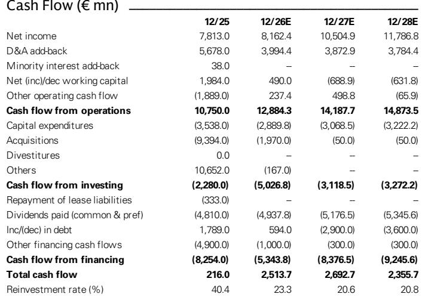
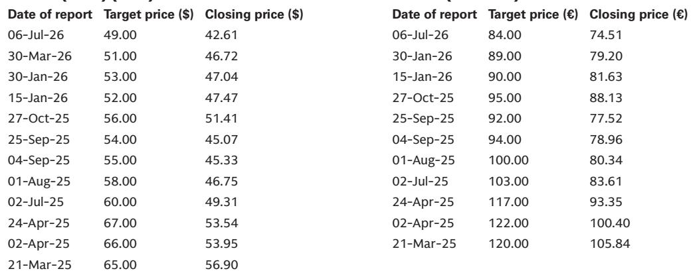

# GS：研究主题与行业变化观察

赛诺菲在2Q26业绩发布后报价回落约9%，市场对研发管线的担忧重新成为定价核心。GS在最新报告中更新公司观点，同时上调了2026至2027年的每股盈利预测2%至3%。这一看似矛盾的调整，恰好勾勒出赛诺菲当前的基本面轮廓：商业端表现扎实，研发端却缺乏让读者重建信心的具体证据。

报告特别指出，Dupixent的销售增长仍然强劲，疫苗业务的季度节奏也符合预期。但真正影响估值倍数的，是多项资产被终止开发后，市场对管线能否在Dupixent生物类似药进入市场前形成有效接续的疑问。GS认为，报价回落后市场可能有些反应过度，因为部分被终止的研发项目此前预期本就不高，但这一判断并不足以改变其观望立场。

## 1. 短期盈利上调与长期估值下修同时发生

GS将2026年和2027年的业务每股盈利分别上调至8.56欧元和9.72欧元，主要反映汇率变动、Dupixent超预期增长以及疫苗业务的时间节奏调整。但长期来看，由于研发投入增加以及被终止资产不再贡献收入，2028年及以后的每股盈利预测被下调约1%。

这种短期与长期的分化，在估值上体现得更为直接。GS将目标市盈率从8.5倍下调至8倍，DCF估值从83欧元降至75欧元。报告认为，商业执行的强劲只能支撑近端盈利，却无法解决市场对管线接续能力的长期疑问。

，而是GS同时上调短期盈利、下调长期盈利这一组合。它说明当前估值折价的根源不在当期业绩，而在市场对2028年后增长来源的定价。

## 2. 研发转型处于早期阶段，时间表尚未明确

新任CEO提出的优先事项包括加强科学严谨性、简化治理结构、强化问责机制和重新排定管线优先级。但GS在报告中对这些举措的实际效果持保留态度，认为研发组织的全面转型可能需要七年以上时间，且难以判断过去研发效率不足的根源是试验执行问题还是科学判断问题。

管理层在业绩会上承认，历史上确实存在管线失败和研发挑战，并表示转型需要时间，但未给出具体时间表。GS认为，2026年下半年可能举办的专门研发活动，如果能够明确优先级、里程碑和时间线，将有助于市场建立评估框架。但在此之前，读者对研发生产率恢复速度的谨慎态度难以消除。

## 3. 与再生元的联盟关系仍是免疫学战略的核心变量

赛诺菲与再生元的合作被管理层反复强调为战略重点，Dupixent的成功也证明了这一联盟的价值。但GS指出，双方在资源分配上仍存在分歧，联盟的运作方式有进一步优化空间。管理层表示，讨论正在进行中，未来可能纳入两家公司的更多资产，同时强调联盟不会限制赛诺菲独立开展并购。

GS的分析提出了一个值得关注的细节：双方能够投入联盟的资产可能存在不平衡。赛诺菲方面是临床前的STAT6项目，而再生元拥有长效IL13和IL13/IL4组合。如果这种不平衡持续，赛诺菲可能需要通过现金支付来平衡合作关系，这将对资金配置产生影响。

## 4. 观察赛诺菲后续进展的框架

从这份报告中可以提炼出三个观察维度。第一，研发活动的具体产出，包括2026年下半年可能举办的研发专场活动是否给出可量化的里程碑和时间表。第二，并购与业务拓展的实际动作，管理层明确表示联盟不构成并购障碍，但市场需要看到交易落地而非口头承诺。第三，Dupixent在主要适应症中的增长趋势能否延续，这决定了近端盈利预测的可靠性。

GS在报告中还提到，管理层承认未来可能宣布更多管线终止，超出目前已披露的范围。这意味着研发管线的调整尚未结束，后续的资产处置公告本身不一定是谨慎信号，关键在于资源重新配置后能否产生更有科学价值和商业潜力的项目。

For informational purposes only. Portions may be generated,translated,summarized,or edited with AI assistance based on source materials and may contain omissions or errors. Please verify independently. This is not investment,legal,tax,accounting,or other professional advice.

For informational purposes only. Portions may be generated,translated,summarized,or edited with AI assistance based on source materials and may contain omissions or errors. Please verify independently. This is not investment,legal,tax,accounting,or other professional advice.

