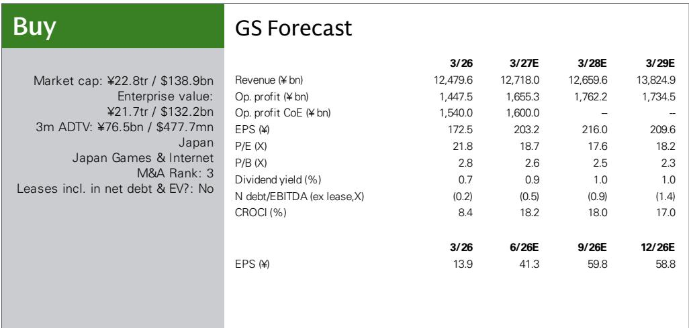
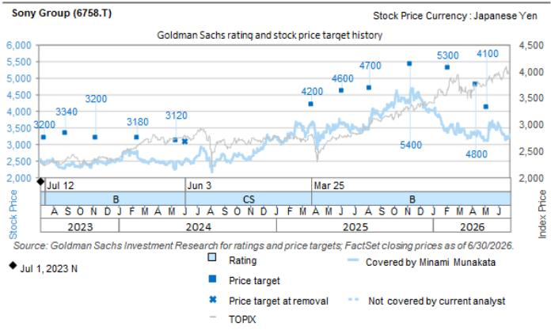

# 索尼提议收购腾龙：从内容到“创作技术”，硬件优势的下一个战略支点

索尼集团于7月29日提议收购腾龙——这家它已持有15.35%股份的独立镜头制造商。这是索尼多年来在三大娱乐支柱之外最重要的一次硬件收购。据报道，收购报价约为每股1300日元，对应剩余股份的总权益成本约为1880亿日元。相对于索尼22.8万亿日元的市值，这笔金额并不算大，但其战略密度却相当高。这不是一次简单的业务扩张，而是一场垂直整合，直指索尼最赚钱的非娱乐业务核心。

收购的时机耐人寻味。索尼计划于7月31日公布2026财年第一季度业绩，恰在收购提案公开两天之后。索尼将此次收购定义为符合其既定的战略投资方针，聚焦于“创作技术”，而非向硬件领域的重心转移。但这种表述低估了此举的意义。将腾龙的光学技术及其大众用户产品线完全纳入麾下，索尼不只是收购了一家供应商，而是在整合支撑其影像业务的核心工程能力——当下相机与车载感知领域的竞争都在显著加剧。

对于观察者而言，这笔交易值得从三个层面审视：它对索尼影像业务盈利能力的影响、它反映出的资本配置纪律，以及它揭示的索尼下一轮收购的战略逻辑。这三个层面的答案，都比头条新闻中的溢价数字更为复杂。

## 影像业务是索尼最赚钱的核心，而镜头是不能再留给少数股权伙伴的瓶颈

索尼的ET&S部门（含影像业务），据一家全球投资银行报告预测，2026财年将实现1809亿日元的营业利润，是该部门中最赚钱的核心业务，也是集团1.4475万亿日元合并营业利润预测的关键贡献者。在该业务中，镜头并非边缘部件，而是相机系统的光学灵魂，决定了画质、弱光表现以及支撑高溢价的整体用户体验。索尼在高端及专业级相机机身方面历来表现出色，但其面向大众消费者的镜头产品线相对单薄。相比之下，腾龙在该细分市场建立了完善的产品矩阵，提供与索尼旗舰产品互补而非竞争的微单及单反可换镜头。

全资拥有的战略逻辑很直接。作为15.35%的股东，索尼对腾龙的产品路线图、定价策略和产能分配有影响力但无控制权。在相机系统即生态系统的市场中，镜头供应往往驱动机身销售，将生态系统的关键部件部分置于自身控制之外，是一种结构性脆弱。全资拥有消除了协调摩擦，使索尼能够将腾龙的研发管线与自家相机机身发布对齐，确保最重要配件的供应连续性，并完整获取镜头销售的利润层级，而非与少数股东分享。

这笔交易的财务规模远不如其方向重要。1880亿日元的收购，只是索尼第四期中期计划1.3万亿日元战略投资的一小部分，但它明确宣告了下一阶段价值创造将来自何处。影像业务并非遗留资产，而是一项高利润、定义品牌形象的运营，受益于与索尼娱乐业务相同的网络效应。镜头是让用户锁定于某一系统的经常性收入配件。拥有这种锁定价值，远超15%股权所能带来的。

## 腾龙在车载与医疗光学领域的多元化布局，为索尼提供了相机之外的第二个协同引擎

相机镜头的叙事最容易理解，但并非相对少见，且从中期来看可能不是最有价值的。腾龙的披露显示，它一直在稳步拓展可换相机镜头之外的业务，涉足安防与工厂自动化的工业镜头，以及车载和医疗应用。这正是收购战略逻辑与索尼更广泛的传感器布局交汇之处。

索尼的I&SS部门（生产CMOS图像传感器）在车载应用领域正经历加速增长。该公司的传感器已是智能手机相机的行业标杆，但车载市场代表着一个更大的潜在市场，且技术要求不同。车载相机需要能够承受极端温度、振动和长使用寿命的镜头，同时保持稳定的光学性能。它们还需要将镜头与传感器集成到单一模块中，使车厂能够直接用于其高级驾驶辅助系统或自动驾驶系统。腾龙的光学工程专长，结合索尼的传感器技术，可能打造出竞争对手难以匹敌的垂直整合感知模块方案。

医疗镜头业务增添了另一个维度。从内窥镜到手术显微镜，医疗成像设备需要具有严格质量标准的精密光学器件。这是一个高利润、关系驱动的业务，可靠性比价格更重要。腾龙在该领域的布局，为索尼在微创手术和诊断成像全球扩张的市场中提供了一个滩头阵地。协同效应虽不如相机领域那么直接，但战略选择权是真实存在的。

投资银行报告明确指出了这一潜力，提到索尼车载图像传感器业务的加速增长以及在感知模块领域创造协同的可能性。关键词是“感知模块”。索尼历来将传感器作为独立组件销售；收购腾龙表明其意图提供完整的感知解决方案，将镜头、传感器以及可能的图像处理集成于单一封装中。这是价值链中一个根本不同且可能更有价值的定位。

## 这笔交易考验索尼的资本配置纪律——此前偏向娱乐，如今需证明能在硬件领域创造价值

索尼近期的收购历史由三大娱乐业务主导：游戏与网络服务、音乐、影视。在第四期中期计划中，索尼将1.3万亿日元战略投资中约四分之三分配给了这三大支柱。近期动作，包括收购皇后乐队音乐目录以及对万代南梦宫和角川的战略投资，延续了这一模式进入第五期中期计划。腾龙提案打破了这一惯例，而索尼坚称这并不代表投资优先级的转变，这是向那些担心索尼重回多年精简掉的集团扩张老路的读者发出的措辞谨慎的信号。

这一信号部分可信。腾龙并非新的业务线，而是在核心能力领域对现有关系的深化。收购相对于索尼的资产负债表规模较小，也不意味着向硬件集团化建设的转向。但索尼阐述的战略投资方针瞄准三个领域：内容IP、有助于提升IP价值的领域，以及创作技术。腾龙完全属于第三类。问题在于，“创作技术”能否产生与内容IP同等的回报，以及代价如何。

这笔交易的溢价温和，较7月29日收盘价约15%，表明索尼并未为控制权支付过高代价。这种纪律令人鼓舞，但真正的考验在于执行。索尼的影像业务盈利良好，但面临结构性挑战。全球相机市场多年来持续收缩，智能手机不断蚕食入门级和中端设备。剩余市场集中于高端和专业领域，索尼在此与佳能、尼康竞争，同时面临不断推高规格曲线的中国新进入者。腾龙的大众用户产品线帮助索尼守住中端市场，但并未逆转智能手机替代的底层趋势。

更具说服力的增长故事在车载和工业感知应用领域，但这些市场开发周期更长，竞争格局不同。索尼需要证明，它能在不扰乱与现有镜头供应商关系的前提下，将腾龙的光学技术整合进传感器业务。公司还必须表明，此次收购不会分散管理层对驱动集团增长主力的娱乐业务的注意力。

## 评估这笔交易的决策框架：协同、增长与资本配置三个问题

腾龙提案为评估索尼的战略方向，乃至更广泛地评估科技硬件领域的任何垂直整合举措，提供了一个有用的模板。该框架包含三个组成部分，每个都对应交易中的特定不确定性。

第一，协同可信度。只有当合并后的实体能够获取两家公司独立时无法获取的价值时，收购才有意义。在相机业务中，这意味着对齐产品路线图、协调发布时机，并完整获取镜头销售的利润。在感知模块业务中，意味着将光学与传感器集成为能获得高于组件销售溢价的封装方案。投资银行报告将这些列为需与公司确认的关键事项，观察者应以这一标准审视管理层。协同效应的估算向来偏乐观；问题在于整合计划是否足够具体以令人信服。

第二，增长方向。影像业务已成熟，车载和医疗应用尚在早期。收购的价值取决于哪个增长故事占主导。如果腾龙主要仍是相机镜头制造商，这笔交易就是防御性整合，保护一项盈利但增长缓慢的业务。如果腾龙的工业、车载和医疗业务在索尼旗下实现规模化，这笔交易就变成对感知技术未来的进攻性押注。这一区别很重要，因为它决定了适当的估值倍数和预期资本回报率。

第三，资本配置优先级。索尼的战略资本池有限，花在腾龙上的每一日元，都是未花在内容IP或娱乐扩张上的日元。公司既定方针允许两者兼顾，但市场将关注此次收购是更广泛硬件转向的开端，还是核心能力领域的一次性整合。投资银行报告指出，近期重大投资集中于娱乐领域，而公司坚称腾龙交易不改变这一优先级，这令人安心但并非定论。证据将在未来几个季度出现，随着索尼的收购管线变得更加清晰。

这三个问题并非相互独立。可信的协同故事使增长方向更可信，清晰的增长方向则为资本配置提供合理性。反之，如果协同效应模糊、增长故事单薄，这笔交易看起来就像防御性举措，占用资本却未创造战略选择权。索尼在整合收购方面有良好记录，尤其在娱乐领域，但硬件整合是另一块肌肉。公司能否灵活运用这一能力，将决定这笔交易是未来动作的模板，还是一次性的操作。

## 收购的最终价值，取决于索尼能否将光学控制转化为平台优势，而非仅仅是产品优势

腾龙提案最好被理解为一次尝试：将产品层面的优势转化为平台层面的优势。索尼的相机本身出色，但围绕它们的生态系统——镜头、传感器、软件和服务——才是长期价值所在。通过全资控制腾龙，索尼表明它想拥有更多该生态系统，而非仅仅参与其中。同样的逻辑适用于车载感知领域，从独立传感器向集成模块的转变正在加速。

风险在于，索尼可能高估了自己管理一个节奏与娱乐业务不同的硬件业务的能力。腾龙自1950年以来一直是独立公司，拥有自己的文化、工程优先级和客户关系。将其整合进索尼更广泛的结构中，包括矩阵式管理和跨部门协调，可能会稀释腾龙最初的价值所在。腾龙的创始人和工程师们建立了生产高质量、价格合理、填补市场空白的镜头的声誉。这种灵活性可能在更大的组织中丧失，尤其是如果索尼管理层试图在其所有影像业务中推行统一的产品战略。

反方论点是，索尼在处理这类问题上有经验。其图像传感器业务与三星及众多中国对手竞争，在索尼管理下蓬勃发展，恰恰因为它结合了工程卓越与制造规模。索尼在激烈竞争的市场中保持技术领先的能力表明，它能够管理复杂的硬件业务而不扼杀创新。收购腾龙将该能力延伸至光学领域，索尼的传感器专长与腾龙的镜头专长的结合，可能为竞争对手筑起一道 formidable 的进入壁垒。

市场的初步反应——温和溢价，索尼股价无剧烈重估——表明这笔交易被视为合理但非变革性。这一判断可能正确，但它低估了此举的战略意义。索尼不只是收购一家镜头制造商；它押注的是，影像与感知领域下一阶段的价值创造将来自拥有完整光学链条。如果这一赌注成功，1880亿日元将显得物超所值。如果失败，这笔交易将被铭记为一次未能改变格局的防御性整合。目前的证据——腾龙在车载和医疗应用的增长、索尼传感器业务的加速，以及温和的溢价——使天平倾向于索尼一方。

*仅供参考。部分内容可能基于源材料由AI辅助生成、翻译、摘要或编辑，可能存在遗漏或错误。请独立核实。本文不构成投资、法律、税务、会计或其他专业建议。*

仅供参考。部分内容可能基于源材料由AI辅助生成、翻译、摘要或编辑，可能存在遗漏或错误。请独立核实。本文不构成投资、法律、税务、会计或其他专业建议。

