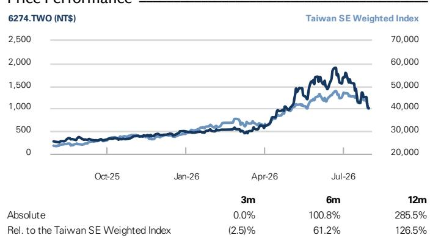

6274.TWO relative to Asia ex. Japan Coverage  
6274.TWO relative to Taiwan Electronic Components

<table><tr><td>Key Data</td></tr><tr><td>Market cap: NT$255.7bn / $7.9bn</td></tr><tr><td>Enterprise value: NT$253.5bn / $7.8bn</td></tr><tr><td>3m ADTV: NT$9.2bn / $290.3mn</td></tr><tr><td>Taiwan</td></tr><tr><td>Taiwan Electronic Components</td></tr><tr><td>M&A Rank: 3</td></tr><tr><td>Leases incl. in net debt & EV?: No</td></tr></table>

# 台湾联茂电子 (6274.TWO)

高端客户需求支撑长期产能扩张；维持报告评级

6274.TWO 12个月目标价：新台币3,010元 | 现价：新台币1,010元 | 潜在空间：198.0%

我们于7月30日参加了公司2Q业绩后电话会，要点如下：

(1) 泰国厂新产能爬坡时间较原计划提前约2个月（技术爬坡速度快于预期）。公司此前预计新产能自9月起逐步释放，实际已于7月中旬启动爬坡。公司预计泰国新产能爬坡将自3Q起提升其在高端AI服务器项目中的份额。

(2) 公司宣布2028年将在泰国及中国大陆新增195万张产能（约为当前产能的80%）。公司表示扩产规模基于客户实际需求展望（2028年后美国及中国大陆对高端CCL需求均将持续增长），并提到扩产速度仍低于客户订单预测。

(3) 价格方面，公司表示1H26的涨价主要集中于低端CCL，但自4Q初起已观察到M7产品价格上调。M8等级CCL方面，公司将等待台湾主要同业率先调价后再做跟进。

(4) M7/M8等级CCL已占整体营收39%（2Q为36%）。公司进一步表示，考虑到ASIC AI服务器、高端交换器及未来LEO项目对M8等级CCL的采用率持续提升，M7/M8需求将在未来数季/数年呈现明显上升趋势。

(5) AI服务器方面，公司正与多家客户就未来新一代高端AI项目（主要为M8+等级CCL）进行认证，涵盖不同GPU/AI CPU/ASIC平台，并认为随着产能增加及ASP/产品组合改善，未来数季营收将持续向上。

## 买入

Chao Wang  
+886(2)2730-4195 | kuan-chao.wang@gs.com  
GS (Asia) L.L.C., Taipei Branch

Allen Chang  
+852-2978-2930 | allen.k.chang@gs.com  
GS (Asia) L.L.C.

Al Wang  
+886(2)2730-4081 | al.wang@gs.com  
GS (Asia) L.L.C., Taipei Branch

GS预测

<table><tr><td colspan="5">GS Forecast</td></tr><tr><td></td><td>12/25</td><td>12/26E</td><td>12/27E</td><td>12/28E</td></tr><tr><td>营收（新台币百万元）</td><td>30,340.2</td><td>61,760.3</td><td>120,421.1</td><td>202,912.8</td></tr><tr><td>EBITDA（新台币百万元）</td><td>4,802.7</td><td>16,246.4</td><td>39,229.2</td><td>70,015.3</td></tr><tr><td>EPS（新台币）</td><td>12.13</td><td>38.63</td><td>97.22</td><td>178.48</td></tr><tr><td>P/E（倍）</td><td>21.2</td><td>26.1</td><td>10.4</td><td>5.7</td></tr><tr><td>P/B（倍）</td><td>4.0</td><td>13.4</td><td>9.7</td><td>6.4</td></tr><tr><td>股息率（%）</td><td>2.9</td><td>2.7</td><td>6.7</td><td>12.4</td></tr><tr><td>净债务/EBITDA（不含租赁，倍）</td><td>(0.1)</td><td>(0.4)</td><td>(0.4)</td><td>(0.4)</td></tr><tr><td>CROCI（%）</td><td>19.4</td><td>41.6</td><td>94.1</td><td>149.0</td></tr><tr><td>FCF回报表现（%）</td><td>(1.9)</td><td>1.3</td><td>4.6</td><td>9.7</td></tr><tr><td></td><td>6/26</td><td>9/26E</td><td>12/26E</td><td>3/27E</td></tr><tr><td>EPS（新台币）</td><td>8.02</td><td>12.53</td><td>13.72</td><td>15.44</td></tr></table>

GS因子画像

  
资料来源：公司数据，GS预测。详情请参阅披露。

## 台湾联茂电子 (6274.TWO)

现金流量表（新台币百万元）  
自2019年6月19日起评级  
比率与估值

<table><tr><td colspan="5">比率与估值</td></tr><tr><td></td><td>12/25</td><td>12/26E</td><td>12/27E</td><td>12/28E</td></tr><tr><td>P/E（倍）</td><td>21.2</td><td>26.1</td><td>10.4</td><td>5.7</td></tr><tr><td>P/B（倍）</td><td>4.0</td><td>13.4</td><td>9.7</td><td>6.4</td></tr><tr><td>FCF回报表现（%）</td><td>(1.9)</td><td>1.3</td><td>4.6</td><td>9.7</td></tr><tr><td>EV/EBITDAR（倍）</td><td>15.0</td><td>18.0</td><td>7.3</td><td>4.0</td></tr><tr><td>EV/EBITDA（不含租赁）（倍）</td><td>15.0</td><td>18.0</td><td>7.3</td><td>4.0</td></tr><tr><td>CROCI（%）</td><td>19.4</td><td>41.6</td><td>94.1</td><td>149.0</td></tr><tr><td>ROE（%）</td><td>20.7</td><td>55.5</td><td>108.1</td><td>136.0</td></tr><tr><td>净债务/权益（%）</td><td>(1.8)</td><td>(23.4)</td><td>(42.2)</td><td>(51.7)</td></tr><tr><td>净债务/权益（不含租赁）（%）</td><td>(1.8)</td><td>(23.4)</td><td>(42.2)</td><td>(51.7)</td></tr><tr><td>利息保障倍数（倍）</td><td>49.0</td><td>134.9</td><td>331.2</td><td>594.2</td></tr><tr><td>存货周转天数</td><td>63.7</td><td>40.7</td><td>25.4</td><td>24.8</td></tr><tr><td>应收账款天数</td><td>143.0</td><td>103.8</td><td>92.1</td><td>95.6</td></tr><tr><td>应付账款天数</td><td>123.1</td><td>87.1</td><td>68.6</td><td>72.2</td></tr><tr><td>杜邦ROE（%）</td><td>18.3</td><td>43.5</td><td>74.0</td><td>90.0</td></tr><tr><td>周转率（倍）</td><td>0.8</td><td>1.2</td><td>1.4</td><td>1.5</td></tr><tr><td>杠杆率（倍）</td><td>2.1</td><td>2.0</td><td>2.2</td><td>2.3</td></tr><tr><td>总现金投资（不含现金）（新台币百万元）</td><td>27,151.9</td><td>29,183.5</td><td>31,984.4</td><td>38,254.4</td></tr><tr><td>平均动用资本（新台币百万元）</td><td>14,409.3</td><td>19,062.0</td><td>21,019.2</td><td>25,095.6</td></tr><tr><td>每股净资产（新台币）</td><td>64.47</td><td>75.42</td><td>104.49</td><td>158.03</td></tr></table>

利润表（新台币百万元）

<table><tr><td></td><td>12/25</td><td>12/26E</td><td>12/27E</td><td>12/28E</td></tr><tr><td>总营收</td><td>30,340.2</td><td>61,760.3</td><td>120,421.1</td><td>202,912.8</td></tr><tr><td>营业成本</td><td>(23,442.4)</td><td>(42,250.4)</td><td>(75,964.0)</td><td>(125,624.5)</td></tr><tr><td>销售及管理费用</td><td>(2,039.8)</td><td>(3,132.8)</td><td>(4,482.6)</td><td>(5,702.9)</td></tr><tr><td>研发费用</td><td>(514.3)</td><td>(589.8)</td><td>(1,204.2)</td><td>(2,029.1)</td></tr><tr><td>其他营业收支</td><td>-</td><td>-</td><td>-</td><td>-</td></tr><tr><td>EBITDA</td><td>4,802.7</td><td>16,246.4</td><td>39,229.2</td><td>70,015.3</td></tr><tr><td>折旧与摊销</td><td>(459.0)</td><td>(459.0)</td><td>(459.0)</td><td>(459.0)</td></tr><tr><td>EBIT</td><td>4,343.7</td><td>15,787.3</td><td>38,770.2</td><td>69,556.3</td></tr><tr><td>净利息收入/支出</td><td>41.9</td><td>(9.7)</td><td>109.5</td><td>319.5</td></tr><tr><td>联营公司损益</td><td>-</td><td>-</td><td>-</td><td>-</td></tr><tr><td>税前利润</td><td>4,518.6</td><td>15,382.7</td><td>37,850.2</td><td>69,485.3</td></tr><tr><td>所得税</td><td>(1,109.5)</td><td>(4,118.7)</td><td>(9,462.5)</td><td>(17,371.3)</td></tr><tr><td>少数股东权益</td><td>-</td><td>-</td><td>-</td><td>-</td></tr><tr><td>优先股股息</td><td>-</td><td>-</td><td>-</td><td>-</td></tr><tr><td>净利润（剔除特殊项目前）</td><td>3,409.1</td><td>11,263.9</td><td>28,387.6</td><td>52,113.9</td></tr><tr><td>税后特殊项目</td><td>-</td><td>-</td><td>-</td><td>-</td></tr><tr><td>净利润（含特殊项目）</td><td>3,409.1</td><td>11,263.9</td><td>28,387.6</td><td>52,113.9</td></tr><tr><td>EPS（基本，剔除特殊项目）（新台币）</td><td>12.13</td><td>38.63</td><td>97.22</td><td>178.48</td></tr><tr><td>EPS（稀释，剔除特殊项目）（新台币）</td><td>12.13</td><td>38.63</td><td>97.22</td><td>178.48</td></tr><tr><td>EPS（基本，含特殊项目）（新台币）</td><td>12.13</td><td>38.63</td><td>97.22</td><td>178.48</td></tr><tr><td>EPS（稀释，含特殊项目）（新台币）</td><td>12.13</td><td>38.63</td><td>97.22</td><td>178.48</td></tr><tr><td>DPS（新台币）</td><td>7.51</td><td>27.04</td><td>68.06</td><td>124.94</td></tr><tr><td>股息支付率（%）</td><td>61.9</td><td>70.0</td><td>70.0</td><td>70.0</td></tr></table>

增长与利润率（%）

<table><tr><td></td><td>12/25</td><td>12/26E</td><td>12/27E</td><td>12/28E</td></tr><tr><td>总营收增长</td><td>31.5</td><td>103.6</td><td>95.0</td><td>68.5</td></tr><tr><td>EBITDA增长</td><td>26.9</td><td>238.3</td><td>141.5</td><td>78.5</td></tr><tr><td>EPS增长</td><td>26.9</td><td>218.3</td><td>151.7</td><td>83.6</td></tr><tr><td>DPS增长</td><td>15.5</td><td>260.0</td><td>151.7</td><td>83.6</td></tr><tr><td>EBIT利润率</td><td>14.3</td><td>25.6</td><td>32.2</td><td>34.3</td></tr><tr><td>EBITDA利润率</td><td>15.8</td><td>26.3</td><td>32.6</td><td>34.5</td></tr><tr><td>净利润率</td><td>11.2</td><td>18.2</td><td>23.6</td><td>25.7</td></tr></table>

价格表现  
  
资料来源：FactSet。价格为2026年7月30日收盘价。

资产负债表（新台币百万元）

<table><tr><td colspan="5">资产负债表（新台币百万元）</td></tr><tr><td></td><td>12/25</td><td>12/26E</td><td>12/27E</td><td>12/28E</td></tr><tr><td>现金及现金等价物</td><td>5,165.0</td><td>10,897.4</td><td>20,997.6</td><td>34,746.7</td></tr><tr><td>应收账款</td><td>13,986.5</td><td>21,150.8</td><td>39,590.5</td><td>66,711.1</td></tr><tr><td>存货</td><td>7,404.8</td><td>6,366.5</td><td>10,406.0</td><td>17,208.8</td></tr><tr><td>其他流动资产</td><td>5,794.7</td><td>5,794.7</td><td>5,794.7</td><td>5,794.7</td></tr><tr><td>流动资产合计</td><td>32,351.0</td><td>44,209.3</td><td>76,788.8</td><td>124,461.2</td></tr><tr><td>净固定资产</td><td>5,565.5</td><td>6,318.9</td><td>7,072.4</td><td>7,825.9</td></tr><tr><td>净无形资产</td><td>36.4</td><td>23.9</td><td>11.4</td><td>(1.1)</td></tr><tr><td>总投资</td><td>0.0</td><td>0.0</td><td>0.0</td><td>0.0</td></tr><tr><td>其他长期资产</td><td>1,788.2</td><td>1,788.2</td><td>1,788.2</td><td>1,788.2</td></tr><tr><td>总资产</td><td>39,741.1</td><td>52,340.4</td><td>85,660.8</td><td>134,074.2</td></tr><tr><td>应付账款</td><td>10,319.7</td><td>9,839.1</td><td>18,730.9</td><td>30,975.9</td></tr><tr><td>短期债务</td><td>2,141.1</td><td>2,141.1</td><td>2,141.1</td><td>2,141.1</td></tr><tr><td>短期租赁负债</td><td>-</td><td>-</td><td>-</td><td>-</td></tr><tr><td>其他流动负债</td><td>2,159.9</td><td>7,934.7</td><td>19,921.3</td><td>36,529.8</td></tr><tr><td>流动负债合计</td><td>14,620.6</td><td>19,914.9</td><td>40,793.3</td><td>69,646.7</td></tr><tr><td>长期债务</td><td>2,685.6</td><td>2,685.6</td><td>2,685.6</td><td>2,685.6</td></tr><tr><td>长期租赁负债</td><td>-</td><td>-</td><td>-</td><td>-</td></tr><tr><td>其他长期负债</td><td>3,820.9</td><td>3,820.9</td><td>3,820.9</td><td>3,820.9</td></tr><tr><td>长期负债合计</td><td>6,506.5</td><td>6,506.5</td><td>6,506.5</td><td>6,506.5</td></tr><tr><td>总负债</td><td>21,127.1</td><td>26,421.4</td><td>47,299.7</td><td>76,153.2</td></tr><tr><td>优先股</td><td>-</td><td>-</td><td>-</td><td>-</td></tr><tr><td>普通股权益合计</td><td>18,614.0</td><td>21,993.2</td><td>30,509.5</td><td>46,143.7</td></tr><tr><td>少数股东权益</td><td>0.0</td><td>3,925.8</td><td>7,851.6</td><td>11,777.4</td></tr><tr><td>总负债及权益</td><td>39,741.1</td><td>52,340.4</td><td>85,660.8</td><td>134,074.2</td></tr><tr><td>净债务（调整后）</td><td>(338.3)</td><td>(6,070.7)</td><td>(16,171.0)</td><td>(29,920.1)</td></tr></table>

<table><tr><td colspan="5">现金流量表（新台币百万元）</td></tr><tr><td></td><td>12/25</td><td>12/26E</td><td>12/27E</td><td>12/28E</td></tr><tr><td>净利润</td><td>3,409.1</td><td>11,263.9</td><td>28,387.6</td><td>52,113.9</td></tr><tr><td>加回折旧摊销</td><td>459.0</td><td>459.0</td><td>459.0</td><td>459.0</td></tr><tr><td>加回少数股东权益</td><td>-</td><td>-</td><td>-</td><td>-</td></tr><tr><td>营运资本变动（净额）</td><td>(3,810.0)</td><td>(6,606.5)</td><td>(13,587.5)</td><td>(21,678.3)</td></tr><tr><td>其他经营现金流</td><td>537.6</td><td>-</td><td>-</td><td>-</td></tr><tr><td>经营活动现金流</td><td>595.8</td><td>5,116.5</td><td>15,259.2</td><td>30,894.6</td></tr><tr><td>资本支出</td><td>(1,948.6)</td><td>(1,200.0)</td><td>(1,200.0)</td><td>(1,200.0)</td></tr><tr><td>收购</td><td>-</td><td>-</td><td>-</td><td>-</td></tr><tr><td>处置</td><td>25.3</td><td>-</td><td>-</td><td>-</td></tr><tr><td>其他</td><td>(4,578.5)</td><td>-</td><td>-</td><td>-</td></tr><tr><td>投资活动现金流</td><td>(6,501.8)</td><td>(1,200.0)</td><td>(1,200.0)</td><td>(1,200.0)</td></tr><tr><td>偿还租赁负债</td><td>-</td><td>-</td><td>-</td><td>-</td></tr><tr><td>已付股息（普通股及优先股）</td><td>(1,797.0)</td><td>(2,109.9)</td><td>(7,884.7)</td><td>(19,871.3)</td></tr><tr><td>债务增加/减少</td><td>2,759.5</td><td>-</td><td>-</td><td>-</td></tr><tr><td>其他融资现金流</td><td>3,828.4</td><td>3,925.8</td><td>3,925.8</td><td>3,925.8</td></tr><tr><td>融资活动现金流</td><td>4,791.0</td><td>1,815.9</td><td>(3,958.9)</td><td>(15,945.6)</td></tr><tr><td>总现金流</td><td>(1,115.0)</td><td>5,732.4</td><td>10,100.2</td><td>13,749.1</td></tr><tr><td>自由现金流</td><td>(1,352.8)</td><td>3,916.5</td><td>14,059.2</td><td>29,694.6</td></tr></table>

资料来源：公司数据，GS预测。

(6) 高端交换器方面，公司预计现有客户对采用M8/M8.5/M9等级的800G/1.6T交换器需求展望稳健，近期亦通过新交换器客户认证，预示高端交换器领域需求将进一步增强。我们的供应链调研显示，800G/1.6T交换器CCL需求在2027年同比增幅至少达到100%以上，管理层表示该增速与客户订单预测一致。

(7) LEO方面，公司表示正与主要LEO客户合作，以支持其未来数年AI相关需求，并预计CCL等级将从目前的M6逐步升级至未来数季/数年的M7/M8。此外，客户正要求更多长期产能以支持2028年后的需求。

(8) 公司认为高端CCL厂商的ASP/毛利率上行趋势刚刚开始，并提到CCL产品涨价不仅是成本转嫁，还包括因更高机会成本带来的额外价格上调——目前高端高质量CCL产能供应非常紧张。此外，公司提到高质量CCL产能扩张周期至少需要24个月以上，并认为至少在2028年底前不会出现供需反转的风险。

我们维持对TUC的报告评级，预计TUC将持续优化产品组合，承接更多来自EMC的外溢高端订单（TUC M7/M8占2Q营收39%，EMC为60-65%），不仅来自AI服务器行业，还包括高端交换器及LEO行业。我们预计EMC新产能最早于2026年底投产（参见此处），而M7+ CCL需求在2H26仍将环比增长50%以上（我们预计2027年TAM同比增幅超过100%——参见此处）。

同时，考虑到稳健的需求展望，我们对TUC未来数年的主动扩产计划持积极看法。TUC在过去10余年的扩产态度最为审慎，每次投资新产能前均会与客户仔细确认未来需求。因此，我们认为TUC此次主动扩产策略经过与客户的充分沟通及基于自身对未来需求的研究，长期风险相对有限。

此外，TUC在定价策略上较EMC更为灵活。EMC自2Q26起已对M2-7等级CCL进行两轮涨价，而TUC持续观察到客户需求快于预期，这将有助于公司在未来数年缩小与EMC在毛利率/营业利润率上的差距。考虑到公司产能目前满负荷运转，我们认为低端客户可能因高价格而取消订单，这将为TUC腾出更多产能/空间与高端/AI客户合作，提供ASP和毛利率改善空间（高端AI项目ASP可达低端项目的3-5倍，毛利率可达40%以上，而低端项目仅为5-15%）。

维持TUC报告评级，预测及12个月目标价不变，目标价新台币3,010元，基于22倍2H27-1H28E EPS（较过去3年行业平均P/E倍数高出2个标准差）。

图表1：损益表

<table><tr><td>新台币百万元</td><td>1Q26</td><td>2Q26</td><td>3Q26E</td><td>4Q26E</td><td>1Q27E</td><td>2Q27E</td><td>3Q27E</td><td>4Q27E</td><td>1Q28E</td><td>2Q28E</td><td>3Q28E</td><td>4Q28E</td><td>2025</td><td>2026E</td><td>2027E</td><td>2028E</td><td>2029E</td></tr><tr><td>营收</td><td>10,054</td><td>14,301</td><td>17,621</td><td>19,785</td><td>21,664</td><td>25,821</td><td>33,587</td><td>39,348</td><td>41,153</td><td>45,886</td><td>55,305</td><td>60,569</td><td>30,340</td><td>61,760</td><td>120,421</td><td>202,913</td><td>297,071</td></tr><tr><td>毛利</td><td>2,529</td><td>4,250</td><td>5,835</td><td>6,897</td><td>7,712</td><td>9,395</td><td>12,468</td><td>14,883</td><td>15,466</td><td>17,196</td><td>21,093</td><td>23,533</td><td>6,898</td><td>19,510</td><td>44,457</td><td>77,288</td><td>117,670</td></tr><tr><td>营业费用</td><td>(701)</td><td>(892)</td><td>(1,022)</td><td>(1,108)</td><td>(1,181)</td><td>(1,381)</td><td>(1,511)</td><td>(1,613)</td><td>(1,708)</td><td>(1,790)</td><td>(1,963)</td><td>(2,271)</td><td>(2,554)</td><td>(3,723)</td><td>(5,687)</td><td>(7,732)</td><td>(11,341)</td></tr><tr><td>营业利润</td><td>1,828</td><td>3,358</td><td>4,813</td><td>5,789</td><td>6,531</td><td>8,013</td><td>10,956</td><td>13,270</td><td>13,758</td><td>15,407</td><td>19,130</td><td>21,262</td><td>4,344</td><td>15,787</td><td>38,770</td><td>69,556</td><td>106,329</td></tr><tr><td>税前利润</td><td>1,874</td><td>3,427</td><td>4,813</td><td>5,269</td><td>6,011</td><td>7,613</td><td>10,956</td><td>13,270</td><td>13,722</td><td>15,372</td><td>19,130</td><td>21,262</td><td>4,519</td><td>15,383</td><td>37,850</td><td>69,485</td><td>106,258</td></tr><tr><td>所得税</td><td>(614)</td><td>(1,085)</td><td>(1,155)</td><td>(1,265)</td><td>(1,503)</td><td>(1,903)</td><td>(2,739)</td><td>(3,317)</td><td>(3,431)</td><td>(3,843)</td><td>(4,782)</td><td>(5,315)</td><td>(1,109)</td><td>(4,119)</td><td>(9,463)</td><td>(17,371)</td><td>(26,565)</td></tr><tr><td>净利润</td><td>1,260</td><td>2,342</td><td>3,658</td><td>4,005</td><td>4,508</td><td>5,710</td><td>8,217</td><td>9,952</td><td>10,292</td><td>11,529</td><td>14,347</td><td>15,946</td><td>3,409</td><td>11,264</td><td>28,388</td><td>52,114</td><td>79,694</td></tr><tr><td>EPS（新台币）</td><td>4.36</td><td>8.02</td><td>12.53</td><td>13.72</td><td>15.44</td><td>19.56</td><td>28.14</td><td>34.08</td><td>35.25</td><td>39.48</td><td>49.14</td><td>54.61</td><td>12.13</td><td>38.63</td><td>97.22</td><td>178.48</td><td>272.94</td></tr></table>

<table><tr><td colspan="13">比率分析及假设</td></tr><tr><td colspan="13">占营收比例</td></tr><tr><td>毛利率</td><td>25.1%</td><td>29.7%</td><td>33.1%</td><td>34.9%</td><td>35.6%</td><td>36.4%</td><td>37.1%</td><td>37.8%</td><td>37.6%</td><td>37.5%</td><td>38.1%</td><td>38.9%</td></tr><tr><td>营业费用率</td><td>7.0%</td><td>6.2%</td><td>5.8%</td><td>5.6%</td><td
