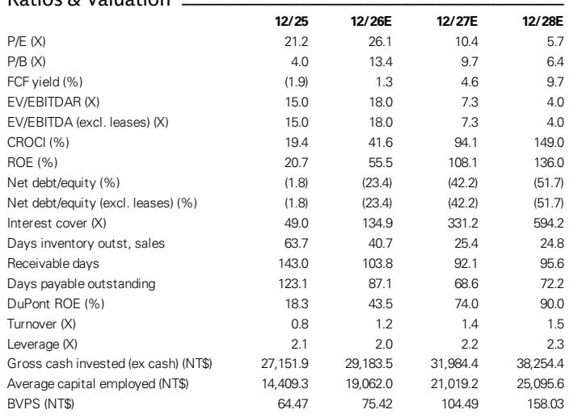
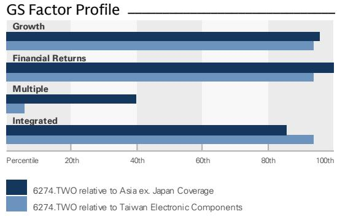
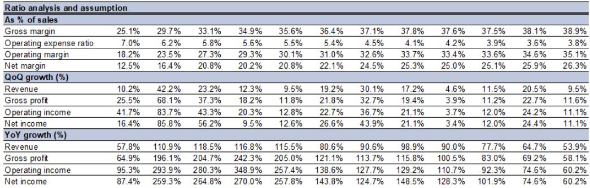

# GS：台燿科技扩产获高端客户与AI及近期数据观察

GS在7月30日台燿（6274.TWO）二季度业绩说明会后更新了判断。核心变化不在当期数字，而在产能节奏：泰国厂新产能爬坡从原计划的9月提前至7月中旬启动，比公司此前预期早了两个月。这家铜箔基板（CCL）厂商同时宣布2028年在泰国和中国大陆新增195万张产能，约为现有产能的80%。报告认为，高端AI服务器、800G/1.6T交换机和低轨卫星（LEO）三个方向的客户需求，是支撑这一扩张节奏的主要依据。

台燿M7/M8等级CCL收入占比在二季度达到39%，高于一季度的36%。公司预计这一比例在后续季度会继续上升，驱动力来自ASIC AI服务器、高端交换机和未来LEO项目对M8以上等级材料的采用。GS在报告中更新公司观点，对应2027下半年至2028上半年预期每股盈利的22倍市盈率。

## 1. 泰国厂爬坡提前两个月，高端AI服务器份额提升从三季度开始

台燿原计划9月开始泰国新产能爬坡，实际7月中旬就已启动。公司预计这一进度将改善其在高端AI服务器项目中的市场份额，从三季度开始体现。报告没有展开具体客户名单，但提到公司正在与多家客户推进下一代高端AI项目认证，涉及M8以上等级CCL，覆盖不同GPU、AI CPU和ASIC项目。

这一时间点值得注意。GS在报告中提到，台燿的竞争对手EMC要到2026年底才有新产能上线，而M7以上等级CCL需求在2026下半年预计环比增长50%以上。供给端的时间差，是台燿这轮份额提升的窗口。

> **KC评论：** 泰国厂提前两个月爬坡，表面是运营效率问题，实际是高端CCL供需缺口下的订单再分配。报告认为台燿是EMC产能空窗期的主要受益者，这个判断建立在M7+需求持续上行的假设上。

## 2. 2028年新增产能约为现有产能八成，扩张依据是客户实际需求预测

台燿宣布2028年在泰国和中国大陆新增195万张产能，约为当前产能的80%。公司强调，这一扩张规模基于客户的实际需求展望——美国和中国大陆在2028年后都会有更多高端CCL需求。管理层同时表示，扩张速度仍低于客户的订单预测。

台燿过去十年在产能扩张上偏保守，通常会先与客户确认未来需求再研究。GS认为，这次公司主动扩产，且经过客户需求复核，长期执行不确定性相对有限。报告同时指出，高端高质量CCL产能的建设周期至少24个月，公司判断供需关系在2028年底前不会出现逆转。

## 3. M7等级开始提价，M8等级等待同业跟进

价格方面，台燿表示2026上半年的提价主要集中在低端CCL，但从四季度初开始看到M7等级提价。M8等级CCL的提价，公司会等待台湾主要同业先行动。

公司认为高端CCL的ASP和毛利率上行趋势才刚刚开始。提价不只是成本转嫁，还包括对更高机会成本的补偿——高端高质量CCL产能供应紧张，公司有议价空间。报告提到，高端AI项目的ASP可以是低端项目的3到5倍，毛利率在40%以上，而低端项目毛利率只有5%到15%。

> **KC评论：** M8提价要等EMC先动，这个细节容易被忽略。它说明台燿在定价上跟随同业节奏，但M7已经率先提价，产品组合的利润弹性正在释放。报告预计2026年毛利率从2025年的22.7%升至31.6%，2027年进一步升至36.9%。

## 4. 800G/1.6T交换机CCL需求2027年至少弹性较高，LEO材料等级持续升级

高端交换机方面，台燿预计800G/1.6T交换机采用M8/M8.5/M9等级CCL的需求前景稳固，近期还通过了新交换机客户的认证。GS的供应链核查显示，800G/1.6T交换机CCL需求2027年同比增长至少100%，与管理层从客户订单预测中看到的情况一致。

LEO方面，公司正在与主要客户合作，支持其未来几年的AI相关需求。CCL等级预计从目前的M6逐步升级至M7/M8，客户还在要求更多长期产能以支持2028年后的需求。GS预计M7+ CCL的TAM在2027年同比增长超过100%。

## 5. 观察框架：产能节奏、产品组合与定价顺序

这份报告提供了一个观察高端CCL行业的框架。第一看产能节奏：谁的新产能先落地，谁就能在EMC产能空窗期获得份额。第二看产品组合：M7/M8收入占比是衡量高端化进度的直接指标，台燿从36%升至39%只用一个季度。第三看定价顺序：低端先涨、M7跟进、M8等待同业，这个顺序反映了不同等级材料的供需紧张程度。

GS对台燿2026至2028年的收入预测分别为617.6亿、1,204.2亿和2,029.1亿新台币，对应同比增长103.6%、95.0%和68.5%。每股盈利预测为38.63、97.22和178.48新台币。这些数字建立在M7+需求持续上行、产能按计划释放、提价顺利传导的假设上，其中任何一个环节出现变化，都会影响最终结果。

For informational purposes only. Portions may be generated,translated,summarized,or edited with AI assistance based on source materials and may contain omissions or errors. Please verify independently. This is not investment,legal,tax,accounting,or other professional advice.

For informational purposes only. Portions may be generated,translated,summarized,or edited with AI assistance based on source materials and may contain omissions or errors. Please verify independently. This is not investment,legal,tax,accounting,or other professional advice.

