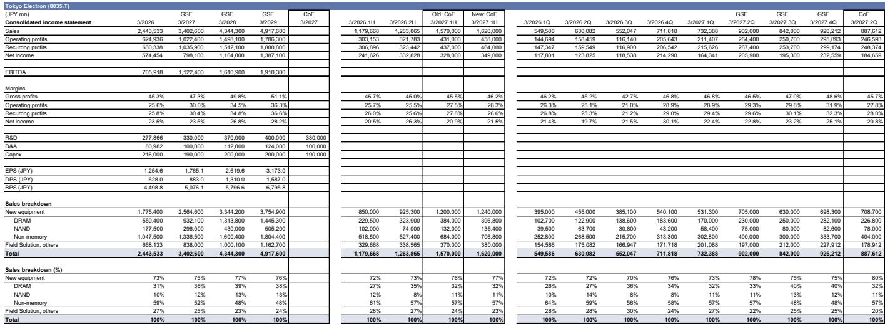
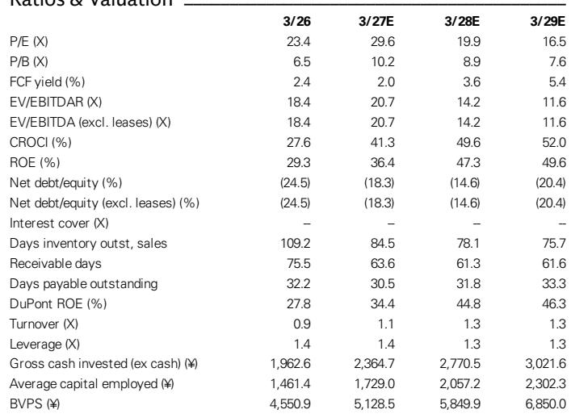

# 东京电子：利润率提升速度超越营收周期，市场尚未充分反映这一变化

半导体设备行业通常被描述为与晶圆厂支出、产能利用率和存储资本开支周期性相关的故事。东京电子在7月30日收盘后公布的财年第一季度业绩，应当重新定义这一叙事。公司实现营业利润2114亿日元，基本符合市场一致预期，但这一数字的构成却非同寻常。46.8%的毛利率——远高于最近几个季度45%左右的水平——表明这家公司将收入转化为利润的方式正在发生结构性变化，而不仅仅是收入规模的变化。

这一区别比表面的业绩超预期更为重要。东京电子将上半年营业利润指引从4310亿日元上调至4580亿日元，这一修正高于此前分析师的估计和彭博一致预期。但更具深远意义的披露是定性层面的：管理层明确表示，下半年增长将“大幅超过”上半年增长，全年营业利润达到1万亿日元已近在眼前。彭博一致预期略低于9500亿日元。两者之间的差距并非四舍五入的误差，而是市场未能充分反映当前已清晰可见的利润率轨迹。

东京电子的研究逻辑历来建立在其驾驭晶圆厂设备（WFE）周期的能力之上。这一逻辑仍然成立，但当前的周期在性质上有所不同，而不仅仅是程度上的差异。管理层目前预计WFE市场在2026日历年将同比增长超过20%，达到1500亿美元以上，并在2027日历年超过1900亿美元。这些并非周期性上行的外推，而是对半导体含量在所有主要终端市场结构性扩张的预测。公司不仅仅是参与这一扩张，而是在有意识地布局以超越市场增长——与三个月前相比，公司上调了对先进封装设备和DRAM布线工艺刻蚀设备的预期。

读者面临的战略问题不再是东京电子是否将从AI驱动的半导体建设中受益。这一逻辑已被充分理解并基本反映在价格中。真正的问题是，利润率扩张的故事——从46.8%的毛利率走向两年内50%或更高的既定目标——能否将收入增长复合为大幅超出市场一致预期的利润周期。本季度的证据表明这是可能的，而公司的估值尚未调整以反映这一现实。

## 第一季度业绩并非简单的超预期——而是重写盈利轨迹的利润率信号

财年第一季度46.8%的毛利率不仅仅是一个好季度，而是一个不连续点。作为背景，公司的毛利率在整个2026财年一直在45%左右波动，该财年第四季度同样为46.8%。但2027财年第一季度并非产品组合有利的季节性时期——这是一个公司仍在为下半年激增而提升产能的季度。在一个通常属于建设期的季度实现这样的毛利率，表明盈利能力的提升不仅仅是产品组合有利的结果，更反映了定价权和成本结构的根本性转变。

营业利润指引的修正强化了这一解读。上半年营业利润指引上调270亿日元——从4310亿日元升至4580亿日元——意味着公司预计第二季度营业利润率将进一步扩大，根据隐含的收入拆分，约为29.3%。这将比第一季度28.9%的营业利润率环比改善约40个基点。管理层关于下半年增长将“大幅超过”上半年增长的表述并非泛泛之谈，而是一个具体信号，表明模型中嵌入的经营杠杆即将在大规模范围内显现。

市场的反应函数一直以一家以20-30%速度增长且利润率稳定的公司为校准基准。东京电子现在呈现的是一个不同的等式：全年收入增长39%，营业利润率从25.6%扩大至30.0%，并在2028财年进一步升至34.5%。这一轨迹所隐含的盈利能力——今年营业利润1.02万亿日元，明年1.50万亿日元——不是温和的上调，而是对公司基本盈利能力的重新评级。彭博一致预期仍低于本财年9500亿日元，这表明卖方尚未将利润率故事完全纳入其模型中。

## 定价权已成为结构性驱动力，而非周期性顺风

东京电子战略中最被低估的要素是其定价举措。管理层明确指出，公司正在“优化定价”，并预计从财年第四季度起将出现“显著收益”。两年内实现50%毛利率的目标并非空想；公司表示正在采取措施“在2028年3月财年早期”实现这一水平。这一时间表是进取性的，意味着当前正在进行的定价举措并非渐进式调整，而是对公司整个设备组合的系统性重新定价。

这是对半导体设备行业历史常态的重大偏离。该行业历来以技术能力和上市时间竞争，定价是次要考虑因素。东京电子对定价优化的明确关注表明，需求环境已经发生了足够大的变化，客户愿意为提供性能优势的设备支付溢价，特别是在公司已上调预期的先进封装和DRAM布线工艺领域。公司能够在追求定价举措的同时超越WFE市场增长，表明它并未以牺牲销量来换取利润率，而是两者兼得。

对竞争格局的影响是深远的。如果东京电子能够持续维持50%的毛利率，它将产生一种从根本上改变其战略选择空间的自由现金流水平。模型显示，今年自由现金流为4676亿日元，2028财年升至8389亿日元，2029财年达到1.22万亿日元。在这一现金生成水平上，公司进行股东回报、研发投入和潜在并购的能力将大幅扩展。股息支付率已指引为50%，这意味着今年每股股息为883日元，2028财年升至1310日元。利润率扩张对每股价值创造的复合效应尚未在当前估值中得到充分反映。

## WFE市场不再是周期性的——它是一个结构性增长市场，东京电子正在其中获得份额

东京电子指引中嵌入的WFE市场预测值得更仔细地审视。管理层预计市场在2026日历年将同比增长超过20%至1500亿美元以上，并在2027日历年超过1900亿美元。这些数字并不保守，它们处于大多数行业预测的高端。但更重要的信号是公司声称看到“增长率进一步扩大的充足潜力”。这不是对冲性表述，而是基于未来两年订单簿和客户预测的信心声明。

公司已建立了一个能够根据客户未来两年预测满足需求的生产能力框架。这是一个有意识的战略选择——在需求之前进行投资，接受短期产能成本，以换取需求实现时获取市场份额的能力。当然，风险在于客户预测被证明过于乐观，东京电子将面临产能过剩。但公司对需求前景的信心，加上对先进封装和DRAM刻蚀预期的上调，表明订单簿并非投机性的，而是有客户承诺的投资作为支撑。

份额增长的故事同样重要。东京电子对先进封装设备和DRAM布线工艺刻蚀设备的销售预期高于三个月前。这是一个直接信号，表明公司正在WFE支出增长最快的领域赢得市场份额。特别是先进封装，正成为AI加速器和高带宽内存的关键瓶颈，这些工艺所需的设备技术要求高且竞争激烈。东京电子在这些领域上调预期的能力表明其技术路线图正在获得客户认可。

## 下半年将是1万亿日元营业利润轨迹的验证场

上半年4580亿日元的营业利润指引意味着，基于全年1.02万亿日元的估计，下半年贡献约为5640亿日元。这将代表营业利润较上半年环比增长23%，由收入增长和利润率扩张共同驱动。公司关于下半年增长将“大幅超过”上半年增长的指引与这一计算一致，但隐含的跃升幅度值得审视。

季度模型为这一进程提供了一些洞察。第三季度预计实现营业利润2507亿日元，收入8420亿日元，营业利润率为29.8%。第四季度预计实现2959亿日元，收入9260亿日元，营业利润率为31.9%。这些不是渐进式改善，而是分别50个基点和210个基点的环比利润率扩张。特别是第四季度的利润率，将比第一季度28.9%的营业利润率改善300个基点。这就是管理层提到的定价优化带来的“显著收益”，现在已可在数字中看到。

全年影响同样引人注目。模型显示2027财年营业利润率为30.0%，2028财年扩大至34.5%，2029财年达到36.3%。2028财年27.7%的收入增长，加上450个基点的营业利润率扩张，将产生该年46.5%的营业利润增长。每股收益轨迹——从今年的1765日元到2028财年的2620日元和2029财年的3173日元——代表三年约34%的复合年增长率。按当前52250日元的价格计算，该股交易于今年收益的29.6倍，但这一倍数压缩至2028财年收益的19.9倍和2029财年收益的16.5倍。市场被要求为仍在向上修正的近期收益支付溢价，而更长期的盈利能力尚未反映在倍数中。

## 决策框架：如何应对利润率拐点

对于评估东京电子的读者而言，分析任务不是预测WFE周期——这是一个已知量，从客户预测中具有高度可见性。任务是评估利润率扩张故事实现其既定目标的概率，并相应地进行布局。一个结构化的评估框架涉及三个不同的问题。

第一个问题是毛利率轨迹是否可持续。第一季度46.8%的毛利率并非一次性事件；它重复了2026财年第四季度的水平，公司还指引第二季度为47.0%，第四季度为48.6%。通往50%的路径在季度序列中是清晰可见的。关键风险在于，随着收入基础扩大，产品组合可能转向低毛利设备，但公司在先进封装和DRAM刻蚀领域的上调预期——这两个领域技术难度高且享有溢价定价——表明组合正朝着正确方向移动。管理层提到的定价举措尚未完全反映在数字中，这意味着利润率轨迹存在上行风险而非下行风险。

第二个问题是收入增长能否维持经营杠杆。模型显示，研发费用将从今年的2779亿日元增长至2029财年的3700亿日元，而销售管理费用在同一时期从3076亿日元增长至3553亿日元。营业费用与收入之比从2026财年的17.2%下降至2029财年的14.8%，这是毛利率改善之外营业利润率扩张的来源。这不是激进的成本削减，而是来自今年增长39%、明年增长27.7%的收入基础的经营杠杆。风险在于收入增长比模型暗示的更快减速，使公司面临成本基础相对于可产生收入过大的问题。但公司基于客户未来两年预测的产能投资表明，可见性异常之高。

第三个问题是估值是否充分补偿了执行风险。按52250日元计算，该股交易于今年收益的29.6倍，从近期角度看并不便宜。但盈利估计仍在向上修正——分析师对2027财年1.02万亿日元的新营业利润估计比此前9140亿日元的估计高出1080亿日元，2028财年1.50万亿日元的估计比此前1.36万亿日元高出1380亿日元。该股正根据仍在被发现中的盈利能力进行估值，而非根据已可见并已向上修正以反映利润率轨迹的盈利能力。读者面临的问题是等待下半年确认利润率故事，还是在现已清晰可见的拐点之前提前布局。

答案取决于读者的时间跨度和对近期波动的容忍度。对于12个月时间跨度的读者，风险回报是不对称的：盈利修正趋势向上，利润率轨迹在季度指引中清晰可见，随着盈利赶上股价，估值倍数将迅速压缩。对于更长时间跨度的读者，2028-2029财年的盈利能力——分别为每股2620日元和3173日元——提供了当前价格未充分反映的安全边际。公司预计今年净资产回报率为36.4%，2028财年为47.3%，处于半导体设备行业最高水平之列，伴随这些回报产生的现金生成能力为持续投资增长提供了自我融资机制。

东京电子的利润率拐点不是预测，而是已可见于报告数字和公司明确指引中的事实。市场对充分定价这一拐点的犹豫是可以理解的——半导体设备行业有周期性失望的历史，使读者对外推利润率改善持谨慎态度。但本季度的证据——毛利率比去年同期水平高出100个基点，营业利润指引上调270亿日元，以及管理层明确承诺两年内实现50%毛利率目标——表明这一周期有所不同。公司不仅仅是在乘需求浪潮，而是在从根本上改变其商业模式的经济性。市场最终将适应这一现实。问题在于，它是在下半年业绩确认这一轨迹之前还是之后进行调整。

*仅供参考。部分内容可能基于源材料通过AI辅助生成、翻译、总结或编辑，可能包含遗漏或错误。请独立核实。本文不构成投资、法律、税务、会计或其他专业建议。*

仅供参考。部分内容可能基于源材料通过AI辅助生成、翻译、总结或编辑，可能包含遗漏或错误。请独立核实。本文不构成投资、法律、税务、会计或其他专业建议。

