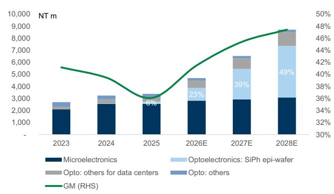
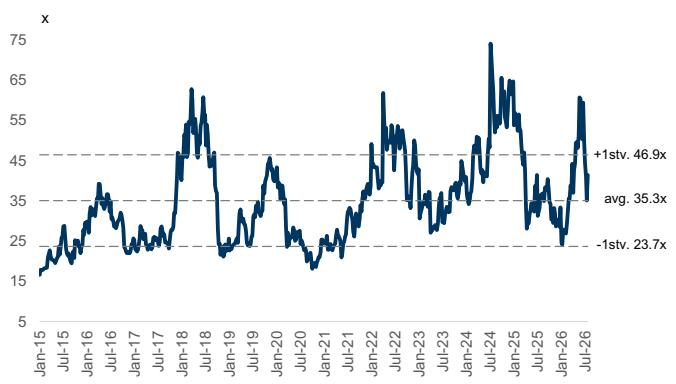
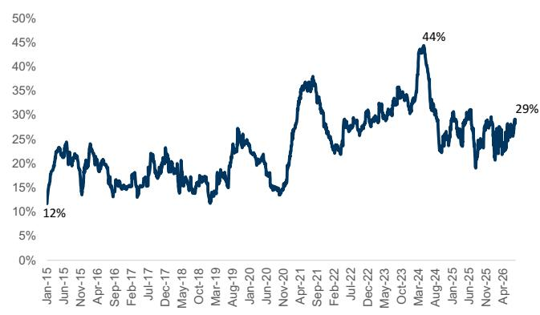

# VPEC（2455.TW）：新设备采购反映订单能见度；3Q26受益于InP衬底供给改善与产能扩张

VPEC公告向Aixtron（MOCVD供应商）采购设备金额为新台币6.53亿元（约2,000万美元），考虑到MOCVD设备交期目前约12个月，此项采购反映公司在手订单充沛，需求能见度延伸至2027年以后。持续投入MOCVD设备进一步印证我们对VPEC的正面看法——公司有望受益于AI服务器机架需求提升、光网络规格升级（发射端/CW激光器向1.6T光模块演进，接收端向200G PD演进）、产品线向EML基外延片扩展、CW激光器客户渗透率提升、InP衬底供给改善，以及CPO领域的机会（客户已针对300mW CW激光器InP外延片下达研发订单）。维持报告评级，目标价新台币505元（隐含2027年预期市盈率52.3倍，对应2027-28年净利润年增49%）。

图表1：VPEC分产品收入与毛利率趋势

资料来源：公司数据，GS全球投资研究

**近三月收入预览：** VPEC在1Q26和2Q26收入环比持平；但受益于产能扩张和InP衬底供给改善，我们预计3Q26收入环比增长23%。背后驱动因素包括：更多客户自行备妥衬底、InP衬底供应商产能扩张，以及相关出口许可的持续获批。我们预计VPEC将在3Q26更好地把握AI数据中心需求，带动其光电业务收入占比提升至41%（2Q26为27%），推动毛利率进一步扩张。

Verena Jeng
+852-2978-1681 | verena.jeng@gs.com
GS (Asia) L.L.C.

Allen Chang
+852-2978-2930 |
allen.k.chang@gs.com
GS (Asia) L.L.C.

Yifan Hu
+852-2978-0996 | yifan.hu@gs.com
GS (Asia) L.L.C.

图表2：VPEC月度收入预览

<table><tr><td></td><td>Apr-26</td><td>May-26</td><td>Jun-26</td><td>Jul-26 (E)</td><td>Aug-26 (E)</td><td>Sep-26 (E)</td><td>1Q26</td><td>2Q26</td><td>3Q26E</td></tr><tr><td>收入（新台币百万元）</td><td>319</td><td>321</td><td>326</td><td>342</td><td>377</td><td>467</td><td>959</td><td>965</td><td>1,186</td></tr><tr><td>同比</td><td>38%</td><td>47%</td><td>24%</td><td>18%</td><td>37%</td><td>35%</td><td>21%</td><td>35%</td><td>30%</td></tr><tr><td>环比</td><td>2%</td><td>1%</td><td>2%</td><td>5%</td><td>10%</td><td>24%</td><td>0%</td><td>1%</td><td>23%</td></tr><tr><td>GS预测（新台币百万元）</td><td>334</td><td>325</td><td>353</td><td></td><td></td><td></td><td>968</td><td>996</td><td></td></tr><tr><td>实际 vs. GS</td><td>-5%</td><td>-1%</td><td>-8%</td><td></td><td></td><td></td><td>-1%</td><td>-3%</td><td></td></tr></table>

资料来源：公司数据，GS全球投资研究

**2Q26净利润符合预期：** VPEC 2Q26毛利润环比增长2%，基本符合我们及Bloomberg一致预期。公司光电业务（主要为光网络用InP外延片）毛利率高于微电子业务（主要为智能手机PA用GaAs外延片），尽管2Q26产品组合较4Q25略逊，但整体毛利率仍持续扩张，反映InP外延片在强劲需求下均价提升。随着InP衬底供给持续改善，我们预计毛利率扩张趋势将延续，同时产品组合持续向光电业务升级。2Q26营业费用率维持在15.4%的较高水平（1Q26为14.5%），主要因收入环比增幅有限及持续的研发投入，导致营业利润环比下降1%，较我们/Bloomberg一致预期低11%/10%。随着3Q26收入环比强劲增长，我们预计营业费用率将改善至13%。受益于低于预期的税率，2Q26净利润环比增长9%，符合我们/Bloomberg一致预期。

图表3：VPEC 2Q26业绩概览

<table><tr><td>新台币百万元</td><td>2Q25</td><td>1Q26</td><td>2Q26</td><td>环比</td><td>同比</td><td>GS</td><td>实际/GS</td><td>一致预期</td><td>实际/一致预期</td></tr><tr><td>收入</td><td>714</td><td>959</td><td>965</td><td>1%</td><td>35%</td><td>996</td><td>-3%</td><td>987</td><td>-2%</td></tr><tr><td>毛利润</td><td>246</td><td>365</td><td>373</td><td>2%</td><td>52%</td><td>386</td><td>-3%</td><td>394</td><td>-5%</td></tr><tr><td>营业利润</td><td>122</td><td>227</td><td>224</td><td>-1%</td><td>83%</td><td>252</td><td>-11%</td><td>248</td><td>-10%</td></tr><tr><td>净利润</td><td>36</td><td>195</td><td>214</td><td>9%</td><td>488%</td><td>212</td><td>1%</td><td>215</td><td>-1%</td></tr><tr><td colspan="6">利润率</td><td colspan="4"></td></tr><tr><td>毛利率</td><td>34.4%</td><td>38.1%</td><td>38.6%</td><td></td><td></td><td>38.7%</td><td></td><td>39.9%</td><td></td></tr><tr><td>营业利润率</td><td>17.1%</td><td>23.6%</td><td>23.2%</td><td></td><td></td><td>25.2%</td><td></td><td>25.1%</td><td></td></tr><tr><td>净利润率</td><td>5.1%</td><td>20.3%</td><td>22.1%</td><td></td><td></td><td>21.2%</td><td></td><td>21.8%</td><td></td></tr></table>

资料来源：公司数据，GS全球投资研究，Bloomberg

**盈利预测调整：** 我们上调2027/28年净利润预测2%/3%，主要反映光电业务前景改善——考虑到InP衬底供给好转及公司产能扩张以更好地把握强劲需求。我们已将2Q26实际业绩纳入模型，2026年净利润预测基本维持不变。

图表4：盈利预测调整

<table><tr><td rowspan="2">新台币百万元</td><td colspan="3">2026E</td><td colspan="3">2027E</td><td colspan="3">2028E</td></tr><tr><td>原预测</td><td>新预测</td><td>变动%</td><td>原预测</td><td>新预测</td><td>变动%</td><td>原预测</td><td>新预测</td><td>变动%</td></tr><tr><td>收入</td><td>4,702</td><td>4,688</td><td>0%</td><td>6,473</td><td>6,532</td><td>1%</td><td>8,655</td><td>8,714</td><td>1%</td></tr><tr><td>毛利润</td><td>1,952</td><td>1,945</td><td>0%</td><td>2,918</td><td>2,965</td><td>2%</td><td>4,022</td><td>4,132</td><td>3%</td></tr><tr><td>营业利润</td><td>1,378</td><td>1,346</td><td>-2%</td><td>2,160</td><td>2,201</td><td>2%</td><td>3,056</td><td>3,133</td><td>3%</td></tr><tr><td>净利润</td><td>1,149</td><td>1,148</td><td>0%</td><td>1,779</td><td>1,811</td><td>2%</td><td>2,488</td><td>2,556</td><td>3%</td></tr><tr><td>利润率</td><td colspan="3"></td><td colspan="3"></td><td colspan="3"></td></tr><tr><td>毛利率</td><td>41.5%</td><td>41.5%</td><td></td><td>45.1%</td><td>45.4%</td><td></td><td>46.5%</td><td>47.4%</td><td></td></tr><tr><td>营业利润率</td><td>29.3%</td><td>28.7%</td><td></td><td>33.4%</td><td>33.7%</td><td></td><td>35.3%</td><td>36.0%</td><td></td></tr><tr><td>净利润率</td><td>24.4%</td><td>24.5%</td><td></td><td>27.5%</td><td>27.7%</td><td></td><td>28.7%</td><td>29.3%</td><td></td></tr><tr><td>营业费用率</td><td>12.2%</td><td>12.8%</td><td></td><td>11.7%</td><td>11.7%</td><td></td><td>11.2%</td><td>11.5%</td><td></td></tr></table>

资料来源：GS全球投资研究

与Bloomberg一致预期相比，我们2026/27年净利润预测分别高出13%/7%，主要基于更高的收入及毛利率预测，反映我们对InP外延片在光网络领域（发射端/CW激光器及接收端）前景的正面看法。我们认为这将持续推动产品组合升级、毛利率扩张，并拓展终端市场覆盖范围——从消费电子延伸至AI数据中心。

图表5：GS vs. Bloomberg一致预期

<table><tr><td rowspan="2">新台币百万元</td><td colspan="3">2026E</td><td colspan="3">2027E</td></tr><tr><td>GS</td><td>一致预期</td><td>差异%</td><td>GS</td><td>一致预期</td><td>差异%</td></tr><tr><td>收入</td><td>4,688</td><td>4,401</td><td>7%</td><td>6,532</td><td>6,185</td><td>6%</td></tr><tr><td>毛利润</td><td>1,945</td><td>1,811</td><td>7%</td><td>2,965</td><td>2,730</td><td>9%</td></tr><tr><td>营业利润</td><td>1,346</td><td>1,214</td><td>11%</td><td>2,201</td><td>2,064</td><td>7%</td></tr><tr><td>净利润</td><td>1,148</td><td>1,018</td><td>13%</td><td>1,811</td><td>1,692</td><td>7%</td></tr><tr><td>利润率</td><td></td><td></td><td></td><td></td><td></td><td></td></tr><tr><td>毛利率</td><td>41.5%</td><td>40.4%</td><td></td><td>45.4%</td><td>43.3%</td><td></td></tr><tr><td>营业利润率</td><td>28.7%</td><td>27.6%</td><td></td><td>33.7%</td><td>33.4%</td><td></td></tr><tr><td>净利润率</td><td>24.5%</td><td>23.1%</td><td></td><td>27.7%</td><td>27.4%</td><td></td></tr></table>

资料来源：GS全球投资研究，Bloomberg

图表6：VPEC损益表

<table><tr><td>新台币百万元</td><td>2022</td><td>2023</td><td>2024</td><td>2025</td><td>2026E</td><td>2027E</td><td>2028E</td><td>1Q25</td><td>2Q25</td><td>3Q25</td><td>4Q25</td><td>1Q26</td><td>2Q26</td><td>3Q26E</td><td>4Q26E</td></tr><tr><td colspan="8">损益表</td><td colspan="8"></td></tr><tr><td>收入</td><td>2,604</td><td>2,694</td><td>3,241</td><td>3,380</td><td>4,688</td><td>6,532</td><td>8,714</td><td>794</td><td>714</td><td>913</td><td>960</td><td>959</td><td>965</td><td>1,186</td><td>1,577</td></tr><tr><td>毛利润</td><td>1,089</td><td>1,109</td><td>1,279</td><td>1,220</td><td>1,945</td><td>2,965</td><td>4,132</td><td>317</td><td>246</td><td>300</td><td>358</td><td>365</td><td>373</td><td>486</td><td>721</td></tr><tr><td>营业利润</td><td>580</td><td>542</td><td>721</td><td>669</td><td>1,346</td><td>2,201</td><td>3,133</td><td>179</td><td>122</td><td>159</td><td>209</td><td>227</td><td>224</td><td>333</td><td>563</td></tr><tr><td>净利润</td><td>545</td><td>450</td><td>671</td><td>548</td><td>1,148</td><td>1,811</td><td>2,556</td><td>157</td><td>36</td><td>160</td><td>194</td><td>195</td><td>214</td><td>276</td><td>463</td></tr><tr><td>每股收益（新台币）</td><td>2.93</td><td>2.43</td><td>3.62</td><td>2.95</td><td>6.12</td><td>9.65</td><td>13.63</td><td>0.85</td><td>0.20</td><td>0.86</td><td>1.04</td><td>1.04</td><td>1.14</td><td>1.47</td><td>2.47</td></tr><tr><td colspan="8">比率</td><td colspan="8"></td></tr><tr><td>营业费用率</td><td>19.6%</td><td>21.0%</td><td>17.2%</td><td>16.3%</td><td>12.8%</td><td>11.7%</td><td>11.5%</td><td>17.3%</td><td>17.3%</td><td>15.4%</td><td>15.5%</td><td>14.5%</td><td>15.4%</td><td>13.0%</td><td>10.0%</td></tr><tr><td>税率</td><td>18.4%</td><td>16.9%</td><td>17.9%</td><td>17.9%</td><td>18.2%</td><td>19.9%</td><td>19.9%</td><td>20.0%</td><td>-48.8%</td><td>19.9%</td><td>21.2%</td><td>19.9%</td><td>9.8%</td><td>19.9%</td><td>19.9%</td></tr><tr><td colspan="8">利润率</td><td colspan="8"></td></tr><tr><td>毛利率</td><td>41.8%</td><td>41.2%</td><td>39.5%</td><td>36.1%</td><td>41.5%</td><td>45.4%</td><td>47.4%</td><td>39.9%</td><td>34.4%</td><td>32.9%</td><td>37.3%</td><td>38.1%</td><td>38.6%</td><td>41.0%</td><td>45.7%</td></tr><tr><td>营业利润率</td><td>22.3%</td><td>20.1%</td><td>22.3%</td><td>19.8%</td><td>28.7%</td><td>33.7%</td><td>36.0%</td><td>22.6%</td><td>17.1%</td><td>17.4%</td><td>21.8%</td><td>23.6%</td><td>23.2%</td><td>28.0%</td><td>35.7%</td></tr><tr><td>净利润率</td><td>20.9%</td><td>16.7%</td><td>20.7%</td><td>16.2%</td><td>24.5%</td><td>27.7%</td><td>29.3%</td><td>19.8%</td><td>5.1%</td><td>17.6%</td><td>20.2%</td><td>20.3%</td><td>22.1%</td><td>23.3%</td><td>29.3%</td></tr><tr><td colspan="8">同比</td><td colspan="8"></td></tr><tr><td>收入</td><td>-28%</td><td>3%</td><td>20%</td><td>4%</td><td>39%</td><td>39%</td><td>33%</td><td>-5%</td><td>-18%</td><td>13%</td><td>33%</td><td>21%</td><td>35%</td><td>30%</td><td>64%</td></tr><tr><td>毛利润</td><td>-28%</td><td>2%</td><td>15%</td><td>-5%</td><td>59%</td><td>52%</td><td>39%</td><td>-7%</td><td>-29%</td><td>-9%</td><td>37%</td><td>15%</td><td>52%</td><td>62%</td><td>102%</td></tr><tr><td>营业利润</td><td>-45%</td><td>-7%</td><td>33%</td><td>-7%</td><td>101%</td><td>63%</td><td>42%</td><td>-10%</td><td>-41%</td><td>-18%</td><td>71%</td><td>27%</td><td>83%</td><td>109%</td><td>169%</td></tr><tr><td>净利润</td><td>-36%</td><td>-17%</td><td>49%</td><td>-18%</td><td>109%</td><td>58%</td><td>41%</td><td>-18%</td><td>-82%</td><td>11%</td><td>46%</td><td>24%</td><td>488%</td><td>72%</td><td>139%</td></tr><tr><td colspan="8">环比</td><td colspan="8"></td></tr><tr><td>收入</td><td></td><td></td><td></td><td></td><td></td><td></td><td></td><td>10%</td><td>-10%</td><td>28%</td><td>5%</td><td>0%</td><td>1%</td><td>23%</td><td>33%</td></tr><tr><td>毛利润</td><td></td><td></td><td></td><td></td><td></td><td></td><td></td><td>22%</td><td>-22%</td><td>22%</td><td>19%</td><td>2%</td><td>2%</td><td>30%</td><td>48%</td></tr><tr><td>营业利润</td><td></td><td></td><td></td><td></td><td></td><td></td><td></td><td>47%</td><td>-32%</td><td>30%</td><td>31%</td><td>8%</td><td>-1%</td><td>49%</td><td>69%</td></tr><tr><td>净利润</td><td></td><td></td><td></td><td></td><td></td><td></td><td></td><td>18%</td><td>-77%</td><td>342%</td><td>21%</td><td>1%</td><td>9%</td><td>29%</td><td>67%</td></tr></table>

资料来源：公司数据，GS全球投资研究

**估值：** 我们继续采用折现市盈率法，以10.5%的股权成本（不变）将2029年预期市盈率折现至2027年，并参考同业交易市盈率与前瞻年度基本面（净利润同比增速及营业利润率）推导目标市盈率倍数。基于我们更新的2029-30年净利润同比增速20%（此前为13%）及2029-30年营业利润率37%（此前为35%），以及同业PEG&M 0.3倍（此前为0.4倍），我们推导目标市盈率倍数为18.2倍（此前为19.6倍），反映AI服务器机架模型转换背景下板块估值调整及市场对AI支出持续性的关注。我们的新目标价为新台币505元（此前为新台币504元）。新目标价隐含2027年预期市盈率52倍，处于公司历史交易区间内（峰值74倍，+1倍标准差46倍）。维持报告评级。

图表7：VPEC同业比较

<table><tr><td>代码</td><td>公司</td><td>评级</td><td>2027E市盈率</td><td>2027-28E净利润同比</td><td>2027-28E营业利润率</td><td>比率</td></tr><tr><td>3081.TWO</td><td>联亚</td><td>买入</td><td>42.3</td><td>85%</td><td>48%</td><td>0.3</td></tr><tr><td>688498.SS</td><td>源杰科技</td><td>中性</td><td>149.0</td><td>82%</td><td>51%</td><td>1.1</td></tr><tr><td>5802.JT</td><td>住友电工</td><td>买入</td><td>15.1</td><td>22%</td><td>11%</td><td>0.5</td></tr><tr><td>LITE</td><td>Lumentum</td><td>未覆盖</td><td>30.3</td><td>80%</td><td>41%</td><td>0.2</td></tr><tr><td>COHR</td><td>Coherent</td><td>未覆盖</td><td>24.5</td><td>45%</td><td>24%</td><td>0.4</td></tr><tr><td>6503.JT</td><td>三菱电机</td><td>买入</td><td>19.5</td><td>18%</td><td>11%</td><td>0.7</td></tr><tr><td>300502.SZ</td><td>新易盛</td><td>买入</td><td>17.2</td><td>30%</td><td>47%</td><td>0.2</td></tr><tr><td colspan="2">平均（剔除异常值）</td><td></td><td>25.9</td><td>52%</td><td>34%</td><td>0.3</td></tr><tr><td></td><td></td><td></td><td>2029E市盈率</td><td>2029-30E净利润同比</td><td>2029-30E营业利润率</td><td>PEG&M</td></tr><tr><td>2455.TW</td><td>VPEC</td><td>买入</td><td>18.2</td><td>20%</td><td>37%</td><td>0.3</td></tr></table>

异常值以灰色标示。未覆盖公司的预测数据来自Bloomberg一致预期。价格为2026年7月30日收盘价。
资料来源：公司数据，GS全球投资研究，Bloomberg

图表8：VPEC折现市盈率

<table><tr><td>（新台币百万元）</td><td>2022</td><td>2023</td><td>2024</td><td>2025</td><td>2026E</td><td>2027E</td><td>2028E</td><td>2029E</td><td>2030E</td></tr><tr><td>硅光收入占比</td><td></td><td></td><td>1%</td><td>6%</td><td>23%</td><td>39%</td><td>49%</td><td></td><td></td></tr><tr><td>硅光毛利润占比</td><td></td><td></td><td>1%</td><td>8%</td><td>32%</td><td>49%</td><td>59%</td><td></td><td></td></tr><tr><td>收入</td><td>2,604</td><td>2,694</td><td>3,241</td><td>3,380</td><td>4,688</td><td>6,532</td><td>8,714</td><td>10,587</td><td>12,175</td></tr><tr><td>同比</td><td>-28%</td><td>3%</td><td>20%</td><td>4%</td><td>39%</td><td>39%</td><td>33%</td><td>22%</td><td>15%</td></tr><tr><td>毛利率</td><td>41.8%</td><td>41.2%</td><td>39.5%</td><td>36.1%</td><td>41.5%</td><td>45.4%</td><td>47.4%</td><td>47.9%</td><td>48.4%</td></tr><tr><td>营业利润</td><td>580</td><td>542</td><td>721</td><td>669</td><td>1,346</td><td>2,201</td><td>3,133</td><td>3,859</td><td>4,499</td></tr><tr><td>同比</td><td>-45%</td><td>-7%</td><td>33%</td><td>-7%</td><td>101%</td><td>63%</td><td>42%</td><td>23%</td><td>17%</td></tr><tr><td>营业利润率</td><td>22%</td><td>20%</td><td>22%</td><td>20%</td><td>29%</td><td>34%</td><td>36%</td><td>36%</td><td>37%</td></tr><tr><td>税前利润</td><td>667</td><td>542</td><td>818</td><td>667</td><td>1,403</td><td>2,260</td><td>3,191</td><td>3,918</td><td>4,558</td></tr><tr><td>净利润</td><td>545</td><td>450</td><td>671</td><td>548</td><td>1,148</td><td>1,811</td><td>2,556</td><td>3,138</td><td>3,651</td></tr><tr><td>每股收益（新台币，摊薄）</td><td>2.93</td><td>2.43</td><td>3.62</td><td>2.95</td><td>6.12</td><td>9.65</td><td>13.63</td><td>33.92</td><td>39.45</td></tr><tr><td>同比</td><td>-36%</td><td>-17%</td><td>49%</td><td>-18%</td><td>109%</td><td>58%</td><td>41%</td><td>23%</td><td>16%</td></tr><tr><td>目标价隐含市盈率</td><td>172</td><td>208</td><td>140</td><td>171</td><td>83</td><td>52</td><td>37</td><td>15</td><td>13</td></tr><tr><td colspan="6">2029E目标市盈率</td><td colspan="4">18.2</td></tr><tr><td colspan="6">目标倍数×每股收益</td><td colspan="4">617</td></tr><tr><td colspan="6">折现至2027年；目标价（新台币）</td><td colspan="4">505.0</td></tr><tr><td colspan="6">隐含2027年市盈率</td><td colspan="4">52.3</td></tr><tr><td colspan="10">股权成本假设</td></tr><tr><td colspan="6">Beta</td><td colspan="4">1.7</td></tr><tr><td colspan="6">无风险利率</td><td colspan="4">1.6%</td></tr><tr><td colspan="6">市场风险溢价</td><td colspan="4">5.1%</td></tr><tr><td colspan="6">股权成本</td><td colspan="4">10.5%</td></tr></table>

资料来源：公司数据，GS全球投资研究，Bloomberg

图表9：VPEC 12个月远期市盈率

资料来源：公司数据，GS全球投资研究，Bloomberg

图表10：VPEC QFII持股

资料来源：TEJ

## 目标价风险与方法论 - VPEC

**估值：** 我们采用折现市盈率法，对VPEC 2029年预期每股收益应用18.2倍目标市盈率，以10.5%的股权成本（Beta 1.7倍，无风险利率1.6%，市场风险溢价5.1%）折现至2027年，得出12个月目标价新台币505元。我们的目标市盈率基于光子学供应链同业平均0.3倍PEG&M比率。

**主要风险：** 硅光业务爬坡慢于预期；智能手机客户对微电子需求不及预期；IDM厂商将外延片转为内部供应。

<table><tr><td>2455.TW</td><td colspan="2">12个月目标价：新台币505.00元</td><td colspan="2">现价：新台币265.50元</td><td colspan="2">
