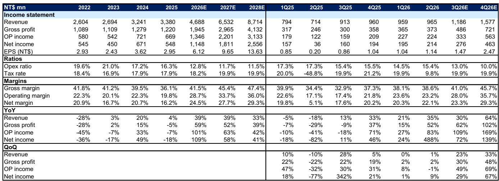
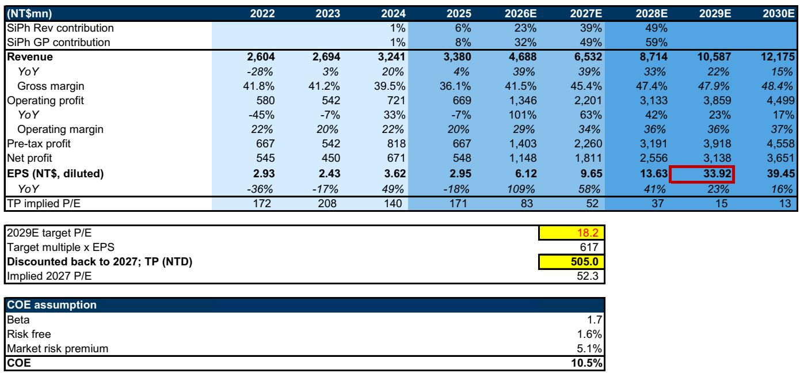
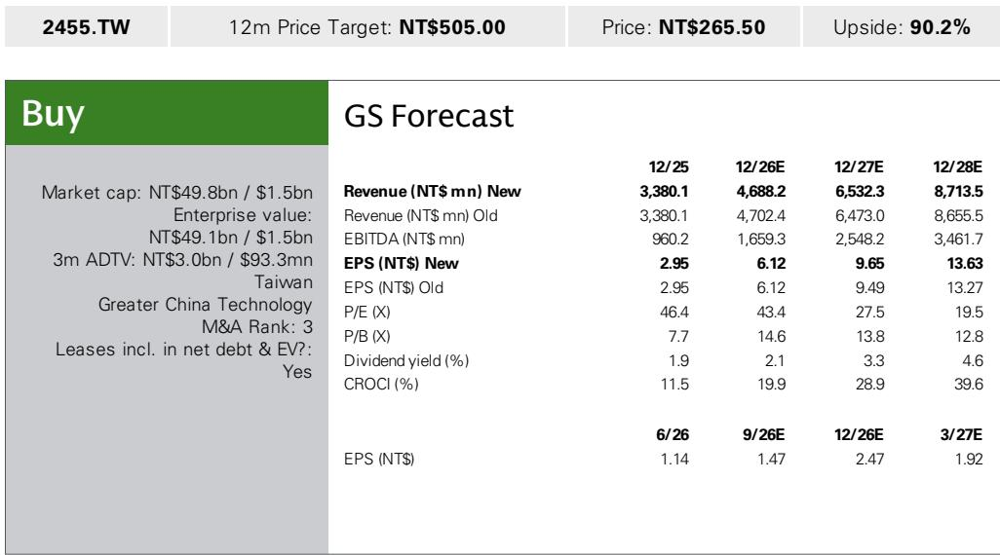

# GS：VPEC新增MOCVD设备反映订单能见度至2027年后

AI服务器机架放量带动光通讯规格升级，台湾磊晶厂VPEC（2455.TW）正在从消费电子供应链向数据中心市场延伸。GS在最新报告中指出，该公司宣布向Aixtron采购6.53亿新台币（约2000万美元）的MOCVD设备，考虑到该设备目前交货周期约12个月，这笔资本开支反映在手订单强度，也把需求能见度延伸到2027年以后。

报告同时上调2027至2028年净利润预测2%至3%，主要基于InP基板供应改善与产能扩张带来的光电子业务增长。VPEC 2Q26营收9.65亿新台币，环比增长1%，与市场预期基本一致；毛利率38.6%，延续从4Q25低点回升的路径。真正值得关注的是3Q26的环比变化——GS预计营收将增长23%至11.86亿新台币，光电子业务收入占比从2Q26的27%跳升至41%。

## 1. MOCVD设备采购将需求能见度延伸至2027年后

MOCVD交货周期约12个月，意味着VPEC现在下单的设备要到2027年中才能到位。GS认为，这笔资本开支本身就是在为2027年以后的订单做准备，而非应对短期需求。报告特别提到，客户已在InP磊晶片上针对300mW CW激光器下达研发订单，CPO（共封装光学）方向的机会开始转化为实际需求。

从产品线看，VPEC的扩张路径清晰：发射端从现有CW激光器向1.6T光模块规格升级，接收端向200G PD推进，同时拓展EML基磊晶片产品。这些方向都指向同一个判断——AI数据中心对光通讯带宽的需求不是单一年度的脉冲，而是持续多年的规格升级周期。

> **KC评论：** 设备交货周期是判断需求真实性的一个硬指标。如果只是短期订单，公司不会提前12个月锁定设备产能。这笔采购的金额和时机，比任何营收预测都更能说明管理层对需求持续性的判断。

## 2. 3Q26营收环比增长23%的驱动来自基板供应与产能扩张

GS对3Q26的营收预测建立在两个具体变化上：InP基板供应改善和产能扩张到位。报告指出，更多客户开始自行采购基板，InP基板供应商也在扩产，同时相关出口许可陆续发放，这些因素叠加使VPEC能够更好承接AI数据中心需求。

月度数据已经显示出加速迹象。7月营收预计3.42亿新台币，环比增长5%；8月3.77亿，环比增长10%；9月跳升至4.67亿，环比增长24%。三个月逐月加速的节奏，与基板供应逐步到位、产能逐步释放的过程吻合。GS预计3Q26光电子业务收入占比达41%，这将带动毛利率从2Q26的38.6%进一步扩张至41.0%。

2Q26的毛利率表现已经验证了这一逻辑。尽管产品组合不如4Q25有利，但InP磊晶片在强劲需求下ASP上升，推动毛利率环比继续改善。GS认为，随着基板供应改善，毛利率扩张趋势在3Q26及以后仍将持续。

## 3. 光电子业务占比提升正在改变公司盈利结构

VPEC的盈利结构正在发生实质性变化。GS数据显示，硅光子相关收入贡献从2024年的1%升至2025年的6%，预计2026年达23%，2027年达39%，2028年达49%。毛利率贡献的增速更快——2026年预计占32%，2027年49%，2028年59%。

这意味着公司整体毛利率将从2025年的36.1%升至2026年的41.5%，2027年进一步达45.4%。净利润率从2025年的16.2%升至2026年的24.5%，2027年27.7%。GS对2026至2027年净利润的预测比彭博共识分别高13%和7%，差异主要来自对InP磊晶片在光通讯领域渗透速度的判断。

一个值得注意的细节是2Q26的营业利润率。营业利润环比下降1%，低于GS和彭博共识11%和10%，原因在于费用率偏高——2Q26营业费用率15.4%，高于1Q26的14.5%。GS解释为营收环比持平期间研发投入持续增加。随着3Q26营收环比增长23%，预计费用率将回落至13%。

> **KC评论：** 光电子业务占比从27%跳升至41%，这不是边际变化，而是公司盈利中枢的切换。毛利率、费用率、净利润率三个指标会同步被这个结构变化重塑。观察VPEC后续季度，光电子收入占比比单季营收数字更值得跟踪。

## 4. 估值框架中的同业比较与增长持续性假设

GS采用贴现市盈率法，对2029年预期EPS给予18.2倍目标市盈率，以10.5%的股权成本贴现回2027年，对应2027年预期市盈率52.3倍。目标市盈率倍数从之前的19.6倍下调至18.2倍，反映同业估值中枢变化——GS将同业PEG&M假设从0.4倍调整至0.3倍。

同业比较显示，VPEC的2027年预期市盈率52倍处于公司历史交易区间内（历史峰值74倍，均值加一个标准差46倍）。GS给出的2029至2030年净利润年增速假设为20%，营业利润率37%，低于2027至2028年的增速水平，这本身隐含了一个判断：高增长阶段之后，公司会进入增速换挡期。

报告同时列出三项主要不确定性：硅光子业务爬坡慢于预期、智能手机客户对微电子产品需求弱于预期、IDM厂商将磊晶片转为内部供应。其中IDM内部化供应是磊晶行业长期存在的结构性因素，也是VPEC客户集中度之外需要持续观察的变量。

从产业链位置看，VPEC所处的InP磊晶环节是光通讯供应链中技术门槛较高的部分。GS认为，随着AI服务器机架放量、光模块规格从800G向1.6T升级，以及CPO方向的研发订单落地，这家台湾磊晶厂正在从消费电子供应商转变为数据中心光通讯供应链的关键环节。3Q26的营收数据和毛利率变化，将是验证这一转变能否按预期兑现的第一个观察窗口。

For informational purposes only. Portions may be generated,translated,summarized,or edited with AI assistance based on source materials and may contain omissions or errors. Please verify independently. This is not investment,legal,tax,accounting,or other professional advice.

For informational purposes only. Portions may be generated,translated,summarized,or edited with AI assistance based on source materials and may contain omissions or errors. Please verify independently. This is not investment,legal,tax,accounting,or other professional advice.

