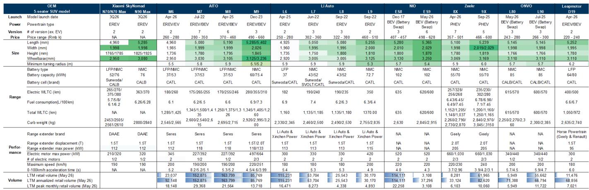
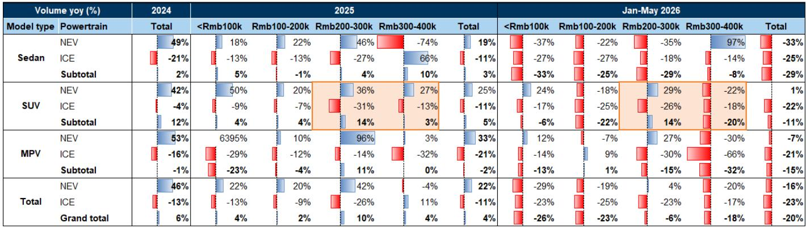
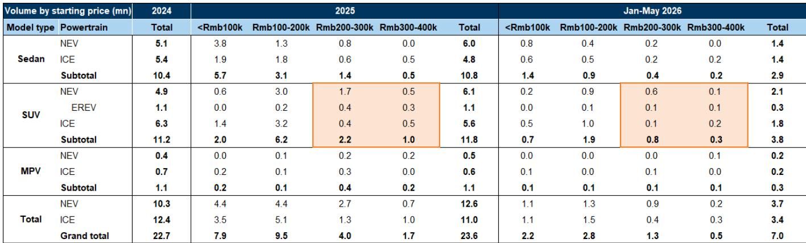

# 小米SkyNomad发布：不止是新车亮相，更是对国内SUV市场的定价策略宣示

7月30日，小米发布SkyNomad增程式SUV系列，N70 Max预售价259,900元、N90 Max预售价299,900元——这些数字本身已足够引人注目，但更深层的信号在于架构层面。昆仑技术平台凭借平地板制造系统、专用增程器以及垂直整合的电池控制能力，意在重新定义国内竞争最激烈的细分市场——20万至40万元价位、5至7座SUV市场的性价比基准。

小米进入这一市场，并非以挑战者姿态，而是以价格引领者的身份。预售价表明其具备结构性成本优势来支撑这一定位。N90 Max宣称CLTC综合续航可达1,705公里，其中纯电续航505公里，直接回应了燃油车用户对续航焦虑的顾虑。昆仑架构298毫米的平地板底盘与重新设计的座舱布局，解决了多数纯电SUV普遍存在的空间利用率问题。而小米深度参与电池包设计与电芯开发，而非单纯采购，显示出竞争对手短期内难以复制的供应链掌控力。

发布时机的选择也颇具考量。官方发售定于9月，首批销售窗口预计覆盖10月初的国庆黄金周，小米正借此让SkyNomad承接这一季节最旺盛的消费需求。此前SU7改款在首批销售批次中收获超过8万份确认订单，证明了其应对发布高峰的运营能力，不会像其他新势力那样出现产能瓶颈。市场关注的核心不在于SkyNomad能否兑现宣传，而在于其定价与架构能否在重塑竞争格局的同时维持利润率纪律。

## 昆仑制造平台：座舱成为竞争对手难以快速复制的竞争武器

SkyNomad发布中最被低估的要素并非续航或价格，而是制造平台对车内空间的影响。昆仑平台实现整车底盘总高度仅298毫米，较同尺寸SUV减少约200毫米的垂直侵入。这一缩减转化为4.4平方米的规整矩形空间——支持2+2+3七座布局，第二排最大腿部空间达1.5米。平地板与长滑轨系统使座椅可滑动、倾斜或折叠为桌板形态，全部通过语音指令控制。

这不是渐进式改进，而是空间定义与交付方式的结构性差异。该价位段多数SUV平台源自燃油车架构，受制于传动轴通道、排气路径和油箱布局。昆仑平台从零开始按电动优先架构设计，将电池包、电驱系统、电子控制及超大油箱整合为统一地板系统。结果是座舱实际感受大于外观尺寸所暗示的空间，座椅调整为载物模式时最大储物容积达180升。

竞争对手面临两难选择。复制平地板架构需要从零开始的平台重新设计，涉及多年开发周期与数十亿资本开支。或者，他们可以尝试用现有平台匹配空间，但必须接受小米已通过工程手段消除的垂直侵入代价。商业困境显而易见：投入新平台可能侵蚀现有SUV产品线，而维持现有架构则意味着在空间优势上让位于小米。报告分析认为，这一平台差异化正是SkyNomad虽属增程SUV细分市场的后来者却能获得关注的关键原因。

## 昆仑增程系统：重新定义燃油车用户的价值主张，而非仅面向电动化转型者

小米的增程策略精准瞄准尚未转向电动化的大众燃油车用户。该系统围绕专用设计的M15DRE 1.5T 112千瓦发动机打造，N90 Max综合CLTC续航达1,705公里，纯电CLTC续航505公里。这一纯电续航数据在同类车型中领先，亏电油耗较竞品低0.6至1.6升/百公里。

工程选择对用户接受度至关重要。增程器全系可使用常规92号汽油，无需强制使用高标号燃油。这提升了偏远地区适应性，降低了隐性用车成本——对于国内充电设施尚不完善的广大内陆地区消费者而言，这是关键考量。保养间隔为首次保养后三年或3万公里，质保覆盖八年或16万公里。这些并非细枝末节，它们回应了燃油车用户转向电动化的两大心理障碍：续航焦虑与保养不确定性。

报告指出，增程系统200余个部件中有57个经过优化，七个核心部件重新开发。这一工程投入表明小米并未将增程器视为附属配置，而是核心价值主张。对于考虑首次购买电动车的燃油车用户，单次充电加油循环可行驶1,705公里，彻底消除了续航妥协。505公里纯电续航覆盖绝大多数日常通勤场景，增程器成为安全冗余而非主要动力来源。这种“电动优先、燃油备用”的定位，正是其他市场被证明最能有效转化主流用户的方式。

## 小米电池制造垂直整合：掌控成本最关键的环节

电池成本仍是电动车盈利能力的最大变量，小米的电池制造路径是对行业惯例的战略性偏离。公司实现了深度端到端参与：主导产品定义、电池包设计与开发，参与电芯设计与开发，并掌控全流程质量控制。这不是一家打算被动采购标准化电芯的企业应有的行为。

其影响有两方面。第一，电池设计的垂直整合使小米能够针对自身平台需求优化电池包，而非适配现成方案。N70与N90配置的52千瓦时和76千瓦时电池方案正体现了这种优化，在重量、成本与续航之间取得平衡，这是通用电池包无法实现的。第二，对定价策略更为重要的是，这种整合提供了支撑小米所公布预售价的成本结构。

市场此前已见证过类似剧本。当具备规模优势的垂直整合者进入价格敏感型细分市场，既有玩家将面临利润率挤压，而难以在不损害自身成本结构的情况下有效应对。报告分析认为，小米的电池参与、供应链能力及更具优势的电池成本，使其定价区间能够从N70主力车型约20万元起步。这一入门价格低于多数同级增程SUV，同时提供更优续航与车内空间——这一组合对现有玩家构成显著压力。

## 预售定价策略：瞄准主力车型，而非仅看头条数字

N70 Max 259,900元与N90 Max 299,900元的预售价只是开局，完整定价区间将在9月正式发售前公布。报告预计将增加标准版与Pro版，N70可能以约20万元起售，定位为主力走量车型。这是经典的渗透定价策略：以有吸引力的入门价格获取市场份额，再通过高配版本与功能实现向上销售。

车型销量预期颇具参考价值。报告测算SkyNomad 2026年交付11万辆、2027年24万辆，其中2027年数字约占2025年20万至40万元起步价SUV（不含纯电）160万辆以上销量的15%。在乐观情形下，若小米能承接部分大众市场升级需求与燃油车用户转化，2027年销量可达约50万辆——基于10万至40万元起步价SUV（不含纯电）500万辆销量的10%。

这些数字颇为进取，但基于具体的市场现实。国内SUV市场是汽车行业规模最大、竞争最激烈的领域，20万至40万元价格带集中了最高销量与最高利润机会。小米的品牌认知度、生态整合能力以及在智能手机市场验证过的执行力，赋予其传统车企不具备的渠道与营销优势。SU7改款的表现——34分钟内确认订单超1.5万份、首批销售批次超8万份——证明了公司将消费者兴趣转化为规模订单的能力。

## 观察框架：SkyNomad发布对小米电动车路径的启示

对于观察小米电动车战略的各方而言，SkyNomad发布提供了可归纳为框架的清晰信号。第一个信号是定价能力：预售价结合续航与空间参数，表明小米能够在价格上有效竞争，同时不牺牲差异化配置。第二个信号是成本结构：电池制造垂直整合与专用平台架构表明，小米的成本优势随规模扩大而增强，形成竞争对手难以打破的良性循环。

第三个信号是执行能力。SU7改款证明小米能够应对发布需求，不会出现新势力常见的产能与交付瓶颈。SkyNomad首批销售窗口覆盖国庆黄金周，将是检验这一运营能力能否延伸至更复杂的多配置SUV产品线的首次考验。报告预计首批销售将持续至10月7日，期间确认订单数据的披露值得关注。

第四个信号是更广泛的生态布局。小米的电动车战略不仅是卖车，更是将车辆整合进设备、服务与AI能力的更大生态系统。MiMo-V3系列采用HySparse架构与更激进的11:1稀疏比，指向成本高效的AI基础设施，可增强车内体验同时降低计算成本。报告提到小米预计于8月18日公布二季度业绩，该季度可能是全年最弱，但剔除电动车、AI及其他新业务后的收入增长预计自三季度起恢复同比正增长。

战略结论是，SkyNomad并非单一产品发布，而是一个平台级布局，旨在确立小米在国内增程SUV市场的结构性价格引领者地位。颠覆性定价、差异化架构与垂直整合的组合，构筑了短期内难以复制的竞争位置。对于现有玩家，应对选项有限：匹配价格并接受利润率压缩，或在配置上差异化并承担失去价格敏感主流用户的风险。对小米而言，前路在于执行——兑现承诺的规格、管理发布高峰、扩大产能以实现2027年24万辆目标。市场的最终评判将来自订单数据，而非发布前的宣传声势。

*仅供参考。部分内容可能基于原始材料由AI辅助生成、翻译、摘要或编辑，可能存在遗漏或错误。请独立核实。本文不构成投资、法律、税务、会计或其他专业建议。*

仅供参考。部分内容可能基于原始材料由AI辅助生成、翻译、摘要或编辑，可能存在遗漏或错误。请独立核实。本文不构成投资、法律、税务、会计或其他专业建议。

