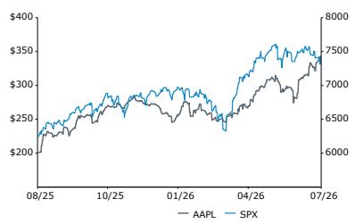
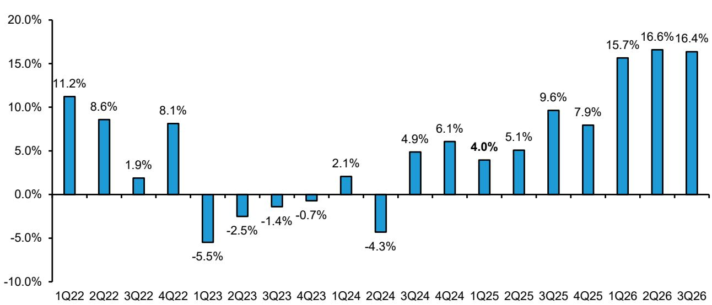
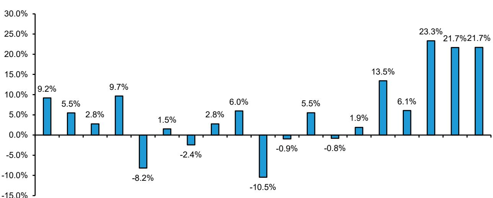
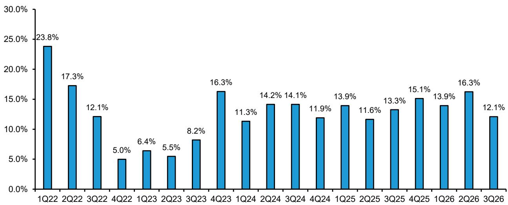
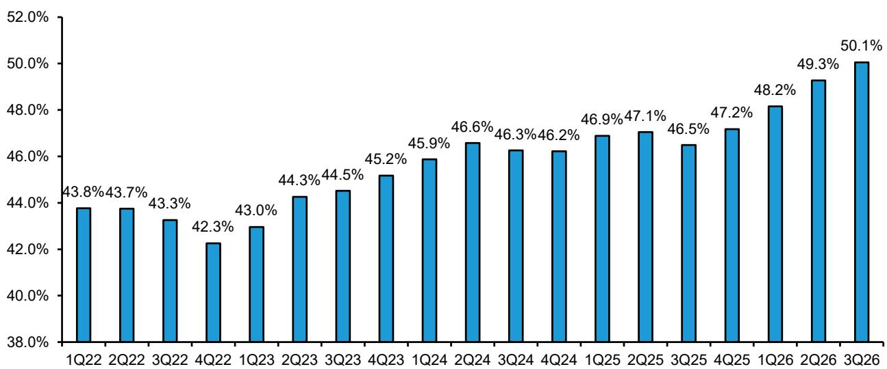
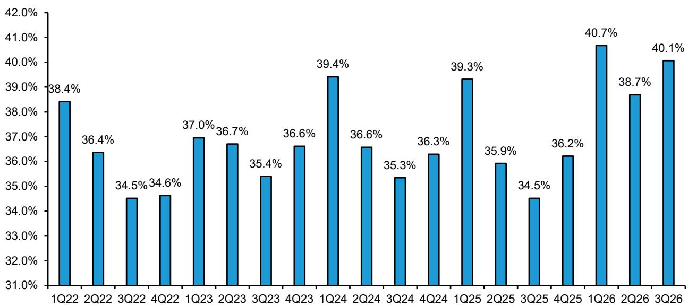
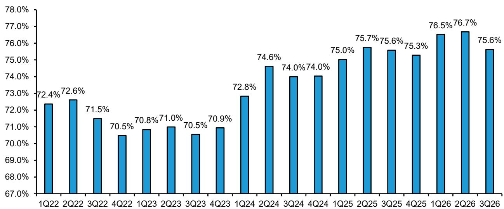
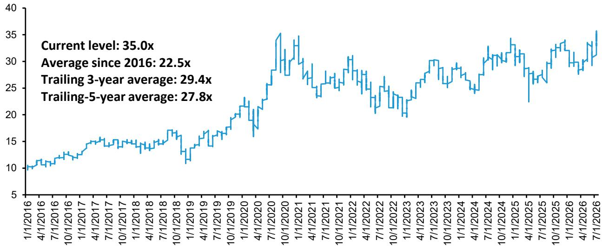

# 美国IT硬件行业观察

## 苹果公司（Apple Inc.）

**评级：跑赢大盘**

**目标报价：370.00美元（原：350.00美元）**

**Mark C. Newman**
+1 212 845 7822
mark.newman@bernsteinsg.com

**April Li**
+1 917 344 8339
april.li@bernsteinsg.com

**Phoebe Sun**
+1 917 344 8481
phoebe.sun@bernsteinsg.com

## 苹果FQ3'26：存储成本上升对业绩的影响

苹果FQ2'26业绩小幅超出预期：营收为1094亿美元，同比增长16.4%，处于管理层给出的14-17%增长指引区间中段。每股收益为2.02美元，但剔除关税退税带来的0.11美元收益后，核心每股收益为1.91美元，仅略高于市场一致预期的1.89美元。报告毛利率为50.1%；剔除关税退税约200个基点的收益后，核心毛利率为48.1%，基本处于公司47.5-48.5%指引区间的中值。

FQ4'26指引低于预期：苹果预计9月当季营收同比增长9-11%，较过去三个季度15%左右的增速有所回落——主要受汇率逆风和供应约束影响。毛利率指引为47-48%，包含关税退税带来的100个基点收益。剔除关税退税后，这意味着较FQ3调整后毛利率48.1%约有160个基点的利润率压缩，反映了持续的存储成本上升。

毛利率好于担忧水平，但存储成本上升带来的进一步压力仍在。6月当季存储成本环比再度上升，我们预计FQ4及FY27将进一步增加，部分被非存储物料清单成本下降所抵消。

| 收盘日期 | 2026年7月30日 |
|---------|-------------|
| AAPL收盘价（美元） | 333.43 |
| 目标报价（美元） | 370.00 |
| 上行空间 | 11% |
| 52周区间 | 344.57/201.50 |
| SPX | 7,437.63 |
| 财年截止 | 9月 |
| 股息率 | 0.3% |
| 市值（十亿美元） | 4,871.07 |
| EV（十亿美元） | 4,808.89 |

| 表现 | 年初至今 | 1个月 | 6个月 | 12个月 |
|------|--------|------|------|-------|
| 相对表现（%） | 22.6 | 15.2 | 28.5 | 60.6 |
| SPX（%） | 8.6 | (0.8) | 7.2 | 16.9 |
| 相对表现（%） | 14.0 | 16.1 | 21.3 | 43.7 |

资料来源：彭博、Bernstein预测与分析。

iPhone和Mac市场份额提升正在兑现，预计将持续。正如我们在苹果深度研究及苹果与三星对比分析中所阐述的，苹果当前面临一代人一次的市场份额提升机遇，这一趋势正在显现。

考虑到存储成本上升、研发费用增加、汇率因素及供应约束，我们下调了盈利预测。我们将FY27和FY28的每股收益分别下调至10.03美元和11.28美元，原因是营收略有减弱、存储成本导致产品毛利率下降以及研发费用增加。我们FY28的预测仍比市场一致预期高出5%。

一年期价格表现

## 研究结论

我们给予苹果跑赢大盘评级，目标报价上调至370美元，基于FY28每股收益的33倍或EV/FCF的29.5倍（此前基于FY27）。我们关注存储成本上升的压力，但认为苹果的市场地位仍然稳固。AI也为苹果带来了新的机遇，但这一机遇需要更长时间才能充分展现。

| 调整后每股收益 | F25A | F26E | F27E |
|-------------|------|------|------|
| AAPL（美元） | 7.46 | 8.85 | 10.03 |
| 原预测 | -- | 8.87 | 10.65 |

资料来源：彭博、Bernstein预测与分析。

| 财务数据 | F25A | F26E | F27E | CAGR |
|---------|------|------|------|------|
| 营收（百万美元） | 416,161 | 477,056 | 533,070 | -- |
| 毛利率（%） | 46.9 | 48.7 | 47.3 | -- |
| 营业利润率（%） | 32.0 | 32.9 | 32.4 | -- |
| 每股收益增长率（%） | 22.9 | 18.6 | 13.3 | -- |

| 估值指标 | 25A | 26E | 27E |
|---------|-----|-----|-----|
| EV/GP（倍） | 24.6 | 20.7 | 19.1 |
| 调整后市盈率（倍） | 44.7 | 37.7 | 33.3 |
| 报告市盈率（倍） | 44.7 | 37.7 | 33.3 |
| 股息率（%） | 0.3 | 0.3 | 0.3 |

## 详细分析

## FQ3'26小幅超预期，FQ4展望偏弱：

- FQ3'26仅小幅超出预期。营收为1094亿美元，同比增长16.4%，处于管理层14-17%增长指引区间中段。每股收益为2.02美元，但剔除关税退税带来的0.11美元收益后，核心每股收益为1.91美元，仅略高于市场一致预期的1.89美元。报告毛利率为50.1%；剔除关税退税约200个基点的收益后，核心毛利率为48.1%，基本处于公司47.5-48.5%指引区间中值。

- FQ4'26指引低于预期。苹果预计9月当季营收同比增长9-11%，较过去三个季度15%左右的增速明显回落——主要受汇率逆风和供应约束影响。

- 供应约束主要源于SoC所依赖的先进制程产能有限。进入9月当季，苹果预计需求仍将保持高位。然而，由于供应链灵活性不足，供应约束的影响预计将显著增加。9月当季预计的供应约束将广泛影响iPhone、Mac和iPad。

- 毛利率预计为47-48%，包含关税退税带来的100个基点收益。以中值计算，这较FQ3调整后毛利率48.1%意味着约160个基点的环比利润率压缩，反映了持续的存储成本上升以及结转库存收益的耗尽。管理层还表示，9月当季服务业务增长应约为9.5%，与6月当季剔除2.5%汇率逆风后的增长一致；iPhone营收预计增长15%左右，较近几个季度20%以上的增速有所回落。

产品营收达到787亿美元（市场一致预期为772亿美元），同比增长18%，几乎完全由iPhone和Mac的两位数增长驱动。产品毛利率为40.1%（市场一致预期为36.4%），环比提升140个基点，其中包含关税退税带来的250个基点利好。iPhone营收为543亿美元（市场一致预期为536亿美元），同比增长22%。Mac营收表现尤为亮眼，达到104亿美元（市场一致预期为86亿美元），同比增长29%，得益于MacBook Neo和MacBook Pro的强劲需求。管理层在财报电话会议中特别强调了Mac的两个AI工作负载用例：1）使用Mac mini作为代理式AI的强大平台；2）部署Mac Studio系统集群在本地运行前沿模型。Mac和iPhone的良好表现是在持续供应约束下取得的，其中Mac产品组合受影响最为明显，iPhone和iPad受影响程度相对较小。展望9月当季，供应约束预计将更加广泛，影响iPhone、Mac和iPad，且供应链灵活性有限，难以有效缓解影响。

服务营收达到307亿美元（略低于市场一致预期的314亿美元），同比增长12%，但较3月当季16%的增速有所回落，主要受汇率因素影响，移动游戏表现偏软、App Store商业模式及监管变化，以及F1院线发行的较高比较基数也对增长构成一定影响。尽管增速有所回落，服务业务基本面依然健康：苹果在每一个服务类别中都创下了营收纪录，包括云服务和支付服务的史上最高水平，付费订阅数突破15亿，交易账户和付费账户均创历史新高，新兴市场实现两位数增长。管理层预计9月当季剔除汇率影响前的服务业务核心增长与6月当季（12%）大致相当，但预计将新增2.5个百分点的汇率逆风，这意味着报告增速约为9.5%。展望未来，我们预计苹果超过25亿台活跃设备的装机基础将继续为该业务板块提供长期支撑。

公司整体毛利率为50.1%（环比提升80个基点），好于市场担忧水平，主要受约2个百分点的关税退税收益驱动；剔除该收益后，毛利率约为48.1%，处于此前指引中值。服务业务毛利率环比下降110个基点至75.6%，主要受产品组合影响；产品毛利率40.1%则获得了关税收益的大部分。真正的核心问题是存储成本上升：管理层确认6月当季成本环比再度上升，并预计9月当季将进一步增加，部分被结转库存收益和非存储物料清单成本下降所抵消，但库存收益预计将在9月之后逐渐减弱。管理层还明确表示，Mac和iPad的涨价是在存储价格被库克形容为"百年一遇的洪水"的背景下不得已而为之的回应。

管理层评论称，DRAM行业仍集中在三家主要供应商手中，增加供应商可能有助于缓解供应约束并可能影响定价。苹果因此正在探索DRAM采购的其他选项。如果公司决定引入第四家供应商，我们认为可能是CXMT，但此举可能引发政治反弹。

存储成本压力已体现在9月当季47%-48%的毛利率指引中，该指引包含约1个百分点的关税退税收益（本季度约为2个百分点）。以中值计算，毛利率指引反映环比下降260个基点，其中100个基点来自关税退税收益减少，而经关税调整后的毛利率下降160个基点。管理层表示，这一调整后降幅的100%以上归因于存储成本上升，其他成本和产品组合收益部分抵消了这一压力。

考虑到存储成本上升、研发费用增加、汇率因素及供应约束，我们下调了盈利预测。我们将FY27和FY28的每股收益分别下调至10.03美元和11.28美元，原因是营收略有减弱、存储成本导致产品毛利率下降以及研发费用增加。我们FY28的预测仍比市场一致预期高出5%。

我们给予苹果跑赢大盘评级，目标报价上调至370美元，基于FY28每股收益的33倍或EV/FCF的29.5倍（此前基于FY27）。我们关注存储成本上升的压力，但认为苹果在消费电子领域的地位仍然稳固，并有望继续在智能手机和个人电脑领域扩大市场份额。AI也为苹果带来了新的机遇，但这一机遇需要更长时间才能充分展现。

**图表1：AAPL Bernstein预测 vs 实际 vs 市场一致预期**

| 2026Q3（百万美元） | 实际 | Bernstein | 差异 | 市场一致预期 | 差异 |
|-------------------|------|-----------|------|------------|------|
| 营收 | $109,417 | $109,090 | 0.3% | $108,853 | 0.5% |
| 毛利 | $54,770 | $52,432 | 4.5% | $52,126 | 5.1% |
| 毛利率% | 50.1% | 48.1% | 199bps | 47.9% | 217bps |
| 营业利润 | $35,695 | $33,432 | 6.8% | $33,424 | 6.8% |
| 营业利润率% | 32.6% | 30.6% | 198bps | 30.7% | 192bps |
| 净利润 | $29,789 | $27,583 | 8.0% | $27,711 | 7.5% |
| 每股收益（美元） | $2.02 | $1.89 | 7.4% | $1.89 | 7.3% |
| 调整后FCF | $31,914 | $29,608 | 7.8% | $29,829 | 7.0% |

资料来源：公司报告、Bernstein预测与分析、彭博一致预期

**图表2：AAPL模型调整前后对比**

| （百万美元） | FY 2026E | FY 2026E | 差异 | FY 2027E | FY 2027E | 差异 | FY 2028E | FY 2028E | 差异 |
|------------|---------|---------|------|---------|---------|------|---------|---------|------|
| | 新 | 旧 | | 新 | 旧 | | 新 | 旧 | |
| 营收 | $477,056 | $479,820 | -0.6% | $533,070 | $538,682 | -1.0% | $571,246 | $575,846 | -0.8% |
| 毛利 | $232,344 | $231,837 | 0.2% | $252,233 | $255,672 | -1.3% | $274,548 | $276,937 | -0.9% |
| 毛利率% | 48.7% | 48.3% | 39bps | 47.3% | 47.5% | -15bps | 48.1% | 48.1% | -3bps |
| 营业利润 | $156,747 | $157,062 | -0.2% | $172,750 | $180,775 | -4.4% | $188,741 | $190,783 | -1.1% |
| 营业利润率% | 32.9% | 32.7% | 12bps | 32.4% | 33.6% | -115bps | 33.0% | 33.1% | -9bps |
| 净利润 | $130,409 | $130,248 | 0.1% | $144,246 | $151,851 | -5.0% | $158,543 | $160,258 | -1.1% |
| 每股收益（美元） | $8.85 | $8.87 | -0.2% | $10.03 | $10.65 | -5.9% | $11.28 | $11.60 | -2.8% |
| 调整后FCF | $134,021 | $137,838 | -2.8% | $162,812 | $166,275 | -2.1% | $176,579 | $177,189 | -0.3% |

资料来源：公司报告、Bernstein预测与分析

**图表3：AAPL Bernstein预测 vs 市场一致预期**

| AAPL | FY26E | FY27E | FY28E |
|------|-------|-------|-------|
| 总营收（百万美元） | | | |
| 市场一致预期 | $478,538 | $523,303 | $559,932 |
| 实际/Bernstein预测 | $477,056 | $533,070 | $571,246 |
| Bernstein vs. 一致预期 | -0.3% | 1.9% | 2.0% |
| 公司毛利率 | 48.2% | 47.6% | 48.2% |
| vs. Bernstein | 48.7% | 47.3% | 48.1% |
| 运营支出（百万美元） | $75,318 | $81,133 | $86,497 |
| vs. Bernstein | $75,597 | $79,484 | $85,806 |
| 每股收益（美元） | | | |
| 市场一致预期 | $8.76 | $9.68 | $10.75 |
| 实际/Bernstein预测 | $8.85 | $10.03 | $11.28 |
| Bernstein vs. 一致预期 | 1.1% | 3.6% | 4.9% |
| FCF（美元） | | | |
| 市场一致预期 | $139,842 | $152,976 | $165,934 |
| 实际/Bernstein预测 | $134,021 | $162,812 | $176,579 |
| Bernstein vs. 一致预期 | -4.2% | 6.4% | 6.4% |

资料来源：彭博、Bernstein预测与分析

**图表4：总营收增长**

1Q22 2Q22 3Q22 4Q22 1Q23 2Q23 3Q23 4Q23 1Q24 2Q24 3Q24 4Q24 1Q25 2Q25 3Q25 4Q25 1Q26 2Q26 3Q26
资料来源：公司报告、Bernstein分析

**图表5：iPhone营收增长**
iPhone营收增长

1Q22 2Q22 3Q22 4Q22 1Q23 2Q23 3Q23 4Q23 1Q24 2Q24 3Q24 4Q24 1Q25 2Q25 3Q25 4Q25 1Q26 2Q26 3Q26
资料来源：公司报告、Bernstein分析

**图表6：服务业务同比增速**
服务业务营收同比增速

资料来源：公司报告、Bernstein分析

**图表7：苹果整体毛利率**
整体毛利率

资料来源：公司报告、Bernstein分析

**图表8：产品毛利率**
产品毛利率

资料来源：公司报告、Bernstein分析

**图表9：服务业务毛利率**
服务业务毛利率

资料来源：公司报告、Bernstein分析

**图表10：AAPL远期市盈率，2016年至今**
AAPL远期市盈率，2016年至今

资料来源：彭博（截至2026年7月30日）、Bernstein分析

## 附录 - 财务预测

**图表11：AAPL利润表**

| 财年期间： | 2025 | 2026E | 2027E | 2028E | 1Q26 | 2Q26 | 3Q26 | 4Q26E |
|-----------|------|-------|-------|-------|------|------|------|-------|
| 净销售额 | 416,161 | 477,056 | 533,070 | 571,246 | 143,756 | 111,184 | 109,417 | 112,699 |
| 销售成本 | 220,960 | 244,711 | 280,836 | 296,699 | 74,525 | 56,403 | 54,647 | 59,136 |
| 毛利 | 195,201 | 232,344 | 252,233 | 274,548 | 69,231 | 54,781 | 54,770 | 53,562 |
| 研发费用 | 34,550 | 45,782 | 48,987 | 53,126 | 10,887 | 11,419 | 11,729 | 11,747 |
| 销售、一般及管理费用 | 27,601 | 29,815 | 30,496 | 32,681 | 7,492 | 7,477 | 7,346 | 7,500 |
| 营业利润 | 133,050 | 156,747 | 172,750 | 188,741 | 50,852 | 35,885 | 35,695 | 34,315 |
| 利息及其他净额 | (321) | 1,020 | - | - | 150 | (52) | 572 | 350 |
| 税前利润 | 132,729 | 157,767 | 172,750 | 188,741 | 51,002 | 35,833 | 36,267 | 34,665 |
| 所得税 | 20,719 | 27,358 | 28,504 | 30,199 | 8,905 | 6,255 | 6,478 | 5,720 |
| 净利润 | 112,010 | 130,409 | 144,246 | 158,543 | 42,097 | 29,578 | 29,789 | 28,945 |
| 平均基本股数 | 14,948 | 14,671 | 14,314 | 13,979 | 14,748 | 14,673 | 14,656 | 14,605 |
| 基本每股收益 | $7.49 | $8.89 | $10.08 | $11.34 | $2.85 | $2.02 | $2.03 | $1.98 |
| 平均稀释股数 | 15,016 | 14,736 | 14,388 | 14,053 | 14,810 | 14,726 | 14,715 | 14,663 |
| 稀释每股收益 | $7.46 | $8.85 | $10.03 | $11.28 | $2.84 | $2.01 | $2.02 | $1.97 |
| 每股收益5年CAGR | 18.0% | 9.6% | 10.4% | 13.0% | | | | |

**关键比率**

| 销售成本占营收比 | 53.1% | 51.3% | 52.7% | 51.9% | 51.8% | 50.7% | 49.9% | 52.5% |
| 毛利率 | 46.9% | 48.7% | 47.3% | 48.1% | 48.2% | 49.3% | 50.1% | 47.5% |
| 研发占营收比 | 8.3% | 9.6% | 9.2% | 9.3% | 7.6% | 10.3% | 10.7% | 10.4% |
| 销售管理费用占营收比 | 6.6% | 6.2% | 5.7% | 5.7% | 5.2% | 6.7% | 6.7% | 6.7% |
| 营业利润率 | 32.0% | 32.9% | 32.4% | 33.0% | 35.4% | 32.3% | 32.6% | 30.4% |
| 税率 | 15.6% | 17.3% | 16.5% | 16.0% | 17.5% | 17.5% | 17.9% | 16.5% |
| 净利率 | 26.9% | 27.3% | 27.1% | 27.8% | 29.3% | 26.6% | 27.2% | 25.7% |

**同比变化**

| 净销售额 | 6.4% | 14.6% | 11.7% | 7.2% | 15.7% | 16.6% | 16.4% | 10.0% |
| 毛利 | 8.0% | 19.0% | 8.6% | 8.8% | 18.8% | 22.1% | 25.3% | 10.8% |
| 研发 | 10.1% | 32.5% | 7.0% | 8.4% | 31.7% | 33.6% | 32.3% | 32.5% |
| 销售管理费用 | 5.8% | 8.0% | 2.3% | 7.2% | 4.4% | 11.1% | 10.5% | 6.4% |
| 营业利润 | 8.0% | 17.8% | 10.2% | 9.3% | 18.7% | 21.3% | 26.6% | 5.8% |
| 净利润 | 19.5% | 16.4% | 10.6% | 9.9% | 15.9% | 19.4% | 27.1% | 5.4% |
| 稀释股数 | (426) | (280) | (349) | (335) | (341) | (330) | (234) | (200) |
| 稀释每股收益 | 22.9% | 18.6% | 13.3% | 12.5% | 18.5% | 22.0% | 29.1% | 6.8% |

资料来源：公司报告、Bernstein预测与分析

**图表12：AAPL营收模型**
AAPL营收模型

| 财年期间：营收（百万美元） | 2025 | 2026E | 2027E | 2028E | 1Q26 | 2Q26 | 3Q26 | 4Q26E |
|--------------------------|------|-------|-------|-------|------|------|------|-------|
| iPhone | 209,586 | 252,861 | 287,791 | 306,800 | 85,269 | 56,994 | 54,252 | 56,346 |
| iPad | 28,023 | 28,304 | 28,587 | 29,159 | 8,595 | 6,914 | 6,191 | 6,604 |
| Mac | 33,708 | 36,561 | 39,852 | 42,641 | 8,386 | 8,399 | 10,352 | 9,424 |
| iTunes/软件/服务 | 109,158 | 123,310 | 138,913 | 152,633 | 30,013 | 30,976 | 30,739 | 31,582 |
| 可穿戴设备 | 30,073 | 29,474 | 30,400 | 31,357 | 10,479 | 5,606 | 5,976 | 7,414 |
| Apple Watch | 17,066 | 16,798 | 17,469 | 18,168 | 6,930 | 3,131 | 2,891 | 3,846 |
| AirPods和Beats | 13,008 | 12,677 | 12,930 | 13,189 | 3,548 | 2,475 | 3,085 | 3,568 |
| 其他产品 | 5,613 | 6,545 | 7,527 | 8,656 | 1,014 | 2,295 | 1,907 | 1,329 |
| 总营收 | 416,161 | 477,056 | 533,070 | 571,246 | 143,756 | 111,184 | 109,417 | 112,699 |
| 备注：其他产品（报告口径） | $35,686 | $36,019 | $37,927 | $40,013 | $11,493 | $7,901 | $7,883 | $8,742 |

**营收同比变化**

| iPhone | 4.2% | 20.6% | 13.8% | 6.6% | 23.3% | 21.7% | 21.7% | 14.9% |
| iPad | 5.0% | 1.0% | 1.0% | 2.0% | 6.3% | 8.0% | -5.9% | -5.0% |
| Mac | 12.4% | 8.5% | 9.0% | 7.0% | -6.7% | 5.7% | 28.7% | 8.0% |
| iTunes/软件/服务 | 13.5% | 13.0% | 12.7% | 9.9% | 13.9% | 16.3% | 12.1% | 9.9% |
| 可穿戴设备 | -3.3% | -2.0% | 3.1% | 3.1% | 1.0% | -8.0% | 1.0% | -3.5% |
| Apple Watch | -3.4% | -1.6% | 4.0% | 4.0% | 2.0% | -8.0% | 1.0% | -4.0% |
| AirPods和Beats | -3.2% | -2.5% | 2.0% | 2.0% | -1.0% | -8.0% | 1.0% | -3.0% |
| 其他产品 | -4.8% | 16.6% | 15.0% | 15.0% | -25.9% | 60.7% | 28.2% | 0.0% |
| 总营收 | 6.4% | 14.6% | 11.7% | 7.2% | 15.7% | 16.6% | 16.4% | 10.0% |

**销量（千台）**

| iPhone | 236,800 | 258,356 | 256,433 | 265,408 | 84,000 | 62,300 | 55,200 | 56,856 |

**销量同比变化**

| iPhone | 7.0% | 9.1% | -0.7% | 3.5% | 14.1% | 9.5% | 9.5% | 1.7% |

**销量环比变化**

| iPhone | - | - | - | - | 50.3% | -25.8% | -11.4% | 3.0% |

**平均售价（美元）**

| iPhone | 885 | 979 | 1,122 | 1,156 | 1,015 | 915 | 983 | 991 |

**平均售价同比变化**

| iPhone | -2.6% | 10.6% | 14.7% | 3.0% | 8.1% | 11.1% | 11.1% | 13.0% |

**平均售价环比变化**

| iPhone | - | - | 15% | 3.0% | 15.7% | -9.9% | 7.4% | 0.8% |

资料来源：公司报告、Bernstein预测与分析

**图表13：AAPL资产负债表**
AAPL资产负债表

| 财年期间： | 2025 | 2026E | 2027E | 2028E | 1Q26 | 2Q26 | 3Q26 | 4Q26E |
|-----------|------|-------|-------|-------|------|------|------|-------|
| 现金 | 35,934 | 38,588 | 50,844 | 64,153 | 45,317 | 45,572 | 39,544 | 38,588 |
| 短期投资 | 18,763 | 22,855 | 22,855 | 22,855 | 21,590 | 22,935 | 22,855 | 22,855 |
| 应收账款 | 39,777 | 37,052 | 50,512 | 54,129 | 39,921 | 30,339 | 31,398 | 37,052 |
| 存货 | 5,718 | 9,721 | 11,014 | 12,193 | 5,875 | 6,747 | 11,092 | 9,721 |
| 供应商非贸易应收款 | 33,180 | 29,769 | 38,332 | 40,497 | 30,399 | 23,172 | 27,509 | 29,769 |
| 其他流动资产 | 14,585 | 17,942 | 16,765 | 17,965 | 15,002 | 15,349 | 17,420 | 17,942 |
| 流动资产合计 | 147,957 | 155,927 | 190,321 | 211,793 | 158,104 | 144,114 | 149,818 | 155,927 |
| 长期有价证券 | 77,723 | 81,118 | 69,118 | 57,118 | 77,888 | 78,088 | 84,118 | 81,118 |
| 固定资产净额 | 49,834 | 52,909 | 60,420 | 66,885 | 50,159 | 50,116 | 51,431 | 52,909 |
| 其他资产 | 83,727 | 100,835 | 94,224 | 100,972 | 93,146 | 98,764 | 97,899 | 100,835 |
| 非流动资产合计 | 211,284 | 234,862 | 223,762 | 224,975 | 221,193 | 226,968 | 233,448 | 234,862 |
| 总资产 | 359,241 | 390,789 | 414,083 | 436,768 | 379,297 | 371,082 | 383,266 | 390,789 |
| 流动债务 | 20,329 | 13,004 | 13,004 | 13,004 | 13,824 | 10,307 | 13,004 | 13,004 |
| 应付账款 | 69,860 | 58,326 | 62,411 | 65,936 | 70,587 | 57,349 | 64,525 | 58,326 |
| 其他流动负债 | 66,387 | 67,374 | 75,040 | 79,278 | 68,543 | 57,654 | 62,259 | 67,374 |
| 递延收入-流动 | 9,055 | 9,824 | 10,408 | 11,154 | 9,413 | 9,331 | 9,538 | 9,824 |
| 流动负债合计 | 165,631 | 148,528 | 160,863 | 169,372 | 162,367 | 134,641 | 149,326 | 148,528 |
| 长期债务 | 78,328 | 71,108 | 70,180 | 69,252 | 76,685 | 74,404 | 71,340 | 71,108 |
| 其他非流动负债 | 41,549 | 55,080
