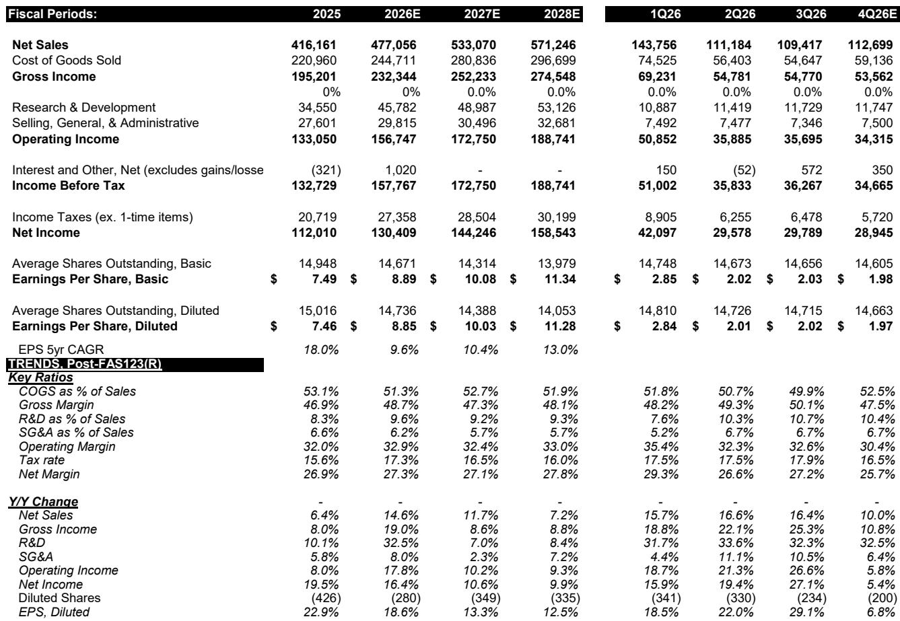
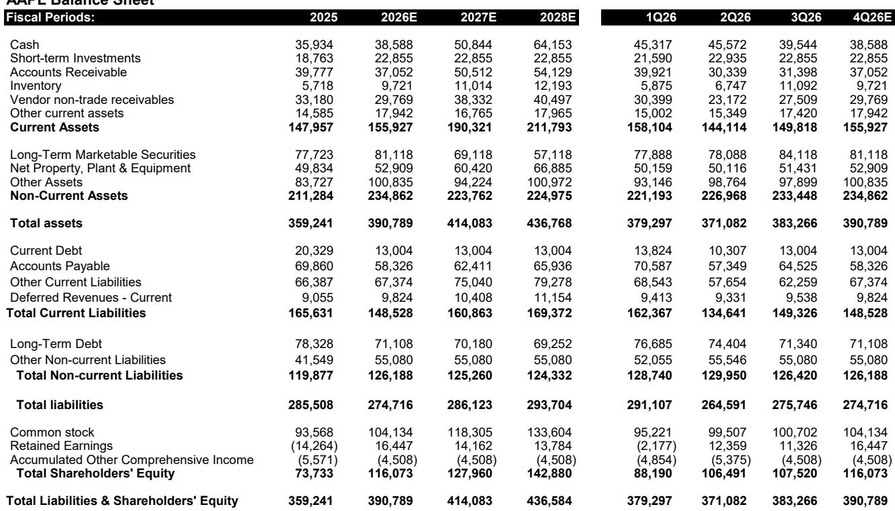
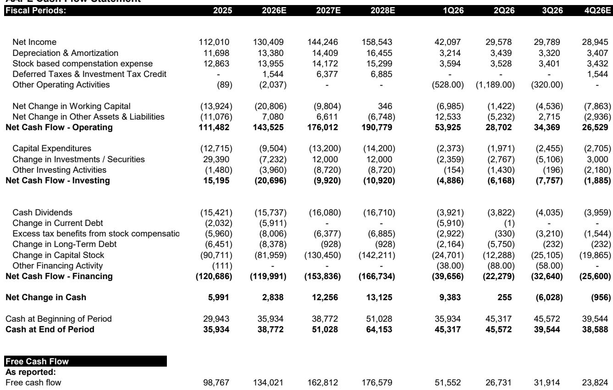

# Apple 的利润率故事已成往事，份额增长是相对少见值得长期关注的理由

Apple 的 FQ3'26 财报呈现出一个矛盾，这一矛盾将定义未来十二个月。报告营收为 1094 亿美元，同比增长 16.4%，报告毛利率为 50.1%，超出市场最悲观的预期。但剔除该利润率数据中约 200 个基点的关税返还，基本面图景将发生变化：调整后毛利率为 48.1%，基本与指引中点持平，而九月当季指引暗示毛利率将再环比压缩 160 个基点。业绩超预期是真实的，但其来源是关税返还，而非运营杠杆。九月当季营收增长指引为 9% 至 11%——较此前三个季度 15% 左右的增速明显放缓——确认公司正进入一个需求增长动能被存储成本冲击和供应链紧张所抵消的时期。

市场反应应被解读为对 Apple 份额增长可持续性的判断，而非对当季业绩本身的判断。iPhone 营收同比增长 22% 至 543 亿美元，Mac 营收达 104 亿美元，同比增长 29%，主要受 MacBook Neo 和 MacBook Pro 强劲需求推动。这些并非渐进式增长数字。它们代表了智能手机和个人电脑领域一次罕见的份额迁移，公司管理层明确将其定位为结构性机遇。矛盾在于，这一份额增长动能正与 Apple 无法完全控制的组件成本环境相碰撞。存储价格正以管理层描述为“百年一遇”的速度上涨，而公司对此的回应——对 Mac 和 iPad 进行有限度的价格调整——表明市场长期假设的定价能力并非无限。

Apple 的研究价值现在取决于一个简单的问题：份额增长能否跑赢存储成本上涨？根据最新估计，答案是肯定的，但安全边际远低于报告数字所暗示的水平。公司在消费电子领域的地位无可匹敌，超过 25 亿台活跃设备的安装基数持续支撑着各项业务均创纪录的服务业务，AI 则代表着一个尚未被充分定价的长期机遇。但近期盈利路径正在被下调，且这些调整并非表面功夫。分析师群体已将 FY27 每股收益预期下调近 6%，九月当季指引所隐含的利润率轨迹将考验那些已习惯于 Apple 屡屡超出预期的读者的耐心。

## 报告中的超预期掩盖了关税驱动的利润率幻象，该幻象不会重演

FQ3'26 的业绩是报告数据与基本面表现之间差异的典型案例。报告每股收益为 2.02 美元，大幅超出市场一致预期，但其中 0.11 美元直接来自关税返还。剔除该收益后，基本每股收益为 1.91 美元，仅略高于 1.89 美元的一致预期。毛利率方面也存在同样的情况。报告毛利率为 50.1%，在存储成本上涨的背景下看似亮眼，但约 200 个基点的关税返还几乎构成了全部环比改善。产品毛利率为 40.1%，远高于 36.4% 的一致预期，其中包含 250 个基点的关税收益。剔除该因素后，产品毛利率约为 37.6%——仍是不错的数字，但远非标题所暗示的扩张。

九月当季指引使这一幻象更加明确。Apple 指引毛利率为 47% 至 48%，其中包含 100 个基点的关税返还收益。按中点计算，这意味着较报告 FQ3 数据环比下降 260 个基点。剔除递减的关税收益后，调整后毛利率环比下降约 160 个基点。管理层对原因的表述异常直接：调整后降幅中超过 100% 可归因于存储价格上涨。换言之，若非非存储物料清单成本下降和产品组合优化的温和抵消，利润率压缩将更为严重。

战略层面的含义令人不安。Apple 历来能够将成本上涨转嫁给消费者而不造成显著的需求破坏，但当前环境有所不同。公司明确将 Mac 和 iPad 的价格调整描述为对存储市场的被动回应，这表明定价能力正在边际上受到考验。九月当季营收增长指引为 9% 至 11%，低于近几个季度 15% 左右的增速，反映的不仅是汇率逆风和供应限制，还有成本曲线陡峭化时价格调整所能发挥的作用有限。读者不应将 FQ3 报告利润率外推至未来几个季度。关税返还是一次性的过渡性收益，而这一过渡将在九月结束。

## 存储价格上涨是结构性成本冲击，而非暂时性波动，Apple 的采购选择受政治因素制约

“存储通胀”一词已进入 Apple 财报的词汇表，值得进行严肃的分析处理。存储成本在六月当季再次环比上升，管理层确认九月及 FY27 期间预计将进一步上涨。DRAM 行业仍集中于三家主要供应商，这一结构性事实限制了 Apple 的议价能力。管理层关于额外供应商可能有助于缓解供应限制并可能改善定价的评论，等于默认当前寡头格局是成本压力的根源。公司正在探索其他采购选项，第四家供应商可能是长鑫存储，但考虑到中国半导体供应商的地缘政治敏感性，此举将带来显著政治风险。

利润率影响已体现在数据中。九月毛利率指引为 47% 至 48%，暗示的环比下降几乎完全由存储驱动。缓冲了六月当季的库存结转收益预计将在九月之后减弱。非存储物料清单成本提供了一定抵消，但不足以阻止整体压缩。分析师修正反映了这一点：FY27 每股收益预期从 10.65 美元下调至 10.03 美元，降幅 5.9%，主要由于存储成本导致产品毛利率下降以及研发支出增加。FY28 预期从 11.60 美元下调至 11.28 美元，降幅 2.8%。公司 FY28 仍高于一致预期 5%，但差距正在缩小。

第二个层面的含义是，Apple 的利润率结构正变得比近期历史上任何时候都更容易受到大宗商品周期的影响。公司历来通过规模、设计效率和定价能力抵消组件成本上涨的能力，正受到一个短期内无缓解迹象的存储市场的考验。DRAM 供应集中于三家厂商意味着 Apple 无法简单地通过更换供应商获得更优价格。增加第四家供应商虽然在战略上合理，但引入的政治风险可能超过成本收益。对于读者而言，关键观察指标不是 Apple 的营收增长——这一指标仍然强劲——而是存储价格的走势以及 Apple 在现有寡头格局之外确保供应的能力。

## 供应限制是增长的隐性制约因素，九月当季将是压力测试

FQ3 业绩是在供应限制下取得的，限制在 Mac 产品线中最为明显，iPhone 和 iPad 受影响程度较轻。Mac 营收在受限情况下仍同比增长 29%，充分说明了 MacBook Neo 和 MacBook Pro 的需求强度。但九月当季面临不同挑战。管理层预计供应限制将变得更加广泛，影响 iPhone、Mac 和 iPad，供应链中可有效缓解影响的灵活性有限。限制主要源于片上系统所依赖的先进制程产能有限。

这是一个关键区别。问题不在需求，而在供应。Apple 预计九月当季需求仍将保持高位，但供应链无法灵活满足。结果是 9% 至 11% 的营收指引低估了潜在需求状况。公司留下增长空间的原因不是消费者需求减弱，而是半导体供应链正以产能极限运行。这有两方面含义。首先，九月当季业绩可能显示营收低于需求环境本可支撑的水平，这将形成一种实际上是供应问题的放缓叙事。其次，供应限制可能持续至 FY27，这将限制当前份额增长的上行空间。

战略问题是供应限制是周期性现象还是结构性现象。先进制程产能集中于少数几家代工厂，这暗示存在结构性因素。Apple 确保产能的能力取决于其与供应商的关系以及为获得保证分配而支付溢价的意愿。在受限环境中，Apple 的规模是优势——它是先进制程的最大买家——但即使这一优势也有极限。九月当季将是压力测试。如果 Apple 能在广泛供应限制下实现营收指引中点，份额增长论点将得到验证。如果限制比预期更紧，放缓幅度将比指引暗示的更为明显。

## 服务业务放缓是汇率问题，而非业务本身问题，安装基数仍是复利引擎

服务业务营收为 307 亿美元，未达 314 亿美元的一致预期，同比增长 12%，但较三月当季 16% 的增速有所放缓。放缓主要是汇率问题：汇率逆风约占放缓幅度的 2.5 个百分点，管理层预计九月当季将再面临 2.5 个百分点的汇率逆风，暗示报告增速约为 9.5%。在汇率噪音之下，业务本身保持健康。Apple 在每一个服务类别中都创下了营收纪录，包括云服务和支付服务的史上最高水平。付费订阅数超过 15 亿，交易账户和付费账户均创历史新高，新兴市场实现两位数增长。

值得注意的薄弱环节包括：移动游戏表现疲软，App Store 商业模式和监管变化对增长构成压力。去年同期 F1 院线发行的强劲对比基数也 contributed to 放缓。这些并非结构性问题，但确实表明服务业务增长并非不受外部因素影响。应用商店的监管环境仍是现实风险，游戏变现的增速正在成熟。抵消因素在于安装基数。凭借超过 25 亿台活跃设备，Apple 拥有一个在硬件、软件和服务领域持续复利的变现引擎。新兴市场付费账户的增长表明，安装基数正朝着服务业务渗透率仍较低的地区扩张。

战略含义是服务业务将成为利润率故事中的稳定力量。当产品毛利率面临存储成本逆风时，75.6% 的服务业务利润率提供了缓冲，即使存在 110 个基点的环比组合效应软化。九月当季约 9.5% 的服务业务增长指引，经汇率调整后，暗示潜在增长率保持稳定。放缓是汇率现象，而非需求现象。对于读者而言，服务业务轨迹是安装基数健康状况最可靠的指标，而当前轨迹表明复利引擎完好。

## 决策框架：份额增长是进攻变量，存储成本是防守风险，估值是摆动因素

Apple 的研究价值可归结为三变量框架。进攻变量是 iPhone 和 Mac 的份额增长。FQ3 的证据明确无误：iPhone 营收增长 22%，Mac 营收增长 29%，两者均由 AI 能力硬件的竞争优势和引起消费者共鸣的产品周期驱动。防守变量是存储成本上涨。证据同样明确：存储成本环比上升，九月指引包含进一步压缩，DRAM 寡头格局限制了 Apple 绕开问题的采购能力。摆动因素是估值。当前报价对应前瞻收益约 33 倍，这一溢价反映了市场对 Apple 在继续获得份额的同时应对成本环境的信心。

该框架暗示了特定的研究立场。份额增长是真实且可持续的，由具有持久力的产品周期驱动。存储成本压力是真实的，且可能持续至 FY27，但这是利润率问题，而非需求问题。估值要求较高，但如果份额增长持续且服务业务保持健康，并非不合理。风险在下跌方向不对称——如果存储成本加速上涨超出预期，或供应限制比指引暗示的更具约束力。机会在上行方向不对称——如果份额增长加速且存储周期比预期更早转向。

读者的决策不在于 Apple 是否是一家好公司——这一点已有定论。决策在于当前报价是否充分补偿了已嵌入指引的利润率压缩和将限制近期增长的供应约束。分析师修正将 FY27 每股收益预期下调近 6%，表明市场一致预期仍在追赶存储现实。分析师 FY28 仍高于一致预期 5% 的事实表明，份额增长论点尚未完全反映在市场数据中。对于两年投资期限的读者，该框架指向一个建设性但非自满的立场，同时理解存储周期将是决定当前溢价是否合理的关键变量。

*仅供参考。部分内容可能基于原始材料由 AI 辅助生成、翻译、总结或编辑，可能包含遗漏或错误。请独立核实。本文不构成投资、法律、税务、会计或其他专业建议。*

仅供参考。部分内容可能基于原始材料由 AI 辅助生成、翻译、总结或编辑，可能包含遗漏或错误。请独立核实。本文不构成投资、法律、税务、会计或其他专业建议。

