# Asian Industrial Technology

# Asian Industrial Tech: The Barometer (June/July 2026)

Jay Huang, Ph.D.

+852 2123 2631

jay.huang@bernsteinsg.com

Elsa Fu

+852 2123 2617

elsa.fu@bernsteinsg.com

Weibin Liang, Ph.D.

+852 2123 2666

weibin.liang@bernsteinsg.com

6月和7月，中国工厂自动化领域继续保持接近峰值的增速。在世界其他地区，复苏势头持续增强，其中日本增长动能稳健。读者可在此下载完整的景气度数据集：Global Industrial Barometer。

我们重点列出中国市场的三项数据：1）7月，官方制造业PMI及生产PMI分别降至49.2（前值50.3，图表2）和49.9（前值51.4），主要受高基数及部分制造业行业季节性回落影响；新订单PMI降至48.5（前值51.2，图表4）。与工厂自动化更相关的高技术制造业和装备制造业PMI仍处于扩张区间，分别为53.3（前值53.5）和51.4（前值52.5）。2）6月，日本来自中国的机床订单同比继续强劲增长（6月同比49.1%，5月同比42.7%，剔除汇率影响，图表17），增长面较为广泛，其中电气和精密机械动能较强（图表18）。与以往周期相似的“双峰”形态正在形成。3）二季度，核心自动化产品延续稳健增长（图表16）。交流伺服和数控系统销售额同比增长25%，较一季度的17%和22%有所加快。中大型PLC、小型PLC和人机界面也呈现双位数增长及加速趋势，同比分别增长14%、15%和11%。低压变频器增速从一季度的4%提升至二季度的7%。金属切削机床和工业机器人产量保持强劲，6月同比分别增长18.1%和28.1%，5月分别为10.7%和27.9%（图表19、图表29）。

全球方面：1）5月，日本机床订单同比增长52.7%，环比加速14.9%（图表37）。日本国内增速在6月进一步加快至同比45.5%（5月为37.3%，图表38），行业调查显示对三季度订单趋势的信心有明显改善。剔除汇率影响，北美地区同比增长29.4%（5月为4.2%），增长面较为广泛（图表41）；欧盟地区增速转正（同比6.7%，5月为-13.2%），但电气和精密机械仍处调整区间。2）7月，主要经济体的制造业PMI均处于扩张区间（美国53.8；欧元区52.0；日本54.7；图表34至图表36）。3）5月，日本机器人出口量增速温和提升至同比11.2%（5月为9.1%，图表45），主要受亚洲需求支撑（中国同比23.7%，亚洲除中国外同比15.5%，图表46）。与此同时，日本机器人整体订单动能稳健，同比增长33.5%（图表44）。

## BERNSTEIN TICKER TABLE

<table><tr><td rowspan="2">Ticker</td><td colspan="4">30 Jul 2026</td><td rowspan="2">TTMRel.</td><td colspan="4">Reported EPS</td><td colspan="3">Reported P/E (x)</td></tr><tr><td>Rating</td><td>Cur</td><td>Closing Price</td><td>Price Target</td><td>Cur</td><td>2025A</td><td>2026E</td><td>2027E</td><td>2025A</td><td>2026E</td><td>2027E</td></tr><tr><td>CGNX (Cognex)</td><td>O</td><td>USD</td><td>62.62</td><td>75.00</td><td>68.6%</td><td>USD</td><td>0.67</td><td>1.46</td><td>1.62</td><td>93.5</td><td>42.9</td><td>38.8</td></tr><tr><td>6954.JP (Fanuc)</td><td>O</td><td>JPY</td><td>6,624.00</td><td>7,000.00</td><td>19.2%</td><td>JPY</td><td>178.47</td><td>207.32</td><td>193.15</td><td>37.1</td><td>32.0</td><td>34.3</td></tr><tr><td>002008.CH (Hans Laser)</td><td>O</td><td>CNY</td><td>81.90</td><td>130.00</td><td>179.6%</td><td>CNY</td><td>1.15</td><td>2.15</td><td>2.48</td><td>71.2</td><td>38.0</td><td>33.0</td></tr><tr><td>IPGP (IPG Photonics)</td><td>O</td><td>USD</td><td>84.90</td><td>125.00</td><td>(6.7)%</td><td>USD</td><td>0.73</td><td>1.30</td><td>2.24</td><td>116.3</td><td>65.4</td><td>37.9</td></tr><tr><td>6861.JP (Keyence)</td><td>O</td><td>JPY</td><td>78,970</td><td>95,000</td><td>7.2%</td><td>JPY</td><td>1,835.62</td><td>2,420.47</td><td>2,675.94</td><td>43.0</td><td>32.6</td><td>29.5</td></tr><tr><td>300124.CH (Inovance)</td><td>O</td><td>CNY</td><td>63.51</td><td>82.00</td><td>(23.9)%</td><td>CNY</td><td>1.87</td><td>2.19</td><td>2.65</td><td>34.0</td><td>29.0</td><td>24.0</td></tr><tr><td>002415.CH (Hikvision)</td><td>O</td><td>CNY</td><td>35.62</td><td>45.00</td><td>2.7%</td><td>CNY</td><td>1.55</td><td>2.08</td><td>2.14</td><td>23.0</td><td>17.2</td><td>16.6</td></tr><tr><td>OLD</td><td></td><td></td><td></td><td>40.00</td><td></td><td></td><td></td><td>1.79</td><td>1.98</td><td></td><td></td><td></td></tr><tr><td>6324.JP (HDSI)</td><td>O</td><td>JPY</td><td>5,500.00</td><td>7,800.00</td><td>53.4%</td><td>JPY</td><td>16.99</td><td>57.37</td><td>79.51</td><td>323.7</td><td>95.9</td><td>69.2</td></tr><tr><td>1590.TT (AirTAC)</td><td>O</td><td>TWD</td><td>1,340.00</td><td>1,570.00</td><td>32.5%</td><td>TWD</td><td>41.97</td><td>57.19</td><td>59.53</td><td>31.9</td><td>23.4</td><td>22.5</td></tr><tr><td>6273.JP (SMC)</td><td>O</td><td>JPY</td><td>66,160</td><td>78,000</td><td>(10.3)%</td><td>JPY</td><td>2,640.86</td><td>2,975.39</td><td>3,256.00</td><td>25.1</td><td>22.2</td><td>20.3</td></tr><tr><td>002747.CH (Estun)</td><td>M</td><td>CNY</td><td>27.95</td><td>26.00</td><td>9.0%</td><td>CNY</td><td>0.05</td><td>0.31</td><td>0.32</td><td>559.0</td><td>90.9</td><td>86.4</td></tr><tr><td>2715.HK (Estun)</td><td>M</td><td>HKD</td><td>15.97</td><td>17.26</td><td>NA</td><td>CNY</td><td>0.05</td><td>0.31</td><td>0.32</td><td>319.4</td><td>52.0</td><td>49.4</td></tr><tr><td>SPX</td><td></td><td></td><td>7,437.63</td><td></td><td></td><td></td><td></td><td></td><td></td><td></td><td></td><td></td></tr><tr><td>JPL</td><td></td><td></td><td>2,562.20</td><td></td><td></td><td></td><td></td><td></td><td></td><td></td><td></td><td></td></tr><tr><td>ASIAX</td><td></td><td></td><td>1,808.17</td><td></td><td></td><td></td><td></td><td></td><td></td><td></td><td></td><td></td></tr></table>

O - Outperform, M - Market-Perform, U - Underperform, NR - Not Rated, CS - Coverage Suspended 6954.JP, 6861.JP, 6273.JP base year is 2026;
Source: Bloomberg, Bernstein estimates and analysis.

## PRICE TARGET CHANGE / ESTIMATE CHANGE IN BOLD

## DETAILS

EXHIBIT 1: Momentum Tracker

<table><tr><td colspan="2"></td><td>Lastest period</td><td>Data type / unit</td><td>(a) Latest</td><td>(b) Previous</td><td>(c) YTD</td><td>(d) Previous FY</td><td>Momentum (a) vs. (b)</td><td>Momentum (c) vs. (d)</td></tr><tr><td rowspan="22">China</td><td colspan="9">Macro Indicator</td></tr><tr><td>M1</td><td>Jun-26</td><td>YoY Growth</td><td>4.0%</td><td>5.5%</td><td>5.1%</td><td>3.7%</td><td>↓</td><td>↑</td></tr><tr><td>PMI in Manufacturing</td><td>Jul-26</td><td>Index</td><td>49.2</td><td>50.3</td><td>49.8</td><td>49.6</td><td>↓</td><td>↑</td></tr><tr><td>RatingDog Manufacturing PMI</td><td>Jun-26</td><td>Index</td><td>51.7</td><td>51.8</td><td>51.5</td><td>50.3</td><td>↓</td><td>↑</td></tr><tr><td>Emerging Industries PMI</td><td>Jul-26</td><td>Index</td><td>47.8</td><td>50.4</td><td>51.5</td><td>50.9</td><td>↓</td><td>↑</td></tr><tr><td>FAI - Overall</td><td>Jun-26</td><td>YTD Growth</td><td>-5.7%</td><td>-4.1%</td><td>-1.0%</td><td>1.4%</td><td>↓</td><td>↓</td></tr><tr><td>FAI in Manufacturing</td><td>Jun-26</td><td>YTD Growth</td><td>-1.2%</td><td>-0.4%</td><td>1.4%</td><td>5.8%</td><td>↓</td><td>↓</td></tr><tr><td>FAI in Equipment Purchase</td><td>Jun-26</td><td>YTD Growth</td><td>8.1%</td><td>9.3%</td><td>10.9%</td><td>15.5%</td><td>↓</td><td>↓</td></tr><tr><td>Manufacturing Capacity Utilization</td><td>2Q26</td><td>Value (%)</td><td>73.0</td><td>73.6</td><td>73.3</td><td>74.4</td><td>↓</td><td>↓</td></tr><tr><td>Industrial Profit Growth</td><td>Jun-26</td><td>YoY Growth</td><td>15.1%</td><td>21.1%</td><td>18.7%</td><td>0.6%</td><td>↓</td><td>↑</td></tr><tr><td>Manufacturing Value-Add</td><td>Jun-26</td><td>YoY Growth</td><td>6.0%</td><td>4.4%</td><td>5.4%</td><td>6.3%</td><td>↑</td><td>↓</td></tr><tr><td>PPI: All Industries</td><td>Jun-26</td><td>Index</td><td>101.5</td><td>101.8</td><td>100.2</td><td>98.1</td><td>↓</td><td>↑</td></tr><tr><td>Floor Space: Started</td><td>Jun-26</td><td>YTD Growth</td><td>-23.5%</td><td>-22.7%</td><td>-22.4%</td><td>-22.6%</td><td>↓</td><td>↑</td></tr><tr><td colspan="9">Equipment Production</td></tr><tr><td>Excavator (Sales Volume)</td><td>Jun-26</td><td>YoY Growth</td><td>35.3%</td><td>36.2%</td><td>49.8%</td><td>17.0%</td><td>↓</td><td>↑</td></tr><tr><td>Electric Motors</td><td>Jun-26</td><td>YoY Growth</td><td>1.5%</td><td>6.3%</td><td>-0.5%</td><td>-0.5%</td><td>↓</td><td>—</td></tr><tr><td>Metal-cutting Machine Tool</td><td>Jun-26</td><td>YoY Growth</td><td>18.1%</td><td>10.7%</td><td>5.9%</td><td>9.7%</td><td>↑</td><td>↓</td></tr><tr><td>Packaging Machinery</td><td>Jun-26</td><td>YoY Growth</td><td>5.1%</td><td>-7.5%</td><td>-3.8%</td><td>18.2%</td><td>↑</td><td>↓</td></tr><tr><td>Metal-shaping Machine Tool</td><td>Jun-26</td><td>YoY Growth</td><td>5.9%</td><td>6.3%</td><td>4.1%</td><td>7.2%</td><td>↓</td><td>↓</td></tr><tr><td>Multiple Units</td><td>Jun-26</td><td>YoY Growth</td><td>109.4%</td><td>-76.0%</td><td>3.0%</td><td>6.7%</td><td>↑</td><td>↓</td></tr><tr><td>Locomotives</td><td>Jun-26</td><td>YoY Growth</td><td>-6.9%</td><td>13.1%</td><td>40.7%</td><td>16.7%</td><td>↓</td><td>↑</td></tr><tr><td>Industrial Robots</td><td>Jun-26</td><td>YoY Growth</td><td>28.1%</td><td>27.9%</td><td>28.1%</td><td>28.0%</td><td>↑</td><td>↑</td></tr><tr><td rowspan="31">World</td><td colspan="9">Purchasing Managers&#x27; Index (PMI)</td></tr><tr><td>World</td><td>Jun-26</td><td>Index</td><td>52.2</td><td>52.7</td><td>51.9</td><td>50.3</td><td>↓</td><td>↑</td></tr><tr><td>United States</td><td>Jul-26</td><td>Index</td><td>53.8</td><td>53.9</td><td>53.4</td><td>51.7</td><td>↓</td><td>↑</td></tr><tr><td>Eurozone</td><td>Jul-26</td><td>Index</td><td>52.0</td><td>51.4</td><td>51.3</td><td>49.1</td><td>↑</td><td>↑</td></tr><tr><td>Japan</td><td>Jul-26</td><td>Index</td><td>54.7</td><td>54.8</td><td>53.6</td><td>49.0</td><td>↓</td><td>↑</td></tr><tr><td>Emerging Markets</td><td>Jun-26</td><td>Index</td><td>51.4</td><td>51.6</td><td>51.3</td><td>50.6</td><td>↓</td><td>↑</td></tr><tr><td colspan="9">Manufacturing Utilization and Investment</td></tr><tr><td>Japan Manufacturing Utilization</td><td>May-26</td><td>Index</td><td>103.0</td><td>102.9</td><td>103.9</td><td>102.5</td><td>↑</td><td>↑</td></tr><tr><td>US Manufacturing Utilization</td><td>Jun-26</td><td>Value (%)</td><td>75.6</td><td>75.6</td><td>75.3</td><td>75.3</td><td>—</td><td>↓</td></tr><tr><td>US Industrial Equipment Investment</td><td>2Q26</td><td>YoY Growth</td><td>11.0%</td><td>7.4%</td><td>9.2%</td><td>6.8%</td><td>↑</td><td>↑</td></tr><tr><td>EU Manufacturing Utilization</td><td>2Q26</td><td>Value (%)</td><td>78.0</td><td>77.9</td><td>78.0</td><td>77.8</td><td>↑</td><td>↑</td></tr><tr><td colspan="9">Japan Machine Tool Orders</td></tr><tr><td>Total Japan Machine Tool Orders</td><td>Jun-26</td><td>YoY Growth</td><td>52.7%</td><td>37.5%</td><td>35.7%</td><td>8.0%</td><td>↑</td><td>↑</td></tr><tr><td>from Japan</td><td>Jun-26</td><td>YoY Growth</td><td>45.5%</td><td>37.3%</td><td>22.8%</td><td>-0.2%</td><td>↑</td><td>↑</td></tr><tr><td>from China</td><td>Jun-26</td><td>YoY Growth</td><td>49.1%</td><td>42.7%</td><td>38.2%</td><td>17.1%</td><td>↑</td><td>↑</td></tr><tr><td>from Asia ex-China</td><td>Jun-26</td><td>YoY Growth</td><td>72.0%</td><td>67.4%</td><td>40.1%</td><td>5.6%</td><td>↑</td><td>↑</td></tr><tr><td>from EU</td><td>Jun-26</td><td>YoY Growth</td><td>6.7%</td><td>-13.2%</td><td>9.2%</td><td>1.3%</td><td>↑</td><td>↑</td></tr><tr><td>from North America</td><td>Jun-26</td><td>YoY Growth</td><td>29.4%</td><td>4.2%</td><td>27.6%</td><td>19.0%</td><td>↑</td><td>↑</td></tr><tr><td colspan="9">Japan Industrial Robot Export Volume</td></tr><tr><td>Total Industrial Robot Export</td><td>Jun-26</td><td>YoY Growth</td><td>11.2%</td><td>9.1%</td><td>24.8%</td><td>26.8%</td><td>↑</td><td>↓</td></tr><tr><td>to China</td><td>Jun-26</td><td>YoY Growth</td><td>23.7%</td><td>5.7%</td><td>25.7%</td><td>37.6%</td><td>↑</td><td>↓</td></tr><tr><td>to Asia ex-China</td><td>Jun-26</td><td>YoY Growth</td><td>15.5%</td><td>22.4%</td><td>29.9%</td><td>5.3%</td><td>↓</td><td>↑</td></tr><tr><td>to US</td><td>Jun-26</td><td>YoY Growth</td><td>-14.0%</td><td>5.8%</td><td>10.6%</td><td>92.4%</td><td>↓</td><td>↓</td></tr><tr><td>to EU</td><td>Jun-26</td><td>YoY Growth</td><td>-4.9%</td><td>10.8%</td><td>29.6%</td><td>-8.8%</td><td>↓</td><td>↑</td></tr><tr><td colspan="9">Japan Automation Production and Order</td></tr><tr><td>Servo Motor Production</td><td>May-26</td><td>YoY Growth</td><td>-15.9%</td><td>11.0%</td><td>11.3%</td><td>0.3%</td><td>↓</td><td>↑</td></tr><tr><td>PLC Production</td><td>May-26</td><td>YoY Growth</td><td>-22.2%</td><td>-35.1%</td><td>-20.9%</td><td>41.2%</td><td>↑</td><td>↓</td></tr><tr><td>Reducer Production</td><td>May-26</td><td>YoY Growth</td><td>8.2%</td><td>10.3%</td><td>17.3%</td><td>-8.7%</td><td>↓</td><td>↑</td></tr><tr><td>Robot Production</td><td>May-26</td><td>YoY Growth</td><td>-0.6%</td><td>17.3%</td><td>14.9%</td><td>19.6%</td><td>↓</td><td>↓</td></tr><tr><td>Pneumatic Components Production</td><td>May-26</td><td>YoY Growth</td><td>34.7%</td><td>31.1%</td><td>26.1%</td><td>5.6%</td><td>↑</td><td>↑</td></tr><tr><td>Robot Order</td><td>May-26</td><td>YoY Growth</td><td>33.5%</td><td>33.5%</td><td>38.5%</td><td>41.1%</td><td>—</td><td>↓</td></tr></table>

NBS, JMTBA, METI, Japan Ministry of Finance, US BEA, PMIII, Haver, Bloomberg, Wind, Bernstein analysis. Source: Momentum Tracker

## CHINA

EXHIBIT 2: China manufacturing PMI trend  
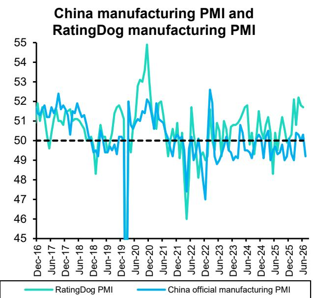  
Source: Haver, Bloomberg, Bernstein analysis

EXHIBIT 3: Liquidity tracker: M1, TSF and entrusted & trust loan trends  
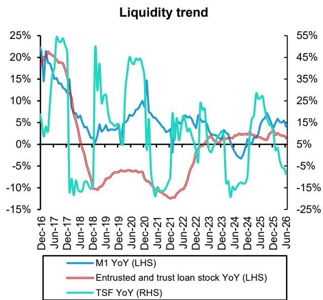  
Source: Haver, Bernstein analysis

EXHIBIT 4: China new order, new order/inventory, production and business expectation PMIs  
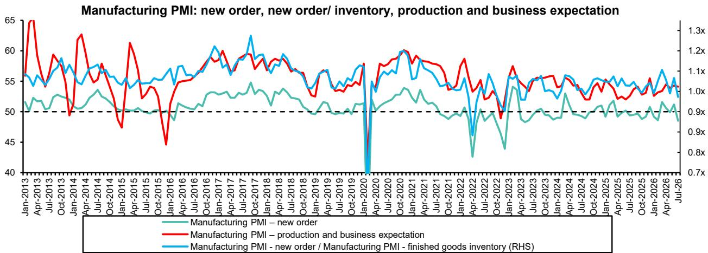  
Source: Haver, China National Bureau of Statistics, Bernstein analysis.

## EXHIBIT 5: China emerging industries PMI (6-month moving average)

China emerging industries PMI (6-month moving average)  
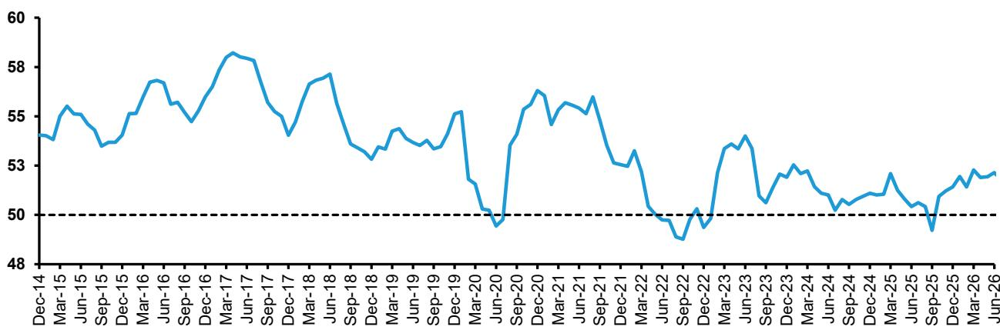

Note: The EPMI includes 280 sample companies in seven industries including energy conservation and environmental protection, new generation information technology, biotechnology, high-end equipment manufacturing, new energy, new materials, and new energy automobile industry. The EPMI survey is a monthly survey, which is greatly affected by seasonal factors and has large data fluctuations. The comprehensive index and sub-indices of EPMI currently released are seasonally adjusted data.

Source: Wind, Chinese Academy of Science and Technology for Development, PMIII, Bernstein analysis

EXHIBIT 6: Value-add growth of high technology manufacturing and general manufacturing  
Value-added growth of high-tech manufacturing and general manufacturing  
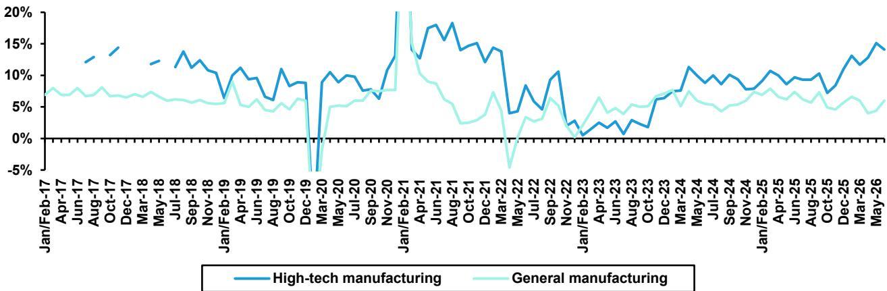  
Source: NBS, Bernstein analysis.  
Note: Pricing effect has been removed from the value-add growth rate.

EXHIBIT 7: Growth of industrial profit and inventory of finished goods in China (yoy)  
Growth of industrial profit and industrial inventory of finished goods in China  
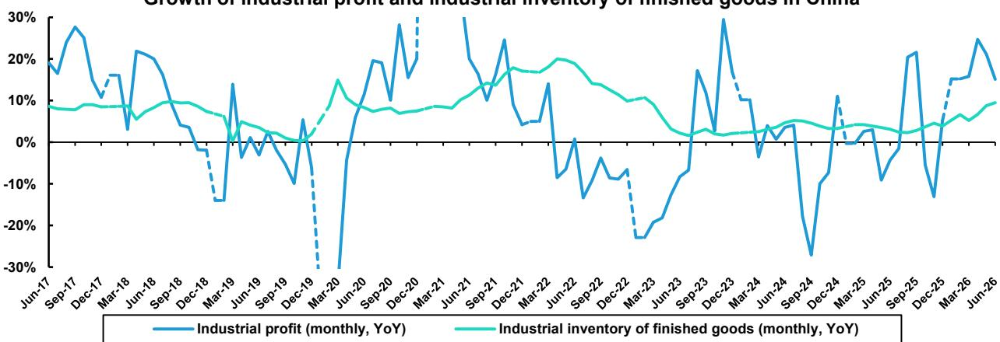  
Source: Wind, National Bureau of Statistics of China, Bernstein analysis

EXHIBIT 8: Industrial profit trend across key manufacturing subsectors  
Industrial profit growth (YTD, YoY) by manufacturing subsector in China  
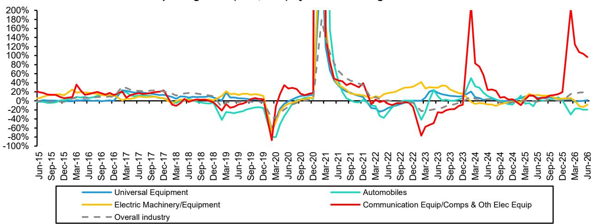  
Source: NBS, Haver, Bernstein analysis

Source: NBS, Haver, Bernstein analysis  
EXHIBIT 9: Total Fixed Asset Investment (FAI), FAI in manufacturing, and FAI in purchase of equipment.  
Total FAI and fixed investment for manufacturing and purchase of equipment (YTD YoY Growth)  
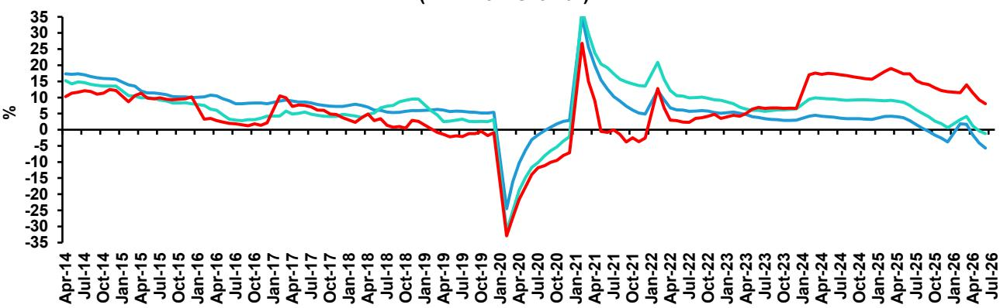

<table><tr><td>Total Investment in fixed assets (YTD YoY growth)</td><td>Fixed Investment: manufacturing (YTD YoY growth)</td></tr><tr><td>Fixed Investment: purchase of equipment (YTD YoY growth)</td><td></td></tr></table>

Source: National Bureau of Statistics (NBS), Haver, Bernstein analysis

EXHIBIT 10: FAI in manufacturing, auto, and electronics  
FAI in manufacturing, auto, and electronics (YTD YoY growth)  
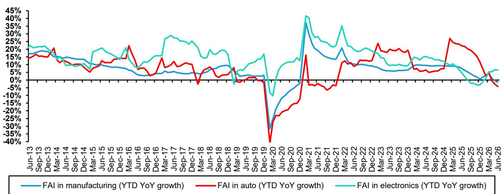

EXHIBIT 11: Infrastructure investment in China is still growing, especially Railway-related investments  
FAI in infrastructure, railway and road (YTD YoY growth)  
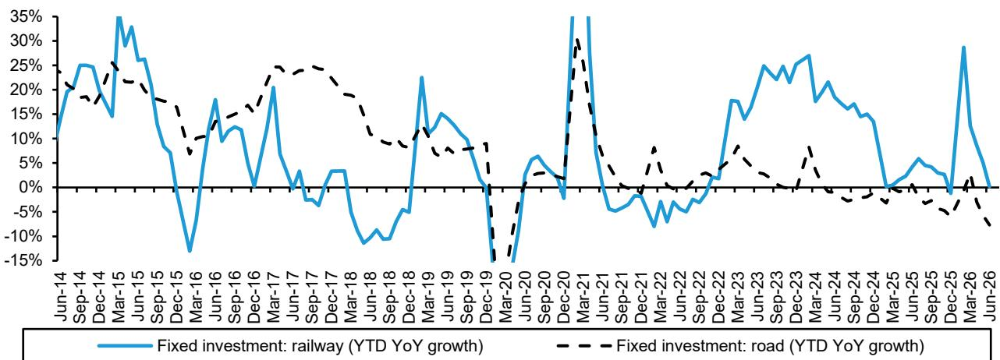  
Source: Haver, Bernstein analysis

EXHIBIT 12: Real estate development trend  
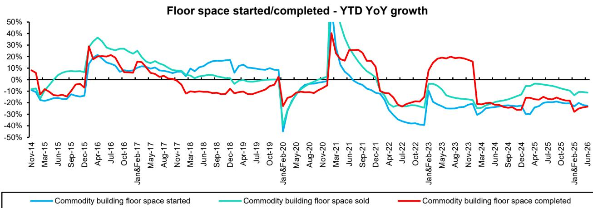  
Source: NBS, Haver, Bernstein analysis

EXHIBIT 13: China industrial capacity utilization by quarter  
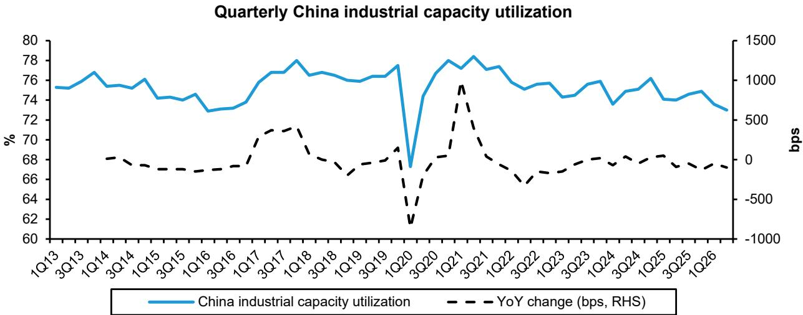  
Source: Haver, Bernstein analysis

EXHIBIT 14: Power consumption growth.  
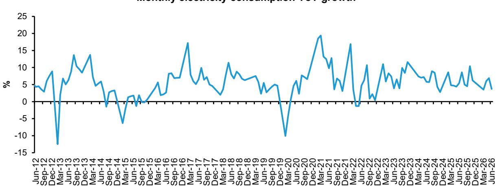  
Note: No data in December and January
Source: Haver, Bernstein analysis.

EXHIBIT 15: PPI and steel price trends  
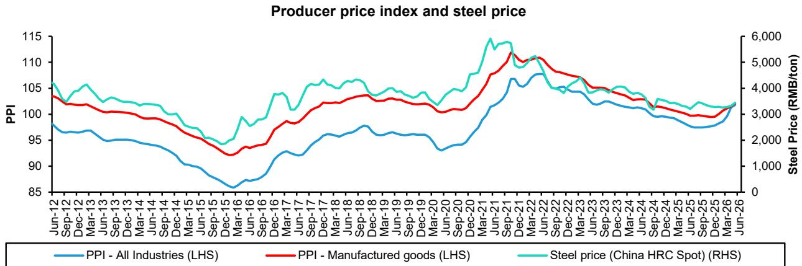  
Note: Manufactured goods exclude mining, quarrying and raw materials.
Source: Haver, Bernstein analysis.

Equipment sales and production  
EXHIBIT 16: China factory automation shipment value growth trend by product (YoY)  
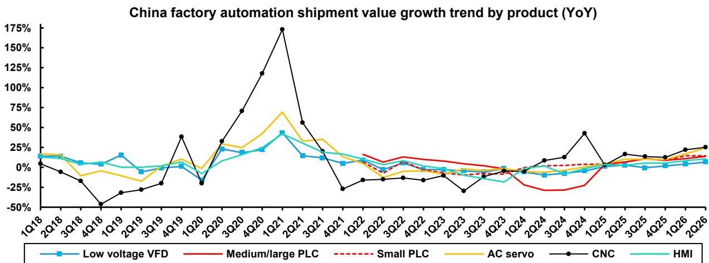  
Source: MIR Databank, Bernstein analysis

EXHIBIT 17: Japan machine tool orders from China and YoY growth  
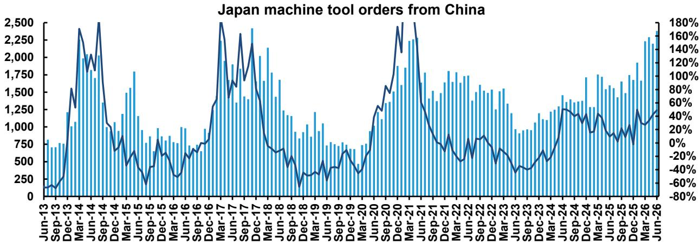  
Note: We adjusted the value to local currency to reflect the true demand.
Source: Bloomberg, JMTBA, Bernstein analysis

EXHIBIT 18: Japan machine tool order growth contribution breakdown by industry (China)  
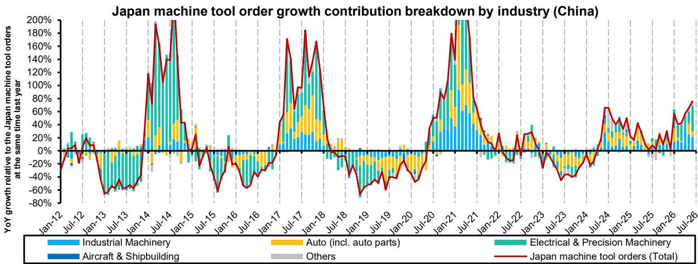  
Source: JMTBA, Bernstein analysis

EXHIBIT 19: China metal-cutting machine tool production and YoY growth  
China machine tool production  
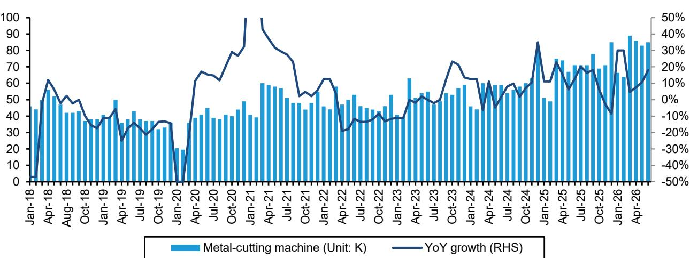  
Note: The year-over-year percent changes of the monthly volume data do not always match the published year-over-year percent changes because the monthly volume data come from enterprises that are not the same from year to year whereas the published growth rates are calculated from enterprises that are the same from year to year.  
Source: Haver, Bernstein analysis.  
Electric motor - industrial output YTD unit growth  
Industrial robot - industrial output YTD unit growth

EXHIBIT 20: Electric Motor: Industrial output YTD growth

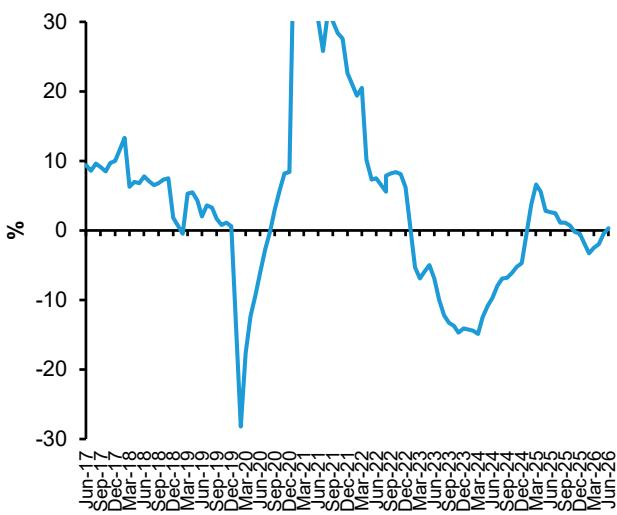  
EXHIBIT 21: Industrial Robot: Industrial output YTD growth

Note: The published year-to-year percent changes of the monthly YTD volume series are not always the same as the calculated year-to-year percent changes because the monthly YTD volume data come from enterprises that are not the same from year to year whereas the published growth rates are calculated from enterprises that are the same from year to year.

![](images/0101bf4eb4d6e
