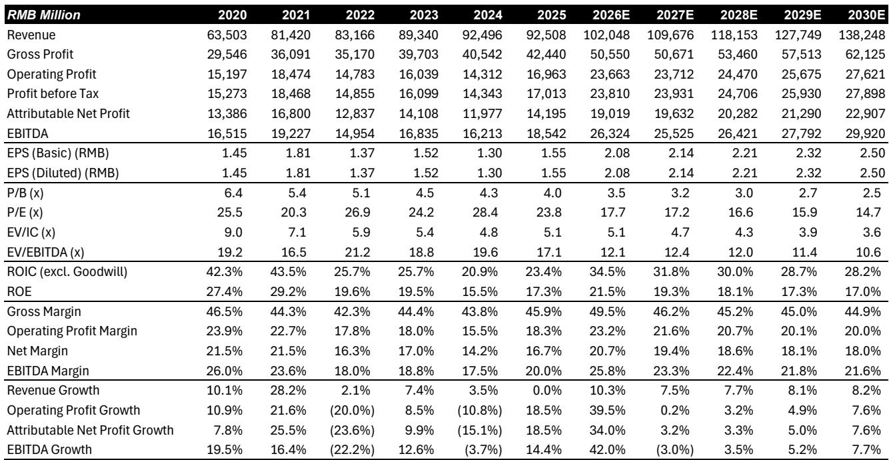
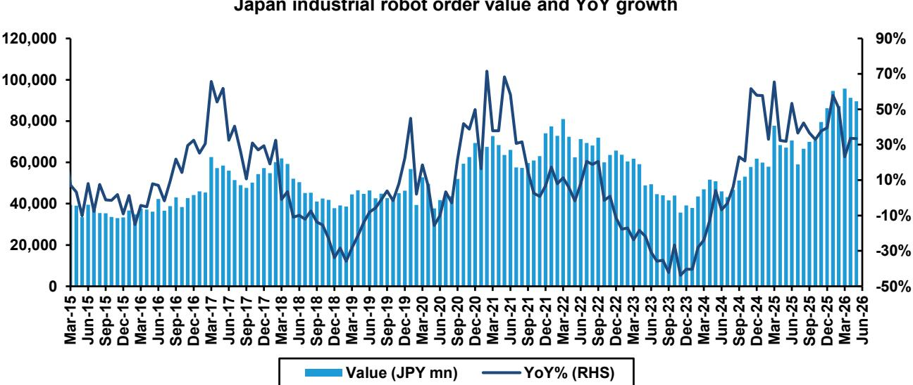

# Bernstein：研究主题与行业变化观察

这份Bernstein亚洲工业技术团队的月度景气度追踪报告，覆盖6月和7月数据，核心信息可以概括为一句：中国工厂自动化需求仍在高位增长，而中国以外地区的工业复苏正在从日本向北美和欧洲扩散。两个区域同时处在扩张区间，这在过去几个季度并不多见。

报告最有辨识度的证据来自三组数据。中国7月官方制造业PMI回落到49.2，但高技术制造业PMI仍守在53.3，装备制造业PMI为51.4，两者都处于扩张区间。6月日本机床来自中国的订单同比增长49.1%，高于5月的42.7%。二季度中国AC伺服和CNC销售额同比增长25%，比一季度的17%和22%进一步提速。这些数字合在一起指向一个判断：中国制造业总量层面的动能有所调整，但设备更新和自动化升级的细分需求仍保持强势。

## 1. 中国PMI回落集中在总量指标，高技术制造仍处扩张区间

7月官方制造业PMI从50.3降至49.2，生产PMI从51.4降至49.9，新订单PMI从51.2降至48.5。报告将回落归因于高基数和部分制造业的季节性节奏变化。更值得关注的是结构差异：高技术制造业PMI为53.3，装备制造业PMI为51.4，均高于荣枯线。

这种总量与结构的分化，在设备产量数据中得到印证。6月金属切削机床产量同比增长18.1%，高于5月的10.7%；工业机器人产量同比增长28.1%，与5月的27.9%基本持平。报告认为，这与工厂自动化产品的销售增长趋势一致。

> **KC评论：** 看中国工业数据时，总量PMI和细分设备产量经常出现方向不一致。这份报告提示的观察方法是：当高技术制造和装备制造PMI仍高于50，同时机床和机器人产量保持双位数增长时，设备端的景气度可能比总量指标显示的更强。

## 2. 日本机床订单形成“双峰”形态，中国需求与本土需求同步走强

6月日本机床订单总额同比增长52.7%，环比加速14.9%。其中来自日本的订单同比增长45.5%，高于5月的37.3%；来自中国的订单同比增长49.1%。报告特别指出，订单增长呈现“双峰”形态，与以往周期相似——即中国和日本本土需求同时处于高位。

北美订单在剔除汇率影响后同比增长29.4%，较5月的4.2%明显提速，且增长范围广泛。欧盟订单同比转正至6.7%，但电气和精密机械订单仍在下降。报告提到，行业调查显示市场对三季度订单趋势的信心有明显改善。

## 3. 二季度中国自动化产品销售额全面提速，伺服与CNC增速领先

二季度AC伺服和CNC销售额同比增长25%，较一季度的17%和22%加快。中大型PLC增长14%，小型PLC增长15%，HMI增长11%，低压变频器从一季度的4%提速至7%。报告认为，这些产品线的同步加速表明自动化需求并非集中在单一品类。

工业机器人产量连续两个月保持28%左右的同比增速，金属切削机床产量增速从5月的10.7%升至6月的18.1%。报告将设备产量与自动化产品销售额放在一起观察，认为两者相互印证，指向同一轮设备更新周期。

> **KC评论：** 伺服、PLC、变频器这些产品通常被视为工厂自动化需求的“同步指标”。当多个品类同时加速而非个别产品异动时，需求基础的广泛性更强，也更值得跟踪后续季度是否延续。

## 4. 全球制造业PMI全部处于扩张区间，日本机器人订单增长33.5%

7月美国、欧元区和日本制造业PMI分别为53.8、52.0和54.7，全部处于扩张区间。5月日本机器人订单同比增长33.5%，出口量同比增长11.2%，其中对中国出口增长23.7%，对亚洲其他地区出口增长15.5%。美国工业设备研究二季度同比增长11.0%，高于一季度的7.4%。

报告同时列出日本自动化产品生产的月度波动：5月伺服电机产量同比下降15.9%，PLC产量下降22.2%，与订单端的强劲增长形成反差。报告没有完全展开这一差异的原因，但订单与生产的背离通常与库存周期和交付节奏有关，后续月份的数据值得继续观察。

这份报告的观察框架可以简化为三组对照：中国总量PMI与高技术制造PMI的差距、日本机床订单中本土与中国需求的同步性、自动化产品销售额与设备产量的相互印证。三组对照共同指向一个判断——全球工业自动化需求正处于一轮多区域同步扩张的阶段，其中中国设备更新需求是重要的支撑力量。

For informational purposes only. Portions may be generated,translated,summarized,or edited with AI assistance based on source materials and may contain omissions or errors. Please verify independently. This is not investment,legal,tax,accounting,or other professional advice.

For informational purposes only. Portions may be generated,translated,summarized,or edited with AI assistance based on source materials and may contain omissions or errors. Please verify independently. This is not investment,legal,tax,accounting,or other professional advice.

