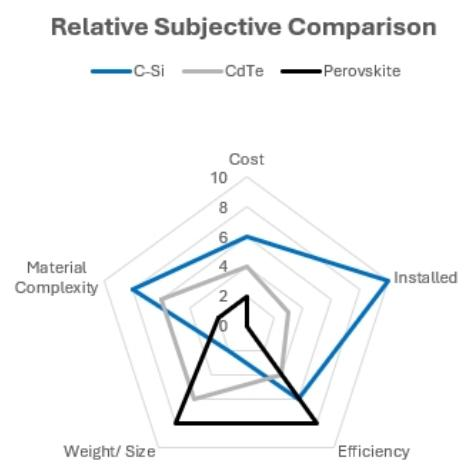
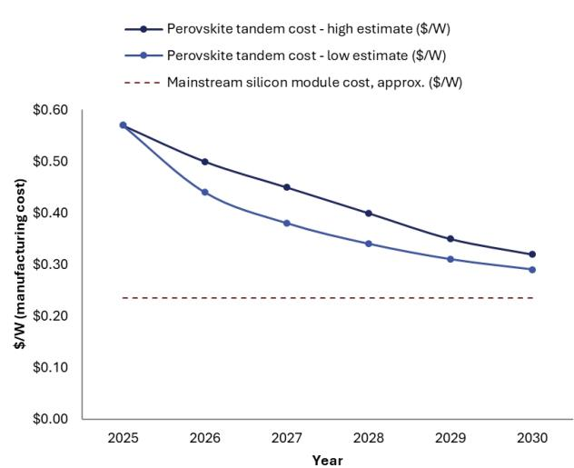
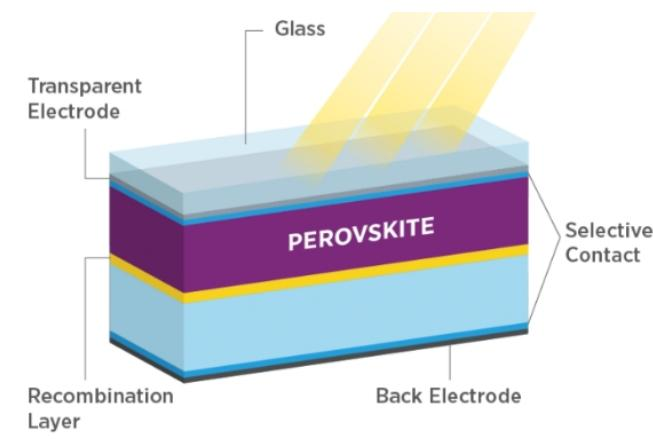
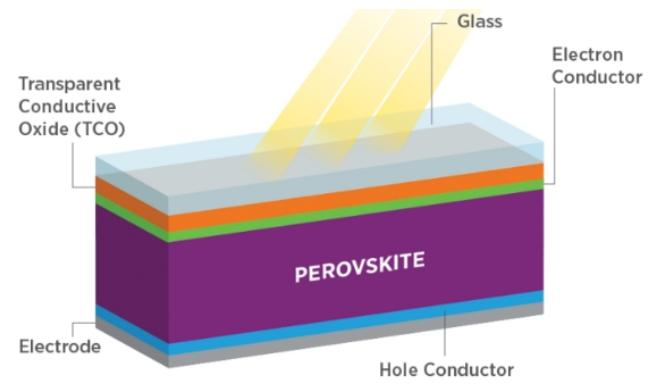
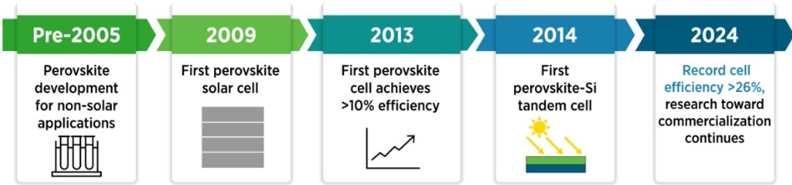
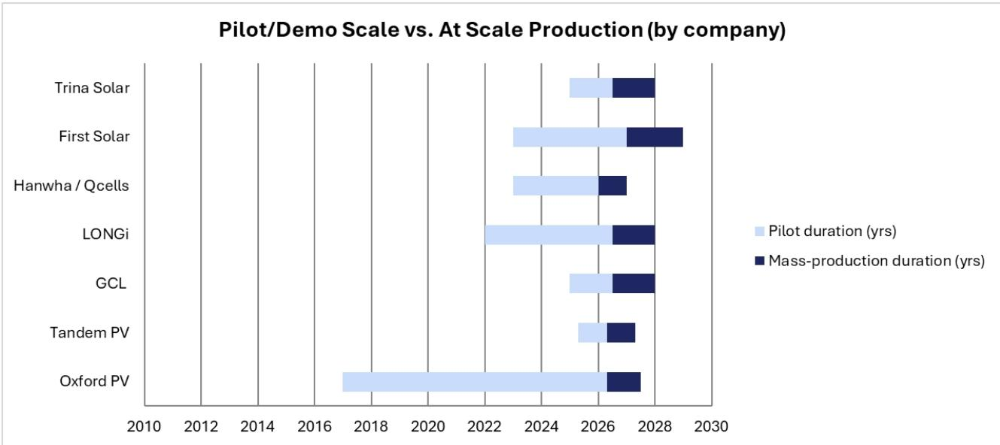
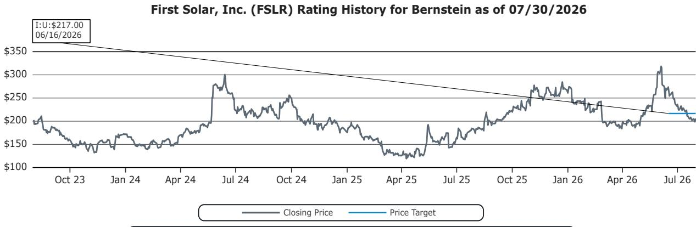
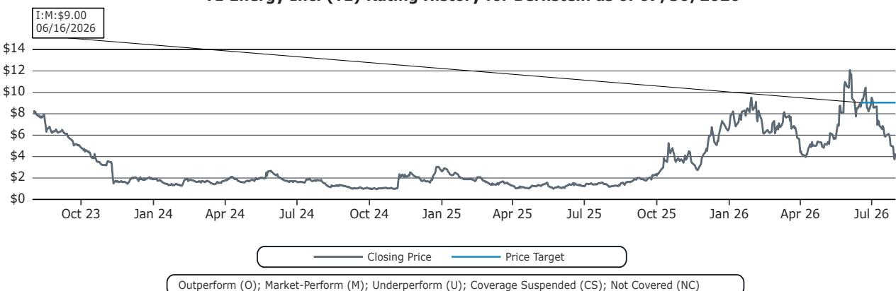

# 美洲能源与转型

# 美洲电力与能源转型：钙钛矿——下一代太阳能的新希望？

  
Sunaina Ocalan  
.+1 917 344 8503

sunaina.ocalan@bernsteinsg.com

Anshika Bajpai

+1 917 344 8306

anshika.bajpai@bernsteinsg.com

Raphael Lee

+1 917 344 8355

raphael.lee@bernsteinsg.com

钙钛矿被视为太阳能技术领域的下一代希望。其前景在于相比传统硅基面板，具备更高的转换效率和潜在更低的生产成本。商业化的主要障碍一直是稳定性，即在各种条件下保持性能一致、不发生衰减。

本周我们邀请了Tandem PV的首席执行官Scott Wharton到办公室交流——Tandem PV是一家美国私营公司，致力于在美国实现钙钛矿技术的规模化商业应用。本篇笔记结合了本次交流内容与我们的独立研究。

覆盖范围解读：该主题与FSLR（Oxford PV许可作为其CdTe技术路线的防御性对冲，加上内部研发和中试线）直接相关，对TE（美国硅制造故事）具有次级相关性。

## 核心要点：

钙钛矿作为一种材料，对光的吸收效率极高。作为与硅结合的叠层材料，其效率高于目前市场上的任何面板。

其质地柔软且易于加工，因此生产成本较低。

然而，正是这种柔软、离子晶格结构使其加工成本低廉，同时也使其化学性质脆弱——湿气、热量、自然因素都会随时间推移破坏晶体结构。可融资性是主要关切——制造出能持续使用20年以上的面板是行业追求的目标。

商业化最有可能在2028年左右实现。

## BERNSTEIN 报价表

<table><tr><td rowspan="2"></td><td colspan="4">2026年7月30日</td><td>TTM</td><td colspan="4">报告每股收益</td><td colspan="3">报告市盈率（倍）</td></tr><tr><td></td><td></td><td rowspan="2">收盘价</td><td rowspan="2">目标价</td><td rowspan="2">相对表现</td><td></td><td></td><td></td><td></td><td></td><td></td><td></td></tr><tr><td>代码</td><td>评级</td><td>币种</td><td>当前</td><td>2025A</td><td>2026E</td><td>2027E</td><td>2025A</td><td>2026E</td><td>2027E</td></tr><tr><td>FSLR (First Solar)</td><td>U</td><td>USD</td><td>206.01</td><td>197.00</td><td>(1.9)%</td><td>USD</td><td>14.21</td><td>16.26</td><td>19.96</td><td>14.5</td><td>12.7</td><td>10.3</td></tr><tr><td>TE (T1 Energy)</td><td>M</td><td>USD</td><td>4.27</td><td>9.00</td><td>214.1%</td><td>USD</td><td>(2.19)</td><td>(0.31)</td><td>(0.07)</td><td>(1.9)</td><td>(13.6)</td><td>(59.4)</td></tr><tr><td>SPX</td><td></td><td></td><td>7,437.63</td><td></td><td></td><td></td><td></td><td></td><td></td><td></td><td></td><td></td></tr></table>

O - 跑赢大盘，M - 与大盘一致，U - 跑输大盘，NR - 未评级，CS - 暂停覆盖  
来源：Bloomberg，Bernstein估计与分析。

## 研究启示

我们对FSLR给予跑输大盘评级，目标价为197美元。

我们对TE给予与大盘一致评级，目标价为9美元。

## 什么是钙钛矿？

钙钛矿是一种吸收太阳能效率高于现有硅或碲化镉材料的物质。其晶体结构——ABX3——由一个大阳离子（A）和一个小阳离子（B）与阴离子（X）以重复笼状晶格排列而成，由矿物学家Lev Perovski于19世纪发现。原始矿物为钛酸钙（CaTiO3），天然存在于地壳中（如果钻得足够深的话）。当今太阳能电池中使用的钙钛矿几乎全部是合成金属卤化物钙钛矿——而非原始的钛酸钙矿物。最常用的成分是杂化有机-无机铅卤化物，最常见的是甲基铵或甲脒铅碘化物，通过调节卤化物化学组成（碘化物、溴化物、氯化物或其混合物）来设定材料的带隙。

图表1：CSi、CdTe与钙钛矿的主观比较

  
相对评分——分数越高越好  
图表2：钙钛矿生产成本  
生产成本：正逐步向硅靠拢，但尚未达到

  
来源：Astute Analytica，Bernstein分析  
来源：Bernstein分析

图表3：硅基叠层钙钛矿电池  
  
来源：美国能源部  
图表4：薄膜钙钛矿太阳能电池

  
来源：美国能源部

## 与现有面板有何不同？

钙钛矿是一类可调谐、溶液加工的薄膜吸收材料家族，而CdTe是单一无机半导体，晶体硅则是厚片状、基于晶圆的成熟技术，三者在制造工艺、带隙和可靠性特征上差异显著。

核心材料和制造工艺已趋于稳定，足以在未来几年内实现商业化。

- 钙钛矿：指一类具有ABX3晶体结构的“金属卤化物钙钛矿”，通常为杂化有机-无机化合物，如铅卤化物；该术语指结构类别，而非单一材料

- CdTe：一种特定化合物半导体（碲化镉），成分固定，用作薄膜组件的吸收层

- 晶体硅：元素半导体（c-Si），以单晶或多晶晶圆形式存在，是当前主流的太阳能技术，拥有数十年的实地数据和标准化供应链（全球约90%以上的面板为硅基面板）

- 20%-25%-30%是记忆碲化镉、晶体硅和钙钛矿太阳能面板大致效率的简便方式

- 当钙钛矿与硅面板组成叠层时，增加的重量有限，但效率可提升约30%

- 效率为何重要？任何变化都会对LCOE（平准化能源成本）和整体部署成本产生重大影响。效率更高的面板意味着需要更少的土地、人力和面板数量。因此可以收取溢价，同时仍具成本优势

图表5：钙钛矿发展时间线  

来源：美国能源部

## 竞争格局

目前形成了两大技术架构阵营。两端（2T）单片叠层（Oxford PV、隆基、多数中国企业）将钙钛矿直接沉积在硅电池上，形成单一电学接口的单体堆叠——组件和逆变器集成更简单，但两个子电池电学耦合，制造良率风险集中在单一集成工艺中。

四端（4T）设计（Tandem PV、协鑫的公开偏好）保持钙钛矿和硅电池电学独立，理论上可使用任何晶体硅电池——TOPCon、HJT、PERC或IBC——使叠层电池能够受益于硅技术自身的持续效率提升，而非锁定在某一条硅技术路线上。

图表6：各公司隐含钙钛矿时间线  
  
来源：公司文件、PV Tech、Perovskite info、Bernstein分析

图表7：钙钛矿开发竞争格局

<table><tr><td>公司</td><td>架构</td><td>最佳认证效率</td><td>商业化进展（2026年7月）</td><td>战略角度</td></tr><tr><td>Oxford PV</td><td>2T单片</td><td>29.5%电池 / 26.9%组件</td><td>首次商业出货（2024年9月）；100MW勃兰登堡产线；GW级基地目标2026-27年；量产指引2027年</td><td>最深知识产权布局（400+项专利）；授权Trina（中国）和First Solar（美国）——ARM式许可费模式</td></tr><tr><td>Tandem PV</td><td>4T（钙钛矿玻璃+Maxeon IBC电池）</td><td>30.4%迷你组件（内部测试，第三方认证中）</td><td>加州弗里蒙特示范线2026年4月投产；目标2026年服务公用事业规模客户</td><td>美国本土、电池无关（TOPCon/HJT/PERC/IBC）；已融资6400-6800万美元；Constellation参投</td></tr><tr><td>协鑫光电</td><td>4T，玻璃-玻璃</td><td>29.5%叠层组件（大面积，TUV认证）</td><td>1GW昆山产线2026年6月投产；2026年Q3出货50-70MW；规划2GW</td><td>中国进展最快的GW级产线；目标两年内实现低于0.20美元/瓦</td></tr><tr><td>隆基绿能</td><td>2T单片</td><td>35.5%电池（ESTI认证，2026年7月）</td><td>截至2026年中未公布公开量产日期</td><td>效率纪录领先者，优势明显；同时是HJT硅片第一；期权型布局</td></tr><tr><td>韩华/Qcells</td><td>2T，改造硅产线</td><td>28.6%商用尺寸晶圆，IEC/UL通过</td><td>商用生产目标2026年；量产2027年上半年</td><td>美国相对少见从硅锭到组件的垂直整合生产商；改造现有产能</td></tr><tr><td>First Solar</td><td>薄膜钙钛矿（非硅叠层）</td><td>未披露</td><td>俄亥俄州Perrysburg研发线；2026年2月获得Oxford PV美国专利许可；不含晶体硅叠层</td><td>捍卫CdTe业务；通过许可而非叠层押注进行期权型对冲</td></tr><tr><td>天合光能</td><td>2T，Oxford PV授权</td><td>808W组件，TUV SUD认证</td><td>Oxford PV中国整理版许可（2025年4月）；依托Oxford知识产权扩产</td><td>分销和制造实力与外部知识产权相结合</td></tr></table>

来源：NREL、PV TECH、Green Fuel Journal、Bernstein分析

## 机遇

- 土地和并网受限的场址：更高效率意味着每英亩土地和每个并网容量可产生更多电力——在土地/排队位置成为约束条件的地方尤为有价值

- 棕地改造升级：接近购电协议/设备寿命终点的老旧公用事业规模场址，适合用更高效率的替换组件在已获许可的用地范围内提取更多产出

- 受益于硅技术自身路线图：四端架构（Tandem PV、协鑫）可持续受益于硅电池的持续改进，而非将硅侧技术冻结在某一阶段

- 美国本土制造叙事：Tandem PV、T1 Energy等可将本土叠层制造定位为不依赖中国的方案

- 特殊和高价值应用：航空航天/国防，以及电力受限的数据中心屋顶，可在叠层达到与硅同等美元/瓦成本之前就体现效率溢价的价值

## 挑战

- 衰减问题：光致和热致离子迁移、卤化物偏析以及湿气侵入仍是主要失效模式；截至2026年中期，封装工程是文献中的主要缓解路径

- 铅毒性：标准高效配方使用铅卤化物成分；损坏或封装不当的组件可能泄漏铅；无铅替代方案（锡基、锑基、铋基）在效率和稳定性方面仍存在差距

- 质保缺口：企业目标是在2027-28年提供20年质保——为20-30年资产提供融资的公用事业公司需要实地数据，而2024年9月才首次商业出货的技术尚不具备这些数据

- 规模化制造良率：均匀性良率风险（而非化学问题）更可能是量产日期不断推迟的原因

## 公司概览：TANDEM PV

图表8：Tandem PV公司概览

<table><tr><td colspan="2">详情</td></tr><tr><td>成立时间</td><td>2016年（加州帕洛阿尔托/圣何塞）；原名Iris PV</td></tr><tr><td>创始人/首席技术官</td><td>Colin Bailie（斯坦福博士；2010年代中期发表首篇经同行评审的钙钛矿-硅叠层电池研究）</td></tr><tr><td>首席执行官</td><td>Scott Wharton</td></tr><tr><td>联合创始人</td><td>Chris Eberspacher——曾任韩华Q Cells和Applied Materials SunFab首席技术官</td></tr><tr><td>总部/制造</td><td>加州弗里蒙特——示范制造线2026年4月投产</td></tr><tr><td>融资规模</td><td>7轮融资约1亿美元（种子轮、政府拨款、Eclipse领投A轮，2025年3月）</td></tr><tr><td>主要读者</td><td>Eclipse、Constellation Energy、Planetary Technologies、Uncorrelated Ventures、Trellis Climate、Stifel；天使投资人：Tom Werner（SunPower前CEO）</td></tr><tr><td>政府支持</td><td>加州能源委员会400万美元拨款；另有美国能源部拨款（2024年）</td></tr><tr><td>技术架构</td><td>四端：专有钙钛矿玻璃层机械堆叠在独立制造的硅电池之上——电池无关（TOPCon、HJT、PERC或IBC）</td></tr><tr><td>核心成果</td><td>100cm²示范组件效率30.4%（内部测试，现处于第三方认证中）；钙钛矿子电池单独转换效率21.7%，底层Maxeon IBC电池保持8.7%</td></tr><tr><td>近期目标</td><td>全尺寸商用组件实现28%效率，目标2026年晚些时候面向公用事业规模客户</td></tr><tr><td>员工人数</td><td>约60人</td></tr><tr><td>预期客户</td><td>面向独立发电商销售</td></tr></table>

## 来源：Bernstein分析

## 对覆盖范围的影响

## First Solar (FSLR)

2026年2月，FSLR获得了Oxford PV的非整理版美国专利许可。这是在研发投入、2023年收购Evolar以及俄亥俄州Perrysburg专用钙钛矿研发线之外的补充——且明确排除了晶体硅叠层架构。

我们认为Oxford PV许可是一个防御性举措，表明FSLR的内部钙钛矿研发可能未达到管理层设定的商业化门槛，尽管研发投入可观。如果钙钛矿按2028年时间线持续推进，FSLR可能面临被替代的威胁。

T1 Energy (TE)——非技术重叠，未来潜在合作伙伴？

TE的FEOC合规、符合45X税收抵免条件的美国太阳能制造叙事与Tandem PV的美国本土叠层制造叙事，都在践行同一“在IRA/45X支持下将资本密集型太阳能制造回流美国”的战略，但两者并非直接竞争对手。我们的看法是，随着技术成熟，TE最终可能与钙钛矿开发商建立合作关系。

## I. 必要披露

本披露中提及的“Bernstein”或“本公司”指以下实体：Bernstein Institutional Services LLC（2024年4月1日起）、Bernstein & Co., LLC（2024年4月1日前）、Bernstein Autonomous LLP、BSG France S.A.（2024年4月1日起）、Bernstein (Hong Kong) Limited 盛博香港有限公司、Bernstein (Canada) Limited、Bernstein (India) Private Limited（SEBI注册号INH000006378）、Bernstein (Singapore) Private Limited、Bernstein Japan KK（サンフォード・C・バーンスタイン株式会社）以及根据Bernstein与SG之间的全球服务协议受雇于SG Africa Technologies & Services的分析师。

Bernstein是SG（SG）与AllianceBernstein, L.P.（AB）合资企业的一部分。除非另有明确说明，本披露中提及的Bernstein“关联方”指SG和AB及其各自的关联公司。

## 估值方法

## First Solar, Inc.

我们使用分部加总估值法，采用：1）不含税收抵免的毛利率9倍倍数，2）税收抵免自2030年起逐步退出，3）积压订单10%折现率，4）TOPCon许可作为期权按12%折现率，5）加上概率加权的现金部分。得出目标价197美元/股。

## T1 Energy Inc.

我们对概率加权的2030年EBITDA（乐观情景3000万美元×30%、基准情景5600万美元×40%、悲观情景2800万美元×30%）采用8倍倍数，得出目标价9美元/股。

## 风险

First Solar, Inc.

我们目标价的上行风险包括：1）45X税收抵免延长至2030年之后，2）针对晶体硅竞争对手的TOPCon专利诉讼在美国获得有利结果，3）钙钛矿太阳能电池商业化或面板效率显著提升带来利润率改善。

## T1 Energy Inc.

我们目标价的主要下行风险包括TOPCon诉讼结果不利、未来产能扩张或利用率降低，以及持续的进口关税风险。上行风险包括更强的未签约利润率和未来设施的成功扩建。

## 评级定义、基准与分布

## 股票评级定义

## Bernstein品牌

Bernstein品牌根据未来12个月相对表现的预测对股票进行评级：美国和加拿大交易所上市股票对标S&P 500，欧洲交易所及亚太以外新兴市场交易所上市股票对标Bloomberg Europe Developed Markets Large and Mid Cap Price Return Index EUR (EDME)，日本交易所上市股票对标Bloomberg Japan Large and Mid Cap Price Return Index USD (JPL)，亚洲（除日本）交易所上市股票对标Bloomberg Asia ex-Japan Large and Mid Cap Price Return Index (ASIAX)——除非另有说明。

Bernstein品牌有三类评级：

- 跑赢大盘：股票将跑赢市场指数超过15个百分点

- 与大盘一致：股票表现将与市场指数一致，在±15个百分点以内

- 跑输大盘：股票将跑输市场指数超过15个百分点

暂停覆盖：Bernstein品牌下对某公司的覆盖已暂停。评级和目标价暂时中止，不再有效，不应依赖。

未评级：当股票目前无法被准确估值或公司表现无法被准确预测时，赋予该评级。覆盖分析师可能继续发布关于该公司的研究报告，向读者通报事件和进展。

未覆盖（NC）指不在覆盖范围内的公司。

Bernstein品牌股票评级基于12个月时间跨度。

## Autonomous品牌——普通股

Autonomous品牌按如下方式对普通股进行评级。我们使用的基准包括：发达欧洲银行和支付领域对标Bloomberg Europe 600 Financials Price Return Index (E600BK)和Bloomberg Europe Dev Mkt Financials Large and Mid Cap Price Ret Index EUR (EDMFI)，欧洲保险对标Bloomberg Europe 600 Insurance Price Return Index (E600IN)，美国银行和支付覆盖对标S&P 500和S&P Financials，美国保险对标S5LIFE，美国非寿险覆盖对标S&P Insurance Select Industry (SPSIINS)，新兴市场银行、保险和支付对标Bloomberg Emerging Markets Financials Large, Mid and Small Cap Price Return Index (EMLSF)，日本金融对标Bloomberg Japan Financials Large & Mid Cap Price Return Index (JPFILM)。评级相对于行业（而非市场）给出。

Autonomous品牌有三类普通股评级：

- 跑赢大盘（OP）：股票将跑赢相关指数超过10个百分点

- 中性（N）：股票表现将与市场指数一致，在±10个百分点以内

- 跑输大盘（UP）：股票将跑输相关指数超过10个百分点

暂停覆盖：Autonomous研究品牌下对某公司的覆盖已暂停。评级和目标价暂时中止，不再有效，不应依赖。

未评级：当股票目前无法被准确估值或公司表现无法被准确预测时，赋予该评级。覆盖分析师可能继续发布关于该公司的研究报告，向读者通报事件和进展。

标记为“重点”（如重点跑赢FOP、重点跑输FUP）的是我们的核心观点。

未覆盖（NC）指不在覆盖范围内的公司。

Autonomous品牌普通股评级基于12个月时间跨度。

## Autonomous品牌——优先股

Autonomous品牌有三类优先股评级：

- 跑赢大盘（OP）：优先工具的总回报预计在未来六个月内跑赢同行业或同评级类别其他发行人的优先证券。

- 中性（N）：优先工具的总回报预计在未来六个月内与同行业或同评级类别其他发行人的优先证券表现一致。

- 跑输大盘（UP）：优先工具的总回报预计在未来六个月内跑输同行业或同评级类别其他发行人的优先证券。

Autonomous优先股评级基于6个月时间跨度。

AUTONOMOUS信用研究

如本报告包含对信用工具的研究交流（定义见《市场滥用条例》第3(1)(35)条），以下信息旨在满足其披露要求。

本报告可能还包含对其他Autonomous或Bernstein分析师所覆盖发行人股票证券的已发表观点的引用。请注意，本报告作者发布的信用工具研究交流可能与本报告所涉发行人股票证券覆盖分析师发表的观点不同，反之亦然。

## 信用评级定义

Autonomous品牌有三类信用评级：

- 信用跑赢（C-OP）：参考信用工具的总回报预计在未来六个月内跑赢同行业或同评级类别其他发行人债券的信用利差。

- 信用中性（C-N）：参考信用工具的总回报预计在未来六个月内与同行业或同评级类别其他发行人债券的信用利差表现一致。

- 信用跑输（C-UP）：参考信用工具的总回报预计在未来六个月内跑输同行业或同评级类别其他发行人债券的信用利差。

Autonomous信用评级基于6个月时间跨度。

本报告作者发布的所有研究交流清单及信用评级历史可应要求提供。

是否启动、更新和终止研究覆盖由本公司自行决定。本公司已建立、维护并依赖信息隔离墙，以控制本公司一个或多个领域（即私密侧）内的信息流向本公司其他领域、单位、集团或关联方（即公开侧）。

股票评级/投资银行服务分布

<table><tr><td>股票评级</td><td>《市场滥用条例》（MAR）和FINRA评级类别</td><td>全球评级分布</td><td>投资银行关系*</td></tr><tr><td>跑赢大盘</td><td>买入</td><td>51.2%</td><td>15.3%</td></tr><tr><td>与大盘一致（Bernstein品牌）/中性（Autonomous品牌）</td><td>持有</td><td>35.8%</td><td>16.2%</td></tr><tr><td>跑输大盘</td><td>卖出</td><td>13.1%</td><td>13.6%</td></tr></table>

## 价格图表/评级与目标价历史

跑赢大盘（O）；与大盘一致（M）；跑输大盘（U）；暂停覆盖（CS）；未覆盖（NC）  
  
跑赢大盘（O）；与大盘一致（M）；跑输大盘（U）；暂停覆盖（CS）；未覆盖（NC）

T1 Energy Inc. (TE) Bernstein评级历史，截至2026年7月30日  
  
上述图表中的所有目标价和收盘价数据均以本报告报价表中注明的货币计价。

## 利益冲突

Bernstein和/或其关联方在过去十二个月内因向T1 Energy Inc.提供投资银行服务而获得报酬。

Bernstein在过去十二个月内因向以下客户提供非投资银行证券相关产品或服务而获得报酬：T1 Energy Inc.。

Bernstein和/或其关联方在过去十二个月内因向以下客户提供非投资银行证券相关产品或服务而获得报酬：T1 Energy Inc.。

Bernstein和/或其关联方预计在未来三个月内寻求或接受来自T1 Energy Inc.的投资银行服务报酬。

Bernstein和/或其关联方在过去十二个月内与T1 Energy Inc.存在投资银行客户关系。

Bernstein的关联方在过去十二个月内管理或共同管理了T1 Energy Inc.的证券公开发行。

Bernstein的某些关联方担任T1 Energy Inc.股票证券的做市商或流动性提供者。

## 其他事项

本报告所列分析师的雇佣法律实体及其所在地可通过其电话号码的国家代码确定，如下：

+1 Bernstein Institutional Services LLC；美国纽约州纽约市

+44 Bernstein Autonomous LLP；英国伦敦

+212 SG Africa Technologies & Services；摩洛哥卡萨布兰卡

+33 BSG France S.A.；法国巴黎

+34 BSG France S.A.；西班牙马德里

+41 Bernstein Autonomous LLP；瑞士日内瓦

+49 BSG France S.A.；德国法兰克福

+91 Bernstein (India) Private Limited；印度孟买

+852 Bernstein (Hong Kong) Limited 盛博香港有限公司；中国香港

+65 Bernstein (Singapore) Private Limited；新加坡

+81 Bernstein Japan KK；日本东京

如本报告由非美国关联方雇佣的研究分析师编写，该等分析师（除非另有明确说明）未注册为Bernstein Institutional Services LLC或任何其他SEC注册经纪交易商的关联人士，且未获得FINRA研究分析师资格许可。因此，该等分析师可能不受FINRA关于（其中包括）研究分析师与标的公司沟通、研究分析师与投资银行人员互动、研究分析师参与与投资银行交易相关的招揽和营销活动、研究分析师公开露面以及研究分析师账户持有证券交易等限制的约束。

如本报告由SG Africa Technologies & Services（SG集团成员公司）雇佣的研究分析师编写，则系根据Bernstein与SG之间的全球服务协议代表某Bernstein公司编制。

## 认证

本报告每位主要负责内容编写的研究分析师证明，本出版物中表达的所有观点均准确反映了该分析师对任何及所有标的证券或发行人的个人观点，且该分析师报酬的任何部分过去、现在或将来均不直接或间接与本出版物中的具体建议或观点相关。

## II. 附加全球冲突披露

是否启动、更新和终止研究覆盖由本公司自行决定。本公司已建立、维护并依赖信息隔离墙，以控制本公司一个或多个领域（即私密侧）内的信息流向本公司其他领域、单位、集团或关联方（即公开侧）。

## III. 其他重要信息和披露

“Bernstein”和“Autonomous”研究产品保持独立品牌。

- Bernstein生产多种不同类型的研究产品，包括基础分析和定量分析，分别以“Autonomous”和“Bernstein”品牌发布。一种研究产品类型中的建议可能与另一种研究产品类型中的建议不同，无论是由于时间跨度、方法论或其他方面的差异。此外，一个品牌下发布的研究产品中的观点或建议可能不同于另一品牌下发布的同类型研究产品中的观点或建议。两个品牌的研究评级体系及与该等评级体系相关的其他信息包含在前一节中。

- Autonomous作为以下实体内的独立业务部门运营：Bernstein Institutional Services LLC、Bernstein Autonomous LLP、Bernstein (Hong Kong) Limited 盛博香港有限公司和Bernstein (India) Private Limited。有关“Autonomous”品牌产品（包括某些销售材料）的信息，请访问：www.autonomous.com。有关Bernstein品牌产品的信息，请访问：www.bernsteinresearch.com。

分析师的报酬基于其对研究业务的总体贡献，以客户渗透率、生产力和投资观点的主动性来衡量。没有分析师根据其在产生投资银行收入方面的表现或贡献获得报酬。

本报告由独立分析师编写，定义见EU 596/2014《市场滥用条例》（“MAR”）第3(1)(34)(i)条，以及该条例经《2018年欧盟（退出）法案》成为英国国内法后构成其一部分的相同条款。

致美国读者：Bernstein Institutional Services LLC是一家在美国证券交易委员会（“SEC”）注册的经纪交易商，也是美国金融业监管局（“FINRA”）的成员，在美国分发本出版物并对其内容负责。如本材料包含对债务产品的分析，该等材料仅面向机构读者，不受适用于面向散户读者的债务研究的美国独立性和披露标准的约束。

Bernstein Institutional Services LLC可能作为本人为其自身账户或作为另一人（包括关联方）的代理人，买卖本报告主题的任何证券。本报告不旨在满足任何特定个人、实体或账户的目标或需求。

致加拿大读者：如本出版物涉及加拿大注册公司，则由Bernstein (Canada) Limited在加拿大分发，该公司由加拿大投资监管组织许可和监管。如本出版物涉及非加拿大注册公司，则由Bernstein Institutional Services LLC根据国际交易商豁免在加拿大分发，该公司同时受SEC和FINRA许可和监管。

本文件不得传递给加拿大的任何人，除非该人符合NI 31-103第1.1条定义的“许可客户”资格。

致巴西读者：本报告由Bernstein Institutional Services LLC编写，Banco BTG Pactual S.A.（“BTG”）负责本报告在巴西的分发。

致英国读者：本出版物已由Bernstein Autonomous LLP在英国发布或批准发布，该公司受金融行为监管局授权和监管，地址为60 London Wall, London EC2M 5SH，电话+44 (0)20-7170-5000。在英格兰和威尔士注册，公司编号OC343985。

本文件仅面向以下人士分发：（i）具有《2000年金融服务与市场法（金融促销）令2005》（经修订，简称“金融促销令”）第19(5)条范围内的投资事务专业经验的人士，（ii）属于金融促销令第49(2)(a)至(d)条（“高净值公司、非法人协会等”）的人士，（iii）位于英国境外的人士，或（iv）可合法地以其他方式被传达或促使传达与任何证券发行或销售相关的投资活动邀请或诱因（见FSMA第21条含义）的人士（所有该等人士合称“相关人士”）。本文件仅面向相关人士，非相关人士不得依据或依赖本文件。本文件涉及的任何投资或投资活动仅面向相关人士，且仅与相关人士进行。

致欧洲经济区成员国读者：本出版物由BSG France SA分发，该公司受审慎监管和决议管理局（ACPR）和金融市场管理局（AMF）授权和监管。

致香港读者：本出版物由Bernstein (Hong Kong) Limited 盛博香港有限公司在香港分发，该公司受香港证券及期货事务监察委员会许可和监管（中央实体编号AXC846），可进行第4类（就证券提供意见）受规管活动，并受SFC公开注册册（https://www.sfc.hk/publicregWeb/corp/AXC846/details）中提及的许可条件约束。本出版物仅供专业读者使用，定义见《证券及期货条例》（第571章）。本报告的目的仅为提供对报告所述发行人的分析，不旨在用于违反香港法律的任何目的。

致新加坡读者：本出版物由Bernstein (Singapore) Private Limited在新加坡分发，仅面向《2001年证券与期货法》（“SFA”）定义的认可读者或机构读者。新加坡的接收者应就本出版物引起的事项联系Bernstein (Singapore) Private Limited。Bernstein (Singapore) Private Limited受新加坡金融管理局监管，根据SFA持有资本市场服务牌照，可进行证券和集体投资计划等资本市场产品的交易，并作为豁免财务顾问就证券提供意见、发布和传播分析和报告。Bernstein (Singapore) Private Limited在新加坡注册，公司注册号20213710W，地址为8 Marina Boulevard, #12-01, Marina Bay Financial Centre, Singapore 018981，电话+65-6326-7000。

致中华人民共和国读者：本文件所述证券未在且不得在中华人民共和国（就本目的而言，不包括香港和澳门特别行政区或台湾，“中国”）境内直接或间接发行或销售，否则将违反中国任何适用法律。

本文件不构成在中国向任何向其发出要约或招揽为非法的个人出售证券的要约或招揽购买任何证券的要约。

我们不表示本文件可以在中国合法分发，或任何证券可以在中国合法发行，无论是否符合任何适用的注册或其他要求，或根据其项下的豁免，也不对促进任何此类分发或发行承担任何责任。特别是，我们未采取任何行动以允许在中国公开发行任何证券或分发本文件。因此，证券未通过本文件或任何其他文件在中国境内发行或销售。本文件及任何广告或其他发行材料不得在中国分发或发布，除非在符合任何适用法律法规的情况下。

致日本读者：本出版物由Bernstein Japan KK（サンフォード・C・バーンスタイン株式会社）在日本分发，该公司在日本注册为金融工具业务经营者，注册机构为关东财务局（注册号：关东财务局长（金商）第3387号），受金融厅监管。同时也是日本投资管理协会会员。本出版物仅面向日本《金融商品交易法》第2条第3项第1款定义的合格机构读者。

对于已通过Daiwa集团（“Daiwa”）获得Bernstein网站访问权限的日本机构客户读者，您对本文件的访问不应被理解为Bernstein为您提供任何目的的研究交流。虽然Bernstein编写了本文件，但您的关系是与Daiwa的关系，且将继续与Daiwa保持关系，Bernstein与您既无合同关系，也对您不承担任何义务。

致澳大利亚读者：Bernstein (Hong Kong) Limited 盛博香港有限公司负责在澳大利亚分发研究。其受美国法律下的证券交易委员会、英国法律下的金融行为监管局监管，这与澳大利亚法律不同。Bernstein (Hong Kong) Limited 盛博香港有限公司根据《2001年公司法》豁免持有澳大利亚金融服务牌照的要求，可向批发客户提供以下金融服务：

- 提供金融产品建议；

- 交易金融产品；

- 为金融产品做市；以及

- 提供托管或存管服务。

致印度读者：本出版物由Bernstein (India) Private Limited（SCB India）在印度分发，该公司根据《2014年SEBI（研究分析师）条例》作为研究分析师实体获得证券交易委员会（“SEBI”）许可和监管，注册号INH000006378，并作为股票经纪商注册，注册号INZ000213537。SCB India目前从事研究和股票经纪服务。更多信息请访问www.bernsteinresearch.in。

- SCB India是一家根据《2013年公司法》于2017年4月12日成立的私人有限公司，公司识别号U65999MH2017FTC293762，注册办公地址为Level 3A, 4th Floor, First International Financial Centre, Plot Nos C-54 and C-55, G Block, Near CBI Office, Bandra Kurla Complex, Bandra (East), Mumbai 400098, Maharashtra, India（电话：+91-22-68421401）。

- 有关SCB India关联方（即关联公司/集团公司）的详细信息，请发送邮件至MUM-BERNSTEIN-InCompliance@bernsteinsg.com。

- 截至本报告日期，SCB India无纪律处分记录。
