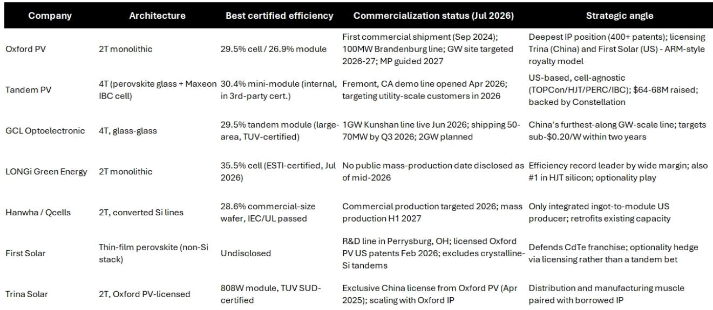
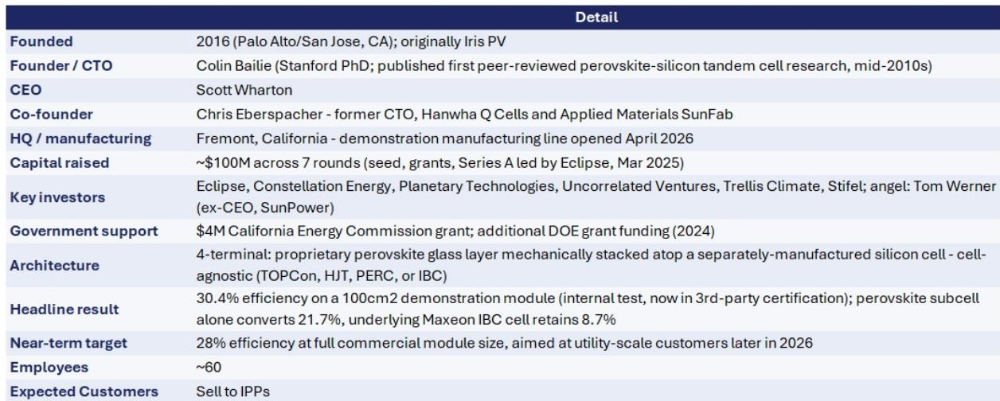

# Bernstein：美洲能源转型-钙钛矿太阳能前景

钙钛矿太阳能技术正在从实验室走向量产线，但决定其能否替代晶硅的关键不在效率纪录，而在20年以上的户外稳定性。Bernstein在最新一期美洲能源与转型研究报告中给出一个明确时间判断：商业化最可能出现在2028年前后。这份报告基于对Tandem PV CEO Scott Wharton的访谈，以及该机构对牛津光伏、隆基、协鑫光电、韩华Qcells等主要玩家的技术路线梳理。

报告认为，钙钛矿作为叠层材料与晶硅结合后，效率可超过当前市面上任何单一面板。晶硅约25%、碲化镉约20%、钙钛矿约30%——这是报告给出的粗略效率刻度。当钙钛矿以叠层方式附着在晶硅面板上时，几乎不增加重量，却能将效率提升约30%。效率提升直接摊薄土地、人工和组件数量，在土地或并网容量受限的项目中，溢价空间由此产生。

## 1. 两条技术路线分化出不同的商业化路径

两终端（2T）单片叠层与四终端（4T）机械叠层是目前两大阵营。牛津光伏、隆基和多数中国企业走2T路线，将钙钛矿直接沉积在晶硅电池上，结构简单、集成方便，但两个子电池电气耦合，制造良率不确定性集中在一个流程中。Tandem PV和协鑫光电则选择4T设计，钙钛矿层与晶硅电池保持电气独立，理论上可搭配TOPCon、HJT、PERC或IBC任意一种晶硅电池，不必锁定单一硅片技术路线。

两条路线的差异不只是工程选择。4T架构让钙钛矿可以“骑在”晶硅自身效率提升的曲线上，而不是把硅片技术冻结在某个节点。报告特别指出，Tandem PV的4T方案搭配Maxeon IBC电池，内部测试中100平方厘米演示组件效率达30.4%，其中钙钛矿子电池单独贡献21.7%，底层Maxeon电池保留8.7%。这家2016年成立、累计融资约1亿美元的美国公司，2026年4月在弗里蒙特开设了示范产线，目标是在2026年下半年向公用事业级客户交付28%效率的全尺寸组件。

> **KC评论：** 4T架构的真正价值不在效率数字本身，而在于它把钙钛矿的商业化不确定性与晶硅技术迭代解耦。读者看各家公司的效率纪录时，应该同时问一句：这条路线是否锁死了硅片选择。

## 2. 稳定性与银行可融资性是量产前的两道门槛

钙钛矿材料吸光效率高，质地柔软、易于溶液加工，制造成本理论上可逼近晶硅。但正是这种柔软的离子晶格结构，使其在潮湿、高温和自然环境下容易降解。报告用“bankability”一词概括核心难题——能否制造出持续运行20年以上的面板，是钙钛矿进入公用事业市场的先决条件。

目前主要失效模式包括光照和热诱导的离子迁移、卤化物偏析以及水分侵入。封装工程是文献中最主要的缓解路径。铅毒性是另一重约束：标准高效配方使用铅卤化物，破损或封装不当的组件可能析出铅，而锡基、锑基、铋基等无铅替代方案在效率和稳定性上仍落后。报告还提到一个常被忽视的环节：制造规模放大时的均匀性不确定性——良率问题而非化学问题，更可能是量产日期一再推迟的原因。

## 3. 主要玩家的量产时间表与策略定位

报告梳理了截至2026年7月各家公司的进展。牛津光伏拥有400多项专利，2024年9月实现首次商业出货，100MW勃兰登堡产线运行中，GW级工厂目标定在2026至2027年；其商业模式类似ARM，向天合光能（中国整理版授权）和第一太阳能（美国非整理版授权）收取专利费。隆基保持着35.5%的电池效率纪录（ESTI认证，2026年7月），但截至2026年中未公布量产日期。协鑫光电的1GW昆山产线2026年6月投产，计划2026年三季度出货50至70MW，目标两年内将成本降至每瓦0.20美元以下。韩华Qcells是相对少见从硅锭到组件一体化的美国生产商，计划2026年量产、2027年上半年大规模生产。

第一太阳能的策略值得单独看。2026年2月，它获得牛津光伏的美国非整理版专利授权，但明确排除了晶硅叠层架构。报告认为，这一授权是防御性动作，可能意味着其内部钙钛矿研发未达到管理层的商业化门槛。第一太阳能同时拥有俄亥俄州Perrysburg的研发线和2023年收购Evolar获得的技术储备，但选择用授权而非自主叠层路线来对冲。

## 4. 效率溢价最先落地的场景并非大型地面电站

报告列出几个钙钛矿可能率先商业化的场景。土地和并网容量受限的项目中，更高效率意味着每英亩和每个并网接口产生更多电力，这是最直接的溢价来源。老旧电站的改造升级是另一类机会——接近使用寿命末期的公用事业级站点，用更高效率的组件替换，可在已获批的场址内提取更多产出。航空航天、国防以及电力受限的数据中心屋顶等专业场景，可以在钙钛矿达到晶硅成本竞争力之前就消化效率溢价。

美国本土制造叙事也在其中。Tandem PV和T1 Energy都在打“非中国依赖”的国内叠层制造牌。报告认为，T1 Energy的FEOC合规、45X税收抵免资格的美国制造逻辑，与Tandem PV的美国叠层制造逻辑，本质上是在IRA/45X支持下重振资本密集型美国太阳能制造的同一策略，两者并非直接竞争，未来可能形成合作关系。

> **KC评论：** 报告对第一太阳能和T1 Energy的覆盖判断，本质上是在问一个问题：当钙钛矿按2028年时间表推进时，现有碲化镉和晶硅产能的护城河还剩多深。牛津光伏的授权模式已经给出一种答案——不自己赌，而是让所有玩家都付专利费。

报告同时指出，钙钛矿组件公司目前目标是在2027至2028年提供20年质保，但公用事业项目融资通常需要20至30年的资产寿命，而这项技术2024年9月才首次商业出货，尚不存在足够的户外运行数据。质保承诺与融资需求之间的时间差，是2028年商业化判断之外另一个需要跟踪的变量。

For informational purposes only. Portions may be generated,translated,summarized,or edited with AI assistance based on source materials and may contain omissions or errors. Please verify independently. This is not investment,legal,tax,accounting,or other professional advice.

For informational purposes only. Portions may be generated,translated,summarized,or edited with AI assistance based on source materials and may contain omissions or errors. Please verify independently. This is not investment,legal,tax,accounting,or other professional advice.

