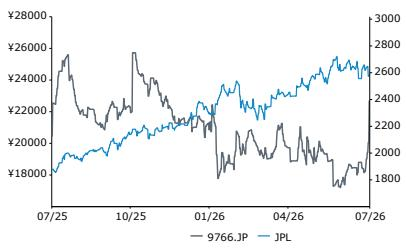
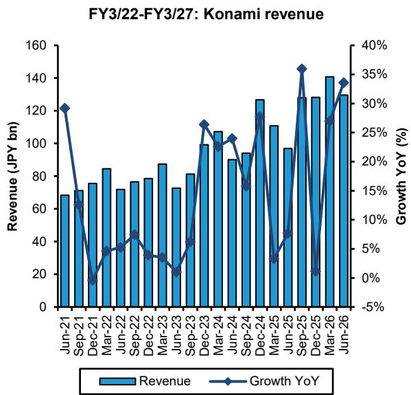
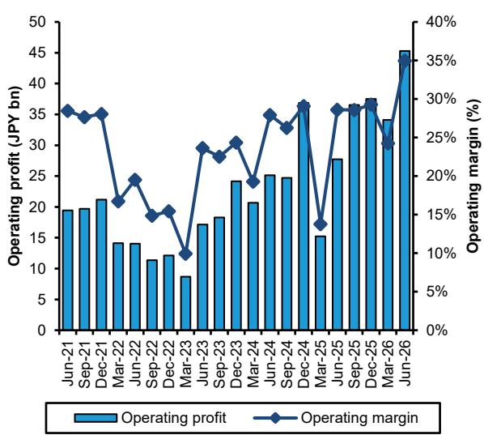
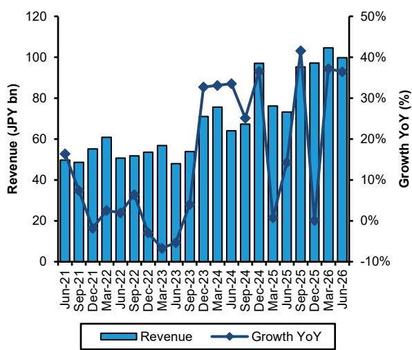
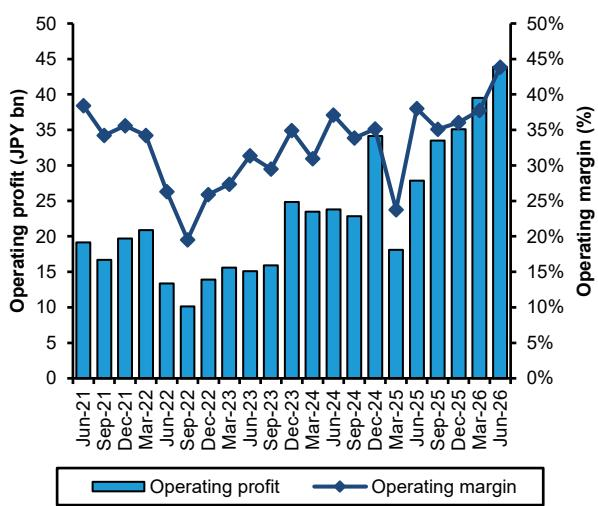
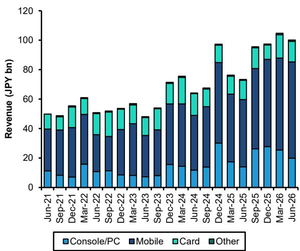
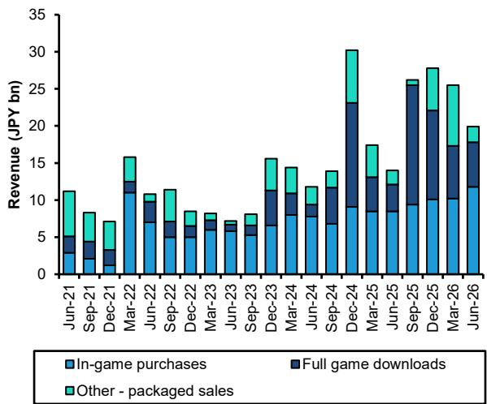

# Japan Video Gaming
## Konami Group Corporation

**评级**
跑赢大盘

**目标价**

**9766.JP**

**27,200日元（原26,800日元）**

**2026年7月31日**
**预测调整**

Robin Zhu
+852 2123 2659
robin.zhu@bernsteinsg.com

Charles Gou
+852 2123 2618
charles.gou@bernsteinsg.com

Min-Joo Kang
+852 2123 2644
minjoo.kang@bernsteinsg.com

Hyrum Caesar
+81 3 6777 6979
hyrum.caesar@bernsteinsg.com

## Konami第一季度：足球胜出，eFootball同样胜出

**超出预期。** Konami第一季度业绩表现强劲，世界杯热度带动eFootball收入同比增长约78%，高于我们此前预测的69%增长。集团收入1,300亿日元（同比增长33.6%），分别较我们和市场一致预期（1,200亿日元和1,220亿日元）高出8.0%和5.9%。营业利润453亿日元，同比增长63.3%，较我们和一致预期（373亿日元和385亿日元）分别高出21.5%和17.7%。其中，数字娱乐业务营业利润439亿日元，较我们和一致预期高出约25%。Konami其他较小业务板块当季表现平稳。

**加时赛——第二季度指引强劲。** 第一季度eFootball总收入520亿日元，其中移动端约430亿日元，主机/PC端约90亿日元。Sensor Tower数据显示7月流水较6月水平高出24%，较第二季度月均水平高出36%，管理层因此给出第二季度eFootball收入"至少持平"于第一季度的指引。随着《合金装备：大师合集Vol.2》和《寂静岭：Townfall》的发布，第二季度集团营业利润有望高于第一季度。拉长视角看，我们维持此前的判断：在eFootball用户与变现增长、移动平台费用下降以及单机游戏项目推进的驱动下，Konami将继续保持稳健增长。

**终场哨响之后的较量？** 我们预计Konami的报价会对这些业绩做出积极反应。世界杯已经结束，但管理层在分析师电话会议上表达了信心，指出eFootball市场持续增长，世界杯期间获取的用户留存良好。此前市场讨论集中在Konami可能在今年晚些时候收缩eFootball变现力度、从而进入一段平淡期。但如果假设报价基于6-9个月后的基本面进行定价，现在选择离场的参与者可能面临与1月份选择入场时类似的判断偏差。此外，当所有人都在等待回调时，回调是否还会发生？

<table><tr><td>表现</td><td>年初至今</td><td>1个月</td><td>6个月</td><td>12个月</td></tr><tr><td>相对表现（%）</td><td>2.4</td><td>23.6</td><td>(2.8)</td><td>7.3</td></tr><tr><td>JPL（%）</td><td>16.5</td><td>(1.9)</td><td>11.5</td><td>37.4</td></tr><tr><td>相对表现（%）</td><td>(14.1)</td><td>25.5</td><td>(14.3)</td><td>(30.1)</td></tr></table>

<table><tr><td>收盘日期</td><td>2026年7月30日</td></tr><tr><td>9766.JP 收盘价（日元）</td><td>21,840</td></tr><tr><td>目标价（日元）</td><td>27,200</td></tr><tr><td>上行/（下行）空间</td><td>25%</td></tr><tr><td>52周区间</td><td>26,645/16,850</td></tr><tr><td>JPL</td><td>2,570.52</td></tr><tr><td>财年截止</td><td>3月</td></tr><tr><td>股息率</td><td>1.0%</td></tr><tr><td>市值（十亿日元）</td><td>3,134.04</td></tr><tr><td>企业价值（十亿日元）</td><td>2,857.89</td></tr></table>

来源：彭博、Bernstein预测与分析。

1年价格表现

## 投资启示

我们给予Konami"跑赢大盘"评级（目标价27,200日元）。

<table><tr><td>报告每股收益</td><td>F26A</td><td>F27E</td><td>F28E</td></tr><tr><td>9766.JP（日元）</td><td>737.79</td><td>927.59</td><td>1,065.68</td></tr><tr><td>原预测</td><td>--</td><td>896.16</td><td>1,032.05</td></tr></table>

来源：彭博、Bernstein预测与分析。

<table><tr><td>财务数据</td><td>F26A</td><td>F27E</td><td>F28E</td><td>复合年增长率</td></tr><tr><td>收入（百万）</td><td>493,677</td><td>550,524</td><td>580,217</td><td>8.4%</td></tr><tr><td>毛利（百万）</td><td>243,179</td><td>281,424</td><td>301,534</td><td>--</td></tr><tr><td>营业利润（百万）</td><td>135,891</td><td>173,362</td><td>198,877</td><td>--</td></tr><tr><td>净利润（百万）</td><td>100,013</td><td>125,740</td><td>144,458</td><td>--</td></tr></table>

<table><tr><td>估值指标</td><td>F26A</td><td>F27E</td><td>F28E</td></tr><tr><td>报告市盈率（倍）</td><td>29.6</td><td>23.5</td><td>20.5</td></tr><tr><td>企业价值/销售额（倍）</td><td>5.8</td><td>5.2</td><td>4.9</td></tr><tr><td>企业价值/息税前利润（倍）</td><td>20.8</td><td>16.4</td><td>14.3</td></tr></table>

## eFootball增长78%推动第一季度超预期，第二季度指引强劲

Konami FY3/27第一季度业绩表现强劲，世界杯热度带动eFootball收入增长。集团收入1,300亿日元（同比增长33.6%），较我们预测（1,200亿日元）高出8%，较市场一致预期（1,220亿日元）高出5.9%。数字娱乐业务收入达到1,000亿日元，同比增长36.5%，较我们预测（935亿日元）和一致预期（942亿日元）分别高出7.1%和6.2%。集团营业利润453亿日元，同比增长63.3%，较我们和一致预期（373亿日元和385亿日元）分别高出21.5%和17.7%。数字娱乐业务营业利润439亿日元，较我们和一致预期（346亿日元和356亿日元）分别高出26.9%和23.3%。

细分数字业务来看，移动端收入（654亿日元，同比增长65%）高于我们的模型预测（628亿日元），主机/PC端收入（199亿日元，同比增长42.1%）同样高于预期。卡牌交易业务收入140亿日元，同比增长6.9%。本季度eFootball收入中，主机/PC端约90亿日元，移动端约430亿日元。

市场对Konami第一季度已有较强预期，但453亿日元的营业利润处于我们此前与读者交流中所听到预期区间的上沿，这应支持积极的反应。随着7月eFootball流水持续上升，管理层指出世界杯期间获取的用户留存表现突出……并给出第二季度eFootball收入"至少持平"于第一季度的指引。据此推断，Konami第二季度营业利润也有望高于第一季度。

此后，在FY3/27下半年，eFootball变现速度可能会有所放缓。公司表示，8月夏季更新将为新获取用户推出新功能。单机游戏方面，《寂静岭：Townfall》的订单据称"非常强劲"，《恶魔城：贝尔蒙特的诅咒》被描述为该系列重启计划中众多作品的第一部。

我们最新的Konami目标价反映了基于25倍FY+1市盈率倍数（此前为26倍）的更新后盈利预测。

图表1和图表2展示了Konami第一季度业绩摘要，以及与我们的预测和一致预期的对比。

**图表1：Konami FY3/27第一季度业绩摘要**

<table><tr><td rowspan="2" colspan="2">Konami FY3/27第一季度业绩</td><td rowspan="2">FY3/27第一季度 2026年6月</td><td colspan="2">差异</td><td colspan="2">同比增速</td></tr><tr><td>vs. Bernstein</td><td>vs. 一致预期</td><td>实际</td><td>一致预期</td></tr><tr><td rowspan="3">收入</td><td>实际</td><td>129,524</td><td>8.0%</td><td>5.9%</td><td>33.6%</td><td>26.2%</td></tr><tr><td>Bernstein</td><td>119,954</td><td></td><td></td><td></td><td></td></tr><tr><td>一致预期</td><td>122,334</td><td></td><td></td><td></td><td></td></tr><tr><td rowspan="3">毛利</td><td>实际</td><td>70,244</td><td>12.6%</td><td>11.3%</td><td>46.5%</td><td>31.6%</td></tr><tr><td>Bernstein</td><td>62,396</td><td></td><td></td><td></td><td></td></tr><tr><td>一致预期</td><td>63,100</td><td></td><td></td><td></td><td></td></tr><tr><td rowspan="3">毛利率</td><td>实际</td><td>54.2%</td><td>2.2%</td><td>2.7%</td><td>4.8%</td><td>2.1%</td></tr><tr><td>Bernstein</td><td>52.0%</td><td></td><td></td><td></td><td></td></tr><tr><td>一致预期</td><td>51.6%</td><td></td><td></td><td></td><td></td></tr><tr><td rowspan="3">营业利润</td><td>实际</td><td>45,285</td><td>21.5%</td><td>17.7%</td><td>63.3%</td><td>38.7%</td></tr><tr><td>Bernstein预测</td><td>37,262</td><td></td><td></td><td></td><td></td></tr><tr><td>一致预期</td><td>38,473</td><td></td><td></td><td></td><td></td></tr><tr><td rowspan="3">营业利润率</td><td>实际</td><td>35.0%</td><td>3.9%</td><td>3.5%</td><td>6.4%</td><td>2.8%</td></tr><tr><td>Bernstein预测</td><td>31.1%</td><td></td><td></td><td></td><td></td></tr><tr><td>一致预期</td><td>31.4%</td><td></td><td></td><td></td><td></td></tr><tr><td rowspan="3">净利润</td><td>实际</td><td>32,574</td><td>20.0%</td><td>15.2%</td><td>64.2%</td><td>42.6%</td></tr><tr><td>Bernstein</td><td>27,145</td><td></td><td></td><td></td><td></td></tr><tr><td>一致预期</td><td>28,280</td><td></td><td></td><td></td><td></td></tr><tr><td rowspan="3">非GAAP每股收益</td><td>实际</td><td>240.30</td><td>20.0%</td><td>17.2%</td><td>64.2%</td><td>40.1%</td></tr><tr><td>Bernstein</td><td>200.25</td><td></td><td></td><td></td><td></td></tr><tr><td>一致预期</td><td>204.98</td><td></td><td></td><td></td><td></td></tr></table>

来源：彭博、公司报告、Bernstein预测与分析。

**图表2：Konami FY3/27第一季度分部摘要**

<table><tr><td>分部收入</td><td>FY3/27第一季度 2026年6月</td><td>同比增速</td><td>Bernstein 2026年6月</td><td>差异</td><td>一致预期 2026年6月</td><td>差异</td></tr><tr><td>总收入</td><td>129,524</td><td>33.6%</td><td>119,954</td><td>8.0%</td><td>122,334</td><td>5.9%</td></tr><tr><td>数字娱乐</td><td>100,083</td><td>36.5%</td><td>93,477</td><td>7.1%</td><td>94,238</td><td>6.2%</td></tr><tr><td>娱乐设施</td><td>4,312</td><td>-5.3%</td><td>7,000</td><td>-38.4%</td><td>5,449</td><td>-20.9%</td></tr><tr><td>博彩与系统</td><td>12,388</td><td>64.9%</td><td>7,713</td><td>60.6%</td><td>9,178</td><td>35.0%</td></tr><tr><td>体育</td><td>12,712</td><td>5.2%</td><td>12,329</td><td>3.1%</td><td>12,514</td><td>1.6%</td></tr><tr><td>抵销</td><td>-649</td><td>30.6%</td><td>-565</td><td>-14.9%</td><td>-633</td><td>-2.5%</td></tr></table>

<table><tr><td>分部营业利润</td><td>FY3/27第一季度 2026年6月</td><td>同比增速</td><td>Bernstein 2026年6月</td><td>差异</td><td>一致预期 2026年6月</td><td>差异</td></tr><tr><td>总营业利润</td><td>45,285</td><td>63.3%</td><td>37,262</td><td>21.5%</td><td>38,473</td><td>17.7%</td></tr><tr><td>数字娱乐</td><td>43,870</td><td>57.4%</td><td>34,561</td><td>26.9%</td><td>35,587</td><td>23.3%</td></tr><tr><td>娱乐设施</td><td>929</td><td>69.8%</td><td>1,400</td><td>-33.6%</td><td>820</td><td>13.3%</td></tr><tr><td>博彩与系统</td><td>827</td><td>-598.2%</td><td>1,543</td><td>-46.4%</td><td>1,022</td><td>-19.1%</td></tr><tr><td>体育</td><td>764</td><td>79.3%</td><td>558</td><td>36.9%</td><td>664</td><td>15.1%</td></tr><tr><td>公司费用及抵销</td><td>-1,718</td><td>82.2%</td><td>-800</td><td>-114.8%</td><td>-1,117</td><td>-53.9%</td></tr><tr><td>营业利润率</td><td>35.0%</td><td>6.4%</td><td>31.1%</td><td>3.9%</td><td>31.4%</td><td>3.5%</td></tr><tr><td>数字娱乐</td><td>43.8%</td><td>5.8%</td><td>37.0%</td><td>6.9%</td><td>37.8%</td><td>6.1%</td></tr><tr><td>娱乐设施</td><td>21.5%</td><td>9.5%</td><td>20.0%</td><td>1.5%</td><td>15.0%</td><td>6.5%</td></tr><tr><td>博彩与系统</td><td>6.7%</td><td>8.9%</td><td>20.0%</td><td>-13.3%</td><td>11.1%</td><td>-4.5%</td></tr><tr><td>体育</td><td>6.0%</td><td>2.5%</td><td>4.5%</td><td>1.5%</td><td>5.3%</td><td>0.7%</td></tr></table>

来源：彭博、公司报告、Bernstein预测与分析。

## 更新Konami预测

我们已更新Konami的预测，以反映第一季度业绩以及公司各款游戏的最新高频数据（尤其是7月eFootball移动端流水的强劲表现）。总体而言，我们的预测较此前水平有所上调。

图表3展示了我们预测调整的摘要。

FY3/22-FY3/27：Konami营业利润
**图表3：Konami预测调整摘要**

<table><tr><td>预测调整摘要</td><td>FY3/27E</td><td>FY3/28E</td><td>FY3/29E</td></tr><tr><td colspan="4">收入（十亿日元）</td></tr><tr><td>Bernstein - 原预测</td><td>539</td><td>571</td><td>592</td></tr><tr><td>同比增速</td><td>14.0%</td><td>5.8%</td><td>3.8%</td></tr><tr><td>Bernstein - 新预测</td><td>551</td><td>580</td><td>604</td></tr><tr><td>同比增速</td><td>11.5%</td><td>5.4%</td><td>4.1%</td></tr><tr><td>一致预期</td><td>546</td><td>579</td><td>618</td></tr><tr><td>同比增速</td><td>13.8%</td><td>5.9%</td><td>6.8%</td></tr><tr><td>Bernstein新 vs. 原</td><td>2.1%</td><td>1.6%</td><td>2.0%</td></tr><tr><td>Bernstein新 vs. 一致预期</td><td>0.8%</td><td>0.3%</td><td>-2.2%</td></tr><tr><td colspan="4">营业利润（十亿日元）</td></tr><tr><td>Bernstein - 原预测</td><td>167</td><td>193</td><td>214</td></tr><tr><td>同比增速</td><td>28.6%</td><td>15.3%</td><td>11.0%</td></tr><tr><td>利润率</td><td>31.0%</td><td>33.7%</td><td>36.1%</td></tr><tr><td>Bernstein - 新预测</td><td>173</td><td>199</td><td>221</td></tr><tr><td>同比增速</td><td>27.6%</td><td>14.7%</td><td>11.4%</td></tr><tr><td>利润率</td><td>31.5%</td><td>34.3%</td><td>36.7%</td></tr><tr><td>一致预期</td><td>166</td><td>182</td><td>198</td></tr><tr><td>同比增速</td><td>25.8%</td><td>9.6%</td><td>8.6%</td></tr><tr><td>利润率</td><td>30.4%</td><td>31.5%</td><td>32.0%</td></tr><tr><td>Bernstein新 vs. 原</td><td>3.8%</td><td>3.3%</td><td>3.6%</td></tr><tr><td>Bernstein新 vs. 一致预期</td><td>4.3%</td><td>9.2%</td><td>11.9%</td></tr><tr><td colspan="4">每股收益（日元）</td></tr><tr><td>Bernstein - 原预测</td><td>896</td><td>1,032</td><td>1,145</td></tr><tr><td>同比增速</td><td>28.1%</td><td>15.2%</td><td>10.9%</td></tr><tr><td>Bernstein - 新预测</td><td>928</td><td>1,066</td><td>1,186</td></tr><tr><td>同比增速</td><td>25.7%</td><td>14.9%</td><td>11.3%</td></tr><tr><td>一致预期</td><td>885</td><td>970</td><td>1,059</td></tr><tr><td>同比增速</td><td>25.7%</td><td>9.6%</td><td>9.2%</td></tr><tr><td>Bernstein新 vs. 原</td><td>3.5%</td><td>3.3%</td><td>3.6%</td></tr><tr><td>Bernstein新 vs. 一致预期</td><td>4.8%</td><td>9.9%</td><td>12.0%</td></tr></table>

来源：彭博、公司报告、Bernstein预测与分析。

## FY3/27第一季度业绩图表

图表4至图表8展示了Konami六月季度业绩及此前各季度趋势的精选图表。

**图表4：Konami六月季度收入为1,295亿日元，同比增长33.6%**

来源：公司报告及Bernstein分析。

营业利润：

来源：公司报告及Bernstein分析。

**图表5：数字娱乐外部收入998亿日元，同比增长36.4%**
FY3/22-FY3/27：Konami数字娱乐收入

来源：公司报告及Bernstein分析。

**图表6：数字娱乐营业利润达439亿日元，对应43.8%的利润率**
FY3/22-FY3/27：Konami数字娱乐营业利润

来源：公司报告及Bernstein分析。

**图表7：移动游戏销售额达654亿日元，占数字娱乐总收入的65.3%**

FY3/22-FY3/27：Konami数字娱乐收入按平台划分

来源：公司报告及Bernstein分析。

**图表8：游戏内购收入达118亿日元，同比增长38.8%**
FY3/22-FY3/27：Konami主机/PC收入按产品类型划分

来源：公司报告及Bernstein分析。

## 附录——财务预测

## 图表9：Konami利润表

<table><tr><td>百万日元</td><td>FY3/23</td><td>FY3/24</td><td>FY3/25</td><td>FY3/26</td><td>FY3/27E</td><td>FY3/28E</td><td>FY3/29E</td></tr><tr><td>净销售额</td><td>314,321</td><td>360,314</td><td>421,602</td><td>493,677</td><td>550,524</td><td>580,217</td><td>604,192</td></tr><tr><td>销售成本</td><td>-191,930</td><td>-200,277</td><td>-222,681</td><td>-250,498</td><td>-269,100</td><td>-278,683</td><td>-284,876</td></tr><tr><td>毛利</td><td>122,391</td><td>160,037</td><td>198,921</td><td>243,179</td><td>281,424</td><td>301,534</td><td>319,316</td></tr><tr><td>销售、一般及管理费用</td><td>76,206</td><td>79,775</td><td>96,977</td><td>107,288</td><td>108,062</td><td>102,657</td><td>97,839</td></tr><tr><td>营业利润</td><td>46,185</td><td>80,262</td><td>101,944</td><td>135,891</td><td>173,362</td><td>198,877</td><td>221,477</td></tr><tr><td>税前利润</td><td>47,120</td><td>82,685</td><td>104,008</td><td>140,667</td><td>175,850</td><td>200,637</td><td>223,237</td></tr><tr><td>所得税合计</td><td>12,225</td><td>23,513</td><td>29,316</td><td>40,654</td><td>50,110</td><td>56,178</td><td>62,506</td></tr><tr><td>税后利润</td><td>34,895</td><td>59,172</td><td>74,692</td><td>100,013</td><td>125,740</td><td>144,458</td><td>160,730</td></tr><tr><td>归属于股东的利润</td><td>34,895</td><td>59,171</td><td>74,692</td><td>100,013</td><td>125,740</td><td>144,458</td><td>160,730</td></tr><tr><td>每股收益</td><td>257.48</td><td>436.50</td><td>551.00</td><td>737.79</td><td>927.59</td><td>1,065.68</td><td>1,185.72</td></tr></table>

来源：公司报告、Bernstein预测与分析。

## 图表10：Konami现金流量表

<table><tr><td>百万日元</td><td>FY3/23</td><td>FY3/24</td><td>FY3/25</td><td>FY3/26</td><td>FY3/27E</td><td>FY3/28E</td><td>FY3/29E</td></tr><tr><td>税前净利润</td><td>34,895</td><td>59,172</td><td>74,692</td><td>100,013</td><td>125,740</td><td>144,458</td><td>160,730</td></tr><tr><td>折旧与摊销</td><td>23,845</td><td>23,267</td><td>28,488</td><td>34,190</td><td>30,370</td><td>32,767</td><td>35,198</td></tr><tr><td>利息收入/支出，净额</td><td>15,735</td><td>26,574</td><td>28,242</td><td>38,647</td><td>47,622</td><td>54,418</td><td>60,746</td></tr><tr><td>营运资本变动净额</td><td>-12,389</td><td>1,038</td><td>-207</td><td>-9,893</td><td>6,161</td><td>2,301</td><td>1,481</td></tr><tr><td>其他</td><td>-25,988</td><td>-6,990</td><td>-16,595</td><td>-27,293</td><td>-48,162</td><td>-54,818</td><td>-61,146</td></tr><tr><td>经营活动产生的净现金</td><td>36,098</td><td>103,061</td><td>114,620</td><td>135,664</td><td>161,731</td><td>179,126</td><td>197,010</td></tr><tr><td>资本支出</td><td>-43,779</td><td>-29,316</td><td>-66,862</td><td>-55,680</td><td>-49,547</td><td>-52,220</td><td>-54,377</td></tr><tr><td>无形资产支付</td><td>-98</td><td>-192</td><td>-1,288</td><td>-461</td><td>0</td><td>0</td><td>0</td></tr><tr><td>其他</td><td>1,091</td><td>292</td><td>265</td><td>818</td><td>0</td><td>0</td><td>0</td></tr><tr><td>投资活动产生的净现金</td><td>-42,786</td><td>-29,216</td><td>-67,885</td><td>-55,323</td><td>-49,547</td><td>-52,220</td><td>-54,377</td></tr><tr><td>融资活动产生的净现金</td><td>-27,467</td><td>-24,199</td><td>-25,784</td><td>-51,897</td><td>-37,722</td><td>-43,338</td><td>-48,219</td></tr><tr><td>汇率变动影响</td><td>2,707</td><td>4,838</td><td>-482</td><td>4,904</td><td>0</td><td>0</td><td>0</td></tr><tr><td>现金及等价物净变动</td><td>-31,448</td><td>54,484</td><td>20,469</td><td>33,348</td><td>74,462</td><td>83,569</td><td>94,413</td></tr><tr><td>期初现金及等价物</td><td>250,711</td><td>219,263</td><td>273,747</td><td>294,216</td><td>327,564</td><td>402,026</td><td>485,594</td></tr><tr><td>期末现金及等价物</td><td>219,263</td><td>273,747</td><td>294,216</td><td>327,564</td><td>402,026</td><td>485,594</td><td>580,008</td></tr><tr><td>自由现金流</td><td>-7,779</td><td>73,553</td><td>46,470</td><td>79,523</td><td>112,184</td><td>126,906</td><td>142,633</td></tr></table>

来源：公司报告、Bernstein
