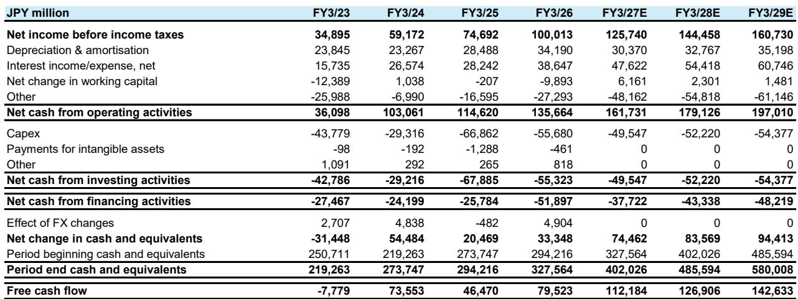
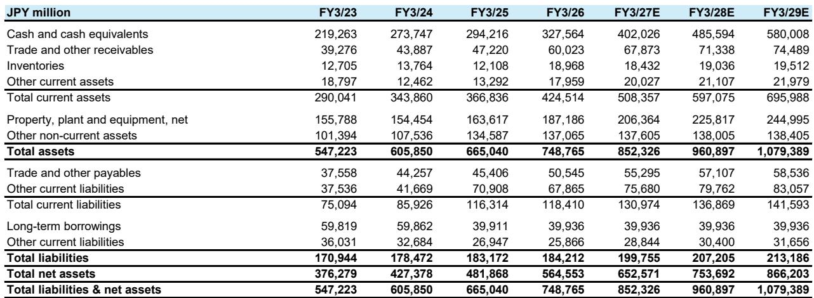
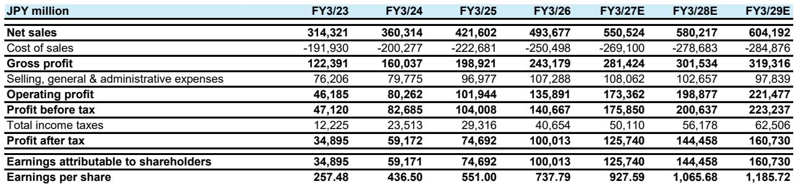

# Konami的季度表现超出预期，但真正的考验在于能否持续保持势头

Konami集团截至2026年6月的财年第一季度实现集团收入1300亿日元，同比增长33.6%，营业利润453亿日元，同比增长63.3%。整体数字在收入上超出市场预期约6%，营业利润超出约18%，但更关键的信息藏在数字娱乐板块内部：eFootball收入同比增长约78%，其中移动端贡献了520亿日元总额中的430亿日元。一份覆盖该公司的全球研究报告指出……

市场对这一业绩的反应，比数字本身更能说明该公司的当前定位。Konami股价年初至今跑输JPL指数14.1%，过去十二个月跑输30.1%，尽管公司基本面动能强劲。这种经营表现与股价走势之间的背离，是当前Konami研究案例中的核心张力。本季度的业绩表明，围绕“世界杯后商业化放缓”的看空逻辑为时过早，市场将一次暂时性的参与周期误判为结构性的增长问题。

这并非一个关于单季度超预期的故事，而是一个关于Konami能否将周期性的参与高峰转化为玩家基础和商业化天花板的永久性扩张的故事。第一季度业绩和管理层对第二季度的指引表明这一转化是可能的，但财年下半段将检验这一判断。

## 世界杯带来了参与度，商业化数据显示用户正在留存

第一季度业绩由eFootball的世界杯参与度驱动，但增长的结构比总量更重要。移动端收入达到654亿日元，同比增长65%，超出分析师模型预期的628亿日元。主机和PC端收入增加199亿日元，同比增长42.1%。数字娱乐板块的营业利润贡献为439亿日元，对应43.8%的板块利润率——这一水平在十二个月前作为预测来看会显得过于激进。

关键的领先指标是7月的流水数据。报告中引用的Sensor Tower数据显示，7月eFootball流水比6月水平高出24%，比第二季度月均水平高出36%。这不是一个赛事后下滑的轨迹。管理层指引eFootball收入在第二季度环比“至少持平”，考虑到第一季度的基数，这一保守表述仍然意味着一个非常强劲的季度。报告作者指出，管理层提到了世界杯期间获取用户的“卓越留存率”，7月数据支持了这一说法。

研究层面的含义很直接：市场一直将Konami视为世界杯后会逐渐降温的公司，但高频数据指向相反方向。历史上，大型赛事期间的用户获取一直是体育类游戏的主要增长杠杆，而留存数据表明这一周期正在将临时用户转化为长期玩家。第二季度指引加上7月流水数据，使得eFootball收入在短期内出现环比下滑的可能性较低。

## 下半年的放缓风险确实存在，但市场已将其定价为确定性

本季度之前围绕Konami的共识讨论集中在财年下半年可能出现的平淡期，届时公司可能会减少eFootball的商业化力度。管理层承认在FY3/27的下半年可能会出现一段商业化节奏放缓的时期，并提到了8月夏季更新中为新获取用户准备的新功能。这是一个有意的产品策略，而非需求问题。

这一区分对市场定价很重要。如果下半年的放缓是供给端的决策——公司选择优化长期玩家留存而非短期收入提取——那么市场对该公司的估值下调是对商业模式的误解。如果放缓反映的是需求枯竭，那么看空逻辑就有道理。第一季度和7月的证据表明前一种解读是正确的。

该研究报告对市场时机提出了一个尖锐的观察：如果股价提前六到九个月反映基本面，那么现在卖出Konami的读者可能正在犯与1月买入者相同的错误。1月的买入是世界杯预期交易，在赛事收入贡献尚未实现时受到了惩罚。当前的估值回调——如果真的发生——将是一次忽略留存数据的事件后降级。市场的模式识别正在对公司不利，但基本面讲述的是另一个故事。

## 结构性增长驱动因素超越世界杯周期

世界杯是一个催化剂，而非核心逻辑。该报告识别了三个支持持续增长的结构性驱动因素：eFootball用户和商业化增长、移动平台费用降低、以及单机游戏进展。这三个因素需要分别考虑，因为它们处于不同的时间维度，具有不同的利润率影响。

移动平台费用降低对利润率扩张尤为重要。数字娱乐板块营业利润率在第一季度达到43.8%，同比提升5.8个百分点。其中一部分改善来自收入激增带来的经营杠杆，但平台费用变化是一个多年期的顺风因素，市场尚未完全纳入定价。随着主要市场对应用商店费用的监管压力持续，Konami以移动端为主的收入结构正成为利润率优势，而非分发约束。

单机游戏管线增加了第二个增长向量。《寂静岭：小镇归来》的订单被描述为“非常强劲”，《恶魔城：贝尔蒙特的诅咒》被定位为该系列重启中的首款作品。《合金装备：大师合集第二卷》将在第二季度发布。这些作品并非主要盈利驱动因素，但它们使收入基础多元化，不再过度依赖eFootball，并为体育类游戏的周期性提供了对冲。市场历来将Konami视为单一游戏公司，单机游戏的进展是一个缓慢但真实的估值扩张论据。

## 盈利预测修正显示盈利能力的实际所在

分析师的盈利预测修正具有说明性，因为它们显示盈利能力集中在数字板块，且营业利润的修正幅度大于收入的修正幅度。FY3/27营业利润预测上调3.8%至1730亿日元（此前为1670亿日元），而收入预测仅上调2.1%至5510亿日元（此前为5390亿日元）。利润率扩张的故事承担了主要推动力。

FY3/28和FY3/29的修正遵循同样的模式。营业利润预测分别上调3.3%和3.6%，而收入预测分别上调1.6%和2.0%。分析师现在预测FY3/29营业利润率为36.7%，高于此前模型中的36.1%。对于一家在FY3/24时营业利润率还低于30%的公司来说，这是一个有意义的利润率轨迹。

分析师预测与共识之间的差距随时间扩大。对于FY3/28，分析师的营业利润预测为1990亿日元，比共识的1820亿日元高出9.2%。到FY3/29，差距达到11.9%。这不是一个季度性的超预期，而是对公司盈利能力的基本面分歧。市场对Konami的定价仿佛世界杯是一次性事件，而分析师建模的是一个盈利能力的结构性跃升。

## 评估事件驱动型游戏公司定位的决策框架

Konami的案例为评估游戏行业事件驱动型增长提供了一个可迁移的框架。第一个检验是事件后的参与数据支持留存还是衰减。在Konami的案例中，7月流水比6月水平高出24%，这是区分结构性拐点与暂时性高峰的高频证据。在断定一个事件驱动型季度是一次性事件之前，应当要求看到这类数据。

第二个检验是公司自身的指引传达的是信心还是谨慎。管理层对eFootball收入的“至少持平”环比指引，加上7月数据，是一个市场权重不足的信心信号。当管理层指引与第三方数据一致时，负面意外的概率会大幅下降。

第三个检验是利润率扩张是周期性的还是结构性的。Konami数字娱乐板块43.8%的利润率既反映了收入经营杠杆，也反映了平台费用顺风。平台费用降低是永久的成本改善，而非季度性现象。在评估利润率扩张是否可持续时，应将这两个组成部分分开考量。

最后一个检验也是最难的：市场的估值下调反映的是对前瞻基本面的理性评估，还是在可见好消息出现后的行为性卖出模式。Konami年初至今的相对跑输，尽管基本面动能强劲，指向后者。按分析师FY3/27预测计算，该股远期市盈率为23.5倍，对于一家营业利润增长27.6%、利润率持续扩张且拥有平台费用降低这一结构性顺风的公司来说，这一估值并不算高。

这一框架面临的风险是下半年的商业化回调。如果8月更新未能吸引新获取的用户，且第三和第四季度eFootball收入下降幅度超过分析师模型的预期，那么FY3/28的预测将被证明过高。但目前的证据——7月流水、管理层指引和单机游戏管线——并不支持这一看空逻辑。市场正在要求读者为一个数据尚未显示的放缓买单，而不对称性有利于看多方向。

该报告的最后一点观察值得强调：当所有人都在排队等待回调时，股价会回调吗？围绕Konami下半年放缓的共识叙事已被广泛接受，以至于可能已经反映在股价中。第一季度业绩和第二季度指引挑战了这一叙事，7月数据进一步削弱了它。Konami的经营表现一直持续超出预期，而市场不愿奖励这种表现，这反而创造了机会。

*仅供参考。部分内容可能基于原始材料由AI辅助生成、翻译、总结或编辑，可能存在遗漏或错误。请独立核实。本文不构成投资、法律、税务、会计或其他专业建议。*
