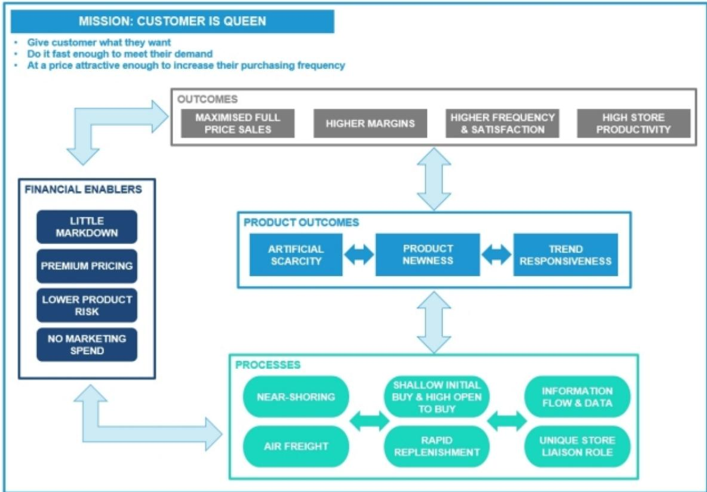
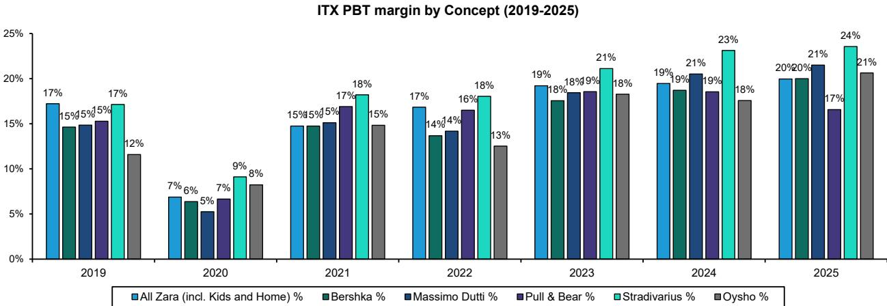
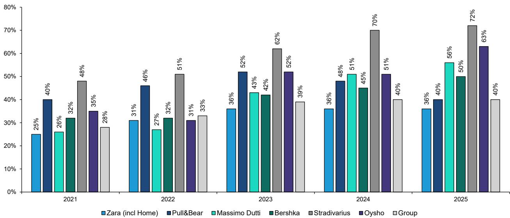

# 双冠之道：Zara的变革之道与优衣库的恒常之道——全球服装业仅有的两种结构性赢家

过去二十年，全球服装行业见证了无数品牌的兴衰——那些将季节性潮流误认为持久战略的企业，大多已湮没无闻。然而，在一片更迭之中，两家零售商却实现了长期稳健的增长，年复合回报表现显著优于其所在市场的整体水平。Inditex（Zara母公司）与迅销集团（优衣库母公司），不仅成功应对了电商崛起、消费转向性价比以及品味碎片化的挑战，更定义了现代服装零售业仅有的两种成功架构——而它们是通过解决截然相反的问题来实现这一点的。

常规的认知框架将这两家公司视为类似的高质量复利型企业，认为它们在运营卓越性和估值水平上具有可比性。这种框架忽略了更深层的战略差异。Inditex与迅销并非同一成功故事的两个版本，而是互为镜像，各自建立在与时尚本身截然不同的关系之上。Inditex是一只变色龙，对风格不持立场，在市场的流变中不断模仿与自我调整；迅销则是一家工业基础设施提供商，销售的是恒常、功能与重复。一个从变化中获利，另一个从稳定中获利。

数据揭示了表面共同优异表现之下的分化。Inditex的毛利率为58%，迅销为54%；息税前利润率分别为20%与17%；投入资本回报率约为50%与42%。市场已注意到这种差异，给予Inditex约20-25倍的远期估值，而迅销自2013年以来一直维持约35倍的水平。这些并非随机的估值差距，而是反映了两种截然不同的经济引擎，各自拥有独特的增长轨迹、利润结构和扩张空间。

这一问题在当前尤为重要，因为服装市场已进入结构性波动时期。消费者行为正在分化为对新鲜感的追逐与对可靠性的需求。宏观环境的变化压缩了 discretionary spending，而数字化供应链工具则降低了速度与规模的成本。在这种环境下，时尚零售的中间地带——那些试图既有点潮流又有点功能的品牌——正被两端同时挤压。对于观察者而言，问题不再是哪家服装公司会胜出，而是哪种成功模式将更具持久性，以及两者能否继续实现复利增长。

## Inditex的近岸供应链飞轮：将时尚波动转化为结构性增长优势，而非需要管理的风险

对Zara成功的常规解读聚焦于其速度——从T台到门店只需数周而非数月的能力。但速度本身并不能解释一个在过去14年中有13年以约11%的恒定汇率增长（市场平均增长率为2%）超越其加权市场的模式。真正的洞察在于，Inditex构建了一个自我强化的系统，在这个系统中，波动本身成为增长的原材料。

这个飞轮通过一系列特定机制运转。集中于西班牙、葡萄牙和摩洛哥的近岸供应链允许浅度初始采购。门店下达小批量订单，并根据实时销售数据快速补货。由于公司对时尚不持立场，它不会在趋势出现之前就做出承诺。相反，它观察什么在热卖，然后在数天内向渠道投放更多同类产品。这自然对冲了降价风险，因为公司从不持有大量可能滞销的库存。无降价策略加上大众市场的优质定价，使得Inditex即使在潮流模仿模式的高周转运营下，仍能维持58%的毛利率。

战略上的结果是，Inditex不需要预测未来，它只需要比其他人反应更快。在一个消费者品味在社交媒体平台上碎片化、微趋势在数周内兴起又消亡的世界里，反应能力比预测能力更有价值。竞争对手曾试图复制这一模式，但这个飞轮建立在50年积累的门店数据、供应商关系和物流基础设施之上，这些无法被购买或快速组装。护城河不在于任何单一能力，而在于所有能力之间的复利式互动。

第二个层面的含义是，Inditex的增长比服装业历史所暗示的周期性更弱。由于该模式围绕对需求的快速响应而非季节性预测而设计，它在结构上更少暴露于通常在低迷时期打击时尚零售商的库存减记风险。在当前宏观环境下，这种稳定性本身就是估值支撑的来源，使其在更广泛的零售板块折价交易时，仍能维持约23倍的远期估值。

## 迅销的极度精简SKU架构：通过消除时尚素养这一消费门槛来扩大可及市场

优衣库在任何实质意义上都不与Zara竞争。它竞争的是“时尚作为服装购买决策驱动因素”这一整个概念。该公司运营不到1,000个核心SKU，而Inditex超过10,000个，并且它有意识地季复一季地重复这些单品，只做渐进式改进。HEATTECH和AIRism不是产品，而是平台——为功能而工程化，作为技术而非风格来营销。

这种方法的力量在于其可及市场。时尚零售，按定义，要求消费者参与一个新鲜感循环。顾客必须关心什么是新的、什么是流行的、什么向他人传递他们的身份信号。这将总可及市场限制在愿意将时尚作为一种语言来参与的消费者范围内。优衣库的模式完全消除了这一要求。顾客不需要理解时尚、追随潮流或做出审美判断。他们只需要认识到一件衣服保暖、舒适、耐用且价格合理。这是一个本质上更大的人群。

财务证据支持这一机会的规模。迅销在过去14年中有12年超越其加权市场，以约10%的恒定汇率增长（市场增长率为3%）。该公司在实现这一增长的同时，维持54%的毛利率——仅比Inditex低4个百分点——尽管售价显著更低。利润率差距通过运营纪律、降低单位成本的长期供应商关系以及行业最高的单SKU销售效率来弥合。

约35倍远期估值的溢价反映了市场对这一模式比时尚零售拥有更长结构性跑道的认可。由于优衣库不依赖消费者的时尚感知，其门店空白空间不受时尚意识人群规模的限制。它可以扩展到Zara无法触及的地理区域和人口群体，且无需承担文化失误的风险。该公司常被描述为服装业的丰田，这个类比是精确的。丰田不是为汽车爱好者造了一辆更好的车，而是为所有人造了一辆车，并在此过程中重新定义了市场。

## 两种模式之间的利润率与ROIC差距正在缩小，但它反映的是战略取舍而非运营缺陷

对财务比较的表面解读会得出结论：Inditex就是更好的生意。它有更高的毛利率、更高的息税前利润率和更高的ROIC。但这忽略了这两家公司在追求不同的风险-回报特征，利润率差距是迅销更广泛市场覆盖的代价。

Inditex 58%的毛利率是其大众优质定价和无降价模式的函数。公司可以收取更高价格，因为它为消费者提供了潮流相关性的价值——穿着某种感觉“当下”的东西的能力。这是一种支持更高价格但也将市场规模限制在关心潮流相关性的消费者范围内的价值主张。迅销54%的毛利率，在显著更低的价格点上实现，表明该公司正在一个每单位价值更低的市场中占据更大份额。4个百分点的利润率差距不是低效，而是服务Zara模式无法触及人群的成本。

ROIC差距（50%对42%）同样可以通过资本密度而非运营质量来解释。Inditex的近岸模式需要更少的单店库存，并且更快地周转库存，这减少了产生给定销售水平所需的营运资本。迅销更长的生产周期以及保持核心SKU库存的承诺，需要每单位销售更多的库存。两家公司都产生了数倍于资本成本的回报，并且都展示了以有吸引力的利率再投资这些回报的能力。差距是真实的，但它是商业模式的函数，而非对管理质量的评判。

趋同的故事比差距本身更有趣。随着迅销在国际上扩展其门店基础，特别是在东南亚、印度和北美，其单SKU销售经济性应该会改善，缩小ROIC差距。随着Inditex扩展其线上渠道并将数字数据更深入地整合到供应链中，它可能会找到将其模式扩展到以前需要时尚素养消费者的品类和地理区域的方法。两家公司都在向一个中间地带移动——不是在产品策略上，而是在运营效率上。

## 观察框架：Inditex与迅销之间的选择，是对哪种消费需求形态将更具持久性的判断

对于观察者而言，这两家公司之间的比较不是一个孰优孰劣的问题，而是哪种消费行为形态将在未来十年占据主导的问题。这两家公司代表了关于服装需求未来的两种不同论点，组合决策应相应构建。

Inditex的论点是，媒体碎片化和趋势周期加速将继续。如果消费者越来越多地通过社交平台发现新风格，如果趋势的半衰期继续缩短，如果对新鲜感的渴望仍然是服装购买的主要驱动力，那么Inditex的模式具有结构性优势。该公司是相对少见拥有从超波动中获利的基础设施的零售商。其风险在于消费者偏好转向耐用性和可持续性，减少追逐潮流的吸引力，并增加高周转生产的监管和声誉成本。

迅销的论点是，全球中产阶级，特别是亚洲的中产阶级，将优先考虑功能和价值而非新鲜感。如果新兴市场的消费者将服装视为实用品而非身份信号，如果对可靠基础款的需求以可及价格增长快于对潮流相关时尚的需求，那么迅销的模式拥有更大的跑道。其风险在于成为自身成功的受害者，因为其SKU集中的规模使其容易受到能以更低价格提供类似功能的竞争对手的干扰，或消费者偏好转向更具表达性、时尚驱动的购买行为。

组合层面的含义是，这两家公司不是替代品。它们是对两种不同消费需求形态的互补性敞口。认为未来是波动且趋势驱动的观察者应倾向于Inditex；认为未来是理性且价值驱动的观察者应倾向于迅销；认为两种动态将共存——这是最合理的情景——的观察者应两者兼顾。市场已为两家公司的持续优异表现定价，但估值差距（35倍对23倍）表明市场目前为迅销论点分配了更高的概率。这个差距是一个判断问题，而非事实。

## 两种模式都有很长的复利跑道，但拐点将来自地理扩张而非本土市场份额增长

对两家公司而言，最重要的战略问题不是它们的模式是否有效，而是它们还能在哪里应用。两者都已在各自本土市场取得主导地位，并都展示了以显著幅度超越本土市场增长的能力。下一个十年的复利增长将由国际扩张决定，而两家公司面临截然不同的地理机会。

Inditex的国际足迹已经广泛，但其增长日益集中于较高消费能力的客群。公司对这一人群的敞口在当前宏观环境下一直是顺风，因为大众优质定价与那些从奢侈品降级但仍想要品质和潮流相关性的消费者产生共鸣。风险在于这一人群是有限的，且Inditex依赖时尚素养的模式在向时尚意识人群占总人口比例较小的市场扩张时，将面临回报递减。

迅销的空白空间在结构上更大。由于其模式不需要时尚素养，它可以扩展到Inditex无法触及的市场和人群。公司的增长轨迹反映了这一更广泛的机会。关键的考验将是北美和印度，该公司在这两个市场历史上一直难以建立其在亚洲享有的品牌认知度。如果迅销能够攻克这些市场，估值溢价将被证明是合理的；如果不能，估值将向Inditex的水平压缩。

因此，观察框架不是一个对当前财务数据的静态比较，而是一个对哪家公司有更多空间将其模式应用于新地理区域和新消费群体的动态评估。在这个维度上，迅销具有结构性优势。但这一优势已反映在估值差距中，执行风险相应更高。Inditex提供更低的估值、经过验证的模式和更可预测的增长轨迹，但最终上限较小。两者之间的选择是在确定性与期权性之间的选择，正确答案取决于观察者的时间跨度和风险承受能力。

*仅供参考。部分内容可能基于原始材料由AI辅助生成、翻译、摘要或编辑，可能包含遗漏或错误。请独立核实。本文不构成任何专业建议。*

仅供参考。部分内容可能基于原始材料由AI辅助生成、翻译、摘要或编辑，可能包含遗漏或错误。请独立核实。本文不构成任何专业建议。

