# 亚太食品饮料行业研究

## 东鹏饮料集团股份有限公司

**评级：** 与市场同步

**目标价：** 605499.CH 133.00元人民币（原142.00）；9980.HK 131.00港元（原138.00）

**目标价调整**

**研究分析师：**
- Euan McLeish +81 3 5962 9611 euan.mcleish@bernsteinsg.com
- Hao Wang, CFA +852 2123 2627 hao.wang@bernsteinsg.com
- Mufei Gao +81 3 6777 6995 mufei.gao@bernsteinsg.com
- Makoto Morozumi +81 3 6777 6972 makoto.morozumi@bernsteinsg.com

## 东鹏饮料二季度：能量饮料增长放缓

东鹏饮料昨日公布二季度业绩，营收同比增长11%，为上市以来最低增速，低于市场预期约5-7个百分点。营业利润同比增长14%，略好于预期，成本控制优于预期使利润率提升约400个基点。净利润同比增长15%，较我们及市场一致预期低约5%。

能量饮料收入增长是本次业绩中最值得关注的方面——从此前较为稳定的两位数增速降至二季度的1%。管理层指出市场竞争加剧是主要影响因素。为应对这一情况，公司宣布了H股10%的回购计划（尽管数月前刚在港上市且流通盘较小），并将中期分红率从55%提升至76%，同时设定2028年前最低80%的分红比例。

从业务结构看，能量饮料占二季度收入的69%。电解质饮料增速从一季度的13%小幅放缓至二季度的11%。其他饮料板块仍保持较快增长，同比增速97%（一季度为120%），主要由即饮茶产品驱动，上半年该品类增长两倍，但基数较低。展望三季度，我们预计能量饮料收入增速有望回升，但利润率提升空间可能部分被世界杯相关营销投入所抵消。

管理层在业绩会上重申了打造"软饮料平台公司"的战略方向。我们认为，考虑到非能量饮料业务的毛利率较能量饮料低16-35个百分点（2025财年），且这些业务尚未形成规模效应，该战略中期内可能对整体利润率形成一定摊薄。积极的一面是，管理层关注低糖/无糖健康趋势下的产品创新，这一方向值得肯定。

## 投资要点

我们维持"与市场同步"评级，将目标价下调至A股133元人民币/H股131港元，反映二季度业绩及我们对2026-2028财年每股收益预测的下调（分别下调4%/6%/6%）。估值倍数维持不变：A股15.7倍远期市盈率，H股13.3倍。

**调整后每股收益**

|  | F25A | F26E | F27E |
|---|---|---|---|
| 605499.CH（人民币） | 8.49 | 7.06 | 7.85 |
| 原预测 | -- | 7.37 | 8.34 |
| 9980.HK（人民币） | 8.49 | 7.06 | 7.85 |
| 原预测 | -- | 7.37 | 8.34 |

**主要财务数据**

|  | F25A | F26E | F27E | 复合年增长率 |
|---|---|---|---|---|
| 净利润（百万元） | 4,415 | 5,128 | 5,672 | 13.3% |
| 净债务/EBITDA（倍） | (1.27) | (2.45) | (2.56) | 42.3% |

**市场数据**

| 项目 | 数据 |
|---|---|
| 数据截止日 | 2026年7月30日 |
| 605499.CH收盘价（人民币） | 138.20 |
| 目标价（人民币） | 133.00 |
| 上行/下行空间 | (4)% |
| 52周区间 | 243.83/108.80 |
| ASIAX指数 | 1,808.17 |
| 财年截止 | 12月 |
| 股息率 | 2.8% |
| 市值（百万元人民币） | 99,636 |
| 企业价值（百万元人民币） | 84,988 |

**市场表现**

|  | 年初至今 | 1个月 | 6个月 | 12个月 |
|---|---|---|---|---|
| 相对表现（%） | (32.8) | 12.0 | (28.2) | (36.1) |
| ASIAX指数（%） | 10.6 | (9.0) | 3.5 | 24.1 |
| 相对表现（%） | (43.4) | 21.0 | (31.7) | (60.2) |

数据来源：Bloomberg、Bernstein预测与分析

**一年市场表现**

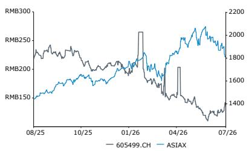

**估值指标**

|  | F25A | F26E | F27E |
|---|---|---|---|
| 调整后市盈率（倍） | 16.3 | 19.6 | 17.6 |
| 股息率（%） | 3.8 | 4.1 | 4.5 |
| EV/EBIT（倍） | 16.6 | 14.3 | 12.8 |
| EV/EBITDA（倍） | 15.2 | 13.1 | 11.6 |
| 调整后PEG（倍） | 0.5 | (1.2) | 1.6 |
| 报告PEG（倍） | 0.5 | (1.2) | 1.6 |
| 报告市盈率（倍） | 16.3 | 19.6 | 17.6 |

## 详细分析

**图表1：东鹏饮料2026年二季度业绩摘要**

| （除特别注明外，单位：百万元人民币） | FY25Q2 | FY26Q2 | 同比%/基点 | Bernstein预测 | 差异 |
|---|---|---|---|---|---|
| 营业收入 | 5,889 | 6,555 | 11.3% | 7,339 | -10.7% |
| 营业成本 | (3,197) | (3,298) | 3.1% | (3,962) | -16.8% |
| 毛利 | 2,691 | 3,257 | 21.0% | 3,377 | -3.6% |
| 毛利率 | 45.7% | 49.7% | 399 | 46.0% | 367 |
| 销售费用 | (873) | (1,126) | 29.0% | (1,124) | |
| 占收入比 | -14.8% | -17.2% | (236) | -15.3% | |
| 税费及其他 | (63) | (73) | 16.6% | (78) | |
| 管理费用及研发 | (154) | (226) | 46.1% | (185) | 21.8% |
| 营业利润 | 1,602 | 1,832 | 14.4% | 1,989 | -7.9% |
| 营业利润率 | 27.2% | 28.0% | 75 | 27.1% | 84 |
| 其他收入 | 46 | (83) | -280.8% | 46 | -280.8% |
| 净财务收入 | 36 | 21 | | 36 | |
| 其他 | 85 | 285 | 236.4% | 85 | 236.4% |
| 税前利润 | 1,768 | 2,055 | 16.2% | 2,156 | -4.7% |
| 所得税费用 | (374) | (444) | 18.9% | (456) | -2.5% |
| 实际税率 | 21.1% | 21.6% | 49 | 21.1% | 49 |
| 税后利润 | 1,395 | 1,610 | 15.5% | 1,700 | -5.3% |
| 净利润 | 1,395 | 1,609 | 15.4% | 1,701 | -5.4% |
| 净利率 | 23.7% | 24.6% | 87 | 23.2% | 138 |
| 每股收益（人民币） | 2.68 | 2.19 | -18.3% | 2.32 | -5.7% |

数据来源：S&P Capital IQ、公司公告、Bernstein分析与预测

**图表2：我们已将2026财年预测下调5%，2027-28财年下调7%**

东鹏饮料收入及营业利润预测（十亿元人民币）

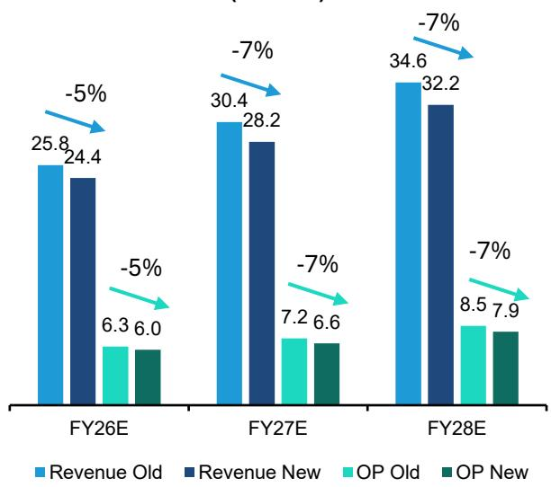

数据来源：Bernstein分析与预测

**图表3：收入预测下调涉及能量饮料和电解质饮料两大板块**

东鹏饮料分板块收入（十亿元人民币）

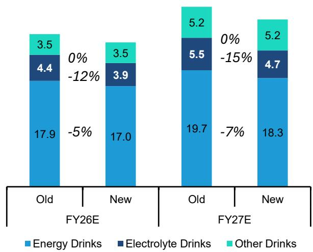

数据来源：Bernstein分析与预测

**图表4：东鹏饮料2026年二季度分板块摘要**

| （除特别注明外，单位：百万元人民币） | FY25Q2 | FY26Q2 | 同比%/基点 | Bernstein预测 | 差异 |
|---|---|---|---|---|---|
| 分板块总收入 | 5,889 | 6,555 | 11.3% | 7,339 | -10.7% |
| 能量饮料 | 4,460 | 4,525 | 1.4% | 5,129 | -11.8% |
| 电解质饮料 | 923 | 1,026 | 11.2% | 1,200 | -14.4% |
| 其他饮料 | 503 | 991 | 97.3% | 1,005 | -1.3% |
| 其他收入 | 3 | 12 | 285.2% | 5 | 140.7% |
| **分渠道饮料收入** | **5,885** | **6,543** | **11.2%** | | |
| 经销 | 5,067 | 5,405 | 6.7% | | |
| KA | 632 | 793 | 25.5% | | |
| 线上 | 186 | 344 | 84.3% | | |
| 其他渠道 | 0 | 1 | 193.6% | | |
| **分区域饮料收入** | **5,885** | **6,543** | **11.2%** | | |
| 南方 | 1,720 | 1,769 | 2.8% | | |
| 中部 | 1,201 | 1,478 | 23.0% | | |
| 东部 | 1,053 | 1,054 | 0.1% | | |
| 西部 | 940 | 1,126 | 19.8% | | |
| 北部 | 753 | 821 | 9.0% | | |
| 其他 | 217 | 294 | 35.8% | | |

数据来源：S&P Capital IQ、公司公告、Bernstein分析与预测

**图表5：东鹏饮料二季度收入增速降至11%**

东鹏饮料总收入同比增速

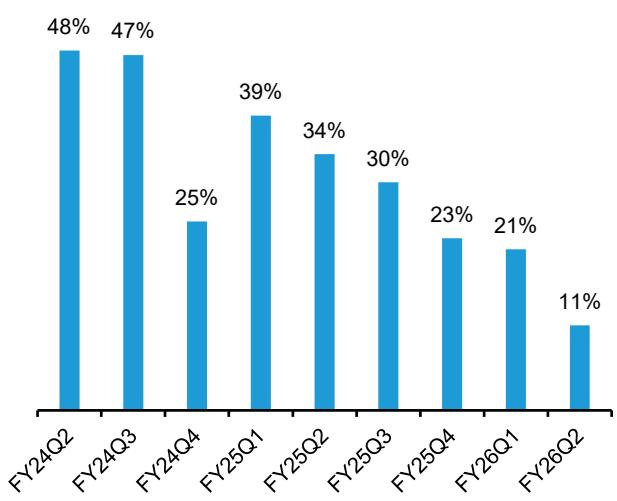

数据来源：公司公告、Bernstein分析

**图表6：本季度能量饮料收入占比明显收窄，电解质饮料及其他饮料（茶饮）占比持续扩大**

东鹏饮料分板块收入结构

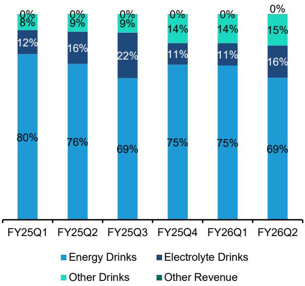

数据来源：公司公告、Bernstein分析

**图表7：本季度能量饮料收入增速明显放缓至1%**

东鹏饮料能量饮料收入同比增速

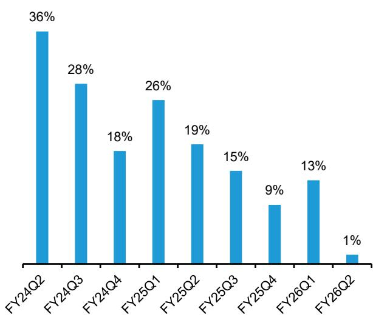

数据来源：公司公告、Bernstein分析

**图表8：电解质饮料收入增速环比亦有所放缓**

东鹏饮料电解质饮料收入同比增速

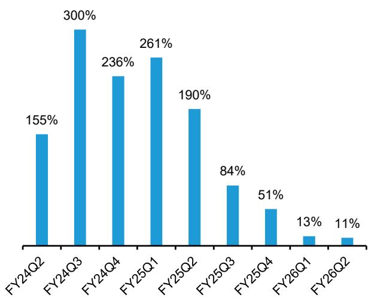

数据来源：公司公告、Bernstein分析

**图表9：大部分区域增速明显放缓，中部地区环比有所加快**

东鹏饮料分区域收入同比增速

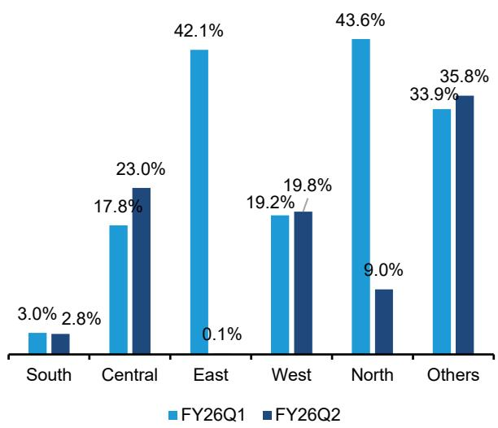

数据来源：公司公告、Bernstein分析

**图表10：二季度东鹏饮料经销商团队增速继续放缓**

东鹏饮料分区域经销商数量

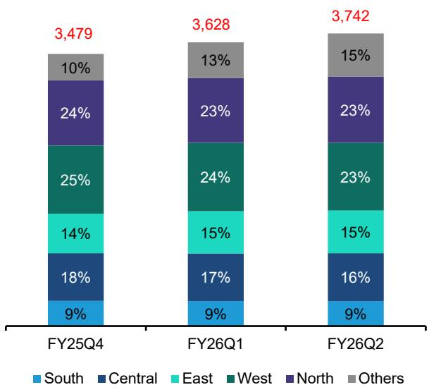

数据来源：公司公告、Bernstein分析

**图表11：我们对东鹏饮料未来三年收入预测较市场一致预期低约2%**

东鹏饮料收入（十亿元人民币）

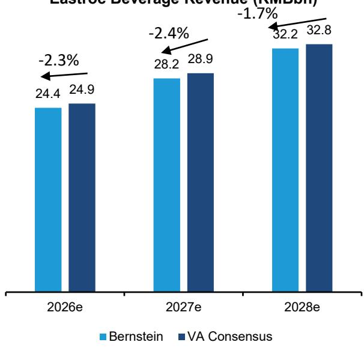

数据来源：S&P Capital IQ Visible Alpha、Bernstein分析与预测

**图表12：每股收益预测较市场一致预期低4-6%**

东鹏饮料每股收益（人民币）

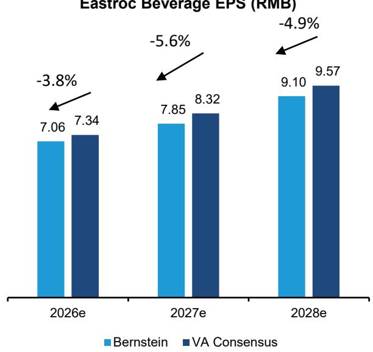

数据来源：S&P Capital IQ Visible Alpha、Bernstein分析与预测

**图表13：东鹏饮料A股估值低于历史平均倍数1.6个标准差**

东鹏饮料A股一致预期远期市盈率

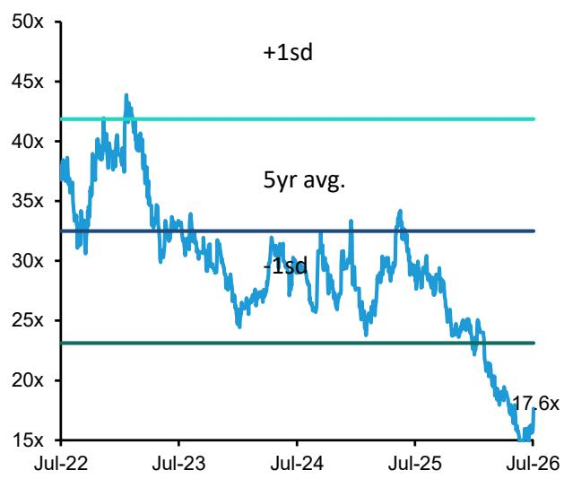

数据来源：Bloomberg、Bernstein分析

**图表14：相对基准指数的溢价目前低于历史水平1.7个标准差**

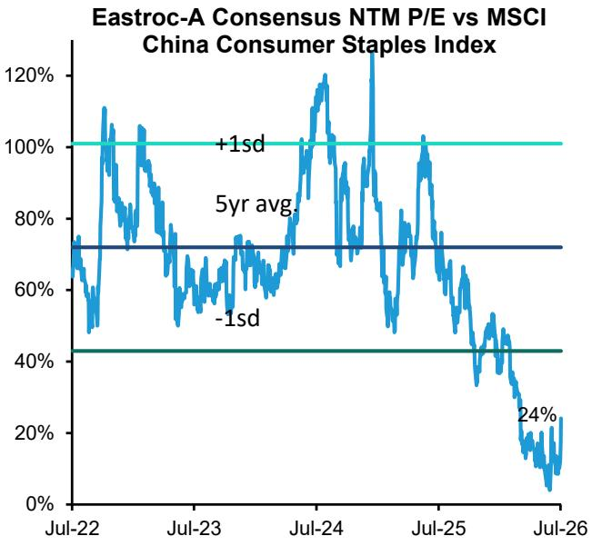

数据来源：Bloomberg、Bernstein分析

**图表15：东鹏饮料A股每股收益一致预期自5月以来持续下调**

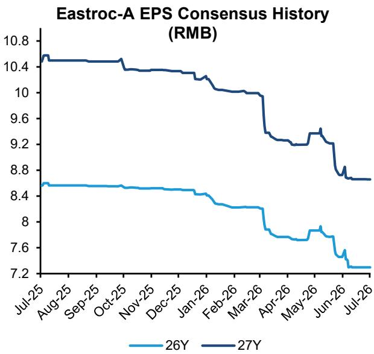

数据来源：Bloomberg、Bernstein分析

**图表16：人民币兑港元汇率**

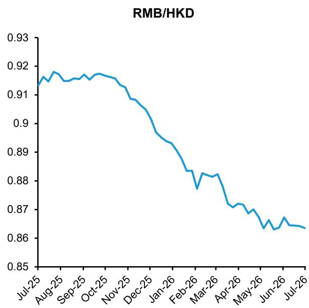

数据来源：Bloomberg、Bernstein分析

**图表17：东鹏饮料H股价格目前较A股折价23%**

东鹏饮料H股自上市以来相对A股折价

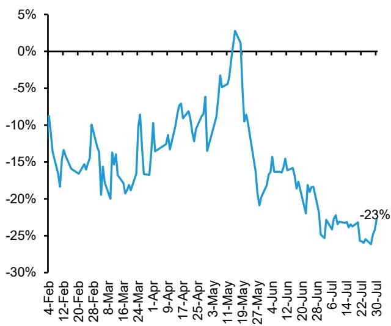

数据来源：Bloomberg、Bernstein分析

## 附录——财务预测

**图表18：东鹏饮料利润表**

| 东鹏饮料利润表（除特别注明外，单位：百万元人民币） | 2023 | 2024 | 2025 | 2026e | 2027e | 2028e | 2029e | 2030e |
|---|---|---|---|---|---|---|---|---|
| 营业收入 | 11,263 | 15,839 | 20,875 | 24,364 | 28,236 | 32,199 | 35,241 | 37,347 |
| 营业成本 | (6,412) | (8,742) | (11,501) | (12,878) | (15,135) | (16,853) | (18,458) | (19,666) |
| 毛利 | 4,851 | 7,097 | 9,374 | 11,486 | 13,102 | 15,345 | 16,783 | 17,681 |
| 税费及其他 | (121) | (160) | (219) | (257) | (282) | (322) | (352) | (373) |
| 销售、一般及管理费用 | (2,379) | (3,169) | (4,048) | (5,274) | (6,175) | (7,132) | (7,812) | (8,280) |
| 息税前利润 | 2,351 | 3,768 | 5,107 | 5,954 | 6,644 | 7,891 | 8,618 | 9,028 |
| 折旧与摊销 | 270 | 359 | 496 | 551 | 676 | 786 | 614 | 776 |
| EBITDA | 2,621 | 4,127 | 5,603 | 6,505 | 7,320 | 8,677 | 9,233 | 9,804 |
| 其他 | 228 | 339 | 478 | 538 | 538 | 538 | 538 | 538 |
| 税前利润 | 2,579 | 4,107 | 5,584 | 6,492 | 7,182 | 8,429 | 9,156 | 9,566 |
| 所得税 | (539) | (781) | (1,170) | (1,365) | (1,510) | (1,857) | (2,109) | (2,299) |
| 税后利润 | 2,040 | 3,326 | 4,414 | 5,127 | 5,671 | 6,572 | 7,048 | 7,267 |
| 归属于： | | | | | | | | |
| 少数股东权益 | - | (0) | (1) | (1) | (1) | (1) | (1) | (1) |
| 公司股东 | 2,040 | 3,327 | 4,415 | 5,128 | 5,672 | 6,573 | 7,049 | 7,268 |
| 基本每股收益（人民币） | 5.10 | 6.40 | 8.49 | 7.06 | 7.85 | 9.10 | 9.76 | 10.06 |
| 总股本（百万股） | 400 | 520 | 520 | 726 | 723 | 723 | 723 | 723 |
| **关键比率** | | | | | | | | |
| 收入增速% | 32.4% | 40.6% | 31.8% | 16.7% | 15.9% | 14.0% | 9.5% | 6.0% |
| 息税前利润增速% | 33.7% | 60.2% | 35.5% | 16.6% | 11.6% | 18.8% | 9.2% | 4.8% |
| 净利润增速% | 41.6% | 63.1% | 32.7% | 16.1% | 10.6% | 15.9% | 7.2% | 3.1% |
| 毛利率% | 43.1% | 44.8% | 44.9% | 47.1% | 46.4% | 47.7% | 47.6% | 47.3% |
| 息税前利润率% | 20.9% | 23.8% | 24.5% | 24.4% | 23.5% | 24.5% | 24.5% | 24.2% |
| EBITDA率% | 23.3% | 26.1% | 26.8% | 26.7% | 25.9% | 26.9% | 26.2% | 26.3% |
| 净利率% | 18.1% | 21.0% | 21.2% | 21.0% | 20.1% | 20.4% | 20.0% | 19.5% |
| ROIC% | 19.5% | 24.4% | 23.7% | 23.6% | 25.0% | 27.7% | 27.7% | 26.3% |

数据来源：Bernstein分析与预测、公司公告

**图表19：东鹏饮料资产负债表**

| 东鹏饮料资产负债表（单位：百万元人民币） | 2023 | 2024 | 2025 | 2026e | 2027e | 2028e | 2029e | 2030e |
|---|---|---|---|---|---|---|---|---|
| 存货 | 569 | 1,068 | 657 | 966 | 1,218 | 1,449 | 1,688 | 1,906 |
| 应收账款 | 66 | 81 | 91 | 101 | 116 | 133 | 145 | 154 |
| 现金及现金等价物 | 6,058 | 5,653 | 5,680 | 3,283 | 1,520 | 207 | (482) | (950) |
| 其他 | 2,076 | 5,904 | 8,960 | 8,953 | 9,005 | 9,058 | 9,099 | 9,127 |
| 流动资产合计 | 8,769 | 12,706 | 15,387 | 13,302 | 11,859 | 10,847 | 10,450 | 10,237 |
| 固定资产 | 2,916 | 3,670 | 4,947 | 8,198 | 11,025 | 13,542 | 16,230 | 18,757 |
| 债权投资 | 1,220 | 3,672 | 1,757 | 1,757 | 1,757 | 1,757 | 1,757 | 1,757 |
| 其他 | 1,805 | 2,629 | 4,629 | 4,629 | 4,629 | 4,629 | 4,629 | 4,629 |
| 非流动资产合计 | 5,941 | 9,971 | 11,333 | 14,585 | 17,412 | 19,928 | 22,617 | 25,144 |
| 资产总计 | 14,710 | 22,676 | 26,721 | 27,887 | 29,271 | 30,775 | 33,067 | 35,380 |
| 应付账款及其他应付款 | 2,016 | 2,770 | 3,110 | 3,251 | 3,501 | 3,692 | 3,870 | 4,004 |
| 短期借款 | 2,996 | 6,551 | 6,630 | 6,630 | 6,630 | 6,630 | 6,630 | 6,630 |
| 合同负债 | 2,607 | 4,761 | 5,974 | 5,974 | 5,974 | 5,974 | 5,974 | 5,974 |
| 其他 | 428 | 763 | 1,096 | 1,096 | 1,096 | 1,096 | 1,096 | 1,096 |
| 流动负债合计 | 8,047 | 14,845 | 16,810 | 16,951 | 17,202 | 17,393 | 17,571 | 17,705 |
| 长期借款 | 220 | - | - | - | - | - | - | - |
| 其他 | 119 | 140 | 487 | 487 | 487 | 487 | 487 | 487 |
| 非流动负债合计 | 339 | 140 | 487 | 487 | 487 | 487 | 487 | 487 |
| 负债合计 | 8,386 | 14,985 | 17,297 | 17,438 | 17,689 | 17,879 | 18,058 | 18,192 |
| 股东权益合计 | 6,324 | 7,692 | 9,424 | 10,449 | 11,582 | 12,896 | 15,009 | 17,189 |
| 负债及股东权益总计 | 14,710 | 22,676 | 26,721 | 27,887 | 29,271 | 30,775 | 33,067 | 35,380 |
| 净债务/EBITDA | (1.5倍) | (1.1倍) | (0.2倍) | (0.5倍) | (0.7倍) | (0.8倍) | (0.9倍) | (1.0倍) |

数据来源：Bernstein分析与预测、公司公告

**图表20：东鹏饮料现金流量表**

| 东鹏饮料现金流量表（单位：百万元人民币） | 2023 | 2024 | 2025 | 2026e | 2027e | 2028e | 2029e | 2030e |
|---|---|---|---|---|---|---|---|---|
| 净利润 | 2,040 | 3,326 | 4,414 | 5,127 | 5,671 | 6,572 | 7,048 | 7,267 |
| 折旧与摊销 | 270 | 359 | 496 | 551 | 676 | 786 | 614 | 776 |
| 营运资本变动 | 331 | 574 | 1,074 | (177) | (18) | (56) | (73) | (93) |
| 其他 | 640 | 1,530 | 191 | 7 | (52) | (53) | (41) | (28) |
| 经营活动现金流净额 | 3,281 | 5,789 | 6,174 | 5,507 | 6,278 | 7,248 | 7,548 | 7,922 |
| 收购子公司/业务（净额） | 8 | - | (356) | - | - | - | - | - |
| 固定资产购置（净额） | (916) | (1,684) | (2,262) | (3,803) | (3,503) | (3,303) | (3,303) | (3,303) |
| 其他 | 150 | (5,191) | (1,484) | - | - | - | - | - |
| 投资活动现金流净额 | (758) | (6,875) | (4,102) | (3,803) | (3,503) | (3,303) | (3,303) | (3,303) |
| 已付股息 | (811) | (2,051) | (2,678) | (4,102) | (4,538) | (5,258) | (4,934) | (5,088) |
| 净借款 | (35) | 3,269 | 72 | - | - | - | - | - |
| 其他 | (212) | 290 | (42) | - | - | - | - | - |
| 筹资活动现金流净额 | (1,058) | 1,507 | (2,648) | (4,102) | (4,538) | (5,258) | (4,934) | (5,088) |
| 汇率变动对现金的影响 | (29) | 32 | (11) | - | - | - | - | - |
| 现金及现金等价物净变动 | 1,465 | 421 | (576) | (2,397) | (1,763) | (1,313) | (689) | (469) |
| 期末现金及现金等价物 | 3,414 | 3,867 | 3,280 | 882 | (880) | (2,193) | (2,882) | (3,351) |
| 银行存款 | 3,183 | 2,324 | 2,939 | - | - | - | - | - |
| 资产负债表期末现金及现金等价物 | 6,597 | 6,192 | 6,219 | 882 | (880) | (2,193) | (2,882) | (3,351) |

数据来源：Bernstein分析与预测、公司公告

## BERNSTEIN股票列表

|  |  |  | 2026年7月30日 |  | 12个月相对表现 |  | 调整后每股收益 |  | 调整后市盈率（倍） |  |  |
|---|---|---|---|---|---|---|---|---|---|---|---|
|  | 评级 | 币种 | 收盘价 | 目标价 | 当前 | 2025A | 2026E | 2027E | 2025A | 2026E | 2027E |
| 605499.CH（东鹏饮料） | M | 人民币 | 138.20 | 133.00 | (60.2)% | 人民币 | 8.49 | 7.06 | 7.85 | 16.3 | 19.6 | 17.6 |
| 原目标价 |  |  |  | 142.00 |  |  |  | 7.37 | 8.34 |  |  |  |
| 9980.HK（东鹏饮料） | M | 港元 | 124.00 | 131.00 | 不适用 | 人民币 | 8.49 | 7.06 | 7.85 | 14.6 | 17.6 | 15.8 |
| 原目标价 |  |  |  | 138.00 |  |  |  | 7.37 | 8.34 |  |  |  |
| ASIAX指数 |  |  | 1,808.17 |  |  |  |  |  |  |  |  |  |

## 目标价调整/预测调整（以粗体标示）

O—跑赢大盘，M—与市场同步，U—跑输大盘，NR—未评级，CS—暂停覆盖

数据来源：Bloomberg、Bernstein预测与分析

## 一、必要披露

本披露中提及的"Bernstein"或"本公司"指以下实体：Bernstein Institutional Services LLC（2024年4月1日起）、Bernstein & Co., LLC（2024年4月1日前）、Bernstein Autonomous LLP、BSG France S.A.（2024年4月1日起）、Bernstein (Hong Kong) Limited 盛博香港有限公司、Bernstein (Canada) Limited、Bernstein (India) Private Limited（SEBI注册号INH000006378）、Bernstein (Singapore) Private Limited、Bernstein Japan KK（サンフォード・C・バーンスタイン株式会社）以及根据Bernstein与SG之间的全球服务协议为Bernstein编制研究报告的SG Africa Technologies & Services所雇用的分析师。

Bernstein是SG（SG）与AllianceBernstein, L.P.（AB）合资企业的一部分。除非另有特别说明，就本披露而言，提及Bernstein的"关联方"均指SG和AB及其各自的关联公司。

## 估值方法

## 东鹏饮料集团股份有限公司

我们为东鹏饮料A股设定133元人民币的目标价，采用15.7倍远期市盈率乘以我们对远期NTM+1每股收益8.5元人民币的预测。这相当于基于我们的DCF模型（WACC 7.5%，终端增长率2.5%）隐含的2027财年15.8倍市盈率。

我们为东鹏饮料H股设定131港元的目标价，采用13.3倍远期市盈率乘以相同的远期每股收益预测，在A股目标倍数基础上应用15%的A-H溢价。

## 风险因素

## 东鹏饮料集团股份有限公司

**可能推动我们目标价上行的风险：**

- 非能量饮料品类销售比预期更早达到规模经济临界点，导致毛利率扩张速度显著加快，整体利润率摊薄程度降低
- 公司在落后区域显著提升经销商人均收入，渠道效率和销售成本杠杆明显改善
- 健康趋势放缓或逆转，消费者转向低糖/无糖饮料的进程变化，使能量饮料品类增速显著高于预期

**可能导致我们目标价下行的风险：**

- 中国推出糖税，导致公司核心能量饮料产品的可负担性下降、需求减少（若税负转嫁给消费者），或生产商定价能力和利润率下降
- 渠道扩张成本增加和/或扩张速度低于预期
- 原材料价格冲击
- 宏观环境变化对消费者可支配收入产生影响

## 评级定义、基准与分布

## 股票评级定义

## Bernstein品牌

Bernstein品牌根据未来12个月相对表现的预测对股票进行评级：美国和加拿大交易所上市股票对标S&P 500指数；欧洲交易所及亚太地区以外新兴市场交易所上市股票对标Bloomberg欧洲发达市场大中盘价格回报指数（EDME）；日本交易所上市股票对标Bloomberg日本大中盘价格回报指数（JPL）；亚洲（除日本）交易所上市股票对标Bloomberg亚洲（除日本）大中盘价格回报指数（ASIAX）——除非另有说明。

Bernstein品牌有三个评级类别：

- **跑赢大盘：** 股票将跑赢市场指数超过15个百分点
- **与市场同步：** 股票表现将与市场指数一致，在±15个百分点以内
- **跑输大盘：** 股票将跑输市场指数超过15个百分点

**暂停覆盖：** Bernstein品牌下对某公司的覆盖已暂停。评级和目标价暂时中止，不再有效，不应依赖。

**未评级：** 当股票目前无法准确估值或无法准确预测公司表现时分配的评级。负责分析师可能继续发布关于该公司的研究报告，向读者更新事件和进展。

**未覆盖（NC）** 表示不在覆盖范围内的公司。

Bernstein品牌股票评级基于12个月时间跨度。

## Autonomous品牌——普通股

Autonomous品牌按以下方式对普通股进行评级。我们使用的基准包括：Bloomberg欧洲600金融价格回报指数（E600BK）和Bloomberg欧洲发达市场金融大中盘价格回报指数（EDMFI）用于欧洲银行和支付行业，Bloomberg欧洲600保险价格回报指数（E600IN）用于欧洲保险公司，S&P 500和S&P金融指数用于美国银行和支付覆盖，S5LIFE用于美国保险，S&P保险精选行业指数（SPSIINS）用于美国非寿险公司覆盖，Bloomberg新兴市场金融大中盘和小盘价格回报指数（EMLSF）用于新兴市场银行、保险公司和支付行业，Bloomberg日本金融大中盘价格回报指数（JPFILM）用于日本金融业。评级相对于行业（而非市场）给出。

Autonomous品牌有三个普通股评级类别：

- **跑赢大盘（OP）：** 股票将跑赢相关
