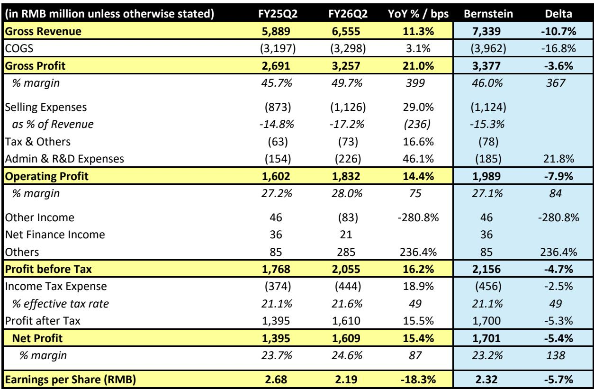
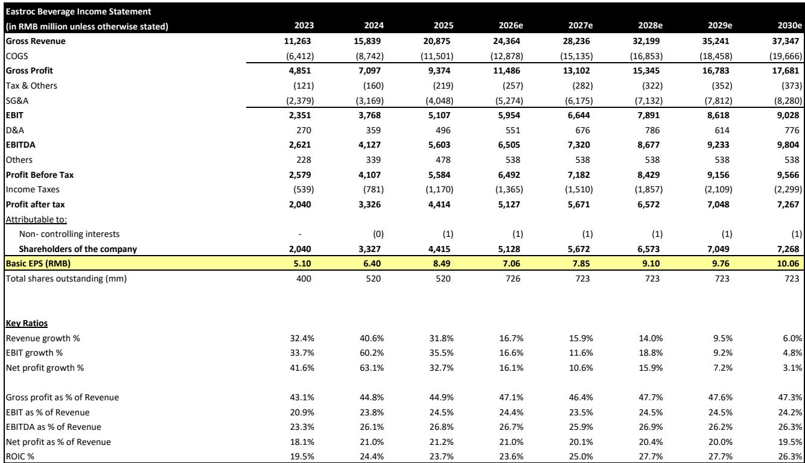
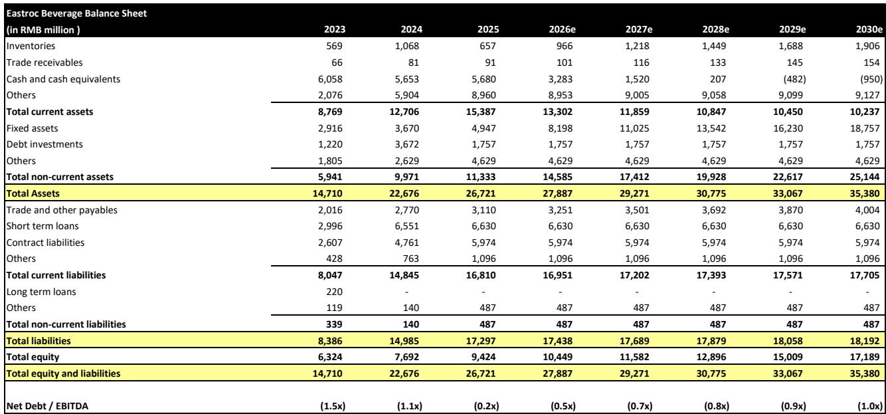

# 东鹏饮料Q2观察：从增长叙事到回报叙事的转向

东鹏饮料集团，作为国内功能饮料市场的重要参与者，在第二季度录得自上市以来最慢的季度营收增长，销售额同比仅增长11%，低于市场预期。然而，这一整体数据背后隐藏着更为结构性的变化：仍占总销售额69%的功能饮料收入，当季仅增长1%，与此前多年保持的两位数增长相比，出现了明显放缓。管理层将主要原因归结为竞争加剧——这一表述值得关注，它可能意味着国内功能饮料市场竞争格局正在发生根本性变化，而非短期波动。

这一放缓的时点颇为特殊。东鹏饮料数月前刚在香港完成H股上市，股价年内已下跌32.8%，跑输基准指数43.4个百分点。面对这一季度的表现，管理层宣布了相当于H股10%的股份回购计划（尽管流通盘较薄），将中期分红比例从55%提升至76%，并承诺到2028年维持至少80%的分红比例。信号十分清晰：一家曾经讲述增长故事的公司，正在转向资本回报叙事。读者需要评估这一转变是审慎的战略调整，还是核心增长引擎已永久降速的信号。

第二季度展现了一家处于转折点的公司：有利投入成本带来的利润率扩张，掩盖了更令人担忧的收入放缓；而管理层成为“饮料平台公司”的雄心，可能稀释东鹏作为市场关注焦点所依赖的盈利能力。读者的决策框架已不再仅仅是增长率问题，而是东鹏能否在捍卫核心业务的同时，建设目前毛利率比功能饮料板块低16至35个百分点的新业务。

## 功能饮料放缓并非短期现象，反映竞争格局的结构性变化

第二季度功能饮料收入仅增长1%，是本报告中最值得关注的数据点，需要超越“基数较高”或“季节性疲软”的简单归因。报告显示，东鹏功能饮料板块此前一直保持“相当稳定的两位数增长”，突然降至1%，表明市场环境发生了更为根本的变化。管理层承认“竞争加剧是主要问题”，这一表态应被认真对待——国内功能饮料赛道的竞争格局一直在快速演变，国际品牌和本土企业都在加大渠道布局和价格促销力度。

第二季度的区域数据进一步印证了这一竞争压力。多数地区增长明显放缓，南部和东部地区几乎持平，分别增长2.8%和0.1%。这些是东鹏最成熟的市场，渗透率最高，竞争侵蚀自然首当其冲。中部地区增长23.0%，西部地区增长19.8%，提供了一定对冲，但这些属于发展程度较低的市场，东鹏仍有渠道拓展空间。这一格局表明，东鹏的核心优势区域已成为竞争激烈的领域，公司在这些地区的增长能力将取决于执行效率，而非单纯依靠品类顺风。

经销商数据增添了另一层关注。第二季度东鹏经销商团队的增长继续放缓，这可能表明公司在某些地区正接近饱和，或渠道伙伴对库存水平变得更加谨慎。经销商网络增速放缓本身不一定是负面信号——如果反映的是单经销商效率提升的话——但结合功能饮料收入放缓来看，公司传统的“拓展渠道广度”增长模式可能正在失去效力。

利润率情况则呈现更为复杂的图景。毛利率同比扩张约400个基点至49.7%，主要受好于预期的销售成本推动。这一利润率扩张提供了缓冲，使营业利润在收入未达预期的情况下仍增长14.4%。但读者不应无限期外推这一利润率红利。报告指出，第三季度利润率上行空间预计将被部分与世界杯相关的营销支出所抵消，这将检验东鹏在捍卫市场份额的同时能否维持盈利能力。

## 平台化雄心带来利润率稀释问题，管理层尚未完全回应

东鹏 reiterated 的“饮料平台公司”战略听起来逻辑自洽，但财务现实颇为严峻。非功能饮料板块——包括电解质饮料和即饮茶——在FY25的毛利率比功能饮料板块低16至35个百分点。电解质饮料板块第二季度增长11%，是较为自然的延伸，利用了东鹏在功能饮料领域的渠道网络和品牌资产。“其他”板块（含即饮茶产品）第二季度增长97%，则更令人关注，因为它使东鹏直接进入已相当拥挤且价格竞争激烈的茶饮赛道。

利润率稀释不仅是短期现象，而是随着这些规模尚小的业务增长而持续存在的结构性拖累。报告预测显示，毛利率预计到2030年将保持在46-48%区间，高于当前水平但低于第二季度的49.7%。这表明，来自成本端的利润率红利终将正常化，而向低毛利非功能饮料产品的组合转变将成为利润率的主要决定因素。问题在于，东鹏能否在这些新品类中实现足够规模以缩小利润率差距，还是将长期背负一个比历史核心业务盈利能力更低的组合。

“其他”板块97%的增长轨迹虽然亮眼，但因其基数较低而具有迷惑性。报告指出即饮茶上半年增长2倍，但相对收入贡献相对于功能饮料主业仍然较小。管理层聚焦低糖/无糖健康趋势在战略上是合理的——这些是国内饮料市场增长最快的细分领域——但执行风险不容忽视。打造成功的茶饮品牌需要与功能饮料不同的能力，包括不同的消费者营销、包装形式，可能还需要不同的渠道体系。东鹏在传统渠道的分销优势未必能直接转化为现代渠道和电商渠道的竞争力，而茶饮产品往往在这些渠道更容易获得增长。

平台战略的资本配置影响也值得审视。报告显示，固定资产预计将大幅增加，从2025年的49亿元人民币增至2030年的188亿元人民币，这意味着对新品类产能的巨额投入。这些资本开支将消耗本可返还给股东的现金，且如果新产品未能达到预期规模，将产生执行风险。公司2025年的净现金头寸为57亿元人民币，预计到2029年将转为负值，这将代表东鹏资产负债表状况的根本性变化。

## 资本回报方案标志战略转向，但引发增长投入之问

宣布相当于H股10%的股份回购，加上将分红比例提升至2028年至少80%的承诺，标志着东鹏资本配置理念的重大转变。这一时点值得注意——公司数月前刚完成H股上市，流通盘较薄。在此背景下的回购具有多重目的：为大幅下跌的股价提供支撑，传递管理层对企业内在价值的信心，并部分对冲H股发行带来的稀释。但这也引发了一个问题：公司是因为核心业务缺乏更高回报的研究线索而返还资本，还是在竞争动荡期保护股东价值的防御性举措？

到2028年的分红承诺是一个具有约束力的信号，表明管理层预计即使增长放缓，业务仍能产生可观的自由现金流。报告财务预测显示，FY25至FY27净利润年复合增长率为13.3%，虽属可观，但相比FY25实现的32.7%增长已明显减速。分红比例从55%提升至至少80%，意味着管理层认为成熟的功能饮料业务能够维持高现金生成能力，无需大量再投入。对于接近饱和市场中的品类领导者而言，这是合理的假设，但与需要投入新品类投资的平台战略存在张力。

考虑到H股流通盘较薄，回购尤其值得关注。在流动性有限的情况下，回购可能对股价产生超比例影响，但也可能在市场价格发现机制中造成一定扭曲。H股目前较A股折价23%，这是双重上市结构的持续特征。回购可能收窄这一折价，但不太可能完全消除——A股市场通常因国内流动性和读者准入因素而享有溢价。

读者还应考虑资本回报方案所传递的关于管理层增长预期的信号。积极返还资本的公司，实际上是在承认其再研究线索有限。这未必是负面——成熟公司往往通过分红和回购比边际投资创造更多股东价值。但对于一家历史上以增长故事估值、FY25市盈率为16.3倍的公司而言，转向资本回报代表了对股权风险的重估。市场可能已在很大程度上消化了负面信息。

## 估值折价反映的重新定价可能尚未完成

东鹏A股目前交易价格较其历史平均倍数低约1.6个标准差，相对基准指数的溢价较历史水平低1.7个标准差。这是显著的重新定价，但可能尚未结束。报告已将FY26-28每股收益预测下调4-6%，未来三年收入预测比市场共识低2%。如果共识预测继续被下调——自5月以来一直如此——即使相对盈利轨迹保持正向，股价仍可能面临进一步估值压缩。

估值图景因双重上市结构而复杂化。A股FY25市盈率为16.3倍，H股折价23%，隐含市盈率约12.5倍。H股折价是国内双重上市公司的持续特征，但折价幅度随市场条件变化。报告维持A股15.7倍NTM市盈率目标和H股13.3倍目标，表明分析师预计折价将持续。

调整后盈利的PEG比率为0.5倍，低于价值读者常用的1.0倍阈值。然而，PEG比率仅在增长率可持续时才有意义，功能饮料放缓引发了对东鹏盈利增长持久性的质疑。报告预测显示净利润增长从FY26的16.1%减速至FY27的10.6%，FY28回升至15.9%——这一不均衡轨迹反映了H股发行对股本的影响以及功能饮料增长的预期恢复。

相对表现颇为显著：东鹏过去12个月跑输基准指数60.2个百分点。如此幅度的跑输表明市场已消化了公司基本面的显著恶化，但如果公司能证明第二季度疲软是暂时的，也存在强劲反弹的可能。报告提到的第三季度功能饮料收入回升预期将是一个关键检验。如果公司能在维持利润率的同时恢复两位数功能饮料增长，重新定价可能已过度；如果不能，股价可能继续走低。

## 评估东鹏从增长向资本回报转型的决策框架

第二季度业绩为读者呈现了一个经典转型问题：如何为一家从高增长阶段向成熟阶段过渡、并以资本回报政策传递管理层未来判断的公司进行估值。以下框架综合了应驱动决策的关键因素。

第一个因素是核心功能饮料业务的轨迹。第二季度1%的增长要么是竞争强度造成的暂时扰动，要么是品类增长潜力的永久降档。读者应关注季度功能饮料增长率，并与国内更广泛的品类增长率进行比较。如果东鹏在丢失份额，那是竞争问题；如果品类本身在放缓，那是市场问题。两者的区别很重要——竞争问题可以通过营销和渠道投入来解决，而品类问题则需要重新评估公司的增长潜力。

第二个因素是组合层面的利润率轨迹。第二季度400个基点的毛利率扩张由有利的销售成本驱动，这可能是暂时性收益。随着投入成本正常化和组合向低毛利非功能饮料产品转变，毛利率将面临结构性压力。读者应跟踪分板块毛利率，评估非功能饮料板块能否实现足够规模以接近功能饮料的利润率水平。报告对FY25 16-35个百分点毛利率差异的估计提供了拖累幅度的参考。

第三个因素是平台战略的执行。包含即饮茶的“其他”板块增长迅速，但基数较小。关键问题在于，东鹏能否在不通过过度促销支出或渠道冲突破坏价值的情况下，建立有意义的茶饮业务。公司聚焦低糖/无糖健康趋势在战略上合理，但饮料行业不乏未能将品类趋势转化为盈利业务的先例。

第四个因素是资本回报计划的可持续性。到2028年至少80%的分红比例是一项承诺，需要持续的自由现金流生成。报告预测显示净债务/EBITDA从FY25的-1.27倍改善至FY27的-2.56倍，表明净现金头寸在增长。然而，固定资产的预计增加表明资本开支将消耗部分现金流，公司需要在投资需求与分红承诺之间取得平衡。

第五个因素是估值入场点。股价较历史平均水平有显著折价，H股相对A股的折价提供了额外的安全边际。然而，盈利预测下调和共识进一步修正的可能性意味着股价可能变得更便宜。读者应考虑当前估值是否充分补偿了平台战略相关的执行风险和功能饮料品类的竞争压力。

第二季度业绩从根本上改变了东鹏的研究逻辑。公司不再是一个纯粹的增长故事；它是一个转型故事，需要密切关注竞争动态、利润率演变和资本配置决策。资本回报方案为股东回报提供了下限，但并未解决核心问题：东鹏能否在捍卫功能饮料主业的同时，建设最终能接替核心业务增长的新业务。

*仅供参考。部分内容可能基于原始材料由AI辅助生成、翻译、摘要或编辑，可能包含遗漏或错误。请独立核实。本文不构成投资、法律、税务、会计或其他专业建议。*

仅供参考。部分内容可能基于原始材料由AI辅助生成、翻译、摘要或编辑，可能包含遗漏或错误。请独立核实。本文不构成投资、法律、税务、会计或其他专业建议。

