# 美国多行业与电气设备
## Vertiv Holdings Co

**评级**

跑赢大盘

**目标价**

VRT

368.00 美元（原 416.00 美元）

**专业销售**

Steve Song
+1 917 344 8401
steve.song@bernsteinsg.com

---

# VRT 2026年第二季度业绩回顾：仍是优质公司，但光环效应已消退。目标价下调至 368 美元。

**业绩摘要**：Vertiv 第二季度营收为 33 亿美元，低于市场一致预期的约 34 亿美元，有机增长约 18%。调整后稀释每股收益 1.52 美元，高于市场预期的约 1.42 美元。调整后营业利润率 22.6%，也较预期高出约 100 个基点。增长数据是最大的失望点；受此影响，VRT 当日下跌 18%。

**有机增长未达预期与供应链问题**：我们在预览报告中提到，需要超越的目标是约 30% 的有机增长；VRT 实际仅录得 18%，远低于预期。管理层提到这与供应链问题有关，特别是预制化解决方案（如 SmartRun / OneCore）。这些产品供应链更复杂，任何一个组件的延迟都可能导致高价值模块化单元的交付延迟。VRT 需要解决这些问题以满足后置的业绩指引；我们对此不完全有信心，因为管理层尚未提供关于"如何解决"的详细说明。供应链问题很难在一个季度内解决。

**800V 直流电进展滞后**：管理层强调固态变压器（SST）仍在产品开发阶段，而同业似乎走得更前（例如，部分同业已在超大规模客户处测试 SST）。VRT 的估值溢价部分来自研发实力，而鉴于 SST 叙事的重要性，落后于同业并非有利信号。

**递延收入强劲**：VRT 不再披露季度订单数据。因此读者现在将递延收入作为订单增长的指标（因为其中部分包含新项目订单的预付款）。第二季度递延收入显著增长（增加超过 12 亿美元，而通常每季度仅增加数亿美元），这意味着强劲的订单增长正在到来。然而，这可能不会对 2026 年营收产生重大影响，因为大部分订单可能要到 2027 年才能转化为收入（假设 12 个月的转化周期）。

尽管这份报告基调偏谨慎，我们仍认为 VRT 是一家优秀的公司和优质标的。当前估值具有吸引力；虽然我们认为其不太可能回到峰值倍数。过去几年积累的光环效应已经消退，没有几个超预期的业绩表现很难重新获得。我们将密切关注管理层在接下来会议上的评论，以增强对供应链 / SST 问题的信心。

| 收盘日期 |  |  |  | 2026年7月30日 |
|---|---|---|---|---|
| VRT 收盘价（美元） |  |  |  | 227.50 |
| 目标价（美元） |  |  |  | 368.00 |
| 上行/（下行）空间 |  |  |  | 62% |
| 52周区间 |  |  |  | 379.94/118.70 |
| SPX |  |  |  | 7,437.63 |
| 财年截止 |  |  |  | 12月 |
| 股息率 |  |  |  | 0.1% |
| 市值（百万美元） |  |  |  | 87,585 |
| 企业价值（百万美元） |  |  |  | 87,730 |
| **表现** | **年初至今** | **1个月** | **6个月** | **12个月** |
| 相对表现（%） | 40.4 | (32.1) | 22.2 | 57.8 |
| SPX（%） | 8.6 | (0.8) | 7.2 | 16.9 |
| 相对表现（%） | 31.8 | (31.2) | 15.0 | 40.9 |

来源：彭博、Bernstein 估计与分析。

**一年价格表现**
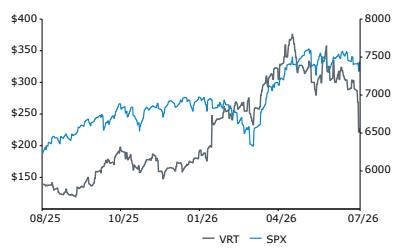

---

## 投资观点

我们给予 VRT"跑赢大盘"评级，目标价从 416 美元下调至 368 美元。调整原因是我们将 EV / NTM EBITDA 估值倍数从 32 倍下调至 27 倍，并将 EBITDA 滚动向前推进一个季度。

| 调整后每股收益 | F25A | F26E | F27E | 财务数据 | F25A | F26E | F27E | CAGR | 估值指标 | F25A | F26E | F27E |
|---|---|---|---|---|---|---|---|---|---|---|---|---|
| VRT（美元） | 4.20 | 6.60 | 9.06 | 营收（百万） | 10,230 | 13,851 | 18,270 | -- | 调整后市盈率（倍） | 54.2 | 34.5 | 25.1 |
| 原预测 | -- | 6.52 | 9.21 |  |  |  |  |  |  |  |  |  |

来源：彭博、Bernstein 估计与分析。

---

## 详细内容

## 业绩数据回顾

Vertiv 第二季度营收为 32.74 亿美元，低于市场一致预期的约 33.72 亿美元，同比增长约 24%（有机增长 18%），2025 年第二季度为 26.38 亿美元。调整后稀释每股收益 1.52 美元，高于市场预期的约 1.42 美元；2025 年第二季度为 0.95 美元。调整后营业利润率 22.6%，也较预期高出约 100 个基点。营收数据令人失望，因为市场已习惯于 VRT 在增长方面有更强劲的表现。第三季度 EPS 指引中值为 1.80 美元，营收中值为 37.5 亿美元，考虑到市场一致预期已处于该水平，这一指引似乎偏低。全年营收指引中值上调 2.5 亿美元至 140 亿美元，全年 EPS 指引为 6.70 美元。

## 我们关注的重点

**有机增长未达预期与供应链问题**：我们在预览报告中提到，需要超越的目标是约 30% 的有机增长；VRT 当季指引为 20 年代中期有机增长，但实际仅录得 18%（主要由美洲地区拖累）。管理层随后提到这与供应链问题有关，具体而言是预制化解决方案（如 SmartRun / OneCore）而非点式解决方案。问题在于这些预制化产品供应链更复杂，任何一个组件的延迟都可能导致高价值模块化单元的交付延迟。Vertiv 正在增加产能以应对这一问题，评论似乎表明存在一定的容错空间。但第二季度指引中可能也已包含了容错空间，结果仍然不够。VRT 指引第三季度有机增长 35%，第四季度隐含增长超过 40%，这是一个很大的跃升。我们覆盖范围内大多数有数据中心业务的公司收入转化都偏向后半年，但大多数公司也达到了第二季度的数字，因此我们对 VRT 短期执行能力的担忧程度高于其他公司。财报电话会议和后续沟通中的评论并未让我们相信问题能立即解决——供应链问题往往需要超过一个季度才能修复。

**800V 直流电进展滞后**：这是另一个我们未看到预期进展的领域。管理层强调 SST 仍在开发阶段，而同业似乎走得更前（例如，部分同业已在超大规模客户处测试 SST）。VRT 的估值溢价部分来自研发实力，而鉴于 SST 叙事的重要性，落后于同业并非有利信号。虽然我们仍认为 800V 直流电是 2028 年的爬坡期，VRT 有时间开发产品，但落后于同业并不符合其一贯风格。他们显然在推进相关工作，但财报电话会议上回答的简洁性和细节不足，无助于改善读者对"VRT 在 800V 直流电方面落后于电力原生同业"这一叙事的情绪。

**递延收入强劲**：VRT 不再披露季度订单数据。因此读者现在将递延收入作为订单增长的指标（因为其中部分包含客户订单预付款以及满足项目里程碑后收到的款项）。第二季度递延收入显著增长（较第一季度增加超过 12 亿美元，而通常每季度仅增加数亿美元），这意味着强劲的订单增长正在到来。然而，这可能不会对 2026 年营收产生重大影响，因为大部分订单可能要到 2027 年才能转化为收入（假设 12 个月的转化周期）。

## 关于估值的思考

当前估值无疑具有吸引力。需求显然强劲，因此需要解决的是运营执行问题。鉴于今年 EPS 预计增长超过 60%，且买方预期 FY27 盈利增长 40% 以上、FY28 增长 20% 以上（卖方一致预期在 FY27 略低、FY28 略高），市场似乎已在某种程度上过度修正。

话虽如此，我们认为 55 倍市盈率（NTM）和 40 倍 EV / NTM EBITDA 的峰值估值时代已经过去。这些倍数需要完美执行和对业绩交付及持续产品开发卓越性的高度信心，而 Vertiv 本季度在这两方面都有所欠缺。一朝被蛇咬，十年怕井绳……考虑到业绩日股价变动的幅度，我们可以想象读者在更广泛 AI 板块情绪更为积极的情况下，仍会对建立新仓位有所犹豫。

虽然我们预计中期会有一定修复，但我们也相应下调了倍数假设。我们现在给予 Vertiv 27 倍估值（在我们最初选择的 32 倍 EV / NTM EBITDA 和当前 22 倍 EV / NTM EBITDA 之间取中间值）。

**图表 1：EV / EBITDA（NTM）**
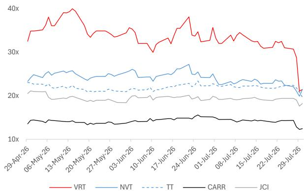
来源：Visible Alpha、Bernstein 分析

**图表 2：市盈率（NTM）**
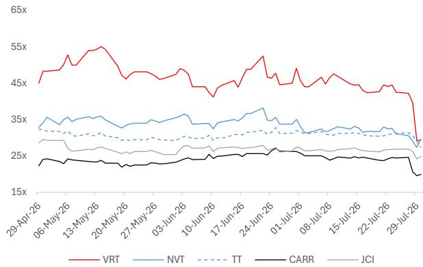
来源：Visible Alpha、Bernstein 分析

---

## 图表 3：VRT 业务动态

## 业务动态

## 市场环境

- 强劲的管道动能：预示着又一个预期强劲订单增长的年份。
- 美洲市场保持强劲：加速的管道支持长期增长轨迹。
- EMEA 确认积极动能：管道加速增强了 2026 年剩余时间表现的信心。
- APAC 全线强劲：健康的管道发展和有利的市场条件支持持续增长机会。
- 定价环境持续有利：预计 2026 年定价将继续超过通胀。

## 制造与供应链

- 环比和同比增长反映了我们持续投资于产能扩张和强劲的积压订单，为下半年加速奠定基础。
- 我们正以更大的规模和复杂度交付数据中心基础设施解决方案。第二季度营收出现小幅时间性偏移，主要由于暂时的供应链拥堵和多阶段项目执行。
- 资本支出预计将达到区间高端（约为 2026 年销售额的 4%）。投资以扩展全球能力和产能，满足近期和长期客户需求。
- 持续投资于长期增长，通过战略性投资于未来电力架构、先进热管理系统、服务和融合基础设施，以支持下一代 AI 工厂。

---

## 图表 5：VRT 冷却回路设计

## 热闭环架构和流体管理服务进步实现"近零"用水

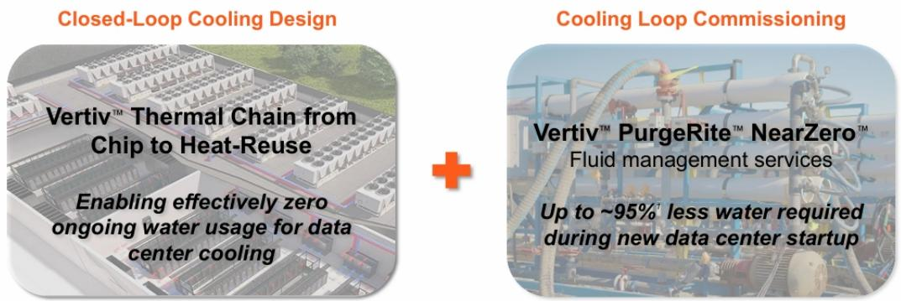

- 闭环、非蒸发设计作为密封循环系统运行
- 初始注水后，日常正常运行冷却无需额外补水
- Vertiv™ PurgeRite™ NearZero™ 是业界首个在调试期间捕获、处理和回用水的冲洗服务
- 显著减少用水量、排放量和运输需求

## Vertiv 的闭环热管理设计和启动冲洗服务创新使数据中心运营商能够在性能与用水之间取得平衡。

2026 年第二季度业绩

2026 年第二季度业绩（1）经外汇和收购调整；（2）详见附录第 23 页的补充说明。

来源：公司演示文稿

---

## 图表 7：VRT 2026 年第四季度指引

## 2026 年第四季度财务指引

百万美元；相对指引区间中值的变动

## 调整后稀释每股收益

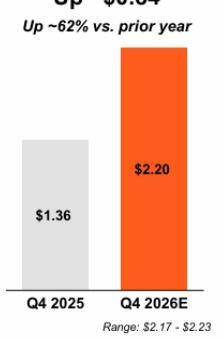

## 净销售额

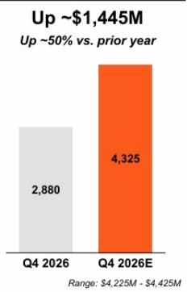

调整后营业利润
增加约 4.48 亿美元
同比增长约 67%

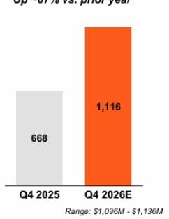
调整后营业利润率提升约 260 个基点

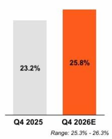

---

## 图表 8：VRT 2026 年全年指引

## 2026 年全年财务指引

百万美元；相对指引区间中值的变动

## 调整后稀释每股收益

增加约 2.50 美元
同比增长约 60%
较原指引增加约 0.35 美元

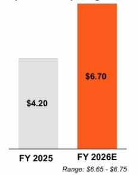

- 营收增加
- AOP 利润率扩张
- 税率逆风

## 净销售额

增加约 37.7 亿美元
同比增长约 37%
较原指引增加约 2.5 亿美元

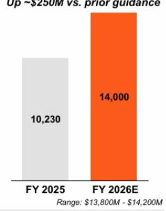
- 有机销售约 31% (1)，并购约 5%，汇率约 1%
- 有机销售增长：美洲 30 多，APAC 30 出头，EMEA 低个位数

## 调整后营业利润

较原指引增加约 1.25 亿美元

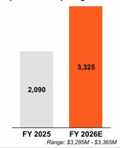
- 在 31% 有机销售增长和持续运营杠杆推动下，调整后营业利润率扩张约 340 个基点
- 预计持续强劲的生产效率和价格-成本正价差，抵消关税逆风

## 调整后营业利润率

提升约 340 个基点
较原指引提升约 50 个基点

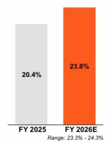

调整后自由现金流
增加约 6.13 亿美元
同比增长约 32%
较原指引增加约 3 亿美元

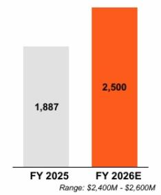
+ 调整后营业利润增加约 12.35 亿美元
+ 现金利息约 6,000 万美元
- 净资本支出增加约（3.33 亿美元）
- 现金税增加约（3.02 亿美元）
- 营运资本及其他约（4,700 万美元）

## 上调关键指标展望，2026 年有望实现强劲业绩

© 2026 Vertiv. 版权所有。10

来源：公司演示文稿

---

## 图表 9：VRT 关键要点

## 关键要点

## 第二季度表现强劲：

调整后稀释每股收益 • 调整后营业利润率 • 调整后营业利润均超出指引

## 投资增长：

持续投资于产能、创新和服务，随需求不断扩展并支持长期增长

## 收购增强热管理领先地位：

ThermoKey (1) 和 Strategic Thermal Labs (2) 扩展了我们在散热、服务器侧液冷和冷板技术方面的产品组合

## 上调 2026 年指引：

调整后稀释每股收益 • 净销售额 • 调整后营业利润 • 调整后自由现金流

## 合作亮点

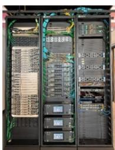

Vertiv 基础设施助力 NVIDIA AI 计算能力落地海军研究生院（NPS）

- 在现有设施内交付集成电力、液冷、机架和服务，支持 NPS 先进的本地区 AI 环境（搭载 NVIDIA DGX GB300）
- 可复制的参考架构，采用 Vertiv™ SmartIT 多机架集成 AI 基础设施配置

## 客户项目亮点

Vertiv 端到端电力链、热管理链和服务助力 Data4 在法兰克福园区建设首个数据中心

- 欧洲数据中心运营商选择 Vertiv 基础设施，为其德国站点服务主要云服务提供商租户
- Vertiv 解决方案包括中压和低压开关设备、UPS 和电池系统、冷冻水机组、自然冷却冷水机组和服务

## 2026 年表现强劲——为多年增长做好充分准备

(1) 2026 年 6 月 12 日，Vertiv 宣布完成对 ThermoKey 的收购。
(2) 2026 年 4 月 27 日，Vertiv 宣布完成对 Strategic Thermal Labs 的收购。
注：参见附录第 12 页开始的"非 GAAP 财务指标"。

来源：公司演示文稿

---

## 财务图表

**图表 10：VRT 营收**
十亿美元
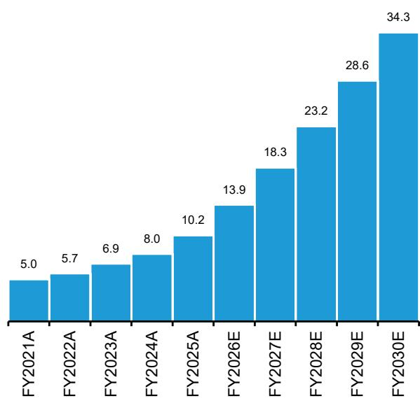
来源：公司报告、Bernstein 估计与分析

**图表 11：VRT 分地区营收**
十亿美元
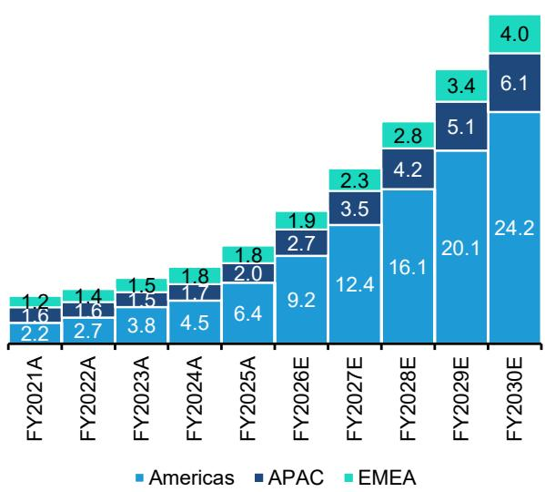
来源：公司报告、Bernstein 估计与分析

**图表 12：VRT 美洲分部门营收**
十亿美元
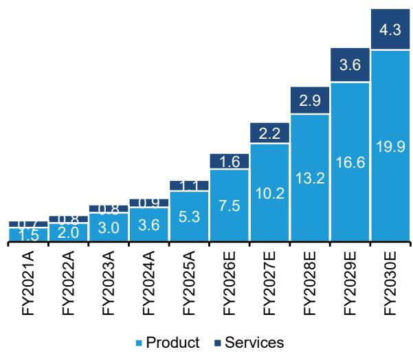
来源：公司报告、Bernstein 估计与分析

**图表 13：VRT EMEA 分部门营收**
十亿美元
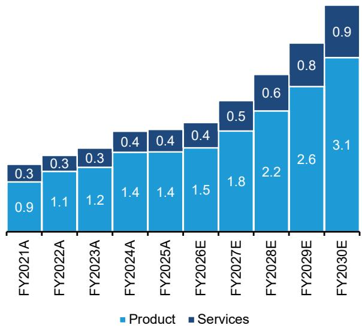
来源：公司报告、Bernstein 估计与分析

**图表 14：VRT APAC 分部门营收**
十亿美元
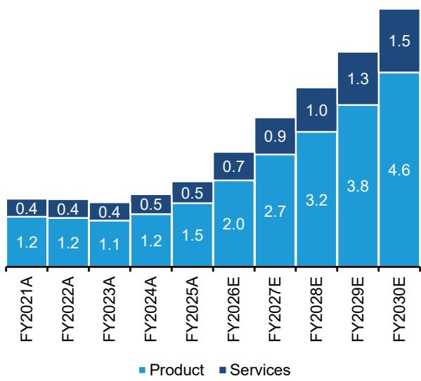
来源：公司报告、Bernstein 估计与分析

**图表 15：VRT 毛利润和毛利率**
十亿美元
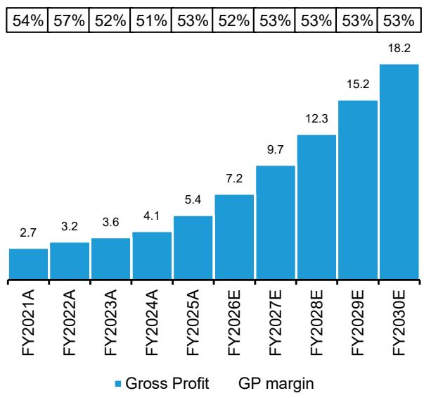
来源：公司报告、Bernstein 估计与分析

**图表 16：VRT 调整后 EBITDA 及调整后 EBITDA 利润率**
十亿美元
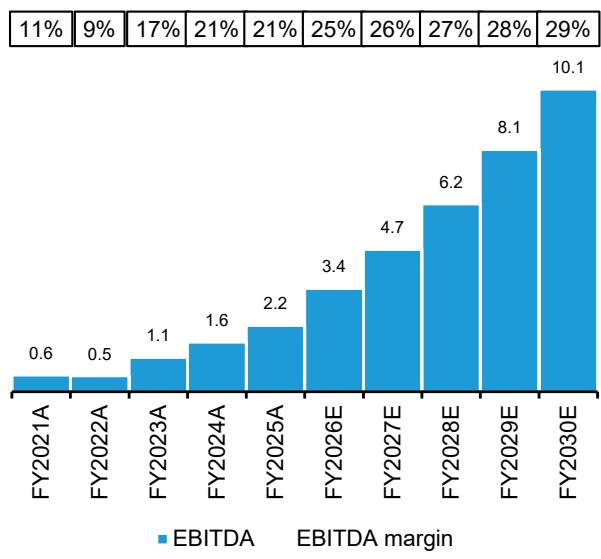
来源：公司报告、Bernstein 估计与分析

**图表 17：VRT 调整后 EBIT 及调整后 EBIT 利润率**
十亿美元
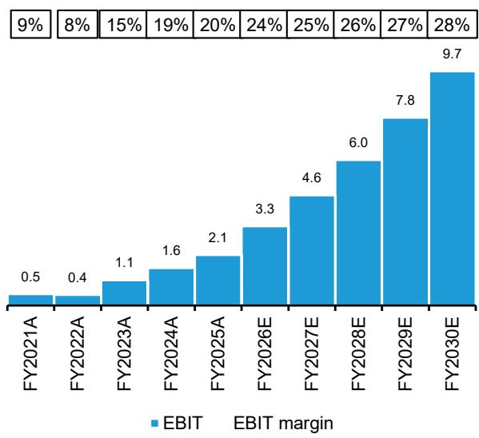
来源：公司报告、Bernstein 估计与分析

**图表 18：VRT 分地区 EBIT**
十亿美元
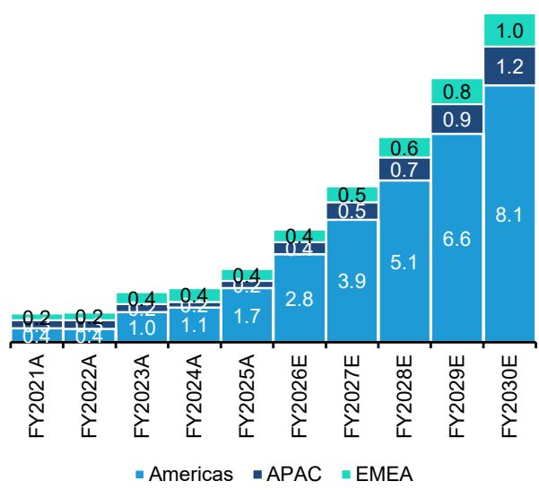
来源：公司报告、Bernstein 估计与分析

**图表 19：VRT 调整后净利润及净利润率**
十亿美元
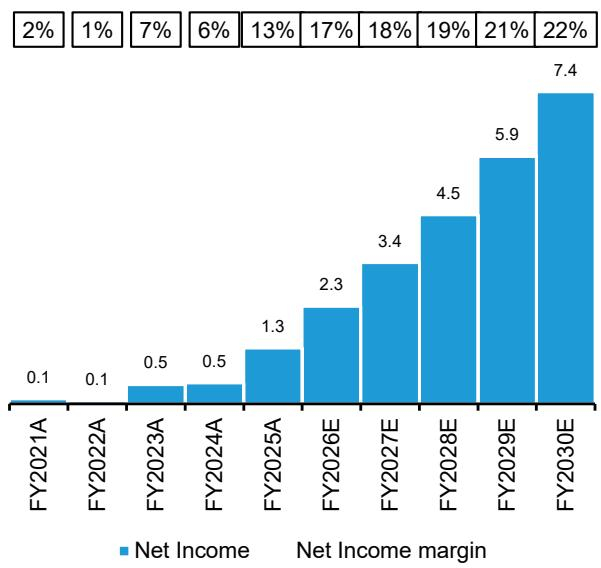
来源：公司报告、Bernstein 估计与分析

**图表 20：VRT 调整后每股收益**
美元
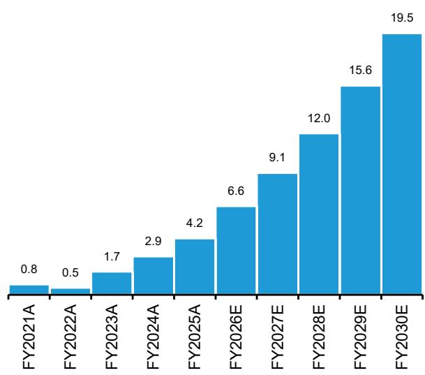
来源：公司报告、Bernstein 估计与分析

**图表 21：VRT ROIC**
%
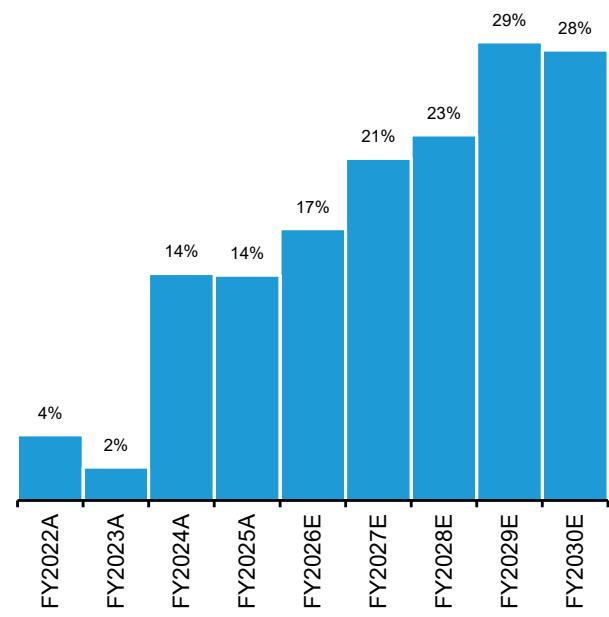
来源：公司报告、Bernstein 估计与分析

---

## 附录——财务预测

**图表 22：VRT 财务摘要**

| 利润表（百万） | FY2021A | FY2022A | FY2023A | FY2024A | FY2025A | FY2026E | FY2027E | FY2028E | FY2029E | FY2030E |
|---|---|---|---|---|---|---|---|---|---|---|
| 美洲 | 2,188 | 2,729 | 3,845 | 4,501 | 6,386 | 9,182 | 12,396 | 16,115 | 20,144 | 24,172 |
| APAC | 1,609 | 1,601 | 1,528 | 1,718 | 2,019 | 2,720 | 3,536 | 4,243 | 5,092 | 6,110 |
| EMEA | 1,202 | 1,362 | 1,491 | 1,793 | 1,824 | 1,949 | 2,339 | 2,806 | 3,368 | 4,041 |
| 总营收 | 4,998 | 5,692 | 6,863 | 8,012 | 10,230 | 13,851 | 18,270 | 23,164 | 28,603 | 34,323 |
| 总毛利润 | 2,700 | 3,219 | 3,576 | 4,099 | 5,447 | 7,237 | 9,667 | 12,273 | 15,165 | 18,197 |
| 美洲 | 441 | 426 | 959 | 1,098 | 1,714 | 2,785 | 3,884 | 5,129 | 6,597 | 8,140 |
| APAC | 253 | 274 | 249 | 175 | 222 | 379 | 550 | 723 | 944 | 1,225 |
| EMEA | 218 | 235 | 380 | 439 | 377 | 401 | 499 | 641 | 820 | 1,045 |
| 其他 | (224) | (261) | (154) | 279 | 153 | 130 | 134 | 178 | 248 | 358 |
| 基础 EBIT | 471 | 439 | 1,054 | 1,552 | 2,090 | 3,293 | 4,567 | 6,030 | 7,790 | 9,723 |
| EBIT 利润率-美洲 | 20.2% | 15.6% | 24.9% | 24.4% | 26.8% | 30.3% | 31.3% | 31.8% | 32.8% | 33.7% |
| EBIT 利润率-APAC | 15.7% | 17.1% | 16.3% | 10.2% | 11.0% | 13.9% | 15.5% | 17.0% | 18.5% | 20.0% |
| EBIT 利润率-EMEA | 18.1% | 17.2% | 25.5% | 24.5% | 20.7% | 20.6% | 21.3% | 22.8% | 24.3% | 25.8% |
| 集团 EBIT 利润率 | 9.4% | 7.7% | 15.3% | 19.4% | 20.4% | 23.8% | 25.0% | 26.0% | 27.2% | 28.3% |
| 股东净利润 | 120 | 77 | 460 | 496 | 1,333 | 2,326 | 3,362 | 4,504 | 5,891 | 7,431 |
| 稀释后基础每股收益（美元） | 0.78 | 0.53 | 1.73 | 2.86 | 4.20 | 6.60 | 9.06 | 12.01 | 15.56 | 19.45 |
| 稀释后流通股数（百万） | 360 | 378 | 386 | 386 | 391 | 393 | 393 | 393 | 393 | 393 |

| 资产负债表（百万） | FY2021A | FY2022A | FY2023A | FY2024A | FY2025A | FY2026E | FY2027E | FY2028E | FY2029E | FY2030E |
|---|---|---|---|---|---|---|---|---|---|---|
| 固定资产 | 489 | 489 | 560 | 625 | 922 | 1,393 | 1,771 | 2,251 | 2,836 | 3,524 |
| 其他非流动资产 | 3,752 | 3,937 | 3,997 | 4,031 | 5,393 | 6,001 | 6,145 | 6,387 | 6,812 | 7,361 |
| 其他流动资产 | 2,260 | 3,159 | 4,002 | 5,102 | 6,820 | 10,262 | 15,555 | 22,010 | 29,910 | 39,345 |
| 现金及现金等价物 | 439 | 261 | 780 | 1,228 | 1,728 | 2,623 | 5,763 | 9,821 | 15,061 | 21,707 |
| 总资产 | 6,940 | 7,096 | 7,999 | 9,133 | 12,212 | 16,262 | 21,700 | 28,397 | 36,722 | 46,706 |
| 流动负债（不含债务） | 1,833 | 1,876 | 2,284 | 3,076 | 4,386 | 6,173 | 8,282 | 10,514 | 12,992 | 15,590 |
| 总债务 | 2,972 | 3,191 | 2,941 | 2,928 | 2,913 | 2,940 | 2,940 | 2,940 | 2,940 | 2,940 |
| 非流动负债（不含债务） | 717 | 587 | 759 | 694 | 972 | 961 | 961 | 961 | 961 | 961 |
| 总权益 | 1,418 | 1,442 | 2,015 | 2,434 | 3,941 | 6,189 | 9,518 | 13,982 | 19,829 | 27,215 |
| 总权益和负债 | 6,940 | 7,096 | 7,999 | 9,133 | 12,212 | 16,262 | 21,700 | 28,397 | 36,722 | 46,706 |
| 净债务 | 2,533 | 2,930 | 2,161 | 1,701 | 1,185 | 317 | (2,823) | (6,881) | (12,122) | (18,767) |
| 净债务/EBITDA | 4.6倍 | 5.6倍 | 1.9倍 | 1.0倍 | 0.5倍 | 0.1倍 | -0.6倍 | -1.1倍 | -1.5倍 | -1.9倍 |
| 基础 ROIC |  | 4% | 2% | 14% | 14% | 17% | 21% | 23% | 29% | 28% |

| 现金流量表（百万） | FY2021A | FY2022A | FY2023A | FY2024A | FY2025A | FY2026E | FY2027E | FY2028E | FY2029E | FY2030E |
|---|---|---|---|---|---|---|---|---|---|---|
| 基础 EBITDA | 554 | 526 | 1,143 | 1,644 | 2,198 | 3,434 | 4,737 | 6,246 | 8,062 | 10,065 |
| 营运资本 | (133) | (449) | 67 | 114 | 365 | (856) | (44) | (164) | (182) | (191) |
| 净资本支出 | (73) | (100) | (128) | (167) | (220) | (563) | (548) | (695) | (858) | (1,030) |
| 其他现金变动 | (443) | (151) | (567) | (1,148) | (1,786) | (1,117) | (1,004) | (1,329) | (1,782) | (2,199) |
| 现金及现金等价物变动 | (95) | (174) | 515 | 444 | 558 | 898 | 3,141 | 4,058 | 5,240 | 6,645 |

来源：彭博、公司报告、Bernstein 估计与分析

---

## BERNSTEIN 代码表

|  |  |  | 2026年7月30日 |  | TTM |  | 调整后每股收益 |  |  | 调整后市盈率（倍） |  |  |
|---|---|---|---|---|---|---|---|---|---|---|---|---|
|  |  |  | 收盘价 | 目标价 | 相对表现 |  |  |  |  |  |  |  |
| 代码 | 评级 | 货币 | 当前 | 当前 |  | 2025A | 2026E | 2027E | 2025A | 2026E | 2027E |
| VRT（Vertiv） | O | 美元 | 227.50 | 368.00 | 40.9% | 美元 | 4.20 | 6.60 | 9.06 | 54.2 | 34.5 | 25.1 |
| 原预测 |  |  |  | 416.00 |  |  |  | 6.52 | 9.21 |  |  |  |
| SPX |  |  | 7,437.63 |  |  |  |  |  |  |  |  |  |

**目标价变动 / 预测变动以粗体标示**

O - 跑赢大盘，M - 与大盘一致，U - 跑输大盘，NR - 未评级，CS - 暂停覆盖
来源：彭博、Bernstein 估计与分析。

---

## I. 必要披露

本披露中提及的"Bernstein"或"本公司"指以下实体：Bernstein Institutional Services LLC（2024年4月1日起）、Bernstein & Co., LLC（2024年4月1日前）、Bernstein Autonomous LLP、BSG France S.A.（2024年4月1日起）、Bernstein (Hong Kong) Limited 盛博香港有限公司、Bernstein (Canada) Limited、Bernstein (India) Private Limited（SEBI 注册号 INH000006378）、Bernstein (Singapore) Private Limited、Bernstein Japan KK（サンフォード・C・バーンスタイン株式会社）以及根据 Bernstein 与 SG 之间的全球服务协议为 Bernstein 编制研究报告的 SG Africa Technologies & Services 所聘用的分析师。

Bernstein 是 SG（SG）与 AllianceBernstein, L.P.（AB）合资企业的一部分。除非另有特别说明，就本披露而言，提及 Bernstein 的"关联方"均指 SG 和 AB 及其各自的关联公司。

---

## 估值方法

## Vertiv Holdings Co

我们以 27 倍 NTM + 1 EBITDA（53 亿美元）对 Vertiv 进行估值，得出目标价 368 美元。

---

## 风险

## Vertiv Holdings Co

下行风险：（i）效率提升至冷却需求减少的程度；（ii）数据中心扩张意外放缓；（iii）从 NVIDIA 芯片向定制芯片的转变速度快于预期（因 Vertiv 与 NVIDIA 的紧密合作关系而受影响）；（iv）如果 Vertiv 无法快速反应，技术转向离开 DTC / 800 VDC。

---

## 评级定义、基准和分布

## 股票评级定义

## Bernstein 品牌

Bernstein 品牌根据未来 12 个月相对表现的预测对股票进行评级：美国和加拿大交易所上市股票对标 S&P 500；欧洲交易所和亚太以外新兴市场交易所上市股票对标 Bloomberg Europe Developed Markets Large and Mid Cap Price Return Index EUR (EDME)；日本交易所上市股票对标 Bloomberg Japan Large and Mid Cap Price Return Index USD (JPL)；亚洲（除日本）交易所上市股票对标 Bloomberg Asia ex-Japan Large and Mid Cap Price Return Index (ASIAX)——除非另有说明。

Bernstein 品牌有三个评级类别：

- **跑赢大盘**：股票将跑赢市场指数超过 15 个百分点
- **与大盘一致**：股票将与市场指数表现一致，在 +/-15 个百分点以内
- **跑输大盘**：股票将跑输市场指数超过 15 个百分点

**暂停覆盖**：Bernstein 品牌下对某公司的覆盖已暂停。评级和目标价暂时中止，不再有效，不应依赖。

**未评级**：当股票目前无法被准确估值或公司表现无法被准确预测时指定的评级。覆盖分析师可能继续发布关于该公司的研究报告，向读者更新事件和进展。

**未覆盖（NC）** 表示不在覆盖范围内的公司。

Bernstein 品牌股票评级基于 12 个月时间跨度。

## Autonomous 品牌——普通股

Autonomous 品牌按如下方式对普通股进行评级。我们使用的基准为：欧洲发达市场银行和支付行业使用 Bloomberg Europe 600 Financials Price Return Index (E600BK) 和 Bloomberg Europe Dev Mkt Financials Large and Mid Cap Price Ret Index EUR (EDMFI)；欧洲保险公司使用 Bloomberg Europe 600 Insurance Price Return Index (E600IN)；美国银行和支付覆盖使用 S&P 500 和 S&P Financials；美国保险使用 S5LIFE；美国非寿险公司覆盖使用 S&P Insurance Select Industry (SPSIINS)；新兴市场银行、保险公司和支付行业使用 Bloomberg Emerging Markets Financials Large, Mid and Small Cap Price Return Index (EMLSF)；日本金融业使用 Bloomberg Japan Financials Large & Mid Cap Price Return Index (JPFILM)。评级相对于行业（而非
