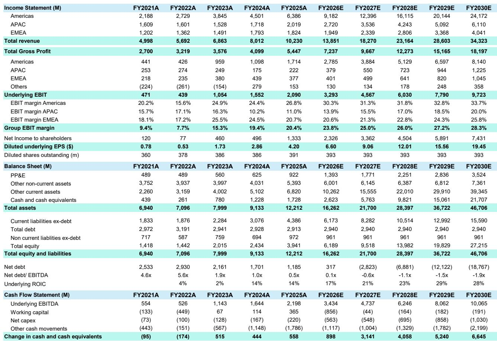
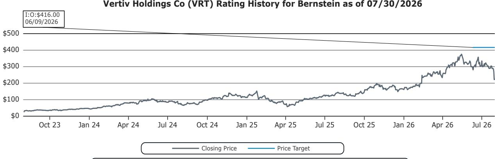

# Vertiv的光环有所消退，但底层业务仍具持有价值

Vertiv Holdings公布2026年第二季度营收为33亿美元，较市场一致预期低约1亿美元，有机增长率为18%，而此前市场预期接近30%。财报公布后公司股价下跌18%，对于这家在过去两年中凭借在AI基础设施建设中的出色执行而建立声誉的公司而言，这是一次剧烈的预期修正。此次业绩未达预期并非需求问题，而是供应链问题——具体而言是预制模块化解决方案方面的供应链瓶颈——同时也暴露了第二个更具战略性的薄弱环节：Vertiv在800V直流固态变压器的开发上似乎落后于以电力为核心的同行，而该技术对下一代AI数据中心架构至关重要。

市场的反应所传递的信号比单季度的失望更为深层。Vertiv已失去光环效应——即作为本十年最关键基础设施建设中不可或缺且执行最佳的供应商所享有的估值溢价。这一光环在峰值时期对应约40倍EV/NTM EBITDA，目前则降至约22倍。读者面临的问题是：当前折价反映的是暂时性的运营失误，还是将持续到公司证明其能重拾执行优势的结构性重新定价。

答案需要细致分析。需求背景依然强劲，本季度递延收入激增超过12亿美元，意味着订单量强劲，将在2027年转化为收入。公司上调了全年收入、每股收益、营业利润和自由现金流指引。调整后每股收益为1.52美元，超出预期0.10美元；调整后营业利润率为22.6%，较预期高出100个基点。这不是一家陷入困境的公司，而是一家失去了市场信任的公司。在一个AI基础设施标的既看基本面也看叙事的市场中，失去信任可能与失去客户同样代价高昂。

当前的研究逻辑基于一个简单的命题：Vertiv是一家以合理估值交易的优秀企业，但其溢价估值需要公司近期尚未展现的执行力来支撑。未来两个季度将决定这是一个买入机会还是一个价值陷阱。

## 18%的有机增长未达预期是供应链问题，而非需求问题——这一区别对重新定价至关重要

本季度最重要的数字不是1.52美元的每股收益超预期或22.6%的营业利润率，而是18%的有机增长率——这一数字远低于分析师设定的约30%的目标，也低于管理层此前提供的20%中段指引。未达预期主要集中在美洲——该公司最大也最重要的区域——管理层将其归因于预制解决方案的供应链拥堵，具体涉及SmartRun和OneCore模块化产品线。

这些产品是Vertiv价值主张的战略核心。预制模块化单元将电力、冷却和机架基础设施整合为工厂集成解决方案，大幅减少超大规模数据中心运营商的现场安装时间。它们比单独的UPS设备或冷却系统等单点解决方案具有更高的价值、更高的利润率和更强的差异化。同时，它们的制造也复杂得多，供应链涉及多层供应商，组件必须按精确顺序到位。任何一个组件的延迟——开关柜面板、冷却歧管、控制系统——都可能导致价值数百万美元的整个模块化单元停滞。

管理层的评论表明公司正在增加产能以解决这些瓶颈，系统中也存在一定的容错空间。但第二季度的指引中也包含了容错空间，而这并不足够。公司目前指引第三季度有机增长率为35%，第四季度隐含增长率超过40%，这是一个显著的跃升，要求供应链问题在一个季度内基本解决。

这种怀疑是合理的。此类供应链问题很少能在一个季度内解决。它们需要供应商认证、生产线重新平衡，通常还需要设计修改以适应替代组件。管理层未提供如何解决问题的具体细节——仅表示正在努力——这并不令人振奋。研究范围内大多数涉及数据中心的公司在收入转化上也偏重下半年，但大多数都完成了第二季度的目标。Vertiv没有，这一区别很重要。

这并不意味着Vertiv将无法完成全年指引。公司将全年收入中点上调了2.5亿美元至140亿美元，下半年偏重的分布与行业典型的季节性模式一致。这意味着市场不能再假设Vertiv会完美执行。公司已在其自身叙事中引入了不确定性，而不确定性正是压缩溢价倍数的因素。

## Vertiv在800V直流固态变压器方面的落后是战略薄弱点，而不仅仅是产品开发时间线问题

供应链未达预期是股价下跌的直接原因，但更令人担忧的是公司在800V直流电力架构方面的位置。管理层承认其固态变压器（SST）仍处于产品开发阶段，而同行已在与超大规模客户测试SST。这是一项对下一代AI数据中心设计至关重要的技术，存在显著的竞争差距。

800V直流架构代表了数据中心供电方式的根本性转变。传统设计使用480V交流配电，包含多个转换级，每一级都会引入效率损失和热量。800V直流架构消除了其中几个转换级，提高了效率，减少了热量产生，并在机架中实现更高的功率密度。对于将功耗推向前所未有水平的AI工作负载——单个GB300 NVL72机架可消耗超过100kW——800V直流的效率提升不是渐进式的，而是关键性的。

SST是该架构的关键使能组件。它用高频固态器件取代传统的低频变压器，可以更高效、更可控地转换电压等级。该技术复杂，需要先进的电力电子技术、精密的控制算法和严格的可靠性测试。在数据中心环境中出错是不可接受的，超大规模客户对在关键基础设施中部署未经验证的技术持谨慎态度是可以理解的。

Vertiv在该技术上的位置因其传统而复杂。该公司是一家电力和冷却专家，已扩展至完整的数据中心基础设施解决方案，但其根基在于热管理和UPS系统。在电力电子领域有更深厚专业知识的同行——历史上专注于电力转换和配电的公司——在SST开发方面似乎走得更前。有些已在与超大规模客户测试，这表明他们在这一将在2028年及以后成为数据中心设计核心的技术上领先12至18个月。

这一落后对近期收入的影响有限。公司仍预计800V直流将在2028年实现规模应用，Vertiv有时间开发和验证其产品。但战略影响是显著的。Vertiv的溢价估值部分得益于其在研发方面的卓越声誉和保持在技术曲线前沿的能力。SST的落后削弱了这一叙事，并引发了对公司能否保持作为超大规模客户首选合作伙伴地位的质疑——这些客户在其基础设施中越来越要求800V直流能力。

市场对这一消息的反应具有说明性。财报电话会议上管理层回答的简短，以及SST开发时间线细节的缺乏，无助于改善读者情绪。在一个AI基础设施标的以叙事和技术领先认知进行交易的市场中，在关键技术上落后是一种无法通过当前季度强劲盈利完全抵消的负担。

## 递延收入表明订单强劲，但转化时间线意味着2026年收入不会受益

本季度较为积极的数据点之一是递延收入的显著增长。Vertiv不再披露季度订单，因此读者越来越多地将递延收入作为订单增长的代理指标，因为它包含新项目的客户预付款和基于里程碑的付款。第二季度增长超过12亿美元，而通常每季度为几亿美元，这意味着订单量大幅加速。

这确实是积极的消息。它表明对Vertiv产品的需求依然强劲，供应链问题并未阻止客户下单。公司的管道评论支持这一观点，管理层指出美洲、EMEA和APAC所有区域均保持强劲势头，定价环境有利且持续超过通胀。

挑战在于转化时间线。假设从下单到收入确认之间大约12个月，2026年第二季度递延收入的激增不会对2026年收入产生实质性影响。它将在2027年体现，这支持了公司的多年增长叙事，但对解决当前拖累股价的近期供应链担忧帮助有限。

这创造了一个有趣的动态。市场同时关注近期执行疲弱（18%的有机增长未达预期和下半年偏重的指引）和中期需求强劲（递延收入激增和管道评论）。这两个信号之间的张力使得当前估值讨论如此引人关注。

看多者会认为递延收入激增验证了长期论点，供应链问题是暂时的。看空者会认为供应链问题是运营能力不足的证据，将持续存在，如果公司无法解决制造瓶颈，递延收入转化可能会延迟。两种论点都有道理，结果将取决于公司未来两个季度的执行情况。

## 估值重置反映了信心流失，没有多个季度出色表现，股价不太可能回到峰值倍数

Vertiv的估值经历了剧烈重置。在其完美执行期间，股价曾达到约55倍前瞻市盈率和40倍EV/NTM EBITDA的峰值倍数。目前交易价格约为22倍EV/NTM EBITDA，介于此前32倍的假设与当前市场倍数之间。

倍数压缩并非不合理。它反映了市场对公司风险状况评估的根本变化。供应链问题引入了此前未定价的执行风险。SST落后引入了此前未被承认的竞争风险。财报日18%的跌幅表明，许多因溢价执行叙事而持有该股的读者已经离场，可能对回归持谨慎态度。

问题在于当前倍数是否充分补偿了读者这些风险。以27倍EV/NTM EBITDA计算，该股在相对意义上并不便宜，但相对于其增长概况是合理的。今年每股收益预计增长超过60%，卖方预期FY27盈利增长超过40%，FY28超过20%，且公司正在上调所有关键指标的指引。公司产生了12.35亿美元的额外调整后营业利润，将2026年销售额的约4%投入资本支出，并完成了两项收购——ThermoKey和Strategic Thermal Labs——扩展了其热管理能力。

该股可能在某种程度上已过度修正，有合理论点认为当前价格对12至24个月投资期限的读者而言是一个有吸引力的入场点。但回到峰值倍数的路径并不简单。公司需要几个季度的出色执行来重建已失去的信心。需要提供关于如何解决供应链问题的可信细节。还需要展示SST开发时间线的进展。

这些都不是不可能的，但也不能保证。市场已被灼伤一次，在恢复溢价倍数之前需要令人信服的证据。

## 读者的决策框架：区分公司与股票，根据执行里程碑选择入场时机

对于考虑建仓Vertiv的读者，当前情况需要一个纪律性的框架，将业务质量与股票时机分开。

首先，评估需求背景。递延收入激增和所有区域的管道评论提供了有力证据，表明对Vertiv产品的需求依然强劲。公司正在上调指引，定价保持有利，AI基础设施建设的长期驱动力完好。这是一个未被破坏的需求故事。

其次，评估执行风险。供应链问题是主要的近期担忧，且尚未被完全理解。管理层未提供如何解决瓶颈的具体细节，此类供应链问题通常需要超过一个季度才能解决。公司指引第三季度有机增长率为35%，第四季度超过40%，这需要执行力的显著提升。如果公司未达到这些数字，股价可能面临进一步压力。

第三，关注竞争位置。SST落后是一个战略担忧，不会在未来一两个季度内解决。公司有时间开发产品，但落后于同行，市场将关注任何差距扩大或缩小的证据。即将举行的会议上的管理层评论将是评估进展的关键。

第四，考虑估值。以27倍EV/NTM EBITDA计算，该股较峰值倍数有显著折价，但相对意义上并不便宜。折价反映了上述执行和竞争风险，在公司展现持续改善之前不太可能收窄。没有几个季度的出色执行和SST方面的明确进展，该股不太可能回到峰值倍数。

第五，考虑转化时间线。递延收入激增将在2027年开始转化为收入，这提供了强劲的中期增长背景。对于12至24个月投资期限的读者，如果公司能完成近期指引，这将创造有利的布局。对于较短期限的读者，下半年偏重的指引和供应链不确定性创造了更具挑战性的环境。

该框架最终归结为一个信心问题。公司并未受损，需求故事完好。但光环效应已消失，重建需要时间和证据。相信管理层能解决供应链问题并完成下半年偏重指引的读者会发现当前估值具有吸引力。对执行叙事信心不足的读者可能希望等待改善的证据后再投入资金。

未来两个季度将是决定性的。第三季度指引意味着有机增长率显著提升，第四季度指引意味着更大的加速。如果公司完成这些数字，股价可能会回升。如果再次未达预期，倍数可能会进一步压缩。第二季度的证据并不令人鼓舞，但也不足以否定。Vertiv仍然是一家优秀的公司，但它现在必须证明自己仍然是一只优秀的股票。

仅供参考。部分内容可能基于原始材料由AI辅助生成、翻译、总结或编辑，可能包含遗漏或错误。请独立核实。本文不构成投资、法律、税务、会计或其他专业建议。

