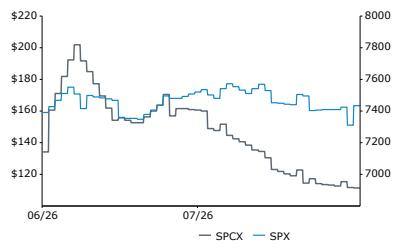
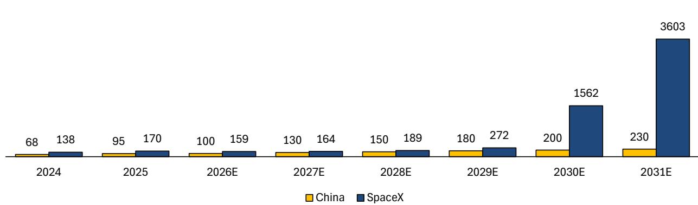
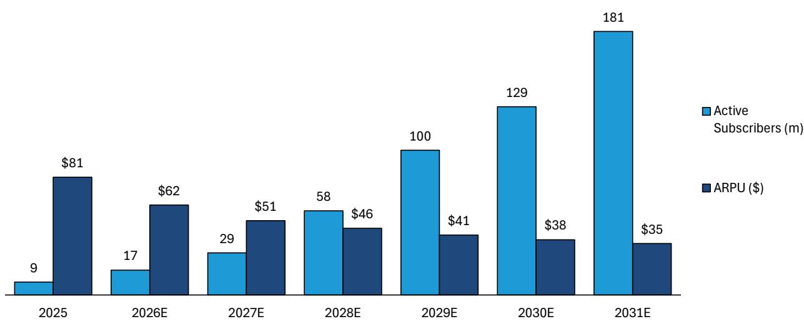
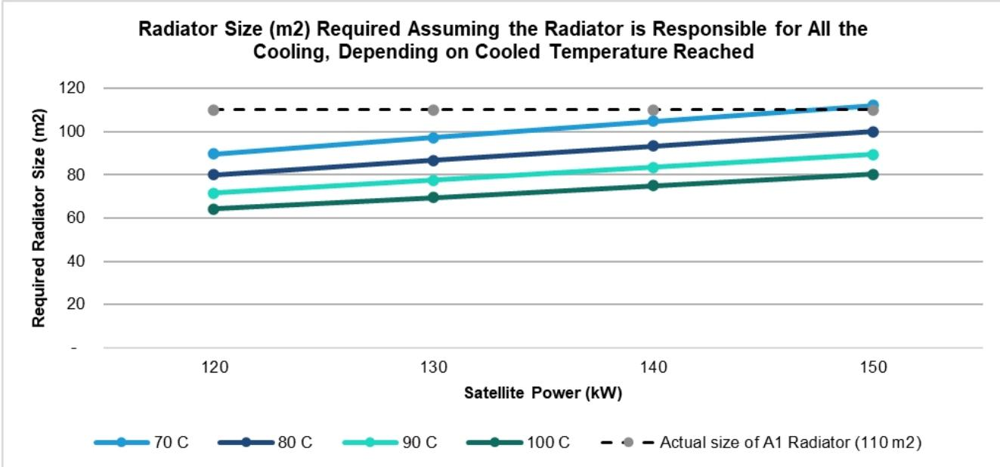
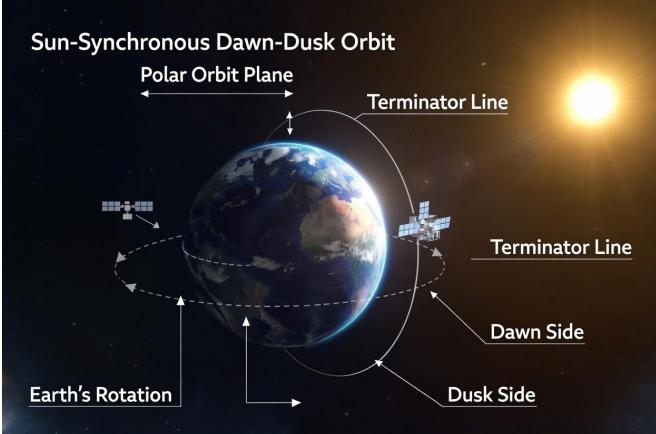
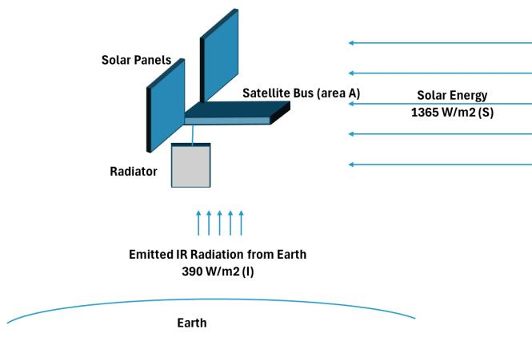
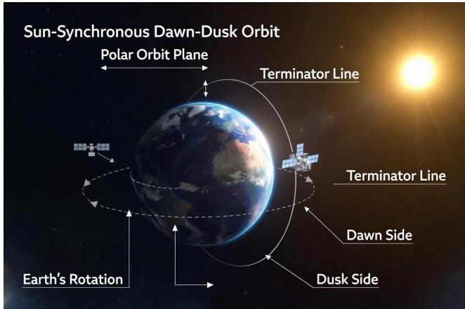
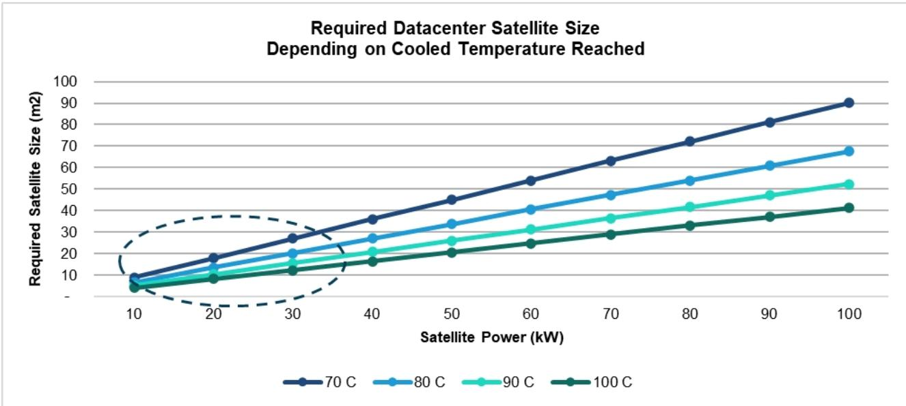
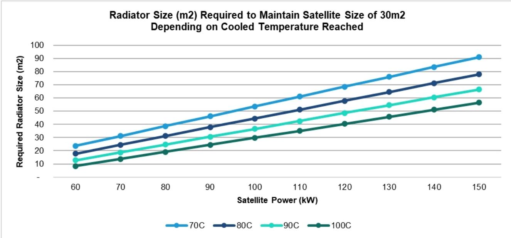

# SpaceX：市场关注的核心议题与读者观点梳理

**评级：跑赢大盘 | 目标价：239.00 美元**

---

## 核心观点

自SpaceX于2026年6月12日上市以来，我们持续与读者就公司的长期发展前景进行交流。近期公司报价经历了上市高点后的明显回落，市场波动较大。本文梳理了读者围绕公司基本面提出的核心问题——这些问题的关键在于SpaceX能否将数千颗卫星送入轨道，构建轨道数据中心星座。

我们认为有四个议题对SpaceX的价值评估至关重要：最重要的是实现星舰（Starship）的快速重复使用；另外三个分别是充足的半导体产能、监管流程的推进，以及算力需求的持续高企。此外，有三个话题虽引发合理讨论，但对SpaceX的核心价值主张影响相对有限：来自中国的竞争威胁、星链（Starlink）全球宽带的市场吸引力，以及公司直连设备移动方案的可行性——对于最后一点，我们同样对移动业务的潜力持保留态度。最后，我们梳理了四个关于轨道数据中心技术可行性的质疑点，这些均不构成实质性障碍，包括数据中心卫星的散热能力、太阳能来源、微陨石撞击防护，以及天基数据中心的延迟问题。

SpaceX将于8月4日收盘后发布上市以来首份财报。我们认为单季度数据本身并不重要，关键在于管理层对增长路径所展现的信心程度。读者应关注长期价值逻辑，而非短期报价波动——轨道数据中心计划对应的估值空间，核心在于"能否实现"而非"何时实现"。

## 研究逻辑

我们采用分部估值法，基于2031年各业务板块的EBITDA进行估值，假设轨道数据中心发射延迟一年，对连接业务和AI业务分别采用25%和35%的后期风投折现率，得出目标价239美元。

| 调整后每股收益 | F25A | F26E | F27E |
|---|---|---|---|
| SPCX（美元） | -- | (0.18) | 0.83 |

数据来源：Bloomberg、Bernstein估计与分析

| 关键数据 | |
|---|---|
| 报告日期 | 2026年7月30日 |
| SPCX收盘价（美元） | 112.20 |
| 目标价（美元） | 239.00 |
| 上行空间 | 113% |
| 52周区间 | 225.64/107.01 |
| SPX | 7,437.63 |
| 财年截止 | 12月 |
| 股息率 | 不适用 |
| 市值（十亿美元） | 1,476.46 |
| EV（十亿美元） | 1,490.10 |

| 表现 | 年初至今 | 1个月 | 6个月 | 12个月 |
|---|---|---|---|---|
| 相对表现（%） | 不适用 | (34.3) | 不适用 | 不适用 |
| SPX（%） | 8.6 | (0.8) | 7.2 | 16.9 |
| 相对表现（%） | 不适用 | (33.5) | 不适用 | 不适用 |

数据来源：Bloomberg、Bernstein估计与分析
价格表现，1年

| 估值指标 | F25A | F26E | F27E |
|---|---|---|---|
| 调整后市盈率（x） | | (608.1) | 136.0 |
| EV/调整后EBITDA（x） | 226.3 | 87.0 | 34.3 |

---

## 详细分析

自发布首份研究报告以来，读者几乎对故事的每个方面都提出了质疑——从美国多地发射的可行性，到轨道数据中心的散热 practicality。本文提炼了客户交流中的10个关键洞察。

## 增长模型的核心议题——成败攸关

### 1. 星舰火箭的重复使用——最关键的问题：隔热罩能否经受考验？

我们认为SpaceX价值主张的关键在于星舰火箭的重复使用。这已成为许多读者关注的重要议题，我们认为这理所应当。我们的模型假设2031年约有3,600次星舰发射（公司的预期远高于此），这只有通过完全可重复使用的火箭（两级均可回收）才能实现。截至目前，公司已成功将星舰V2助推器着陆在发射台上，但V3助推器尚未实现。7月20日完成的第13次发射基本成功，尽管部分发动机在溅落前未能点火。我们的假设是，助推器着陆和重复使用将像V2火箭一样得以实现。

第13次发射的重要成就在于星舰本身（第二级）的成功回收，隔热罩的完好程度远超此前几次发射。我们期待公司对星舰隔热罩损坏情况的评估。如果损坏程度较小，则公司已接近实现重复使用。第13次发射后，埃隆·马斯克表示SpaceX可能在第14次发射中尝试对第二级进行"筷子"式捕获。实现助推器（超重）和第二级（星舰）的捕获演示，是迈向快速重复使用这一关键成就的第一步。目前来看，进展良好，但仍有很长的路要走。实现我们的发射目标仍需至少每日一次的发射频率。发射频率还与发射台数量相关。目前有两座发射台，另有两座正在建设中。公司正在与各州政府协商确定未来五到六座发射台的选址。

### 2. 半导体供应——是否会限制增长？

SpaceX轨道数据中心建设所需的半导体产能是读者质疑的另一个领域。我们认为这是合理的担忧，但依然看到SpaceX能够逐步获得充足半导体供应的可信路径。

假设数据中心卫星采用类似架构，我们可以估算公司所需的半导体制造产能。这个数字并不小。我们的模型要求2031年部署约20吉瓦的增量轨道算力，按每颗卫星约120千瓦（当前AI1规格）计算，需要发射近17万颗卫星，对应每年约280万片晶圆的生产产能。按每座晶圆厂每月约5万片晶圆启动量计算，这相当于约5座专门服务SpaceX的半导体晶圆厂，未来几年内可能需要投入超过1,600亿美元（图表1）。这是一个庞大的数字，但并非不可能实现（尤其是部分产能可能仍由第三方提供），与公司当前的Terafab投资计划（截至本文撰写时约1,190亿美元的预测）相比也较为合理，只是在这一时间框架内实现如此规模的产能上线颇具挑战性，尤其是SpaceX此前并无相关经验。如果无法按时交付，公司将面临更大压力，需要从现有晶圆代工厂和存储厂商处获取大量增量产能。

**图表1：我们2031年的模型可能需要约5座专门服务SpaceX的半导体晶圆厂**

| 部署轨道算力（吉瓦/年） | 所需卫星数量（千颗，按每颗120千瓦计） | 所需晶圆数量（百万片/年，按每颗卫星17片计） | 所需新增晶圆厂数量（按每座5万片/月计） | 成本（十亿美元，按每座350亿美元计） |
|---|---|---|---|---|
| 5 | 42 | 0.7 | 1.2 | 41 |
| 10 | 83 | 1.4 | 2.4 | 83 |
| 15 | 125 | 2.1 | 3.5 | 124 |
| 20 | 167 | 2.8 | 4.7 | 165 |
| 25 | 208 | 3.5 | 5.9 | 207 |
| 30 | 250 | 4.3 | 7.1 | 248 |
| 35 | 292 | 5.0 | 8.3 | 289 |
| 40 | 333 | 5.7 | 9.5 | 331 |
| 45 | 375 | 6.4 | 10.6 | 372 |
| 50 | 417 | 7.1 | 11.8 | 414 |

数据来源：公司报告、Bernstein估计与分析

### 3. 监管因素是否会成为问题？

我们听到不少读者对SpaceX能否在加速推进愿景的同时保持合规表示怀疑。美国联邦航空管理局（FAA）必须批准每次星舰发射的飞行路径。截至目前，FAA尚未批准SpaceX进行轨道级星舰飞行。希望第14次发射能够进入轨道。但FAA需要进行环境评估，考虑对航线的影响以及潜在的环境损害和对野生动物（包括海洋生物）的风险。当前的环境评估有许多严格考量，8月3日是公众意见征询的截止日期。但本周FAA宣布将放宽环境限制，因为提高太空发射频率具有重要意义。与空中交通相关的评估将保留。虽然这些变化应能支持更多星舰发射，但当涉及数千次发射且可能出现支持力度较小的政府时，监管路径将如何发展尚不明朗。

美国联邦通信委员会（FCC）必须批准卫星通信计划。近期已批准了一个快速通道流程，但这不适用于SpaceX提出的超大型星座。最近的申报包括约10万颗卫星的星链V3星座提案，以及另一个潜在的大规模AI数据中心星座（最多约100万个单元），两者均尚未获得全面监管批准。SpaceX也在考虑通过渐进式步骤来提升星链的容量。

还有许多其他监管问题需要解决。每个国家都有自己的电信监管环境。数据主权是另一个重要议题。许多国家有防止数据存储在国外的规定。但轨道数据中心的主张在于，存储在太空中的数据不归属于任何国家，因此不存在数据主权问题。然而，太空作为数据存储位置最终将如何被对待，目前尚不明确。

### 4. 算力需求规模——AI算力是否存在泡沫？

轨道数据中心的需求始于一个假设：存在对算力能力的巨大需求。埃隆·马斯克曾表示，SpaceX最终将每年向太空发射1太瓦的算力。我们目前使用的计划要温和得多。但轨道数据中心项目的成功仍然取决于巨大的算力需求。迄今为止，我们从未见过全球出现算力过剩的情况。有可能为AI模型提供动力的产能建设过于激进。但即便如此，相对于地面算力，拥有更低成本的解决方案仍然具有价值。

## 合理质疑——但不改变核心价值主张

### 5. 来自中国的竞争上升

在我们与SpaceX管理层的交流中，中国被视为最严肃的竞争对手。该国拥有雄厚的资源，愿意用于实现太空领导地位。尽管如此，中国仍远远落后于SpaceX。

7月10日，中国成功实现了长征十号乙火箭第一级助推器的着陆回收。此后，许多读者就这一日益激烈的竞争和太空竞赛的重启向我们提问。我们认为中国是SpaceX的主要竞争对手。这次发射和回收比我们预期的提前了约六个月。中国正在积极推进月球研究站建设和大型低轨卫星星座部署。12月，中国向国际电信联盟（ITU）提交了在低地球轨道部署超过20万颗卫星的申请。尽管中国成功实现了长征十号乙的着陆，但仍远远落后于SpaceX。这是中国首次成功实现大型运载火箭助推器的着陆，尚未实现助推器的重复使用。SpaceX的猎鹰9号火箭已进行助推器重复使用近十年，去年完成了165次发射，这还需要强大的第二级生产线。要达到高发射量，中国需要展示重复发射能力并转向高节奏生产。最重要的是，长征十号仅实现第一级重复使用，而星舰的目标是完全重复使用（尚未实现）。

长征计划的关键部分是将人类送上月球（官方目标为2030年），最终建立月球研究站。SpaceX是美国国家航空航天局（NASA）太空计划的重要组成部分，该计划的目标是在2028年底前实现载人登月。这里正在形成一场新的太空竞赛，这可能会增加美国政府对SpaceX（以及蓝色起源和波音等其他公司）的支持。

正如我们在SpaceX首份研究报告中讨论的，我们认为短期内SpaceX在发射能力和卫星运营方面都没有真正的竞争对手。但考虑到中国的庞大资源和长期目标，中国必须被视为长期内的严肃竞争者。在我们看来，假设SpaceX能够成功实现其目标，中国仍落后SpaceX约十年左右。

**图表2：即使中国实现其雄心勃勃的目标（我们认为可能性很低），仍将明显落后于SpaceX**

低轨发射量：中国 vs. SpaceX

中国的远期目标代表政府支持的愿景性预测
数据来源：PayloadSpace、公司报告、AEI Space、Bernstein分析与估计

### 6. 星链宽带渗透——是否存在问题？

我们预期星链在消费、企业和政府宽带业务方面将实现快速增长。这里的主要质疑来自电信行业读者，他们认为地面光纤除农村用户外是更好的选择。较强大的应用场景将是那些没有有线或光纤覆盖的地区用户（星链在这些地区的份额可能接近100%），但我们预计郊区用户也会有更广泛的采用。尽管星链的延迟较高（往返约23毫秒），但即使对大多数游戏应用来说这也不是问题。调查显示，星链在所有消费宽带服务中拥有最高的客户满意度。此外，星链具有天然全球网络的优势，可以在几乎零额外成本的情况下在任何国家增加用户。这赋予了星链极大的定价灵活性。凭借目前9,600颗卫星的星座和计划中超过十倍的容量扩张，其他提供商远远无法企及。我们对全球用户数和ARPU的预测见图表3。

星链还具有支持企业和政府客户群的优势，这进一步摊薄了成本。美国政府投资于星链的国防版本（Starshield），而许多其他国家正在采用星链用于偏远地区监控、应急服务和边境管控（如英国、澳大利亚、乌克兰、日本、荷兰、波兰）。在企业方面，星链提供了其他服务所不具备的全球覆盖能力，此外还有竞争对手无法比拟的移动应用（如海事、航空）。对于宽带服务，我们预期这一已经高度盈利的业务将实现高增长。

星链对美国电信运营商的风险已由Bernstein美国电信团队强调：美国电信：调整目标价以反映星链风险（该报告因星链威胁而大幅下调了目标价）。

**图表3：星链ARPU随时间下降，因其加大国际扩张力度**

消费宽带活跃用户（百万）/ARPU（美元）

数据来源：公司报告、Bernstein分析与估计

### 7. 星链直连设备能否成功？路径尚不明朗

我们听到读者对SpaceX直连设备移动服务计划的强烈质疑。在这一点上，我们表示认同。我们对直连设备业务的展望远比SpaceX所描述的要保守。然而，就SpaceX的公司价值而言，这一业务的成功与否并非关键。最终，成功将主要取决于轨道数据中心，即本报告开头所讨论的核心议题。

SpaceX目前拥有一个相对较小的V1移动卫星网络，主要为移动网络运营商（MNO）提供盲区覆盖。公司的计划是用即将推出的V2卫星扩展这一网络。这些卫星的容量约为V1卫星的16倍，功率更高。这一新的V2移动网络预计将于2027年开始发射。

许多电信行业读者认为，由于卫星网络的技术限制以及需要地面能力来补充卫星星座，这一业务成功的可能性很低。公司正寻求与MNO达成协议，实际上成为移动虚拟网络运营商（MVNO）（类似Charter和Comcast的做法）。到目前为止，美国市场存在强烈抵制，尽管很有可能某一家运营商（如T-Mobile、AT&T或Verizon）会打破僵局与星链合作。但这一切都存在不确定性。在没有合作伙伴的情况下，SpaceX表示可以自建地面网络——我们认为这颇具挑战。

无论如何，我们同意持怀疑态度的读者的看法。这一业务将如何发展仍有待观察。但最终，我们认为这一业务成功与否对SpaceX的整体价值主张而言是次要的。

## 我们认为已解决的技术问题——但这些问题仍不断被提及

### 8. 数据中心散热——这不是问题！

关于天基数据中心散热的问题在我们的读者讨论中不断出现。首先，如果SpaceX的工程师忽略了这个问题，那将令人惊讶。尽管如此，我们在首份研究报告中通过明确建模相关的热传递动力学直接回应了这一问题。简而言之，我们得出结论：在轨道上为数据中心卫星散热在技术上是100%可行的。

鉴于两位资深分析师在进入证券行业前均为物理学博士，我们决定进行自己的分析。为评估可行性，我们分析了在太阳同步轨道上运行的典型数据中心卫星的热环境——该轨道可提供持续的太阳照射以实现稳定发电，同时专用散热器可消散废热。应用标准热传递原理，我们对机载发电、吸收热量和热辐射之间的平衡进行了建模。在太空真空中，热量通过辐射而非对流散失，因此散热能力主要取决于散热器表面积和工作温度。我们的分析表明，通过配备专用散热器，支持超过100千瓦计算负载的卫星可以在保持可接受的温度条件的同时，满足合理的发射约束。虽然仍存在重大的工程和执行挑战，但基本物理原理并不构成根本性障碍。因此，我们认为在轨冷却高功率AI数据中心卫星是可行的。热传递物理、假设、推导和敏感性分析的详细讨论见附录。

**图表4：我们的计算得出的散热器尺寸需求与公司为其AI1卫星提出的方案高度一致**

数据来源：公司报告、Bernstein分析

### 9. 轨道数据中心的太阳照射——是的，始终有阳光

有人对轨道数据中心的主要能源——太阳能——以及卫星只有大约一半时间暴露在阳光下的假设提出了担忧。这个假设是错误的。轨道数据中心将部署在太阳同步晨昏轨道上，该轨道使卫星始终与晨昏线对齐，保持近乎持续的太阳照射（图表5）。正如SpaceX所说："太空中永远是晴天"。

**图表5：太阳同步晨昏轨道紧贴晨昏线，使卫星始终处于阳光照射下**

数据来源：Grok

### 10. 轨道数据中心的延迟——对大多数推理应用不是问题

读者多次对轨道数据中心的延迟提出质疑。然而，激光通信已在星链上得到验证，目前星链已是一个拥有9,600颗卫星的网络。我们不认为延迟会成为问题，因为600-800公里高轨道的延迟仅为2毫秒，这低于许多地面数据中心的用户延迟。

一个相关问题是在多个轨道数据中心组成的星座内部的延迟。如果需要一个大规模统一的数据中心进行训练，地面选项可能更好。SpaceX的意图是像今天一样，在其实地站点（如MACROHARD）进行大部分训练活动。推理将由轨道数据中心完成。由于随着时间的推移，算力需求预计将大幅转向推理，轨道数据中心应能为这一最大需求部分提供最低成本的解决方案。有些应用可能更适合在地面共置运营，如高频交易。但这类应用预计只占总需求的一小部分。

### 11. 微陨石撞击和太空碎片——这是一个真实的问题，但我们相信已被充分认识

有读者询问太空碎片和微陨石撞击数据中心卫星大型太阳能板和散热器的风险。这对任何轨道航天器来说都是一个重要的考量因素。这是卫星运营商多年来一直在处理的问题，包括国际空间站。SpaceX一直在通过其星链卫星感知物体并机动规避来解决这一问题。同样的技术方案也将应用于数据中心卫星。我们的假设是，尽管太阳能板比星链卫星上的大得多，但这一问题可以像在星链上一样得到有效解决。公司已经并且一直在充分认识太空中的这一问题。

---

## 附录——热传递数学入门

我们将尝试为您提供一个（相对易于理解的）基础热传递入门教程，以回答散热问题。

首先，一些基础知识：

- 在基础热力学中，热量从高温流向低温。
- 物体通过三种主要机制传递热量：
  - 传导：通过热物体与冷物体直接接触，经由分子碰撞传递热能，而材料本身没有宏观移动。例如，平底锅直接放在电炉上加热。
  - 对流：通过流体的宏观运动传递热能，冷流体可以从热物体带走热量。例如，汽车散热器循环冷却液以保持发动机冷却。
  - 热辐射：能量通过电磁波直接从热物体发射到周围环境。例如，将手靠近热灯泡感受热量。与前两种不同，辐射不需要介质传播，在真空中同样有效。
- 太空真空中的物体只能通过辐射散失能量，因为没有物理接触，也没有流体包围物体来带走热量。
- 物体通过辐射发射的能量与其自身温度的四次方减去周围环境温度的四次方成正比（称为斯特藩-玻尔兹曼定律），即：

$$E = \sigma T^{4}$$

该公式适用于完美黑体。

- 比例常数是西格玛，即玻尔兹曼常数，等于 $5.67 \times 10^{-8}$ 瓦/平方米/开尔文⁴。
- 辐射体的净能量传递与物体温度（开尔文）的四次方减去其辐射到的周围环境温度的四次方成正比，即：

$$E_{net} = \sigma (T^{4} - T_{surroundings}^{4})$$

不过在这种情况下，由于深空温度约为3开尔文，我们可以假设周围环境温度实际上为零，因此可以直接使用斯特藩-玻尔兹曼定律。

- "完美"能量发射被称为"黑体"辐射，完全遵循斯特藩-玻尔兹曼定律。但并非所有物体都完美发射。物体的发射率（ε）在0到1之间，即：

$$E = \varepsilon \sigma T^{4}$$

- 比周围环境冷的物体温度会上升（同时随着温度升高，发射能量也相应增加），直到其发射的能量与接收的能量相等。此时物体处于"平衡"状态，温度停止上升。
- 在平衡状态下，所有进入和离开物体的能量都处于平衡。我们可以利用这一状态来计算所需参数。

我们将考虑图表6中所示的轨道配置。为简化起见，我们假设一个平板状的卫星平台。在这种情况下，卫星平台以边缘朝向太阳光线；为简化起见，我们假设平台面积不吸收太阳能，且暴露在太阳辐射下的平台边缘太薄，无法吸收太多能量（因此我们忽略不计）。我们假设太阳能板直接垂直于太阳定向。这种配置代表了所谓的太阳同步晨昏轨道，卫星沿昼夜晨昏线运行，因此始终处于阳光照射下（图表7）。

然而，太阳并不是照射到卫星上的相对少见能量来源。地球本身也会发射能量，既包括反射阳光（通常可达照射到地球的太阳能的三分之一），也包括红外辐射。在这种配置下没有反射阳光，但卫星平台的底部暴露在地球来源的红外辐射下。其强度随一天中的时间、季节、位置等因素而变化。但将地球视为一个以15摄氏度辐射的完美黑体，将产生约390瓦/平方米的通量，我们在此使用该值。

请注意，太阳能电池并不会将所有入射太阳能转化为电能。多余的能量将被辐射掉。我们假设太阳能板处于平衡状态，且这些多余热量不会照射到卫星主体上（因此不需要从卫星主体上移除）。

卫星可能处于许多其他配置中。例如，太阳可能直接照射在卫星顶部，或者卫星可能以一定角度定位。但以下配置可能代表了最佳情况，我们将在此使用（数学计算更简单，我们寻求的是概念验证而非严格分析）。

**图表6：轨道中的数据中心卫星**

数据来源：Grok

数据来源：Bernstein估计与分析

**图表7：太阳同步晨昏轨道紧贴晨昏线，使卫星始终处于阳光照射下**

我们现在建立能量平衡方程。请记住，卫星必须发射其接收到的所有能量，加上机内产生的所有能量。换句话说：

$$\text{发射能量} = \text{吸收能量} + \text{产生能量}$$

吸收的能量是照射到卫星平台的太阳能（在此配置下为零）加上从地球吸收的能量（即 I×A，其中 I = 390 瓦/平方米，A 是卫星平台的面积，即我们要求解的量）。

太阳能板产生的能量为 P（我们将其范围设定为10千瓦到100千瓦）。

发射的能量将来自卫星平台的顶部和底部。每一侧都将根据斯特藩-玻尔兹曼定律辐射：

$$E = 2\varepsilon\sigma T^{4}$$

（注意因子2，因为卫星可以从平台两侧辐射）。A 是我们要求解的卫星面积。ε 是表面的发射率（我们取0.85，虽然不是完美黑体但很接近）。σ 是玻尔兹曼常数。T 是卫星的最终冷却温度（我们将其范围设定为70摄氏度到100摄氏度，或更准确地说是343到373开尔文）。

建立平衡方程，我们得到：

$$2A\varepsilon\sigma T^{4} = P + IA$$

求解 A（我们卫星所需的面积），我们得到：

$$A = \frac{P}{2T^{4}\varepsilon\sigma - I}$$

例如，一个20千瓦的卫星在此配置下冷却到80摄氏度（353开尔文），所需面积为：

$$A = \frac{20,000 W}{2(353 K)^{4}(0.85)(5.67 \times 10^{-8} W/m^{2}K^{4}) - 390 W/m^{2}} = 18 m^{2}$$

这看起来是合理的。

对数学进行范围分析，我们发现约30平方米或更小的"可发射"卫星可能可以支持高达约30千瓦的机载计算功率，由太阳能电池供电（图表8）。请注意，这与现有星链卫星的功率使用量级相当，而它们通过辐射冷却就能正常工作，无需额外的机载散热器。

**图表8："合理尺寸"（即可发射）的卫星，最高约30千瓦，可能可以在轨道上无需额外散热器即可冷却**

数据来源：Bernstein估计与分析

然而，数据中心卫星（超过100千瓦）的功率需求增加，可能无法仅通过平台本身的辐射冷却来满足（卫星可能需要大到无法发射）。但我们并不局限于卫星主体作为发射体。相反，我们可以为卫星添加散热器，以增加可辐射能量的面积（从而降低卫星本身所需的尺寸）。换句话说，我们可以固定卫星的尺寸（例如30平方米），并计算其相对于输入能量能够自行辐射多少能量。如果不够，我们添加散热器，从两侧辐射能量。能量缺口的数量将告诉我们所需散热器的尺寸。请注意，我们将散热器垂直于太阳通量定向，并假设它不接收来自地球的辐射红外线（实际上并非如此，但数学计算更简单）。

事实上，这一策略使我们能够在卫星上搭载更多的计算能力。数学计算表明，我们可以通过配备30-50平方米的散热器（取决于温度），将100千瓦的卫星保持在30平方米的尺寸，这似乎是可行的（图表9）。

**图表9：添加散热器将使100+千瓦的可发射卫星成为可能**

数据来源：Bernstein估计与分析

我们注意到，SpaceX实际上已经概述了其第一代AI1数据中心卫星的架构，平均功率为120千瓦，峰值功率输出为150千瓦。按太阳能板250瓦/平方米计算，这意味着板面积约为600平方米（两个翼各约300平方米），散热器面积为110平方米（图表10）。

假设该卫星100%的热量移除通过散热器完成（即忽略卫星主体的辐射冷却，因为与之相比很小），我们的计算得出的散热器尺寸需求与公司提出的方案高度一致，这让我们相信我们的计算至少在大致范围内。

简而言之，我们认为通过辐射冷却在轨道上为100+千瓦的数据中心卫星散热是完全可行的。

**图表10：我们的计算得出的散热器尺寸需求与公司为其AI1卫星提出的方案高度一致**

数据来源：公司报告、Bernstein分析

---

## 附录——财务预测

## 图表11：SpaceX年度利润表

| SpaceX年度利润表（百万美元） | 2024 | 2025 | 2026E | 2027E | 2028E | 2029E | 2030E | 2031E |
|---|---|---|---|---|---|---|---|---|
| 太空 | 3,796 | 4,086 | 4,794 | 7,560 | 7,513 | 7,224 | 7,930 | 9,167 |
| 连接 | 7,599 | 11,387 | 16,941 | 27,727 | 53,120 | 94,679 | 140,998 | 205,908 |
| AI | 2,620 | 3,201 | 18,501 | 49,703 | 103,091 | 131,330 | 158,382 | 339,177 |
| 总收入 | 14,015 | 18,674 | 40,236 | 84,990 | 163,725 | 233,233 | 307,310 | 554,251 |
| 收入成本 | (7,996) | (9,451) | (15,394) | (29,242) | (55,457) | (77,786) | (95,851) | (158,712) |
| 研发费用 | (3,464) | (8,643) | (20,085) | (37,197) | (27,895) | (37,507) | (43,052) | (86,909) |
| 销售、一般及管理费用 | (1,813) | (2,644) | (3,534) | (5,010) | (9,008) | (12,411) | (16,157) | (25,705) |
| 重组费用 | (213) | (487) | 11 | - | - | - | - | - |
| 减值 | (63) | (38) | - | - | - | - | - | - |
| 总成本和费用 | -13,549 | -21,263 | -39,002 | -71,448 | -92,359 | -127,704 | -155,060 | -271,325 |
| 太空 | 21 | (657) | (2,047) | 1,262 | 896 | 236 | 503 | 874 |
| 连接 | 2,006 | 4,423 | 6,517 | 12,164 | 24,626 | 44,437 | 67,304 | 102,316 |
| AI | (1,561) | (6,355) | (3,236) | 115 | 45,843 | 60,856 | 84,443 | 179,736 |
| 营业利润 | 466 | (2,589) | 1,234 | 13,542 | 71,365 | 105,529 | 152,250 | 282,926 |
| 利息收入（费用） | (1,209) | (1,453) | (1,576) | (3,257) | (6,198) | (12,108) | (17,954) | (19,976) |
| 其他收入（费用），净额 | 985 | -177 | -1,876 | 0 | 0 | 0 | 0 | 0 |
| 税前利润（亏损） | 242 | (4,219) | (2,218) | 10,285 | 65,167 | 93,421 | 134,296 | 262,950 |
| 所得税准备（收益） | 549 | (718) | (59) | (99) | 14,202 | (2,414) | (4,828) | (39,563) |
| 净利润 | 791 | (4,937) | (2,278) | 10,186 | 79,369 | 91,006 | 129,467 | 223,387 |
| 流通股数（百万） | | | | | | | | |
| 基本 | | | 11,789 | 11,789 | 11,789 | 11,789 | 11,789 | 11,789 |
| 稀释 | | | 12,344 | 12,344 | 12,344 | 12,344 | 12,344 | 12,344 |
| 每股收益（美元） | | | | | | | | |
| 基本每股收益 | | | -0.19 | 0.86 | 6.73 | 7.72 | 10.98 | 18.95 |
| 稀释每股收益 | | | -0.18 | 0.83 | 6.43 | 7.37 | 10.49 | 18.10 |
| 调整后EBITDA | 5,350 | 6,584 | 17,131 | 43,447 | 112,068 | 159,070 | 216,453 | 403,516 |
| 太空 | 1,154 | 653 | -544 | 2,817 | 3,122 | 2,939 | 3,768 | 4,556 |
| 连接 | 3,849 | 7,168 | 10,308 | 17,233 | 30,947 | 53,498 | 78,205 | 114,737 |
| AI | 347 | -1,237 | 7,367 | 23,397 | 77,999 | 102,634 | 134,480 | 284,224 |

数据来源：公司报告、Bernstein分析与估计

## 图表12：SpaceX季度利润表

| SpaceX季度利润表（百万美元） | 2024全年 | 2025 Q1 | Q2 | Q3 | Q4 | 2025全年 | 2026E Q1 | Q2 | Q3 | Q4 | 2026E全年 |
|---|---|---|---|---|---|---|---|---|---|---|---|
| 太空 | 3,796 | 865 | 746 | 1,666 | 809 | 4,086 | 619 | 855 | 1,538 | 1,782 | 4,794 |
| 连接 | 7,599 | 2,475 | 2,588 | 3,096 | 3,228 | 11,387 | 3,257 | 3,763 | 4,421 | 5,500 | 16,941 |
| AI | 2,620 | 727 | 737 | 814 | 923 | 3,201 | 818 | 1,928 | 5,640 | 10,115 | 18,501 |
| 总收入 | 14,015 | 4,067 | 4,071 | 5,576 | 4,960 | 18,674 | 4,694 | 6,546 | 11,599 | 17,397 | 40,236 |
| 收入成本 | (7,996) | (1,962) | (2,282) | (2,706) | (2,501) | (9,451) | (2,388) | (2,981) | (4,171) | (5,854) | (15,394) |
| 研发费用 | (3,464) | (1,557) | (1,958) | (2,291) | (2,837) | (8,643) | (3,514) | (4,434) | (4,785) | (7,352) | (20,085) |
| 销售、一般及管理费用 | (1,813) | (493) | (606) | (575) | (970) | (2,644) | (746) | (861) | (896) | (1,032) | (3,534) |
| 重组费用 | (213) | (4) | (189) | (278) | (16) | (487) | 11 | - | - | - | 11 |
| 减值 | (63) | (24) | (6) | 1 | (9) | (38) | - | - | - | - | - |
| 总成本和费用 | -13,549 | -4,040 | -5,041 | -5,849 | -6,333 | -21,263 | -6,637 | -8,275 | -9,851 | -14,239 | -39,002 |
| 太空 | 21 | -70 | -370 | 258 | -475 | -657 | -662 | -756 | -319 | -309 | -2,047 |
| 连接 | 2,006 | 1,033 | 924 | 1,189 | 1,277 | 4,423 | 1,188 | 1,300 | 1,760 | 2,269 | 6,517 |
| AI | (1,561) | (936) |
