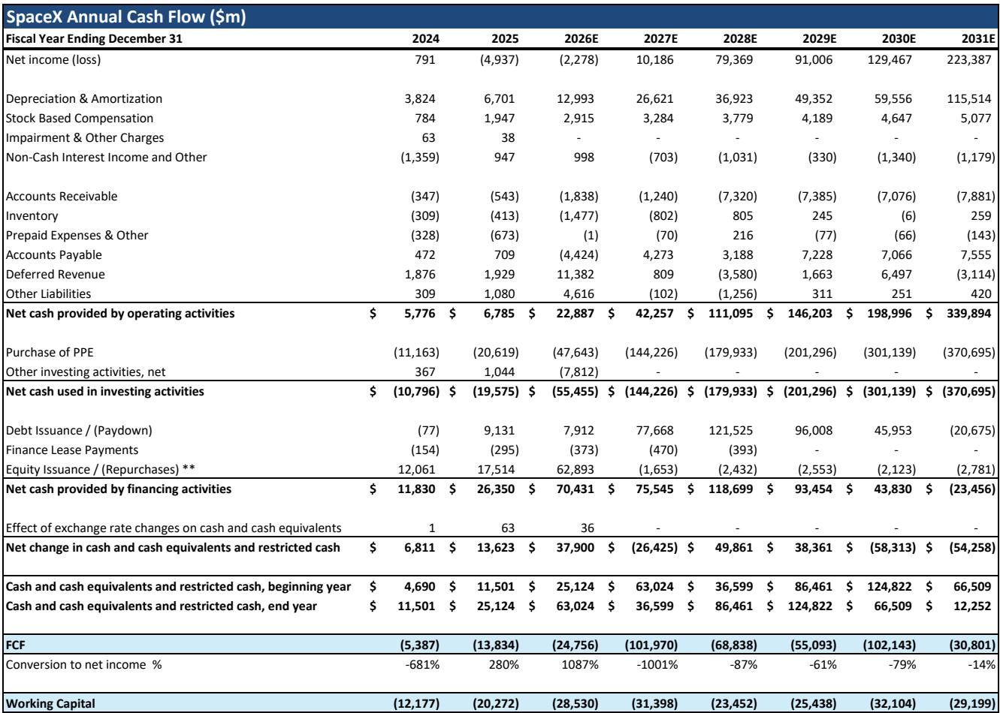
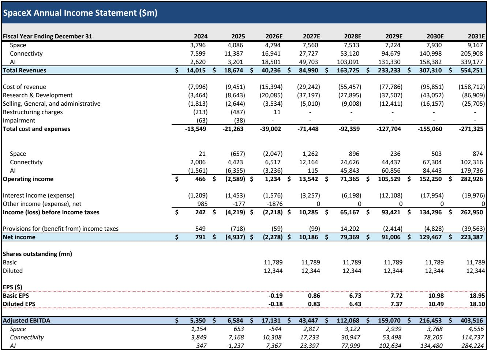
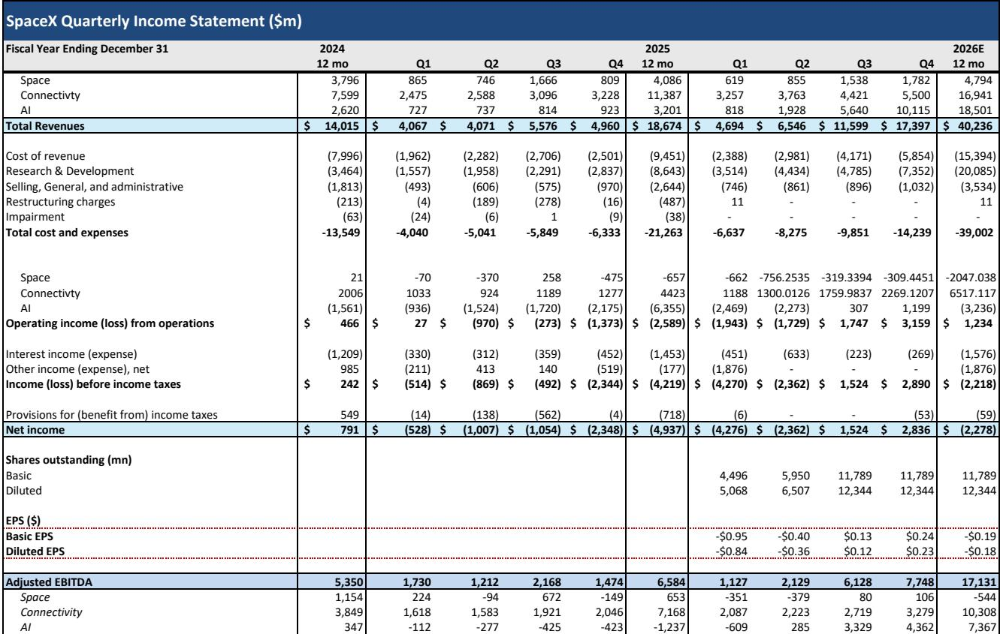

# Bernstein：SpaceX首份业务与近期数据观察

SpaceX 将于 8 月 4 日盘后公布上市以来的首份季度业绩。Bernstein在近期与读者的路演中发现，围绕这家公司的讨论几乎覆盖了商业模式的每个环节——从星舰复用进度到轨道数据中心散热。但真正决定估值走向的，其实只有四个问题。

这份报告的核心判断是：SpaceX 的长期价值建立在轨道数据中心计划之上，而该计划能否成立，取决于星舰快速复用、半导体产能、监管路径和算力需求四个变量。至于中国竞争、Starlink 宽带渗透率、直连设备业务，虽然讨论热烈，但并不改变价值主张的根基。报告同时指出，短期报价波动不应成为关注重点，多万亿美元估值的论证核心是"是否"而非"何时"。

## 1. 星舰热防护系统表现决定复用进度

星舰的完全复用是 SpaceX 价值主张中最关键的一环。Bernstein模型假设 2031 年需要约 3600 次星舰发射，这一数量只有在两级火箭均可快速复用的前提下才能实现。7 月 20 日的第 13 次发射中，助推器在溅落前部分发动机未能点火，但星舰第二级成功回收，热防护系统的完好程度明显优于此前几次发射。

报告认为，如果热防护系统损伤评估结果理想，公司距离复用目标将更近一步。马斯克已表示可能在下次发射中尝试用"筷子"机械臂捕获第二级。目前发射台有两个，另有四个在建，公司还在与州政府协商未来五到六个发射台的选址。从进度看，方向正确，但距离每天至少一次发射的节奏仍有相当距离。

> **KC评论：** 星舰复用不是技术展示，而是成本结构的前提。如果每次发射都要重建火箭，3600 次发射的宏观环境模型完全不成立。热防护系统的损伤程度，比单次发射成败更能说明问题。

## 2. 半导体产能需求指向约五座专用晶圆厂

轨道数据中心对半导体的需求规模是读者质疑较多的领域。按每颗卫星约 120 千瓦功率、2031 年部署 20 吉瓦增量轨道算力计算，需要发射约 17 万颗卫星，对应每年约 280 万片晶圆产能。以单座晶圆厂月产能 5 万片估算，需要约五座专用晶圆厂，建设成本超过 1600 亿美元。

这一数字与公司当前约 1190 亿美元的 Terafab 研究计划相比，差距不算悬殊，但时间表相当紧张。SpaceX 此前没有半导体制造经验，若自建产能无法按期到位，将不得不从现有代工厂和存储厂商获取更多增量产能。报告认为这是合理关切，但存在可行的解决路径。

## 3. 监管审批节奏与发射规模之间仍有落差

FAA 尚未批准星舰的轨道飞行，第 14 次发射可能成为首次轨道尝试。FAA 近期宣布放宽环境限制以支持更高频次发射，但涉及航空航线的评估仍将保留。FCC 的快速审批通道不适用于 SpaceX 提议的超大型星座——包括约 10 万颗卫星的 Starlink V3 和可能高达百万颗的 AI 数据中心星座，两者均未获得完整监管批准。

数据主权是另一个待解问题。报告指出，轨道数据中心的论据在于数据存储于太空、不属于任何国家，因此不涉及数据主权争议，但这一法律定位尚无定论。当发射规模达到数千次量级时，监管路径的走向仍不明朗。

## 4. 算力需求假设与"过剩"不确定性

轨道数据中心计划的前提是全球算力需求持续高企。马斯克曾提出每年向太空发射 1 太瓦算力的远景，Bernstein模型使用的假设远低于此，但依然依赖巨大的算力增量。报告认为，迄今为止全球从未出现过算力过剩，即便 AI 算力建设速度过快，低成本算力方案相对于地面设施仍有价值。

## 5. 中国竞争与 Starlink 业务的讨论边界

中国在 7 月 10 日成功完成长征十号乙火箭第一级回收，比Bernstein预期提前约半年，且已向 ITU 提交超过 20 万颗低轨卫星的申报。但报告认为，中国目前仅实现第一级回收，尚未展示复用能力，而 SpaceX 的猎鹰 9 号已复用近十年，去年完成 165 次发射。长征十号只是部分复用，星舰的目标是完全复用。Bernstein判断中国在发射能力和卫星运营方面落后 SpaceX 约十年。

Starlink 宽带业务方面，报告预计消费、企业和政府客户将快速增长。约 23 毫秒的往返延迟对多数游戏应用不构成障碍，调查显示 Starlink 在消费者宽带服务中满意度最高。其全球网络结构意味着新增任何国家的用户几乎不产生额外成本，定价灵活性突出。Bernstein的美国电。

直连设备业务是报告明确表示怀疑的领域。V2 移动卫星预计 2027 年开始发射，单星容量约为 V1 的 16 倍，但该业务的技术限制和地面配套需求使其前景不明。报告认为，这项业务对 SpaceX 的估值影响有限，最终价值仍取决于轨道数据中心。

> **KC评论：** 报告把讨论对象分成"影响估值"和"不影响估值"两类，这个框架本身值得借鉴。中国竞争和直连设备话题热度高，但在模型里权重有限；真正需要跟踪的是星舰复用、晶圆产能和监管审批这三个可验证的进度指标。

Bernstein对 SpaceX 的估值采用分部加总法，基于 2031 年各业务 EBITDA，对轨道数据中心发射假设延迟一年，连接和 AI 业务分别使用 25% 和 35% 的晚期风投折现率。8 月 4 日的季度数据本身可能不重要，管理层对增长路径的信心程度才是观察重点。

For informational purposes only. Portions may be generated,translated,summarized,or edited with AI assistance based on source materials and may contain omissions or errors. Please verify independently. This is not investment,legal,tax,accounting,or other professional advice.

For informational purposes only. Portions may be generated,translated,summarized,or edited with AI assistance based on source materials and may contain omissions or errors. Please verify independently. This is not investment,legal,tax,accounting,or other professional advice.

